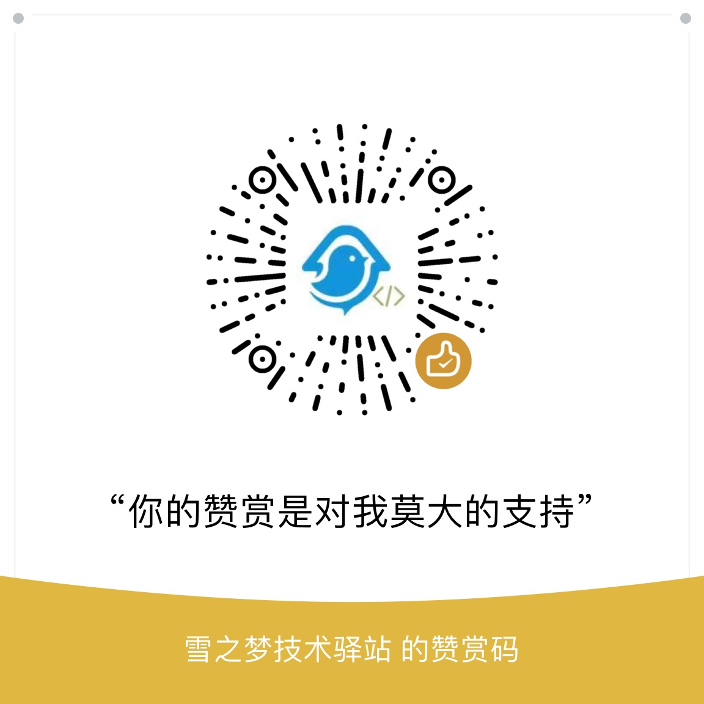

<p align="center">
 
 <h1 align="center">雪之梦技术驿站</h1>
 <p align="center">你在互联网的路上匆匆而来,雪之梦技术驿站助你满载而去.</p>
</p>
  <p align="center">
    <a href="https://github.com/snowdreams1006/snowdreams1006.github.io" target="_blank">
      
    </a>
    <a href="https://github.com/snowdreams1006/snowdreams1006.github.io" target="_blank">
      
    </a>
    <a href="https://github.com/snowdreams1006/snowdreams1006.github.io/issues" target="_blank">
      
    </a>
    <a href="https://github.com/snowdreams1006/snowdreams1006.github.io/pulls" target="_blank">
      
    </a>
    <a href="https://github.com/snowdreams1006/snowdreams1006.github.io" target="_blank">
      
    </a>
    <br/>
    <br/>
    <a href="https://github.com/snowdreams1006/snowdreams1006.github.io" target="_blank">
      
    </a>
    <a href="https://github.com/snowdreams1006/snowdreams1006.github.io" target="_blank">
      
    </a>
    <a href="https://github.com/snowdreams1006/snowdreams1006.github.io" target="_blank">
      
    </a>
     <a href="https://github.com/snowdreams1006/snowdreams1006.github.io" target="_blank">
      
    </a>
  </p>
  <p align="center">
    <a href="https://github.com/anuraghazra/github-readme-stats/issues/new/choose" target="_blank">报告 bug</a>
    ·
    <a href="https://github.com/anuraghazra/github-readme-stats/issues/new/choose" target="_blank">请求增加功能</a>
  </p>
</p>
<p align="center">喜欢这个项目？请考虑<a href="./snowdreams1006-wechat-donate.jpg" target="_blank">捐赠</a>来帮助它完善！</p>

## 简介

教程分享均是笔者亲身学习经验总结,涉及到的知识点均亲身试验,但有时为了知识完整性,可能并未亲自确认,对于这部分内容会明确指出,到时由读者确认试验.

如果读者实际运行效果和教程演示效果有出入,很可能是版本问题,系统环境等原因,希望能及时反馈,避免更多人踩坑,谢谢!

- [](https://snowdreams1006.tech/)
- [](https://snowdreams1006.gitee.io/)
- [](https://snowdreams1006.github.io/)
- [](https://snowdreams1006.gitlab.io/)
- [](https://snowdreams1006.gitbook.io/)

> 国内用户推荐访问 [snowdreams1006.tech](https://snowdreams1006.tech/) ,速度非常快并且和 [snowdreams1006.github.io](https://snowdreams1006.github.io/) **保持同步更新**.

## 教程特点

- 面向初学者,适合零基础入门;
- 面向常用操作,技能实用性强;
- 情景教学,理清事情来龙去脉;
- 章节重点知识小结,精华集锦;

## 学习要求

- 保持哲学三问,是什么,为什么,怎么样?希望最终能有你自己的答案;
- 好记性不如烂笔头,亲自动手操作一遍,你会发现你的理解更上一层楼;
- 授人以鱼不如授人以渔,希望带给你不仅仅是知识更多的是学习的方法;
- 知识重在分享才有价值,鼓励知识传播与分享,创造收益更有价值;
- 因本人能力有限,如有出入,敬请指正,请联系我 [snowdreams1006](https://github.com/snowdreams1006/)

## 怎么联系


/assets/image/play.png,/assets/audio/snowdreams.mp3


### 第三方平台

- [](https://snowdreams1006.github.io/snowdreams1006-wechat-public.jpeg)
- [](https://www.toutiao.com/c/user/86185341500/#mid=1624534658539532)
- [](https://space.bilibili.com/236627025)
- [](https://www.imooc.com/u/5224488/articles)
- [](https://www.jianshu.com/u/577b0d76ab87)
- [](https://snowdreams1006.blog.csdn.net/)
- [](https://www.cnblogs.com/snowdreams1006/)
- [](https://juejin.im/user/582d5cb667f356006331e586)
- [](https://segmentfault.com/u/snowdreams1006)
- [](https://my.oschina.net/snowdreams1006)
- [](https://cloud.tencent.com/developer/user/2952369/activities)

### 微信公众号 

> 名称 : `雪之梦技术驿站`,微信号 : `snowdreams1006` 

关注理由:

开源的不开源的都会发布到微信公众号,不再局限于系列教程而是随性而为,展示真实的技术人生.


### 个人微信号

> 名称 : `雪之梦技术驿站`,微信号 : `snowdreams1109`

适用场景:

如果三言两语很难阐释你遇到的问题,如果你是人见人爱的妹子,那么欢迎加我私人微信一起畅谈人生.


## 克隆网站

### 下载项目

`Github` 作为远程项目服务器时下载速度感人,而国内用户使用 `Gitee` 进行下载时速度明显提升,因此下载项目时推荐使用 `Gitee` 作为远程项目仓库.

**核心思路**

- [Github](https://github.com/snowdreams1006/snowdreams1006.github.io)
- [Gitlab](https://gitlab.com/snowdreams1006/snowdreams1006.gitlab.io)
- [Gitee](https://gitee.com/snowdreams1006/snowdreams1006)

如果以 `Github` 作为主要远程仓库,全量下载项目代码时首先切换到 `Gitee` 远程仓库地址进行下载,然后增量更新时再切换回 `Github` 远程仓库地址进行更新,以此保持最新代码状态.

```bash
# 使用 https 方式下载 Gitee 源码
git clone https://gitee.com/snowdreams1006/snowdreams1006.git

# 重命名
mv snowdreams1006/ snowdreams1006.github.io/

# 切换到项目
cd snowdreams1006.github.io

# 切换回 Github 远程仓库地址
git remote set-url origin https://github.com/snowdreams1006/snowdreams1006.github.io.git

# 更新项目源码
git pull
```

如果以 `Gitee` 作为远程仓库,无论下载还是更新均无需切换远程项目地址,正常下载更新即可.

```bash
# 使用 https 方式下载 Gitee 源码
git clone https://gitee.com/snowdreams1006/snowdreams1006.git

# 切换到项目
cd snowdreams1006
```

### 部署项目

不论是直接下载 `zip` 压缩包还是命令行克隆项目,接下来需要使用 `gitbook` 相关命令进行启动本地服务,正常情况下运行效果和线上环境相差无二.

> `gitbook` 环境需要本机安装 `nodejs` 环境,个别插件可能还需要额外环境依赖,具体情况请参考 [gitbook入门教程](/myGitbook/)

```bash
# 安装项目插件
gitbook install

# 运行本地服务
gitbook serve
```

一般情况下,服务启动后会在本机 `4000` 端口开启服务,可以打开浏览器访问 `localhost:4000` 或者 `127.0.0.1:4000` 进行访问.

本地服务确认无误后,可使用 `gitbook build` 生成静态网站,然后将其上传到服务器直接部署即可,例如可以将 `_book/` 文件夹下的静态网站全部上传到 `Github` 网站,上传成功后即可访问在线网站: `https://snowdreams1006.github.io/`

```bash
# 生成静态网站,生成完毕后全部网站文件位于_book文件夹中.
gitbook build

# 将静态网站文件夹_book全部复制到当前目录,保证首页存在index.html文件
cp -rf ./_book/* ./

# 添加到版本库等待上传 Github
git add .

# 添加更新说明
git commit -m "regenerate website"

# 推送到远程仓库,推送成功后等待一段时间后在线服务即可开启.
git push
```

> 推送到远程仓库要求用户对该仓库具有写权限,因此建议 fork 本项目到个人空间,这样就可以体验完整的个人博客搭建流程.

### 多处备份

如果远程仓库只有`Github` 一种,发生意外情况的话将直接影响到网站运行,所以可以考虑将网站进行多处备份,目前本项目已经备份到 `Gitee` 和 `Gitlab` 网站.

-  一个 pull + 多个 push

本项目以 `Github` 为主,`Gitee` 和 `Gitlab` 为辅,具体表现为: 当本地环境需要更新项目时,拉取自 `Github` 仓库源码,推送项目时,一次性同时推送到多个仓库.

```bash
# 添加 Gitee 推送地址
git remote set-url --add origin git@gitee.com:snowdreams1006/snowdreams1006.git

# 添加 Gitlab 推送地址
git remote set-url --add origin git@gitlab.com:snowdreams1006/snowdreams1006.gitlab.io.git
```

设置完成后,以后使用 `git push` 进行推送就会一次性同步到多个远程仓库,当然需要先确保已将该项目导入到相应的仓库并且能正常通讯.

- 多套 pull + push

如果希望拉取地址和推送地址是对应的,可以使用下面这种方式建立多套远程仓库地址.

```bash
# 添加 Github 远程仓库地址,拉取或推送时需要指定仓库名称,例如: git push github master
git remote add github git@github.com:snowdreams1006/snowdreams1006.github.io.git

# 添加 Gitee 远程仓库地址,拉取或推送时需要指定仓库名称,例如: git push gitee master
git remote add gitee git@gitee.com:snowdreams1006/snowdreams1006.git

# 添加 Gitlab 远程仓库地址,拉取或推送时需要指定仓库名称,例如: git push gitlab master
git remote add gitlab git@gitlab.com:snowdreams1006/snowdreams1006.gitlab.io.git
```

上述两种方式并不冲突,如果愿意的话也可以两者同时设置,好处是一般情况下拉取源码时从 `Github` 下载,推送源码时自动同步到多个远程仓库.
如果遇到特殊情况也可以单独指定远程仓库,例如长时间没更新项目再次更新下载速度比较慢,也可以指定远程仓库 `Gitee` 等等.

最后,运行 `git remote -v` 命令可查看远程项目关联情况,实现一份代码多处备份.

```bash
$ git remote -v
gitee   git@gitee.com:snowdreams1006/snowdreams1006.git (fetch)
gitee   git@gitee.com:snowdreams1006/snowdreams1006.git (push)
github  git@github.com:snowdreams1006/snowdreams1006.github.io.git (fetch)
github  git@github.com:snowdreams1006/snowdreams1006.github.io.git (push)
gitlab  git@gitlab.com:snowdreams1006/snowdreams1006.gitlab.io.git (fetch)
gitlab  git@gitlab.com:snowdreams1006/snowdreams1006.gitlab.io.git (push)
origin  git@github.com:snowdreams1006/snowdreams1006.github.io.git (fetch)
origin  git@github.com:snowdreams1006/snowdreams1006.github.io.git (push)
origin  git@gitee.com:snowdreams1006/snowdreams1006.git (push)
origin  git@gitlab.com:snowdreams1006/snowdreams1006.gitlab.io.git (push)
```

## 相关说明

本教程源码托管在 [snowdreams1006.github.io](https://github.com/snowdreams1006/snowdreams1006.github.io) ,在线阅读请访问 [snowdreams1006.github.io](http://snowdreams1006.github.io/).

**感谢支持**

如果你觉得本教程对你有所帮助,请不吝 `Star`.
如果你想贡献一份力量,欢迎提交 `Pull Request`.

**赞赏捐助**



> 赞赏不赞赏无所谓,有则喝茶,无则喝水.安得广厦千万间,大庇天下寒士俱欢颜!
