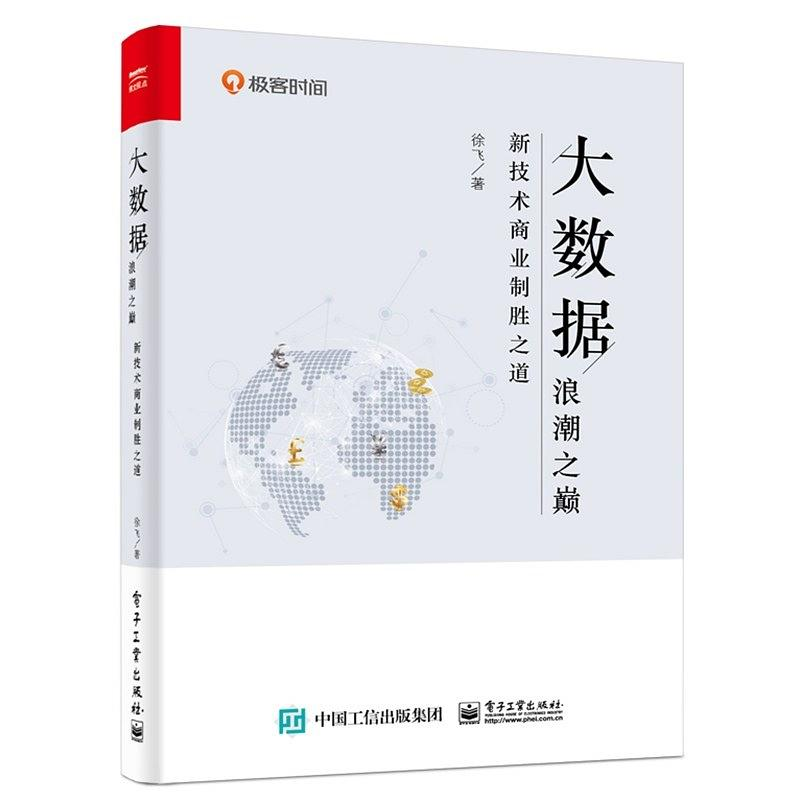

# 大数据浪潮之巅:新技术商业制胜之道

这本书讲述了大数据的发展史,描述了一幅波澜壮阔的宏大场面,有的公司迎难而上抓住机遇,有的公司错失良机失之交臂,看到的不是技术而是一系列的历史事件.

富有趣味性,让人爱不释手,通宵看完意犹未尽,值得推荐,好书!

## 作者简介

徐飞,著名大数据专家.拥有浙江大学本科学位,美国佛罗里达大学计算机博士学位,研究方向为数据库系统.
从事大数据的基础架构研发 10 余年,先后在微软和 `Tableau` 等知名公司的大数据核心团队工作.担任过首席架构师.
在国际顶尖会议和杂志上发表论文 10 余篇.
2016 年开通微信公众号"飞总聊 IT",并原创"大数据那些事"系列文章,系统阐述了大数据发展史,以及发展过程中的种种技术和商业决策案例,受到广泛好评.

## 内容简介

本书以各个企业在大数据浪潮中跌宕起伏的经历为核心来讲述大数据发展史,并分析各个大数据企业迥异的发展历程,探讨在新技术浪潮来临时应该如何应对.

本书主要分为两部分,前半部分讲述谷歌,微软,IBM,雅虎,亚马逊,阿里巴巴等大公司在大数据浪潮中的发展史,后半部分讲述各个大数据创业公司的发展历程和现状.
在每部分的后面,还通过专门的文章分析并总结了各企业在大数据浪潮中的作为和选择所产生的影响.
全书从公司的视角出发为大家呈现了一幅波澜壮阔的大数据领域发展史,读者不仅可以了解大数据技术,更能领略大数据领域的全貌,从各公司的故事中吸取教训,学习思路.

本书适合对大数据技术和商业思维有兴趣的读者阅读.

## 目录

1. 谷歌的大数据路: 从拥有"三驾马车"到丧失先发优势 
> 谷歌的“三驾马车”开启了大数据时代,然而在这个新时代里,谷歌却丧失了先发优势.
> 这是为什么呢?我认为是谷歌对待开放架构的态度相对保守导致的.

2. 谷歌的大数据路: 一场影响深远的论战 
> 在大数据发展史上,以迈克尔·斯通布雷克为代表的数据库元老级人物,针对MapReduce向谷歌提出了质疑.
> 这场著名的论战给整个业界带来了动荡,最后诞生了Spark.

3. 谷歌的大数据路: 谷歌的"黑科技"
> 在大数据的上半场,谷歌以"三驾马车"引领时代,但后来因为决策失误丧失了先发优势;
> 而在大数据的下半场,谷歌带着"黑科技"Spanner数据库系统闪亮登场,效果如何呢？

4. 如何读懂类似谷歌"三驾马车"这样的技术论文
> 读懂一篇技术论文,首先需要明白"论文是写给谁看的"和"论文是怎么写出来的"这两个基本问题,然后就可以有针对性地提升自己阅读论文的功力.

5. 雅虎：大数据领域的"活雷锋"
> 雅虎,这个早已淡出我们视线的公司,却是大数据领域的"活雷锋",可以说正是它促成了今天的Hadoop生态圈.这篇文章就来说说它的故事.

6. IBM的大数据路——起早贪黑赶了个晚集
> 作为历史悠久的计算机公司,IBM早早涉足了大数据领域,最终却只能寄希望于比自己的产品起步还要晚的Spark,我们来看看其中发生了什么.

7. 三大社交媒体公司对Hadoop生态圈的贡献
> 雅虎把Hadoop开源以后,当时著名的三大社交媒体公司Facebook,LinkedIn和Twitter都加入了这个生态圈,并做出了巨大贡献.Hadoop生态圈给我们的启示是,抱团取暖才是生存之道.

8. 微软的大数据发展史: 微软硅谷研究院
> 微软硅谷研究院曾经在微软的大数据发展历程中扮演了非常特殊的角色,它推出的Dryad和DryadLINQ可以说是两个另类的产品,虽然未曾大受欢迎,却对大数据的发展有着不可磨灭的贡献.

9. 微软的大数据发展史: 必应的Cosmos 
> Cosmos是微软必应搜索引擎下面的团队开发的大数据基础架构,代表了微软在大数据方面的最高成就.

10. 微软的大数据发展史: Azure的发展
> 微软大数据发展史上的另一个分支是微软云计算平台下的大数据项目Azure.
> 这个项目产生了HDInsight,Azure Data Lake,CosmosDB三大平台,但最后只有CosmosDB取得成功.

11. 亚马逊的大数据故事: 从先驱者到一味索取者 
> 在大数据技术发展的早期,亚马逊发表了Dynamo系统的论文,成为和谷歌"三驾马车"的论文一样具有深远影响的论文.
> 然而随着大数据的发展和Hadoop生态圈的建立,亚马逊对大数据圈的贡献极少,但亚马逊自己却从中获得了巨大的利益.

12. 亚马逊的大数据故事: 创新和"拿来"并存的云服务
> 亚马逊不仅在Hadoop生态系统里蓬勃发展，还推出了自己的数据分析产品.这些产品有些是亚马逊自己研发的,有些则只是对开源的产品进行了包装.但是，亚马逊一如既往地没有反哺开源项目.

13. 阿里巴巴的大数据故事: 数据分析平台发展史
> 国内大数据平台做得最好的公司当属阿里巴巴.
> 本文就来介绍一下阿里巴巴数据分析平台的发展情况: 数据分析平台的叠加开发.

14. 阿里巴巴的大数据故事: 流计算引擎发展史
> 在阿里巴巴的发展过程中,流数据处理一直是一项十分重要的技术,阿里巴巴也在这方面做了很多有意义的项目.
> 本文就来介绍一下阿里巴巴的流计算引擎JStorm与Blink的发展史.

15. 大公司的大数据战略得失: 自建"轮子"成本高
> 大公司的大数据平台可分为两类,一类是自己搭的基础架构(自建"轮子"),另一类是抱团取暖所形成的Hadoop生态圈,两者各有利弊.本文将分析第1种情况,主要以谷歌,微软,阿里巴巴自己搭建的大数据平台架构为代表.

16. 大公司的大数据战略得失: 抱团取暖的Hadoop生态圈
> 除了自建"轮子"的公司,其他各大公司走向了一条抱团取暖的道路,就是你搭一个模块,我搭一个模块,大家一起开源出来,最后组成了一个叫作Hadoop的生态圈.
> 其中有为社区积极做贡献的公司,也有以赚钱为目的的公司,还有一味索取的公司.

17. Hadoop三国之"魏国"——Cloudera
> Hadoop领域曾经有三家发行商互相角逐,其中不乏各种战术与谋略,仔细琢磨,你会发现这三家公司的关系与三国时期的魏蜀吴之间的关系非常相似.本文讲述Hadoop三国之"魏国"——Cloudera的故事.

18. Hadoop三国之"吴国"——MapR
> Hadoop三国之"吴国"MapR,实力强大却很少参与竞争,这篇文章就来说说它特立独行的故事.

19. Hadoop三国之"蜀国"——Hortonworks
> Hadoop三国之"蜀国"Hortonworks始终坚持100%开源,本文讲述它的故事.

20. Hadoop及其发行商的未来
> Hadoop已诞生十多年,围绕其生态圈诞生了诸多企业,例如前面讲的社交媒体公司,三大发行商,而亚马逊却最终成为最大的受益者.

21. 文档数据库的缔造者MongoDB(上)
> MongoDB的诞生像一场意外.它是一个文档型数据库,由10gen公司开发,以易用性闻名.
> 本文就来讲述MongoDB团队的开发重心,商业运作模式和产品盈利方式.

22. 文档数据库的缔造者MongoDB(下)
> MongoDB的开发团队一向重视用户体验而不重视核心功能,其负面影响终于以一次安全危机的方式暴露.
> 加上公司曾经获得具有CIA背景的风投公司的投资,这一并引起了很多人的顾虑.
> 当然,这一切都挡不住MongoDB公司最终的成功上市.

23. 以MongoDB为例,看基础架构类产品创业
> 作为一款基础架构类产品,MongoDB以其易用性闻名,然而MongoDB的开发者不注重系统的可靠性,只注重可用性,导致很多MongoDB的用户转向了其他产品.
> 基础架构类产品的创业者应该如何平衡可用性和可靠性?这是一个值得深思的问题.

24. 直面MongoDB,谈微软的N0SQL战略
> 2013年,MongoDB在数据库市场中的占有率很高,成为很多创业者和初创企业的首选.
> 微软究竟做了哪些事情,将Cosmos DB变成能与MongoDB竞争的产品的呢?

25. Palantir: 神秘的大数据独角兽公司
> Palantir是一家神秘的大数据创业公司,由硅谷著名投资人彼得·蒂尔创办,其主要服务对象是美国政府部门,特情组织和军队,所以外界对其了解甚少.

26. Splunk: 机器日志数据分析帝国
> Splunk是大数据圈里少有的盈利并且蓬勃发展的企业.
> 它主要服务于机器日志数据分析领域,随后又不断拓展业务,演变开发了若干不同类型的软件.
> 在本文中我们就来好好聊聊Splunk的进阶史.

27. Confluent: Kafka项目背后的公司
> Kafka是LinkedIn开发的开源项目,它主要通过日志文件传输的方式在不同的数据源之间同步数据.
> 而Confluent公司是Kafka开源项目的创始人离开LinkedIn以后所创立的公司,主要致力于Kafka项目的商业化.
> 在本文中,我们来讲讲这家公司的故事.

28. Powerset: HBase的"老东家"
> Powerset是一家在多年前被微软收购的创业公司,目前在语义搜索方面开疆拓土.
> 它为开源社区贡献了BigTable的Hadoop版实现.
> 本文就来讲讲这家公司的发展史.

29. Cassandra和DataStax公司的故事
> Cassandra是开源社区仿照Amazon Dynamo开发的产品,它最初由Facebook开发并开源,却又被公司内部弃用.
> 创业公司DataStax对Cassandra大力支持,造就了今日繁荣的Cassandra社区。

30. Databricks: Spark的数据"金砖"王国
> Spark是Hadoop生态圈里大红大紫的项目,它甚至取代了Hadoop MapReduce的地位.
> Databricks是对这个项目进行商业化的企业.
> 本文就来聊聊这家企业的故事.

31. Data Artisans和浴火重生的新一代大数据计算引擎Flink
> Data Artisans是对Flink进行商业化的公司.
> Apache Flink是一个年轻的新型处理引擎,是Hadoop社区里Spark的主要竞争对手.
> Flink设计理念先进,但是工程实现方面相对落后.

32. Dremio: 基于Drill和Arrow的大数据公司
> Dremio是另外一家大数据创业公司,其创始人是从MapR公司跳槽出来的.
> Dremio的主要产品就是Dremio项目,它吸收了MapR主导的开源项目Drill的精华,以开源项目Arrow为核心开发.
> 本文就来讲讲Dremio公司和Dremio平台的来龙去脉.

33. Imply: 基于Druid的大数据分析公司
> 开源大数据项目Druid由Metamarkets开发.
> 开始时籍籍无名,后来被一些大公司,尤其是Airbnb使用和推广以后,受到了很多关注.

34. Kyligence: 麒麟背后的大数据公司
> 麒麟(英文名字是Kylin)是第1个全部由中国人主导的Apache顶级开源项目,Kyligence则是对这个项目进行商业化的公司.
> 本文就来看看麒麟和Kyligence的故事.

35. Snowflake: 云端的弹性数据仓库
> Snowflake是一个构建在云端的弹性数据仓库,它背后的公司与之同名.
> Snowflake公司的创始人和管理层都有强大的背景,本文就来讲一下Snowflake及其公司的故事.

36. TiDB：一个国产新数据库的创业故事
> TiDB是位于北京的一家创业公司PingCAP的产品,它的目标是实现一个开源的类似谷歌Spanner的系统,这个产品非常有特色,本文就来聊聊TiDB和它背后的公司.

37. 大数据创业公司的前景: 红海vs.蓝海
> 关于创业的市场,通常有红海和蓝海的说法,蓝海容易成功,红海相对艰难.
> 对大数据创业公司来说,蓝海多半指的是应用软件类的市场,而红海指的则是基础架构软件类的市场.
> 本文将对比分析一下这两类市场.

38. 如何通过分析企业的技术积累来判断其发展前景
> 通过分析企业的技术积累,能够有效地判断企业的发展前景如何.
> 我们需要关注三个方面: 技术适用的场景是否有巨大的盈利空间,技术本身是否有领先和独到之处,以及技术的积累是否足够深和广.

## 总结分析