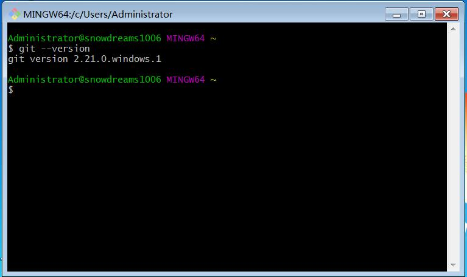

# 安装 git

`git` 目前支持 Linux/Unix、Solaris、Mac和 Windows 平台上运行,根据自身环境选择安装.

## Linux 系统

linux 系统安装软件大致有两种途径,一种是利用安装包管理工具安装,另一种采用源码包安装方式.

安装前先确认下是否之前已安装过,在命令行窗口输入`git --version` ,如果打印出版本号则表示已安装,否则参考一下内容进行安装.

查看 `git` 版本

```
git --version
```

### Debian/Ubuntu

```
# 安装 git 依赖
apt-get install libcurl4-gnutls-dev libexpat1-dev gettext \
  libz-dev libssl-dev

# 安装 git
apt-get install git

# 查看 git 版本
git --version
```

### Centos/RedHat

```
# 安装 git 依赖
yum install curl-devel expat-devel gettext-devel \
  openssl-devel zlib-devel

# 安装 git
yum -y install git

# 查看 git 版本
git --version
```

>`git-core` 和 `git` 历史渊源:
>
>以前有个软件也叫GIT(GNU Interactive Tools),所以`git`只能叫`git-core`了,后来由于`git`名气实在太大以至于`GNU Interactive Tools`改名成`gnuit`,而`git-core`正式改为`git`.

### 源码安装

先从[git 官网](http://git-scm.com/downloads)下载指定版本源码,然后解压,依次输入：`./config`,`make`, `sudo make install` 这几个命令安装到指定目录即可.

#### Debian/Ubuntu

```
# 安装 git 相关依赖
apt-get install libcurl4-gnutls-dev libexpat1-dev gettext \
  libz-dev libssl-dev

# 下载指定版本源码包
wget https://github.com/git/git/archive/v2.21.0.tar.gz

# 解压
tar -zxf v2.21.0.tar.gz

# 切换到 git目录
cd git-2.21.0

# 安装
make prefix=/usr/local all

# 安装
sudo make prefix=/usr/local install  
```

#### Centos/RedHat

```
# 安装 git 相关依赖
yum install curl-devel expat-devel gettext-devel \
  openssl-devel zlib-devel

# 解压
tar -zxf v2.21.0.tar.gz

# 切换到 git目录
cd git-2.21.0

# 安装
make prefix=/usr/local all

# 安装
sudo make prefix=/usr/local install  
```

## Windows 系统

直接从[git 官网](http://git-scm.com/downloads)下载安装程序,然后按默认选项安装即可.
安装完成后,在开始菜单里找到`Git->Git Bash`,弹出命令行窗口,则说明安装成功！



## Mac 系统

一般有两种安装方式,一种是利用 mac 的`homebrew`管理工具安装`git`,具体安装方法参考[homebrew官方文档](https://brew.sh/index_zh-cn)

另一种方法安装`xcode`默认集成`git`,首先从 App Store下载 [xcode](https://itunes.apple.com/cn/app/xcode/id497799835?mt=12) ,下载完成后运行`Xcode`，选择菜单`Xcode->Preferences`，在弹出窗口中找到`Downloads`，选择`Command Line Tools`，点`Install`就可以完成安装了


