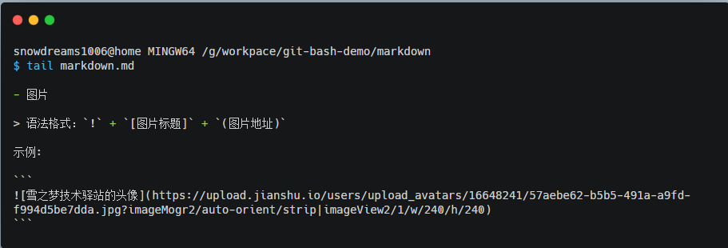
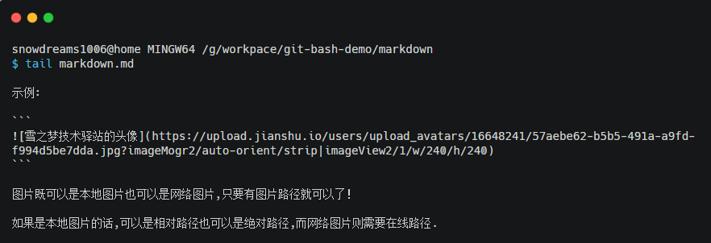
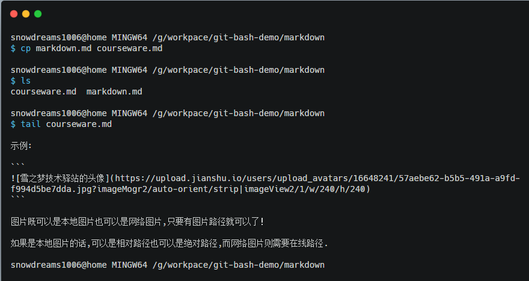

# git bash 常用命令

众所周知,现实世界和计算机世界是不同的,但是计算机作为人类对现实世界的抽象模拟,在一定程度上,具备了现实世界的基本特征,本文将以哲学角度对比分析现实世界和计算机世界,试图以浅显易懂的方式感受现实世界和计算机世界的联系.

首先请先回顾一下哲学的基本问题问题: 我是谁,我在哪以及我要干什么?

接下来我们逐步探讨下两个世界的关联,顺便学习下 `Git Bash` 支持的常用命令以及 `git` 的基本操作.

## 哲学第一问: 我是谁

现实生活中我们每个人都有名字,身份以及责任.正是由**自我和他人**一起构成了"我是谁"这一基本问题: 是儿子,是丈夫,是父亲,是社会中的一份子.

但是,在计算机世界中,**我**又是谁呢?

计算机世界是虚拟世界,有的只是冰冷冷的程序和数据,有限的人机交互才创造了"我",所以弄清楚"我是谁"的问题至关重要.

> `whoami` : `who am i` 的缩写,即打印出当前登录用户.

计算机世界中,"我"表现为一个账号,用户名是唯一标识.在这个世界上不止一个用户，同一台电脑支持多个账号.

所以,"我"是计算机的用户,哪天警察检查身份证时,需要自报家门,如果你都不知道你的名字那岂不是闹笑话了？

```bash
snowdreams1006@home MINGW64 ~
$ whoami
snowdreams1006
```

## 哲学第二问: 我在哪

不论是武侠小说主角突然失忆还是被绑架桥段,第一句总是： "我是谁？这是哪？"或者"你是谁？这是哪？".

不仅现实世界人很多,计算机世界的用户也不止一个,目录更是数不胜数.
所以，我们第二个问题就要探讨一下"我在哪"的基本问题.

> `echo ~` : `echo` 翻译为"回声",直接表现为输出某命令的执行结果,`~` 代表用户的"家"目录,即输出家目录.

现实世界中我们每个人都有自己的家,计算机世界也不例外.每个用户都有自己的家目录

试想一下,如果没有心灵的港湾,灵魂和身体该如何安放?如果没有家目录,数据默认存放到哪里去？多个用户之间的数据怎么保证相对隔离？

```bash
snowdreams1006@home MINGW64 ~
$ echo ~
/c/Users/snowdreams1006
```

## 哲学第三问: 我要干什么

现实世界中,每个人出生后会慢慢长大,或一直留在家乡或外出闯荡,终其一生，生不带来，死不带去.

其中最直观表现为每个人基本上都要工作,从而维持生活,继而创造社会价值.不论是当地就业还是外出就业,我们上班的地点被称为**工作地点**.

家只有一个,工作地点却可以有多个,可以换工作换工作地点,但是永远只有一个家,是故乡,是出生地,是心灵的港湾.

如果这种场景反映到计算机世界,又是怎样一番场景呢?

既然和计算机打交道,不论什么交互方式,最终都无外乎输入输出两种形式.输入的是我们的投入,输出的是我们的产出.

输入输出的数据需要存储在计算机中,是以文件的形式有组织地保存起来,保存数据的目录就是工作目录,不是自己的家目录的其他目录都是我们的工作目录.

这样看起来,原来在计算机中换工作竟然这么容易,**不是家目录的其他目录都是工作目录**.

### 万丈高楼平地起: 创建目录

> `mkdir [OPTION] DIRECTORY` : `make directory` 的缩写,即创建目录.

万丈高楼平地起,计算机人生刚刚起步,需要搭建好大厦的基础框架,然后再往里面一点一点加东西,终将变成摩天大厦！

立下明确目标,坚定不移前往目的地,工作目录已创建,第一步已经迈出去,接下来准备前往新创建的工作目录,搭建好我们自己的高楼大厦.

```bash
snowdreams1006@home MINGW64 ~
$ mkdir /g/workpace/git-bash-demo
```

### 飘洋过海来看你: 切换目录

> `cd [-L|[-P [-e]] [-@]] [dir]` : `change directory` 的缩写,即切换目录.

既然选择了前方,便只顾风雨兼程.心中的大厦蓝图等待去实现,不论是从家目录出发还是工作目录出发,既然目标工作目录已经确定,接下来如何出发便不是太麻烦的事情了.

现实世界中出发到工作地点,可以坐高铁,坐轮船,坐飞机等多种交通方式任你挑选,在计算机世界中前往工作目录就很简单,只要明确知道工作目录,一条命令瞬间直达！

```bash
snowdreams1006@home MINGW64 ~
$ cd /g/workpace/git-bash-demo
```

### 惊鸿一瞥初相见: 打印目录

> `pwd [-LPW]` : `print working directory` 的缩写,即打印工作目录.

初次来到新的工作地点,第一件事就是查看当前位置以便确认漂洋过海的经历没有白费。

非家目录的其他目录都是工作目录,确认工作目录是目标目录后就可以正式投入紧张有序的工作生活中了,准备好了吗？

```bash
snowdreams1006@home MINGW64 /g/workpace/git-bash-demo
$ pwd
/g/workpace/git-bash-demo
```

### 回头四顾心茫然: 列出文件

> `ls [OPTION] [FILE]` : `list file` 的缩写,即列出文件.

刚刚进入新环境,本想查看一下周围环境和同事打个招呼,蓦然发现: 周围空无一人.

空荡荡的房子提醒着自己,万丈高楼平地起,创业道路孤独而艰辛！

```bash
snowdreams1006@home MINGW64 /g/workpace/git-bash-demo
$ ls
```

### 保温杯中泡枸杞: 创建文件

> `touch [OPTION] [FILE]` : 翻译为"触摸",有则改之无则新增,即如果文件已存在则更新权限和修改时间,否则新建文件.

身体是革命的本钱,即将开始废寝忘食的创业之旅,在高强度的工作来临之前,先检查一下保温杯在不在,在的话,洗一洗,不在的话,先去买一个再洗一洗.

```bash
snowdreams1006@home MINGW64 /g/workpace/git-bash-demo
$ touch cup.txt
```

### 枸杞茶中加枸杞: 覆盖输入

> `>` : 覆盖输入,不论目标文件是否已有内容,新内容直接覆盖原文件内容.

保温杯中泡枸杞,第一步先往保温杯中加入枸杞,如果有其他东西先倾倒然后再加入枸杞,否则直接加入枸杞.

```bash
snowdreams1006@home MINGW64 /g/workpace/git-bash-demo
$ echo "medlar" > cup.txt
```

> `echo` "medlar" 即输出枸杞,`>` 是重定向操作,将上一步的输出结果当做下一步的输入参数,`cup.txt` 是保温杯,因此该组合命令表示将枸杞倒入保温杯.

### 枸杞茶中倒热水: 追加输入

> `>>` : 追加输入,在原有文件内容后面追加新内容,新内容不会覆盖原文件内容.

保温杯中已有枸杞,第二步开始倒水准备泡枸杞茶,枸杞自然不能倾倒出去,不然就叫做白开水不能叫做枸杞茶了.

```bash
snowdreams1006@home MINGW64 /g/workpace/git-bash-demo
$ echo "water" >> cup.txt
```

### 枸杞茶要慢慢品: 查看文件

> `cat [OPTION] [FILE]` : `concatenate` 的缩写,翻译为"连接",即查看文件内容.

枸杞只需一点点,温水适量,不多也不少才是最好,最好亲自品尝一下才能决定如何继续调整.

要看到文件的全部内容正如要看到枸杞茶整体一样,后续操作视观察结果而定.

```bash
snowdreams1006@home MINGW64 /g/workpace/git-bash-demo
$ cat cup.txt
medlar
water
```

### 枸杞茶要再调整： 追加并查看文件

枸杞差不多,浓度有点大,需要再加一点水,为了控制加入量,还要再品一下枸杞茶.

```
# 追加文件内容
snowdreams1006@home MINGW64 /g/workpace/git-bash-demo
$ echo "more water" >> cup.txt
snowdreams1006@home MINGW64 /g/workpace/git-bash-demo

# 查看文件内容
$ cat cup.txt
medlar
water
more water
```

### 三更灯火五更鸡: 编辑文件

> `vim [OPTION] [FILE]` : `Vi IMproved` 的缩写,`vi = VIsual = Very Inconvenient` 是命令行编辑工具,`vim` 即 `vi` 的增强版,编辑文件.

先设定整体目标,做好全局性计划,然后再是根据目标确定详细具体的工作安排.

```bash
# 在命令行编辑器中编辑 goal.txt 文件,如果没有会自动创建.
$ vim goal.txt
```

进入编辑器后的基本命令

- `i` : `insert` 的缩写,翻译为"插入",即切换到编辑模式.
- `esc` : `escape` 的缩写，翻译为"逃跑",即切换到命令模式.
- `:w` ： `write` 的缩写,翻译为"保存",即保存文件内容.
- `:q` : `quit` 的缩写，翻译为"退出",即退出 `vim` 编辑器.
- `:wq` : `write and quit` 的缩写，翻译为"保存并退出",即保存并退出 `vim` 编辑器.
- `:q!` : `quit force` 的缩写,翻译为"强制退出",即不提示未保存强制退出.
- `gg` : 定位到文件开头.
- `G` ： 定位到文件结尾.
- `yy` : 复制整行.
- `dd` : 剪切整行.
- `p` : 粘贴.
- `u` : 撤销.
- `ctrl + f` : 下翻整页.
- `ctrl + b` : 上翻整页.
- `ctrl + d` : 下翻半页.
- `ctrl + u` : 上翻半页.
- `/<string>` : 查找<string>字符串

编辑后的目标,学习 `markdown` ,学习 `git` ,学习 `gitbook` ,分享 `java` 知识等等,目标远大,撸起袖子加油干吧！

```bash
snowdreams1006@home MINGW64 /g/workpace/git-bash-demo
$ cat goal.txt
## learning markdown

## learning git

## learning gitbook

## sharing java8
```

### 撸起袖子加油干: 查看开头

> `head [OPTION] [FILE]` : `head` 翻译为"头",即打印文件前十行内容.

我们立下的目标暂时只有四行,为了掩饰效果,临时录入更多无意义的计划,这部分并不属于我们的目标.

```bash
echo "万丈高楼平地起: 创建目录" >> goal.txt
echo "飘洋过海来看你: 切换目录" >> goal.txt
echo "惊鸿一瞥初相见: 打印目录" >> goal.txt
echo "回头四顾心茫然: 列出文件" >> goal.txt
echo "保温杯中泡枸杞: 创建文件" >> goal.txt
echo "枸杞茶中加枸杞: 覆盖输入" >> goal.txt
echo "枸杞茶中倒热水: 追加输入" >> goal.txt
echo "枸杞茶要慢慢品: 查看文件" >> goal.txt
```

现在 `goal.txt` 文件不止十行,而是十六行数据,足够我们演示效果.

在泡枸杞茶最后一步中,我们需要品茶以此确定枸杞和热水搭配是否合理,使用 `cat` 命令帮我们查看文件全部内容,如果我们不需要查看全部,只需要查看前十条的话,就需要另外的命令.

```bash
snowdreams1006@home MINGW64 /g/workpace/git-bash-demo
$ cat goal.txt
## learning markdown

## learning git

## learning gitbook

## sharing java8

万丈高楼平地起: 创建目录
飘洋过海来看你: 切换目录
惊鸿一瞥初相见: 打印目录
回头四顾心茫然: 列出文件
保温杯中泡枸杞: 创建文件
枸杞茶中加枸杞: 覆盖输入
枸杞茶中倒热水: 追加输入
枸杞茶要慢慢品: 查看文件
```

查看目标清单中的前十条记录,而不显示全部记录.

```bash
snowdreams1006@home MINGW64 /g/workpace/git-bash-demo
$ head goal.txt
## learning markdown

## learning git

## learning gitbook

## sharing java8

万丈高楼平地起: 创建目录
飘洋过海来看你: 切换目录
```

### 不思进取后十名: 查看结尾

> `tail [OPTION] [FILE]` : `tail` 翻译为"尾",即打印文件后十行内容.

如果查看文件是目标文件 `goal.txt` 还好,目标再小也不应被歧视,如果是成绩文件或者绩效文件,难免会被比较,打上"不思进取"的标签.

```bash
snowdreams1006@home MINGW64 /g/workpace/git-bash-demo
$ tail goal.txt
## sharing java8

万丈高楼平地起: 创建目录
飘洋过海来看你: 切换目录
惊鸿一瞥初相见: 打印目录
回头四顾心茫然: 列出文件
保温杯中泡枸杞: 创建文件
枸杞茶中加枸杞: 覆盖输入
枸杞茶中倒热水: 追加输入
枸杞茶要慢慢品: 查看文件
```

### 优雅的写作体验: markdown 

> `markdown` 是一种轻量型的文本标记语言,是无文本 `txt` 的增强版，是超文本 `html` 的精简版,是二进制 `word` 的替代版,带给你全新的写作体验.

刚刚立下的目标文件的第一条就是学习 `markdown` ,那什么是 `mardown` 以及我们为什么要学习 `markdown` 呢？

```bash
snowdreams1006@home MINGW64 /g/workpace/git-bash-demo
# 前一条记录: -n 1，前五条记录: -n 5
$ head -n 1 goal.txt
## learning markdown
```

如果你的文章需要手动同步发表到各大网络平台,用书写 `word` 那种体验虽然直观,但是缺点是需要记住各平台布局按钮摆放位置,想要达到一致的输出效果,每个平台都需要手动调整以确保最终效果一致性.

如果使用 `markdown` 体验来书写文字则完全不会有这种问题,提前定义好的文件格式并不依赖平台,你可以一处编写,随心所欲到处复制粘贴!


既然 `markdown` 这么神奇,这种优雅的写作方式到底是什么呢?学起来真的一点都不费事!

`markdown` 是一种标记语言,常用于书写文章,小巧轻量,不必记住令人眼花缭乱的按钮摆放位置,也不像记事本那种毫无格式,只需记住有限几个特殊字符就能输出漂亮美观的文件效果！

比如当前文章的书写格式就是 `markdown` 进行编写,整体效果还不错,这样看起来 `markdown` 是不是很强大呢?

> 和其他文本文档一样, `markdown` 文件也有自己的后缀名 `.md`,比如该文章的文件名 `git-bash-command.md`.

现在你是不是迫不及待想要学习 `markdown` 了呢?

别急,学习需要规划,我们再专门新建目录用于存放 `markdown` 学习笔记.

```bash
snowdreams1006@home MINGW64 /g/workpace/git-bash-demo
# 创建目录: 参考"万丈高楼平地起"章节
$ mkdir markdown

snowdreams1006@home MINGW64 /g/workpace/git-bash-demo
# 列出文件: 参考"回头四顾心茫然"章节
$ ls
cup.txt  goal.txt  markdown/

snowdreams1006@home MINGW64 /g/workpace/git-bash-demo
# 切换目录: 参考"飘洋过海来看你"章节
$ cd markdown

snowdreams1006@home MINGW64 /g/workpace/git-bash-demo/markdown
# 打印目录: 参考"惊鸿一瞥初相见"章节
$ pwd
/g/workpace/git-bash-demo/markdown
```

现在让我们先学习下 `markdown` 中标题和列表如何书写,想要了解更多请参考我专门介绍 `makdown` 的[系列文章](https://snowdreams1006.github.io/markdown/).

- 标题

> 语法格式: `#` + `空格` + `文本` ,`#` 表示一级标题,`##` 表示二级标题,`###` 表示三级标题,以此类推,最多支持六级标题.

示例:

```markdown
# 标题1
## 标题2
```

* 有序列表

> 语法格式：`数字` + `.` + `空格` + `文本`

示例:

```
1. 有序列表1 
2. 有序列表2 
3. 有序列表3 
```

- 无序列表

> 语法格式：'`- 或 * 或 +`' + `空格` + `文本`

示例:

```
- 无序列表1 
* 无序列表2 
+ 无序列表3 
```

哇塞,原来 `markdown` 语言竟然如何简洁,妈妈再也不用担心我记不住复杂的布局按钮了！


笔记时间到,赶紧将上述知识点整理到 `markdown` 目录下,创建 `markdown.md` 文件用于记录刚才的学习笔记.

```bash
snowdreams1006@home MINGW64 /g/workpace/git-bash-demo/markdown
# 编辑文件: 参考"三更灯火五更鸡"章节 
$ vim markdown.md

snowdreams1006@home MINGW64 /g/workpace/git-bash-demo/markdown
# 查看文件: 参考"枸杞茶要慢慢品"章节 
$ cat markdown.md
先学习下 `markdown` 中标题和列表如何书写,想要了解更多请参考我专门介绍 `makdown` 的[系列文章](https://snowdreams1006.github.io/markdown/).

...
```

### 恪尽职责的网盘: git

经过上述内容引导发现 `markdown` 语法确实在某些场景下很好用,于是乎下定决心开始踏上学习 `markdown` 之旅.

工欲善其事必先利其器,本着小白初体验心态,还是先安装一个可视化的编辑器吧!

> 实际上,`markdown` 很常用,主流编辑器基本都有相应插件,比如 `idea`,`vs code` 和 `sublime`等.

`typora` [编辑器](https://typora.io/),支持多平台,	`windows` ,`mac` 和 `linux`,别具一格的首页.


...

接着继续学习 `markdown` 的基本知识,介绍下如何显示图片以及超链接。

- 链接

> 语法格式：`[显示文本]` + `(链接地址)`

示例:

```
[https://snowdreams1006.github.io](https://snowdreams1006.github.io/)
```

- 图片

> 语法格式：`!` + `[图片标题]` + `(图片地址)`

示例:

```

```

点滴积累也是进步,记得要把这次的学习笔记保存到我们之前的 `markdown.md` 文件中哟！



正所谓"温故而知新可以为师矣",笔记不仅要写还要经常看,于是在刚刚的笔记上做些修改添加自己的理解.



果然是一次愉快的学习体验,真的是活学活用啊,孺子可教也！

隔壁小伙伴听说你最近在学 `markdown` ，想借你**老师**留下的笔记看看,于是你好心找一下课堂笔记打算发给他.

等一等,对方需要的是课件资料并不包含你自己理解那部分笔记哟,怎么办?

那就以当前笔记为基础再复制一份笔记,然后删掉自己理解的那部分笔记呗！

- 请给我拷贝课件: 复制文件

> `cp [OPTION] [-T] SOURCE DEST` : `copy` 的缩写,即复制文件.



既然对方明确要求课件而不是自己的笔记,那把自己的那部分内容手动清除掉呗!


整理好课件后发给了小伙伴,虽然辛苦点但是帮助别人快乐自己,谁让我们一直接受的教育就是助人为乐呢？

经过一阵子的学习了解到更多 `markdown` 知识,于是课件加上自己的笔记越来越多,小白已经渐渐远去,大神正在向我们招手...


- 省心尽责的网盘: 版本控制系统

上次帮助了隔壁的小伙伴,一传十十传百,又有其他小伙伴求课件了,听说认真好学的你还做了笔记,也有人要笔记,事情有点复杂啊.

有的人需要课件,有的人需要笔记,已领取资料的人还想要后续更新能及时通知到他们?

如果仍然采用复制粘贴修改的方式,可想而知是多么麻烦,源文件复制一份给张三,再复制一份给李四并且还要去掉自己笔记部分,给王二的文件比较老还有再弄一份新的给他...

如果不考虑文件的差异性需求,可以将文件上传到网盘中再分享给需要的小伙伴,明显这种网盘并不能解决目前问题.

因为网盘的文件是源文件的最新备份,不能满足文件差异性的需求也无法管理文件历史状态.

万一哪次整理课件时需要删除笔记部分时,一不小心忘记备份源文件,课堂笔记就这么丢失了很难再找回来了!

所以,如果有这么一种工具能够事无巨细帮我们记录文件状态,还能有网盘管理并分享的功能就能解决我们的痛点了,这样恪尽职责的网盘谁能不喜欢?

事实上,这种工具确实存在而且不仅一种！

专业术语叫做**版本控制系统**,其中分为集中式版本控制系统和分布式控制系统,区别在于鸡蛋是否在一个篮子中.

如果鸡蛋都在一个篮子中,母鸡无论在何处下蛋,鸡蛋最终都会被收集都一个篮子中,想要吃鸡蛋时再去这个篮子里拿,这就叫做**集中式版本控制系统**.

如果鸡蛋不在同一个篮子中,母鸡下的鸡蛋被收集到附近的篮子中,需要吃鸡蛋时再从最近的篮子中去拿,这种情况就叫做**分布式版本控制系统**.

集中式的特点在于集中管理统一调度,而分布式的特点在于分开管理灵活高效,实际情况中选择哪一个需要具体情况具体分析.

当然,我们现在讲解的只是其中之一,那就是**分布式版本控制系统**.

- 千呼万唤始出来: `git`

说到分布式版本控制系统,不得不提的就是 `git` --- 最先进最流行的分布式版本控制系统.

`git` 是分布式版本控制系统家族的璀璨明星,免费开源,支持 `windows` ,`mac` 以及 `linux` 等平台.

下面以 `windows` 电脑为例,介绍下 `git` 的安装和使用.

...

现在我们又不经意间学习了 `git` ,这不刚好是我们的第二个目标?

纳尼,你说目标是啥?竟然忘记了最初的目标.

```bash
snowdreams1006@home MINGW64 /g/workpace/git-bash-demo/markdown
$ ls
courseware.md  markdown.md

snowdreams1006@home MINGW64 /g/workpace/git-bash-demo/markdown
$ cd ../

snowdreams1006@home MINGW64 /g/workpace/git-bash-demo
$ ls
cup.txt  goal.txt  markdown/

snowdreams1006@home MINGW64 /g/workpace/git-bash-demo
$ head goal.txt
## learning markdown

## learning git

## learning gitbook

## sharing java8

万丈高楼平地起: 创建目录
飘洋过海来看你: 切换目录
```

关于学习 `markdown` 的目标已经完成,学以致用不如动手改造下目标文件 `goal.txt` 重命名 `goal.md` .

- 改头换面化个妆: 移动文件

> `mv [OPTION] [-T] SOURCE DEST` : `move file` 的缩写,即移动文件.

正常来说换工作一般会工作地点,当然升职这种换工作但工作地点可能并没有改变,反映到计算机世界中,移动文件本是更改工作目录,如果工作目录没有改变,只是修改个后缀名也未尝不可.

```bash
$ ls
cup.txt  goal.txt  markdown/

snowdreams1006@home MINGW64 /g/workpace/git-bash-demo
$ mv goal.txt goal.md

snowdreams1006@home MINGW64 /g/workpace/git-bash-demo
$ ls
cup.txt  goal.md  markdown/

snowdreams1006@home MINGW64 /g/workpace/git-bash-demo
$ cat goal.md
## learning markdown

## learning git

## learning gitbook

## sharing java8

万丈高楼平地起: 创建目录
飘洋过海来看你: 切换目录
惊鸿一瞥初相见: 打印目录
回头四顾心茫然: 列出文件
保温杯中泡枸杞: 创建文件
枸杞茶中加枸杞: 覆盖输入
枸杞茶中倒热水: 追加输入
枸杞茶要慢慢品: 查看文件
```

- 版本控制我来了: 初始化

> `git init` : 即初始化本地项目.

如何将文件放到网盘管理,正如如何将鸡蛋放到篮子中,首先要有篮子,这里我们将 `git-bash-demo` 父目录充当我们的篮子.

```bash
snowdreams1006@home MINGW64 /g/workpace/git-bash-demo
$ pwd
/g/workpace/git-bash-demo

snowdreams1006@home MINGW64 /g/workpace/git-bash-demo
$ git init
Initialized empty Git repository in G:/workpace/git-bash-demo/.git/
```

好记性不如烂笔头,像我们学习 `markdown` 那样,我们也创建专门的目录用于存放 `git` 笔记.

```bash
snowdreams1006@home MINGW64 /g/workpace/git-bash-demo (master)
$ ls
cup.txt  goal.md  markdown/

snowdreams1006@home MINGW64 /g/workpace/git-bash-demo (master)
$ mkdir git

snowdreams1006@home MINGW64 /g/workpace/git-bash-demo (master)
$ ls
cup.txt  git/  goal.md  markdown/

snowdreams1006@home MINGW64 /g/workpace/git-bash-demo (master)
$ cd git

snowdreams1006@home MINGW64 /g/workpace/git-bash-demo/git (master)
$ ls

snowdreams1006@home MINGW64 /g/workpace/git-bash-demo/git (master)
$ touch git.md

snowdreams1006@home MINGW64 /g/workpace/git-bash-demo/git (master)
$ ls
git.md

snowdreams1006@home MINGW64 /g/workpace/git-bash-demo/git (master)
$ echo "first step : git init" > git.md

snowdreams1006@home MINGW64 /g/workpace/git-bash-demo/git (master)
$ cat git.md
first step : git init
```

- 知己知彼看状态: 查看状态

> `git status` : 即查看文件状态

正所谓"知己知彼方能百战不殆",随时了解文件状态才能做到心中有数,从而更好地进行版本管理.

所谓"版本",可以理解为现实世界中的不同时空那一刻的"状态",文件的版本则是记录了文件的历史状态.

`git status` 命令告诉我们文件状态以及能够智能猜预测我们下一步操作,好比身边的小秘书一样.

```bash
snowdreams1006@home MINGW64 /g/workpace/git-bash-demo/git (master)
$ git status
# 在 `master` 分支上,暂时不用理解分支概念,默认处于该分支
On branch master

# 目前还没有提交,`commit` 翻译"提交",即"版本",表示文件的不同历史时刻下的当时的状态
No commits yet

# 未被追踪的文件: 好比文件上传到网盘一样,`git init` 创建本地网盘,但还没添加文件到网盘中.
Untracked files:
	# (使用 `git add <file>` 来包含将要被添加的文件: 智能预测提示我们下一步应该添加下述文件)
  (use "git add <file>..." to include in what will be committed)

        ../.swp
        ../cup.txt
        ./
        ../goal.md
        ../markdown/

# 没有已添加文件需要提交,但是目前有未被追踪文件(使用 `git add` 去追踪文件变化): 再次提示我们运行 `git add` 命令追踪文件.
nothing added to commit but untracked files present (use "git add" to track)
```

- 整装待命入队列: 添加文件

> `git add <file>` ： 即添加文件,表示跟踪文件变化,即将加入版本控制系统.

如果将文件上传到网盘中,首先需要确定好需要上传的文件列表,然后才是上传文件的具体操作.

`git add <file>` 做的就是挑选出需要上传文件的清单列表,追踪到这些文件的变化以便下一步一次性全部上传!

```bash
$ git add ../cup.txt ./ ../goal.md ../markdown/
warning: LF will be replaced by CRLF in cup.txt.
The file will have its original line endings in your working directory
warning: LF will be replaced by CRLF in git/git.md.
The file will have its original line endings in your working directory
warning: LF will be replaced by CRLF in goal.md.
The file will have its original line endings in your working directory
warning: LF will be replaced by CRLF in markdown/courseware.md.
The file will have its original line endings in your working directory
warning: LF will be replaced by CRLF in markdown/markdown.md.
The file will have its original line endings in your working directory
```

在命令行操作中的基本哲学理念是"没有消息就是好消息",输入命令没有任何反馈的话,操作一般都成功了,如果操作失败都会有报错提示的.

虽然我们是在 `windows` 电脑上演示命令行操作,但命令行的逻辑不像 `windows` 可视化操作那样,新建文件会提示新建成功,移动文件也会提示移动成功,而命令行逻辑确实 `linux` 系统那一套逻辑.

**没有消息就是好消息**,在命令行交互的过程中可能没有那么多操作反馈,因而要求我们熟知命令作用,清楚明白自己在干什么!

既然 `git add <file>` 没有消息反馈就说明我们操作成功了,下一步我们应该运行什么命令才能将这些目标问价添加到网盘呢?

外事不决问谷歌,内事不决问百度,而我们却有一个智能小秘书---`git status` ,大多数情况下提供了足够多的信息告诉我们下一步操作.

- 又见智能小秘书: 查看文件状态

刚刚我们运行 `git add` 命令添加了一些目标文件,故意留下了 `../.swp` 文件,这种名字一看就算不是我们主动创建的文件,八成是系统或者编辑器什么的自动创建的,因而我们不需要备份这文件.

此时运行 `git status` 命令告诉我们目标文件已添加但还没提交,此时可以撤销(`unstage`)到未添加状态,还有一个文件未被追踪提示我们可以使用 `git add` 添加到待提交文件列表中.

目前为止,文件经历了两个阶段,最初尚未被追踪状态,使用 `git add` 命令添加文件转变成已追踪状态,此时再次运行 `git status` 提示我们已追踪到文件变化还未被提交,因此我们可以预测有一种命令能够提交文件,但是这个命令是谁呢?

```bash
$ git status
# 仍然处于 `master` 主干分支
On branch master

# 目前仍然没有提交(版本)
No commits yet

# 即将要被提交的更改: `Changes` 翻译为更改，`committed` 翻译为被提交,即文件的更改将要被提交,提示我们下一步操作是提交文件
Changes to be committed:
	# (使用 `git rm --cached <file>` 来清空缓存: 注意 `unstage` 并不是 `commit` ，所以并不是提交操作而是撤销操作,即下述文件既可以进行下一步提交也可以回到上一步撤销文件.)
  (use "git rm --cached <file>..." to unstage)

        new file:   ../cup.txt
        new file:   git.md
        new file:   ../goal.md
        new file:   ../markdown/courseware.md
        new file:   ../markdown/markdown.md

# 未被追踪的文件列表: 使用 `git add <file>...` 添加文件
Untracked files:
  (use "git add <file>..." to include in what will be committed)

        ../.swp


snowdreams1006@home MINGW64 /g/workpace/git-bash-demo/git (master)

```

- 不想见就删了吧: 删除文件

> `rm [OPTION] [FILE]` : `remove` 翻译为"删除",即删除问价.

上一步中运行 `git add` 后再次运行 `git status` 命令没有提示我们如何进行提交文件操作,只告诉我们 `git rm --cached <file>` 来撤销已被追踪的文件,可能是由于还有文件 `../.swp` 文件没有被追踪,所以小助手猜想我们可能还没操作完毕,故而没有告诉我们如何提交?

不想见它就删了吧,通过命令行命令删除这个令人讨厌的家伙,看看会发生什么事情.

```bash
$ rm ../.swp
```

依然没有消息反馈,应该删除成功了吧,看一下该文件还在不在以及当前文件的状态如何.

```bash
snowdreams1006@home MINGW64 /g/workpace/git-bash-demo/git (master)
$ ls
git.md

snowdreams1006@home MINGW64 /g/workpace/git-bash-demo/git (master)
$ git status
On branch master

No commits yet

Changes to be committed:
  (use "git rm --cached <file>..." to unstage)

        new file:   ../cup.txt
        new file:   git.md
        new file:   ../goal.md
        new file:   ../markdown/courseware.md
        new file:   ../markdown/markdown.md
```

好吧,依然没有告诉我们提交文件的命令,只有只能亲自动手直接告诉你，这个命令就是 `git commit` ,估计你也猜个八九不离十,毕竟 `commit` 出现频率如此之高!

- 兢兢业业上班中: 提交文件

> `git commit` : 即提交文件,将已跟踪的文件清单变化全部提交到版本库.

`git add` 命令帮助我们打包好待上传文件,`git commit` 命令则执行上传操作,现在文件已经加入本地网盘了,妈妈再也不用担心文件丢失了呢!

```bash
# 提交文件并添加备注信息,其中 `-m` 是 `-message` 的缩写,表示备注信息
$ git commit -m "init git-bash-demo"
[master (root-commit) 128d0d0] init git-bash-demo
 4 files changed, 59 insertions(+)
 create mode 100644 cup.txt
 create mode 100644 git/git.md
 create mode 100644 goal.txt
 create mode 100644 markdown/markdown.md
```

现在已经提交了文件,我们再次请来小秘书查看一下当前文件状态.

```bash
$ git status
On branch master
# 没有什么文件需要提交,工作区很干净.
nothing to commit, working tree clean
```

`working tree clean` 告诉我们现在工作区很干净,这里的工作区可以简单理解为当前所处的工作目录.


## 常用命令

`git bash` 命令行终端内置命令比 `windows` 默认的 `cmd` 命令行窗口强大多了,除了支持一般的命令外,还支持简单的 `linux` 命令.

如果仅仅操作文本,`git bash`足以满足日常文增删该查需求,如果追求类 `linux` 命令行体验,推荐下载[babun](https://babun.github.io).

> Babun - a windows shell you will love !

- 常用内置命令

```bash
# 打印当前登陆用户
$ whoami

# 打印当前目录路径,其中 `/` 表示根目录,`~` 表示家目录.
$ pwd

# 查看当前目录下所有文件(夹)
$ ls 

# 切换指定目录,其中 `cd` 不带任何参数直接切换到家目录,`../` 表示上一级目录
$ cd  切换目录

# 新建指定目录
$ mkdir DIRECTORY 

# 新建指定文件
$ touch FILE

# 编辑指定文件
$ vim FILE

# 查看指定文件
$ cat FILE

# 查看指定文件开头部分,默认前十行.
$ head FILE

# 查看指定文件结尾部分,默认后十行.
$ tail FILE

# 查看操作历史
$ history

# 复制文件
$ cp SOURCE DEST

# 移动文件
$ mv SOURCE DEST

# 删除文件
$ rm FILE

# 删除文件夹
$ rmdir DIRECTORY

# 特殊字符: `tab` 自动补全命令,`esc` 退出编辑模式，`>` 覆盖重定向,`>>` 追加重定向.

# 远程登录服务器
$ ssh DESTINATION

# 发起网络请求
$ curl URL
```

- `git` 基本命令

```bash
# 初始化本地项目
$ git init 

# 添加文件到缓存区
$ git add FILE

# 提交文件到版本库
$ git commit 

# 查看文件状态
$ git status

# 查看提交日志
$ git log

# 查看操作历史
$ git reflog
```