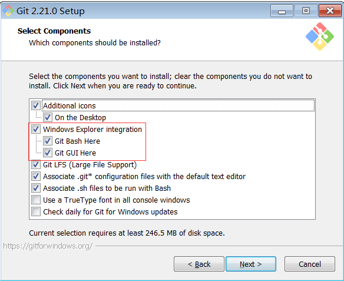

# git bash 扩展命令(下)

## 剧情回顾

在上一节中我们已经介绍了两种方式来扩展 `git bash` 命令,解决了一般性命令不足的问题,最后我们还留下了一个疑问,如果两种方式均无法扩展某些命令又该怎么办?

再介绍最后一个大招之前,我们首先来回忆一下前面两种扩展方式.

- `bash` 不足 `cmd` 来凑

`git bash` 命令行终端和 `windows` 系统自带的 `cmd` 命令行终端互为补充,某些 `git bash` 命令没有并不意味着 `cmd` 也没有,所以遇到 `git bash` 无某些命令的情况下,首先应该去看看 `cmd` 有没有这个命令.

如果碰巧 `cmd` 存在该命令,那么既可以在 `cmd` 中直接运行该命令,也可以在 `git bash` 中借助 `winpty + cmd 原生命令` 方式调用该命令.

示例: 

```
F:\workspace\git-bash-extend>tree
卷 常用 的文件夹 PATH 列表
卷序列号为 62AE-62CA
F:.
├─extend-cmd
├─extend-gitforwindows-sdk
└─extend-gnuwin
```

> `cmd` 命令行中有 `tree` 命令,不过该命令的后缀名是 `.com` 而不是 `.exe`.

```bash
Administrator@snowdreams1006 MINGW64 /f/workspace/git-bash-extend
$ winpty tree.com
卷 常用 的文件夹 PATH 列表
卷序列号为 62AE-62CA
F:.
├─extend-cmd
├─extend-gitforwindows-sdk
└─extend-gnuwin
``` 

> `git bash` 命令行中没有 `tree` 命令,通过调用 `cmd` 命令行中的 `tree.com` 命令变相支持 `tree` 命令.

- `bash` 没有 `gnuWin` 填补

如果 `git bash` 命令行中没有的命令,`cmd` 也没有的话,那么应该想办法扩展 `git bash` 命令,最简单的方式是找同源的命令.

正所谓"物以类聚人以群分",如果有现成的命令可以直接扩展过来,岂不是很方便,幸运的是,`gnuwin` 开源项目适用于 `git`!

我们可以从 [gnuwin32](https://sourceforge.net/projects/gnuwin32/files/) 项目下载所需的扩展命令并复制到 `git bash` 的安装位置下面的 `/usr/bin` 目录下即可轻松扩展更多命令.

示例:

```bash
Administrator@snowdreams1006 MINGW64 /f/workspace/git-bash-extend
$ tree
.
├── extend-cmd
│   └── cmd.md
├── extend-gitforwindows-sdk
│   └── gitforwindows-sdk.md
└── extend-gnuwin
    └── gnuwin.md

3 directories, 3 files
```

> 轻松扩展的 `tree` 命令,功能更强大更像 `linux` 系统的 `tree` 命令.

## 回顾问题

如果没有第三方**现成的**命令文件供我们轻松扩展,意味着前面两种方式均已失效!

如果真的遇到这种情况,一般会有两种方式来解决问题.

- 直接放弃,寻找新的替代方案
- 定制开发,创造自定义解决方案

两种方案没有谁对谁错,应该根据自身情况选择适合自己的哪一种,针对 `git bash` 命令不足的问题,我们具体分析一下是否可行.

## 直接放弃

如果选择方案一,意味着我们需要放弃 `git bash` 命令行工具并寻求新的替代方案,也就是说我们首先需要弄清楚两个问题.

- 能不能直接放弃 `git bash` 命令行

`Git Bash` 是命令行工具,是为了使用 `git` 而默认提供的命令行工具,与此同时,`Git Bash` 还有一个双胞胎兄弟叫做 `Git GUI` 图形化工具.



由此可见,`Git Bash` 并不是 `Git` 的关键核心,可有可无的工具类而已.

![git-bash-extend-down-gitbash-and-gitgui-use.png](../images/git-bash-extend-down-gitbash-and-gitgui-use.png

- 寻找哪一款替代方案?


