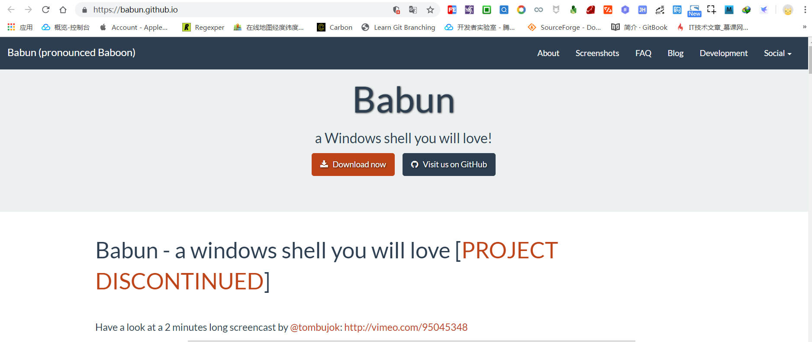

# git bash 扩展命令(下)

## 剧情回顾

在上一节中我们已经介绍了两种方式来扩展 `git bash` 命令,解决了一般性命令不足的问题,最后我们还留下了一个疑问,如果两种方式均无法扩展某些命令又该怎么办?

再介绍最后一个大招之前,我们首先来回忆一下前面两种扩展方式.

- `bash` 不足 `cmd` 来凑

`git bash` 命令行终端和 `windows` 系统自带的 `cmd` 命令行终端互为补充,某些 `git bash` 命令没有并不意味着 `cmd` 也没有,所以遇到 `git bash` 无某些命令的情况下,首先应该去看看 `cmd` 有没有这个命令.

如果碰巧 `cmd` 存在该命令,那么既可以在 `cmd` 中直接运行该命令,也可以在 `git bash` 中借助 `winpty + cmd 原生命令` 方式调用该命令.

示例: 

```
F:\workspace\git-bash-extend>tree
卷 常用 的文件夹 PATH 列表
卷序列号为 62AE-62CA
F:.
├─extend-cmd
├─extend-gitforwindows-sdk
└─extend-gnuwin
```

> `cmd` 命令行中有 `tree` 命令,不过该命令的后缀名是 `.com` 而不是 `.exe`.

```bash
Administrator@snowdreams1006 MINGW64 /f/workspace/git-bash-extend
$ winpty tree.com
卷 常用 的文件夹 PATH 列表
卷序列号为 62AE-62CA
F:.
├─extend-cmd
├─extend-gitforwindows-sdk
└─extend-gnuwin
``` 

> `git bash` 命令行中没有 `tree` 命令,通过调用 `cmd` 命令行中的 `tree.com` 命令变相支持 `tree` 命令.

- `bash` 没有 `gnuWin` 填补

如果 `git bash` 命令行中没有的命令,`cmd` 也没有的话,那么应该想办法扩展 `git bash` 命令,最简单的方式是找同源的命令.

正所谓"物以类聚人以群分",如果有现成的命令可以直接扩展过来,岂不是很方便,幸运的是,`gnuwin` 开源项目适用于 `git`!

我们可以从 [gnuwin32](https://sourceforge.net/projects/gnuwin32/files/) 项目下载所需的扩展命令并复制到 `git bash` 的安装位置下面的 `/usr/bin` 目录下即可轻松扩展更多命令.

示例:

```bash
Administrator@snowdreams1006 MINGW64 /f/workspace/git-bash-extend
$ tree
.
├── extend-cmd
│   └── cmd.md
├── extend-gitforwindows-sdk
│   └── gitforwindows-sdk.md
└── extend-gnuwin
    └── gnuwin.md

3 directories, 3 files
```

> 轻松扩展的 `tree` 命令,功能更强大更像 `linux` 系统的 `tree` 命令.

## 回顾问题

如果没有第三方**现成的**命令文件供我们轻松扩展,意味着前面两种方式均已失效!

如果真的遇到这种情况,一般会有两种方式来解决问题.

- 直接放弃,寻找新的替代方案
- 定制开发,创造自定义解决方案

两种方案没有谁对谁错,应该根据自身情况选择适合自己的哪一种,针对 `git bash` 命令不足的问题,我们具体分析一下是否可行.

## 直接放弃,另寻新欢

如果选择方案一,意味着我们需要放弃 `git bash` 命令行工具并寻求新的替代方案,也就是说我们首先需要弄清楚两个问题.

- 能不能直接放弃 `git bash` 命令行

`Git Bash` 是命令行工具,是为了使用 `git` 而默认提供的命令行工具,与此同时,`Git Bash` 还有一个双胞胎兄弟叫做 `Git GUI` 图形化工具.


由此可见,`Git Bash` 并不是 `Git` 的关键核心,可有可无的工具类而已.


- 寻找哪一款替代方案?

既然已经决定放弃了 `git bash` 命令行,那么我们就要找一个功能更加强大的命令行工具来替代 `git bash`.

但是,`windows` 始终是 `windows` ,是不可能真正变成 `linux` 系统的,所以我们要寻找的第三方工具充其量也是一种模拟系统而已.

市面上,`windows` 的命令行工具有很多,有些是单纯的命令行工具有的是虚拟系统工具,但是不管怎么样,我们这一次要选择的命令行工具一定要满足以下几点.

- 方便集成 `git` 服务,这是初衷,不可违背.
- 命令行语法类似 `linux` 语法,降低学习成本.
- 自带包安装工具,这是最关键部分也是 `git bash` 没有提供的部分.
- 安装配置简单,无需繁琐的配置即可轻松上手.

根据以上几点,推荐一款 `Babun` 工具,正如官方标语宣传的那样,一款一会爱上的`Windows Shell` .



> [Babun](https://babun.github.io/) : a Windows shell you will love!

当然除了上述基本要求外,再谈一谈为什么推荐这一款软件?

- 安装简单,下载安装包执行安装脚本自动安装配置.
- 自带包管理工具,且静默安装无需过多交互式询问.
- 基于 `Cygwin` 预配置大量常用插件,包括 `git` 和 `shell`.
- 默认终端模拟器是 `Mintty`,支持两种类型的 `shell`,分别是 `bash` 和 `zsh`.

> 翻译成人话就是: `Babun` 和 `Git Bash` 一脉相承,不仅是亲戚还是近亲,`Babun` 比 `Git Bash` 体积更大,功能更强.

### `babun` 初体验

[下载 babun](http://projects.reficio.org/babun/download) 并解压缩,然后双击 ` install.bat` 脚本进行自动化安装.


自动安装成功后会自动创建桌面快捷方式并输出 `babun` 基本信息.


### 配置你的新欢

- 配置 `git` 

默认已经集成 `git` ,因此我们可以像 `git bash` 那样使用 `git`.

```bash
{ ~ }  » git --version                                                                          ~
git version 2.1.4
```

接下来进行一些关于 `git` 的常规配置,彻底拥抱 `babun`.

```bash
# 添加用户名和邮箱
git config --global user.name "your name"
git config --global user.email "your@email.com"

# gitalias 插件提供的 git 别名配置项
gitalias['alias.cp']='cherry-pick'
gitalias['alias.st']='status -sb'
gitalias['alias.cl']='clone'
gitalias['alias.ci']='commit'
gitalias['alias.co']='checkout'
gitalias['alias.br']='branch'
gitalias['alias.dc']='diff --cached'
gitalias['alias.lg']="log --graph --pretty=format:'%Cred%h%Creset -%C(yellow)%d%Creset %s %Cgreen(%cr) %Cblue<%an>%Creset' --abbrev-commit --date=relative --all"
gitalias['alias.last']='log -1 --stat'
gitalias['alias.unstage']='reset HEAD --'
```

- 更改默认 `shell`


### 体验新欢之美


## 忠贞不二,开发扩展

方案一让我们另寻新欢,


