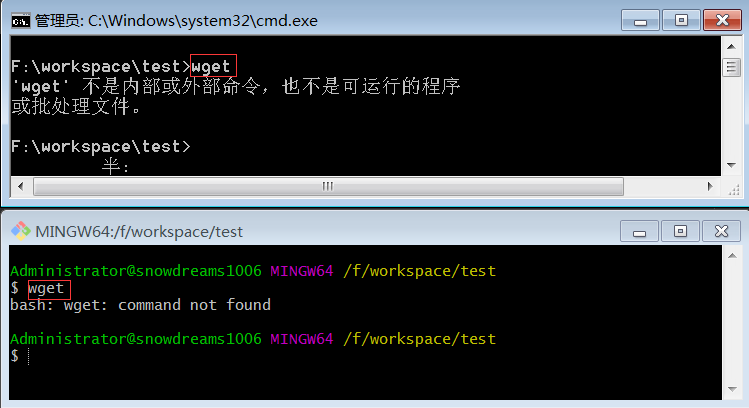
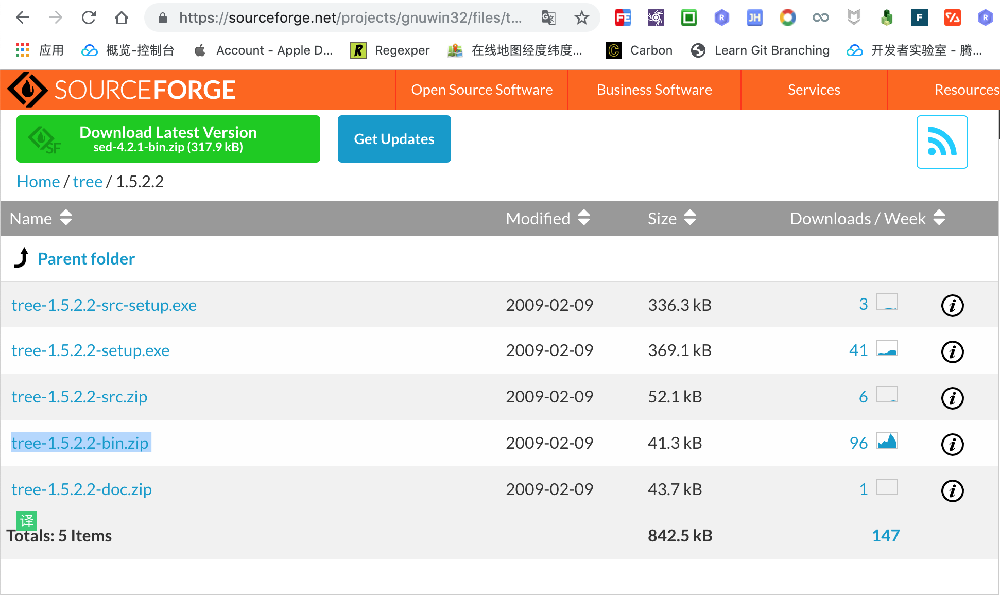

# git bash 扩展命令(中)

## 前情回顾

在上一篇文章中我们介绍了第一种方式实现轻松扩展 `Git Bash` 命令,现在简单回顾一下主要知识.

`Git Bash` 命令行工具是 `Windows` 电脑安装 `Git` 时默认集成的终端工具,与此同时还有双胞胎兄弟 `Git GUI` 图形化工具.


`Git Bash` 和 `Windows` 系统自带的 `cmd` 命令行都可以运行 `Git` 相关命令,二者在这方面差异不大,使用哪一个都可以.

如果更熟悉 `linux` 命令行语法的话,那么建议选择 `Git Bash` 命令行而不能是 `cmd` 命令行.

当然,`Git Bash` 和 `cmd` 作为同类产品,两者并不是互斥的,而应该是互补产品,某些情况下,`Git Bash` 可能还需要调用 `cmd` 才能完成相应任务呢!


> `Git Bash` 调用 `cmd` 程序执行相关命令时,请一定要加上 `winpty` 开头,不然可能会发生意想不到的结果.

## 问题背景

在上一篇文章结尾处,我们留下了一个问题,那就是: 如果 `cmd` 也没有某些命令的话,`Git Bash` 又该如何执行该命令?

正所谓"巧妇难为无米之炊",`Git Bash` 命令行没有 `wget` 命令,`cmd` 命令行也没有 `wget` 命令,因此 `Git Bash` 自然无法调用 `wget` 命令,那么解决思路就很清楚了: 

扩展 `wget` 命令并让 `Git Bash` 识别到 `wget` 命令文件呗!



还记得上篇文章中 `Git Bash` 想要调用 `cmd` 的 `tree` 命令,并不能直接 `winpty tree` 而是 `winpty tree.com` .

```bash
Administrator@snowdreams1006 MINGW64 /f/workspace/test
# 直接输入 ` tree` 命令会提示找不到该命令文件
$ tree
bash: /usr/bin/tree: No such file or directory

Administrator@snowdreams1006 MINGW64 /f/workspace/test
# 输入 `tree.com` 命令则能调用该命令但会出现中文乱码
$ tree.com
▒▒ ▒▒▒▒ ▒▒▒ļ▒▒▒ PATH ▒б▒
▒▒▒▒▒к▒Ϊ 62AE-62CA
F:.
▒▒▒▒cmd
▒▒▒▒git-bash

Administrator@snowdreams1006 MINGW64 /f/workspace/test
# 直接输入 `winpty tree` 命令依旧找不到该命令
$ winpty tree
winpty: error: cannot start 'tree': Not found in PATH

Administrator@snowdreams1006 MINGW64 /f/workspace/test
# 输入 `winpty tree.com` 命令则正常调用该命令
$ winpty tree.com
卷 常用 的文件夹 PATH 列表
卷序列号为 62AE-62CA
F:.
├─cmd
└─git-bash
```

从上述的例子中,我们不难总结出以下结论:

- `Git Bash` 无法识别 `.com` 后缀结尾的命令文件.
- `Git Bash` 调用 `cmd` 命令时应通过 `winpty` 包装器.
- `Git Bash` 查找命令文件的路径也是通过 `PATH` 环境变量设置的,只不过还有自己的命令文件路径.

## 探寻庐山真面目

`Git Bash` 命令行语法不仅和 `linux` 语法一致,而且设计思想基本也差不多,我们知道在 `linux` 中有一句话可以概括整个系统核心: **一切皆文件**

那么 `Git Bash` 所支持的各种命令自然也是文件,只要找到了命令文件自然也就明白为什么不支持 `tree` 命令了,换句话说,下一步我们就知道如何才能支持 `tree` 命令.

在桌面上找到 `Git Bash` 图标的快捷方式,选中该图标**右键**,然后选择**打开文件位置**,现在应该进入到 `Git` 的安装目录了.


接下来,进入 `usr/bin` 目录,你会发现所有可执行的命令文件,你都可以找到但是你并找不到 `tree.exe` 文件,所以无法执行 `tree` 命令.


那么如果我们能够找到 `tree.exe` 文件并将该命令文件放到 `usr/bin` 目录下自然就能够正常调用 `tree` 命令了,但是我们又该去哪里找 `tree.exe` 文件呢?

## 轻松扩展 `git bash` 命令(中)

`tree.exe` 命令文件千千万,但是适合 `Git Bash` 命令行运行的却并不是全部文件.

想要对症下药,自然要先弄清楚 `Git Bash` 到底属于何门何派,应用了哪些技术栈,这样才能知己知彼,轻松扩展更多命令.

`Git` 原来是 `linux` 系统专属软件,后来由 `Git for Windows` 组织进行了移植,所以现在 `Git` 才能够支持 `Windows` 系统.

`Git for Windows` 在移植 `Git` 的过程中借鉴了大量的开源项目,包括 `minGW` 和 `msys2` 项目.


不查不知道,一查就发现了新大陆,原来想要把 `linux` 软件移植到 `windows` 平台的做法并不孤单,甚至提出了 `WSL` 概念!

> `WSL` : `Windows Subsystem For Linux` 的缩写,即为 `linux` 打造的 `windows` 子系统,可以简单理解为在 `windows` 系统上获得 `linux` 系统的体验.

所以,`Git Bash` 背后的技术支持来源于 `minGW` 和 `msys2` 等 `WSL` 项目.

既然,`Git Bash` 默认没有提供 `tree` 命令文件,那我们就自己动手去扩展 `tree` 命令.

由于暂时没有找到 `minGW` 已编译好的可执行文件,所以只能找其他 `WSL` 项目进行移植,亲测可行!

> `GnuWin` 项目源码托管地址,其中 `GnuWin64` 是 64 位操作系统,`GnuWin32` 是 32 位操作系统,不过 `GnuWin64` 仍在开发计划中,所以我们只能使用 `GnuWin32` .
> 
> `GnuWin64` : [https://sourceforge.net/projects/gnuwin64/](https://sourceforge.net/projects/gnuwin64/)
> 
> `GnuWin32` : [https://sourceforge.net/projects/gnuwin32/](https://sourceforge.net/projects/gnuwin32/)


依次选择 `Files > tree > 1.5.2.2` 便可以找到 `tree` 命令文件,这里提供了各种文件类型,既有源码文件又要安装文件,还有可执行的二进制文件.



> `tree-1.5.2.2-bin.zip` 下载地址: [https://sourceforge.net/projects/gnuwin32/files/tree/1.5.2.2/tree-1.5.2.2-bin.zip/download](https://sourceforge.net/projects/gnuwin32/files/tree/1.5.2.2/tree-1.5.2.2-bin.zip/download)

### 二进制文件

接下来的事情就比较简单了,将二进制文件 `tree-1.5.2.2-bin.zip` 解压,找到 `tree.exe` 文件并复制到 `Git` 的安装目录下面的 `usr/bin` 目录中即可支持 `tree` 命令.

```bash
Administrator@snowdreams1006 MINGW64 /f/Downloads/tree-1.5.2.2-bin
# 解压 `tree-1.5.2.2-bin.zip` 文件,查看文件目录,`tree.exe` 位于 `bin` 目录下.
$ winpty tree.com
卷 常用 的文件夹 PATH 列表
卷序列号为 62AE-62CA
F:.
├─bin
├─contrib
│  └─tree
│      └─1.5.2.2
│          ├─tree-1.5.2.2
│          └─tree-1.5.2.2-src
├─man
│  └─cat1
└─manifest
```


现在再次测试 `tree` 命令来一起见证奇迹吧!

```bash
Administrator@snowdreams1006 MINGW64 /f/Downloads/tree-1.5.2.2-bin
# `tree` 命令等价于 `tree.exe` 命令,执行的正是我们刚刚扩展的 `tree-1.5.2.2-bin.zip` 二进制文件
$ tree
.
├── bin
│   └── tree.exe
├── contrib
│   └── tree
│       └── 1.5.2.2
│           ├── tree-1.5.2.2
│           ├── tree-1.5.2.2-GnuWin32.README
│           └── tree-1.5.2.2-src
│               ├── CHANGES
│               ├── INSTALL
│               ├── LICENSE
│               └── README
├── man
│   └── cat1
│       └── tree.1.txt
└── manifest
    ├── tree-1.5.2.2-bin.mft
    └── tree-1.5.2.2-bin.ver

9 directories, 9 files
```

> `Git Bash` 扩展的 `tree` 命令的后缀名是 `.exe` ,而刚好能够识别,因此不必输入 `tree.exe` 命令.

### 安装文件

`tree` 命令本身比较简单,没有其他依赖,所以我们可以直接将二进制文件复制到目标目录中即可正常运行,但是有些命令依赖项比较多,简简单单复制二进制文件并不能正常运行.

有兴趣的小伙伴们可以试试将 `wget` 的二进制文件复制到目标目录下,看一下能否正常运行 `wget` 命令?

答案是: 不能!

所以这一次我们不再采用复制二进制文件方式,而是安装软件形式进行扩展 `wget` 命令.


> `wget-1.11.4-1-setup.exe` 下载地址: [https://sourceforge.net/projects/gnuwin32/files/wget/1.11.4-1/wget-1.11.4-1-setup.exe/download](https://sourceforge.net/projects/gnuwin32/files/wget/1.11.4-1/wget-1.11.4-1-setup.exe/download)

双击可执行文件 `wget-1.11.4-1-setup.exe`,准备进行安装!


接受协议,勾选我同意,并下一步.


选择安装的目标路径,切记一定要安装到 `Git\usr` 目录下!!!


选择安装组件,默认选项即可.


选择菜单目录,建议设置成 `Git\Wget` .


选择附加任务,默认选项即可.


确认安装信息,这里确认下安装目录是不是 `Git` 的安装位置下面的 `usr` 目录以及开始菜单目录是不是 `Git\Wget`.


点击下一步,等待安装完成.


安装完成后,再次查看 `Git Bash` 的 `usr/bin` 目录,发现 `wget.exe` 命令文件确实安装到该目录下.


安装成功后,测试一下看看到底能不能正常运行吧!

```bash
Administrator@snowdreams1006 MINGW64 /f/workspace/test
# 当前文件目录,`tree` 调用的是刚刚扩展的 `tree` 命令
$ tree
.
├── cmd
│   └── cmd.md
└── git-bash
    └── git-bash.md

2 directories, 2 files

Administrator@snowdreams1006 MINGW64 /f/workspace/test
# 直接输入 `wget` 出现中文乱码
$ wget
F:\Git\usr\bin\wget▒▒δָ▒▒ URL
▒÷▒▒▒ F:\Git\usr\bin\wget [ѡ▒▒]... [URL]...

▒볢▒▒ʹ▒á▒F:\Git\usr\bin\wget --help▒▒▒鿴▒▒▒▒▒ѡ▒
SYSTEM_WGETRC = c:/progra~1/wget/etc/wgetrc
syswgetrc = F:\Git\usr/etc/wgetrc

Administrator@snowdreams1006 MINGW64 /f/workspace/test
# 输入 `winpty wget www.baidu.com` 解决中文乱码问题并下载 `www.baidu.com` 网页
$ winpty wget www.baidu.com
SYSTEM_WGETRC = c:/progra~1/wget/etc/wgetrc
syswgetrc = F:\Git\usr/etc/wgetrc
--2019-05-18 14:03:47--  http://www.baidu.com/
正在解析主机 www.baidu.com... 115.239.211.112, 115.239.210.27
Connecting to www.baidu.com|115.239.211.112|:80... 已连接。
已发出 HTTP 请求，正在等待回应... 200 OK
长度：2381 (2.3K) [text/html]
Saving to: `index.html'

100%[======================================>] 2,381       --.-K/s   in 0s

2019-05-18 14:03:47 (87.2 MB/s) - `index.html' saved [2381/2381]


Administrator@snowdreams1006 MINGW64 /f/workspace/test
# 再次查看当前目录,`www.baidu.com` 网页已成功下载到当前目录.
$ tree
.
├── cmd
│   └── cmd.md
├── git-bash
│   └── git-bash.md
└── index.html

2 directories, 3 files
```

### 源码文件

按理说应该也可以编译成功,不过将源码编译成可执行的二进制文件可能比较费劲,因此暂无测试.

如果小伙伴们感兴趣可以自行安装 `c` 环境编译安装试试看,编译成功后别忘了告诉我哟!

## 未完待续最后一招

现在我们已经学会了两种方式来扩展 `Git Bash` 命令,分别是调用 `cmd` 以及按需扩展指定命令.

但是,这两种方法都有一定的局限性,方法一的局限性可以用方法二来解决,那方法二的局限性又体现在哪?

方法二属于缺啥补啥,`Git Bash` 命令行没有 `tree` 命令,但 `WSL` 项目有编译好的 `tree` 二进制文件,所以直接拿来用即可.
`Git Bash` 命令行没有 `wget` 命令,但 `WSL` 项目有 `wget` 的安装文件,所以我们安装集成到 `Git Bash` 即可.

那如果 `WSL` 没有目标命令呢?或者说找不到相应的 `WSL` 的目标命令文件呢?

难道就束手无策了吗?

不不不,还有最后一招,此招一出,惊天动地,相信你再也不会说无法扩展 `Git Bash` 命令了!

敬请期待下一篇文章---**轻松扩展 `git bash` 命令(下)**.

