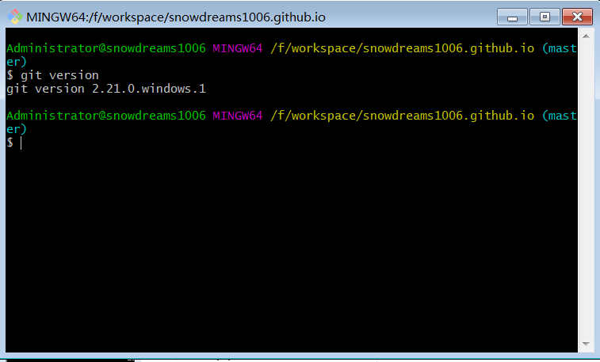
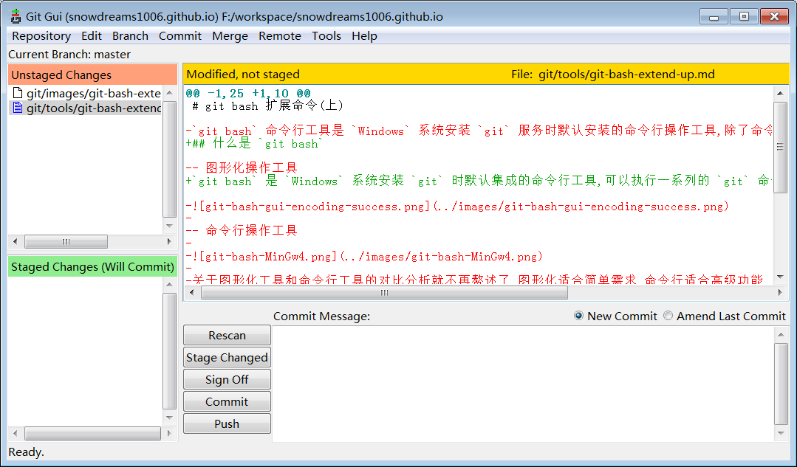
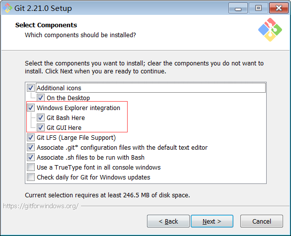
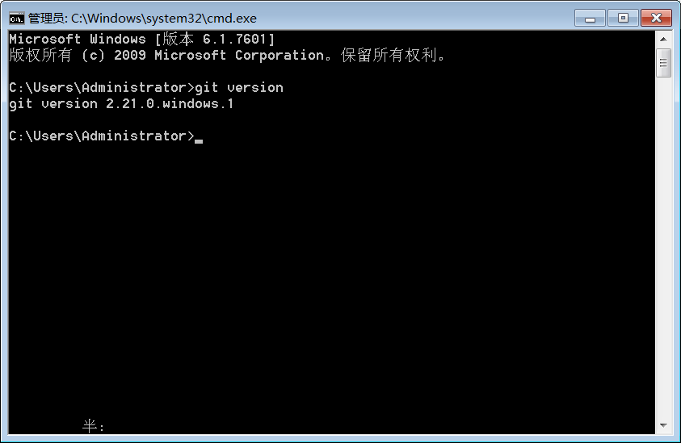
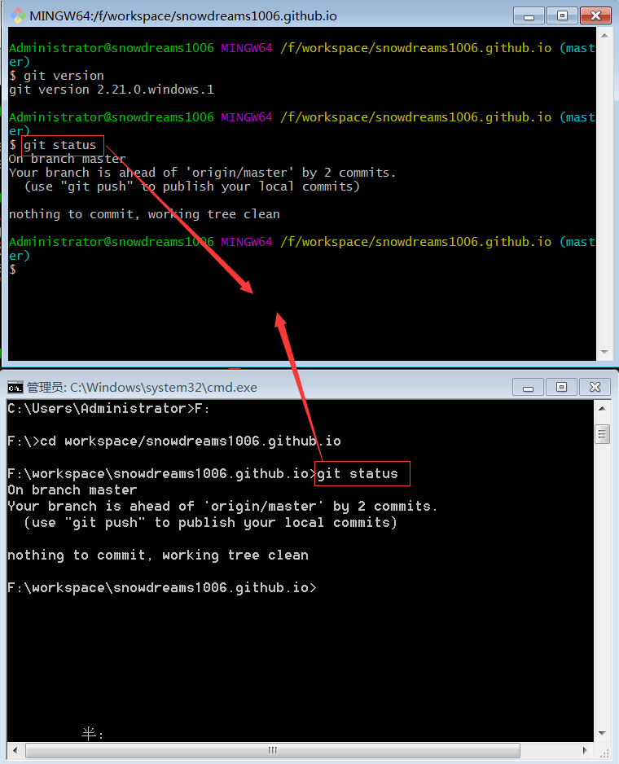

# git bash 扩展命令(上)

## 什么是 `git bash`

`git bash` 是 `Windows` 系统安装 `git` 时默认集成的命令行工具,可以执行一系列的 `git` 命令.



如果不熟悉命令行操作的话,`git bash` 还有个双胞胎兄弟叫做 `git gui`,默认情况下两兄弟会同时安装.



如果选中文件右键没有弹出 `Git Bash Here` 和 `GIt GUI Here` 选项的话,可能安装 `Git` 时没有集成这两个工具,请检查安装 `Git` 时下图是否已经勾选!




不论是命令行工具还是图形化工具,两者都是提供服务的一种方式,不应该是排他性而应该是互补性.

当然,如果涉及到某些命令而恰恰有没有相应的图形化选项时,那么图形化工具就无能为力,正是命令行工具大显身手的好机会!

## `git bash` 和 `cmd` 

`git bash` 是命令行工具,提供了内置终端,不仅可以运行 `git` 命令还可以运行基本的 `linux` 命令.

但是,用过 `Windows` 电脑的小伙伴可能或多或少都听说过 `Windows` 电脑默认也自带了一个命令行工具,也就是 `cmd` 工具.

唤出 `cmd` 的方式不如 `git bash` 那么直观方便,需要调用快捷键 `Win + R` 然后输出 `cmd` ,也是命令行工具.



既然两者都是命令行工具,那么为什么 `Git Bash` 要重复造轮子?直接用 `cmd` 不行吗?



> 无论是 `Git Bash` 还是 `cmd` 命令行工具,两者均支持 `Git` 命令.

既然已经重复造好了轮子,要么比原来的轮子强,要么和原来的轮子有些不一样,那么 `Git Bash` 轮子也理应如此!

两者均支持 `Git` 命令,体现不出 `Git Bash` 轮子的优势,抛开 `Git` 命令不谈,作为命令行工具总有要支持的命令吧?

那我们就比较一下 `Git Bash` 以及 `cmd` 命令对文件夹的基本操作吧!

首先闪亮登场的是 `Git Bash` 命令行,在这次比赛中将创建 `git-bash` 文件夹以及相应的文件.

```bash
Administrator@snowdreams1006 MINGW64 /f/workspace
# 列出当前工作空间的文件目录
$ ls
backup/  private-cloud-backup/  snowdreams1006.github.io/

Administrator@snowdreams1006 MINGW64 /f/workspace
# 递归创建 `test/git-bash` 目录
$ mkdir -p test/git-bash

Administrator@snowdreams1006 MINGW64 /f/workspace
# 切换到 `test/git-bash` 目录
$ cd test/git-bash

Administrator@snowdreams1006 MINGW64 /f/workspace/test/git-bash
# 创建 `git-bash.md` 文件
$ touch git-bash.md

Administrator@snowdreams1006 MINGW64 /f/workspace/test/git-bash
# 输出指定内容到 `git-bash.md` 文件
$ echo "created by git bash" > git-bash.md

Administrator@snowdreams1006 MINGW64 /f/workspace/test/git-bash
# 查询 `git-bash.md` 文件内容
$ cat git-bash.md
created by git bash

Administrator@snowdreams1006 MINGW64 /f/workspace/test/git-bash
# 创建 `delete.md` 文件
$ touch delete.md

Administrator@snowdreams1006 MINGW64 /f/workspace/test/git-bash
# 列出当前工作空间下的文件目录
$ ls
delete.md  git-bash.md

Administrator@snowdreams1006 MINGW64 /f/workspace/test/git-bash
# 删除 `delete.md` 文件
$ rm delete.md

Administrator@snowdreams1006 MINGW64 /f/workspace/test/git-bash
# 列出当前工作空间下的文件目录
$ ls
git-bash.md
```

`git bash` 表演告一段落,现在上场的是 `cmd` ,让我们拭目以待!

```bash
# 列出当前工作空间的文件目录
F:\workspace\test\cmd02>dir
 驱动器 F 中的卷是 常用
 卷的序列号是 62AE-62CA

 F:\workspace\test\cmd02 的目录

2019/05/17 周五  17:32    <DIR>          .
2019/05/17 周五  17:32    <DIR>          ..
               0 个文件              0 字节
               2 个目录 94,247,124,992 可用字节

# 递归创建 `test\cmd` 目录
F:\workspace>mkdir test\cmd

# 切换到 `test\cmd` 目录
F:\workspace>cd test\cmd

# 输出指定内容并创建 `cmd.md` 文件
F:\workspace\test\cmd>echo "created by cmd" > cmd.md

# 查询 `cmd.md` 文件内容
F:\workspace\test\cmd>more cmd.md
"created by cmd"

# 创建 `delete.md` 文件
F:\workspace\test\cmd>echo nul > delete.md

# 列出当前工作空间下的文件目录
F:\workspace\test\cmd>dir
 驱动器 F 中的卷是 常用
 卷的序列号是 62AE-62CA

 F:\workspace\test\cmd 的目录

2019/05/17 周五  17:39    <DIR>          .
2019/05/17 周五  17:39    <DIR>          ..
2019/05/17 周五  17:36                19 cmd.md
2019/05/17 周五  17:39                 6 delete.md
               2 个文件             25 字节
               2 个目录 94,247,026,688 可用字节

# 删除 `delete.md` 文件
F:\workspace\test\cmd>del delete.md

# 列出当前工作空间下的文件目录
F:\workspace\test\cmd>dir
 驱动器 F 中的卷是 常用
 卷的序列号是 62AE-62CA

 F:\workspace\test\cmd 的目录

2019/05/17 周五  17:40    <DIR>          .
2019/05/17 周五  17:40    <DIR>          ..
2019/05/17 周五  17:36                19 cmd.md
               1 个文件             19 字节
               2 个目录 94,247,026,688 可用字节

```

