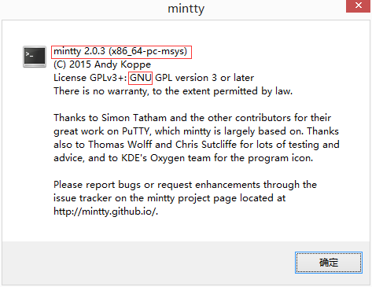

# git bash 扩展命令(上)

## 什么是 `git bash`

`Git Bash` 是 `Windows` 系统安装 `Git` 时默认集成的命令行工具,提供运行 `Git` 命令的集成环境.


如果不熟悉命令行操作的话,`Git Bash` 还有个双胞胎兄弟叫做 `Git GUI`,默认情况下两兄弟应该会同时安装(除非你特意更改了安装 `Git` 时的配置项).


如果选中文件**右键**没有弹出 `Git Bash Here` 和 `GIt GUI Here` 选项的话,很可能安装 `Git` 时并没有集成这两个工具,请检查安装 `Git` 时下图是否已经勾选!


不论是命令行工具还是图形化工具,两者都是提供服务的一种方式,不应该是排他性而应该是互补性.

大家在实际工作中应该灵活运用,工具只是工具而已!

当然,如果涉及到某些命令而恰恰又没有相应的图形化选项时,那么图形化工具此时便无能为力,这正是命令行工具大显身手的好机会!

## `git bash` 和 `cmd` 的关系

`git bash` 是命令行工具,提供了内置终端,不仅可以运行 `git` 命令还可以运行某些基本的 `linux` 命令.

但是,用过 `Windows` 电脑的小伙伴可能或多或少都听说过 `Windows` 电脑默认也自带了一个命令行工具,也就是 `cmd` 工具.

虽然唤出 `cmd` 的方式不如 `git bash` 那么直观方便,但是调用快捷键 `Win + R` 然后输出 `cmd` 也是调出命令行工具的,让我们一睹芳容 (个人觉得样式丑极了)!


既然两者都是命令行工具,那么为什么 `Git Bash` 要重复造轮子?直接用 `cmd` 不行吗?


> 无论是 `Git Bash` 还是 `cmd` 命令行工具,两者均支持 `Git` 命令,所以两者用哪一个都可以.

既然已经重复造好了轮子,要么比原来的轮子强,要么和原来的轮子有些不一样, `Git Bash` 轮子自然也理应如此吧?

首先两者均支持 `Git` 命令,体现不出 `Git Bash` 轮子的优势,那我们就抛开 `Git` 命令不谈,仅仅从普通命令入手感受下两个轮子到底有什么不同之处.

下面我们以创建目录以及文件为例,演示下两者如何操作.

首先闪亮登场的是 `Git Bash` 命令行,将会新建 `git-bash` 目录并新建一些文件,详情参考下面命令.

```bash
Administrator@snowdreams1006 MINGW64 /f/workspace
# 列出当前工作空间的文件目录
$ ls
backup/  private-cloud-backup/  snowdreams1006.github.io/

Administrator@snowdreams1006 MINGW64 /f/workspace
# 递归创建 `test/git-bash` 目录
$ mkdir -p test/git-bash

Administrator@snowdreams1006 MINGW64 /f/workspace
# 切换到 `test/git-bash` 目录
$ cd test/git-bash

Administrator@snowdreams1006 MINGW64 /f/workspace/test/git-bash
# 创建 `git-bash.md` 文件
$ touch git-bash.md

Administrator@snowdreams1006 MINGW64 /f/workspace/test/git-bash
# 输出指定内容到 `git-bash.md` 文件
$ echo "created by git bash" > git-bash.md

Administrator@snowdreams1006 MINGW64 /f/workspace/test/git-bash
# 查询 `git-bash.md` 文件内容
$ cat git-bash.md
created by git bash

Administrator@snowdreams1006 MINGW64 /f/workspace/test/git-bash
# 创建 `delete.md` 文件
$ touch delete.md

Administrator@snowdreams1006 MINGW64 /f/workspace/test/git-bash
# 列出当前工作空间下的文件目录
$ ls
delete.md  git-bash.md

Administrator@snowdreams1006 MINGW64 /f/workspace/test/git-bash
# 删除 `delete.md` 文件
$ rm delete.md

Administrator@snowdreams1006 MINGW64 /f/workspace/test/git-bash
# 列出当前工作空间下的文件目录
$ ls
git-bash.md
```

`git bash` 表演告一段落,现在上场的是 `cmd` ,想要实现和 `git bash` 类似的效果,又会有一番什么样的操作,让我们拭目以待!

```bash
# 列出当前工作空间的文件目录
F:\workspace\test\cmd>dir
 驱动器 F 中的卷是 常用
 卷的序列号是 62AE-62CA

 F:\workspace\test\cmd 的目录

2019/05/17 周五  17:32    <DIR>          .
2019/05/17 周五  17:32    <DIR>          ..
               0 个文件              0 字节
               2 个目录 94,247,124,992 可用字节

# 递归创建 `test\cmd` 目录
F:\workspace>mkdir test\cmd

# 切换到 `test\cmd` 目录
F:\workspace>cd test\cmd

# 输出指定内容并创建 `cmd.md` 文件
F:\workspace\test\cmd>echo "created by cmd" > cmd.md

# 查询 `cmd.md` 文件内容
F:\workspace\test\cmd>more cmd.md
"created by cmd"

# 创建 `delete.md` 文件
F:\workspace\test\cmd>echo nul > delete.md

# 列出当前工作空间下的文件目录
F:\workspace\test\cmd>dir
 驱动器 F 中的卷是 常用
 卷的序列号是 62AE-62CA

 F:\workspace\test\cmd 的目录

2019/05/17 周五  17:39    <DIR>          .
2019/05/17 周五  17:39    <DIR>          ..
2019/05/17 周五  17:36                19 cmd.md
2019/05/17 周五  17:39                 6 delete.md
               2 个文件             25 字节
               2 个目录 94,247,026,688 可用字节

# 删除 `delete.md` 文件
F:\workspace\test\cmd>del delete.md

# 列出当前工作空间下的文件目录
F:\workspace\test\cmd>dir
 驱动器 F 中的卷是 常用
 卷的序列号是 62AE-62CA

 F:\workspace\test\cmd 的目录

2019/05/17 周五  17:40    <DIR>          .
2019/05/17 周五  17:40    <DIR>          ..
2019/05/17 周五  17:36                19 cmd.md
               1 个文件             19 字节
               2 个目录 94,247,026,688 可用字节

```

现在 `git bash` 和 `cmd` 两个命令行工具都顺利完成了此次比赛,虽然具体命令有些不同,但是殊途同归,条条大路通罗马,不是吗?

通过上述比赛实验,不难看出: `git bash` 命令更贴近 `linux` 命令,`cmd` 命令则是纯纯的 `windows` 命令.

所以 `git bash` 重复造轮子可能是为了让我们在 `windows` 上获得比较好的 `linux` 体验吧,毕竟 `cmd` 那一套逻辑和 `linux` 逻辑差别真心不小呢!

|命令说明|`git bash`|`cmd`|
|-|-|-|
|查看帮助文档|`help`|`help`|
|列出当前文件目录|`ls`|`dir`|
|创建目录|`mkdir`|`mkdir`|
|切换目录|`cd`|`cd`|
|创建新文件|`touch <newFile>`|`echo "created by cmd" > newFile`|
|删除文件|`rm <file>`|`del <file>`|

当然,如果你熟悉 `windows` 命令行语法那最好使用 `cmd` 命令行,不过如果你更熟悉 `linux` 命令行语法那当然建议使用 `git bash` 命令行.

总之,适合自己的才是最好的,两者也可以相互结合,优势互补.

## `git bash` 为主,`cmd` 为辅

正常情况下,命令行操作一般适合 `linux` 用户,`windows` 用户可能更熟悉也更偏爱图形化工具!

下面假设我们都是 `linux` 用户,比较习惯于 `linux` 语法,想要在 `windows` 电脑上获得比较好的 `linux` 体验, 那么命令行首选 `git bash` 工具.

实际上,`git bash` 命令行内置终端是 `mintty` ,而 `mintty` 终端模拟器并**不能完全取代** `cmd` 命令行.



> 可以在 `git bash` 命令行终端内**右键**依次选择 `Options > About` 就可以查看 `git bash` 的庐山真面目啦!
>
> Mintty works on all Windows versions from Windows XP onwards. Similarly to other Cygwin/MSYS terminals based on pseudo terminal ("pty") devices, however, **mintty is not a full replacement for the Windows Console window** (by default running the Windows Command Processor / command prompt / cmd.exe). While native console programs with simple text output usually work fine, **interactive programs** often have problems, although sometimes there are workarounds. See the Wiki section about Input/Output interaction for hints, especially on the **winpty** wrapper.
>
> 以上摘抄自 [https://mintty.github.io/](https://mintty.github.io/) 官网.

既然 `git bash` 终端模拟器是 `mintty`,所以直接输入 `mintty --help` 命令也可以查看 `mintty` 的帮助信息.

```bash
Administrator@snowdreams1006 MINGW64 /f/workspace/test/git-bash
$ mintty --help
Usage: mintty [OPTION]... [ PROGRAM [ARG]... | - ]

Start a new terminal session running the specified program or the user's shell.
If a dash is given instead of a program, invoke the shell as a login shell.

Options:
  -c, --config FILE     Load specified config file (cf. -C or -o ThemeFile)
  -e, --exec ...        Treat remaining arguments as the command to execute
  -h, --hold never|start|error|always  Keep window open after command finishes
  -p, --position X,Y    Open window at specified coordinates
  -p, --position center|left|right|top|bottom  Open window at special position
  -p, --position @N     Open window on monitor N
  -s, --size COLS,ROWS  Set screen size in characters (also COLSxROWS)
  -s, --size maxwidth|maxheight  Set max screen size in given dimension
  -t, --title TITLE     Set window title (default: the invoked command) (cf. -T)
  -w, --window normal|min|max|full|hide  Set initial window state
  -i, --icon FILE[,IX]  Load window icon from file, optionally with index
  -l, --log FILE|-      Log output to file or stdout
      --nobidi|--nortl  Disable bidi (right-to-left support)
  -o, --option OPT=VAL  Set/Override config file option with given value
  -B, --Border frame|void  Use thin[表情] window border
  -R, --Report s|o      Report window position (short/long) after exit
      --nopin           Make this instance not pinnable to taskbar
  -D, --daemon          Start new instance with Windows shortcut key
  -H, --help            Display help and exit
  -V, --version         Print version information and exit
See manual page for further command line options and configuration.
```

既然 `mintty` 本身也说自己**不能完全替代** `cmd`,那到底什么情况无法胜任,抑或说应该如何与 `cmd` 互助合作呢?

答案其实就隐藏在安装 `Git` 时的配置界面中,当然也可以在 `https://mintty.github.io/` 官网中找到些许蛛丝马迹.


> 如果想要在 `git bash` 命令行中调用 `cmd` 程序必须借助 `winpty` 包装器.

- 什么是 `winpty` 包装器

> `winpty` 是一种提供与 `cmd` 通信的软件包,详情请参考 [https://github.com/rprichard/winpty](https://github.com/rprichard/winpty)


听得云里雾里,不妨直接上手一试!

- 如何使用 `winpty` 包装器

`git bash` 命令行内没有 `tree` 命令而 `cmd` 命令行却有 `tree` 命令.

只不过 `cmd` 命令中的 `tree` 命令实际上是 `tree.com` 并不是 `tree.exe` 文件.

> `tree` 命令是以**树状结构**显示文件目录的一种命令,查看目录结构层次非常直观.

```bash
# `cmd` 命令行内 `tree` 等价于 `tree.com` ,并不是 `tree.exe` !
F:\workspace\test>tree.com
卷 工作 的文件夹 PATH 列表
卷序列号为 00000080 CC3C:50D0
G:.
└─cmd
    ├─git
    └─git-bash
```

`git bash` 本身是没有 `tree` 命令,如果想要调用 `tree` 命令应该是调用 `cmd` 的 `tree` 命令,所以这里需要指明命令的全称: `tree.com`

```bash
Administrator@snowdreams1006 MINGW64 /f/workspace/test
# `git bash` 命令行内直接调用 `tree.com` 命令输出中文乱码,即使设置 `git bash` 编码也无济于事!
$ tree.com
▒▒ ▒▒▒▒ ▒▒▒ļ▒▒▒ PATH ▒б▒
▒▒▒▒▒к▒Ϊ 00000005 CC3C:50D0
G:.
▒▒▒▒cmd
    ▒▒▒▒git
    ▒▒▒▒git-bash

Administrator@snowdreams1006 MINGW64 /f/workspace/test
# `winpty tree.com` 效果等价于 `cmd` 内直接执行 `tree.com` 命令,瞬间解决了中文乱码问题.
$ winpty tree.com
卷 工作 的文件夹 PATH 列表
卷序列号为 00000073 CC3C:50D0
G:.
└─cmd
    ├─git
    └─git-bash
```

如果直接调用 `cmd` 的 `tree.com` 命令会出现中文乱码,此时加上 `winpty` 包装器后再次调用就不会出现乱码现象了,也能顺利调用命令.

此外,还有一些交互性命令也是需要借助 `winpty` 包装器才能正常传递给 `cmd` 命令行处理,否则的话,无法进行正常的交互.

总之,`git bash` 命令行中想要调用 `cmd` 的命令,最好加上在命令的开头加上 `winpty` 或者直接在 `cmd` 中操作也行.

## 轻松扩展 `git bash` 命令(上)

正常情况下 `git bash` 的基本命令足够应付日常工作需求,如果遇到某些命令发现并无此命令,那么不妨尝试下 `cmd` 命令行是否存在该命令?比如说上述示例中演示的 `tree` 命令.

`git bash` 和 `cmd` 两者**相辅相成**,强强联合才能更强大,毕竟 `git` 都是**寄生**在 `windows` 操作系统的租客,自然无法提供完整的 `linux` 体验,缺少一些命令很正常,看开点!

现在简单回顾总结一下本文的知识要点:

- `Git Bash` 和 `Git GUI` 都是安装 `Git` 时默认集成的工具,两者均可以进行版本控制,相辅相成.
- `Git Bash` 默认集成的终端是 `Mintty` 终端模拟器,如果需要调用原生 `cmd` 程序,应使用 `winpty` 包装器.
- 如果不借助 `winpty` 包装器直接调用 `cmd` 的某些命令,可能会出现中文乱码以及无法与原生 `cmd` 程序进行交互!

在上述例子中,`git bash` 没有 `tree` 命令而 `cmd` 刚好存在 `tree` 命令,所以我们可以借助 `cmd` 来实现调用 `tree` 命令的意图.

但是,如果 `git bash` 命令没有某些命令而 `cmd` 也没有该命令,此时还如何**借鸡生蛋**?

举例:

`git bash` 命令行中没有 `wget` 下载命令.

```bash
Administrator@snowdreams1006 MINGW64 /f/workspace/test
$ wget www.baidu.com
bash: wget: command not found
```

`cmd` 命令行中也没有 `wget` 下载命令.

```
F:\workspace\test>wget www.baidu.com
'wget' 不是内部或外部命令，也不是可运行的程序
或批处理文件。
```

这种情况下又该如何处理才能在 `git bash` 中支持 `wget` 命令呢?

小伙伴们不妨思考一下或者将你的答案贴在留言区,大家一起沟通交流下!

这种情况,我会在下一篇文章---**轻松扩展 `git bash` 命令(中)**文章中给出一种解决思路,如果你有更好的解决思路,欢迎联系我一起完善,谢谢你的阅读支持.

