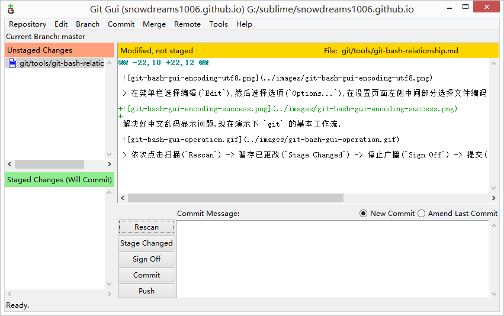

# git bash 扩展命令方式

`git bash` 命令行工具是 `Windows` 系统安装 `git` 服务时默认安装的命令行操作工具,除了命令行工具之外,他还有一个同胞兄弟`git gui` 图形化工具.

- 图形化操作工具

- 命令行操作工具

关于图形化工具和命令行工具的对比分析就不再赘述了,图形化适合简单需求,命令行适合高级功能.

更何况工作中生产服务器一般都是 `Linux` 环境,而 `Linux` 服务器主要都是通过命令行工具完成相关操作,根本没有 `Windows` 那样丰富的人性化界面.

> `ubuntu` 桌面版例外,既兼顾 `Windows` 可视化桌面,又支持 `Linux` 命令行操作.

所以,推荐平时工作中也尽量学习使用命令行工具,平时多流汗,战时少流血!

`git bash` 命令行足够强大,不仅支持 `git` 操作命令,也支持 `linux` 命令行的一些常用命令.

所以很多时候我们可以替代掉 `Windows` 自带的 `cmd` 命令行,值得注意的是,`git bash` 虽然足够强大,但是并不能**完全替代**`cmd`!

## git bash 的优势

## git bash 的不足

