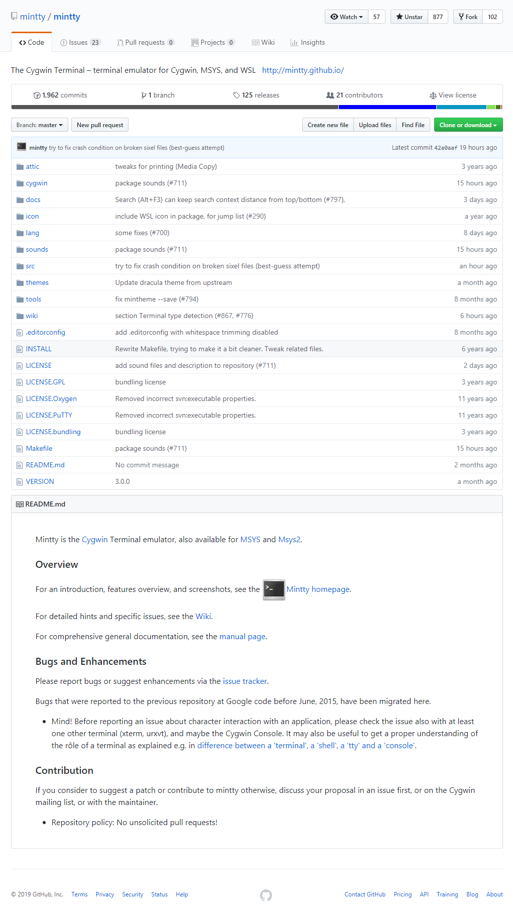

# git bash 复杂关系

> 曾以为 `git bash` 能够**完全取代** `cmd` ,谁知道 `cmd` 却投给我一个鄙视的眼神!

`git bash` 确实能够在一定程度上替代 `cmd` ,但是默认安装的 `git bash` 命令行工具并不能彻底取代 `cmd` ,难怪 `cmd` 听说要让自己退休,会呵呵一笑了!


## 你好陌生老朋友

`windows` 小伙伴们在学习 `git` 时不知道有没有接触过 `git bash` 命令行工具？

反正我是接触过并且仍然在一直在使用中,因为 `git bash` 命令行工具是 `windows` 系统安装 `git` 服务时**默认安装**的扩展工具,它还有一个异卵双胞胎兄弟是 `git gui` 图形化工具.

这两兄弟一个像 `linux` ,一个像 `windows` ,虽然是一母同生,性格长相却千差万别,不过确实是双胞胎兄弟哟!

### 图形化操作工具

首先登场的是 `Windows` 系统所喜闻乐见的图形化工具,`git gui` 闪亮登场!


不是说好闪亮登场的吗,怎么右侧文件区是乱码?别急,简单设置下编码方式就能正常显示中文了.


> 在菜单栏选择编辑(`Edit`),然后选择选项(`Options...`),在设置页面左侧中间部分选择文件编码格式(`Default File Content Encoding`) 修改(`Change`)成 `utf-8`.


解决好中文乱码显示问题,现在演示下 `git` 的基本工作流.


> 依次点击扫描(`Rescan`) -> 暂存已更改(`Stage Changed`) -> 停止广播(`Sign Off`) -> 提交(`Commit`),完成一次文件修改后的提交操作.

### 命令行操作工具

其次登场的是 `linux` 小伙伴很熟悉的命令行操作方式,唤醒方式和上述工具的方式基本一致,选中项目的根路径**右键**选择`Git Bash Here` 跳出命令行窗口.


> `git --version` 查看 `git` 版本,`git status` 查看文件状态,`git add` 添加文件,`git commit` 提交文件.

现在两兄弟分别登台亮相,向大家展示了基本的操作流程,虽然操作方式不同,但最终目的确实一致的,这一下应该认同他们俩确实是亲兄弟了吧.

下面我们重点讨论下 `git bash` 命令行工具,看 `git` + `bash` 会擦除什么样的火花,让我们重新认识一下这个**陌生的老朋友**.


> `git bash` 命令行工具大多数情况下是通过安装 [git](https://git-scm.com/download/win) 时进行集成安装的,当然也不排除[单独安装](http://git-for-windows.github.io/)的可能性.

## 回忆那年初相见

> 时光不老,我们不散,`git bash` 陪我们一起走过难忘的那一段路.

`git` 是 `linux` 的缔造者开发出的一款**分布式版本控制系统**,最初是为了 `linux` 系统的多人协同开发,后来逐渐风靡全球,如今已成为**最先进最流行**的**分布式版本控制系统**.


### `Git` 和 `Git for Windows`

最初 `git` 只支持 `linux` 操作系统,后来 `windows` 系统也慢慢支持了,只不过这种支持并不是 `git` 官方所为,而是**微软**团队进行移植整合的产品.


> `git` 是分布式版本控制系统,源代码托管在 `github` 网站,`github` 是知名度很高的在线代码托管平台.

从上述两张图中,我们不难得出以下结论.

- `Git` 的官网是 [https://git-scm.com](https://git-scm.com),`Git` 组织主要负责维护 `git` 项目和 `git-scm` 网站.
- `Git for Windows` 的官网是 [https://gitforwindows.org/](https://gitforwindows.org/),`Git for Windows` 组织项目明显多了不少,不仅要维护`Git` 还要提供移植 `Git` 所需的一系列后勤支持.
- `Git` 支持 `Windows` 本身的行为来源于 `Git for Windows` 组织,并不是 `Git` 天然支持的功能.
- `Git for Windows` 组织项目大部分来源于其他开源项目,也就是说将 `Git` 移植到 `Windows` 系统背后需要很多技术支持.

> `Git` 本身是 `linux` 系统的软件,所以类 `linux` 系统的 `mac` 是**天然支持**的,而差异比较大的 `Windows` **无法天然支持**,所以 `Git for Windows` 组织移植了 `Git` ,从而实现了**变相支持**.	

### 图形化工具还是命令行工具

学习 `git` 或是工作所需,或是开源精神所驱使,不管出于怎样的目的,只要是想要学习 `git` ,那第一步已经迈出去,接下来的日子里我们都在构建自己的知识库.

如果是目的性非常明确的工作任务,越快越好,跟随项目团队选择一个图形化工具弄清楚基本操作,再配合实际工作需要找到自己的工作流程,这种方式最经济快捷.

如果时间相对充裕,建议学习一下命令行操作.毕竟不是所有的环境都有自己熟悉的开发工具,更何况大牛更喜欢命令行操作,更炫酷更有型,不是吗？

明明有各种各样的图形化工具,为什么偏偏要学习命令操作,原因其实很简单：

- 记住命令有利于我们更加了解团队开发的工作流程以及自己在什么位置.
- 熟悉命令行后我们可以自由组合任意命令,从而定义属于自己的工作流.
- 更加接近真实生产环境,临时从开发环境切换到生产环境不至于措手不及.
- 各种图形化工具存在差异性,换个图形化工具又要重新记忆按键位置.
- 图形化工具不能随心所欲控制细节,功能受限,无法或者很难自定义扩展.

> 以上原因只是**一家之言**,切勿当真也不要较真,仅供参考,仅此而已.

回想起当初使用命令行操作 `git` 时,确实不太习惯,和大多数人一样最初还是习惯图形化操作工具.

但是,现在想一想命令行操作其实也没有那么难,简单的命令重复练习,自然而然就记住了,不是吗？

- `git init` 或者 `git clone` 用于初始化项目.
- `git add` 和 `git commit` 用于提交版本.
- `git status` 和 `git diff` 用于查看状态.
- `git push` 和 `git pull` 用于更新版本。
- `git branch` 和 `git tag` 用于开发和发布.
- ...

## 忽遇阵雨摧花枝

> 三月春风正得意,忽遇阵雨摧花枝.曾以为不会再用到 `cmd` 命令行,事实证明 `git bash` 并不是万能的.

命令行操作最直观的好处就是高效简单,手不必离开键盘,持续不断的输入不被打断.

当然这也是很多人使用命令行的原因之一,除此之外,熟悉命令行操作后还可以帮助我们更好编写批处理文件.

正所谓"工欲善其事必先利其器",使用命令行操作需要有顺手的命令行工具,而 `windows` 自带的 `cmd` 命令行工具功能太弱了,并且和基本的 `linux` 体验根本不一致.

所以,基本上不会使用 `cmd` 命令行,而安装 `git` 时恰巧给我们提供了 `git bash` 命令行工具,不仅可以用它操作 `git` ,日常工作中使用它也是绰绰有余.

### 三月春风正得意

比如,我们使用 `cmd` 和 `git bash` 打开指定目录,看一下两者的表现自然明白为什么要使用 `git bash` ?


> `cmd` 想要切换到指定目录,首先需要切换**盘符**,然后再使用 `cd` 命令切换到该盘符下的指定目录.


> `git-bash` 想要切换到指定目录,只需要使用 `cd` 命令直接切换到指定目录.

因为 `Windows` 系统自带的 `cmd` 命令行工具走的是 `Windows` 逻辑,所以如果用 `linux` 命令行那套逻辑肯定行不通.

换句话说,如果想要直接使用 `cmd` 命令行,需要重新学习 `cmd` 相关知识,除非有着特定的工作场景,不然我实在不明白为啥要**单独学习**`cmd`?

因为 `linux` 那套命令行逻辑有着真实的应用场景,所以学习命令行基本上算是工作必备技能,而 `windows` 的命令行则没有这层实际意义,那么自然是希望能够在 `windows` 上获取类似于 `linux` 那样的体验.

所以,当 `git` 提供的 `git bash` 命令行工具能满足日常管理所需时自然不会再考虑 `cmd` 命令行.

毕竟,`git bash` 不仅操作界面漂亮而且功能体验也不错,提供了基本的 `bash` 功能足够应付日常开发需求.

### 忽遇阵雨摧花枝

然而,长此以往潜意识中认为 `git bash` 能够完全替代 `cmd`,但是这种想法是不对的！

比如有些命令，`git bash` 没有提供就认为 `cmd` 肯定也没有,实际中运行 `tree` 命令能够清楚验证这种情况.

`git bash` 命令行中运行 `tree` 命令发现查无命令.

```bash
$ tree
bash: tree: command not found
```

`cmd` 命令行中运行 `tree` 命令可正常显示当前目录树结构.

```bash
G:\sublime\test>tree
卷 工作 的文件夹 PATH 列表
卷序列号为 000000C8 CC3C:50D0
G:.
├─cmd
└─git
```

## 探求庐山真面目

> 圣贤告诉我们要"只知其然知其所以然",为什么 `git bash` 不支持 `tree` 命令?

### 重走当年长征路

重温当初走过的路,试图从安装 `git` 时能否找到蛛丝马迹,大多数情况下我们是采用安装 `git` 顺带集成的`git bash` 命令行工具.

下载安装的无关截图这里就不展示了,一步一步重新安装 `git` 时看到了一点蛛丝马迹.


> 原文: Git Bash will use MinTTY as terminal emulator, which sports a resizable window, non-rectangular selections and a Unicode font. Windows console programs(such as interactive Python) must be launched via' winpty' to work in MinTTY.

> 翻译: `MinTTY` 是 `MSYS2` 的默认终端,`git bash` 将使用 `MinTTY `作为终端模拟器,如有需要调用`Windows` 程序必须通过 `winpty` 才能正常工作.

上述介绍文字虽然看起来并不起眼,毕竟我们安装 `windows` 程序时基本上都是下一步下一步就完成了安装,但是作为重点理解为什么 `git bash` 不支持 `tree` 命令,我们有必要好好研究这段话.


- `git bash` 是命令行工具没错,但是模拟终端实际上是 `MinTTY` ,所以与其说 `git bash` 不支持某些`linux` 命令,不如说为什么安装的 `MinTTY` 终端不支持.
- `MinTTY` 是一种**模拟终端**,是 `MSYS2` 的默认终端.
- 调用 `Windows` 程序时必须通过 `winpty` 开头才能在 `MinTTY` 终端正常工作.

> 通过上述分析,我们得到了一条重要线索: `MinTTY` 终端和 `MinTTY` 系统.

### 总结经验有感悟

安装过程中仅能获取到这些有效信息,那么安装完成后能否提供更多细节呢?


> 点击 `git bash` 图标或者右键唤起菜单项(`Option...`),查看关于(`About`)软件介绍.

简介的正上方标题是 `mintty` 而不是`git bash` ,这也验证了安装 `git bash` 时配置的模拟器确实是 `mintty` .

`mintty` 在很大程度上基于 `PuTTY` ,其中 `mintty` 的项目官网是 [http://mintty.github.io/](http://mintty.github.io/).

现在我们又多了一条线索,`mintty` 是基于 `putty` 二次开发的产品,并且既然 `mintty` 的官网地址是使用 `github` 的 `github page` 搭建的,从而可以猜测出 `mintty` 源代码八成也托管在 `github`.

再次整理下目前积累的线索:

- `git bash` 内置 `mintty` 终端,从而实现类似于 `linux` 命令行的开发体验.
- `mintty` 是 `mysys2` 的默认终端,猜测 `mysys2` 大概是类似于 `linux` 这种操作系统吧.
- `mintty` 是基于 `putty` 二次开发的产品,运行 `windows` 控制台程序时必须通过 `winpty` 调用,暂时无法猜测 `winpty` 是什么性质的产品.

### 抓住线索再出发

先不管那么多,先去看看 `mintty` 的官网,发现更多细节吧!


官网介绍带我们了解了更多细节,一步一步解读,看看 `mintty` 到底是什么鬼?

> 原文: Mintty is a terminal emulator for Cygwin, MSYS or Msys2, and derived projects, and for WSL.

> 翻译: `mintty` 是 `cygwin` ,`msys` 或者 `msys2` 的终端模拟器,是派生项目,为了 `wsl` .

言简意赅的自我描述向我们展示了三个重点,首先是终端模拟器,其次是 `cygwin` ,还有 `msys` 和 `msys2` ,最后是 `wsl` .

一下子暴露出这么多陌生名词并且分别给出了链接,看起来他们并不简单,当然现在还不是了解他们的最佳时间,当务之急还是先看看 `mintty` 官网向我们传达了什么有价值的信息吧!

> Xterm-compatible terminal emulation, coverage of DEC VT300 series terminal features and more.

- 兼容 `Xterm` 终端模拟器,覆盖 `DEC VT300` 系列终端功能等.

又冒出两个陌生名词,不过这两个好像并不重要,只不过是说 `mintty` 是终端模拟器并且兼容 `Xterm` 和`DEC VT300`模拟器.

这条信息的价值不是很大,我们早已经知道 `mintty` 是一种终端模拟器了,至于和其他模拟器兼容性如何并不是很关心.


> Running in Cygwin, MSYS(2), midipix. Also hosting WSL.
> Running on Windows XP, Windows 7, Windows 10.

- 运行在 `cygwin` ,`msys(2)` 和 `midipix` ,并且托管在 `wsl` .
- 运行在 `Windows xp`,`Windows 7` 和 `Windows 10` .

这段话证明了我们两个猜想,`msys` 是操作系统以及 `wsl` 很重要,已经是第二次出现了.

> Mintty works on all Windows versions from Windows XP onwards. Similarly to other Cygwin/MSYS terminals based on pseudo terminal ("pty") devices, however, mintty is not a full replacement for the Windows Console window (by default running the Windows Command Processor / command prompt / cmd.exe). While native console programs with simple text output usually work fine, interactive programs often have problems, although sometimes there are workarounds. See the Wiki section about Input/Output interaction for hints, especially on the winpty wrapper.

- `mintty` 是一种终端模拟器,在 `windows` 上运行地不错,和其他基于 `pseudo terminal ("pty")` 的终端模拟器类似,并不能完全替代 `Windows` 控制台.**简单文本输出**的原生控制台程序可以正常工作,但交互式程序则会遇到问题.更多详情请查看 `winpty` 包装器.

这段话满是干货,官宣直接验证本文开篇结论,`git bash` 并不能完全替代 `cmd`.其次就是频繁出现的`winpty` 到底是什么,不仅安装 `git` 时出现了,现在又出现了.

看来也是很重要的一个名词,毕竟给出相关链接的名词都不是简单名词.

> In Cygwin, it is installed as the default "Cygwin Terminal". 
For MSYS (old), select the msys-mintty package in the installer. (Or from MinGW, install the package with mingw-get install mintty.) 
For MSYS2, mintty is installed by default, or it can be installed later with the command pacman -S mintty.

- `mintty` 还是 `cygwin` 系统的默认终端,`msys` 系统安装 `msys-mintty` 进行安装 `mintty`(或者`MinGW` 通过 `mingw-get install mintty` 进行安装),`MSYS2` 通过 `pacman -S mintty` 安装.

这段话向我们展示了各个操作系统如何安装 `mintty`,虽然大部分情况下默认已安装,但还是提供了手动安装的解决方案(当然都是通过包管理工具方式进行安装).

看起来和我们无关,因为安装 `git bash` 时已安装了 `mintty` 了啊,自然不需要再手动安装.

但是,仔细想一想这篇文章之所以存在不正是因为 `git bash` 命令行没有提供 `tree` 命令吗?

既然没有提供 `tree` 命令,那我们手动安装就好了吧?

可是,事情远远没有这么简单,`linux` 系统中安装第三方命令大概分为两种途径,一种是包管理工具,另外一种是源码编译方式.

那么作为 `windows` 系统的 `git bash` 也能如此扩展第三方命令吗?

答案是不能!

因为 `mintty` 本身就是通过包管理工具安装的,证明我们是没有包管理工具可以扩展第三方命令,正如人可以造房子,但是已造好的房子还能自己造桌子椅子吗?

源码编译的方式能否扩展第三方命令呢?对于这部分不敢妄自猜测,可能可以也可能不可以.

可以的原因在于 `linux` 进行源码安装时依赖的是 `c` 环境进行编译安装,如果 `windows` 系统也安装 `c` 环境进行编译应该也能成功.

不可以的原因在于 `windows` 毕竟不是 `linux` ,底层差异还是非常大的,可能无法支持全部 `linux` 特性,不然 `git` 移植过程中也不必维护那么多项目才能提供背后技术支持.

不管怎么样,可以预见的是,即使通过编译安装的方式能够扩展第三方命令,但过程想必十分复杂,自然不是我等小白能够轻松扩展的.

所以两种扩展途径基本上都不能扩展第三方命令,真的需要扩展命令的话,要么安装完整的坏境使其带有相应的**包管理**工具,要么源码编译安装并支持 `windows` 系统.

简单回顾一下 `mintty` 官网传达出的有价值信息点有哪些?

- `mintty` 是 `cygwin` ,`msys(2)` 的默认终端模拟器,托管于 `wsl`.
- `mintty` 兼容`Xterm` 模拟器,是一种**伪终端**,调用原生控制台程序时需要借助 `winpty` 进行包装.
- `mintty` 只是终端,不具备**包管理**功能,可能无法扩展第三方命令.

### 跟随线索刨到底 

> 刨根要问底儿,只有知道是什么才能更好地回答为什么.

刚才研究 `minty` 官网时留下了几个特殊名词,`Cygwin` 和 `MSYS(2)` 系统以及 `WSL`.

根据上文的猜测,`Cygwin` 和 `MSYS(2)` 应该都是一种操作系统,那么暂时先不深究他们之间有什么关系,现在先看看 `WSL` 是怎么回事?

#### 线索之 `WSL` 

> `WSL` : `Windows Subsystem for Linux` 的缩写,项目地址: [https://github.com/mintty/wsltty](https://github.com/mintty/wsltty)


> 原文: Mintty as a terminal for WSL (Windows Subsystem for Linux).

> 翻译: `Mintty` 是为 `WSL` 而生的终端,`WSL` 是实现 `Linux` 系统体验的 `Windows` 的子系统.

由此可见,`Mintty` 的最终目的是打造 `Windows` 上的 `linux` 体验,本质还是 `Windows` 系统.

`wsltty` 项目没有提供更多细节供我们继续参考,但是却给我们留下一条线索,`wsltty` 和 `mintty` 同属于 `mintty` 组织项目.

不知道这种命名有没有什么内在联系,`wsltty` 去掉后面的 `tty` 是 `wsl` ,而 `wsl` 是 `Windows Subsystem for Linux` 的缩写.

那么 `mintty` 去掉后面的 `tty` 剩下就是 `min` ,又是什么单词的缩写呢?

暂时不得而知,既然已经来到 `mintty` 的组织账号,那我们不妨顺便看一下 `mintty` 本身项目.



仅仅是简单的项目介绍,并没有额外信息,看来 `WSL` 这条线索到此为止了.

#### 线索之 `Cygwin` 

> 在 `Windows` 上获得 `linux` 的感觉. 官网: [https://cygwin.com/](https://cygwin.com/)


`Cygwin` 是 `GNU` 工具,在 `windows` 上获得 `linux` 的体验,但并不能运行原生 `linux` 程序,必须重新编译源代码才能在 `windows` 上运行.

现在我们知道 `Cygwin` 是一种功能,用来在 `windows` 系统上获得 `linux` 的感觉,其中 `Cygwin` 源代码中涉及到 `GNU` 这这个陌生名词.

#### 线索之 `MSYS`

> 适用于 `Windows` 的极简 `GNU`,官网: [http://mingw.org/wiki/MSYS](http://mingw.org/wiki/MSYS)


> 原文: SYS is a collection of GNU utilities such as bash, make, gawk and grep to allow building of applications and programs which depend on traditionally UNIX tools to be present. It is intended to supplement MinGW and the deficiencies of the cmd shell.

> 翻译: `MSYS` 是一组GNU实用程序,如 `bash`，`make`，`gawk` 和 `grep` ,可以构建依赖于传统 `UNIX` 工具的应用程序和程序.它旨在补充 `MinGW` 和 `cmd shell` 的缺陷.

- `MSYS` 是 `GNU` 工具集合,旨在补充 `MinGW` 和 `cmd shell` 的缺陷.

> 原文: A common misunderstanding is MSYS is "UNIX on Windows", MSYS by itself does not contain a compiler or a C library, therefore does not give the ability to magically port UNIX programs over to Windows nor does it provide any UNIX specific functionality like case-sensitive filenames. Users looking for such functionality should look to Cygwin or Microsoft's Interix instead.

> 翻译: 一个常见的误解是: `MSYS` 是 "Windows上的UNIX",`MSYS` 本身不包含编译器或C库,因此无法将 `UNIX` 程序神奇地移植到 `Windows`,也不提供任何 `UNIX`特 定功能，如大小写-敏感文件名.寻找此类功能的用户应该选择 `Cygwin` 或 `Microsoft` 的 `Interix`.

- `MSYS` 并**不是windows上的Unix**,完整的解决方案应该选择 `Cygwin` 或 `Interix` 等.