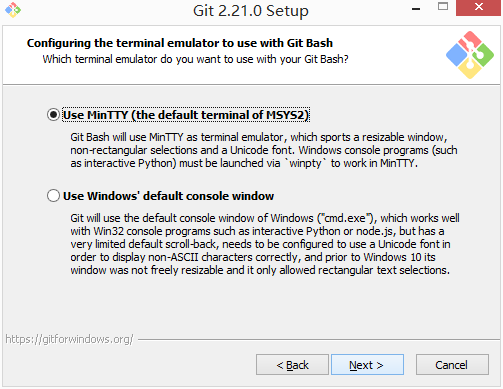

# git bash 没有tree命令?

## 开门见山

`git bash` 是 `Windows` 用户安装 `git` 时默认安装的命令行工具,不仅界面漂亮功能也不错,大多数情况下可以替代 `Windows` 原生的 `cmd` 命令行.

然而,`git bash` 命令行不是万金油,并不能完全替代 `cmd` ,详情请参考 `mintty` 官网的[相关说明](https://mintty.github.io/#Compatibility).


> mintty is not a full replacement for the Windows Console window

`git bash` 命令行默认使用 `mintty` 作为终端模拟器,而 `mintty` 官宣表示自己不能完全替代 `cmd`,也就是说 `git bash` 可能不具备某些 `cmd` 命令.



举个简单的例子,如果想要查看当前目录的文件结构,最好是以目录树的形式展现,聪明的你获取已经猜到了`tree` 命令.

`git bash` 命令行中输入 `tree` 命令发现并无此命令.

```bash
snowdreams1006@home MINGW64 /g/sublime/test
$ tree
bash: tree: command not found
```

为了验证,确实没有 `tree` 命令,我们直接打开 `git bash` 支持的命令文件目录,查看到底有没有 `tree.exe` 文件.


> 在 `git bash` 桌面快捷方式**右键**,选择**打开文件位置**,当前正处于 `git` 的安装目录,进入`.\usr\bin` 文件夹.

经过验证,`git bash` 支持的命令文件确实没有发现 `tree.exe` 文件,因此真的不支持 `tree` 命令.

然而,`cmd` 自带的命令行中输入 `tree` 中竟然发现能够输出目录树,原来 `cmd` 支持 `tree` 命令.

```bash
G:\sublime\test>tree
卷 工作 的文件夹 PATH 列表
卷序列号为 00000081 CC3C:50D0
G:.
├─cmd
└─git
```


> `tree` 命令其实调用的是 `tree.com` 并不是常见的 `tree.exe` 格式.

## 科普时间

现在我们已经知道 `git bash` 提供的终端模拟器不支持某些 `linux` 命令,但是为什么不支持以及如何才能支持这些命令呢?


这些问题必须等我们弄清楚 `mintty` 的朋友圈关系才能更好地解决上述问题,接下来简单科普下 `mintty` 的朋友圈.

> 关于科普知识来源请参考上一篇文章: <<git bash 背后的朋友圈>>

### `mintty` 是什么


