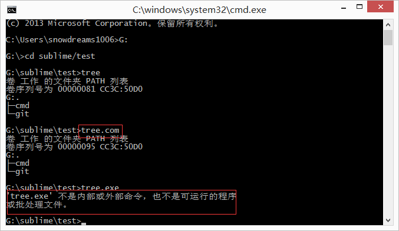
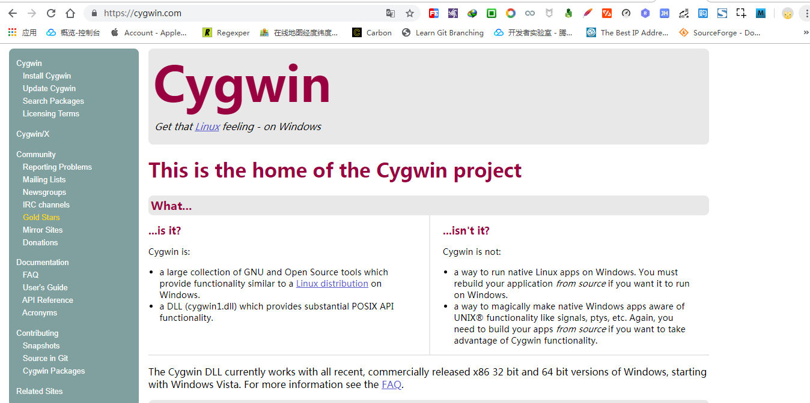
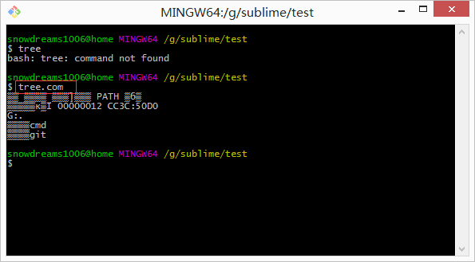

# git bash 没有tree命令?

## 开门见山

`git bash` 是 `Windows` 用户安装 `git` 时默认安装的命令行工具,不仅界面漂亮功能也不错,大多数情况下可以替代 `Windows` 原生的 `cmd` 命令行.

然而,`git bash` 命令行不是万金油,并不能完全替代 `cmd` ,详情请参考 `mintty` 官网的[相关说明](https://mintty.github.io/#Compatibility).


> mintty is not a full replacement for the Windows Console window

`git bash` 命令行默认使用 `mintty` 作为终端模拟器,而 `mintty` 官宣表示自己不能完全替代 `cmd`,也就是说 `git bash` 可能不具备某些 `cmd` 命令.


举个简单的例子,如果想要查看当前目录的文件结构,最好是以目录树的形式展现,聪明的你获取已经猜到了`tree` 命令.

`git bash` 命令行中输入 `tree` 命令发现并无此命令.

```bash
snowdreams1006@home MINGW64 /g/sublime/test
$ tree
bash: tree: command not found
```

为了验证,确实没有 `tree` 命令,我们直接打开 `git bash` 支持的命令文件目录,查看到底有没有 `tree.exe` 文件.


> 在 `git bash` 桌面快捷方式**右键**,选择**打开文件位置**,当前正处于 `git` 的安装目录,进入`.\usr\bin` 文件夹.

经过验证,`git bash` 支持的命令文件确实没有发现 `tree.exe` 文件,因此真的不支持 `tree` 命令.

然而,`cmd` 自带的命令行中输入 `tree` 中竟然发现能够输出目录树,原来 `cmd` 支持 `tree` 命令.

```bash
G:\sublime\test>tree
卷 工作 的文件夹 PATH 列表
卷序列号为 00000081 CC3C:50D0
G:.
├─cmd
└─git
```



> `tree` 命令其实调用的是 `tree.com` 并不是常见的 `tree.exe` 格式.

## 科普时间

现在我们已经知道 `git bash` 提供的终端模拟器不支持某些 `linux` 命令,但是为什么不支持以及如何才能支持这些命令呢?


这些问题必须等我们弄清楚 `mintty` 的朋友圈关系才能更好地解决上述问题,接下来简单科普下 `mintty` 的朋友圈.

> 关于科普知识的来源,请参考上一篇文章: <<git bash 背后的朋友圈>>

### `mintty` 是什么

> `Mintty` 是 `Cygwin`，`MSYS` 或 `Msys2` 的终端模拟器,派生项目和 `WSL`.

`mintty` 开源终端模拟器,基于 `putty` 的终端仿真和 `Windows` 前端页面.


`mintty` 作为一款优秀的终端模拟器,不仅是其他系统上默认的终端,也是 `git bash` 的默认终端.

```bash
$ mintty --help
Usage: mintty [OPTION]... [ PROGRAM [ARG]... | - ]

Start a new terminal session running the specified program or the user's shell.
If a dash is given instead of a program, invoke the shell as a login shell.

Options:
  -c, --config FILE     Load specified config file
  -e, --exec            Treat remaining arguments as the command to execute
  -h, --hold never|start|error|always  Keep window open after command finishes
  -i, --icon FILE[,IX]  Load window icon from file, optionally with index
  -l, --log FILE|-      Log output to file or stdout
  -o, --option OPT=VAL  Override config file option with given value
  -p, --position X,Y    Open window at specified coordinates
  -s, --size COLS,ROWS  Set screen size in characters
  -t, --title TITLE     Set window title (default: the invoked command)
  -u, --utmp            Create a utmp entry
  -w, --window normal|min|max|full|hide  Set initial window state
      --class CLASS     Set window class name (default: mintty)
  -H, --help            Display help and exit
  -V, --version         Print version information and exit
```

如果想要自定义 `mintty` 终端,在 `git bash` 命令行界面右键选择选项设置即可打开设置页面.


### `mingw` 是什么

> `mingw` 是 `Minimalist GNU for Windows` 的缩写,是 `Microsoft Windows` 应用程序的极简主义开发环境.


### `msys` 是什么

> `MSYS` 是 `Minimal SYStem` 的缩写,是 `Bourne Shell` 命令行解释器系统.作为 `Microsoft` 的 `cmd.exe` 的替代品,它提供了一个通用的命令行环境,特别适合与 `MinGW` 一起使用,用于将许多开源应用程序移植到 `MS-Windows`平台; 它是 `Cygwin-1.3` 的轻量级分支，它包含一小部分 `Unix` 工具,可以帮助实现这一目标.

### `cygwin` 是什么

> 大量 `GNU` 和开源工具,提供类似于 `Windows` 上的 `Linux` 发行版的功能.



### `gnu` 是什么

> `GNU` 是 `GNU's Not Unix` 的递归缩写,是自由软件操作系统. 


### 朋友圈关系梳理

`git bash` 采用 `mintty` 作为终端模拟器,而 `mintty` 终端是 `mingw` ,`msys2` 和 `cygwin`的默认终端,这些"操作系统"或多或少都是 `GNU` 的一部分.

`GNU` 是自由软件运动的成果,提出自由软件以及自由软件操作系统概念,源码开源发布.

正因如此,江山代有才人出,前人栽树后人乘凉,`Cygwin` 作为 `GNU` 一员,提出了要在 `Windows` 打造出 `Linux` 的感觉,开发出一套完整的解决方案.

或许由于这套方案太完整,功能齐全因而软件包体积庞大,因此 `MinGW` 和 `MSYS` 分别在其基于上进行精简重构,保留最简功能,发展出"极简主义的GNU".

开源的力量是可持续的,慢慢的,这些操作系统的内置终端功能也被单独提取出来,`mintty` 作为他们的默认终端也逐渐独立提供终端模拟器服务,轻松和各个系统进行安装集成.

说到开源,自然是少不了 `git` 的身影,分布式版本控制系统这种优秀工具应该造福全人类,然而 `git` 本身仅支持类 `Unix` 系统,并不提供 `WIndows` 系统的支持.

`Git For Windows` 组织出手增加了 `git` 对 `Windows` 系统的支持,背后的技术多半离不开上述介绍的 `GNU` 操作系统.

`Git Bash Here` 则是 `Git For Windows` 的命令行工具,使用的终端模拟器就是明星模拟器 `mintty`.


## 回到正题

弄清楚事情的来龙去脉后,对我们解决问题有什么帮助呢?

帮助可大了去了,刨根问题找到了源头,问题自然迎刃而解!

### 直接放弃吧!少年

你确定不是在逗我?让我直接放弃?


亲,真的抱歉呢,放弃是解决问题的最快途径!

...

谈一谈为什么要放弃?

`git bash` 命令行使用的是 `mintty` 终端,而 `mintty` 终端并不能完全替代 `cmd` ,也没有提供包管理工具供我们扩展第三方命令.

所以默认情况下,如果没有提供某些命令,那我们只好放弃在 `git bash` 命令行中使用这些命令.

此路不通,自然会寻求其他解决途径,比如可以借助 `cmd` 命令行或者其他第三方软件等,没必要非要坚持使用`git bash`!

既然本文是 `tree` 命令引发的讨论,那就谈点和主题有关的技能点,不然岂不是跑题了?

`tree` 命令虽然 `git bash` 不提供,但是 `cmd` 却已经内置了.

值得注意的是,`cmd` 提供的 `tree` 命令比较特殊,并不是常见的 `.exe` 结尾文件,而是 `.com` 结尾的文件.

所以 `git bash` 中输入 `tree` 命令时,自身 `/usr/bin` 中没有 `tree.exe` 文件,而系统中也没有 `tree.exe` 命令,那么就会提示找不到命令了啊!

#### 手动补全命令

那么第一种调用方法便是补全后缀名,这样自然能够调用 `cmd` 的 `tree.com` 命令.


> `git bash` 并不识别 `.com` 后缀的命令,输入 `tree` 命令时以为是 `tree.exe` ,实际上 `tree` 命令应该是 `tree.com` 的简写.

我擦,竟然出现乱码,根据我多年的开发经验来看,乱码问题多半是编码问题导致的,那么修改下终端的编码设置应该就能解决问题.


> 在命令行窗口内右键弹出 `mintty` 终端的设置页面,选择文本(`Text`)中本地化(`Locale`)配置,选择中文简体(`zh_CN`),字符集(`Character set`)设置为`UTF-8`.



瞬间被打脸,无论是原来的`git bash` 命令行窗口还是新开的命令行窗口,仍然还是乱码!

然而,我是不会承认被打脸的,世人皆醉我独醒,肯定是 `bug`,哈哈!

> 其实,中文乱码真的是 `bug` ,还是官方认可的 `bug` 哟,我并没有被打脸呢,后续会介绍.

#### 调用 `cmd` 程序


