# git bash 没有tree命令?

## 开门见山

`git bash` 是 `Windows` 用户安装 `git` 时默认安装的命令行工具,不仅界面漂亮功能也不错,大多数情况下可以替代 `Windows` 原生的 `cmd` 命令行.

然而,`git bash` 命令行不是万金油,并不能完全替代 `cmd` ,详情请参考 `mintty` 官网的[相关说明](https://mintty.github.io/#Compatibility).


> mintty is not a full replacement for the Windows Console window

`git bash` 命令行默认使用 `mintty` 作为终端模拟器,而 `mintty` 官宣表示自己不能完全替代 `cmd`,也就是说 `git bash` 可能不具备某些 `cmd` 命令.


举个简单的例子,如果想要查看当前目录的文件结构,最好是以目录树的形式展现,聪明的你获取已经猜到了`tree` 命令.

`git bash` 命令行中输入 `tree` 命令发现并无此命令.

```bash
snowdreams1006@home MINGW64 /g/sublime/test
$ tree
bash: tree: command not found
```

为了验证,确实没有 `tree` 命令,我们直接打开 `git bash` 支持的命令文件目录,查看到底有没有 `tree.exe` 文件.


> 在 `git bash` 桌面快捷方式**右键**,选择**打开文件位置**,当前正处于 `git` 的安装目录,进入`.\usr\bin` 文件夹.

经过验证,`git bash` 支持的命令文件确实没有发现 `tree.exe` 文件,因此真的不支持 `tree` 命令.

然而,`cmd` 自带的命令行中输入 `tree` 中竟然发现能够输出目录树,原来 `cmd` 支持 `tree` 命令.

```bash
G:\sublime\test>tree
卷 工作 的文件夹 PATH 列表
卷序列号为 00000081 CC3C:50D0
G:.
├─cmd
└─git
```


> `tree` 命令其实调用的是 `tree.com` 并不是常见的 `tree.exe` 格式.

## 科普时间

现在我们已经知道 `git bash` 提供的终端模拟器不支持某些 `linux` 命令,但是为什么不支持以及如何才能支持这些命令呢?


这些问题必须等我们弄清楚 `mintty` 的朋友圈关系才能更好地解决上述问题,接下来简单科普下 `mintty` 的朋友圈.

> 关于科普知识的来源,请参考上一篇文章: <<git bash 背后的朋友圈>>

### `mintty` 是什么

> `Mintty` 是 `Cygwin`，`MSYS` 或 `Msys2` 的终端模拟器,派生项目和 `WSL`.

`mintty` 开源终端模拟器,基于 `putty` 的终端仿真和 `Windows` 前端页面.


`mintty` 作为一款优秀的终端模拟器,不仅是其他系统上默认的终端,也是 `git bash` 的默认终端.

```bash
$ mintty --help
Usage: mintty [OPTION]... [ PROGRAM [ARG]... | - ]

Start a new terminal session running the specified program or the user's shell.
If a dash is given instead of a program, invoke the shell as a login shell.

Options:
  -c, --config FILE     Load specified config file
  -e, --exec            Treat remaining arguments as the command to execute
  -h, --hold never|start|error|always  Keep window open after command finishes
  -i, --icon FILE[,IX]  Load window icon from file, optionally with index
  -l, --log FILE|-      Log output to file or stdout
  -o, --option OPT=VAL  Override config file option with given value
  -p, --position X,Y    Open window at specified coordinates
  -s, --size COLS,ROWS  Set screen size in characters
  -t, --title TITLE     Set window title (default: the invoked command)
  -u, --utmp            Create a utmp entry
  -w, --window normal|min|max|full|hide  Set initial window state
      --class CLASS     Set window class name (default: mintty)
  -H, --help            Display help and exit
  -V, --version         Print version information and exit
```

如果想要自定义 `mintty` 终端,在 `git bash` 命令行界面右键选择选项设置即可打开设置页面.

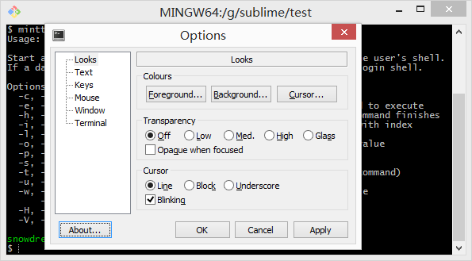

### `mingw` 是什么

> `mingw` 是 `Minimalist GNU for Windows` 的缩写,是 `Microsoft Windows` 应用程序的极简主义开发环境.

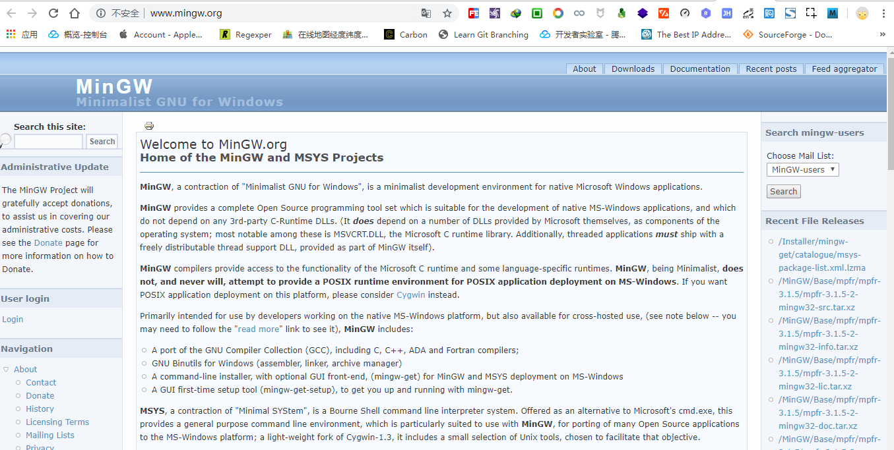

### `msys` 是什么

> `MSYS` 是 `Minimal SYStem` 的缩写,是 `Bourne Shell` 命令行解释器系统.作为 `Microsoft` 的 `cmd.exe` 的替代品,它提供了一个通用的命令行环境,特别适合与 `MinGW` 一起使用,用于将许多开源应用程序移植到 `MS-Windows`平台; 它是 `Cygwin-1.3` 的轻量级分支，它包含一小部分 `Unix` 工具,可以帮助实现这一目标.

### `cygwin` 是什么

> 大量 `GNU` 和开源工具,提供类似于 `Windows` 上的 `Linux` 发行版的功能.


### `gnu` 是什么

> `GNU` 是 `GNU's Not Unix` 的递归缩写,是自由软件操作系统. 

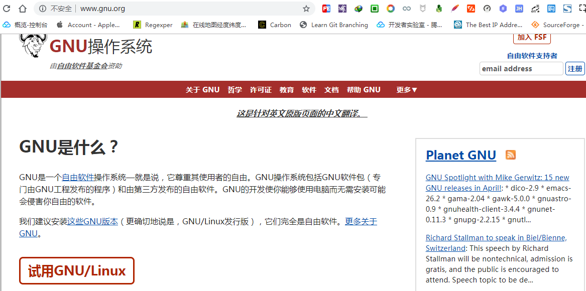

### 朋友圈关系梳理

`git bash` 采用 `mintty` 作为终端模拟器,而 `mintty` 终端是 `mingw` ,`msys2` 和 `cygwin`的默认终端,这些"操作系统"或多或少都是 `GNU` 的一部分.

`GNU` 是自由软件运动的成果,提出自由软件以及自由软件操作系统概念,源码开源发布.

正因如此,江山代有才人出,前人栽树后人乘凉,`Cygwin` 作为 `GNU` 一员,提出了要在 `Windows` 打造出 `Linux` 的感觉,开发出一套完整的解决方案.

或许由于这套方案太完整,功能齐全因而软件包体积庞大,因此 `MinGW` 和 `MSYS` 分别在其基于上进行精简重构,保留最简功能,发展出"极简主义的GNU".

开源的力量是可持续的,慢慢的,这些操作系统的内置终端功能也被单独提取出来,`mintty` 作为他们的默认终端也逐渐独立提供终端模拟器服务,轻松和各个系统进行安装集成.

说到开源,自然是少不了 `git` 的身影,分布式版本控制系统这种优秀工具应该造福全人类,然而 `git` 本身仅支持类 `Unix` 系统,并不提供 `WIndows` 系统的支持.

`Git For Windows` 组织出手增加了 `git` 对 `Windows` 系统的支持,背后的技术多半离不开上述介绍的 `GNU` 操作系统.

`Git Bash Here` 则是 `Git For Windows` 的命令行工具,使用的终端模拟器就是明星模拟器 `mintty`.


## 回到正题

弄清楚事情的来龙去脉后,对我们解决问题有什么帮助呢?

帮助可大了去了,刨根问题找到了源头,问题自然迎刃而解!

### 我劝少年放弃吧

你确定不是在逗我?让我直接放弃?


亲,真的抱歉呢,放弃是解决问题的最快途径!

...

谈一谈为什么要放弃?

`git bash` 命令行使用的是 `mintty` 终端,而 `mintty` 终端并不能完全替代 `cmd` ,也没有提供包管理工具供我们扩展第三方命令.

所以默认情况下,如果没有提供某些命令,那我们只好放弃在 `git bash` 命令行中使用这些命令.

此路不通,自然会寻求其他解决途径,比如可以借助 `cmd` 命令行或者其他第三方软件等,没必要非要坚持使用`git bash`!

既然本文是 `tree` 命令引发的讨论,那就谈点和主题有关的技能点,不然岂不是跑题了?

`tree` 命令虽然 `git bash` 不提供,但是 `cmd` 却已经内置了.

值得注意的是,`cmd` 提供的 `tree` 命令比较特殊,并不是常见的 `.exe` 结尾文件,而是 `.com` 结尾的文件.

所以 `git bash` 中输入 `tree` 命令时,自身 `/usr/bin` 中没有 `tree.exe` 文件,而系统中也没有 `tree.exe` 命令,那么就会提示找不到命令了啊!

#### 手动补全命令

那么第一种调用方法便是补全后缀名,这样自然能够调用 `cmd` 的 `tree.com` 命令.

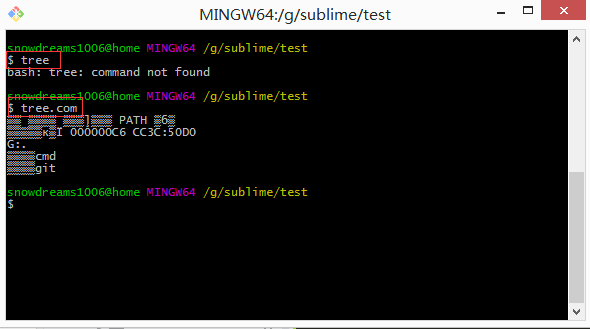

> `git bash` 并不识别 `.com` 后缀的命令,输入 `tree` 命令时以为是 `tree.exe` ,实际上 `tree` 命令应该是 `tree.com` 的简写.

我擦,竟然出现乱码,根据我多年的开发经验来看,乱码问题多半是编码问题导致的,那么修改下终端的编码设置应该就能解决问题.

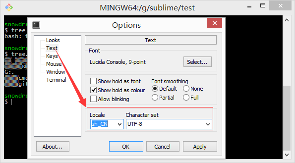

> 在命令行窗口内右键弹出 `mintty` 终端的设置页面,选择文本(`Text`)中本地化(`Locale`)配置,选择中文简体(`zh_CN`),字符集(`Character set`)设置为`UTF-8`.


瞬间被打脸,无论是原来的`git bash` 命令行窗口还是新开的命令行窗口,仍然还是乱码!

然而,我是不会承认被打脸的,世人皆醉我独醒,肯定是 `bug`,哈哈!

> 其实,中文乱码真的是 `bug` ,还是官方认可的 `bug` 哟,我并没有被打脸呢,后续会介绍.

#### 调用 `cmd` 程序

既然`git bash` 没有提供 `tree` 命令,而恰巧 `cmd` 提供了 `tree` 命令,那为何不假借他人之手实现自己的目的呢?

在 `cmd` 中使用 `tree` 命令直接输入即可得到目录树结构,但是现在需要在 `git bash` 中调用 `cmd` 中的 `tree` 命令.

```bash
# 直接输入 `tree` 命令,正确响应并且无中文乱码.
G:\sublime\test>tree
卷 工作 的文件夹 PATH 列表
卷序列号为 00000093 CC3C:50D0
G:.
├─cmd
└─git

# 输入 `cmd tree` 命令,虽无报错,但也没有正确响应.
G:\sublime\test>cmd tree
Microsoft Windows [版本 6.3.9600]
(c) 2013 Microsoft Corporation。保留所有权利。
```

> `cmd` 中直接输入 `tree` 命令即可,无需通过 `cmd tree` 这种方式,还以为你要调用 `cmd` 命令呢!

因此,我们需要告诉`git bash` 要通过 `cmd` 去调用下 `tree` 命令.

```bash
# 注意看前缀是 `snowdreams1006@home MINGW64` 表明当前处于 `git bash` 环境
snowdreams1006@home MINGW64 /g/sublime/test
# 输入 `cmd tree` 命令,虽无报错,但也没有正确响应,并且仍然有中文乱码.
$ cmd tree
Microsoft Windows [▒汾 6.3.9600]
(c) 2013 Microsoft Corporation▒▒▒▒▒▒▒▒▒▒Ȩ▒▒▒▒
# 输出 `tree` 命令,正确响应但有中文乱码.此时命令行前缀已经更改为 `G:\sublime\test>` 表明当前不再处于`git bash` 环境!
G:\sublime\test>tree
tree
▒▒ ▒▒▒▒ ▒▒▒ļ▒▒▒ PATH ▒б▒
▒▒▒▒▒к▒Ϊ 0000006B CC3C:50D0
G:.
▒▒▒▒cmd
▒▒▒▒git
```

通过上述操作结果来看,不难发现以下问题.

- `cmd tree` 命令切换到 `cmd` 环境,并且`tree` 命令并没有执行.
换句话说,`cmd tree` 和 `cmd dir` 或者 `cmd` 的作用相同,都是切换了当前 `bash` 环境.
- 进入 `cmd` 命令行运行 `tree` 能够得到正确响应,但存在中文乱码.
- 想要退出 `cmd` 环境,`Ctrl + C` 组合即可重新回到 `git bash` 环境.

由此可见,不加任何参数冒昧进入到 `cmd` 环境还是比较麻烦的,因此下面提供带参数的命令帮助我们阅后即焚.

`cmd //c tree` 命令,阅后即焚,表示执行完立即退出.

```bash
snowdreams1006@home MINGW64 /g/sublime/test
$ cmd //c tree
▒▒ ▒▒▒▒ ▒▒▒ļ▒▒▒ PATH ▒б▒
▒▒▒▒▒к▒Ϊ 00000008 CC3C:50D0
G:.
▒▒▒▒cmd
▒▒▒▒git
snowdreams1006@home MINGW64 /g/sublime/test
$
```

> 执行命令前后我们都在 `git bash` 环境并且在 `cmd` 中得到正确响应结果,唯一的区别就是多加了 `//c` 参数,表示执行完命令立即退出 `cmd` 环境.

#### 优雅调用 `cmd`

简单总结下,如何在 `git bash` 中借助 `cmd` 实现 `tree` 命令.

- `tree.com` : 补全调用命令后缀名,直接调用系统命令.
- `cmd //c tree` : 借助 `cmd` 运行 `tree` 命令,从而实现调用 `tree` 的目的.
- 这两种方式都存在中文乱码问题,即使设置了终端的编码方式也没有解决乱码.

调用 `tree` 命令的目的已经达到,没有解决的问题是中文乱码.

解决问题最快速的方式是百度一下或者从官网寻求帮助,这次我选择后者,因为百度一下人人都会,不用我再讲了吧!


简单解释下这段话的意思:

如果在 `mintty` 终端调用原生 `cmd` 程序,简单的输出指令没有什么问题,交互指令可能存在问题.
因此建议使用 `winpty` 进行包装再调用原生 `cmd` 程序.

> `winpty` 是一种提供与`cmd` 通信的软件包,详情请参考[https://github.com/rprichard/winpty](https://github.com/rprichard/winpty)

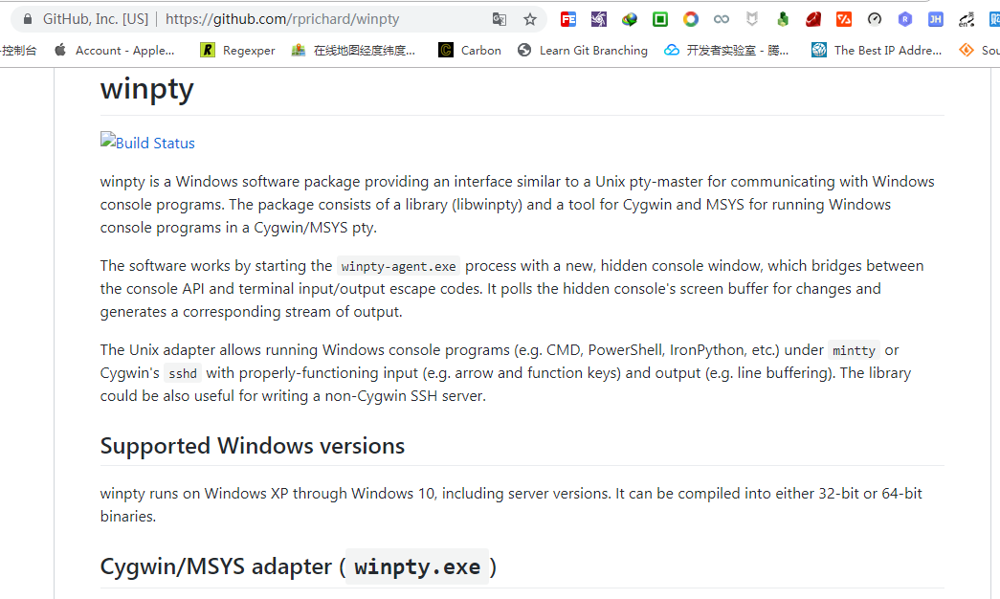

有什么神奇之处?不妨加上 `winpty` 试试看!

```bash
snowdreams1006@home MINGW64 /g/sublime/test
# `winpty` + `tree.com` : 正常输出且无中文乱码 
$ winpty tree.com
卷 工作 的文件夹 PATH 列表
卷序列号为 00000074 CC3C:50D0
G:.
├─cmd
└─git

snowdreams1006@home MINGW64 /g/sublime/test
# `winpty` + `cmd //c tree` : 正常输出且无中文乱码
$ winpty cmd //c tree
卷 工作 的文件夹 PATH 列表
卷序列号为 000000B3 CC3C:50D0
G:.
├─cmd
└─git

snowdreams1006@home MINGW64 /g/sublime/test
$
```

果然是神药,一下子就治好了我多年的老寒腿啊!

- `winpty tree.com` : 不叫小名而叫全称,直接调用系统命令
- `winpty cmd //c tree` : 假借他人之手,变相调用系统命令

> 上文中说设置文件编码应该能够解决中文乱码问题结果仍然有乱码,猜测是 `bug` ,现在没有打脸吧?

既然已经提供了解决方案,那文章是不是应该到此为止了呢?

不不不,远远还没结束,这只是开胃小菜,好戏还在后头呢.

更何况这命令也忒长了,记不住啊!

很简单,可以设置别名啊,把常用命令设置成别名,这样就记住啦!

输入 `alias` 命令没有报错,说明目前环境是支持设置别名的.

```bash
snowdreams1006@home MINGW64 /g/sublime/test
$ alias
alias ll='ls -l'
alias ls='ls -F --color=auto --show-control-chars'
alias node='winpty node.exe'
```

按照 `linux` 的操作习惯,命令行设置的一般都是临时性的,想要永久生效,都要写入到文件中,别名这种当然要一劳永逸设置成永久文件.

```bash
snowdreams1006@home MINGW64 /g/sublime/test
$ cat /etc/bashrc
cat: /etc/bashrc: No such file or directory

snowdreams1006@home MINGW64 /g/sublime/test
$ cat ~/.bashrc
cat: /c/Users/snowdreams1006/.bashrc: No such file or directory
```

竟然配置文件都不存在?


当然不存在了啊!快醒醒,你是在 `Windows` 系统上并不是 `Linux` 系统,上哪给你弄这些配置文件去?

脑海中迅速闪现哲学基本问题: 我是谁,我在那,我在干什么?

我是 `Windows` 系统用户,正在 `git bash` 命令行中试图设置别名,没有找到类似于 `linux` 配置文件.

既然你明白你何出来,那你去那里看看有没有什么发现?

```bash
snowdreams1006@home MINGW64 /g/sublime/test
$ cd /e/git
snowdreams1006@home MINGW64 /e/git
$ winpty tree.com
卷 软件 的文件夹 PATH 列表
卷序列号为 00000063 223E:7300
E:.
├─bin
├─cmd
├─dev
│  ├─mqueue
│  └─shm
├─etc
│  ├─pkcs11
│  ├─pki
│  │  └─ca-trust
│  │      ├─extracted
│  │      │  ├─java
│  │      │  ├─openssl
│  │      │  └─pem
│  │      └─source
│  │          └─anchors
│  ├─profile.d
│  └─ssh
├─mingw64
│  ├─bin
│  ├─doc
│  │  └─git-credential-manager
│  ├─etc
│  │  ├─pkcs11
│  │  └─pki
│  │      └─ca-trust
│  │          └─extracted
│  │              ├─java
│  │              ├─openssl
│  │              └─pem
│  ├─lib
│  │  ├─dde1.4
│  │  ├─engines
│  │  ├─itcl4.0.4
│  │  ├─p11-kit
│  │  ├─pkcs11
│  │  ├─reg1.3
│  │  ├─sqlite3.11.0
│  │  ├─tcl8
│  │  │  ├─8.4
│  │  │  │  └─platform
│  │  │  ├─8.5
│  │  │  └─8.6
│  │  │      └─tdbc
│  │  ├─tcl8.6
│  │  │  ├─encoding
│  │  │  ├─http1.0
│  │  │  ├─msgs
│  │  │  ├─opt0.4
│  │  │  └─tzdata
│  │  │      ├─Africa
│  │  │      ├─America
│  │  │      │  ├─Argentina
│  │  │      │  ├─Indiana
│  │  │      │  ├─Kentucky
│  │  │      │  └─North_Dakota
│  │  │      ├─Antarctica
│  │  │      ├─Arctic
│  │  │      ├─Asia
│  │  │      ├─Atlantic
│  │  │      ├─Australia
│  │  │      ├─Brazil
│  │  │      ├─Canada
│  │  │      ├─Chile
│  │  │      ├─Etc
│  │  │      ├─Europe
│  │  │      ├─Indian
│  │  │      ├─Mexico
│  │  │      ├─Pacific
│  │  │      ├─SystemV
│  │  │      └─US
│  │  ├─thread2.7.3
│  │  └─tk8.6
│  │      ├─demos
│  │      │  └─images
│  │      ├─images
│  │      ├─msgs
│  │      └─ttk
│  ├─libexec
│  │  └─git-core
│  │      └─mergetools
│  ├─share
│  │  ├─antiword
│  │  ├─doc
│  │  │  ├─connect
│  │  │  ├─git-doc
│  │  │  │  ├─howto
│  │  │  │  └─technical
│  │  │  └─nghttp2
│  │  ├─gettext-0.19.7
│  │  │  └─its
│  │  ├─git
│  │  │  ├─bindimage.txt
│  │  │  └─completion
│  │  ├─git-core
│  │  │  └─templates
│  │  │      ├─hooks
│  │  │      └─info
│  │  ├─git-gui
│  │  │  └─lib
│  │  ├─gitweb
│  │  │  └─static
│  │  ├─licenses
│  │  │  ├─bzip2
│  │  │  ├─expat
│  │  │  ├─gcc-libs
│  │  │  ├─gettext
│  │  │  │  ├─gettext-runtime
│  │  │  │  │  ├─intl
│  │  │  │  │  └─libasprintf
│  │  │  │  ├─gettext-tools
│  │  │  │  │  └─gnulib-lib
│  │  │  │  │      └─libxml
│  │  │  │  └─gnulib-local
│  │  │  │      └─lib
│  │  │  │          └─libxml
│  │  │  ├─libffi
│  │  │  ├─libiconv
│  │  │  │  └─libcharset
│  │  │  ├─libssh2
│  │  │  ├─libsystre
│  │  │  ├─libtasn1
│  │  │  ├─libtre
│  │  │  ├─libwinpthread
│  │  │  │  └─mingw-w64-libraries
│  │  │  │      └─winpthreads
│  │  │  ├─openssl
│  │  │  ├─wineditline
│  │  │  └─zlib
│  │  ├─nghttp2
│  │  ├─p11-kit
│  │  │  └─modules
│  │  ├─perl5
│  │  │  └─site_perl
│  │  │      └─Git
│  │  │          └─SVN
│  │  │              └─Memoize
│  │  └─pki
│  │      └─ca-trust-source
│  └─ssl
│      └─certs
├─tmp
└─usr
    ├─bin
    │  ├─core_perl
    │  └─vendor_perl
    ├─lib
    │  ├─awk
    │  ├─coreutils
    │  ├─gawk
    │  ├─gnupg
    │  │  └─gnupg
    │  ├─openssl
    │  │  └─engines
    │  ├─p11-kit
    │  ├─perl5
    │  │  ├─core_perl
    │  │  │  ├─auto
    │  │  │  │  ├─arybase
    │  │  │  │  ├─attributes
    │  │  │  │  ├─B
    │  │  │  │  ├─Compress
    │  │  │  │  │  └─Raw
    │  │  │  │  │      ├─Bzip2
    │  │  │  │  │      └─Zlib
    │  │  │  │  ├─Cwd
    │  │  │  │  ├─Data
    │  │  │  │  │  └─Dumper
    │  │  │  │  ├─DB_File
    │  │  │  │  ├─Devel
    │  │  │  │  │  ├─Peek
    │  │  │  │  │  └─PPPort
    │  │  │  │  ├─Digest
    │  │  │  │  │  ├─MD5
    │  │  │  │  │  └─SHA
    │  │  │  │  ├─Encode
    │  │  │  │  │  ├─Byte
    │  │  │  │  │  ├─CN
    │  │  │  │  │  ├─EBCDIC
    │  │  │  │  │  ├─JP
    │  │  │  │  │  ├─KR
    │  │  │  │  │  ├─Symbol
    │  │  │  │  │  ├─TW
    │  │  │  │  │  └─Unicode
    │  │  │  │  ├─Fcntl
    │  │  │  │  ├─File
    │  │  │  │  │  ├─DosGlob
    │  │  │  │  │  └─Glob
    │  │  │  │  ├─Filter
    │  │  │  │  │  └─Util
    │  │  │  │  │      └─Call
    │  │  │  │  ├─GDBM_File
    │  │  │  │  ├─Hash
    │  │  │  │  │  └─Util
    │  │  │  │  │      └─FieldHash
    │  │  │  │  ├─I18N
    │  │  │  │  │  └─Langinfo
    │  │  │  │  ├─IO
    │  │  │  │  ├─IPC
    │  │  │  │  │  └─SysV
    │  │  │  │  ├─List
    │  │  │  │  │  └─Util
    │  │  │  │  ├─Math
    │  │  │  │  │  └─BigInt
    │  │  │  │  │      └─FastCalc
    │  │  │  │  ├─MIME
    │  │  │  │  │  └─Base64
    │  │  │  │  ├─mro
    │  │  │  │  ├─NDBM_File
    │  │  │  │  ├─ODBM_File
    │  │  │  │  ├─Opcode
    │  │  │  │  ├─PerlIO
    │  │  │  │  │  ├─encoding
    │  │  │  │  │  ├─mmap
    │  │  │  │  │  ├─scalar
    │  │  │  │  │  └─via
    │  │  │  │  ├─POSIX
    │  │  │  │  ├─re
    │  │  │  │  ├─SDBM_File
    │  │  │  │  ├─Socket
    │  │  │  │  ├─Storable
    │  │  │  │  ├─Sys
    │  │  │  │  │  ├─Hostname
    │  │  │  │  │  └─Syslog
    │  │  │  │  ├─threads
    │  │  │  │  │  └─shared
    │  │  │  │  ├─Tie
    │  │  │  │  │  └─Hash
    │  │  │  │  │      └─NamedCapture
    │  │  │  │  ├─Time
    │  │  │  │  │  ├─HiRes
    │  │  │  │  │  └─Piece
    │  │  │  │  ├─Unicode
    │  │  │  │  │  └─Collate
    │  │  │  │  ├─Win32
    │  │  │  │  ├─Win32API
    │  │  │  │  │  └─File
    │  │  │  │  └─Win32CORE
    │  │  │  ├─B
    │  │  │  ├─Compress
    │  │  │  │  └─Raw
    │  │  │  ├─CORE
    │  │  │  ├─Data
    │  │  │  ├─Devel
    │  │  │  ├─Digest
    │  │  │  ├─Encode
    │  │  │  │  ├─CN
    │  │  │  │  ├─JP
    │  │  │  │  ├─KR
    │  │  │  │  ├─MIME
    │  │  │  │  │  └─Header
    │  │  │  │  └─Unicode
    │  │  │  ├─File
    │  │  │  │  └─Spec
    │  │  │  ├─Filter
    │  │  │  │  └─Util
    │  │  │  ├─Hash
    │  │  │  │  └─Util
    │  │  │  ├─I18N
    │  │  │  ├─IO
    │  │  │  │  └─Socket
    │  │  │  ├─IPC
    │  │  │  ├─List
    │  │  │  │  └─Util
    │  │  │  ├─Math
    │  │  │  │  └─BigInt
    │  │  │  ├─MIME
    │  │  │  ├─PerlIO
    │  │  │  ├─Scalar
    │  │  │  ├─Sub
    │  │  │  ├─Sys
    │  │  │  ├─threads
    │  │  │  ├─Tie
    │  │  │  │  └─Hash
    │  │  │  ├─Time
    │  │  │  ├─Unicode
    │  │  │  │  └─Collate
    │  │  │  └─Win32API
    │  │  └─vendor_perl
    │  │      ├─auto
    │  │      │  ├─HTML
    │  │      │  │  └─Parser
    │  │      │  ├─Net
    │  │      │  │  └─SSLeay
    │  │      │  ├─SVN
    │  │      │  │  ├─_Client
    │  │      │  │  ├─_Core
    │  │      │  │  ├─_Delta
    │  │      │  │  ├─_Fs
    │  │      │  │  ├─_Ra
    │  │      │  │  ├─_Repos
    │  │      │  │  └─_Wc
    │  │      │  └─Term
    │  │      │      └─ReadKey
    │  │      ├─HTML
    │  │      ├─Net
    │  │      │  └─SSLeay
    │  │      ├─SVN
    │  │      └─Term
    │  ├─pkcs11
    │  ├─sasl2
    │  ├─ssh
    │  ├─tar
    │  └─terminfo
    │      ├─63
    │      ├─64
    │      └─78
    ├─libexec
    ├─share
    │  ├─bash-completion
    │  │  └─completions
    │  ├─cygwin
    │  ├─git
    │  ├─gnupg
    │  ├─licenses
    │  │  ├─curl
    │  │  ├─dos2unix
    │  │  ├─expat
    │  │  ├─file
    │  │  ├─gcc-libs
    │  │  ├─libffi
    │  │  ├─libsasl
    │  │  ├─libsqlite
    │  │  ├─libssh2
    │  │  ├─mintty
    │  │  ├─ncurses
    │  │  ├─openssh
    │  │  ├─openssl
    │  │  ├─p11-kit
    │  │  ├─perl-Net-SSLeay
    │  │  ├─perl-TermReadKey
    │  │  ├─unzip
    │  │  ├─vim
    │  │  └─zlib
    │  ├─misc
    │  ├─p11-kit
    │  │  └─modules
    │  ├─perl5
    │  │  ├─core_perl
    │  │  │  ├─App
    │  │  │  │  └─Prove
    │  │  │  │      └─State
    │  │  │  │          └─Result
    │  │  │  ├─Archive
    │  │  │  │  └─Tar
    │  │  │  ├─Attribute
    │  │  │  ├─autodie
    │  │  │  │  ├─exception
    │  │  │  │  └─Scope
    │  │  │  ├─B
    │  │  │  ├─Carp
    │  │  │  ├─Class
    │  │  │  ├─Compress
    │  │  │  ├─Config
    │  │  │  │  └─Perl
    │  │  │  ├─CPAN
    │  │  │  │  ├─Exception
    │  │  │  │  ├─FTP
    │  │  │  │  ├─HTTP
    │  │  │  │  ├─Kwalify
    │  │  │  │  ├─LWP
    │  │  │  │  ├─Meta
    │  │  │  │  └─Plugin
    │  │  │  ├─DBM_Filter
    │  │  │  ├─Devel
    │  │  │  ├─Digest
    │  │  │  ├─Encode
    │  │  │  ├─encoding
    │  │  │  ├─Exporter
    │  │  │  ├─ExtUtils
    │  │  │  │  ├─CBuilder
    │  │  │  │  │  └─Platform
    │  │  │  │  │      └─Windows
    │  │  │  │  ├─Command
    │  │  │  │  ├─Constant
    │  │  │  │  ├─Liblist
    │  │  │  │  ├─MakeMaker
    │  │  │  │  │  └─version
    │  │  │  │  ├─ParseXS
    │  │  │  │  └─Typemaps
    │  │  │  ├─File
    │  │  │  ├─Filter
    │  │  │  ├─Getopt
    │  │  │  ├─HTTP
    │  │  │  ├─I18N
    │  │  │  │  └─LangTags
    │  │  │  ├─IO
    │  │  │  │  ├─Compress
    │  │  │  │  │  ├─Adapter
    │  │  │  │  │  ├─Base
    │  │  │  │  │  ├─Gzip
    │  │  │  │  │  ├─Zip
    │  │  │  │  │  └─Zlib
    │  │  │  │  ├─Socket
    │  │  │  │  └─Uncompress
    │  │  │  │      └─Adapter
    │  │  │  ├─IPC
    │  │  │  ├─JSON
    │  │  │  │  └─PP
    │  │  │  ├─Locale
    │  │  │  │  ├─Codes
    │  │  │  │  └─Maketext
    │  │  │  ├─Math
    │  │  │  │  ├─BigFloat
    │  │  │  │  └─BigInt
    │  │  │  ├─Memoize
    │  │  │  ├─Module
    │  │  │  │  ├─CoreList
    │  │  │  │  └─Load
    │  │  │  ├─Net
    │  │  │  │  └─FTP
    │  │  │  ├─overload
    │  │  │  ├─Params
    │  │  │  ├─Parse
    │  │  │  │  └─CPAN
    │  │  │  ├─Perl
    │  │  │  ├─PerlIO
    │  │  │  │  └─via
    │  │  │  ├─Pod
    │  │  │  │  ├─Perldoc
    │  │  │  │  ├─Simple
    │  │  │  │  └─Text
    │  │  │  ├─Search
    │  │  │  ├─TAP
    │  │  │  │  ├─Formatter
    │  │  │  │  │  ├─Console
    │  │  │  │  │  └─File
    │  │  │  │  ├─Harness
    │  │  │  │  └─Parser
    │  │  │  │      ├─Iterator
    │  │  │  │      ├─Result
    │  │  │  │      ├─Scheduler
    │  │  │  │      ├─SourceHandler
    │  │  │  │      └─YAMLish
    │  │  │  ├─Term
    │  │  │  ├─Test
    │  │  │  │  ├─Builder
    │  │  │  │  │  ├─IO
    │  │  │  │  │  └─Tester
    │  │  │  │  ├─Tester
    │  │  │  │  └─use
    │  │  │  ├─Text
    │  │  │  ├─Thread
    │  │  │  ├─Tie
    │  │  │  ├─Time
    │  │  │  ├─Unicode
    │  │  │  │  └─Collate
    │  │  │  │      └─CJK
    │  │  │  ├─unicore
    │  │  │  │  ├─lib
    │  │  │  │  │  ├─Age
    │  │  │  │  │  ├─Alpha
    │  │  │  │  │  ├─Bc
    │  │  │  │  │  ├─BidiC
    │  │  │  │  │  ├─BidiM
    │  │  │  │  │  ├─Blk
    │  │  │  │  │  ├─Bpt
    │  │  │  │  │  ├─Cased
    │  │  │  │  │  ├─Ccc
    │  │  │  │  │  ├─CE
    │  │  │  │  │  ├─CI
    │  │  │  │  │  ├─CompEx
    │  │  │  │  │  ├─CWCF
    │  │  │  │  │  ├─CWCM
    │  │  │  │  │  ├─CWKCF
    │  │  │  │  │  ├─CWL
    │  │  │  │  │  ├─CWT
    │  │  │  │  │  ├─CWU
    │  │  │  │  │  ├─Dash
    │  │  │  │  │  ├─Dep
    │  │  │  │  │  ├─DI
    │  │  │  │  │  ├─Dia
    │  │  │  │  │  ├─Dt
    │  │  │  │  │  ├─Ea
    │  │  │  │  │  ├─Ext
    │  │  │  │  │  ├─Gc
    │  │  │  │  │  ├─GCB
    │  │  │  │  │  ├─GrBase
    │  │  │  │  │  ├─Hex
    │  │  │  │  │  ├─Hst
    │  │  │  │  │  ├─Hyphen
    │  │  │  │  │  ├─IDC
    │  │  │  │  │  ├─Ideo
    │  │  │  │  │  ├─IDS
    │  │  │  │  │  ├─In
    │  │  │  │  │  ├─Jg
    │  │  │  │  │  ├─Jt
    │  │  │  │  │  ├─Lb
    │  │  │  │  │  ├─LOE
    │  │  │  │  │  ├─Lower
    │  │  │  │  │  ├─Math
    │  │  │  │  │  ├─NChar
    │  │  │  │  │  ├─NFCQC
    │  │  │  │  │  ├─NFDQC
    │  │  │  │  │  ├─NFKCQC
    │  │  │  │  │  ├─NFKDQC
    │  │  │  │  │  ├─Nt
    │  │  │  │  │  ├─Nv
    │  │  │  │  │  ├─PatSyn
    │  │  │  │  │  ├─PatWS
    │  │  │  │  │  ├─Perl
    │  │  │  │  │  ├─QMark
    │  │  │  │  │  ├─SB
    │  │  │  │  │  ├─Sc
    │  │  │  │  │  ├─Scx
    │  │  │  │  │  ├─SD
    │  │  │  │  │  ├─STerm
    │  │  │  │  │  ├─Term
    │  │  │  │  │  ├─UIdeo
    │  │  │  │  │  ├─Upper
    │  │  │  │  │  ├─WB
    │  │  │  │  │  ├─XIDC
    │  │  │  │  │  └─XIDS
    │  │  │  │  └─To
    │  │  │  ├─User
    │  │  │  ├─version
    │  │  │  ├─warnings
    │  │  │  └─Win32API
    │  │  │      └─File
    │  │  └─vendor_perl
    │  │      ├─Authen
    │  │      │  └─SASL
    │  │      │      └─Perl
    │  │      ├─Convert
    │  │      ├─Date
    │  │      │  └─Language
    │  │      ├─Encode
    │  │      ├─Error
    │  │      ├─File
    │  │      ├─HTML
    │  │      ├─HTTP
    │  │      │  ├─Cookies
    │  │      │  ├─Headers
    │  │      │  └─Request
    │  │      ├─IO
    │  │      │  └─Socket
    │  │      │      └─SSL
    │  │      ├─LWP
    │  │      │  ├─Authen
    │  │      │  └─Protocol
    │  │      ├─Mail
    │  │      │  ├─Field
    │  │      │  └─Mailer
    │  │      ├─MIME
    │  │      │  ├─Decoder
    │  │      │  ├─Field
    │  │      │  └─Parser
    │  │      ├─Net
    │  │      │  ├─HTTP
    │  │      │  └─SMTP
    │  │      ├─Time
    │  │      ├─URI
    │  │      │  ├─file
    │  │      │  └─urn
    │  │      └─WWW
    │  │          └─RobotRules
    │  ├─pki
    │  │  └─ca-trust-source
    │  ├─tabset
    │  ├─terminfo
    │  │  ├─63
    │  │  ├─64
    │  │  └─78
    │  └─vim
    │      └─vim74
    │          ├─autoload
    │          │  └─xml
    │          ├─colors
    │          ├─compiler
    │          ├─doc
    │          ├─ftplugin
    │          ├─indent
    │          ├─keymap
    │          ├─macros
    │          │  ├─hanoi
    │          │  ├─life
    │          │  ├─maze
    │          │  └─urm
    │          ├─pack
    │          │  └─dist
    │          │      └─opt
    │          │          ├─dvorak
    │          │          │  ├─dvorak
    │          │          │  └─plugin
    │          │          ├─editexisting
    │          │          │  └─plugin
    │          │          ├─justify
    │          │          │  └─plugin
    │          │          ├─matchit
    │          │          │  ├─doc
    │          │          │  └─plugin
    │          │          ├─shellmenu
    │          │          │  └─plugin
    │          │          └─swapmouse
    │          │              └─plugin
    │          ├─plugin
    │          ├─print
    │          ├─spell
    │          ├─syntax
    │          ├─tools
    │          └─tutor
    └─ssl
        ├─certs
        └─misc

```

看到熟悉的 `./etc/bash.bashrc` 文件,顿时亲切不少,设置一下别名再说.

```bash
snowdreams1006@home MINGW64 /e/git
$ echo "# Set alias for tree command" >> ./etc/bash.bashrc
snowdreams1006@home MINGW64 /e/git
$ echo "alias tree='winpty tree.com'" >> ./etc/bash.bashrc
snowdreams1006@home MINGW64 /e/git
$ source ./etc/bash.bashrc
```

现在测试一下能否正确打印出目录树:

```bash
snowdreams1006@home MINGW64 /e/git
$ cd /g/sublime/test

snowdreams1006@home MINGW64 /g/sublime/test
$ tree
卷 工作 的文件夹 PATH 列表
卷序列号为 000000A3 CC3C:50D0
G:.
├─cmd
└─git
```

亲测有效,通过设置别名的方式可以简化命令,从而实现在 `git bash` 中优雅调用 `tree` 命令.

### 固执少年一意孤行

> 少年既然不听劝,那我只好和你一起一意孤行.

`git bash` 不支持 `tree` 命令,意味着 `mintty` 终端不支持 `tree` 命令,但 `mintty` 既然作为一款优秀的终端模拟器不可能不支持 `tree` 命令,否则 `cygwin` ,`msys2` 和 `mingw` 等系统不可能将其作为默认终端.

回想起 `linux` 系统,最小化安装版也不支持 `tree` 命令,通过包管理工具自行扩展即可支持 `tree` 命令.

因此,思路有两种,像 `linux` 那样通过包管理工具安装 `tree` 命令,或者通过源码编译方式扩展 `tree` 命令.

第一种需要包管理工具,而`git bash` 使用的是 `mintty` 终端,并没有提供相应的包管理工具.
所以想要通过包管理工具进行安装 `tree` 命令也是无路可走.

#### 包管理工具安装

如果能够提供包管理工具,那么我们就可以像 `linux` 系统那样安装第三方命令一样,安装 `tree` 命令了.

首先想到的是 `mintty` 官网有没有相关说明,遗憾的是,`mintty` 本身一般是通过包管理工具安装的,单独的终端并没有包管理的环境,因此无法调用相关命令.


```bash
Administrator@snowdreams1006 MINGW64 /f/workspace/test
$ mingw-get
bash: mingw-get: command not found

Administrator@snowdreams1006 MINGW64 /f/workspace/test
$ pacman
bash: pacman: command not found
```

然而,小小的挫折是不会轻易放弃的,既然 `mintty` 官网不能提供有效的帮助,那我们回到最初安装 `git` 的地方,看一下 `git` 能否提供相关的包管理工具.


频繁出现 `Git For Windows` 名词,根据软件的命令规则,`Git for Windows` 可能是独立的软件,更何况 `git bash` 集成的终端也不是自身研发的终端而是第三方的 `mintty` 终端.

所以,我们有理由相信 `Git for Windows` 是另外的团队在维护,而不是 `Git` 团队.

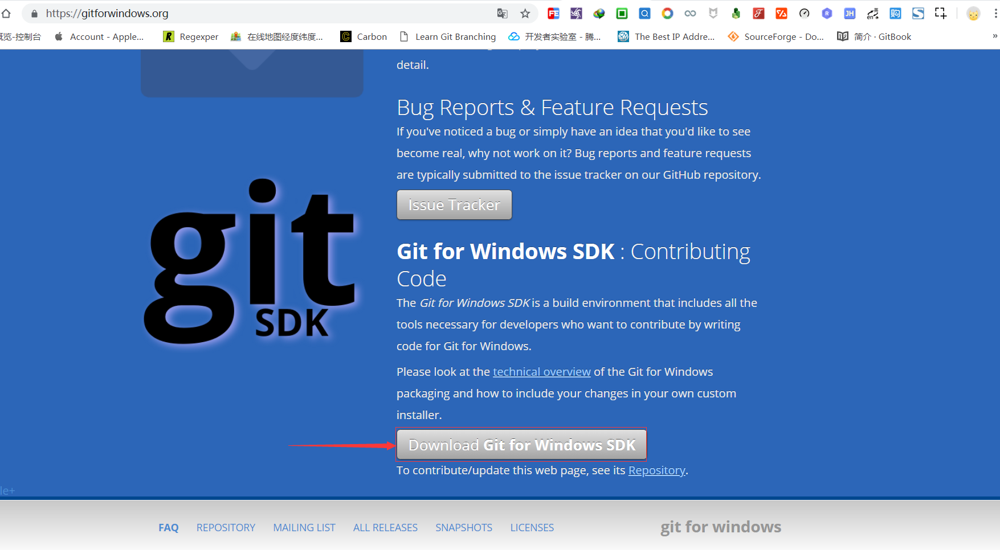

> `git-for-windows` 官网: [https://gitforwindows.org/](https://gitforwindows.org/)

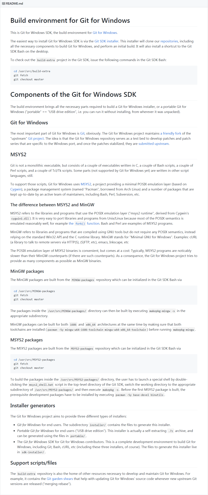

根据官方说明,安装后正在下载相关依赖,下载速度比较慢的话,请自行解决.

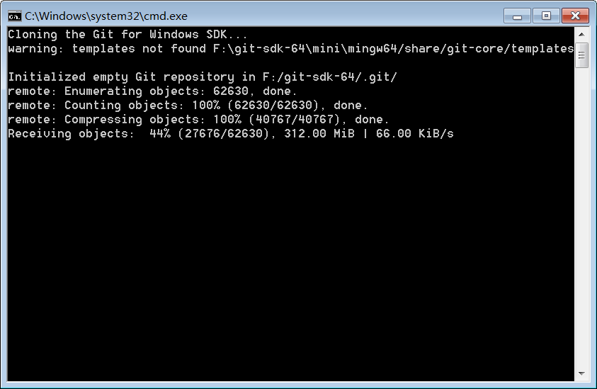

下载完成后,原来的 `cmd` 窗口会自动关闭并且打开新的 `git bash` 窗口.


```bash
Administrator@snowdreams1006 MINGW64 / (master)
$ sdk help
The 'sdk' shell function helps you to get up and running
with the Git for Windows SDK. The available subcommands are:

create-desktop-icon: install a desktop icon that starts the Git for
    Windows SDK Bash.

cd <project>: initialize/update a worktree and cd into it. Known projects:
        git git-extra msys2-runtime installer build-extra
        MINGW-packages MSYS2-packages mingw-w64-busybox mingw-w64-curl
        mingw-w64-cv2pdb mingw-w64-git mingw-w64-git-credential-manager
        mingw-w64-git-lfs mingw-w64-git-sizer mingw-w64-wintoast bash
        curl gawk git-flow gnupg heimdal mintty nodejs openssh openssl
        perl perl-HTML-Parser perl-Locale-Gettext perl-Net-SSLeay
        perl-TermReadKey perl-XML-Parser perl-YAML-Syck subversion tig

init <project>: initialize and/or update a worktree. Known projects
    are the same as for the 'cd' command.

build <project>: builds one of the following:
        git-and-installer git git-extra msys2-runtime installer
        mingw-w64-busybox mingw-w64-curl mingw-w64-cv2pdb mingw-w64-git
        mingw-w64-git-credential-manager mingw-w64-git-lfs
        mingw-w64-git-sizer mingw-w64-wintoast bash curl gawk
        git-flow gnupg heimdal mintty nodejs openssh openssl
        perl perl-HTML-Parser perl-Locale-Gettext perl-Net-SSLeay
        perl-TermReadKey perl-XML-Parser perl-YAML-Syck subversion tig

edit <file>: edit a well-known file. Well-known files are:
        git-sdk.sh sdk.completion ReleaseNotes.md install.iss

reload: reload the 'sdk' function.
```

现在安装完成后,我们再次打开 `Git for Windows` 的开发文档简介,从中不难发现该项目使用了 `MSYS2` 项目,那么问题迎刃而解.


根据科普知识,我们知道 `MSYS2` 和 `MinGW` 都是操作系统,而 `Git For Windows` 将两者结合在一起,默认使用 `MSYS2` 的包管理工具.

```bash
Administrator@snowdreams1006 MINGW64 / (master)
$ Pacman -h
用法:  Pacman <操作> [...]
操作:
    Pacman {-h --help}
    Pacman {-V --version}
    Pacman {-D --database} <选项> <软件包>
    Pacman {-F --files}    [选项] [软件包]
    Pacman {-Q --query}    [选项] [软件包]
    Pacman {-R --remove}   [选项] <软件包>
    Pacman {-S --sync}     [选项] [软件包]
    Pacman {-T --deptest}  [选项] [软件包]
    Pacman {-U --upgrade}  [选项] <文件>

使用 'Pacman {-h --help}' 及某个操作以查看可用选项
```

激动人心的时刻就要来临,在正式使用 `Pacman` 安装 `tree` 命令外,我们再次检查当前系统环境以确保没有 `git bash` 无法调用 `tree` 命令.

```bash
Administrator@snowdreams1006 MINGW64 / (master)
$ tree
bash: tree: 未找到命令
```

调用 `Pacman -S tree` 命令安装 `tree` 命令.

```
Administrator@snowdreams1006 MINGW64 / (master)
$ Pacman -S tree
正在解析依赖关系...
正在查找软件包冲突...

软件包 (1) tree-1.8.0-1

下载大小:   0.05 MiB
全部安装大小：  0.07 MiB

:: 进行安装吗？ [Y/n] y
警告：没有 /var/cache/pacman/pkg/ 缓存存在，正在创建...
:: 正在获取软件包......
 tree-1.8.0-1-x86_64       51.1 KiB   211K/s 00:00 [#####################] 100%
(1/1) 正在检查密钥环里的密钥                       [#####################] 100%
(1/1) 正在检查软件包完整性                         [#####################] 100%
(1/1) 正在加载软件包文件                           [#####################] 100%
(1/1) 正在检查文件冲突                             [#####################] 100%
(1/1) 正在检查可用存储空间                         [#####################] 100%
:: 正在处理软件包的变化...
(1/1) 正在安装 tree      
```

验证安装成功,切换到测试目录调用 `tree` 命令真的打印出了目录树结构.

```bash
Administrator@snowdreams1006 MINGW64 / (master)
$ pwd
/

Administrator@snowdreams1006 MINGW64 / (master)
$ cd /f/workspace/test

Administrator@snowdreams1006 MINGW64 /f/workspace/test
$ tree
.
├── cmd
└── gitbash

2 directories, 0 files
```

`tree.exe` 文件确实已经存在,通过这样方式当然可以安装任意第三方命令了呢!

```bash
Administrator@snowdreams1006 MINGW64 / (master)
$ pwd
/

Administrator@snowdreams1006 MINGW64 / (master)
$ ls usr/bin/tree.exe
usr/bin/tree.exe*

Administrator@snowdreams1006 MINGW64 / (master)
$ ls usr/bin/tree.exe
usr/bin/tree.exe*
```

然而,事情还没有结束,虽然打印当前路径显示的是在 `/` ,但是如果从普通的 `git bash` 命令行窗口进入 `/`,发现他们并不一致!


> 开发版左上角文字: `SDK-64`,普通版左上角: `MinGW64`.

事情应该不至于这么复杂,我猜测如果进入到 `git sdk` 的安装目录,应该是一样的!

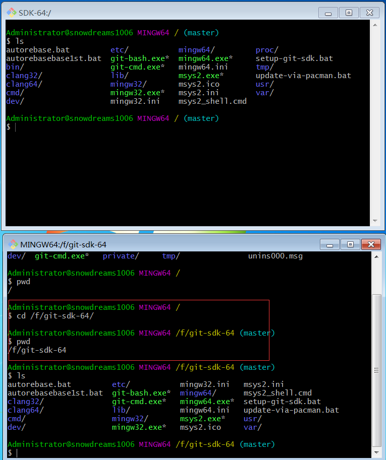

#### 源码编译安装

还有一种源码编译安装方式,可以猜想到的是将会比较麻烦,不仅要安装 `c` 编译环境,还可能会面临如何移植到 `Windows` 环境的问题.

恕再下先行一步,告辞!


但是老司机怎么能收走就走,不是说好一起闯天下得嘛?

然而,心有余而力不足,编译安装再到测试确实是不少挑战,最重要的是,电脑太卡了等不了.

所以,收集到了一些资料方便有条件的小伙伴去研究吧!


> 下载链接: [ftp://mama.indstate.edu/linux/tree/tree-1.8.0.tgz](ftp://mama.indstate.edu/linux/tree/tree-1.8.0.tgz)

- 在 `mingw` ,`msys2` 或者 `cygwin` 系统上编译安装 `tree` 的 `c` 文件,最终生成 `tree.exe` 可执行文件.
- 独立安装 `c` 编译环境,生成的 `tree.exe` 可执行文件再想办法兼容到 `git bash` 所支持的 `.exe` 类型,或许也不用转换.
- 请参考 `linux` 系统的 `tree` 命令源码: [http://mama.indstate.edu/users/ice/tree/](http://mama.indstate.edu/users/ice/tree/)

我觉得我还可以再坚持一会,虽然不能从头开始编译生成 `tree.exe` 可执行文件,但是研究了这么多朋友圈关系,足够我找到解决方案了.

`tree` 命令的源码文件编译成 `tree.exe` 可执行文件比较费劲,但是可以找到已经编译好的文件啊.

说道这里,不得不提一下神奇的 [sourceforge](https://sourceforge.net/) 网站,提供源码和下载网站.


前面我们一直在说 `mintty` 终端模拟器也好,或者 `mingw` ,`msys2` 和 `cygwin` 操作系统也罢,他们或多或少和 `GNU` 有一些联系,而 `GNU` 是自由软件操作系统,源码会随程序一同发布.

所以我们应该可以从 `sourceforge` 网站上找到些蛛丝马迹,说不定还有打包好的可执行文件呢,如果那样的话就不用我们手动编译安装了!


功夫不负有心人,竟然真的找到了,搜索 `GNU` 发现了 `gnuwin32` 项目,完整提供了原生命令,其中就有我们需要的 `tree` 命令.

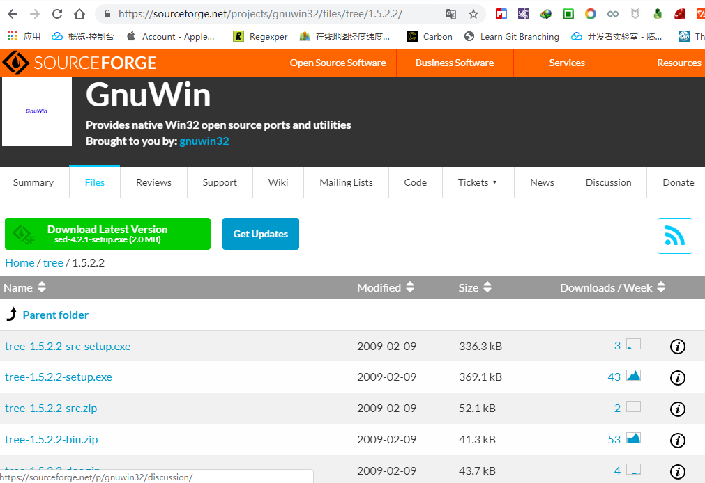

> 下载链接: [https://sourceforge.net/projects/gnuwin32/files/tree/1.5.2.2/tree-1.5.2.2-bin.zip/download](https://sourceforge.net/projects/gnuwin32/files/tree/1.5.2.2/tree-1.5.2.2-bin.zip/download)

于是下载二进制文件找到其中的 `/bin/tree.exe` 并将其复制到 `/git/usr/bin` 目录下,这样 `git bash` 本身就支持 `tree` 命令了.

首先清除掉上一步设置的别名,防止干扰以确保此二进制文件真实有效.

```bash
snowdreams1006@home MINGW64 /g/sublime/test
# 切换到 `git` 安装目录
$ cd /e/git

snowdreams1006@home MINGW64 /e/git
# 编辑 `bash.bashrc` 配置文件,移除别名
$ vim ./etc/bash.bashrc

snowdreams1006@home MINGW64 /e/git
# 查看配置文件内容,别名设置已移除
$ tail ./etc/bash.bashrc
[[ "$-" != *i* ]] && return

# Set a default prompt of: user@host, MSYSTEM variable, and current_directory
#PS1='\[\e]0;\w\a\]\n\[\e[32m\]\u@\h \[\e[35m\]$MSYSTEM\[\e[0m\] \[\e[33m\]\w\[\e[0m\]\n\$ '

# Uncomment to use the terminal colours set in DIR_COLORS
# eval "$(dircolors -b /etc/DIR_COLORS)"

# Fixup git-bash in non login env
shopt -q login_shell || . /etc/profile.d/git-prompt.sh

snowdreams1006@home MINGW64 /e/git
# 刷新配置文件,使其立即生效
$ source ./etc/bash.bashrc

snowdreams1006@home MINGW64 /e/git
# 移除 `tree` 别名,适用于命令行方式设置而不是文件设置
$ unalias tree

snowdreams1006@home MINGW64 /e/git
# 运行 `tree` 命令,确保已经无法通过别名方式调用系统的 `tree.com` 命令
$ tree
bash: tree: command not found
```


真的成功添加了 `tree.exe` 命令,明显和 `cmd` 自带的 `tree.com` 命令不一致.

```bash
snowdreams1006@home MINGW64 /e/git
$ cd /g/sublime/test

snowdreams1006@home MINGW64 /g/sublime/test
# 扩展命令 `tree` 帮助信息
$ tree.exe --help
usage: tree [-adfghilnpqrstuvxACDFNS] [-H baseHREF] [-T title ] [-L level [-R]]
        [-P pattern] [-I pattern] [-o filename] [--version] [--help] [--inodes]
        [--device] [--noreport] [--nolinks] [--dirsfirst] [--charset charset]
        [--filelimit #] [<directory list>]
  -a            All files are listed.
  -d            List directories only.
  -l            Follow symbolic links like directories.
  -f            Print the full path prefix for each file.
  -i            Don't print indentation lines.
  -q            Print non-printable characters as '?'.
  -N            Print non-printable characters as is.
  -p            Print the protections for each file.
  -u            Displays file owner or UID number.
  -g            Displays file group owner or GID number.
  -s            Print the size in bytes of each file.
  -h            Print the size in a more human readable way.
  -D            Print the date of last modification.
  -F            Appends '/', '=', '*', or '|' as per ls -F.
  -v            Sort files alphanumerically by version.
  -r            Sort files in reverse alphanumeric order.
  -t            Sort files by last modification time.
  -x            Stay on current filesystem only.
  -L level      Descend only level directories deep.
  -A            Print ANSI lines graphic indentation lines.
  -S            Print with ASCII graphics indentation lines.
  -n            Turn colorization off always (-C overrides).
  -C            Turn colorization on always.
  -P pattern    List only those files that match the pattern given.
  -I pattern    Do not list files that match the given pattern.
  -H baseHREF   Prints out HTML format with baseHREF as top directory.
  -T string     Replace the default HTML title and H1 header with string.
  -R            Rerun tree when max dir level reached.
  -o file       Output to file instead of stdout.
  --inodes      Print inode number of each file.
  --device      Print device ID number to which each file belongs.
  --noreport    Turn off file/directory count at end of tree listing.
  --nolinks     Turn off hyperlinks in HTML output.
  --dirsfirst   List directories before files.
  --charset X   Use charset X for HTML and indentation line output.
  --filelimit # Do not descend dirs with more than # files in them.

snowdreams1006@home MINGW64 /g/sublime/test
# 原生 `tree.com` 帮助信息
$ winpty tree.com /?
卷 软件 的文件夹 PATH 列表
卷序列号为 000000CA 223E:7300
E:\GIT\?
无效的路径 - \GIT\?
没有子文件夹  
```

虽然原生 `cmd` 自带的 `tree.com` 命令也能打印出目录结构树,但是和扩展的第三方 `tree.exe` 命令相比,可配置的选项实在太少,难怪固执少年会执意扩展 `tree` 命令.

