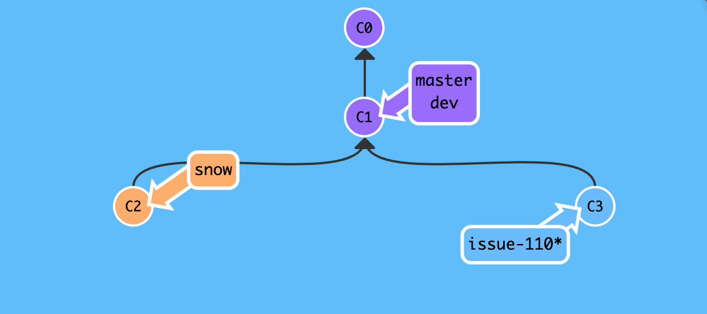
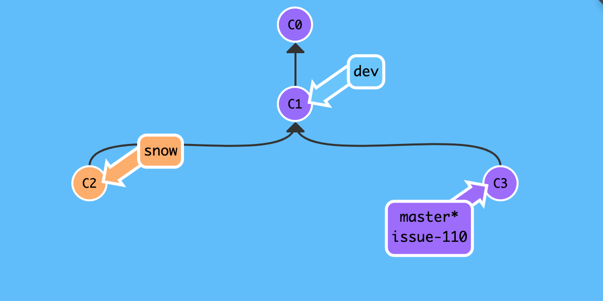
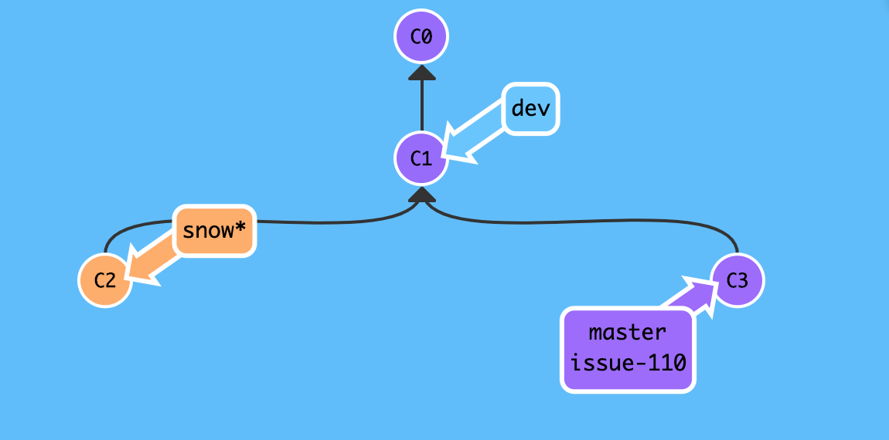

# 紧急修复

和往常一样,每个人团队开发者都在自己的本地分支上进行日常工作,相互独立又相互联系,一直以来相安无事,可是某天下午,上级领导突然急冲冲的打电话告诉你线上出`bug`了,需要你紧急修复,下班之前必须解决!

我们天生就是创造 `bug` 的特殊群体,每天都在和各种各样的 `bug` 打交道,早已经习惯了这样的工作节奏,再也没有当初刚刚遇到紧急问题的手足无措,先喝杯茶,冷静一下,然后汇报领导说:放心吧!保证`30min` 内解决问题!

## 背景

学习了分支操作的相关知识,团队内部就基本的开发流程达成一致:

假设线上是主干 `master` 分支,开发是 `dev` 分支,团队成员是自定义 `custom` 分支,平时开发时在大家在各自 `custom` 分支上工作,完成分配任务后再合并到开发 `dev` 分支,等到开发分支功能稳定后,由项目领导负责合并到主干分支 `master` .

> 上述流程只是开发流程的简化版,实际情况更加复杂,后续再介绍 `gitflow` 工作流相关知识.

由于是线上出现 `bug`,理所当然是基于 `master` 分支检出临时分支,修复分支代号为 `issue-110`,然后定位 `bug` 并提交,最后再合并到 `master` 分支,如此一来成功修复 `bug`,完成既定任务,心安理得准备下班回家!

如果真的向上述步骤那样操作,显然还不够冷静,刚才那一杯茶算是白喝了!因为这样操作可能会丢失现场数据,那很多工作岂不是白做了,下面简单演示一下:

### 错误示例

(一). 事发前正在自定义的 `snow` 分支上愉快编码中...

```
# 线上分支 `master`,开发分支 `dev`,自定义分支 `snow`,当前正处于自定义分支
$ git branch
  dev
  master
* snow
# 接到领导电话前正在自定义 `snow` 分支上进行愉快编码中...
$ echo "Happy coding" >> test.txt
$ git add test.txt
$ git commit -m  "Happy coding"
```


(二). 事发时直接检出主分 `master` 分支,并紧急修复 `bug` .

(2.1) 基于 `master` 分支检出 `issue-110` 分支,并修复提交.

```
# 注意: 事发时正在思考人生,此时更改尚未添加到暂存区!
$ echo "who am i" >> test.txt

# 当前情况下,默认不允许直接切换到其他分支,因为工作区更改会被重写,这里为了演示错误示例,强制切换!
$ git checkout -f master 

# 基于主干 `master` 分支检出修复 `issue-110`分支
$ git checkout -b issue-110
Switched to a new branch 'issue-110'

# 定位线上 `bug`并修复,假设将 `fast forward` 更改为 `fast forward not recommend`,瞬间修复 `bug`有没有!
$ cat test.txt
add test.txt
see https://snowdreams1006.github.io/git/usage/remote-repository.html
learn git branch
see https://snowdreams1006.github.io/git/usage/branch-overview.html
git commit c1
git commit c2 and c3
git checkout -b dev
fast forward
$ vim test.txt
$ cat test.txt
add test.txt
see https://snowdreams1006.github.io/git/usage/remote-repository.html
learn git branch
see https://snowdreams1006.github.io/git/usage/branch-overview.html
git commit c1
git commit c2 and c3
git checkout -b dev
fast forward not recommend

# 修复 `bug` 后,提交更改并备注已修复
$ git add test.txt
$ git commit -m "fix bug about issue-110"
[issue-110 e60c8ad] fix bug about issue-110
 1 file changed, 1 insertion(+), 1 deletion(-)
sunpodeMacBook-Pro:git-demo sunpo$ git status
On branch issue-110
nothing to commit, working tree clean
$ 
```



(2.1) 切换到主干 `master` 分支,并合并修复 `issue-110` 分支

```
# 切换回 `master` 分支,合并修复 `issue-110` 分支
$ git checkout master
Switched to branch 'master'
Your branch is up to date with 'origin/master'.
$ git merge issue-110
Updating 3fe94c0..e60c8ad
Fast-forward
 test.txt | 2 +-
 1 file changed, 1 insertion(+), 1 deletion(-)

# 验证 `bug` 已修复: 更改为 `fast forward not recommend`
$ cat test.txt
add test.txt
see https://snowdreams1006.github.io/git/usage/remote-repository.html
learn git branch
see https://snowdreams1006.github.io/git/usage/branch-overview.html
git commit c1
git commit c2 and c3
git checkout -b dev
fast forward not recommend
$ 
```



(三). 事发后切换回自定义 `snow` 分支,打算下班回家.

```
# 切换回 `snow` 分支,发现丢失了事发前的未保存更改:`who am i`
$ git checkout snow
Switched to branch 'snow'
$ cat test.txt
add test.txt
see https://snowdreams1006.github.io/git/usage/remote-repository.html
learn git branch
see https://snowdreams1006.github.io/git/usage/branch-overview.html
git commit c1
git commit c2 and c3
git checkout -b dev
fast forward
Happy coding
$ 
```



> 现在还打算下班吗?你所做的更改因为没有提交或者不能提交造成全部丢失!

#### 结果

因为手头工作进行到一半无法提交或者忘记提交等原因,为了临时修复紧急 `bug` 而**直接切换**到目标分支再回来时发现更改全部丢失,相当于那部分工作白忙活了!

### 正确示例

经过上述错误示例的惨痛教训后,再也不敢轻易切换分支了,原因在于工作区更改并没有被提交,或者说不能提交,如果能够有一种机制来保护案发现场,这样我们就能放心切换到其他分支工作,回来时一切如初,那该多好?

幸运的是,`git` 确实提供这么一种机制,`git stash` 命令临时存储工作区,类似"草稿箱"作用.

(一). 恢复工作区丢失更改,并使用 `git stash` 命令保存现场.

```
# 修复工作区丢失更改: 同样未添加到暂存区
$ echo "learn git stash" >> test.txt
$ cat test.txt
add test.txt
see https://snowdreams1006.github.io/git/usage/remote-repository.html
learn git branch
see https://snowdreams1006.github.io/git/usage/branch-overview.html
git commit c1
git commit c2 and c3
git checkout -b dev
fast forward
Happy coding
learn git stash

# 保护现场: 存储到"草稿箱"
$ git stash
Saved working directory and index state WIP on snow: 93227ba Happy coding
```

(二). 切换到开发 `dev` 分支并合并修复 `issue-110` 分支.

```
# 切换到开发 `dev` 分支
$ git checkout dev
Switched to branch 'dev'
sunpodeMacBook-Pro:git-demo sunpo$ git status
On branch dev
nothing to commit, working tree clean
# 合并修复 `issue-110` 分支
$ git merge issue-110
Updating 3fe94c0..e60c8ad
Fast-forward
 test.txt | 2 +-
 1 file changed, 1 insertion(+), 1 deletion(-)
sunpodeMacBook-Pro:git-demo sunpo$ git status
On branch dev
nothing to commit, working tree clean
$ 
```

(三). 切换回自定义 `snow` 分支,并恢复工作现场.

```
# 切换回自定义 `snow` 分支
$ git checkout snow
Switched to branch 'snow'
sunpodeMacBook-Pro:git-demo sunpo$ git status
On branch snow
nothing to commit, working tree clean
$ 
```

`git status` 命令返回结果怎么显示工作区是干净的,好不容易才将丢失的更改找回来怎么又不见了?!逗我玩?

冷静,冷静,不要慌,既然工作现场已经保存到"草稿箱",那我们想要找回总要去"草稿箱"才能取出来吧?现在让我们看一下"草稿箱"有没有我们的工作现场?

```
# 查看存储的"草稿箱"列表
$ git stash list
stash@{0}: WIP on snow: 93227ba Happy coding
$ 
```

> 这里的 `stash@{0}` 是草稿 id,因为"草稿箱"允许保存多条草稿!

现在放心了吧,保存的"草稿"安然无恙躺在未知的某个地方,现在我们想办法恢复回工作区即可!

- `git stash apply` 恢复草稿,然后 `git stash drop` 删除草稿
- `git stash pop` 恢复并删除草稿

```
# 恢复工作现场
$ git stash pop
On branch snow
Changes not staged for commit:
  (use "git add <file>..." to update what will be committed)
  (use "git checkout -- <file>..." to discard changes in working directory)

    modified:   test.txt

no changes added to commit (use "git add" and/or "git commit -a")
Dropped refs/stash@{0} (b0c8ddc034d21f31204c82e9838fc5d4c01a49a8)

# 工作现场已恢复,更改未添加到暂存区,`learn git stash` 又恢复了!
$ git status
On branch snow
Changes not staged for commit:
  (use "git add <file>..." to update what will be committed)
  (use "git checkout -- <file>..." to discard changes in working directory)

    modified:   test.txt

no changes added to commit (use "git add" and/or "git commit -a")
$ cat test.txt
add test.txt
see https://snowdreams1006.github.io/git/usage/remote-repository.html
learn git branch
see https://snowdreams1006.github.io/git/usage/branch-overview.html
git commit c1
git commit c2 and c3
git checkout -b dev
fast forward
Happy coding
learn git stash
```

#### 结果

不论手头工作有没有提交,一旦工作区保存到"草稿箱"后,就放心大胆切换分支进行工作,回来时岁月静好,一切如初!

## 小结

紧急修复 `bug` 时,可以通过 `git stash` 保护工作现场,然后再切换到目标分支,检出修复分支,完成修复后切换到目标分支,合并修复分支,最后删除修复分支,此时再切换回本地分支后一切如初!

- 工作区更改添加到"草稿箱" :  `git stash`,支持多次添加到"草稿箱"
- 列出"草稿箱"内容 : `git stash list`
- 恢复"草稿箱"内容 : `git stash apply`
- 删除"草稿箱"内容 : `git stash drop`
- 恢复并删除"草稿箱"内容 : `git stash pop`
- 恢复|删除指定"草稿箱"内容 : `git stash <stash-id>`,例如 `git stash apply stash@{0}`
