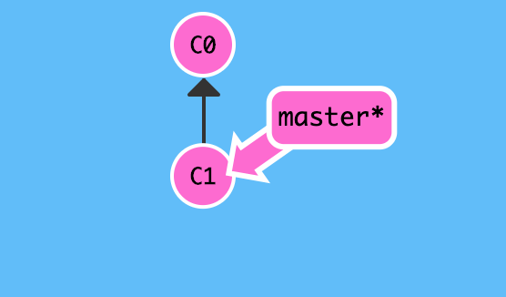
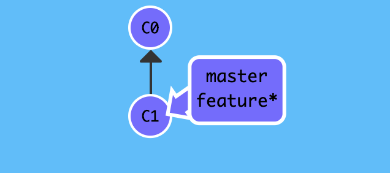
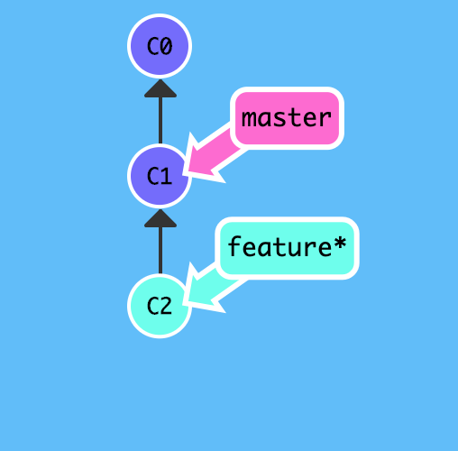
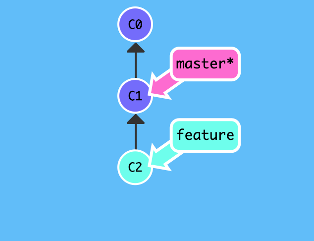
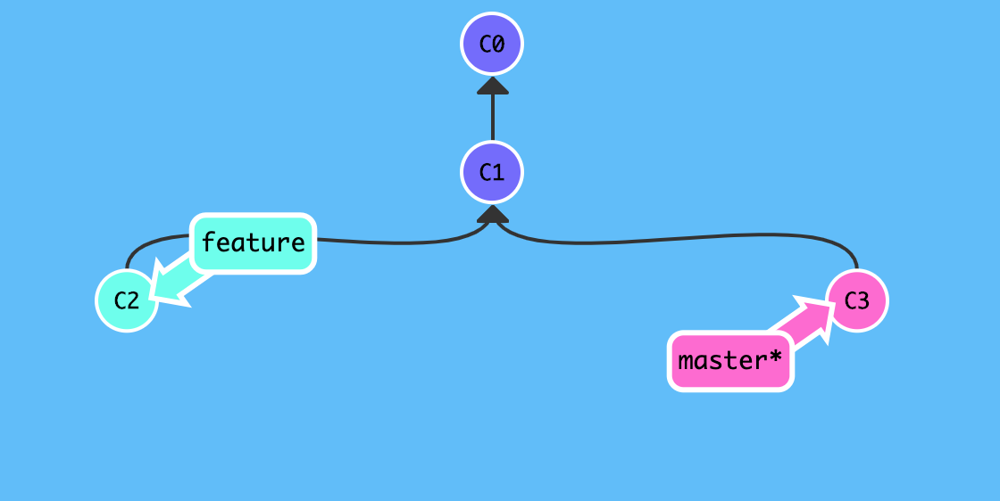
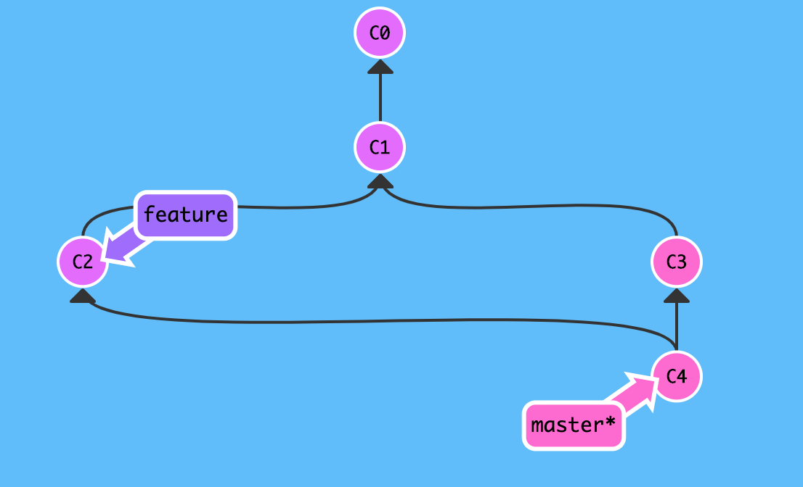

# 冲突合并

如果足够幸运的话,团队成员互不影响,彼此相安无事,大家各自基于 `master` 分支的某个 `commit` 创建自己的分支,平时在分支上独立工作,等到一段时间后再合并 `merge` 到 `master` 分支,这样一样 `master` 作为各个功能的集大成者,最终完成项目.

然而事情总不是一帆风顺的,团队协作时由于意见不同,遇到冲突简直是家常便饭,既然无法回避冲突,当冲突发生时如何应该呢?

## 背景

基于 `master` 分支上的某个 `commit` ,新功能由此继续开发: 

```
echo "git commit c1" >> test.txt
$ git add test.txt
$ git commit -m "git commit c1"
```



新功能分支命名为 `feature` ,使用`git checkout -b <name>` 创建分支并切换:

```
$git checkout -b feature
Switched to a new branch 'feature'
$ 
```



在新功能 `feature` 分支上开发新功能,并提交:

```
$ echo "git commit c2" >> test.txt
$ git add test.txt
$ git commit -m "git commit c2"
[feature 0fe95f8] git commit c2
 1 file changed, 1 insertion(+)
$ 
```



无论新功能 `feature` 是否开发完毕,团队的其他成员均有可能处于 `master` 分支并做相应更改:

```
$ git checkout master
Switched to branch 'master'
Your branch is ahead of 'origin/master' by 3 commits.
  (use "git push" to publish your local commits)
```



其他成员对新功能有着自己的看法,于是也提交了版本,由于我们之前提交的是 `git commit c2`,而此时`master` 分支提交的是`git commit c3`,显然我们两个人的意见不一致!

```
$ echo "git commit c3" >> test.txt
$ git add test.txt
$ git commit -m "git commit c3"
[master 0949cc3] git commit c3
 1 file changed, 1 insertion(+)
$ 
```



正在此时,`feature` 分支的新功能已开发完毕并主动切换回 `master` 分支,准备合并 `feature`
 分支.

```
# 合并 feature 分支
$ git merge feature
Auto-merging test.txt
CONFLICT (content): Merge conflict in test.txt
Automatic merge failed; fix conflicts and then commit the result.
$
```

由于项目成员沟通不畅或者意见不一致,导致了代码冲突,`git` 作为版本控制系统,自然无法解决这类问题,总不能擅自做主抛弃后来的更改吧或者抛弃分支更改?所以 `git`
只负责抛出问题,等待我们程序员去解决问题.

既然是人的问题,那我们看一下我们到底是哪里不一致,为什么会产生冲突?

```
# 查看状态
$ git status
On branch master
Your branch is ahead of 'origin/master' by 4 commits.
  (use "git push" to publish your local commits)

You have unmerged paths.
  (fix conflicts and run "git commit")
  (use "git merge --abort" to abort the merge)

Unmerged paths:
  (use "git add <file>..." to mark resolution)

    both modified:   test.txt

no changes added to commit (use "git add" and/or "git commit -a")
# 比较差异
$ git diff 
diff --cc test.txt
index 6e00f87,0f95fd7..0000000
--- a/test.txt
+++ b/test.txt
@@@ -3,4 -3,4 +3,8 @@@ see https://snowdreams1006.github.io/gi
  learn git branch
  see https://snowdreams1006.github.io/git/usage/branch-overview.html
  git commit c1
++<<<<<<< HEAD
 +git commit c3
++=======
+ git commit c2
++>>>>>>> feature
```

和我们预期一样,`test.txt` 文件产生了冲突,当前 `HEAD` 指向的提交即 `master` 分支是 `git commit c3` ,而 `feature` 分支是 `git commit c2`,对于同一个文件的同一行内容发生不同的更改,`git` 不知道也不应该知道如何处理.

```
# 查看内容
$ cat test.txt
add test.txt
see https://snowdreams1006.github.io/git/usage/remote-repository.html
learn git branch
see https://snowdreams1006.github.io/git/usage/branch-overview.html
git commit c1
<<<<<<< HEAD
git commit c3
=======
git commit c2
>>>>>>> feature
```

`git` 用 `<<<<<<<` 标记一个分支冲突开始,`=======` 标记分支分割线,`>>>>>>>` 标记另一个分支结束.

经过冲突双方的讨论后,彼此间达成妥协,决定修改成`git commit c2 and c3` ,修改后继续提交:

```
# 编辑冲突文件,按照协商一致的内容修改文件
$ vim test.txt
# 将冲突内容更改为 git commit c2 and c3
$ cat test.txt
add test.txt
see https://snowdreams1006.github.io/git/usage/remote-repository.html
learn git branch
see https://snowdreams1006.github.io/git/usage/branch-overview.html
git commit c1
git commit c2 and c3
$ git add test.txt
$ git commit -m "fix conflict"
[master 3b8f434] fix conflict
```

冲突已经解决,现在回顾一下提交历史,使用`git log --graph` 图形化展示提交历史:

```
# 查看提交日志
$ git log --pretty=oneline --graph
*   3b8f434013caa8c27fade4c59d7aa2ee2c079636 (HEAD -> master) fix conflict
|\  
| * 0fe95f871b371834d30ea17faa82f84b7d67672b (feature) git commit c2
* | 0949cc319e099d554795d03c69ee38923af00d6c git commit c3
|/  
* 5c482cd9965b9dfd4f273b43b240ed7db66167a8 git commit c1
* 413a4d1d2aab5ab85b6097d4b9f81cb5601c3b26 see https://snowdreams1006.github.io/git/usage/branch-overview.html
* 9c30e50248b773e38b032477a859e87abe7c1bb0 learn git branch
* b3d8193bbcb9f76c47e831e3e212f2405ae09f93 (origin/master, origin/HEAD) see https://snowdreams1006.github.io/git/usage/remote-repository.html
* 8e625640348a47ac922409a1ecb4c844385582aa add test.txt
* 9b196aab5bc87eeb11709c9eef35fca283e05c61 Initial commit
$ 
```



最后,删除新功能分支 `feature` ,不用的分支及时清理干净,需要时再创建分支.

```
$ git branch -d feature
```

## 小结

- 无法杜绝冲突的发生,代码上的冲突本质上是人为因素造成的冲突.
- 解决冲突需要有关双方协商解决,不可能独自解决冲突,除非你抛弃自我,完全以对方为准.
- 使用 `git log --graph` 命令可以图表化查看提交历史,抑或 `git log --pretty=oneline --graph` 

