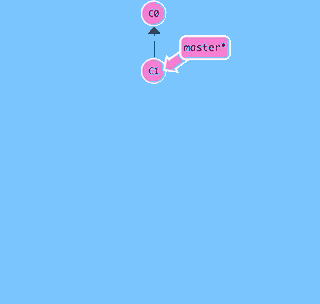

# 分支总览

分支就是一条独立的时间线,既有分支,必有主干,正如一棵树谈到树枝,必有树干一样的道理.我们先前对`git` 的全部操作默认都是在主干上进行的,这个主干也是一种特殊的分支,名为 `master` 分支.

无论是穿越历史还是撤销更改,我们都或多或少接触过时间线,`git` 管理的版本串在一起就组成了这个时间线,其中`master` 分支是当前分支,`HEAD` 指向`master` ,因此`HEAD` 相当于指向了最新的版本.



基于分支上的操作,每一次 `commit` 都会提交一个新版本,并且新的 `commit` 指向原来的 `commit`,这来最新的 `commit` 就可以往前找,直到找到最初的`commit`.这就是 `git` 的时间线.

当我们打算开辟新的时间线时,`git` 在当前 `HEAD` 指向的 `master` 分支的 `commit` 处新建一个 `dev` 分支.如果主角没有主动进入时间线的话,那么仍然处于 `master` 分支,进入的方法就是 `HEAD`指向新建的 `dev` 分支.

不考虑孙悟空的分身特效,主角不能同时处于不同的时空下,`git` 也是如何,`HEAD` 只能指向某一个 `commit` ,既然刚刚已经指向了 `dev` 分支,所以原来的 `master` 分支就没有 `HEAD` 了,因为相当于`master` 分支静止了.

当主角在 `dev` 分支独自闯荡干出一番事业时,决定回到故乡 `master` 分支,并将出门在外所学的本领带回家乡,建设美好家园.`master` 分支因为合并了 `dev` 分支,所以一下子增添了很多内容,家乡焕然一新!

主角这次携带 `dev` 分支归来,`HEAD` 分支自然又回到了 `master` 分支上,年轻的心向往外面的世间,相信不久后还会有同样的故事发生...


下面详解分支相关命令

## 创建分支

创建 `dev` 分支,列出分支已验证是否创建成功

```
# 创建分支
$git branch dev
# 列出分支
$ git branch
  dev
* master
$ 
```

> \* `master` 前面的 \* 标记表明当前仍然处于 `master` 分支


## 切换分支

切换到新分支以便在分支上开展工作

```
# 切换分支
$ git checkout dev
Switched to branch 'dev'
# 列出分支
$ git branch
* dev
  master
$
```


现在,我们在 `dev` 分支上奋笔疾书,先后提交两个版本后完成分支开发工作:

```
# 查看当前文件列表
$ ls
LICENSE     README.md   test.txt
# 查看目标文件内容
$ cat test.txt
add test.txt
see https://snowdreams1006.github.io/git/usage/remote-repository.html

# 第一个版本: learn git branch
$ echo "learn git branch" >> test.txt
$ git add test.txt
$ git commit -m "learn git branch"
[dev 9c30e50] learn git branch
 1 file changed, 1 insertion(+)

# 第二个版本: see https://snowdreams1006.github.io/git/usage/branch-overview.html
$ echo "see https://snowdreams1006.github.io/git/usage/branch-overview.html" >> test.txt
$ git add test.txt
sunpodeMacBook-Pro:git-demo sunpo$ git status
On branch dev
Changes to be committed:
  (use "git reset HEAD <file>..." to unstage)

    modified:   test.txt

$ git commit -m "see https://snowdreams1006.github.io/git/usage/branch-overview.html"
[dev 413a4d1] see https://snowdreams1006.github.io/git/usage/branch-overview.html
 1 file changed, 1 insertion(+)
```


此时,再从 `dev` 分支切换回 `master` 分支,合并`dev`分支前看一下当前文件内容:

```
# 切换回 master 分支
$ git checkout master
Switched to branch 'master'
Your branch is up to date with 'origin/master'.
sunpodeMacBook-Pro:git-demo sunpo$ git status
On branch master
Your branch is up to date with 'origin/master'.

nothing to commit, working tree clean
# 查看当前文件列表
$ ls
LICENSE     README.md   test.txt
# 查看文件内容: 无 dev 分支更改
$ cat test.txt
add test.txt
see https://snowdreams1006.github.io/git/usage/remote-repository.html
$ 
```


## 合并分支

切换回 `master` 分支并没有我们在 `dev` 分支的更改,因为两条时间线是独立的,现在合并 `dev` 分支,再看一下当前文件内容:

```
# 合并 dev 分支
$ git merge dev
Updating b3d8193..413a4d1
Fast-forward
 test.txt | 2 ++
 1 file changed, 2 insertions(+)
# 查看文件内容: 已经存在 dev 分支的更改!
$ cat test.txt
add test.txt
see https://snowdreams1006.github.io/git/usage/remote-repository.html
learn git branch
see https://snowdreams1006.github.io/git/
```


## 删除分支

合并分支后,`dev` 分支的历史使命已经完成,应该及时清空不必要分支.

```
# 删除 dev 分支
$ git branch -d dev
Deleted branch dev (was 413a4d1).

# 列出当前分支: 只剩下 master 分支
$ git branch
* master
$ 
```


以上场景包括了分支的常用操作,创建分支(`git branch <name>`),切换分支(`git checkout <name>`),删除分支(`git branch -d <name>`)一系列操作十分流畅,因此 `git` 鼓励我们大量使用分支!

## 小结

- 列出分支 `git branch`
- 创建分支 `git branch <name>` 
- 切换分支 `git checkout <name>`
- 创建并切换分支 `git checkout -b <name>`
- 合并指定分支到当前分支 `git merge <name>`
- 删除分支 `git branch -d <name>`   
