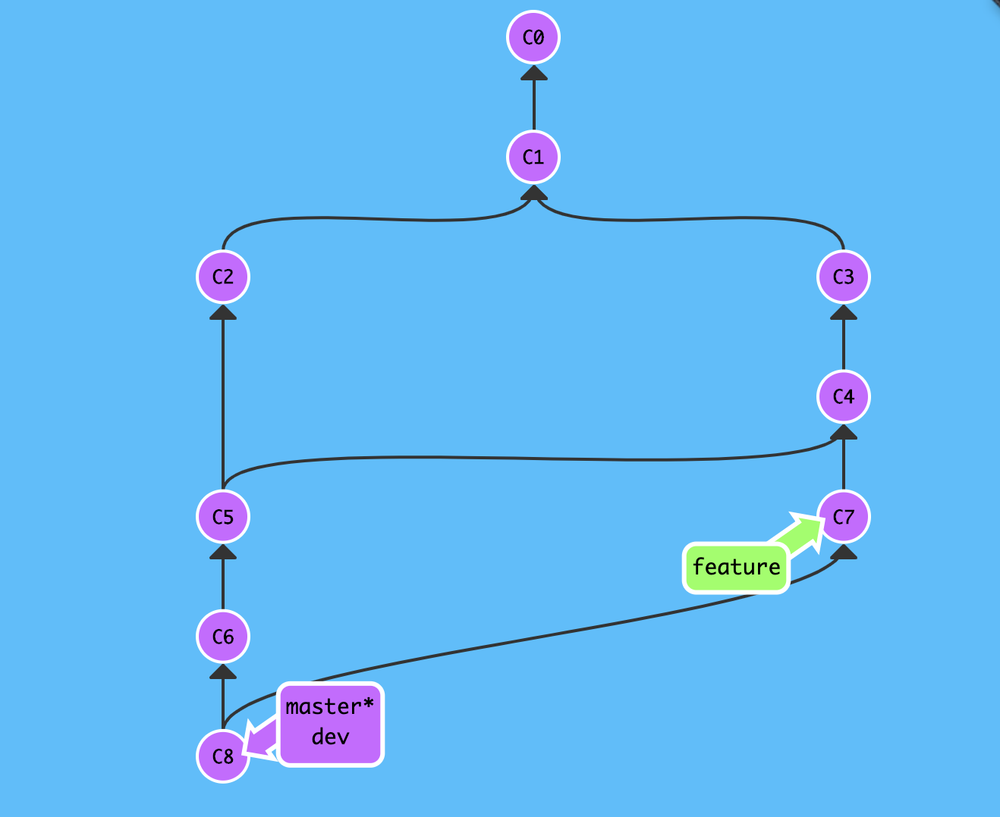
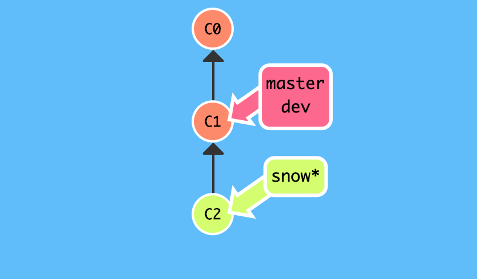
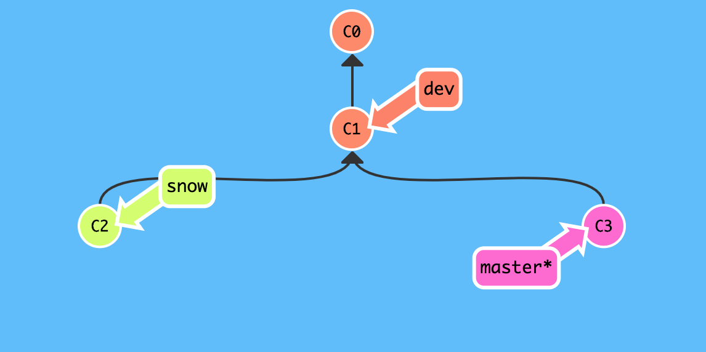
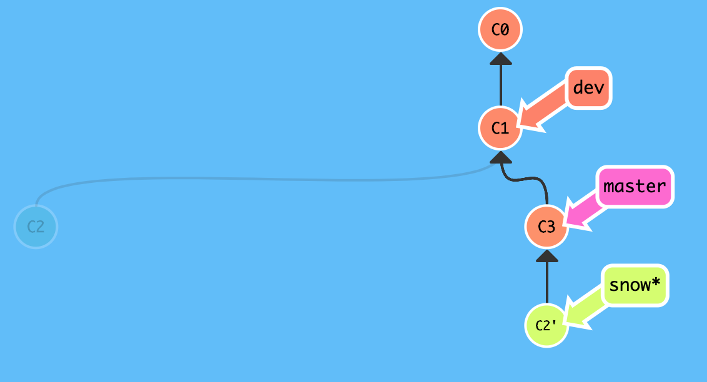
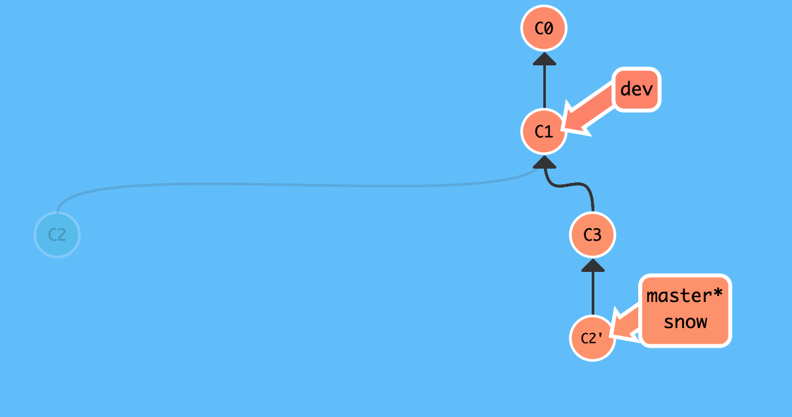

# 变基合并

`git` 鼓励大量使用分支---**"早建分支!多用分支!"**,这是因为即便创建再多的分支也不会造成存储或内存开销,并且分支的作用有助于我们分解逻辑工作,这样一样其实比维护单一臃肿分支要简单得多!

正因如此,每个新功能会创建合并分支,修复 `bug` 会创建合并分支等等,一段时间后再次回顾整个版本库的提交历史就会发现分支错综复杂,难以理清!

虽然"条条大路通罗马",但错综复杂的道路容易让人迷失方向,如果不使用分支,当然就不存在"分叉问题",所以在某些情况下我们希望寻求一种替代方案来**解决分支合并**带来的**"分叉问题"**!

## 回顾提交历史

查看提交历史: `git log --pretty=oneline --graph --abbrev-commit`

```
# 查看提交历史
$ git log --pretty=oneline --graph --abbrev-commit
* e60c8ad (HEAD -> dev, origin/master, origin/HEAD, master) fix bug about issue-110
* 3fe94c0 fast forward
*   22fbef7 git merge --no-ff dev
|\  
| * 44d68f6 git checkout -b dev
|/  
*   3b8f434 fix conflict
|\  
| * 0fe95f8 git commit c2
* | 0949cc3 git commit c3
|/  
* 5c482cd git commit c1
* 413a4d1 see https://snowdreams1006.github.io/git/usage/branch-overview.html
* 9c30e50 learn git branch
* b3d8193 see https://snowdreams1006.github.io/git/usage/remote-repository.html
* 8e62564 add test.txt
* 9b196aa Initial commit
```

仅仅是简单的演示项目的提交历史都已经出现"分叉问题",更何况真实的企业级开发项目呢?如果真的是多分支多人合作开发的话,"分叉现象"将更加明显,模拟效果图大概长这样:



## 整理提交历史

如果想要一条直路直达罗马,那我们必须规划好路径,摒弃小道,坚持主干道.`git` 的各种 `dev`,`feature`等分支就是需要治理的一条条分叉小道,而 `master` 主分支就是我们的大道.

演示项目有三个分支,主干`master`,开发`dev`,自定义`snow`,目标是将自定义 `snow` 分支的工作成功整理合并到主干分支,从而解决"分叉问题",`dev` 分支与项目演示无关,无需更改.

(1). 切换到 `snow` 分支并提交一个版本(`learn git rebase`)

```
# 切换到 `snow` 分支
$ git checkout snow
Switched to branch 'snow'

# 追加新内容到 `test.txt` 文件
$ echo "learn git rebase" >> test.txt

# 提交到版本库
$ git commit -am "learn git rebase"
[snow 7d21e80] learn git rebase
 1 file changed, 1 insertion(+)
$ 
```



(2). 切换到 `master` 分支也提交一个版本(`modify README`)

```
# 切换回 `master` 分支
$ git checkout master
Switched to branch 'master'
Your branch is up to date with 'origin/master'.

# 追加新内容到 `README.md` 文件
$ echo "learn git ,share git" >> README.md

# 提交到版本库
$ git add README.md
$ git commit -m "modify README"
[master 3931d48] modify README
 1 file changed, 1 insertion(+)
$ 
```



(3). 切换回 `snow` 分支,整理提交历史(**`git rebase`**)到 `master` 分支

```
# 切换到 `snow` 分支
$ git checkout snow
Switched to branch 'snow'

# 改变基础版本(父版本),简称"变基"
$ git rebase master
HEAD is up to date.

# 当前提交历史线
$ git log --pretty=oneline --graph --abbrev-commit
* e92f068 (HEAD) rebase
* 72f4c01 fix confict about happy coding
* 3931d48 (master) modify README
* e60c8ad (origin/master, origin/HEAD, dev) fix bug about issue-110
* 3fe94c0 fast forward
*   22fbef7 git merge --no-ff dev
|\  
| * 44d68f6 git checkout -b dev
|/  
*   3b8f434 fix conflict
|\  
| * 0fe95f8 git commit c2
* | 0949cc3 git commit c3
|/  
* 5c482cd git commit c1
* 413a4d1 see https://snowdreams1006.github.io/git/usage/branch-overview.html
* 9c30e50 learn git branch
* b3d8193 see https://snowdreams1006.github.io/git/usage/remote-repository.html
* 8e62564 add test.txt
* 9b196aa Initial commit
$ 
```



(4). 切换回 `master` 主干分支再次**变基**合并 `snow` 分支

```
# 切换回 `master` 分支
$ git checkout master
Warning: you are leaving 2 commits behind, not connected to
any of your branches:

  e92f068 rebase
  72f4c01 fix confict about happy coding

If you want to keep them by creating a new branch, this may be a good time
to do so with:

 git branch <new-branch-name> e92f068

Switched to branch 'master'
Your branch is ahead of 'origin/master' by 1 commit.
  (use "git push" to publish your local commits)

# 改变父版本为 `snow` 分支指向的版本  
$ git rebase snow
First, rewinding head to replay your work on top of it...
Applying: modify README
$
```



(5). 整理分支完成,最终主干分支是一条直线

```
# 查看提交历史线
$ git log --pretty=oneline --graph --abbrev-commit

# `modify README` 是 `master` 分支提交的版本
* dcce09c (HEAD -> master) modify README

# `learn git rebase` 是 `snow` 分支提交的版本
* 7d21e80 (snow) learn git rebase
*   a06a866 fix conflict
|\  
| * e60c8ad (origin/master, origin/HEAD, dev) fix bug about issue-110
* | ab846f9 learn git stash
* | 93227ba Happy coding
|/  
* 3fe94c0 fast forward
*   22fbef7 git merge --no-ff dev
|\  
| * 44d68f6 git checkout -b dev
|/  
*   3b8f434 fix conflict
|\  
| * 0fe95f8 git commit c2
* | 0949cc3 git commit c3
|/  
* 5c482cd git commit c1
* 413a4d1 see https://snowdreams1006.github.io/git/usage/branch-overview.html
* 9c30e50 learn git branch
* b3d8193 see https://snowdreams1006.github.io/git/usage/remote-repository.html
* 8e62564 add test.txt
```

这一次我们没有使用 `git merge` 而是采用 `git rebase` 方式完成了分支的合并,优点是提交历史更清晰,缺点是丢失了分支信息.

## 小结

`git rebase` 变基合并分支,实际上就是取出一系列的提交版本并“复制”到目标版本,从而形成一条新的提交历史线.
比如我们想要把 `bugFix` 分支里的工作直接移到 `master` 分支上,移动以后会使得两个分支的功能**看起来像**是按顺序开发,但实际上它们是**并行开发**的,这就是 `git rebase` 的作用.

`git rebase` 的优势是创造更线性的提交历史,使得代码库的提交历史变得异常清晰,劣势是缺失了分支信息,好像从没存在过该分支一样.

1. 将目标分支上的工作成果转移到到主干分支 : `git rebase master`
2. 主干分支接收已转移好的目标分支工作成果 : `git rebase <branch>`


