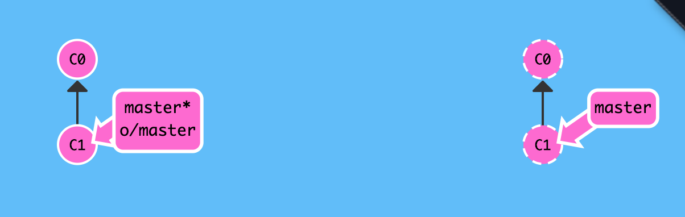
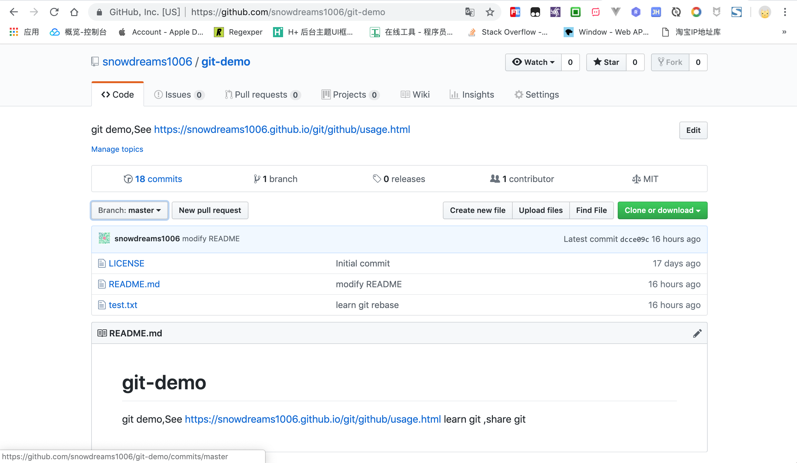
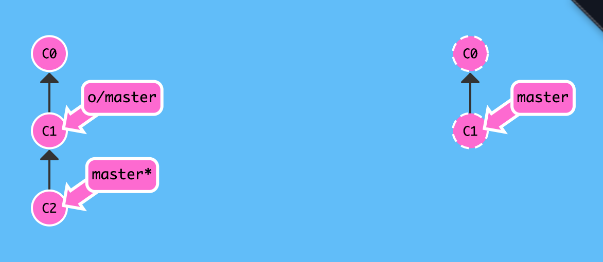
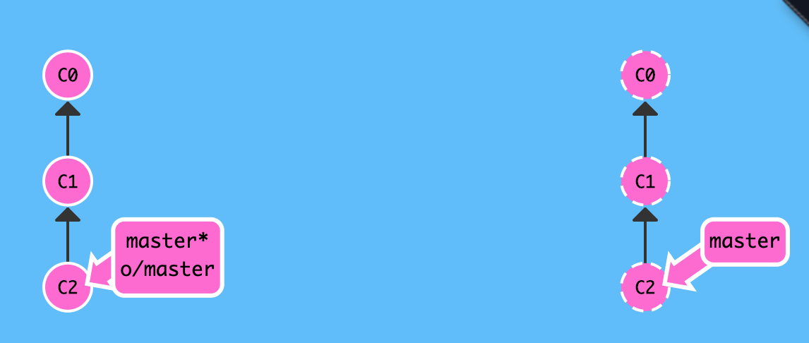
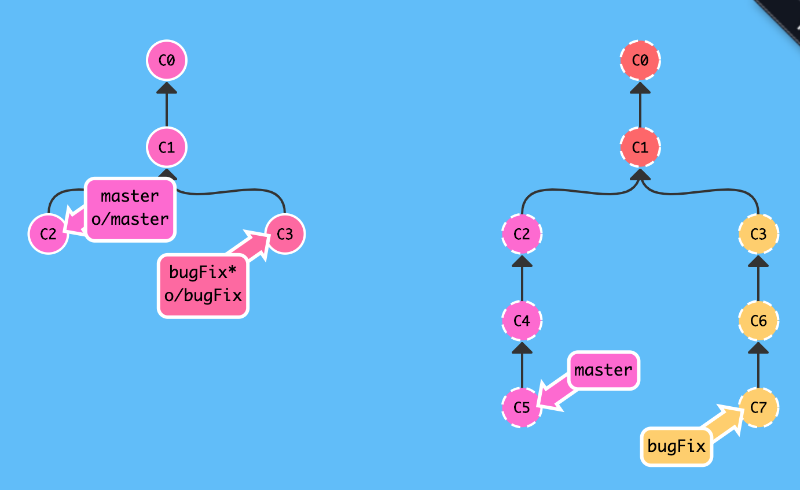
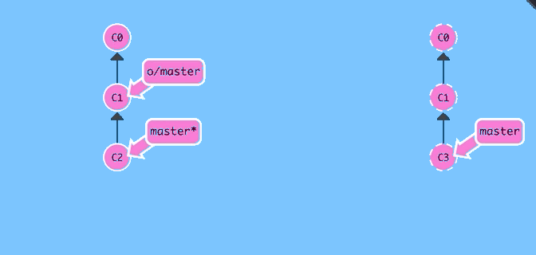
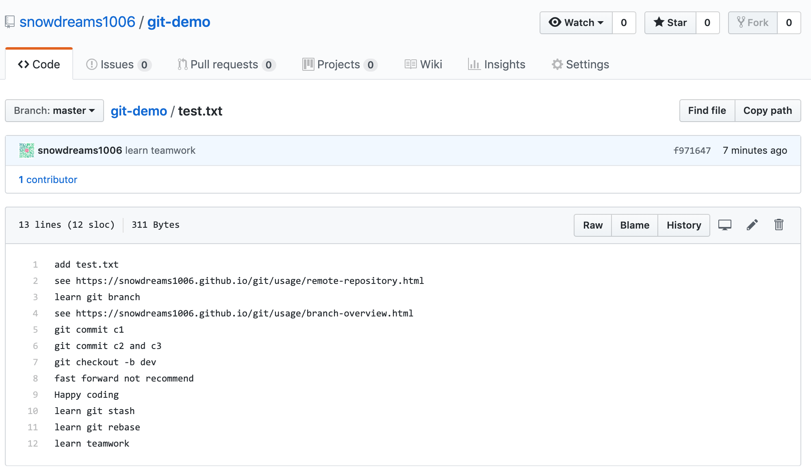
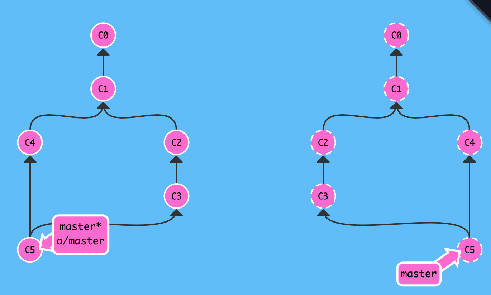

# 协同开发

前面我们已经介绍过远程仓库的相关概念,不过那时并没有深入探讨,只是讲解了如何创建远程仓库以及推送最新工作成果到远程仓库,实际上远程仓库对于团队协同开发很重要,不仅仅是团队协同开发的基础,也是代码备份的保障手段,现在我们先简单回忆下相关概念,以便为接下来的协同开发做好铺垫!

## 远程仓库和远程分支

### 远程仓库

**远程仓库**其实并不复杂,实际上只是**本地电脑**上的本地仓库在另一台**远程电脑**的备份而已.

相对本地仓库来说**远程电脑上的版本库**自然就是**远程仓库**,远程仓库使得我们的版本库更加安全,毕竟远程电脑可不是一般的电脑,出错的概率比我们平时工作所使用的电脑概率要小得多,这样一来即使不小心丢失了本地仓库的全部数据,只要远程仓库没有丢失,那我们就可以通过远程仓库重新取回最新数据!

还有一点,远程仓库让**代码社交化**,因为大家有了**一致途径**来访问远程仓库,团队也好或者陌生人也罢,只有你愿意,他们就可以获取远程仓库的最新代码并参与开发,这也是 `github` 的一大亮点!

### 远程分支

回顾好远程仓库的概念后,我们再来讲一下本地仓库的**远程分支**是什么意思?

当前你正在工作的电脑上存储的是**本地仓库**,如果没有**远程仓库**的支持,只能一个人鼓捣,别人无法共享你的工作成果,现在加入了团队开发流程,自然不再一个人独自开发,需要和团队其他人协同开发,共享开发成果.

所以本地仓库必然保存着远程仓库的基本信息,只有区分好**自己的工作成果**和**公共成果**,才能不乱套,又能做到信息及时共享.

实际上,在项目初期刚刚拷贝远程仓库(`git clone`)时,`git` 已经默认在本地仓库创建一个远程分支(`origin/master`),本地修改提交首先都是在本地仓库完成的,比如 `git add`,`git commit` 等命令,如果需要发布你的工作成果,那么就需要使用 `git push origin <branch>` 命令推送到远程仓库,这里的 `origin` 指的就是远程仓库名称(因为最初大家都是先从远程仓库克隆下来的,所以远程仓库存储的项目相当于原始项目,故而叫`origin`).

`git clone` 命令帮助本地仓库的 `master` 分支和远程仓库的 `master` 分支建立了关联,一般称远程仓库名称为 `origin`.



#### **查看远程仓库信息** : `git remote` 或 `git remote -v`

```
# 查看远程仓库名称
$ git remote
origin

# 查看远程仓库详情 : 拉取和推送链接
$ git remote -v
origin  git@github.com:snowdreams1006/git-demo.git (fetch)
origin  git@github.com:snowdreams1006/git-demo.git (push)
$ 
```

#### **本地分支推送到远程仓库** : `git push origin <branch>`

本地仓库和远程仓库的分支理论上应该一一对应,本地仓库的主干分支叫做 `master` ,而远程仓库也有相应的分支叫做 `master` ,这种映射关系是使用 `git clone` 命令时默认生成的,也是推荐的做法.

一般来说,本地仓库的分支推送到远程仓库指的就是推送到远程仓库同名的分支上,例如 `git push origin master` 意思是: 推将本地仓库的 `master` 分支推送到远程仓库的 `master`分支,当然你也可以推送其他分支到相应的远程分支上.

按照之前约定的分支管理策略来说,`master` 分支用于**生产环境**部署,`dev` 分支用于**收集开发成果**,`feature` 分支用于**开发具体功能**分支,既然如此,那这些本地分支哪些需要**同步推送**到远程仓库就比较清晰了!

- 推送本地 `master` 分支到远程仓库的 `master` 分支 : `git push origin master`
- 推送本地 `dev` 分支到元层仓库的 `dev` 分支 : `git push origin dev`

```
# 查看当前分支 : `master` 主分支
$ git branch
  dev
* master
  snow

# 推送本地 `master` 分支到远程仓库 `origin` 上相应的 `master` 分支 
$ git push origin master
Counting objects: 15, done.
Delta compression using up to 4 threads.
Compressing objects: 100% (15/15), done.
Writing objects: 100% (15/15), 1.31 KiB | 1.31 MiB/s, done.
Total 15 (delta 9), reused 0 (delta 0)
remote: Resolving deltas: 100% (9/9), completed with 3 local objects.
To github.com:snowdreams1006/git-demo.git
   e60c8ad..dcce09c  master -> master
$ 
```



正常来说,本地仓库的 `master` 分支应该领先远程仓库 `origin` 上的 `master` 分支若干个版本.



一旦我们已经将本地分支上的工作成果推送到远程仓库上相应分支时,本地仓库和远程仓库这时候就保持一致了.

```
$ git status
On branch master
Your branch is up to date with 'origin/master'.

nothing to commit, working tree clean
$ 
```



#### **远程仓库下载到本地分支** : `git fetch`

远程仓库的操作可以简单归纳为两部分: 上传和下载.

本地仓库推送到远程仓库是上传,而远程仓库拉取到本地仓库就是下载.

团队多人协作开发时,大家都会定期或不定期往 `master` 或 `dev` 等分支上推送各自的更改,相应的我们就需要下载别人的最新工作成果.

现在模拟其他伙伴正在往 `master` 分支上推送更改,最好在另一个电脑另一个账户,当然模拟的话也可以是同一个电脑下其他目录,或者最简单的方式,直接登录 `github` 更改 `master` 分支上某个文件内容,简单起见,我们采用最后一种方式.

其他伙伴已往远程仓库上的 `master` 分支提交了新的版本: 创建 `git-remote.txt` 文件


现在我们想要下载其他人的最新工作成果,接下来让我们看看本地仓库的 `master` 还能和远程仓库的 `master` 分支保持一致吗?



```
# 下载远程仓库的 `master` 分支
$ git fetch origin master
remote: Enumerating objects: 4, done.
remote: Counting objects: 100% (4/4), done.
remote: Compressing objects: 100% (2/2), done.
remote: Total 3 (delta 0), reused 0 (delta 0), pack-reused 0
Unpacking objects: 100% (3/3), done.
From github.com:snowdreams1006/git-demo
 * branch            master     -> FETCH_HEAD
   dcce09c..10942ff  master     -> origin/master
$ 
```


执行 `git fetch` 命令后,远程仓库上的最新提交记录已经下载到本地仓库,同时更新了本地仓库的远程分支`origin/master` ,值得注意的是本地仓库的 `master` 分支并没有更新!

那你可能会有疑问了,我想要的结果是下载其他人的最新工作成果,怎么我本地仓库的 `master` 分支并没有更新呢?

```
# 查看工作区
$ ls
LICENSE     README.md   test.txt

# 查看版本库状态
$ git status
On branch master
Your branch is behind 'origin/master' by 1 commit, and can be fast-forwarded.
  (use "git pull" to update your local branch)

nothing to commit, working tree clean
$ 
```

既然 `git fetch` 并没有更新本地仓库的 `master` 分支,那它到底做了哪些工作呢?

**`git fetch 会做的事情`**

实际上, `git fetch` 完成了仅有的但是很重要的两步操作:

- 从远程仓库下载本地仓库中缺失的提交记录
- 更新本地仓库的远程分支(比如`origin/master`)

通过上述两步操作完成的效果是: **将本地仓库中的远程分支更新成了远程仓库相应分支最新的状态**.

**远程分支**实际上是反映了**远程仓库**在你最后一次与它通信时的状态,而`git fetch` 就是你与远程仓库通信的方式了！

**`git fetch 不会做的事情`**

`git fetch` 并不会改变你本地仓库的状态,所以也就不会更新你的 `master`分支,自然也不会修改你磁盘上的文件.

理解这一点很重要,因为许多开发人员误以为执行了 `git fetch` 以后，他们本地仓库就与远程仓库同步了.

实际上它可能已经将进行这一操作所需的所有数据都下载了下来,但是并没有修改你本地的文件.

> 既然本地仓库的远程分支已更新,那么想要更新本地仓库的 `master` 分支该如何做呢?很简单,可以 `git merge` 啊!

#### **远程仓库更新到本地分支** : `git pull`

其实通过 `git fetch` 命令我们已经下载了远程仓库的最新版本,只不过还没有合并到本地仓库而已,如何合并分支相信大家已经轻车熟路了,有很多方法:

- `git merge origin/master`
- `git rebase origin/master`
- `git cherry-pick origin/master`

实际上,先抓取更新(`git fetch`)再合并(`git merge`)这个流程很常用,因此 `git` 是有专门的命令来完成这两步操作的,这就是拉取更新**`git pull`** --- 刚好与推送更新 `git push` 相反!

```
# 拉取最新版本
$ git pull
Updating dcce09c..10942ff
Fast-forward
 git-remote.txt | 1 +
 1 file changed, 1 insertion(+)
 create mode 100644 git-remote.txt

# 查看版本库状态
$ git status
On branch master
Your branch is up to date with 'origin/master'.

nothing to commit, working tree clean

# 查看工作区内容: 文件已更新
$ ls
LICENSE     README.md   git-remote.txt  test.txt
$ 
```



## 团队协作

掌握了远程仓库和远程分支的相关概念后,现在开始真正模拟团队协作开发了,为了简单起见,仍然以直接操作 `github` 上的 `master` 分支为例说明如何协同开发.

(1). 其他人已往远程仓库推送2个版本


(2). 你正在本地仓库提交1个版本

```
$ echo "learn teamwork" >> test.txt
$ git commit -am "learn teamwork"
[master f971647] learn teamwork
 1 file changed, 1 insertion(+)
$ 
```


(3). 你推送到远程仓库前先拉取最新版本

```
# 拉取最新版本,并尝试合并
$ git pull
remote: Enumerating objects: 8, done.
remote: Counting objects: 100% (8/8), done.
remote: Compressing objects: 100% (5/5), done.
remote: Total 6 (delta 0), reused 0 (delta 0), pack-reused 0
Unpacking objects: 100% (6/6), done.
From github.com:snowdreams1006/git-demo
   10942ff..612e08a  master     -> origin/master
Merge made by the 'recursive' strategy.
 git-remote.txt | 2 ++
 1 file changed, 2 insertions(+)

# 查看版本库状态
$ git status
On branch master
Your branch is ahead of 'origin/master' by 2 commits.
  (use "git push" to publish your local commits)

nothing to commit, working tree clean

# 查看其他人工作成果
$ cat git-remote.txt
git remote
git clone
git commit -am "fake second teamwork"

# 查看自己即将推送的工作成果
$ cat test.txt
add test.txt
see https://snowdreams1006.github.io/git/usage/remote-repository.html
learn git branch
see https://snowdreams1006.github.io/git/usage/branch-overview.html
git commit c1
git commit c2 and c3
git checkout -b dev
fast forward not recommend
Happy coding
learn git stash
learn git rebase
learn teamwork
$ 
```


(4). 你将本地仓库更改内容推送到远程仓库

```
# 推送到远程仓库
$ git push origin master
Counting objects: 5, done.
Delta compression using up to 4 threads.
Compressing objects: 100% (5/5), done.
Writing objects: 100% (5/5), 564 bytes | 564.00 KiB/s, done.
Total 5 (delta 3), reused 0 (delta 0)
remote: Resolving deltas: 100% (3/3), completed with 3 local objects.
To github.com:snowdreams1006/git-demo.git
   612e08a..8fe5aba  master -> master
$ 
```

现在前往 `github` 网站确认我们已经推送成功,我们的工作成果和其他人的工作成果同时存在于远程仓库中,这样就完成了一次团队协同开发的案例.





现在简单回顾一下整个协同开发流程:

1. 其他人先于我们提交2个版本
2. 我们本地提交1个版本
3. 本地版本推送前拉取远程仓库
4. 本地仓库推送到远程仓库


## 小结

- 查看远程仓库信息: `git remote -v`
- 本地仓库推送到远程仓库: `git push origin <branch>`
- 远程仓库抓取到本地仓库: `git fetch`
- 远程仓库拉取到本地仓库: `git pull` 相当于 `git fetch` 和 `git merge`
- 本地创建和远程仓库一致的分支: `git checkout -b <branch> origin/<branch>`,本地和远程分支名称最好一直,比如本地 `master` 和 远程 `origin/master`,本地 `dev` 和远程 `origin/dev`
- 本地分支和远程分支建立关联: `git branch --set-upstream <branch> origin/<branch>` ,足够任性的话,本地 `dev` 可以关联远程 `remote-dev` 等,不过建议名称最好一致.
- 团队协同开发时,不仅平时要定期拉取(`git pull`),推送到远程仓库前更应先拉取(`git pull`)再推送(`git push`),如出现冲突,解决冲突后再推送.

