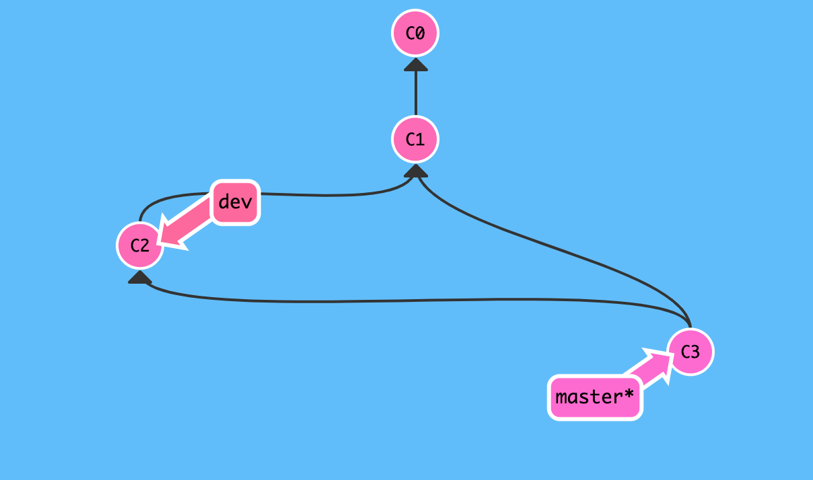
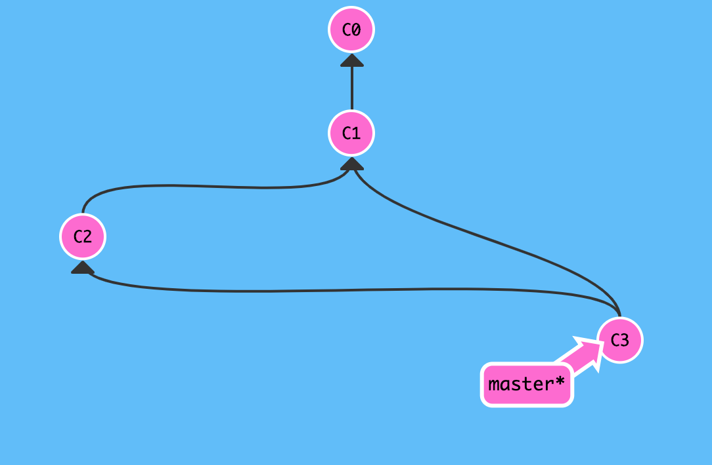
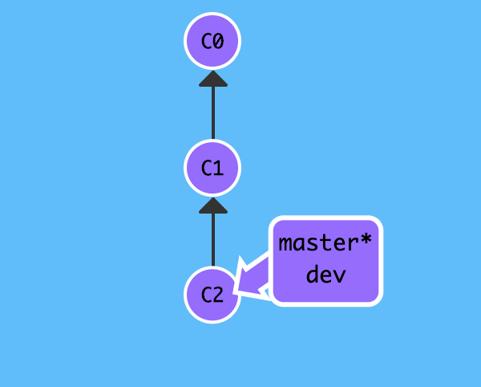
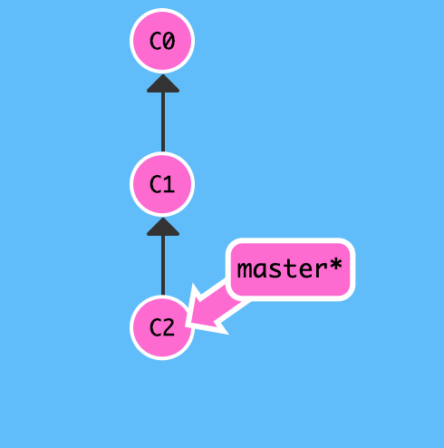
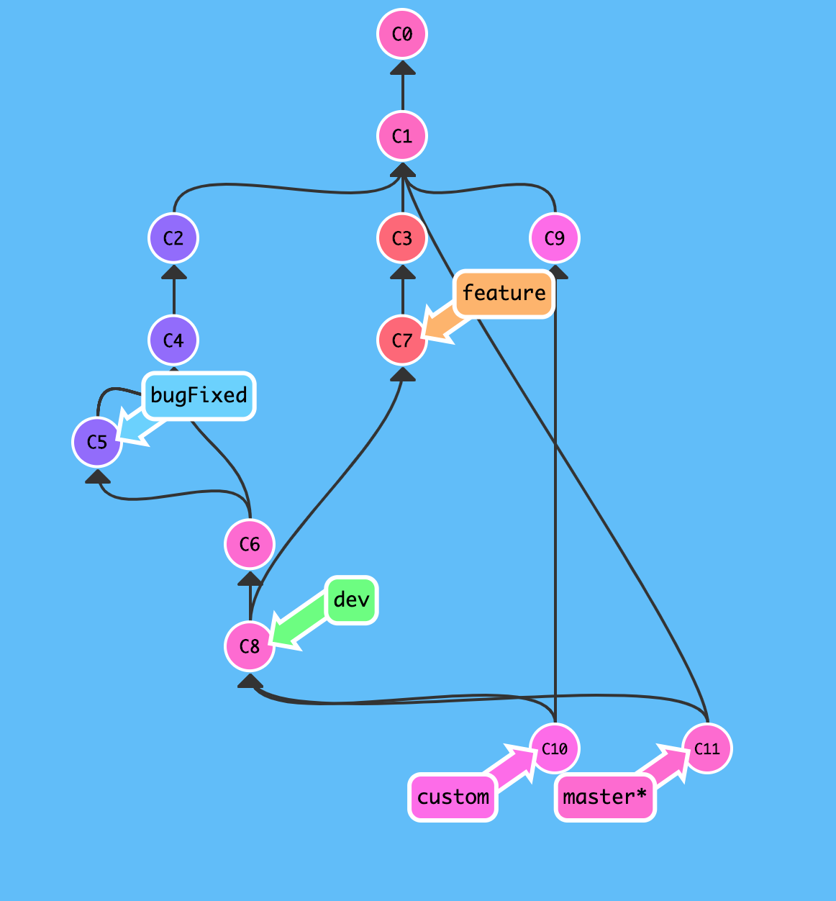

# 分支策略

默认情况下合并分支常常直接使用 `git merge` 命令,是最方便快速的合并方法.其实这种情况下 `git` 采用的是 `fast forward` 模式,特点是删除分支后,会丢失分支信息,好像从来没存在该分支一样,而我们推荐的是`recursive` 模式,能够保留分支的版本记录.

## 递归模式(`recursive`)

创建并切换 `dev` 分支,提交版本后切换回 `master` 分支,然后再合并 `dev` 分支,这不过这一次不再使用 `git merge dev` 命令:

```
# 创建并切换 dev 分支
$ git checkout -b dev
Switched to a new branch 'dev'
# 提交版本
$ echo "git checkout -b dev" >> test.txt
$ git add test.txt
$ git commit -m "git checkout -b dev"
[dev 44d68f6] git checkout -b dev
 1 file changed, 1 insertion(+)
# 切换回 master 分支
$ git checkout master
Switched to branch 'master'
Your branch is ahead of 'origin/master' by 6 commits.
  (use "git push" to publish your local commits)
$ 
```

现在添加 `--no-ff` 参数禁用 `fast forward` 模式,即`git merge --no-ff`:

```
$ git merge --no-ff -m "git merge --no-ff dev" dev
Merge made by the 'recursive' strategy.
 test.txt | 1 +
 1 file changed, 1 insertion(+)
$ 
```

上述内容显示,这次使用的不再是 `fast forward` 模式,而是 `recursive` 模式,那让我们看一下提交历史有什么不同吧!

```
$ git log --pretty=oneline --graph
*   22fbef71b7575cd7eb7911079551618667f9f38f (HEAD -> master) git merge --no-ff dev
|\  
| * 44d68f674bc85bc972426c572b78915e850e476c (dev) git checkout -b dev
|/  
*   3b8f434013caa8c27fade4c59d7aa2ee2c079636 fix conflict
|\  
| * 0fe95f871b371834d30ea17faa82f84b7d67672b git commit c2
* | 0949cc319e099d554795d03c69ee38923af00d6c git commit c3
|/  
* 5c482cd9965b9dfd4f273b43b240ed7db66167a8 git commit c1
* 413a4d1d2aab5ab85b6097d4b9f81cb5601c3b26 see https://snowdreams1006.github.io/git/usage/branch-overview.html
* 9c30e50248b773e38b032477a859e87abe7c1bb0 learn git branch
* b3d8193bbcb9f76c47e831e3e212f2405ae09f93 (origin/master, origin/HEAD) see https://snowdreams1006.github.io/git/usage/remote-repository.html
* 8e625640348a47ac922409a1ecb4c844385582aa add test.txt
* 9b196aab5bc87eeb11709c9eef35fca283e05c61 Initial commit
$ 
```



这种递归模式(`recursive`) 有一个明显的特点就是会产生一个新的 `commit` ,并不会像之前快速前进模式(`fast forward`)那样单纯更改 `HEAD` 的指向.

秉承着阅后即焚的习惯,分支一旦合并后就立即删除,现在删除 `dev` 分支,看一下会发生什么:

```
# 删除 dev 分支
$ git branch -d dev
Deleted branch dev (was 44d68f6).
# 查看提交历史
$ git log --pretty=oneline --graph
*   22fbef71b7575cd7eb7911079551618667f9f38f (HEAD -> master) git merge --no-ff dev
|\  
| * 44d68f674bc85bc972426c572b78915e850e476c git checkout -b dev
|/  
*   3b8f434013caa8c27fade4c59d7aa2ee2c079636 fix conflict
|\  
| * 0fe95f871b371834d30ea17faa82f84b7d67672b git commit c2
* | 0949cc319e099d554795d03c69ee38923af00d6c git commit c3
|/  
* 5c482cd9965b9dfd4f273b43b240ed7db66167a8 git commit c1
* 413a4d1d2aab5ab85b6097d4b9f81cb5601c3b26 see https://snowdreams1006.github.io/git/usage/branch-overview.html
* 9c30e50248b773e38b032477a859e87abe7c1bb0 learn git branch
* b3d8193bbcb9f76c47e831e3e212f2405ae09f93 (origin/master, origin/HEAD) see https://snowdreams1006.github.io/git/usage/remote-repository.html
* 8e625640348a47ac922409a1ecb4c844385582aa add test.txt
* 9b196aab5bc87eeb11709c9eef35fca283e05c61 Initial commit
$ 
```



由此可见,删除 `dev` 分支后仅仅少了 `dev` 的引用而已,原来 `dev` 分支所做的更改全部保留下来了!

## 快速前进模式(`fast forward`)

创建并切换 `dev` 分支,提交版本后切换回 `master` 分支,然后再合并 `dev` 分支,使用 `git merge dev` 命令:

```
# 创建并切换 dev 分支
$ git checkout -b dev
Switched to a new branch 'dev'
# 提交版本
$ echo "fast forward" >> test.txt
$ git add test.txt
$ git commit -m "fast forward"
[dev 3fe94c0] fast forward
 1 file changed, 1 insertion(+)
$ 
```

现在切换回 `master` 分支,采用默认的`git merge` 命令合并 `dev` 分支:

```
$ git checkout master
Switched to branch 'master'
Your branch is ahead of 'origin/master' by 8 commits.
  (use "git push" to publish your local commits)
sunpodeMacBook-Pro:git-demo sunpo$ git merge dev
Updating 22fbef7..3fe94c0
Fast-forward
 test.txt | 1 +
 1 file changed, 1 insertion(+)
$ 
```

上述内容显示这次合并采用的是快速前进模式(`fast forward`),让我们看一下提交历史:

```
$ git log --pretty=oneline --graph
* 3fe94c0088cae526eda1fb2ffa303001b1eb42ba (HEAD -> master, dev) fast forward
*   22fbef71b7575cd7eb7911079551618667f9f38f git merge --no-ff dev
|\  
| * 44d68f674bc85bc972426c572b78915e850e476c git checkout -b dev
|/  
*   3b8f434013caa8c27fade4c59d7aa2ee2c079636 fix conflict
|\  
| * 0fe95f871b371834d30ea17faa82f84b7d67672b git commit c2
* | 0949cc319e099d554795d03c69ee38923af00d6c git commit c3
|/  
* 5c482cd9965b9dfd4f273b43b240ed7db66167a8 git commit c1
* 413a4d1d2aab5ab85b6097d4b9f81cb5601c3b26 see https://snowdreams1006.github.io/git/usage/branch-overview.html
* 9c30e50248b773e38b032477a859e87abe7c1bb0 learn git branch
* b3d8193bbcb9f76c47e831e3e212f2405ae09f93 (origin/master, origin/HEAD) see https://snowdreams1006.github.io/git/usage/remote-repository.html
* 8e625640348a47ac922409a1ecb4c844385582aa add test.txt
* 9b196aab5bc87eeb11709c9eef35fca283e05c61 Initial commit
$ 
```

上述内容表明,此次合并并没有产生新的 `commit` ,只是更改下 `HEAD` 指向而已(`HEAD -> master, dev`).



同样,现在删除 `dev` 分支,再看一下提交历史:

```
# 删除 dev 分支
$ git branch -d dev
Deleted branch dev (was 3fe94c0).
# 查看提交历史
$ git log --pretty=oneline --graph
* 3fe94c0088cae526eda1fb2ffa303001b1eb42ba (HEAD -> master) fast forward
*   22fbef71b7575cd7eb7911079551618667f9f38f git merge --no-ff dev
|\  
| * 44d68f674bc85bc972426c572b78915e850e476c git checkout -b dev
|/  
*   3b8f434013caa8c27fade4c59d7aa2ee2c079636 fix conflict
|\  
| * 0fe95f871b371834d30ea17faa82f84b7d67672b git commit c2
* | 0949cc319e099d554795d03c69ee38923af00d6c git commit c3
|/  
* 5c482cd9965b9dfd4f273b43b240ed7db66167a8 git commit c1
* 413a4d1d2aab5ab85b6097d4b9f81cb5601c3b26 see https://snowdreams1006.github.io/git/usage/branch-overview.html
* 9c30e50248b773e38b032477a859e87abe7c1bb0 learn git branch
* b3d8193bbcb9f76c47e831e3e212f2405ae09f93 (origin/master, origin/HEAD) see https://snowdreams1006.github.io/git/usage/remote-repository.html
* 8e625640348a47ac922409a1ecb4c844385582aa add test.txt
* 9b196aab5bc87eeb11709c9eef35fca283e05c61 Initial commit
$ 
```



由此可见,快速前进模式一旦删除分支后就彻底丢失了分支的信息,即便是从提交历史中也找不到曾经存在的痕迹!

## 分支策略

`git` 是分布式版本控制系统,同时鼓励大量使用分支,如此一来大量的分支该如何管理?
实际开发中,建议准从以下原则进行分支管理:

- `master` 分支作为主干分支,负责对外提供服务,要求稳定可靠,因为应该专人负责更新维护.
- `dev` 分支作为开发分支,取代 `master` 分支的开发地位,积累到一定产出时再合并到 `master` 分支.
- `feature` 分支作为新功能分支,根据实际情况动态创建,删除分支,并适时合并到 `dev` 分支.
- `bugFixed` 分支作为修复特定 bug 分支,可能由 `master` 分支衍生而来,也可能由 `dev` 分支衍生等等,修复后及时合并到原分支.
- `custom` 自定义分支,项目成员私有分支,由上级领导分配任务后各开发人员自行选择创建自己的分支,并根据实际情况决定合并到 `dev` 分支或 `feature` 等分支.



## 小结

- 快速前进模式(`git merge <name>`)不保留分支合并历史,递归模式(`git merge --no-ff -m <remark> <name>`)保留分支合并历史.
- 制定大家都认同的分支管理原则,并严格准守规则.

