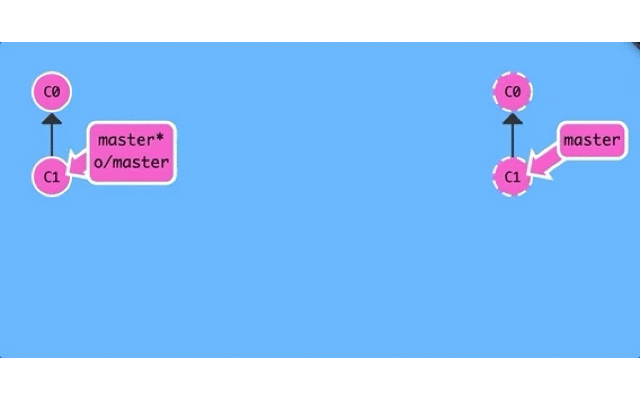
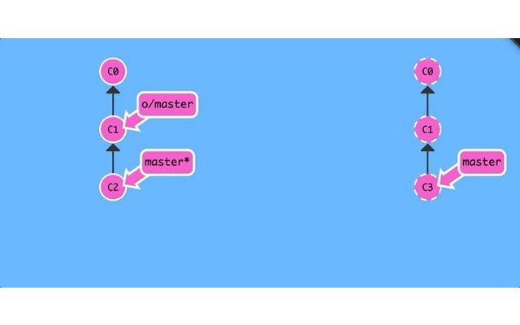

# 本地和远程仓库的本质

**本地仓库**和**远程仓库**在本质上没有太大区别,只不过一个是本地电脑,一个是远程电脑.

远程仓库不一定非得是 `github` 那种专门的"中央服务器",甚至局域网的另外一台电脑也可以充当"中央服务器"的角色,因为它存在的最初目的只是方便大家**交换彼此的提交记录**而已!

所以本地仓库和远程仓库的基本行为应该是一致的,约定俗成的规定是远程仓库一般不直接参与日常开发工作,主要作为项目托管中心.

> 某些自动化持续集成环境中也可能会直接操作远程仓库,这时远程仓库就真的和本地仓库没什么区别了!

## 个人开发常用命令

个人开发看重的是**效率**,同时兼顾下**版本控制**的话算是是锦上添花,`git` 的本地仓库是本地备份,而远程仓库则是网盘备份.

### `git init` : 初始化本地项目

将本地项目初始化 `git` 项目,直观表现是在该项目同级目录下多了 `.git` 隐藏目录,其存储着 `git` 版本库相关信息.

> 此后当前项目便具备了本地管理的能力,可以与 `git` 进行交互.

### `git clone` : 克隆远程项目

同 `git init` 一样的作用,也是创建本地仓库,只不过 `git init` 是直接将本地项目作为本地仓库,而`git clone` 是将远程项目克隆到本地并作为本地仓库.

> 由此可见,`git clone` 比 `git init` 多了一层远程仓库的概念.

### `git add` : 添加文件

将工作区的提交记录添加到暂存区,暂存区是工作区和版本库交互的桥梁,暂存区积累到一定量的提交记录时可以批量提交到版本库,这一点暂存区有点像缓存.      

### `git commit` : 提交文件

将暂存区的版本提交到版本库,从而形成**工作区->暂存区->版本库**的基本链路,本地工作区的**版本控制流程**大致如此.

### `git push` : 推送文件

如果是使用 `git clone` 命令克隆的本地项目,当工作到一定程度时可能需要将这部分工作成果推送到远程仓库,这时候使用 `git push` 命令完成本地版本的推送流程.

如果是使用 `git init` 命令初始化的本地项目,可能没有远程仓库,自然也就不需要推送.如果后来创建了远程仓库,那么你自然是想要将本地仓库推送到远程仓库的,因此你需要准确告诉 `git` 你要推送到哪个远程仓库.
使用 `git remote add origin git@github.com:username/repos.git` 命令添加远程仓库信息,这样就建立了本地仓库和远程仓库的关联,以后就可以正常推送到远程仓库了.

## 团队开发常用命令

团队开发注重的不仅是个人效率还有团队的整体进度,随着企业级开发的日趋复杂化,不再是一个人能够独立完成的,更何况时间也不允许慢慢完成,大多数公司采用的是人力换时间的方式,团队并行开发来缩短整个项目周期,这种复杂需求下正是 `git` 大展拳脚的好机会.

项目整体采用并行开发模式,拆解成不同的功能模块,每个人负责各自模块,模块之间相对独立但也不排除存在交集的可能性.对于每一个个体开发者来说,既需要版本控制又需要团队交流.这时候分支的作用就凸显出来了.

根据项目的业务特点将其拆解成不同的功能模块,这些功能模块分别代表不同的分支,而这些功能模块又组成了完整的项目,这就是主干和分支的关系.

> 初始时项目是一个整体,中间拆解成不同功能模块,最后再合并成一个整---"分久必分合久必分".

### `git branch <branch>` : 创建分支

每一个独立的功能模块被定义成一个单独分支,创建分支的过程其实是拆解项目的过程,创建本地分支后就在分支上开发特有功能,不再关心其他功能分支.

### `git checkout <branch>` : 切换分支

模块拆解完成并创建了相应的分支后,需要切换到既定分支上才能开展自己的工作.

### `git merge <branch>` : 合并分支 

没有绝对的独立,项目再怎么拆分也是整体的一部分,肯定需要和其他功能模块发生关系,某些情况下需要其他分支的工作成果合并到自己的本地仓库中,这样才能完成一次小规模的组装.

可以预期的是,当这种组装足够多的时候,最终便会演变成项目的终极形态,形成一个整体.

### `git fetch` : 抓取远程分支

合并目标分支首先需要能够获取到目标分支的提交记录,既然每个功能模块都是不同的项目成员负责开发的,也就不在我们电脑上,所以我们先要将目标分支下载到我们本地电脑,然后才能合并该分支到本地分支.

### `git pull` : 拉取远程分支

"先下载目标分支再合并到本地分支,从而小规模组成更复杂更强大的功能",每一次的组装过程都需要两步操作者显然不符合懒人思维啊,`git pull` 就是这两步操作的简化命令,**先下载再合并**就是这么简单!

## 本地和远程仓库的碰撞

不论是个人开发还是团队开发,我们几乎习惯惯站在**主动方**的角度来思考问题,有没有想过当远程仓库接收到我们的`git push` 或 `git pull` 请求时,远程仓库发什么了什么改变,这种改变对本地仓库又有什么影响?

远程仓库(远程电脑上的本地仓库)只是众多分布式电脑上本地仓库中的一员,说它特殊也很特殊,充当着"中央服务器"作用,其余人统一从这里下载或推送;说它普通也很普通,和本地电脑上的本地仓库没有什么不同,因为它随时可被任意电脑上的本地仓库所取代!

揭开远程仓库的神秘面纱后,现在我们只需要将其视为普通的本地仓库一样对待即可,然而我们本地电脑上已经有了本地仓库,故而需要将远程仓库做一下简单标识区分(`origin`)称之为远程分支.

- 先说说 `git push` 命令做了什么?

  1. 对于本地来说,`git` 将本地仓库的指定分支推送到远程仓库的相应分支,同时更新了本地仓库的远程分支.
  2. 对于远程来说,`git` 接收到本地仓库的推送请求时应该在相应分支上合并本地分支,同时更新远程仓库的相应分支.

只要本地的指定分支成功推送到远程的相应分支时,对于本地来说,不论是指定分支还是远程分支(`origin/master`)都应该是最新状态,因为已经与服务器同步了.

而远程接收到此次推送请求时,应该尝试合并此次推送请求,再更新自己的相应分支,远程合并完成后再通知本地此次推送结果,如此一来,三端同步,皆大欢喜!

- 再讲讲 `git pull` 命令发生了什么?

  1. 对于远程来说,接收到本地的拉取请求时,因为没有新版本需要处理,所以无需任何操作.
  2. 对于本地来说,当远程仓库的相应分支下载到本地时应该更新远程分支状态,再尝试合并到本地的相应分支.

> `git pull` 命令或者说是 `git fetch` 命令是本地和远程通信的方式,所以 `origin/master` 会自动更新!

## 小结

本地仓库和远程仓库本质上没有太大区别, `git fetch` 是本地仓库和远程仓库之间的通信途径,本地仓库中的远程分支(`origin/master`)保存着它们之间最后一次的通信状态.

