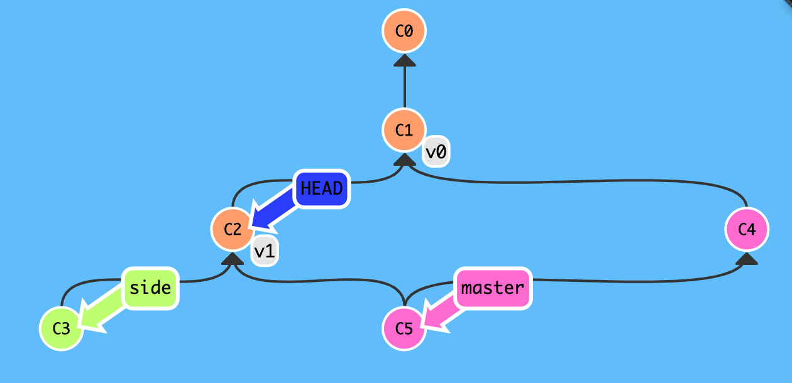
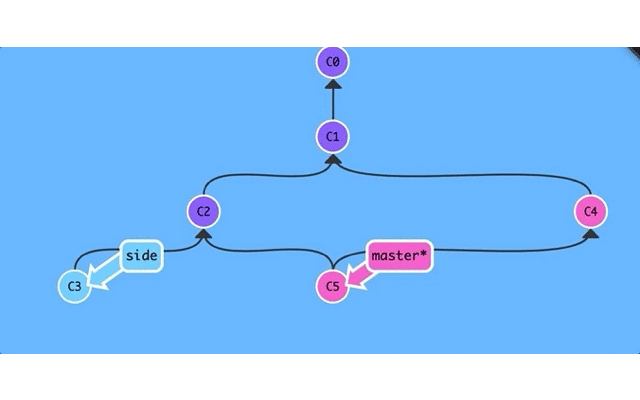

# 里程碑式标签

"春风得意马蹄疾,一日看尽长安花",对于项目也是如此,最值得期待的恐怕就要数**新版本**发布的时刻了吧?每当发布新版本时要么是版本号命名(比如`v0.0.1`)或者代号命名(比如`Chelsea`),不管怎么说这种里程碑阶段总是要留下些许纪念意义.

既然想要纪念这种特殊的历史时刻,自然是希望它能够固定下来,不要发生**随意移动**,产生不可预期后果.

这种需求其实和我们前面说的**分支**概念很相似,均是源于特殊的版本号,逐渐收集起一系列版本,最终形成一条**相对独立**的历史线,但**分支**并不是实现**里程碑**概念的最佳选择,为什么?

**分支**适合多人**协作开发**时互不影响,适当时机主动合并他人工作成果这种模式,而这种模式是由不同的功能模块进行驱动的,正所谓"天下大势分久必合,合久必分",当功能模块开发完毕后自然也就没有分支存在的必要性,更何况分支在收集版本的过程中会一直移动,并没有特殊的固定版本,显然**分支**不是最佳选择!

但是,**分支**确定一定程度上和**里程碑**概念很相似,源于特定版本,自主命名,收集版本等,那么何必重头再来,为何不复用已有概念呢?

实际上,`git` 中的标签(`tag`) 就是实现**里程碑**概念的方式,它可以永久性指向特定的提交并将命名,然后就可以将其理解成分支一样引用了!

但标签(`tag`)不是分支(`branch`),标签是一个点的话,分支就是若干点连接而成的线,标签是静态的,分支是动态的,标签是只读的,分只是可读可写的.



## 创建标签 `git tag <tag>`

```
# 方式一: 默认 `HEAD` 指向的版本
git tag v0.0.1

# 方式二: 指定 `commit_id` 表示的版本
git tag v0.0.2 f971647

# 方式三: 指定 `commit_id` 表示的版本,同时创建标签说明信息
git tag -a v0.0.3 -m "v0.0.3" f971647
```



## 列出标签 `git tag`   

```
git tag 
```

## 显示标签 `git show <tag>`

```
git show v0.0.1
```

## 删除标签 `git tag -d <tag>`

```
git tag -d v0.0.1
```

## 推送标签 `git push origin <tag>`

```
git push origin v0.0.1
```

## 推送全部标签 `git push origin --tags`

```
git push origin --tags
```

## 删除远程标签 `git tag -d <tag>` `git push origin :refs/tags/<tag>`    

```
# 删除本地标签 
git tag -d v0.0.1

# 推送删除标签(删除也是推送)
git push origin :refs/tags/v0.0.1
```