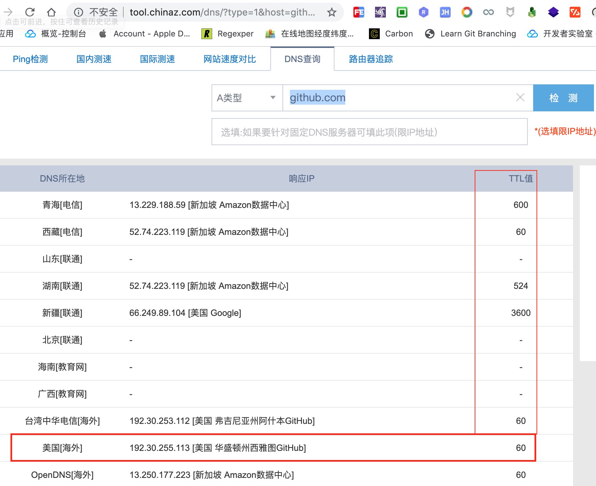
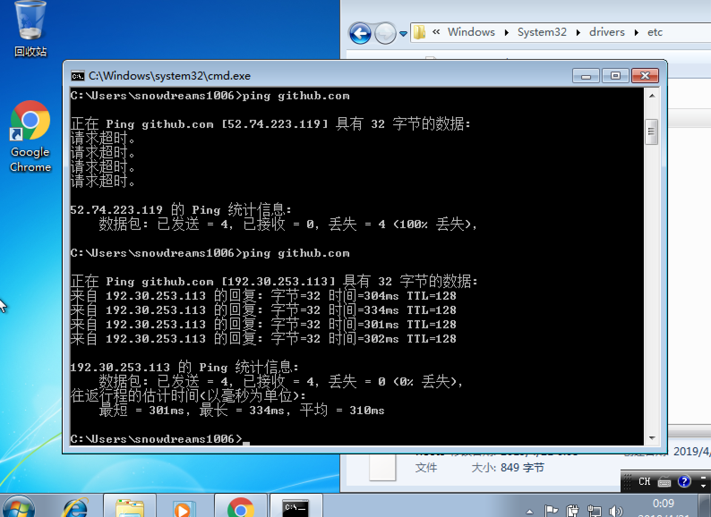

# github 访问速度太慢


`github` 是全世界最流行的开源项目托管平台,其代表的开源文化从根本上改变了软件开发的方式.

基本上所有的需求都能从 `github` 上或多或少找到现成的实现方案,再也不用重头开始造轮子而是自定义轮子!

然而,有时候国内访问 [https://github.com/](https://github.com/) 速度太慢,如何加速访问 `github.com` 网站就成了刚需.

由于 `github.com` 网站位于美国旧金山,所以初始访问 `github.com` 时网络寻址会比较耗费时间,这也是网站打开速度慢的其中一个原因.


> 国外在线检测网站: [https://www.ipaddress.com/](https://www.ipaddress.com/)

最初用户从浏览器中输入 `github.com` 网址时,浏览器并不知道这个域名对应的真实 `ip` 地址,先问问自己电脑认识不认识这个域名的门牌号,如果本机不认识会接着往上问,当地运行商也不认识这个域名的话,继续问上级,直到问道 `github.com` 的门牌号是 `192.30.253.113` 为止!

如此繁琐的问路过程被称之为 `DNS` 寻址,如果问路的时间都占用很久,那么访问网站的速度自然会很慢.

所以,如果我们直接告诉浏览器目的地,那么浏览器也就不会一步一步去费劲问路了,这在一定程度上也就优化了访问网站的速度.

```bash
$ ping github.com -c 3
PING github.com (192.30.253.113): 56 data bytes
64 bytes from 192.30.253.113: icmp_seq=0 ttl=41 time=405.924 ms
64 bytes from 192.30.253.113: icmp_seq=1 ttl=41 time=346.654 ms
64 bytes from 192.30.253.113: icmp_seq=2 ttl=41 time=345.485 ms

--- github.com ping statistics ---
3 packets transmitted, 3 packets received, 0.0% packet loss
round-trip min/avg/max/stddev = 345.485/366.021/405.924/28.220 ms
```

> `ping github.com -c 3` 查看 `github.com` 网站的门牌号

正常来说,网站的主域名下会存在多个子域名,由这些域名组合在一起提供完整的服务.

而 `github.com` 也不例外,其中 `github.com`是一级域名,也是主域名,其他的域名基本上都是二级余敏或者说次域名.

所以我们不仅要告诉本机 `github.com` 的主域名,还要把相关的子域名也告诉本机,帮人帮到底,送福送到西!

那到哪里去查询域名和 `ip` 的对应关系呢?

想一想现实生活中,每个人都有自己的家,而这个家有具体的地址,也就是平时说的门牌号.

当然,有些人名下不只有一个家,可以有很多房产都可以作为家.

对应到计算机世界中,域名就是计算机中的个人用户,而域名的家就是 ip 地址.一个域名可以有多个 ip,但一个 ip 只能有一个域名.

正所谓"一山不容二虎","卧榻之旁岂容他人酣睡",一家之主只能有一个!

如果有人想要拜访您,肯定要有具体的地址才能到你家里做客,从你家到你家的地址这个过程可能是你告诉他的,也可能是他自己找别人打听到的消息.

域名到 `ip` 地址的过程同样也需要找人询问,这个信息一般会存在 `dns` 服务商那里,就像我们的地址登记到相关政府机构一样.

虽然相关机构的信息比较权威及时,但门槛有点高,不如问一下当地的"消息通".

互联网上的"消息通"更是数不胜数,这里推荐两个查询域名解析的网站.

- [https://www.ipaddress.com/](https://www.ipaddress.com/)


- [http://tool.chinaz.com/dns/](http://tool.chinaz.com/dns/)


## 子域名有哪些

下面以 `ipaddress.com` 网站为例,查询下 `github.com` 网站的相关信息.

在输入框中输入 `github.com` 域名后开始解析该域名的相关信息,不仅找到了域名对应的 `ip` 地址还查询到相关网站的域名信息.


> 亲自去体验一下: [域名查询](http://github.com.ipaddress.com/)

根据查到的相关域名信息,再次查询出这些域名对应的 `ip` 地址,于是整理出以下内容.

```
# github related website
192.30.253.113 github.com
151.101.185.194 github.global.ssl.fastly.net
192.30.253.118 gist.github.com
192.30.253.120 codeload.github.com
185.199.108.153 desktop.github.com  
185.199.108.153 guides.github.com   
185.199.108.153 blog.github.com 
18.204.240.114 status.github.com   
185.199.108.153 developer.github.com    
185.199.108.153 services.github.com 
192.30.253.175 enterprise.github.com   
34.195.49.195 education.github.com    
185.199.108.153 pages.github.com    
34.196.237.103 classroom.github.com
```

## 就近 cdn 加速

大型网站服务器都不会是只有一台服务器,而是多台服务器组成的集群一起对外提供服务.

全世界都在使用 `github` ,如果每一次访问网站时走的都是美国服务器,即使浏览器知道目的地,但是距离太多遥远还是会很慢.

因此,如果能够就近访问 `github` 网站就能大幅提高访问速度了,幸运的是,网络上同样有现成的工具来帮助我们查看就近的网站地址.



> 亲自去体验一下: [DNS查询](http://tool.chinaz.com/dns/?type=1&host=github.com&ip=)

从上图中我们可以看出,同一个域名有很多不同的 `ip` 地址,从中选择 `TTL` 值最小的作为优化标准.

于是,将上述清单继续优化成以下内容:

```
# github related website
192.30.253.113 github.com
151.101.185.194 github.global.ssl.fastly.net
203.98.7.65 gist.github.com
13.229.189.0 codeload.github.com
185.199.109.153 desktop.github.com 
185.199.108.153 guides.github.com  
185.199.108.153 blog.github.com
18.204.240.114 status.github.com
185.199.108.153 developer.github.com
185.199.108.153 services.github.com
192.30.253.175 enterprise.github.com   
34.195.49.195 education.github.com    
185.199.108.153 pages.github.com  
34.196.237.103 classroom.github.com
```

> 最好亲自测试一下就近站点以求获得最佳体验,不过推测应该差异不是很大,所以直接复制也无妨.

## 告诉本机新地址

现在我们已经弄清楚域名和 `ip` 的映射关系,接下来要做的事情就是告诉本机,不同的操作系统具体文件存放的地址可能有些不同,下面我们以 `Windows` 和 `Mac` 举例说明.

```
# github related website
192.30.253.113 github.com
151.101.185.194 github.global.ssl.fastly.net
203.98.7.65 gist.github.com
13.229.189.0 codeload.github.com
185.199.109.153 desktop.github.com 
185.199.108.153 guides.github.com  
185.199.108.153 blog.github.com
18.204.240.114 status.github.com
185.199.108.153 developer.github.com
185.199.108.153 services.github.com
192.30.253.175 enterprise.github.com   
34.195.49.195 education.github.com    
185.199.108.153 pages.github.com  
34.196.237.103 classroom.github.com
```

### `windows` 

> 映射文件存放于: `C:\Windows\System32\drivers\etc\hosts`

- 打开 `hosts` 文件,将上述映射关系**追加**到文件末尾,保存并退出.


> 如果由于权限不足,无法保存,可以复制到桌面再编辑文件,最后移动并替换到 `hosts` 文件.

- 运行 `ipconfig /flushdns` 刷新 `dns` 缓存.



### `mac`

> 映射文件存放于: `/etc/hosts`

- 编辑 `hosts` 文件并追加上述映射关系.

```bash
$ cat /etc/hosts
# jetbrains
0.0.0.0 account.jetbrains.com
0.0.0.0 www.jetbrains.com

# github related website
192.30.253.113 github.com
151.101.185.194 github.global.ssl.fastly.net
203.98.7.65 gist.github.com
13.229.189.0 codeload.github.com
185.199.109.153 desktop.github.com 
185.199.108.153 guides.github.com  
185.199.108.153 blog.github.com
18.204.240.114 status.github.com
185.199.108.153 developer.github.com
185.199.108.153 services.github.com
192.30.253.175 enterprise.github.com   
34.195.49.195 education.github.com    
185.199.108.153 pages.github.com  
34.196.237.103 classroom.github.com
```

- 运行 `sudo dscacheutil -flushcache` 刷新 `dns` 缓存.

```bash
$ ping github.com -c 3
PING github.com (192.30.253.113): 56 data bytes
64 bytes from 192.30.253.113: icmp_seq=0 ttl=41 time=395.808 ms
64 bytes from 192.30.253.113: icmp_seq=1 ttl=41 time=306.919 ms
64 bytes from 192.30.253.113: icmp_seq=2 ttl=41 time=298.188 ms

--- github.com ping statistics ---
3 packets transmitted, 3 packets received, 0.0% packet loss
round-trip min/avg/max/stddev = 298.188/333.638/395.808/44.105 ms
$ 
```

## 又到总结时间

本文讲述了如何解决 `github.com` 网站访问速度慢的问题,通过修改本机的 `hosts` 文件来绕过 `dns` 解析,这种方法仅仅适用于能够访问网站只不过是访问速度慢这一现象.

如果本身无法访问国外网啊
 