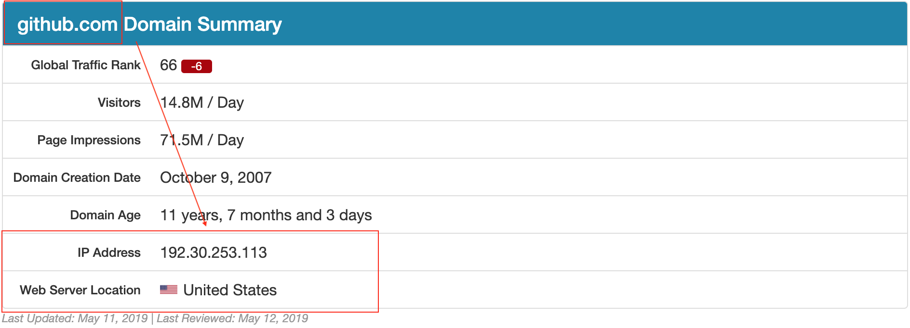
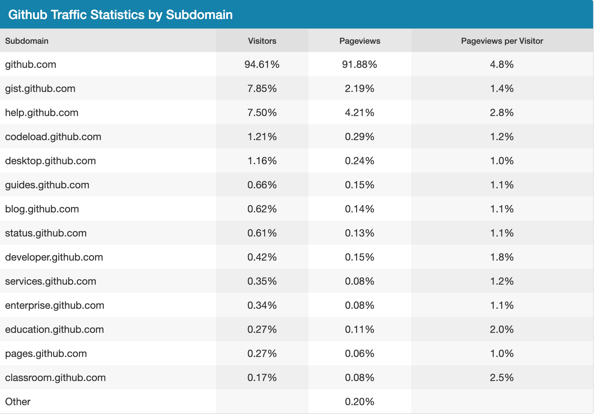
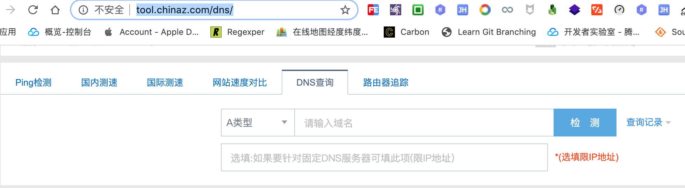
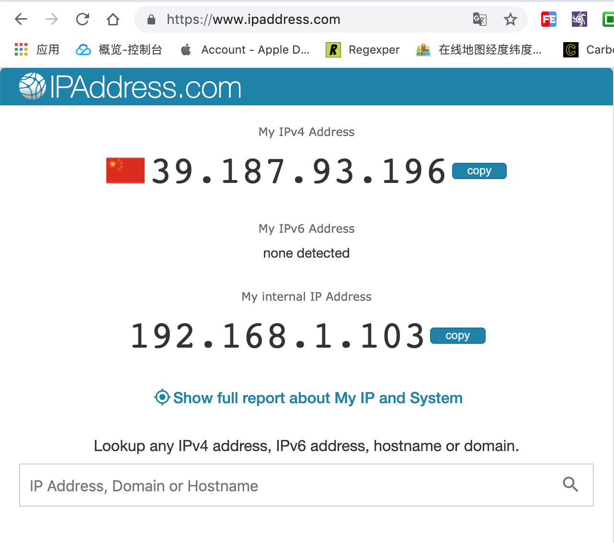

# github 访问速度太慢

国内访问 [https://github.com/](https://github.com/) 速度太慢,如何加速访问 `github.com` 网站就成了刚需.

由于 `github.com` 网站位于美国旧金山,所以初始访问 `github.com` 时网络寻址会比较耗费时间,这也是网站打开速度慢的其中一个原因.



> 国外在线检测网站: [https://www.ipaddress.com/](https://www.ipaddress.com/)

最初用户从浏览器中输入 `github.com` 网址时,浏览器并不知道这个域名对应的真实 `ip` 地址,先问问自己电脑认识不认识这个域名的门牌号,如果本机不认识会接着往上问,当地运行商也不认识这个域名的话,继续问上级,直到问道 `github.com` 的门牌号是 `192.30.253.113` 为止!

如此繁琐的问路过程被称之为 `DNS` 寻址,如果问路的时间都占用很久,那么访问网站的速度自然会很慢.

所以,如果我们直接告诉浏览器目的地,那么浏览器也就不会一步一步去费劲问路了,这在一定程度上也就优化了访问网站的速度.

```bash
$ ping github.com -c 3
PING github.com (192.30.253.113): 56 data bytes
64 bytes from 192.30.253.113: icmp_seq=0 ttl=41 time=405.924 ms
64 bytes from 192.30.253.113: icmp_seq=1 ttl=41 time=346.654 ms
64 bytes from 192.30.253.113: icmp_seq=2 ttl=41 time=345.485 ms

--- github.com ping statistics ---
3 packets transmitted, 3 packets received, 0.0% packet loss
round-trip min/avg/max/stddev = 345.485/366.021/405.924/28.220 ms
```

> `ping github.com -c 3` 查看 `github.com` 网站的门牌号

## 子域名有哪些

正常来说,网站的主域名下会存在多个子域名,由这些域名组合在一起提供完整的服务.

而 `github.com` 也不例外,其中 `github.com`是一级域名,也是主域名,其他的域名基本上都是二级余敏或者说次域名.

所以我们不仅要告诉本机 `github.com` 的主域名,还要把相关的子域名也告诉本机,帮人帮到底,送福送到西!



那到哪里去查询域名和 `ip` 的对应关系呢?

想一想现实生活中,每个人都有自己的家,而这个家有具体的地址,也就是平时说的门牌号.

当然,有些人名下不只有一个家,可以有很多房产都可以作为家.

对应到计算机世界中,域名就是计算机中的个人用户,而域名的家就是 ip 地址.一个域名可以有多个 ip,但一个 ip 只能有一个域名.

正所谓"一山不容二虎","卧榻之旁岂容他人酣睡",一家之主只能有一个!

如果有人想要拜访您,肯定要有具体的地址才能到你家里做客,从你家到你家的地址这个过程可能是你告诉他的,也可能是他自己找别人打听到的消息.

域名到 `ip` 地址的过程同样也需要找人询问,这个信息一般会存在 `dns` 服务商那里,就像我们的地址登记到相关政府机构一样.

虽然相关机构的信息比较权威及时,但门槛有点高,不如问一下当地的消息通.

互联网上的消息通更是数不胜数,这里推荐两个查询域名解析的网站.

- [http://tool.chinaz.com/dns/](http://tool.chinaz.com/dns/)



- [https://www.ipaddress.com/](https://www.ipaddress.com/)



```
# github
192.30.253.113 github.com
151.101.185.194 github.global.ssl.fastly.net


# Github
192.30.253.113 github.com
151.101.184.133 assets-cdn.github.com
185.199.108.153 documentcloud.github.com
192.30.253.118 gist.github.com
185.199.108.153 help.github.com
192.30.253.120 nodeload.github.com
151.101.184.133 raw.github.com
18.204.240.114 status.github.com
192.30.253.166 training.github.com
192.30.253.112 www.github.com


151.101.184.133 avatars0.githubusercontent.com
151.101.184.133 avatars1.githubusercontent.com

```


1. 打开 [Dns检测|Dns查询 - 站长工具](http://tool.chinaz.com/dns/)

2. 在检测输入栏中输入 [github.com 官网](http://tool.chinaz.com/dns/?type=1&host=github.com&ip=)

3. 把检测列表里的 `TTL` 值最小的 `IP` 输入到 `hosts` 里,并对应写上 `github` 官网域名.

### `windows` 

> `C:\Windows\System32\drivers\etc\hosts`

4. `ipconfig /flushdns` 刷新 `dns` 缓存


### `mac`

> `/etc/hosts`


`sudo /etc/init.d/networking restart`

sudo dscacheutil -flushcache

