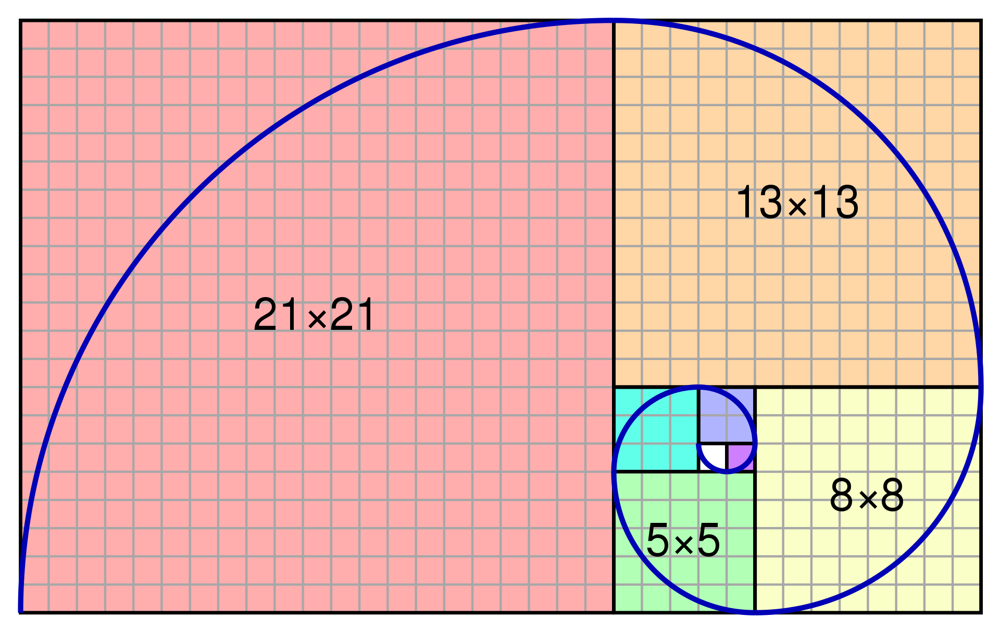
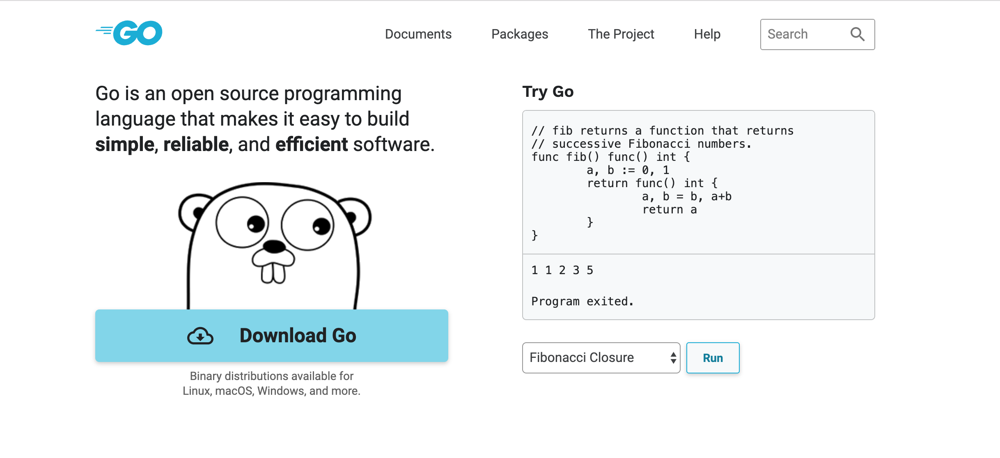

# 裴波那契数列

> **裴波那契数列**是形如 `1 1 2 3 5 8 13 21 34 55` 的**递增**数列,即从第三个数开始,后一个数字是**前两个数字之和**,保持此规律无限递增...



开门见山,直接给出**斐波那契数列生成器**,接下来的文章慢慢深挖背后隐藏的奥秘,一个例子讲清楚什么是闭包.

> 如果还不了解 `Go` 语言的函数用法,可以参考上一篇文章: [go 学习笔记之学习函数式编程前不要忘了函数基础](https://mp.weixin.qq.com/s/dprkCOvPZHr6fi_qC91dVw)

- `Go` 版本的斐波那契数列生成器

```go
// 1 1 2 3 5 8 13 21 34 55
//     a b
//       a b
func fibonacci() func() int {
  a, b := 0, 1
  return func() int {
    a, b = b, a+b
    return a
  }
}
```

> `Go` 语言支持**连续赋值**,更加贴合思考方式,而其余主流的编程语言可能**不支持**这种方式,大多采用**临时变量**暂存的方式.

- `Go` 版本的单元测试用例

```go
// 1 1 2 3 5 8 13 21 34 55
func TestFibonacci(t *testing.T) {
  f := fibonacci()
  for i := 0; i < 10; i++ {
    fmt.Print(f(), " ")
  }
  fmt.Println()
}
```

> 循环调用 `10` 次**斐波那契数列生成器**,因此生成**前十位**数列: `1 1 2 3 5 8 13 21 34 55`

## 背后有故事

小小的**斐波那契数列生成器**背后蕴藏着丰富的 `Go` **语言特性**,该示例也是**官方示例**之一.



- 支持**连续赋值**,无需中间变量

> `Go` 语言和其他主流的编程语言不同,它们大多数最多支持多变量的**连续声明**而不支持**连续赋值**.

这也是 `Go` 语言特有的交换变量方式,`a, b = b, a` 语义简单明确并不用引入额外的临时变量.

```go
func TestExchange(t *testing.T) {
  a, b := 1, 2
  t.Log(a,b)

  // 2,1
  a, b = b, a
  t.Log(a,b)
}
```

> `Go` 语言实现变量交互的示例,`a, b = b, a` 表示变量直接交换.

而其他主流的编程语言的惯用做法是需要引入临时变量,大多数代码类似如下方式:

```go
func TestExchange(t *testing.T) {
  a, b := 1, 2
  t.Log(a,b)

  // 2,1
  temp := a
  a = b
  b = temp
  t.Log(a,b)
}
```

> 「雪之梦技术驿站」注: `Go` 语言的**多变量同时赋值**特性体现的更多是一种**声明式编程**思想,不关注具体实现,而引入临时变量这种体现的则是**命令式编程**思维.

- 函数的**返回值也可以是函数**

> `Go` 语言中的函数是**一等公民**,不仅函数的返回值可以是**函数,参数,变量**等等都可以是函数.

函数的**返回值可以是函数**,这样的实际意义在于**使用者**可以拥有更大的灵活性,有时可以用作**延迟计算**,有时也可以用作**函数增强**.

先来演示一下**延迟计算**的示例:

函数的返回值可以是函数,由此实现类似于 `i++` 效果的**自增函数**.因为 `i` 的初值是 `0`,所以每调用一次该函数, `i` 的值就会自增,从而实现 `i++` 的效果.

```go
func autoIncrease() func() int {
  i := 0
  return func() int {
    i = i + 1
    return i
  }
}
```

再小的代码片段也不应该忘记测试,单元测试继续走起,顺便看一下使用方法.

```go
func TestAutoIncrease(t *testing.T) {
  a := autoIncrease()

  // 1 2 3
  t.Log(a(),a(),a())
}
```

初始调用 `autoIncrease` 函数并没有直接得到结果而是**返回了函数引用**,等到使用者觉得**时机成熟**后再次调用返回的函数引用即变量`a` ,这时候才会真正计算结果,这种方式被称为**延迟计算也叫做惰性求值**.

继续演示一下**功能增强**的示例:

因为要演示函数增强功能,没有输入哪来的输出?

所以函数的入参应该也是函数,返回值就是增强后的函数.

这样的话接下来要做的函数就比较清晰了,这里我们定义 `timeSpend` 函数: 实现的功能是**包装特定类型的函数**,增加**计算函数运行时间**的新功能并包装成函数,最后**返回**出去给使用者.

```go
func timeSpend(fn func()) func() {
  return func()  {
    start := time.Now()

    fn()

    fmt.Println("time spend : ", time.Since(start).Seconds())
  }
}
```

为了演示包装函数 `timeSpend`,需要定义一个比较**耗时函数当做入参**,函数名称姑且称之为为 `slowFunc` ,睡眠 `1s` 来**模拟耗时**操作.

```go
func slowFunc() {
  time.Sleep(time.Second * 1)

  fmt.Println("I am slowFunc")
}
```

**无测试不编码**,继续运行单元测试用例,演示包装函数 `timeSpend` 是如何增强原函数 `slowFunc` 以实现功能增强?

```go
func TestSlowFuncTimeSpend(t *testing.T) {
  slowFuncTimeSpend := timeSpend(slowFunc)

  // I am slowFunc
  // time spend :  1.002530902
  slowFuncTimeSpend()
}
```

> 测试结果显示原函数 `slowFunc` 被当做入参传递给包装函数 `timeSpend` 后实现了功能增强,不仅保留了原函数功能还增加了计时功能.

- 函数嵌套可能是闭包函数

不论是引言部分的**斐波那契数列生成器**函数还是演示函数返回值的**自增函数**示例,其实这种形式的函数有一种专业术语称为"闭包".

一般而言,函数内部不仅**存在变量还有嵌套函数**,而嵌套函数又引用了这些外部变量的话,那么这种形式**很有可能**就是**闭包函数**.

## 什么是闭包

如果有一句话介绍什么是闭包,那么我更愿意称其为**流浪在外的人想念爸爸妈妈**!


如果非要用比较官方的定义去**解释什么是闭**包,那只好翻开[维基百科](https://en.wikipedia.org/wiki/Closure_%28computer_programming%29) 看下有关闭包的定义: 

> In programming languages, a closure, also lexical closure or function closure, is a technique for implementing lexically scoped name binding in a language with first-class functions. Operationally, a closure is a record storing a function[a] together with an environment.[1] The environment is a mapping associating each free variable of the function (variables that are used locally, but defined in an enclosing scope) with the value or reference to which the name was bound when the closure was created.[b] Unlike a plain function, a closure allows the function to access those captured variables through the closure's copies of their values or references, even when the function is invoked outside their scope.

如果能够**直接理解英文**的同学可以略过这部分的中文翻译,要是不愿意费脑理解英文的小伙伴跟我一起**解读中文**吧!

### 闭包是一种技术

第一句话的原版英文如下:

> In programming languages, a **closure**, also **lexical closure** or **function closure**, is a **technique** for implementing lexically scoped **name binding** in a language with **first-class functions**.

中文翻译如下:

> **闭包**也叫做**词法闭包**或者**函数闭包**,是**函数优先**编程语言中用于实现词法范围的**名称绑定**技术.

概念性定义解释后可能还是不太清楚,那么就用代码解释一下什么是闭包?

> 编程语言千万种,前端后端和中台;心有余而力不足,大众化 `Js` 带上 `Go` .

- `Js` 实现斐波那契数列生成器

仿照 `Go` 语言的实现方式写一个 `Js` 版本的斐波那契数列生成器,代码如下:

```js
function fibonacci() {
  var a, b;
  a = 0;
  b = 1;
  return function() {
    var temp = a;
    a = b;
    b = temp + b;
    return a;
  }
}
```

同样的,仿造测试代码写出 `Js` 版本的测试用例:

```js
// 1 1 2 3 5 8 13 21 34 55
function TestFibonacci() {
  var f = fibonacci();
  for(var i = 0; i < 10; i++ ){
    console.log(f() +" ");
  }
  console.log();
}
```

- `Go` 实现斐波那契数列生成器

开篇引言的示例,照搬过来,逻辑很简单,细节稍后再说.

```go
func fibonacci() func() int {
  a, b := 0, 1
  return func() int {
    a, b = b, a+b
    return a
  }
}
```

单元测试用例函数,连续 `10` 次调用生成器,依次输出斐波那契数列中的前十位.

```go
// 1 1 2 3 5 8 13 21 34 55
func TestFibonacci(t *testing.T) {
  f := fibonacci()
  for i := 0; i < 10; i++ {
    fmt.Print(f(), " ")
  }
  fmt.Println()
}
```

不仅仅是 `Js` 和 `Go` 这两种编程语言能够实现闭包,实际上很多编程语言都能实现闭包,就想是面向对象编程一样,也不是某种语言专有的技术,唯一的区别可能就是语法细节上略有不同吧,所以记住了: **闭包是一种技术**!

### 闭包存储了环境

> Operationally, a closure is a **record** storing a **function**[a] together with an **environment**.

> 在操作上,闭包是将**函数[a]与环境**一起存储的**记录**。

闭包是一种技术,存储了闭包所需要的环境,而环境分为函数运行时所处的内部环境和依赖的外部环境,闭包被使用者调用时不会像普通函数那样丢失环境而是存储了环境.

如果是普通函数方式打开上述示例的斐波那契数列生成器:

```go
func fibonacciWithoutClosure() int {
  a, b := 0, 1
  a, b = b, a+b
  return a
}
```

可想而知,这样肯定是不行的,因为函数内部环境是无法维持的,使用者每次调用 `fibonacciWithoutClosure` 函数都会重新初始化变量 `a,b` 的值,无法实现累加自增效果.

```go
// 1 1 1 1 1 1 1 1 1 1 
func TestFibonacciWithoutClosure(t *testing.T) {
  for i := 0; i < 10; i++ {
    fmt.Print(fibonacciWithoutClosure(), " ")
  }
  fmt.Println()
}
```

很显然,函数内部定义的变量每次运行函数时都会重新初始化,为了避免这种情况,在不改变整体实现思路的前提下,只需要提升变量的作用范围就能再次实现生成器函数:

```go
var a, b = 0, 1
func fibonacciWithoutClosure() int {
  a, b = b, a+b
  return a
}
```

此时再次运行 `10` 次生成器函数,如我们所愿生成前10 位斐波那契数列.

```go
// 1 1 2 3 5 8 13 21 34 55
func TestFibonacciWithoutClosure(t *testing.T) {
  for i := 0; i < 10; i++ {
    fmt.Print(fibonacciWithoutClosure(), " ")
  }
  fmt.Println()
}
```

所以说普通函数 `fibonacciWithoutClosure` 的运行环境要么是仅仅依赖内部变量维持的独立环境,每次运行都会重新初始化,无法实现变量的重复利用;要么是依赖了外部变量维持的具有记忆功能的环境,解决了重新初始化问题的同时引入了新的问题,那就是必须定义作用范围更大的外部环境,增加了维护成本.

既然函数内的变量无法维持而函数外的变量又需要管理,如果能两者结合的话,岂不是皆大欢喜,扬长补短?

对的,闭包基本上就是这种实现思路!

```go
func fibonacci() func() int {
  a, b := 0, 1
  return func() int {
    a, b = b, a+b
    return a
  }
}
```

斐波那契数列生成器函数 `fibonacci` 的返回值是匿名函数,而匿名函数的返回值是斐波那契数,不考虑函数内部实现细节的情况下,整个函数的语义是十分明确的,使用者初始化调用 `fibonacci` 函数时得到返回值变量暂存起来,需要生成斐波那契数字的时候再调用刚才暂存的变量就能真正生成斐波那契数列.

```go
// 1 1 2 3 5 8 13 21 34 55
func TestFibonacci(t *testing.T) {
  f := fibonacci()
  for i := 0; i < 10; i++ {
    fmt.Print(f(), " ")
  }
  fmt.Println()
}
```

现在我们再好好比较一下这种形式实现的闭包和普通函数的区别?

- 闭包函数 `fibonacci` 的内部定义了变量 `a,b`,最终返回的匿名函数中直接使用了变量 `a,b`.
- 普通函数 `fibonacciWithoutClosure` 的外部定义了变量 `a,b`,调用该函数直接生成斐波那契数字.
- 闭包函数是延迟计算也就是惰性求值而普通函数是立即计算,两者的调用方式不一样.

但是如果把视角切换到真正有价值部分,你会发现闭包函数不过是普通函数的嵌套而已!

```go
func fibonacciDeduction() func() int {
  a, b := 0, 1

  func fibonacciGenerator() int {
    a, b = b, a+b
    return a
  }

  return fibonacciGenerator
}
```

只不过 `Go` 并不支持函数嵌套,只能使用匿名函数来实现函数嵌套的效果,但是某些语言是支持函数嵌套的,比如最常用的 `Js` 语言:

```js
function fibonacciDeduction() {
  var a, b;
  a = 0;
  b = 1;

  function fibonacciGenerator() {
    var temp = a;
    a = b;
    b = temp + b;
    return a
  }

  return fibonacciGenerator
}

func fibonacciDeduction() func() int {
  a, b := 0, 1

  func fibonacciGenerator() int {
    a, b = b, a+b
    return a
  }

  return fibonacciGenerator
}
```


## 怎么理解闭包


## 为什么要闭包

## 闭包的优缺点

## 回顾斐波那契数列

## 真的掌握闭包了吗

```go
func count() []int {
  var arr []int
  for i := 1; i <= 3; i++ {
    arr = append(arr, i)
  }
  return arr
}

func TestCount(t *testing.T) {
  // 1 2 3
  for _, c := range count() {
    t.Log(c)
  }
}

func countByClosureButWrong() []func() int {
  var arr []func() int
  for i := 1; i <= 3; i++ {
    arr = append(arr, func() int {
      return i
    })
  }
  return arr
}

func TestCountByClosure(t *testing.T) {
  // 4 4 4 
  for _, c := range countByClosureButWrong() {
    t.Log(c())
  }
}

func countByClosureWithOk() []func() int {
  var arr []func() int
  for i := 1; i <= 3; i++ {
    func(n int) {
      arr = append(arr, func() int {
        return n
      })
    }(i)
  }
  return arr
}

func TestCountByClosureWithOk(t *testing.T) {
  // 1 2 3
  for _, c := range countByClosureWithOk() {
    t.Log(c())
  }
}
```

## `Go` 闭包归纳总结

## 相关资料引用参考

- [廖雪峰: `js` 的闭包教程](https://www.liaoxuefeng.com/wiki/1022910821149312/1023021250770016)
- [知乎: 什么是闭包](https://www.zhihu.com/question/34210214)
- [三点水博客: 再谈闭包](https://lotabout.me/2016/thoughts-of-closure/)