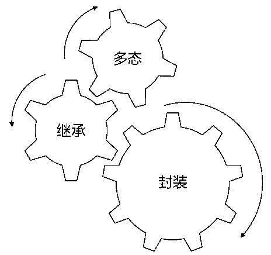
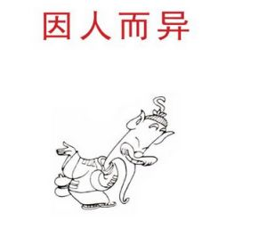

# 能否继承

熟悉面向对象的小伙伴们可能会知道封装,继承和多态是最主要的特性,为什么前辈们会如此看重这三种特性,真的那么重要吗?



## 什么是封装

什么是封装,封装有什么好处以及怎么实现封装?

相信大多数小伙伴们都有自己的理解,简而言之,言而简之,封装是屏蔽内部实现细节,仅仅对外暴露出有价值接口.


正如平时工作中使用的电脑一样,我们并不关心电脑的内部组成,只要会开机关机等基本操作就能正常使用电脑,即便坏了的话,也是送去专业维修店进行修理,作为使用者来说,我们从始至终并不关心电脑的工作原理以及它如何工作,唯一在乎的就是怎么能够上网.


之所以我们能如何方便地使用电脑进行网上冲浪,完全得益于电脑设计者对普通用户屏蔽了无关细节,只暴露有价值的操作方法,这种实现方式就是封装.

回到编程语言上,`Go` 语言作为一种通用的编程语言,和其他主流的编程语言一样支持封装,`Go` 语言关于封装的实现主要包括两部分:

- 数据结构的封装
- 行为方法的控制

其中数据结构的封装主要是使用结构体关键字 `struct` 实现,而行为方法的控制是用首字母大小写区分是否对外可见.

> 关于 `Go` 如何实现封装的细节,可以参考前一篇文章: [go 学习笔记之详细说一说封装是怎么回事](https://mp.weixin.qq.com/s/fXIKWsPqi6m2IEV--8lBsg)

## 继承是怎么回事

说完封装,接着说一下继承是怎么回事?

继承正是在封装的基础上逐步发展产生的概念,我们知道封装是对某一类行为事物模型的抽象,而这种抽象恰恰是由人定义实现的,因人而异也就导致了封装并没有统一的标准答案.



于是乎就可能存在着这么一种情况,对于生活中常见的猫和狗,两个人分别有两种封装方式:

A: 猫是一种宠物,淘气可爱会卖萌,看家本领抓老鼠,偶尔还会喵喵喵.


B: 狗是一种宠物,忠实听话能看家,嗅觉灵敏会破案,一言不合汪汪汪.


C: 我想要买一个宠物,文能卖萌,武可退敌,明个一早给我送来吧!


由于客户C并没有特别说明要的是猫还是狗,A以为是猫,因为猫安静的时候很萌很可爱,生气的时候用小爪爪挠你!
B以为是狗,汪星人的名气可不是自吹自擂,真的要惹怒了它,咬住不放能生生撕下一块肉,你说这种武力值强不强大?

于是第二天,客户C懵逼了,怎么一下子送来了猫狗两个宠物啊,可是又不能食言,因为A和B说的都有道理啊!


等 A和 B走了后,C望着送来的猫和狗,不禁陷入了深思:我只是想要一个宠物而已,非要给我猫和狗两个选择,我有选择困难症啊!


说完这个故事,刚开始会觉得有些滑稽,C只要随便选择一种宠物不就好了吗,干嘛非要全盘接收弄得自己不开心呢?

不知道正在看的读者有没有选择困难症的经历,面对多种选择,一时不知道到底选择哪一个,最终结果可能有三种情况:全盘肯定,全盘否定和部分肯定.

上述故事中,C选择的是全盘肯定,A和B送来的猫和狗都是宠物,没理由拒绝任何一个,于是C选择全盘肯定,当然至于以后是否后悔只有 C自己心里清楚.

前车之鉴可以为师矣,如果下次我们也遇到这种情况应该如何选择呢?

相信聪明的你心中已经有了自己的答案,大声的说出来吧!我就要喵喵喵!


上述案例就好比同事间一起去吃饭,点餐时问你点些什么?你说随便!

原本是好意,以为能自己这么说能方便其他人,其实这种看似不挑剔的做法,对他人来说可能也是最难办的事情.

因为随便的范围太宽泛了,什么都可以也就意味着很大可能上并不会令你满意,你在方便别人的同时,他人也在想法设法取悦于你,不知道你的喜好,心里就犯嘀咕了,这个他喜不喜欢吃呢?

所以,请不要再说随便,勇敢亮出你的观点态度,哪怕不被认可满足.

故事中 A觉得猫是宠物,B觉得狗是宠物,因而当客户真的要宠物时,A和 B都把各自的宠物送上去了,因此问题出现在宠物的定义上,到底什么算是宠物?

其实C心中已经有了宠物的定义,那就是"文能卖萌,武可退敌",而猫和狗恰好都具备这种特性,因此对外宣传时就不要再说这种默认的属性,应该亮出自己的特色!

A: 猫会抓老鼠
B: 狗能认清路

C: 我要一种宠物,出现意外时能帮助到我的话,那就再好不过了!

如果一开始他们就这样说的话,C真正需要的宠物到底是猫还是狗就一目了然了,也不会陷入选择困难症了!

## 如何实现继承

回到封装的话题上来,转换成编程语言就是A把猫封装成宠物了,B把狗封装成宠物了,而 C需要宠物时,猫和狗都是宠物,最终结果要么是程序依旧正常运行,要么是程序意外挂掉了,因为很可能某一种宠物可能并不符合特定需求.

这种重复定义问题归咎于封装的标准不同,猫和狗两者的封装过程是独立进行的,并没有在一起商量着看看能不能继续抽象出通用模型,混乱的封装导致了猫是宠物,狗也是宠物.

这种多种相关概念的封装很容易出现此类问题,所以适当进行统一分析继续抽象出更高层次的封装概念尤为重要,基于此,原来的封装就能从这种通用概念中解放出来,仅仅保留自己的特色就好,大大简化了模型的语义.

普通封装的概念和更高层次的抽象封装概念的关系就是面向对象中的继承,即猫继承于宠物,表示猫不但拥有宠物的特点还有猫自己的亮点.

对于狗也是一样,狗是宠物,狗也是狗自己本身,体现了自己的特点.

`Go` 语言和其他主流的面向对象语言有所不同,`Go` 并不支持继承特性,因而也没有单继承,多继承,重写方法等复杂概念.

那 `Go` 是如何描述这种普通封装和抽象封装之间的关系呢?

肯定不是把猫定义成宠物,狗也定义成宠物那种方式!

`Go` 实现继承的语义不是通过 `extends` 关键字而是通过结构体组合的方式,请看相关代码.

-   宠物就应该能文能武,这里不关心结构体的字段,因而并没有定义相关字段.

```go
type Pet struct {
}

func (p *Pet) Skill() {
    fmt.Println("能文能武的宠物")
}
```

-   猫是能够抓老鼠的宠物,`Go` 采用组合的方式表达继承的语义.

```go
type Cat struct {
    p *Pet
}

func (c *Cat) Catch() {
    fmt.Println("老鼠天敌喵喵喵")
}
```

-   狗是自带导航功能的宠物,看我导盲犬的超能力!

```go

type Dog struct {
    p *Pet
}

func (d *Dog) Navigate() {
    fmt.Println("自带导航汪汪汪")
}
```

接下来,C开始检验猫和狗作为宠物是否具备能文能武的基本要求,与此同时有没有自身的特色?

```go
func TestExtendInstance(t *testing.T) {
    p := new(Pet)

    d := new(Dog)
    d.p = p

    // 自带导航汪汪汪
    d.Navigate()
    // 能文能武的宠物
    d.p.Skill()

    fmt.Println()

    c := new(Cat)
    c.p = p

    // 老鼠天敌喵喵喵
    c.Catch()
    // 能文能武的宠物
    c.p.Skill()
}
```

