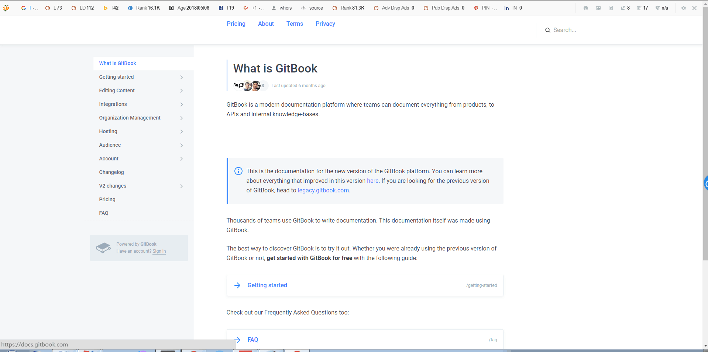

# gitbook 入门教程

`gitBook` 是一个基于`node.js`的命令行工具,使用 `github/git` 和 `markdown/asciiDoc` 构建精美的电子书.

`gitbook` 支持输出静态网页和电子书等多种格式,其中默认输出静态网页格式.

`gitbook` 不仅支持本地构建电子书,而且可以托管在 `gitbook` 官网上,并享受在线发布和托管图书的便利,完整的文档请参考 [gitbook 新版文档(需FQ)][docs.gitbook.com] 或 ~~[gitbook 旧版文档(不需FQ)][toolchain.gitbook.com]~~

> 目前 `gitbook` 旧版文档已经不可访问,特提供[压箱底存货][gitbook-official]邀君共享

## 适用场景

不仅适用于**软件说明文档**的发布更新,同样适用于**文本文档**的连载更新.

既适合具有一定编程经验的**软件开发从业者**,也适用于**不满足传统书写**方式的文学创作者.

简而言之,`gitbook` 可以**条理清晰**地整理出零碎知识,打造专属你自己的**电子书**,漂亮的主题,丰富的插件让你的知识变得从此与众不同!

`git + markdown = gitbook`,其中 `git` 可以管理书籍内容的变更,并将其托管到云端实现团队协作,而 `markdown` 简洁的语法特点,使得我们不必关心布局排版问题,专注创作,重拾写作乐趣!

> 如果你还不了解 `git` 和 `markdown` 相关知识,赶紧去学习 [markdown 快速入门](https://snowdreams1006.github.io/markdown/) 和 [git 入门教程](https://snowdreams1006.github.io/git/) 吧!

## 先睹为快

### gitbook 教程

### gitbook 官网

### gitbook 文档

## 参考文档

- [gitbook 官网(新)][www.gitbook.com]
- [gitbook 官网(旧)][legacy.gitbook.com]
- [gitbook 文档(新)][docs.gitbook.com]
- ~~[gitbook 文档(旧)][toolchain.gitbook.com]~~
- [gitbook 文档(存货)][gitbook-official]
- [git 官网][git-scm.com]
- [github 官网][github.com]

>`gitbook` 新版需要FQ,~~旧版不需要FQ~~,旧版暂不可用,可访问[压箱底存货][gitbook-official]. 

<!-- 链接引用 -->
[www.gitbook.com]: https://www.gitbook.com/ "https://www.gitbook.com/"
[legacy.gitbook.com]: https://legacy.gitbook.com/ "https://legacy.gitbook.com/"
[docs.gitbook.com]: https://docs.gitbook.com/ "https://docs.gitbook.com/"
[toolchain.gitbook.com]: https://toolchain.gitbook.com/ "https://toolchain.gitbook.com/"
[gitbook-official]: https://snowdreams1006.github.io/gitbook-official/
[git-scm.com]: https://git-scm.com/ "https://git-scm.com/"
[github.com]: https://github.com/ "https://github.com/"
