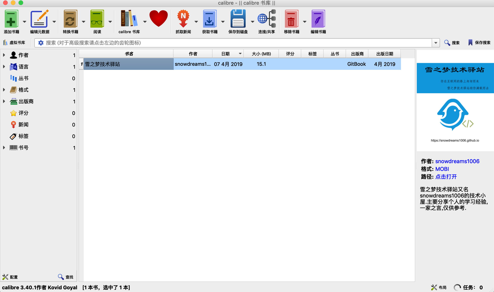

# 导出电子书

`gitbook` 既可以将源码文件单独输出,也可以仅输出单个文件,常见的导出电子书格式主要有三种(`ePub`, `Mobi`, `PDF`),而这三种格式都依赖于系统本身提供的 `ebook-convert` 工具.


## 基本命令

> 语法格式: gitbook pdf 或 gitbook epub 或 gitbook mobi

示例:

```
# 生成 `pdf` 文件并输出 `debug` 级别日志
$ gitbook pdf ./ ./myBook.pdf --log=debug

# 生成 `epub` 文件并输出 `debug` 级别日志
$ gitbook epub ./ ./myBook.epub --log=debug

# 生成 `mobi` 文件并输出 `debug` 级别日志
$ gitbook mobi ./ ./myBook.mobi --log=debug
```

> 相信大家对 `PDF` 格式比较熟悉,其余两种格式是不同电子书格式,需要相应软件支持.

### 生成 PDF 文件

示例:
 
```
$ gitbook pdf
```

默认在当前项目的根目录下生成 `book.pdf` 文件名,如果配有封面,则首页显示封面,否则无封面.


### 生成 ePub 文件

示例:

```
$ gitbook epub
```

默认在当前项目的根目录下生成 `book.epub` 文件名,如果配有封面,则首页显示封面,否则无封面.


### 生成 mobi 文件

示例:

```
$ gitbook mobi
```

默认在当前项目的根目录下生成 `book.mobi` 文件名,如果配有封面,则首页显示封面,否则无封面.



### 安装依赖

如果直接运行 `gitbook pdf` 相关命令,可能会报错,提示需要安装 `ebook-convert` 插件,根据提示本地需要安装相应的软件环境,这样 `gitbook` 才能导出电子书.


#### linux 系统

[下载地址](https://calibre-ebook.com/download_linux): https://calibre-ebook.com/download_linux

- 下载应用

```
$ sudo -v && wget -nv -O- https://download.calibre-ebook.com/linux-installer.sh | sudo sh /dev/stdin
```

- 配置软链接

```
$ sudo ln -s /usr/bin/nodejs /usr/bin/node
```

#### mac 系统

[下载地址](https://calibre-ebook.com/download_osx): https://calibre-ebook.com/download_osx

- 下载应用

将 `calibre.app` 移动到应用程序文件,然后尝试是否能正常打开应用.

- 配置软链接

```
$ sudo ln -s ~/Applications/calibre.app/Contents/MacOS/ebook-convert /usr/bin
```

- 测试命令

```
$ ebook-convert --version
```

### 配置封面

所有格式的电子书都可以配置自定义封面,在项目的根目录下提供 `cover.jpg` 和 `cover_small.jpg ` 两种封面图片时,生成电子书会自动增加封面页.

当然你也可以使用 [autocover 插件](https://plugins.gitbook.com/plugin/autocover) 自动生成封面,不过本人才疏学浅,几经尝试始终没有成功,如果有人成功了记得给我留言下哈!

封面的基本要求:

- `cover.jpg` 尺寸大小: `1800X2360` px,`cover_small.jpg` 尺寸大小: `200x262` px;
- 无边界
- 清晰可见的书名
- 任何重要的文字在小版本封面图片中也要清晰可见

> 更多封面相关规范请参考 [https://toolchain.gitbook.com/ebook.html](https://toolchain.gitbook.com/ebook.html)

## 小结


