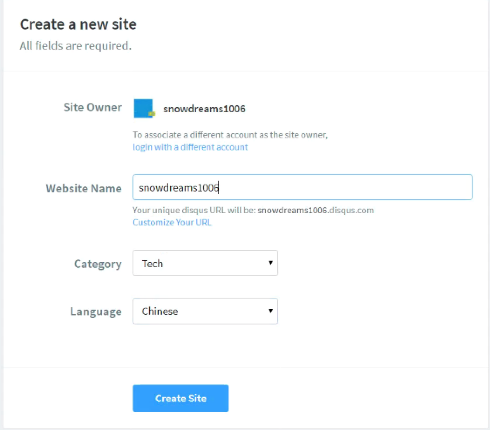
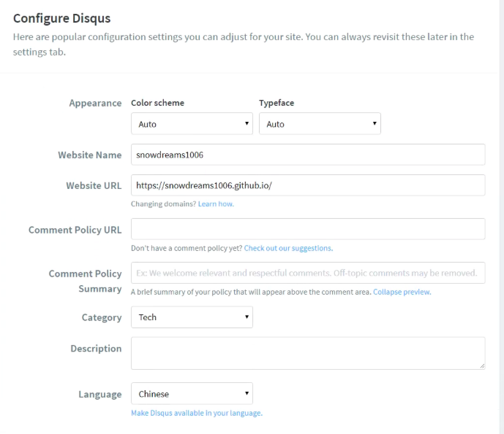
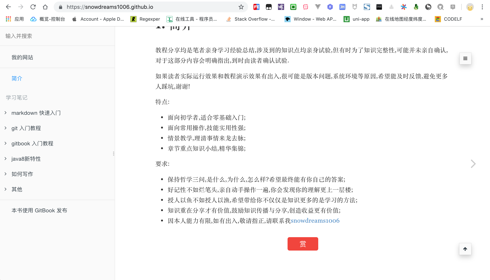
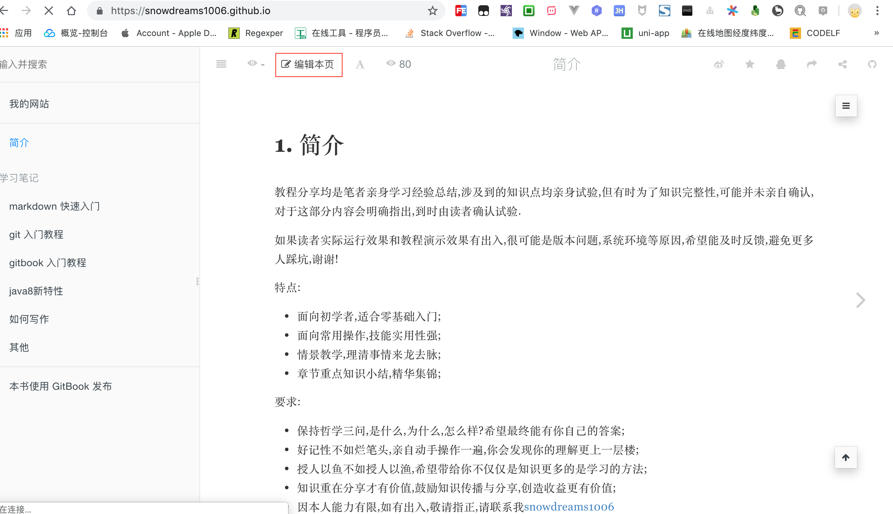
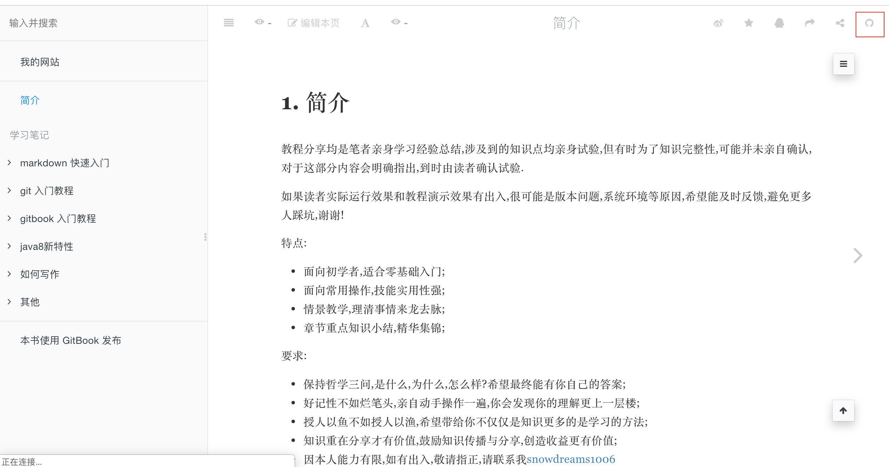

# 实用插件

## `disqus` 评论插件

[discus](https://disqus.com/) 是一款集成**评论**的插件,可以为静态网站添加动态评论,让你的网站动起来!


> 遗憾的是,`discus` 插件只有 FQ 才能正常使用,暂时没找到其他较好的替代方案.

### 注册 `disqus.com` 账号

`gitbook` 集成 `disqus` 插件中最重要的配置项就是注册 `disqus.com` 网站唯一标识.


#### 注册并绑定域名

如果没有注册账号请先注册,否则直接登录,当然也支持第三方账号登录(我使用的是谷歌账号).


> 人机验证时,选出符合条件的全部图形,直到没有新的图形为止,这一点和国内的静态图片验证是不同的!

选择安装 `disqus` 插件(`I want to install Disqus on my site `),接下来会绑定集成网站的域名.


接下来设置网站的相关信息,其中**网站名称**(`snodreams1006`)是唯一标示,接下来集成到 `gitbook` 用的就是这个简短名称,而分类和语言按照实际情况选择即可.



#### 选择服务类型

`disqus` 网站提供的服务类型,有基础班(`basic`),加强版(`plus`),专业版(`pro`)和免费版(`free`).

每个版本计划有不同的收费标准以及相应的服务,可以根据实际情况选择适合自己的服务类型.


接下来以免费版为例进行有关演示


#### 安装并配置 `disqus` 到网站

估计是这些网站提供了默认的集成方式,这里并没看到 `gitbook` 相关的网站,因此选择最后一个自定义网站.


填写网站的基本信息,其中网站缩写名称仍然是 `snowdreams1006`,网址填写 `https://snowdreams1006.github.io/` ,至于其他信息根据实际情况填写即可.



至此 `disqus.com` 网站配置完成,接下来我们配置 `gitbook` 集成 `disqus` 插件.
 


### 安装并配置 `disqus` 插件

上一步我们已经获取到唯一的标识: `snowdreams1006` ,接下来可以继续配置 `disqus`  插件了.

[链接地址](https://plugins.gitbook.com/plugin/disqus): https://plugins.gitbook.com/plugin/disqus 

#### 激活插件配置

在 `book.json` 中配置 `disqus` 插件,根据实际情况修改成自己的缩写名称(`shortName`).

示例:

```
{
    "plugins": ["disqus"],
    "pluginsConfig": {
        "disqus": {
            "shortName": "snowdreams1006"
        }
    }
}
```

#### 安装 `disqus` 插件

示例:

```
$ gitbook install
```

#### 测试 `disqus` 插件

示例:

```
$ gitbook serve
```

正常情况下(FQ),`disqus` 插件已经成功集成到 `gitbook` 网站了,因此推送到实际服务器上时看到的效果是这样的.


如果你不具备条件(FQ),那么你看到的仍然是这样的.



## `edit-link` 编辑链接插件

如果希望将网页源码暴露出去并接受公众的监督校准的话,使用[edit-link插件](https://plugins.gitbook.com/plugin/edit-link)可以直接链接到源码文件.

[链接地址](https://plugins.gitbook.com/plugin/edit-link): https://plugins.gitbook.com/plugin/edit-link


### 激活插件配置

在 `book.json` 中配置 `edit-link` 插件,详细说明请参考 [edit-link 插件](https://plugins.gitbook.com/plugin/edit-link).

示例:

```
{
    "plugins": ["edit-link"],
    "pluginsConfig": {
        "edit-link": {
          "base": "https://github.com/snowdreams1006/snowdreams1006.github.io/blob/master",
          "label": "编辑本页"
        }
    }
}
```

### 安装 `edit-link` 插件

示例:

```
$ gitbook install
```

### 测试 `edit-link` 插件

如果不能正常跳转到源码文件,多次试验后重新更改 `edit-link.base` 节点内容,重新 `gitbook serve` 即可正常跳转源码文件.

示例:

```
$ gitbook serve
```



## `github` 插件

添加 `github` 图标链接,方便直接跳转到 `github` 指定仓库.

[链接地址](https://plugins.gitbook.com/plugin/github): https://plugins.gitbook.com/plugin/github



### 激活插件配置

在 `book.json` 中配置 `github` 插件,详细说明请参考 [github 插件](https://plugins.gitbook.com/plugin/github).

示例:

```
{
    "plugins": ["github"],
    "pluginsConfig": {
        "github": {
          "url": "https://github.com/snowdreams1006/snowdreams1006.github.io"
        }
    }
}
```

### 安装 `github` 插件

示例:

```
$ gitbook install
```

### 测试 `github` 插件

示例:

```
$ gitbook serve
```


 