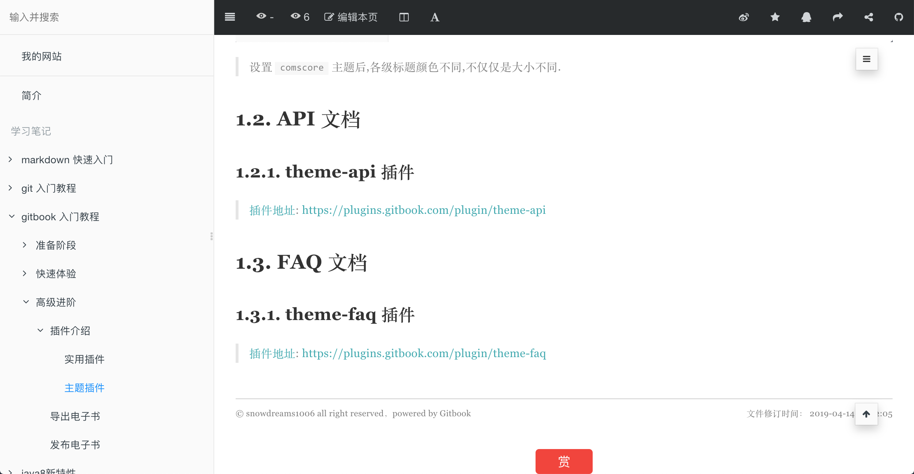

# 主题插件

目前 `gitbook` 提供三类文档: `Book` 文档,`API` 文档和 `FAQ` 文档.

其中,默认的也是最常使用的就是 `Book` 文档,如果想要了解其他两种文档模式,需要引入相应的主题插件.

> [官方主题插件文档](https://toolchain.gitbook.com/themes/): https://toolchain.gitbook.com/themes/

## Book 文档

### theme-default 主题

> [插件地址](https://plugins.gitbook.com/plugin/theme-default): https://plugins.gitbook.com/plugin/theme-default

`theme-default` 是 `3.0.0` 引入的默认主题,大多数插件针对的都是默认主题,如果切换到其他主题或者自定义主题,可能会造成某些情况下不兼容,甚至报错.

默认情况下,左侧菜单不显示层级属性,如果将 `showLevel` 属性设置为 `true` 可以显示层级数字.

示例:

```json
"pluginsConfig": {
    "theme-default": {
        "showLevel": true
    }
}
```

效果:


> 默认情况下左侧菜单树不显示目录层级


> 开启层级显示设置后,左侧菜单树显示当前目录层级

### theme-comscore 主题

> [插件地址](https://plugins.gitbook.com/plugin/theme-comscore): https://plugins.gitbook.com/plugin/theme-comscore

`default` 默认主题是黑白的,而 `comscore` 主题是彩色的,即标题和正文颜色有所区分.

示例:

```json
"plugins": [
   "theme-comscore"
]
```

效果:


> 默认情况下各级标题颜色均是黑色,不同级别的标题仅仅是大小区别.


> 设置 `comscore` 主题后,各级标题颜色不同,不仅仅是大小不同.

## API 文档

### theme-api 插件

> [插件地址](https://plugins.gitbook.com/plugin/theme-api): https://plugins.gitbook.com/plugin/theme-api

如果文档本身是普普通文档模式,切换成 `api` 文档模式后并不会有太大变化,除非一开始就是接口文档,那样使用 `theme-api` 插件才能看出效果.

示例:

```json
{
    "plugins": ["theme-api"],
    "pluginsConfig": {
        "theme-api": {
            "theme": "dark"
        }
    }
}
```

语法:

- 方法区

```

    方法区: 接口说明

```

- 语法区

```



```

示例:

```

## Simple method


This text will only appear for JavaScript.


This text will only appear for Go.


This will appear for both JavaScript and Go.

```

效果:



> 如果仅仅从普通文章模式切换到 `api` 文档模式,并没有太大变换.


> 添加 `api` 相关方法后的文档效果,正常会两列显示并在右上角增加语言切换工具.

## FAQ 文档

### theme-faq 插件

> [插件地址](https://plugins.gitbook.com/plugin/theme-faq): https://plugins.gitbook.com/plugin/theme-faq
