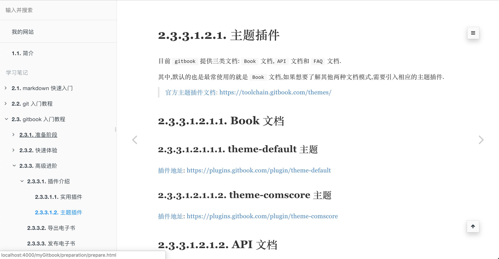
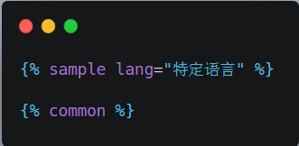
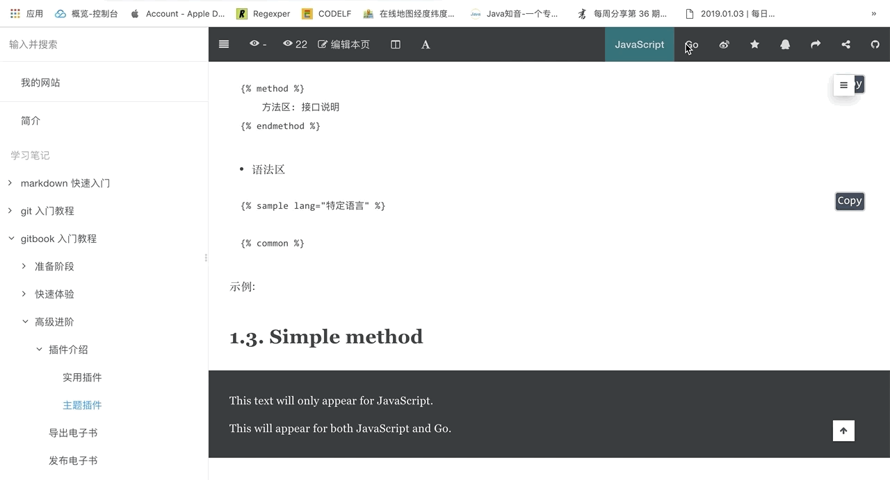
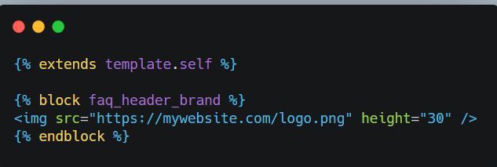
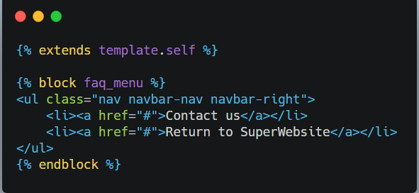

# 主题插件

<!-- toc -->

目前 `gitbook` 提供三类文档: `Book` 文档,`API` 文档和 `FAQ` 文档.

其中,默认的也是最常使用的就是 `Book` 文档,如果想要了解其他两种文档模式,需要引入相应的主题插件.

> [官方主题插件文档](https://toolchain.gitbook.com/themes/): https://toolchain.gitbook.com/themes/

## Book 文档

### theme-default 主题

> [插件地址](https://plugins.gitbook.com/plugin/theme-default): https://plugins.gitbook.com/plugin/theme-default

`theme-default` 是 `3.0.0` 引入的默认主题,大多数插件针对的都是默认主题,如果切换到其他主题或者自定义主题,可能会造成某些情况下不兼容,甚至报错.

默认情况下,左侧菜单不显示层级属性,如果将 `showLevel` 属性设置为 `true` 可以显示层级数字.

示例:

```json
"pluginsConfig": {
    "theme-default": {
        "showLevel": true
    }
}
```

效果:


> 默认情况下左侧菜单树不显示目录层级



> 开启层级显示设置后,左侧菜单树显示当前目录层级

### theme-comscore 主题

> [插件地址](https://plugins.gitbook.com/plugin/theme-comscore): https://plugins.gitbook.com/plugin/theme-comscore

`default` 默认主题是黑白的,而 `comscore` 主题是彩色的,即标题和正文颜色有所区分.

示例:

```json
"plugins": [
   "theme-comscore"
]
```

效果:


> 默认情况下各级标题颜色均是黑色,不同级别的标题仅仅是大小区别.


> 设置 `comscore` 主题后,各级标题颜色不同,不仅仅是大小不同.

## API 文档

### theme-api 插件

> [插件地址](https://plugins.gitbook.com/plugin/theme-api): https://plugins.gitbook.com/plugin/theme-api

如果文档本身是普普通文档模式,切换成 `api` 文档模式后并不会有太大变化,除非一开始就是接口文档,那样使用 `theme-api` 插件才能看出效果.

示例:

```json
{
    "plugins": ["theme-api"],
    "pluginsConfig": {
        "theme-api": {
            "theme": "dark"
        }
    }
}
```

语法:

- 方法区


- 语法区




示例:


效果:



> 添加 `api` 相关方法后的文档效果,正常会两列显示并在右上角增加语言切换工具.

## FAQ 文档

### theme-faq 插件

> [插件地址](https://plugins.gitbook.com/plugin/theme-faq): https://plugins.gitbook.com/plugin/theme-faq

`theme-faq` 可以帮助我们构建问答中心,预设好常见问题以及相应答案模式,同时为了方便搜索到问题或答案,一般需要搜索插件的配合.

示例:

```json
{
    "plugins": [
        "theme-faq",
        "-fontsettings",
        "-sharing",
        "-search", 
        "search-plus"
    ]
}
```

> 帮助中心没有工具栏,因此涉及到工具类的插件一律失效或主动移除,同时默认搜索插件也会失效.

语法:

- 增加文章间的关联

```
---
related:
    - some/other/page.md
    - another_related_article.md
 
---
 
Content of my article!
```

> 在当前页面底部显示延伸阅读,支持 `yaml` 语法关联到其他页面.

- 增加头部 `logo`




> 新建 `_layouts/website/page.html` 文件,用于扩展当前主题插件来增加自定义 `logo`.

- 增加导航栏链接


> 新建 `_layouts/website/page.html` 文件,用于扩展当前主题插件来增加自定义导航栏链接.

示例:



> 新建 `_layouts/website/page.html` 文件,增加自定义 `logo` 和导航栏链接.

效果:


## 小结

本节主要讲解了常用的三种文档模式,其中 `default` 主题插件,适合一般的博客类网站或静态网站,`api` 主题插件适合接口文档的编写,`faq` 主题插件则适合帮助中心.

三种主题插件分别对应不同的应用场景,默认情况下使用的是 `default` 主题插件,平时介绍的大多数功能插件也大多适合这种主题,另外两种主题可能就不能很好兼容第三方插件,需要亲身体验.