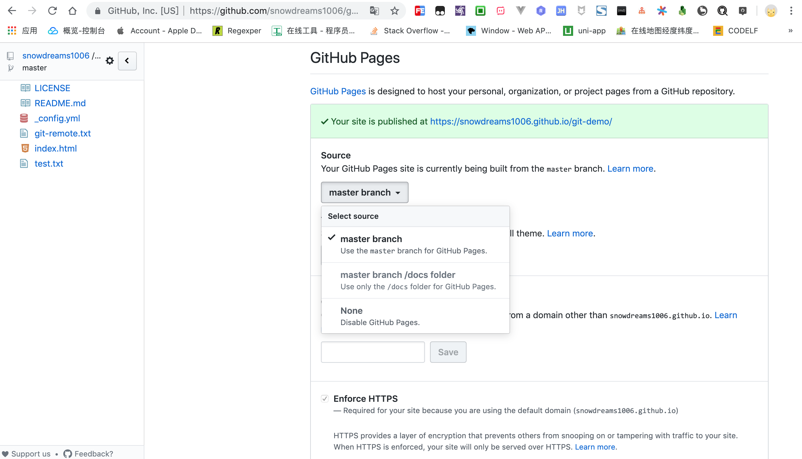

# 发布电子书

## 输出目标文件

> 语法格式: gitbook build [book] [output]

默认情况下,`gitbook` 输出方式是静态网站,其实 `gitbook` 的输出方式有三种: `website`, `json`,和 `ebook`.

只不过另外两种不是很常用,更多情况下我们是使用静态网页搭建个人官网,或托管到第三方平台,或部署到私有云服务器,但不管怎么样,还是离不开生成这一步.

示例:

```
# 默认输出格式: `website`
$ gitbook build --format=website

# 更改输出格式: `json`
$ gitbook build --format=json

# 更改输出格式: `ebook`
$ gitbook build --format=ebook
```

> 默认情况下输出目录: `_book/`,整个项目的入口文件是: `index.html`

## 集成 `github` 网站

本教程的电子书源码和输出文件均托管到 `github` 网站,所以这里介绍下如何利用 `Github Pages` 静态网页服务与 `gitbook` 进行集成.

### 什么是 `GitHub Pages` ?

`Github Pages` 是 `github` 网站推出的一种**免费**的静态网页托管服务,适合搭建静态的项目主页或个人官网.

其中,网站项目的源码直接托管在 `github` 仓库中,当仓库文件更新后,该仓库所关联的网站自动更新,从而实现了源码与官网的联动更新.


> 如果想了解更多详情,请参考[官网](https://pages.github.com/): https://pages.github.com/

### 怎么做 `GitHub Pages` ?

每个账号**有且只有一个**主页站点,但允许**无限制**多的项目站点.

啥是主页站点,项目站点又是啥?

别急,让我先举个例子看一下最终效果.

假如用户名: `zhangsan` 名下有四个公开仓库,一个仓库名叫做: `zhangsan.github.io`,另外三种分别是: `project01`,`project02`,`project03` .

如果想要对外暴露上述四个仓库作为我们的静态网站,那么最终效果就是下面这样的.

- 主页站点: [https://zhangsan.github.io](https://zhangsan.github.io)
- 项目01站点: [https://zhangsan.github.io/project01](https://zhangsan.github.io/project01)
- 项目02站点: [https://zhangsan.github.io/project02](https://zhangsan.github.io/project02)
- 项目03站点: [https://zhangsan.github.io/project03](https://zhangsan.github.io/project03)

> 注意将 `zhangsan` 替换成自己的 `github` 用户名,否则八成是打不开网站,除非真的有 `zhangsan` 这个用户.

其实上述规则很好理解,`github` 网站作为一个托管中心,有成千上万的用户在使用 `github` 并且每个用户的用户名都是唯一并且不同的,因此 `*.github.io` 通配符域名刚好充当命名空间.

可以预料的是,不仅仅有 `<username>.github.io` 这种二级域名,说不定还有 `api.github.io`,`docs.github.io` 等等,毕竟只需要购买 `*.github.io` 通配符域名证书就可以支持任意多的二级域名了,感谢 `github` 赠送我们免费的 `https` 网站.

说到这里,不得不吐槽下 `gitbook` 的命名空间策略了,`gitbook` 也有自己的电子书托管服务,但访问地址是 `<username>.gitbook.io/<namespace>` .

很显然,`gitbook` 没有区分主页站点和项目站点,相当于全部都是项目站点,缺少主次之分.

闲言少叙,既然知道了输入内容和输出效果,那么接下来的任务就是了解中间过程了,让我们一起探讨下怎么发布网站吧!

#### 主页站点

##### 创建 `<username>.github.io` 公开仓库

前往 [https://github.com/](https://github.com/) 网站创建名为 `<username>.github.io` 的公开仓库.

> 比如我的用户名是: `snowdreams1006` ,那么我的主页站点仓库就是: `snowdreams1006.github.io`

##### 创建首页 `index.html` 文件

不管是在线直接创建 `index.html` 还是克隆到本地创建 `index.html` ,最终的 `<username>.github.io` 仓库一定要有 `index.html` 首页文件.

示例:

```
# 克隆到本地
$ git clone https://github.com/username/username.github.io

# 切换到项目
$ cd username.github.io

# 创建 `index.html` 文件
$ echo "Hello World" > index.html

# 推送到远程仓库
$ git add --all
$ git commit -m "Initial commit"
$ git push -u origin master
```

##### 访问主页站点 `https://username.github.io`

打开浏览器,输入网址: [https://username.github.io](https://username.github.io) 访问主页站点,显示的内容正是我们刚刚提交的 `index.html` 文件内容.

> 如果没有正常显示,清除浏览器缓存强制刷新试试看!

#### 项目站点     

相比主页站点来说,项目站点命名比较随意了,作为静态网站不可或缺的文件仍然是 `index.html`.

##### 创建首页 `index.html` 文件

创建首页文件并添加测试内容,方便待会在线访问项目站点测试是否部署成功.

##### 设置 `GitHub Pages` 选项

点击仓库首页右上方设置(`Settings`)选项卡,往下翻到 `GitHub Pages` 选项,选择源码目录,根据实际情况选择源码来源于 `master` 分支还是其他分支或者`docs/` 目录.



> 方便起见,选择第一个 `master` 分支即可,注意下面的主题和这一步的来源只能两者选其一,否则主题优先级更高!

##### 访问主页站点 `https://username.github.io/<repository>`

打开浏览器,输入网址: [https://username.github.io/repository](https://username.github.io/repository) 访问项目站点,显示的内容正是我们刚刚提交的 `index.html` 文件内容.

> 如果没有正常显示,清除浏览器缓存强制刷新试试看!

### 如何集成 `gitbook` ?

我们已经知道 `Github Pages` 是提供静态网站的免费托管,而 `gitbook` 默认生成的内容就是静态网站,两者如何结合自然不用我多说了吧?

`gitbook` 默认输出目录 `_book/` 包括了静态网站所需的全部资源,其中就包括 `index.html` 首页文件.

因此我们只需要每次生成后将 `_book/` 整个目录复制到项目根目录,那么推送到远程仓库时自然就是输出后静态网站了啊!

示例:

```
# 生成静态网站
$ gitbook build

# 复制到项目根目录
$ cp -r _book/* .

# 添加到本地版本库
$ git add .
$ git commit -m "publish"

# 推送到远程仓库
$ git push origin master
```

> 现在登录 `github` 网站看一下静态网站是否成功上传以及访问主页站点或项目站点看一下最新内容是否成功渲染吧!

## 小结

本节我们学习 `gitbook` 有三种输出方式,其中默认的网页输出最为常用.

除此之外,还讲解了如何与 `github pages` 进行结合,从而实现源码和网站的自动更新维护.

如果源码没有托管到 `github` 这种第三方服务商,你也可以搭建自己的服务器,比如将 `_book/` 目录全部扔到 `nginx` 服务器做静态资源服务器等.

毕竟,源码和输出内容都在你手中,想怎么玩还不是自己说了算?
