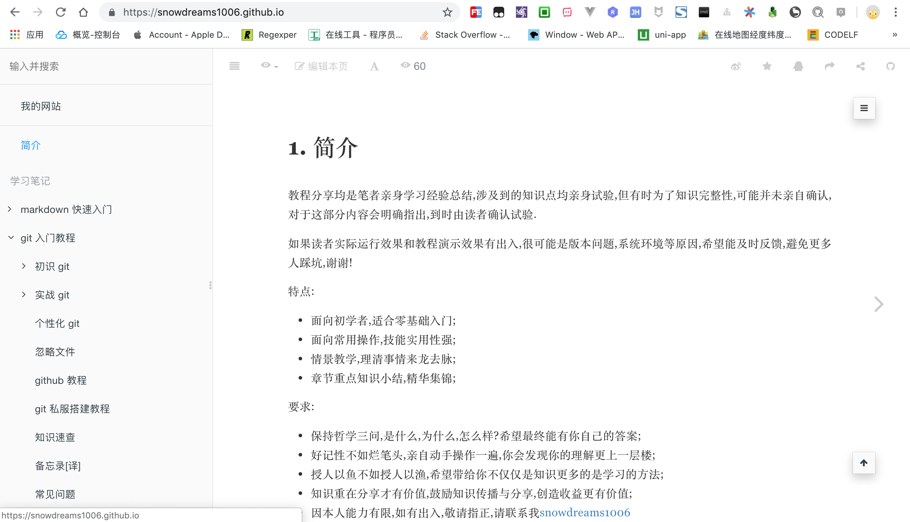
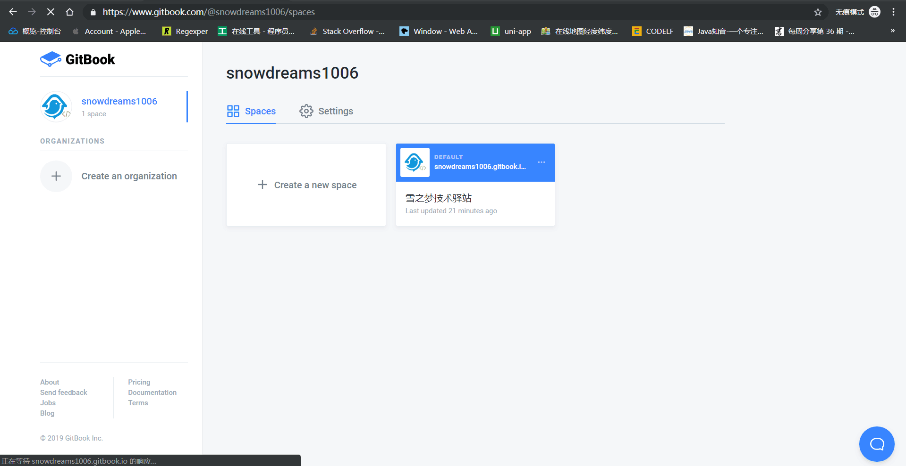
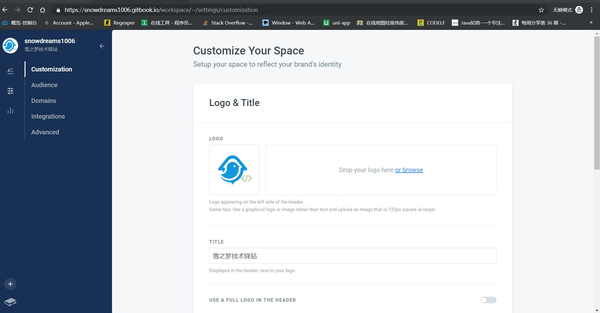
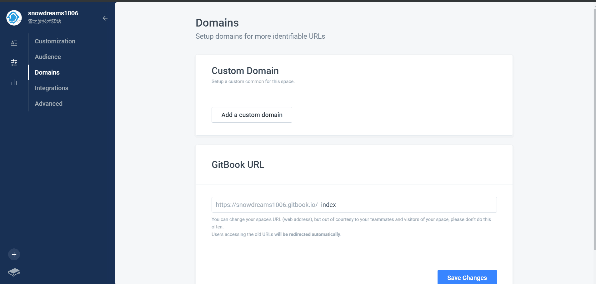
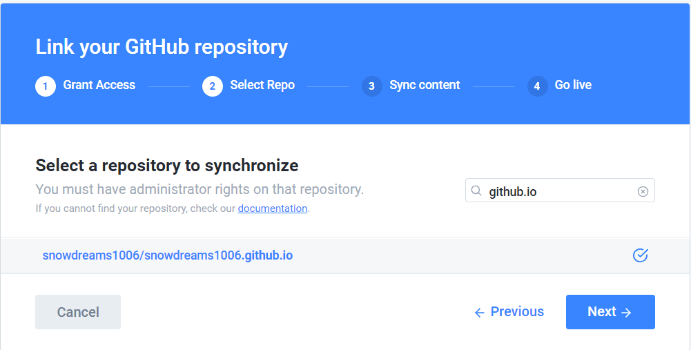
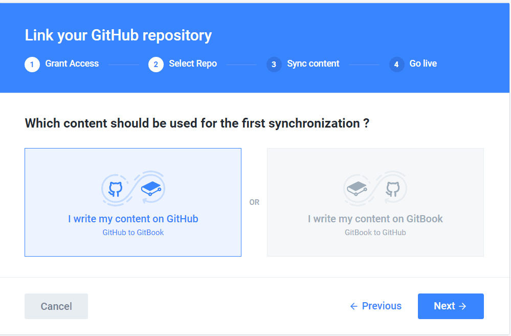

# gitbook.com 官网操作

`gitbook` 官网是官方提供的图书托管的在线平台,分为**新版官网(需要FQ)** [https://www.gitbook.com/](https://www.gitbook.com/) 和旧版官网(无需FQ) [https://legacy.gitbook.com](https://legacy.gitbook.com) 两个网站.

目前均正常提供服务,但令人遗憾的是,两个网站的信息相互独立,而且现在注册的账号默认只能在新版官网中使用,而新版官网的访问速度简直比 `github` 还要慢,所以国内用户在线访问你的电子书真的需要点技术手段了!

本文主要介绍 `www.gitbook.com` 官网的基本使用,而 `legacy.gitbook.com` 网站我就算是想介绍也没有账号测试啊.

> "巧妇难为无米之炊",明明你就在那里,可我却什么也做不了.

先大概说一下 `gitbook.com` 网站的一些个人总结吧.

`gitbook.com` 提供收费和免费服务,有点像早期的 `github` ,免费账号只能创建一个私有的命名空间,其他命名空间只能是公开的,这里的命名空间可以理解为一本书.

这一点是不是有点像早期的 `github.com`?免费账号无法创建私有仓库,只能是公开仓库.
(现在 `github.com` 已被微软收购,目前可以创建无限量的私有仓库了!)

再说 `gitbook` 的账号问题,像 `github` 一样提供用户名和邮箱登录方式,他们的用户名都可以作为二级域名,比如我的用户名是**snowdreams1006**,那么我的 `gitbook` 第一本电子书网址就是 `https://snowdreams1006.gitbook.io/index/` ,再看一下我的 `github` 个人网址 `https://snowdreams1006.github.io/` ,这两个是不是很类似?!

如果不仔细看的话,八成你会觉得一样,一个是**`gitbook.io`**,另一个是**`github.io`**.

所以我严重怀疑他俩是不是有着不为人知的私密关系,太多的相似性,鼓励分享,限制私有等等特点.

无图无真相,趁着这次教程顺便将 `github` 个人网站项目同步到 `gitbook` 电子书项目了,这样的好处是本地只需要推送到 `github` ,自动更新 `github.io` 网站(利用的是`github` 静态网站托管服务) ,然后再自动同步到 `gitbook.io` 网站.

是不是很神奇,一份源码,两个官网!

> **gitbook** : [https://snowdreams1006.gitbook.io/](https://snowdreams1006.gitbook.io/index/)

> **github** : [https://snowdreams1006.github.io/](https://snowdreams1006.gitbook.io/index/)

# 注册并登陆 `gitbook.com` 

注册信息主要包括用户名和邮箱,还有一些其他信息,没什么特殊的注意事项.

> 访问 [https://www.gitbook.com/](https://www.gitbook.com/) 需要 **FQ** 

# 新建命名空间(电子书)

注册账后后会默认生成一个私有的命名空间,因为并不打算将私有电子书托管到 `gitbook`,所以接下来直接将其转变成公开电子书进行演示.

## 个性性配置

### 标题和图片

### 主题颜色和页面反馈

## 观众

观众指的是当前电子书面向的受众是谁,公开的和私有的的区别以及设置是否被谷歌搜索收录.

## 域名

默认域名是 `https://snowdreams1006.gitbook.io/<space>`,如果需要自定义域名,请保证 `dns` 能够正确解析到该网站.

> url 设置的命名空间是 `index`,因此最终访问路径是 `https://snowdreams1006.gitbook.io/index/`

## 整合

`gitbook` 默认提供4种整合方式,在下孤陋寡闻只了解 `github` ,其余三种没接触过,暂不涉及.

### 选择 `github` 进行整合

### 登录 `github` 并授权

选择列出公开的仓库,然后输入用户名和密码进行登录并授权.

### 选择目标仓库

授权成功后会列出当前 `github` 账号下全部的公开仓库,选择目标仓库并点击下一步.

 这里以 `snowdreams1006.github.io` 公开仓库为例,因为该仓库是本人官网源码项目.

### 同步内容

#### 选择同步分支

根据实际情况选择同步分支,因为我一般是直接推送到 `master` 分支,所以 `master` 分支是个人网站的维护分支,因此这一步我选择的是 `master`.

#### 选择同步内容

选择同步内容的方式,是从 `github` 同步到 `gitbook`,还是从 `gitbook` 同步到 `github`,因为我的项目已托管到 `github` ,所以初次同步内容选择的是 `github --> gitbook`.

#### 显示 `github` 按钮

生成的电子书网站是否显示 `github` 按钮,作用是点击该按钮会跳转到关联的`github` 仓库上.

此时心里在想,万一点进 `github` ,随手就是一个 `star` 呢?哈哈!

#### 等待内容导入

根据目标仓库的大小不同,导入内容是的时长自然也不一样,耐心等待...

### 上线

导入完成,电子书终于正式上线了!

现在赶紧分享一下好消息吧,访问 [https://<username>.gitbook.io/<space>](https://snowdreams1006.gitbook.io/index/) 在线阅读!

# 小结

本文以如何集成 `github` 为例,演示了 `gitbook.com` 发布电子书的基本流程,由于 `gitbook` 电子书内容来自于 `github` 项目,因此我们只要更新 `github` 仓库,我们的 `gitbook` 电子书网站自然也就相应更新了!

`gitbook` 是 `markdown` 和 `github` 的完美结合体,借助 `gitbook.com` 官网我们很容易发布并托管电子书.

美中不足的是,国内无法正常访问 `gitbook.com` ,因此并不是很推荐将电子书发布到 `gitbook.com` 网站.

现在国内也有类似的产品,有一种产品叫做 [看云](https://www.kancloud.cn/),还不错!

后续还会介绍 `gitbook` 如何结合 `github` 发布个人网站,欢迎继续关注 `gitbook` 系列教程!

> 如何打造免费的个人官网,想了解 `https://snowdreams1006.github.io/` 背后的故事吗?
