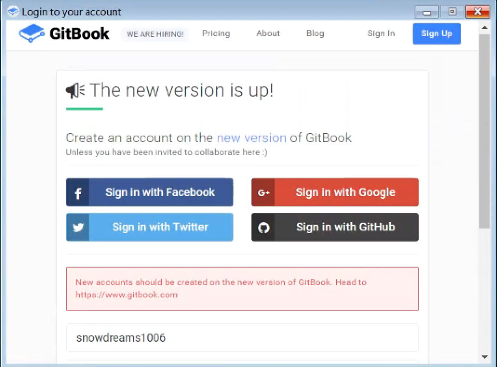
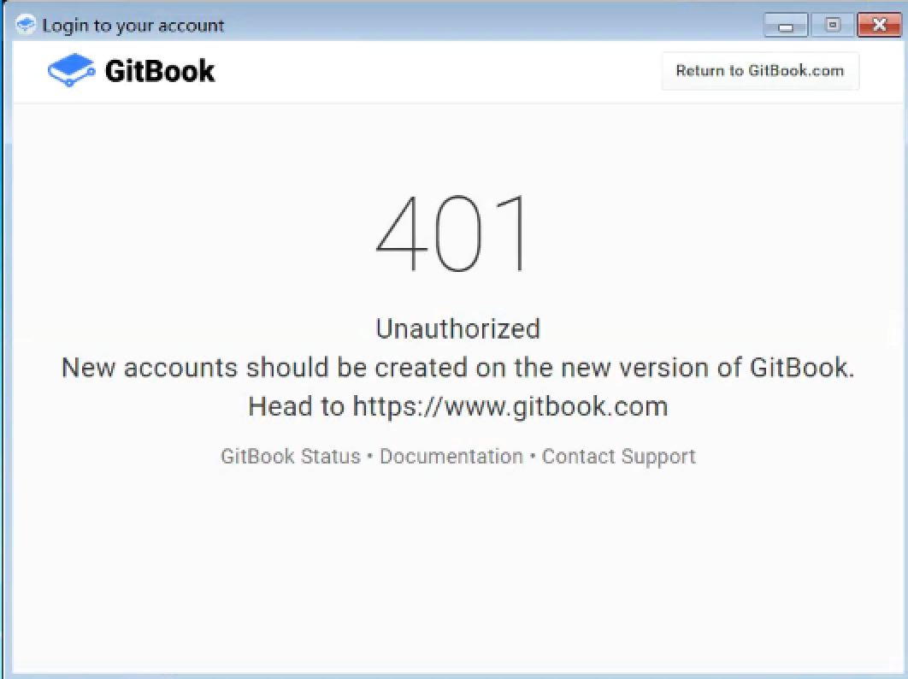

# gitbook-editor 编辑器操作

亲测,目前已**不再支持**旧版 [gitbook-editor](https://legacy.gitbook.com/editor) 编辑器,而官网也没有相应的新版编辑器,如果哪位找到了新版编辑器,还望告知!

现在注册 `gitbook` 账号会默认重定向到 [新版官网](https://www.gitbook.com/),而 [旧版官网](https://legacy.gitbook.com) 的账号应该是可以正常使用的,前提是你必须之前注册过.

遗憾的是,最新注册的账号是无法使用 `gitbook-editor` 编辑器,不能登录到 `gitbook` ,也无法同步 `github` ,充其量只能算本地的 `markdown` 编辑器,所以这一节不再介绍了.

如果有兴趣了解 `gitbook-editor` 编辑器的基本使用,请参考 [gitbook editor 编辑器](https://snowdreams1006.github.io/myGitbook/experience/preview.html#gitbook-editor-编辑器).