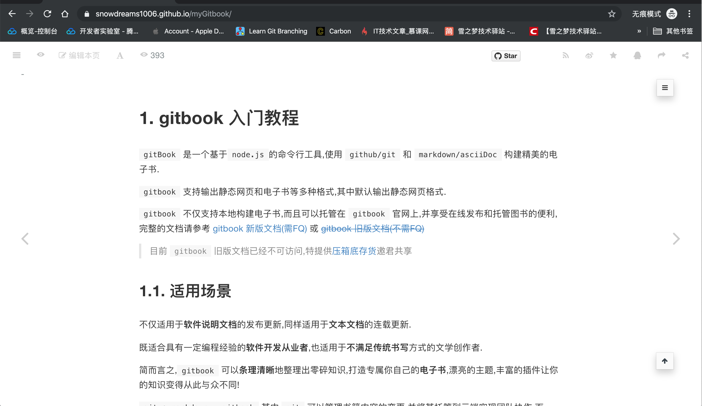
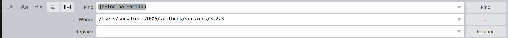
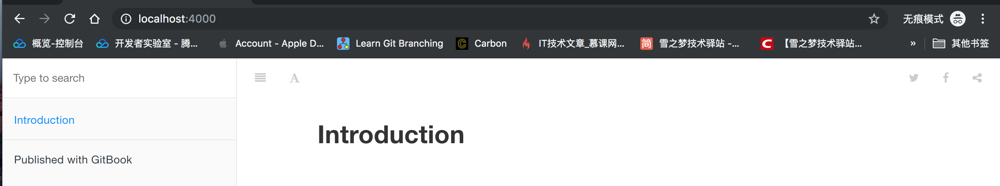
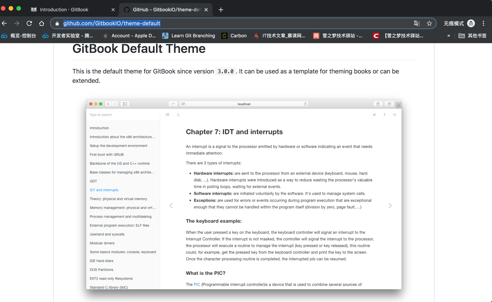
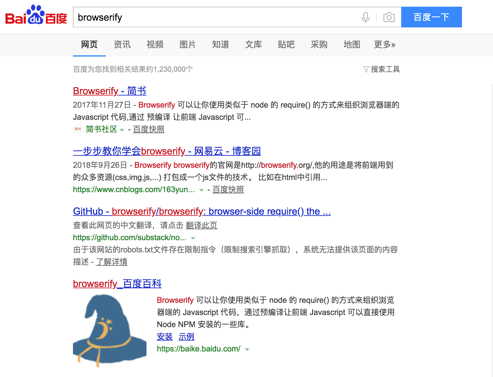
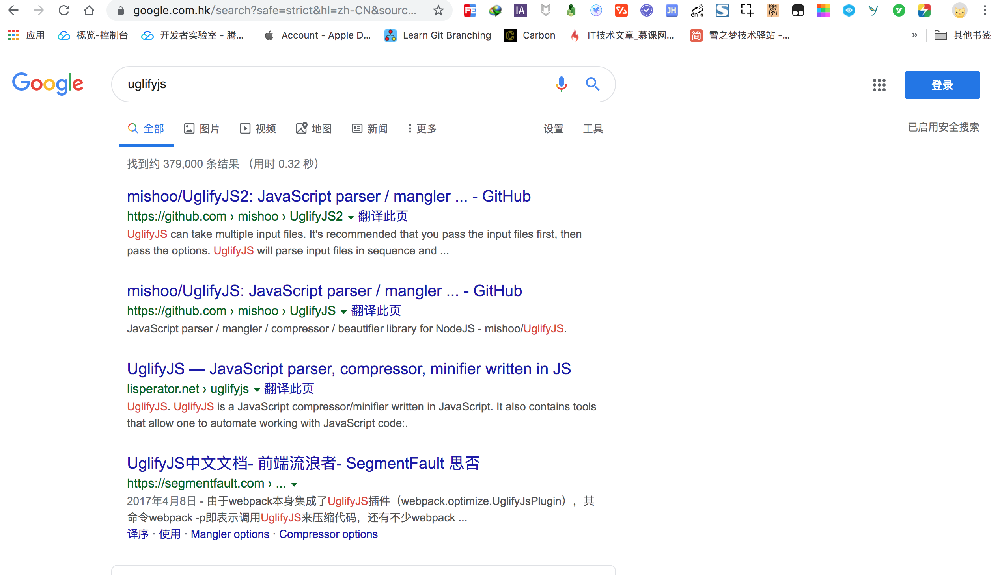
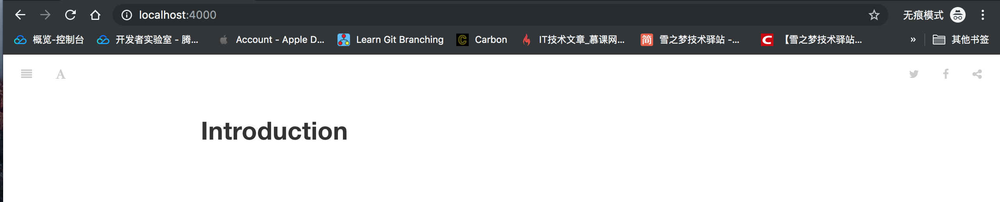
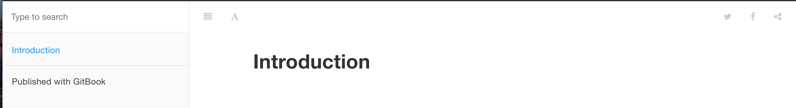

# 初始化默认折叠效果

> `Gitbook` 是一款**产品文档**构建工具,也可以用于构建个人博客,默认情况下电脑端访问时左侧菜单是展开状态,可偏偏有人想要实现**默认折叠**效果,于是诞生了这篇文章!

## 善良的我选择帮助别人

可能是网上关于 `Gitbook` 的教程相对来说有些落后,加上写文章时分享了不少关于 [gitbook 系列教程](https://snowdreams1006.github.io/myGitbook/),因此关注我的粉丝好友中有不少是来源于 `Gitbook`.

所以上个月有个好友问我能不能配置 `Gitbook` **默认折叠**的效果,心里有些犯难,作为 `gitbook` 的忠实粉丝,我都不知道 `gitbook` 还有这方面的配置?!

但是,善良的我总是有求必应,**不忍心拒绝**小白用户,于是我便抱着试一试的心态开始研究一下如何默认折叠?



当然,**解决问题前还是要先复现一下问题**,然后在命令行中熟练敲入了 `gitbook serve` 命令来启动本地服务器,为了**排除缓存**等影响,特意打开了 `Chrome` 浏览器的**无痕模式**,果不其然**默认左侧菜单是展开的**!


> 「雪之梦技术驿站」: 不能复现的问题都不是我的问题,**拒绝解决此类问题**,搞不好是你自己环境搭建问题呢!

## 蓦然回首官方文档已走

问题复现后就要开始寻求解决之道,虽然印象中并没有相关配置,但是难保记忆混乱遗漏了某些配置项,所以还是先看看**官方文档**怎么说的吧!

但是,当你在浏览器中输入 `gitbook 官方文档` 时,并找不到想象中的官方文档而是**新版官网**,不信你自己去搜一下,肯定是**新版官网**.


当你自以为找到了官网时,点击进去查看文档部分,很遗憾,这是新版文档并不是**老版文档**,你还会继续百度一下寻求可用链接期待找到官方文档.


为了节省宝贵时间,这里推荐访问个人维护的 `gitbook` 文档,点击访问: [https://snowdreams1006.github.io/gitbook-official/](https://snowdreams1006.github.io/gitbook-official/)

目前提供了中英文两个语言版本的文档,相信可以满足大多数用户的需求了,选择任意一种语言后点击进入翻阅相关设置.


实际上,**官方文档也并没有什么用**,因为根本就没有提到过如何更改相关配置使其**默认折叠而非展开状态**.


> 「雪之梦技术驿站」: 官方不再维护旧版文档,费尽心机找到旧版文档也无济于事,因为并没有提及到相关配置,所以猜测很可能并未提供有关配置项!

## 百度一下你就知道了吗

俗话说:"互联网上绝大多数问题别人都已经遇到过并提供了解决方案,我们唯一要做的就是找到它!"

这也是**面向搜索编程**的核心思想,遇到**默认折叠问题**应该也不会例外,那就搜索一下吧!


虽然百度搜索出现了一些相关文章,但是却不是我们想要的效果,大多数是基于 `gitbook` 插件实现的**目录折叠**效果,并不是**默认折叠左侧菜单**效果.

不管是**换关键词重新搜索**还是谷歌搜索,**均未发现有关默认折叠左侧菜单的解决方案**,难不成面向搜索失败了,要做解决问题的第一人吗?!


> 「雪之梦技术驿站」: 多次重复搜索操作均为找到解决方案,由此可见**真的很少有人想要默认折叠左侧菜单**,我也是很佩服提出该问题的小伙伴**骨骼惊奇**啊!

## 自力更生找寻蛛丝马迹

既然依靠别人无法解决问题,那么只能**自力更生独自解决问题**,是时候考验真正的技术了!

为了排除无关干扰,不能再用自己的 `gitbook` 项目了,毕竟文件太多不方便后续调试,那么不妨重新创建一个测试项目.

- 创建测试项目

```bash
$ mkdir test && cd test
```

- 初始化测试项目

```bash
$ gitbook init
```

- 启动测试项目

```bash
$ gitbook serve
```

虽然一片空白,并没有什么实质性内容,但是大道至简,对于我们复现并测试问题来说,足够了!


打开 `Chrome` 浏览器并按下 `F12` 开启调试模式,鼠标选中左侧的 `Elements` 元素选项卡并点亮左侧的小鼠标,然后在页面上找到左侧图标按钮,于是选中元素高亮了.


单独摘录 `Html` 关键代码如下:

```html
<a class="btn pull-left js-toolbar-action" aria-label="" href="#"><i class="fa fa-align-justify"></i></a>
```

稍微熟悉前端的小伙伴可能很轻松就能明白 `a` 标签的 `class` 属性表示的含义,见名知意,可以这么解释:

- `btn` 应该是控制外观的样式,表现得像是按钮效果.
- `pull-left` 应该是控制元素的位置,拉倒左边.
- `js-toolbar-action` 应该是控制元素的行为,`js` 工具栏行为动作.

由此可见,点击该图标实现左侧菜单折叠/展开效果应该是 `.js-toolbar-action` 在起作用,也就是说某一段 `js` 肯定是针对该 `class` 进行了监听!

此时,点击右侧的 `Event Listeners` 选项卡查看该元素已监听的 `click` 事件,定位到是哪一个具体的 `js` 文件在起作用.


果不其然,元素上存在 `click` 点击事件监听并且发现执行监听的逻辑代码出现在 `theme.js` 文件,点击进入文件查看具体内容.


压缩后的 `js` 代码不具备可读性,点击左下方的 `{}` 图标可以进行**代码格式化**,但是可能不是单纯的压缩而是进行了丑化或者混淆代码之类的逻辑,**格式化后的代码仍然不可读**!


> 「雪之梦技术驿站」: 终于发现了蛛丝马迹,修改的代码逻辑就隐藏在 `theme.js` 文件中,只要找到相关源码重新编译输出 `theme.js` 文件并替换应该就能实现默认折叠效果!

## 不要担心黎明前的黑暗

根据目前已掌握的线索,可以肯定的是有用线索主要有两个:

- 监听元素 `.js-toolbar-action`
- 输出文件 `theme.js`

一个是源码文件,另一个是输出文件,想要在庞大的 `gitbook` 项目中迅速定位到相关代码逻辑,**个人能力有限,并不熟悉前端开发调试流程,因此采用最简单粗暴傻瓜式搜索方式进行排查**!

> 「雪之梦技术驿站」: 如果读者对于现代前端开发流程比较属性的话,大概过一遍项目结构应该就可以调试定位问题了,用不着像我这样傻瓜式搜索排查!

- 查看当前 `gitbook` 版本

```bash
$ gitbook current
GitBook version is 3.2.3
```

- 找到 `gitbook` 安装位置

`gitbook` 一般安装在 `~/.gitbook/versions/3.2.3` 目录,其中 `~` 表示用户家目录.

```bash
$ open ~/.gitbook/versions/3.2.3
```

选择一款熟悉的编辑器并打开 `Gitbook` 安装目录,这里以 `sublime` 编辑器为例,选中项目后**右键**全局搜索关键字 `js-toolbar-action` 期望找到相关源码文件.



全局搜索后主要出现两个文件包含 `js-toolbar-action` 关键字,一个是输出文件 `theme.js` ,另一个是源码文件 `toolbar.js` .

```
Searching 19744 files for "js-toolbar-action"

/Users/snowdreams1006/.gitbook/versions/3.2.3/node_modules/gitbook-plugin-theme-default/_assets/website/theme.js:

...

/Users/snowdreams1006/.gitbook/versions/3.2.3/node_modules/gitbook-plugin-theme-default/src/js/theme/toolbar.js:

...

4 matches across 2 files
```

可想而知,源码文件肯定是经过**编译处理**后统一打包输出,因此**不仅仅要找到源码文件还要掌握如何编译**.

> 「雪之梦技术驿站」: 定位到当前 `gitbook` 目录后借助全局搜索功能定位到具体的文件路径,起作用的是 `gitbook-plugin-theme-default` 项目,其实这就是 `Gitbook` 的默认主题.

### 源码在哪

`/Users/snowdreams1006/.gitbook/versions/3.2.3/node_modules/gitbook-plugin-theme-default/src/js/theme/toolbar.js` :

```js
// Update a button
function updateButton(opts) {
    var $result;
    var $toolbar = $('.book-header');
    var $title = $toolbar.find('h1');

    // Build class name
    var positionClass = 'pull-'+opts.position;

    // Create button
    var $btn = $('<a>', {
        'class': 'btn',
        'text': opts.text? ' ' + opts.text : '',
        'aria-label': opts.label,
        'href': '#'
    });

    // Bind click
    $btn.click(opts.onClick);

    // Prepend icon
    if (opts.icon) {
        $('<i>', {
            'class': opts.icon
        }).prependTo($btn);
    }

    // Prepare dropdown
    if (opts.dropdown) {
        var $container = $('<div>', {
            'class': 'dropdown '+positionClass+' '+opts.className
        });

        // Add button to container
        $btn.addClass('toggle-dropdown');
        $container.append($btn);

        // Create inner menu
        var $menu = createDropdownMenu(opts.dropdown);

        // Menu position
        $menu.addClass('dropdown-'+(opts.position == 'right'? 'left' : 'right'));

        $container.append($menu);
        $result = $container;
    } else {
        $btn.addClass(positionClass);
        $btn.addClass(opts.className);
        $result = $btn;
    }

    $result.addClass('js-toolbar-action');

    if ($.isNumeric(opts.index) && opts.index >= 0) {
        insertAt($toolbar, '.btn, .dropdown, h1', opts.index, $result);
    } else {
        $result.insertBefore($title);
    }
}

// Update all buttons
function updateAllButtons() {
    $('.js-toolbar-action').remove();
    buttons.forEach(updateButton);
}
```

粗略看一下,上述代码是实现触发左侧图标折叠/展开菜单的逻辑实现,这里只是具体实现还不知道谁是使用者,也就是说这种逻辑是在哪里调用的?

只能继续顺藤摸瓜,往上翻看,根据基本开发常识,在该文件的同级目录中存在如下文件,其中的 `index.js` 应该就是入口文件:

```bash
snowdreams1006s-MacBook-Pro:theme snowdreams1006$ tree .
.
├── dropdown.js
├── index.js
├── keyboard.js
├── loading.js
├── navigation.js
├── platform.js
├── sidebar.js
└── toolbar.js

0 directories, 8 files
snowdreams1006s-MacBook-Pro:theme snowdreams1006$ 
````

打开 `index.js` 文件,根据注释我们可以看到 `init()` 函数是入门函数,其中 `sidebar.init()` 和 `sidebar.toggle()` 函数无不说明 `sidebar.js` 和 `toolbar.js` 关系密切,完全有理由猜想 `sidebar.js` 是 `toolbar.js` 的使用者!

```js
function init() {
    // Init sidebar
    sidebar.init();

    // Init keyboard
    keyboard.init();

    // Bind dropdown
    dropdown.init();

    // Init navigation
    navigation.init();

    // Add action to toggle sidebar
    toolbar.createButton({
        index: 0,
        icon: 'fa fa-align-justify',
        onClick: function(e) {
            e.preventDefault();
            sidebar.toggle();
        }
    });
}
```

打开 `sidebar.js` 文件并查看 `init()` 初始化函数和 `toggle()` 触发函数,可以验证我们的猜想,这里就是控制中心!

```js
// Prepare sidebar: state and toggle button
function init() {
    // Init last state if not mobile
    if (!platform.isMobile()) {
        toggleSidebar(gitbook.storage.get('sidebar', true), false);
    }

    // Close sidebar after clicking a link on mobile
    $(document).on('click', '.book-summary li.chapter a', function(e) {
        if (platform.isMobile()) toggleSidebar(false, false);
    });
}
```

> 「雪之梦技术驿站」: **非手机端**初始化上次状态,**默认展开**侧边栏,如果是**手机端则折叠**侧边栏.其中 toggleSidebar() 接收两个参数,第一次参数表示是展开还是折叠,第二个参数暂不可知.

```js
// Toggle sidebar with or withour animation
function toggleSidebar(_state, animation) {
    if (gitbook.state != null && isOpen() == _state) return;
    if (animation == null) animation = true;

    gitbook.state.$book.toggleClass('without-animation', !animation);
    gitbook.state.$book.toggleClass('with-summary', _state);

    gitbook.storage.set('sidebar', isOpen());
}
```

> 「雪之梦技术驿站」: 第一个参数确实表示状态而第二个参数表示是否有动画效果,不用看具体代码逻辑而是看注释就能猜出大概逻辑了.

通过上述分析,我们可以得知 `init()` 初始化函数决定了默认行为是折叠还是展开,同时 `gitbook.storage.set('sidebar', isOpen())` 和 `gitbook.storage.get('sidebar', true)` 应该是设置和获取是否展开菜单的标志!

由此,如果想要默认折叠左侧菜单,那么只需要设置成 `gitbook.storage.set('sidebar', false)` 应该就会生效!

### 如何编译

说干就干,于是乎在 `init()` 函数插入 `gitbook.storage.set('sidebar', false)` 默认折叠逻辑,接着看一下是否需要重新编译才能生效?

```js
// Prepare sidebar: state and toggle button
function init() {
    // Close sidebar as default state 
    gitbook.storage.set('sidebar', false);

    // Init last state if not mobile
    if (!platform.isMobile()) {
        toggleSidebar(gitbook.storage.get('sidebar', true), false);
    }

    // Close sidebar after clicking a link on mobile
    $(document).on('click', '.book-summary li.chapter a', function(e) {
        if (platform.isMobile()) toggleSidebar(false, false);
    });
}
```

接着切换到测试项目再次运行 `gitbook serve` 启动本地服务器,**发现并没有任何变化**,很有可能改变源码文件需要重新编译才会生效或者说更改的源码项目也没有生效?



> 「雪之梦技术驿站」: 该源码文件所在的项目是 `gitbook-plugin-theme-default` ,根据 `gitbook` 插件命名规范我们知道,`gitbook-plugin-*` 一般是功能性插件,这一类的插件有 `gitbook-plugin-readmore` 阅读更多插件和 `gitbook-plugin-copyright` 版权保护插件等等.
>
> 但是如果插件名以 `gitbook-plugin-theme` 开头的话,这一类插件就是主题插件,比如 `gitbook-plugin-theme-default` 就是默认主题.

除此之外,只要遵守该命名规则的插件引入时无需添加 `gitbook-plugin-` 前缀,可以直接在 `gitbook.json` 文件中引入剩余的简称作为插件名.

摘录自 `Gitbook` 项目的配置文件,可以佐证上述规则的正确性.

```json
"plugins": [
    "toc",
    "pageview-count",
    "mermaid-gb3",
    "-lunr",
    "-search",
    "search-plus",
    "splitter",
    "-sharing",
    "sharing-plus",
    "expandable-chapters-small",
    "anchor-navigation-ex",
    "edit-link",
    "copy-code-button",
    "chart",
    "favicon-custom",
    "github-buttons",
    "advanced-emoji",
    "rss",
    "readmore",
    "copyright",
    "tbfed-pagefooter",
    "mygitalk",
    "donate"
]
```

作为普通的 `nodejs` 包,开发规范规定了 `package.json` 提供了插件的配置信息,而 `Gitbook` 插件除了是标准的 `nodejs` 包之外还有自己的约束,主要体现在提供了 `gitbook` 节点属性:

```json
"gitbook": {
    "properties": {
      "styles": {
        "type": "object",
        "title": "Custom Stylesheets",
        "properties": {
          "website": {
            "title": "Stylesheet for website output",
            "default": "styles/website.css"
          },
          "pdf": {
            "title": "Stylesheet for PDF output",
            "default": "styles/pdf.css"
          },
          "epub": {
            "title": "Stylesheet for ePub output",
            "default": "styles/epub.css"
          },
          "mobi": {
            "title": "Stylesheet for Mobi output",
            "default": "styles/mobi.css"
          },
          "ebook": {
            "title": "Stylesheet for ebook outputs (PDF, ePub, Mobi)",
            "default": "styles/ebook.css"
          },
          "print": {
            "title": "Stylesheet to replace default ebook css",
            "default": "styles/print.css"
          }
        }
      },
      "showLevel": {
        "type": "boolean",
        "title": "Show level indicator in TOC",
        "default": false
      }
    }
}
```

默认主题仅仅提供了两个配置项,分别是 `styles` 样式文件位置和 `showLevel` 是否显示层级配置.

再一次验证了猜想的正确性,真的需要修改源码才能实现默认折叠左侧菜单的效果,紧着继续在 `package.json` 中找到项目源码的托管地址,看一下有没有提供二次开发文档.

```json
"repository": {
    "type": "git",
    "url": "git+https://github.com/GitbookIO/theme-default.git"
}
```

令人遗憾的是,项目介绍空空如也,除了一张主题预览图,别的什么都没有?!



既然没有二次开发文档,那就看看项目源码有没有别的蛛丝马迹教我们如何编译?

> 「雪之梦技术驿站」: 绕了这么多,其实还不是因为比较菜,人家都提供给源码都不会编译,留下来没有技术的眼泪!

视角再一次切换到源码目录,除了 `js` 和 `less` 目录外,竟然还有一个 `build.sh` 构建脚本!

```bash
snowdreams1006s-MacBook-Pro:src snowdreams1006$ tree 
.
├── build.sh
├── js
│   ├── core
│   └── theme
│       ├── dropdown.js
│       ├── index.js
│       ├── keyboard.js
│       ├── loading.js
│       ├── navigation.js
│       ├── platform.js
│       ├── sidebar.js
│       └── toolbar.js
└── less

7 directories, 37 files
snowdreams1006s-MacBook-Pro:src snowdreams1006$ 
```

这一刻,仿佛看到了九点钟升起的太阳,未来是你们的也是我们的!

```bash
snowdreams1006s-MacBook-Pro:gitbook-plugin-theme-default snowdreams1006$ cat src/build.sh 
#! /bin/bash

# Cleanup folder
rm -rf _assets

# Recreate folder
mkdir -p _assets/website/
mkdir -p _assets/ebook/

# Compile JS
browserify src/js/core/index.js | uglifyjs -mc > _assets/website/gitbook.js
browserify src/js/theme/index.js | uglifyjs -mc > _assets/website/theme.js

# Compile Website CSS
lessc -clean-css src/less/website.less _assets/website/style.css

# Compile eBook CSS
lessc -clean-css src/less/ebook.less _assets/ebook/ebook.css
lessc -clean-css src/less/pdf.less _assets/ebook/pdf.css
lessc -clean-css src/less/mobi.less _assets/ebook/mobi.css
lessc -clean-css src/less/epub.less _assets/ebook/epub.css

# Copy fonts
mkdir -p _assets/website/fonts
cp -R node_modules/font-awesome/fonts/ _assets/website/fonts/fontawesome/

# Copy icons
mkdir -p _assets/website/images
cp node_modules/gitbook-logos/output/favicon.ico _assets/website/images/
cp node_modules/gitbook-logos/output/apple-touch-icon-152.png _assets/website/images/apple-touch-icon-precomposed-152.png

snowdreams1006s-MacBook-Pro:gitbook-plugin-theme-default snowdreams1006$ 
```

这一段脚本中除了看不懂 `browserify,uglifyjs,lessc -clean-css` 命令外,剩下部分都很简单,大致是编译源码文件并输出到 `_assets` 目录.

编译 `js` 的命令主要有以下两条,而我们关心的 `theme.js` 仅涉及到一条,除此之外没有任何别的依赖,这一点非常好!

```bash
# Compile JS
browserify src/js/core/index.js | uglifyjs -mc > _assets/website/gitbook.js
browserify src/js/theme/index.js | uglifyjs -mc > _assets/website/theme.js
```

接下来的重点就是如何运行 `browserify src/js/theme/index.js | uglifyjs -mc > _assets/website/theme.js` 命令了!

## 摇身一变重新编译源码

> `browserify src/js/theme/index.js | uglifyjs -mc > _assets/website/theme.js`

### 百度一下 browserify 

再一次打开熟悉的浏览器输入关键字 `browserify` 后出现一系列相关文章,很好奇为啥排名第一个都不会是官网呢?不管怎么样,找到 `browserify` 的 `github` 项目地址也是不错的!



这里并不关心 `browserify` 到底是什么,只在乎如何安装基本环境而已!

```bash
$ npm install -g browserify
```

> 「雪之梦技术驿站」:  如果是 `mac` 电脑,全局安装需要管理员权限,应该运行 `sudo npm install -g browserify` ,如果**嫌弃安装速度慢**也可以运行 `cnpm install -g browserify` ,前提是已安装 `cnpm` 命令.

### 谷歌一下 uglifyjs

不吹不黑,少走一点弯路,直接就找到了 `github` 项目网址,同样的也不关心项目介绍,直接翻看如何安装部分.


```bash
$ npm install -g uglify-js
```



### 重新编译 others

涉及到 `browserify src/js/theme/index.js | uglifyjs -mc > _assets/website/theme.js` 命令的两个插件均已安装完毕,理所应当开始重新编译源码了,但是竟然报错了?

当出现报错时,开始怀疑人生,难道推论不正确,难道环境没有安装成功吗,为啥提示找不到 `mousetrap` 模块?

```bash
$ browserify src/js/theme/index.js | uglifyjs -mc > _assets/website/theme.js
Error: Cannot find module 'mousetrap' from '/Users/snowdreams1006/.gitbook/versions/3.2.3/node_modules/gitbook-plugin-theme-default/src/js/theme'
    at /usr/local/lib/node_modules/browserify/node_modules/_resolve@1.1.7@resolve/lib/async.js:46:17
    at process (/usr/local/lib/node_modules/browserify/node_modules/_resolve@1.1.7@resolve/lib/async.js:173:43)
    at ondir (/usr/local/lib/node_modules/browserify/node_modules/_resolve@1.1.7@resolve/lib/async.js:188:17)
    at load (/usr/local/lib/node_modules/browserify/node_modules/_resolve@1.1.7@resolve/lib/async.js:69:43)
    at onex (/usr/local/lib/node_modules/browserify/node_modules/_resolve@1.1.7@resolve/lib/async.js:92:31)
    at /usr/local/lib/node_modules/browserify/node_modules/_resolve@1.1.7@resolve/lib/async.js:22:47
    at FSReqCallback.oncomplete (fs.js:158:21)
```

算了吧,与其费尽心思猜测为啥无法加载 `mousetrap` 模块,不如继续安装剩余依赖,最大可能性排除环境问题.

那就先把 `src/build.sh` 构建脚本涉及到的其他命令全部安装一遍,然后再试一下吧!

除了编译 `Js` 的命令外,还有编译 `Css` 的命令,关于构建脚本 `build.sh` 的其他内容就是基本的复制粘贴之类的操作了.

```
# Compile Website CSS
lessc -clean-css src/less/website.less _assets/website/style.css
```

这里省略面向搜索编程的中间过程,安装命令如下:

```bash
$ npm install -g less less-plugin-clean-css
```

当我再一次运行构建脚本时,满心期待会编译成功,没想到现实再一次打脸,这时候错误更多了呢,真的是没想到!

```bash
snowdreams1006s-MacBook-Pro:gitbook-plugin-theme-default snowdreams1006$ src/build.sh 
Error: Cannot find module 'jquery' from '/Users/snowdreams1006/.gitbook/versions/3.2.3/node_modules/gitbook-plugin-theme-default/src/js/core'
    at /usr/local/lib/node_modules/browserify/node_modules/_resolve@1.1.7@resolve/lib/async.js:46:17
    at process (/usr/local/lib/node_modules/browserify/node_modules/_resolve@1.1.7@resolve/lib/async.js:173:43)
    at ondir (/usr/local/lib/node_modules/browserify/node_modules/_resolve@1.1.7@resolve/lib/async.js:188:17)
    at load (/usr/local/lib/node_modules/browserify/node_modules/_resolve@1.1.7@resolve/lib/async.js:69:43)
    at onex (/usr/local/lib/node_modules/browserify/node_modules/_resolve@1.1.7@resolve/lib/async.js:92:31)
    at /usr/local/lib/node_modules/browserify/node_modules/_resolve@1.1.7@resolve/lib/async.js:22:47
    at FSReqCallback.oncomplete (fs.js:158:21)
Error: Cannot find module 'mousetrap' from '/Users/snowdreams1006/.gitbook/versions/3.2.3/node_modules/gitbook-plugin-theme-default/src/js/theme'
    at /usr/local/lib/node_modules/browserify/node_modules/_resolve@1.1.7@resolve/lib/async.js:46:17
    at process (/usr/local/lib/node_modules/browserify/node_modules/_resolve@1.1.7@resolve/lib/async.js:173:43)
    at ondir (/usr/local/lib/node_modules/browserify/node_modules/_resolve@1.1.7@resolve/lib/async.js:188:17)
    at load (/usr/local/lib/node_modules/browserify/node_modules/_resolve@1.1.7@resolve/lib/async.js:69:43)
    at onex (/usr/local/lib/node_modules/browserify/node_modules/_resolve@1.1.7@resolve/lib/async.js:92:31)
    at /usr/local/lib/node_modules/browserify/node_modules/_resolve@1.1.7@resolve/lib/async.js:22:47
    at FSReqCallback.oncomplete (fs.js:158:21)
FileError: '../../node_modules/font-awesome/less/font-awesome.less' wasn't found. Tried - /Users/snowdreams1006/.gitbook/versions/3.2.3/node_modules/gitbook-plugin-theme-default/node_modules/font-awesome/less/font-awesome.less,/Users/snowdreams1006/.gitbook/versions/3.2.3/node_modules/gitbook-plugin-theme-default/node_modules/font-awesome/less/font-awesome.less,../../node_modules/font-awesome/less/font-awesome.less in /Users/snowdreams1006/.gitbook/versions/3.2.3/node_modules/gitbook-plugin-theme-default/src/less/website.less on line 2, column 1:
1 @import "base/all.less";
2 @import "../../node_modules/font-awesome/less/font-awesome.less";
3 @import "../../node_modules/preboot/less/preboot.less";

FileError: '../../../node_modules/gitbook-markdown-css/less/mixin.less' wasn't found. Tried - /Users/snowdreams1006/.gitbook/versions/3.2.3/node_modules/gitbook-plugin-theme-default/node_modules/gitbook-markdown-css/less/mixin.less,/Users/snowdreams1006/.gitbook/versions/3.2.3/node_modules/node_modules/gitbook-markdown-css/less/mixin.less,../../../node_modules/gitbook-markdown-css/less/mixin.less in /Users/snowdreams1006/.gitbook/versions/3.2.3/node_modules/gitbook-plugin-theme-default/src/less/base/mixins.less on line 1, column 1:
1 @import "../../../node_modules/gitbook-markdown-css/less/mixin.less";
2 

FileError: '../../../node_modules/gitbook-markdown-css/less/mixin.less' wasn't found. Tried - /Users/snowdreams1006/.gitbook/versions/3.2.3/node_modules/gitbook-plugin-theme-default/node_modules/gitbook-markdown-css/less/mixin.less,/Users/snowdreams1006/.gitbook/versions/3.2.3/node_modules/node_modules/gitbook-markdown-css/less/mixin.less,../../../node_modules/gitbook-markdown-css/less/mixin.less in /Users/snowdreams1006/.gitbook/versions/3.2.3/node_modules/gitbook-plugin-theme-default/src/less/base/mixins.less on line 1, column 1:
1 @import "../../../node_modules/gitbook-markdown-css/less/mixin.less";
2 

FileError: '../../../node_modules/gitbook-markdown-css/less/mixin.less' wasn't found. Tried - /Users/snowdreams1006/.gitbook/versions/3.2.3/node_modules/gitbook-plugin-theme-default/node_modules/gitbook-markdown-css/less/mixin.less,/Users/snowdreams1006/.gitbook/versions/3.2.3/node_modules/node_modules/gitbook-markdown-css/less/mixin.less,../../../node_modules/gitbook-markdown-css/less/mixin.less in /Users/snowdreams1006/.gitbook/versions/3.2.3/node_modules/gitbook-plugin-theme-default/src/less/base/mixins.less on line 1, column 1:
1 @import "../../../node_modules/gitbook-markdown-css/less/mixin.less";
2 

FileError: '../../../node_modules/gitbook-markdown-css/less/mixin.less' wasn't found. Tried - /Users/snowdreams1006/.gitbook/versions/3.2.3/node_modules/gitbook-plugin-theme-default/node_modules/gitbook-markdown-css/less/mixin.less,/Users/snowdreams1006/.gitbook/versions/3.2.3/node_modules/node_modules/gitbook-markdown-css/less/mixin.less,../../../node_modules/gitbook-markdown-css/less/mixin.less in /Users/snowdreams1006/.gitbook/versions/3.2.3/node_modules/gitbook-plugin-theme-default/src/less/base/mixins.less on line 1, column 1:
1 @import "../../../node_modules/gitbook-markdown-css/less/mixin.less";
2 

cp: directory _assets/website/fonts/fontawesome does not exist
cp: node_modules/gitbook-logos/output/favicon.ico: No such file or directory
cp: node_modules/gitbook-logos/output/apple-touch-icon-152.png: No such file or directory
```

那就继续扩大安装环境范围,这时候对整个 `gitbook-plugin-theme-default` 进行 `npm install` 安装相关依赖,这一次会发生什么情况呢?

```bash
$ npm install
```

让我们拭目以待!

```bash
snowdreams1006s-MacBook-Pro:gitbook-plugin-theme-default snowdreams1006$ src/build.sh 
snowdreams1006s-MacBook-Pro:gitbook-plugin-theme-default snowdreams1006$
```

命令行没有了乱七八糟的输出,世界变得安静了!

 `linux` 命令行哲学告诉我们,**没有消息就是好消息**,全部安装项目环境后再次运行 `src/build.sh` 脚本命令行瞬间安静了!

怀着忐忑不安的心,切换到测试项目运行 `gitbook serve` 命令后,那一瞬间,感觉世界都静止了,奇迹就这么发生了?



终于成功了,实现默认折叠效果了吗?

为了验证是否成功实现默认折叠失效,做一次反向测试,既然默认折叠左侧菜单设置的是 `false`,如果设置成 `true` 的话,默认应该是展开状态.

```js
// Prepare sidebar: state and toggle button
function init() {
    // Close sidebar as default state 
    // gitbook.storage.set('sidebar', false);

    // Open sidebar as default state 
    gitbook.storage.set('sidebar', true);

    // Init last state if not mobile
    if (!platform.isMobile()) {
        toggleSidebar(gitbook.storage.get('sidebar', true), false);
    }

    // Close sidebar after clicking a link on mobile
    $(document).on('click', '.book-summary li.chapter a', function(e) {
        if (platform.isMobile()) toggleSidebar(false, false);
    });
}
```

重新编译后再次启动本地测试项目,如果是展开状态,那就说明**成功不是偶然而是靠技巧和努力**!

- 重新编译源码

```bash
$ src/build.sh
```

> /Users/snowdreams1006/.gitbook/versions/3.2.3/node_modules/gitbook-plugin-theme-default

- 启动本地项目

```bash
$ gitbook serve
```

> /Users/snowdreams1006/Documents/workspace/test



> 「雪之梦技术驿站」: 苦心人天不负,不是昙花一现的巧合而是货真价实的现实,就这么实现了默认折叠左侧菜单功能!

## 懒人直达以及回顾总结

如果你是 `Gitbook` 普通用户或者懒得折腾,那么推荐你直接替换掉 `theme.js` 文件:

- 查看正在使用的 `gitbook` 版本信息

```bash
$ gitbook current
GitBook version is 3.2.3
```

- 打开正在使用的 `gitbook` 安装位置

```bash
$ open ~/.gitbook/versions/3.2.3/node_modules/gitbook-plugin-theme-default/
```

- 新文件替换掉原来的 `_assets/website/theme.js` 文件

> 可以关注微信公众号回复 "gitbook" 获取重新编译后的新文件 `theme.js`.

- 切换到测试项目验证默认折叠是否已生效

```bash
$ gitbook serve
```

如果你不怕麻烦,喜欢折腾,那么不妨体验一下如何重新编译源码文件.

- 查看正在使用的 `gitbook` 版本信息

```bash
$ gitbook current
GitBook version is 3.2.3
```

- 打开正在使用的 `gitbook` 安装位置

```bash
$ open ~/.gitbook/versions/3.2.3/node_modules/gitbook-plugin-theme-default/
```

- 安装 `theme-default` 默认主题项目所需依赖

```bash
$ npm install
```

- 安装 `build.sh` 构建脚本所需依赖

```bash
$ sudo npm install -g browserify uglify-js less less-plugin-clean-css
```

- 运行 `build.sh` 构建脚本重新编译

```bash
$ src/build.sh
```

- 切换到测试项目验证默认折叠是否已生效

```bash
$ gitbook serve
```

值得注意的是,实现默认折叠左侧菜单功能仅仅需要添加一行代码,但是也很有可能和项目中已引入插件存在冲突,毕竟 `sidebar` 的状态也可以被未知代码所更改!

```js
// Prepare sidebar: state and toggle button
function init() {
    // Close sidebar as default state 
    gitbook.storage.set('sidebar', false);

    // Open sidebar as default state 
    // gitbook.storage.set('sidebar', true);

    // Init last state if not mobile
    if (!platform.isMobile()) {
        toggleSidebar(gitbook.storage.get('sidebar', true), false);
    }

    // Close sidebar after clicking a link on mobile
    $(document).on('click', '.book-summary li.chapter a', function(e) {
        if (platform.isMobile()) toggleSidebar(false, false);
    });
}
```

最后希望本文对你有所帮助,面向搜索编程变得不可用时,自力更生也未尝不可,如果大家在使用 `Gitbook` 中遇到任何问题,欢迎留言评论告诉我,当然我也不一定保证解决,万一哪天心血来潮翻看一下源码就解决了呢!