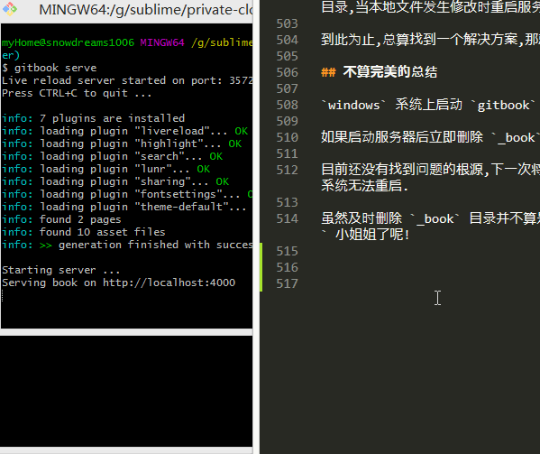

# 热加载失败治标之法

## 破镜如何贴花黄

> `gitbook` 在 `Windows` 系统无法热加载,总是报错!

`gitbook` 是一款文档编写利器,可以方便地 `markdown` 输出成美观优雅的 `html` ,`gitbook serve` 启动服务器后,原来相貌平平的 `markdown` 丑小鸭摇身一变就成了倾国倾城的 `html` 绝色佳人.

如果源文件发生更改,`Windows` 却无法按照预期那样重启服务器,直接抛出一个异常,立即终止了 `markdown` 的化妆.

```bash
Restart after change in file README.md

Stopping server
events.js:183
      throw er; // Unhandled 'error' event
      ^

Error: EPERM: operation not permitted, lstat 'F:\workspace\private-cloud-backup\gitbook-test\_book'
```

### 对镜贴花黄

现在看一下 `markdown` 灰姑娘变身 `html` 小姐姐的神奇过程吧!

```bash
$ gitbook serve --log=debug
Live reload server started on port: 35729
Press CTRL+C to quit ...

debug: readme found at README.md
debug: summary file found at SUMMARY.md
debug: cleanup folder "G:\sublime\gitbook-test\_book"
info: 7 plugins are installed
info: loading plugin "livereload"... OK
...
info: loading plugin "theme-default"... OK
info: found 1 pages
info: found 0 asset files
debug: calling hook "config"
debug: calling hook "init"
debug: copy assets from theme C:\Users\snowdreams1006\.gitbook\versions\3.2.3\node_modules\gitbook-plugin-theme-default\_assets\website
...
debug: copy resources from plugin C:\Users\snowdreams1006\.gitbook\versions\3.2.3\node_modules\gitbook-plugin-livereload\book
debug: generate page "README.md"
debug: calling hook "page:before"
debug: calling hook "page"
debug: index page README.md
debug: calling hook "finish:before"
debug: calling hook "finish"
debug: write search index
info: >> generation finished with success in 1.5s !

Starting server ...
Serving book on http://localhost:4000
```

根据上述输出日志,我们可以分析出 `gitbook` 的基本运行流程.

- 加载 `readme` 和 `summary` 文件,若存在 `glossary` 文件也会加载,并删除 `_book` 目录

```bash
debug: readme found at README.md
debug: summary file found at SUMMARY.md
debug: cleanup folder "G:\sublime\gitbook-test\_book"
```

- 加载依赖插件,若没有找到相应插件会报错,提示运行 `gitbook install` 安装插件.

```bash
info: 7 plugins are installed
info: loading plugin "livereload"... OK
info: loading plugin "highlight"... OK
info: loading plugin "search"... OK
info: loading plugin "lunr"... OK
info: loading plugin "sharing"... OK
info: loading plugin "fontsettings"... OK
info: loading plugin "theme-default"... OK
```

- 扫描页面和静态资源文件

```bash
info: found 1 pages
info: found 0 asset files
```

- 读取配置文件并初始化

```bash
debug: calling hook "config"
debug: calling hook "init"
```

- 拷贝样式资源和插件资源

```bash
debug: copy assets from theme C:\Users\snowdreams1006\.gitbook\versions\3.2.3\node_modules\gitbook-plugin-theme-default\_assets\website
debug: copy resources from plugin C:\Users\snowdreams1006\.gitbook\versions\3.2.3\node_modules\gitbook-plugin-fontsettings\assets
debug: copy resources from plugin C:\Users\snowdreams1006\.gitbook\versions\3.2.3\node_modules\gitbook-plugin-sharing\assets
debug: copy resources from plugin C:\Users\snowdreams1006\.gitbook\versions\3.2.3\node_modules\gitbook-plugin-lunr\assets
debug: copy resources from plugin C:\Users\snowdreams1006\.gitbook\versions\3.2.3\node_modules\gitbook-plugin-search\assets
debug: copy resources from plugin C:\Users\snowdreams1006\.gitbook\versions\3.2.3\node_modules\gitbook-plugin-highlight\css
debug: copy resources from plugin C:\Users\snowdreams1006\.gitbook\versions\3.2.3\node_modules\gitbook-plugin-livereload\book
```

- 开始生成单独页面,依次执行 `page:before` ,`page` 回调函数,全部页面执行完毕后执行 `finish:before` 和 `finish` 回调函数.

```bash
debug: generate page "README.md"
debug: calling hook "page:before"
debug: calling hook "page"
debug: index page README.md
debug: calling hook "finish:before"
debug: calling hook "finish"
```

- 生成搜索文件

```bash
debug: write search index
```

- 启动完毕,输出成功信息

```bash
Starting server ...
Serving book on http://localhost:4000
```

默认情况下服务器启动后会占用两个端口,一个是对外暴露的 `4000` 端口,用于浏览器访问项目.

另外一个是 `35729` 端口,用于监听本地文件变化,重启服务器进而实现热加载功能.

本地服务器启动后我们就可以访问 `http://localhost:4000` 预览静态网站效果,`markdown` 源文件华丽演变成 `html` 富文本文件.

### 破镜怎化妆

不幸的是,`Windows` 热加载可能会有问题,也就是说如果启动服务器后,本地文件发生改变,此时会触发热加载功能而报错 `Error: EPERM: operation not permitted` ,这样一来浏览器又无法访问了.

刚刚变身的 `markdown` 瞬间又被打回原形,无法欣赏化妆后的容颜了,这样的体验相当不好!

边化妆边照镜子才是做到心中有谱,随时调整,如果不照镜子而直接化妆,那不是一般人能做到的.

`gitbook` 启动本地服务器给我们提供了镜子,但热加载失败又把镜子摔碎了,还怎么愉快的化妆?

```bash
Restart after change in file README.md

Stopping server
debug: readme found at README.md
debug: summary file found at SUMMARY.md
debug: cleanup folder "G:\sublime\gitbook-test\_book"
events.js:174
      throw er; // Unhandled 'error' event
      ^

Error: EPERM: operation not permitted, lstat 'G:\sublime\gitbook-test\_book'
Emitted 'error' event at:
    at FSWatcher._handleError (C:\Users\snowdreams1006\.gitbook\versions\3.2.3\node_modules\chokidar\index.js:236:10)
    at ReaddirpReadable.emit (events.js:189:13)
    at Immediate.<anonymous> (C:\Users\snowdreams1006\.gitbook\versions\3.2.3\node_modules\chokidar\node_modules\readdirp\stream-api.js:82:32)
    at runCallback (timers.js:705:18)
    at tryOnImmediate (timers.js:676:5)
    at processImmediate (timers.js:658:5)
```

## 寻医问诊修破镜

现在问题已经复现,接下来就要开始寻医问诊,试图让破镜重圆,好让 `markdown` 灰姑娘变成人见人爱的 `html` 小姐姐.

根据报错信息描述,定位到删除 `_book` 目录再次创建该目录时,提示 `EPERM: operation not permitted` ,即无权操作.

### 柯南附体

既然说是操作权限的问题,那我们看一下 `_book` 目录现在是怎样状态吧!

```bash
$ ls
gitbook-errorforwindows-preview.png  README.md  SUMMARY.md
```

当前项目已经没有 `_book` 目录,证明发生报错时确实已经删除了 `_book` 目录,但是某种原因无权再次创建该文件夹而重启失败.

然而,这只是表现现象,老师告诉我们,要透过现象看本质,即使现在没有 `_book` 文件再次启动服务器还是会启动成功并创建 `_book` 文件的,所以真想只有一个!


那就是,`gitbook` 控制台在说谎!

虽然排除了 `gitbook` 无权创建 `_book` 目录的嫌疑,那又怎么解释重启服务器却没能创建 `_book`目录这件事呢?

```bash
debug: cleanup folder "G:\sublime\gitbook-test\_book"
events.js:174
      throw er; // Unhandled 'error' event
      ^

Error: EPERM: operation not permitted, lstat 'G:\sublime\gitbook-test\_book'
Emitted 'error' event at:
    at FSWatcher._handleError (C:\Users\snowdreams1006\.gitbook\versions\3.2.3\node_modules\chokidar\index.js:236:10)
    at ReaddirpReadable.emit (events.js:189:13)
    at Immediate.<anonymous> (C:\Users\snowdreams1006\.gitbook\versions\3.2.3\node_modules\chokidar\node_modules\readdirp\stream-api.js:82:32)
    at runCallback (timers.js:705:18)
    at tryOnImmediate (timers.js:676:5)
    at processImmediate (timers.js:658:5)
```

先看一下 `FSWatcher._handleError` 异常信息: `sed -n "223,239p" ~/.gitbook/versions/3.2.3/node_modules/chokidar/index.js` .

分析发现: `FSWatcher._handleError` 是私有方法,作用是处理异常信息,和这起事故关联不大.

```bash
Administrator@snowdreams1006 MINGW64 /f/workspace/private-cloud-backup/gitbook-test (master)
$ sed -n "223,239p" ~/.gitbook/versions/3.2.3/node_modules/chokidar/index.js
// Private method: Common handler for errors
//
// * error  - object, Error instance
//
// Returns the error if defined, otherwise the value of the
// FSWatcher instance's `closed` flag
FSWatcher.prototype._handleError = function(error) {
  var code = error && error.code;
  var ipe = this.options.ignorePermissionErrors;
  if (error &&
    code !== 'ENOENT' &&
    code !== 'ENOTDIR' &&
    (!ipe || (code !== 'EPERM' && code !== 'EACCES'))
  ) this.emit('error', error);
  return error || this.closed;
};
```

我们接着往下找,再看一下 `ReaddirpReadable.emit (events.js:189:13)` ,这里没有给出文件的具体路径,所以暂时无法定位.

那我们再看下一个 `Immediate.<anonymous>` : `sed -n "78,96p" ~/.gitbook/versions/3.2.3/node_modules/chokidar/node_modules/readdirp/stream-api.js`

```bash
Administrator@snowdreams1006 MINGW64 /f/workspace/private-cloud-backup/gitbook-test (master)
$ sed -n "78,96p" ~/.gitbook/versions/3.2.3/node_modules/chokidar/node_modules/readdirp/stream-api.js
proto._handleFatalError = function (err) {
  var self = this;
  setImmediate(function () {
    if (self._paused) return self._errors.push(err);
    if (!self._destroyed) self.emit('error', err);
  });
}

function createStreamAPI () {
  var stream = new ReaddirpReadable();

  return {
      stream           :  stream
    , processEntry     :  stream._processEntry.bind(stream)
    , done             :  stream._done.bind(stream)
    , handleError      :  stream._handleError.bind(stream)
    , handleFatalError :  stream._handleFatalError.bind(stream)
  };
}
```

遗憾的是,仍然没有找到具体问题,那就继续看一下一条线索.

`timers.js:705:18` 和 `events.js:189:13` 都没有显示具体的文件位置,如果也在 `chokidar` 模块的话就好了.

```bash
Administrator@snowdreams1006 MINGW64 /f/workspace/private-cloud-backup/gitbook-test (master)
$ tree -P "events.js" --prune ~/.gitbook/versions/3.2.3/
/c/Users/Administrator/.gitbook/versions/3.2.3/
└── node_modules
    ├── cheerio
    │   └── node_modules
    │       └── jsdom
    │           └── lib
    │               └── jsdom
    │                   └── level2
    │                       └── events.js
    └── gitbook-plugin-theme-default
        └── src
            └── js
                └── core
                    └── events.js

11 directories, 2 files

Administrator@snowdreams1006 MINGW64 /f/workspace/private-cloud-backup/gitbook-test (master)
$ tree -P "timers.js" --prune ~/.gitbook/versions/3.2.3/
/c/Users/Administrator/.gitbook/versions/3.2.3/
0 directories, 0 files
```

> `git-bash` 命令行正常没有 `tree` 命令,如需扩展参考我另外一篇文章<git bash 竟然没有 tree 命令>.

经过肉眼验证,发现 `events.js` 根本就没有 `174` 行文件,所以这两个文件大都不是目标文件.

既然命令行中无法找到目标文件,那就请专业的搜索工具全系统查找这两个文件吧,这里使用的是 `Everything` 搜索工具.


然并卵,依然没有找到目标文件.

> 毕竟不是柯南,没有发现真相


### 求助官方

`gitbook` 可是开源产品,出现问题的应该不止我一个,所以去 `github` 看看有没有遇到和我一样的问题.

虽然找到了志同道合的小伙伴,但是并没有提供解决方案,连官方都放弃了,那我还有什么可留恋的?


> 点击查看 [gitbook serve livereload error](https://github.com/GitbookIO/gitbook-cli/issues/67)

### 自己动手

最害怕的不是 `bug`,而是发现了 `bug` 却无法定位,虽然控制台有报错信息但是没有找到真正的文件!

首先确认下当前系统版本,然后采取版本切换方式测试其他版本是否存在该问题.

```bash
$ gitbook --version
CLI version: 2.3.2
GitBook version: 3.2.3
```

- 升级到最新版

`gitbook ls` 是列出当前已安装的版本,而 `gitbook ls-remote` 则是列出远程服务器版本.

```bash
# 列出本地已安装版本
$ gitbook ls
GitBook Versions Installed:

    * 3.2.3

Run "gitbook update" to update to the latest version.

# 列出远程可用版本
$ gitbook ls-remote
Available GitBook Versions:

     4.0.0-alpha.6, 4.0.0-alpha.5, 4.0.0-alpha.4, 4.0.0-alpha.3, 4.0.0-alpha.2, 4.0.0-alpha.1, 3.2.3, 3.2.2, 3.2.1, 3.2.0, 3.2.0-pre.1, 3.2.0-pre.0, 3.1.1, 3.1.0, 3.0.3, 3.0.2, 3.0.1, 3.0.0, 3.0.0-pre.15, 3.0.0-pre.14, 3.0.0-pre.13, 3.0.0-pre.12, 3.0.0-pre.11, 3.0.0-pre.10, 3.0.0-pre.9, 3.0.0-pre.8, 3.0.0-pre.7, 3.0.0-pre.6, 3.0.0-pre.5, 3.0.0-pre.4, 3.0.0-pre.3, 3.0.0-pre.2, 3.0.0-pre.1, 2.6.9, 2.6.8, 2.6.7, 2.6.6, 2.6.5, 2.6.4, 2.6.3, 2.6.2, 2.6.1, 2.6.0, 2.5.2, 2.5.1, 2.5.0, 2.5.0-beta.7, 2.5.0-beta.6, 2.5.0-beta.5, 2.5.0-beta.4, 2.5.0-beta.3, 2.5.0-beta.2, 2.5.0-beta.1, 2.4.3, 2.4.2, 2.4.1, 2.4.0, 2.3.3, 2.3.2, 2.3.1, 2.3.0, 2.2.0, 2.1.0, 2.0.4, 2.0.3, 2.0.2, 2.0.1, 2.0.0, 2.0.0-beta.5, 2.0.0-beta.4, 2.0.0-beta.3, 2.0.0-beta.2, 2.0.0-beta.1, 2.0.0-alpha.9, 2.0.0-alpha.8, 2.0.0-alpha.7, 2.0.0-alpha.6, 2.0.0-alpha.5, 2.0.0-alpha.4, 2.0.0-alpha.3, 2.0.0-alpha.2, 2.0.0-alpha.1

Tags:

     latest : 2.6.9
     pre : 4.0.0-alpha.6
```

目前最新发布版本是 `3.2.3` ,而我们本地已安装的版本正是该版本,所以现在应该测试 `4.0.0-alpha.6` 版.

看到 `4.0.0-alpha.6` 心里有些忐忑,根据版本管理约定,版本号一般有三部分组成,第一部分代表不兼容的重大升级,第二部分代表主干兼容的功能升级,第三部分是小版本修复.

由 `3.2.3` 直接跨度到 `4.0.0-alpha.6` 意味着 `gitbook` 发生了重大重构!

算了,先下载试试看!

> `gitbook fetch` 下载 和 `gitbook update`升级,两种方式都可以体验最新版本,这里选择下载方式方便进行不同版本的切换.

```bash
# 下载 `4.0.0-alpha.6` 版本
$ gitbook fetch 4.0.0-alpha.6
Installing GitBook 4.0.0-alpha.6
gitbook@4.0.0-alpha.6 C:\Users\SNOWDR~1\AppData\Local\Temp\tmp-8912hSrxNvTCrFEH\node_modules\gitbook
├── escape-html@1.0.3
├── escape-string-regexp@1.0.5
├── destroy@1.0.4
├── ignore@3.1.2
└── ied@2.3.6 (lodash.memoize@4.1.2, lodash.frompairs@4.0.1, force-symlink@0.0.2, semver@5.7.0, minimist@1.2.0, node-uuid@1.4.8, npm-package-arg@4.2.1, source-map-support@0.4.18, ora@0.2.3, easy-table@1.1.1, rimraf@2.6.3, tar-fs@1.16.3, gunzip-maybe@1.4.1, init-package-json@1.10.3, rxjs@5.0.0-rc.1, needle@1.0.0, node-pre-gyp@0.6.39, node-gyp@3.8.0)

GitBook 4.0.0-alpha.6 has been installed
```

先看一下本地安装 `gitbook` 版本,确保待会运行时使用最新的 `4.0.0-alpha.6` 版本.

```bash
# 列出本地已安装版本
$ gitbook ls
GitBook Versions Installed:

    * 4.0.0-alpha.6
      3.2.3

Run "gitbook update" to update to the latest version.

# 列出当前正在使用版本
$ gitbook current
GitBook version is 3.2.3
```

`gitbook serve --gitbook=4.0.0-alpha.6 --log=debug` 运行 `4.0.0-alpha.6` 版本并打印 `debug` 级别日志.

意外的是,竟然没有连启动都没启动成功,提示无法打开 `~\.gitbook\versions\4.0.0-alpha.6\node_modules\gitbook-plugin-livereload\_assets\plugin.js` 文件.

回想到版本号规范,可能 `v3` 到 `v4` 更改比较大,版本不兼容吧,重新初始化项目试试看!

```bash
# 初始化项目并指定 `gitbook` 运行版本
$ gitbook init --gitbook=4.0.0-alpha.6
Warning: Accessing PropTypes via the main React package is deprecated, and will be removed in  React v16.0. Use the latest available v15.* prop-types package from npm instead. For info on usage, compatibility, migration and more, see https://fb.me/prop-types-docs
info: create SUMMARY.md
info: initialization is finished
```

然而,仍然还是同样的报错,依旧无法启动.

```bash
$ gitbook serve --gitbook=4.0.0-alpha.6 --log=debug                             Warning: Accessing PropTypes via the main React package is deprecated, and will be removed in  React v16.0. Use the latest available v15.* prop-types package from npm instead. For info on usage, compatibility, migration and more, see https://fb.me/prop-types-docs
Live reload server started on port: 35729
Press CTRL+C to quit ...

...

Error: ENOENT: no such file or directory, open 'C:\Users\snowdreams1006\.gitbook\versions\4.0.0-alpha.6\node_modules\gitbook-plugin-livereload\_assets\plugin.js'
```

此路不通,再换一条,既然向上无法处理,那向下回退会不会有结果呢?

- 回退版本

当前系统版本是 `3.2.3`,最新测试版本是 `4.0.0-alpha.6` ,然而最近一次提交的版本却是 `2.6.9` ?

为什么 `gitbook-ci` 管理的 `gitbook` 版本号会突然跳水,会不会有什么猫腻,难不成修复了什么 `bug` ?

```bash
$ gitbook ls-remote
Available GitBook Versions:

     4.0.0-alpha.6, 4.0.0-alpha.5, 4.0.0-alpha.4, 4.0.0-alpha.3, 4.0.0-alpha.2, 4.0.0-alpha.1, 3.2.3, 3.2.2, 3.2.1, 3.2.0, 3.2.0-pre.1, 3.2.0-pre.0, 3.1.1, 3.1.0, 3.0.3, 3.0.2, 3.0.1, 3.0.0, 3.0.0-pre.15, 3.0.0-pre.14, 3.0.0-pre.13, 3.0.0-pre.12, 3.0.0-pre.11, 3.0.0-pre.10, 3.0.0-pre.9, 3.0.0-pre.8, 3.0.0-pre.7, 3.0.0-pre.6, 3.0.0-pre.5, 3.0.0-pre.4, 3.0.0-pre.3, 3.0.0-pre.2, 3.0.0-pre.1, 2.6.9, 2.6.8, 2.6.7, 2.6.6, 2.6.5, 2.6.4, 2.6.3, 2.6.2, 2.6.1, 2.6.0, 2.5.2, 2.5.1, 2.5.0, 2.5.0-beta.7, 2.5.0-beta.6, 2.5.0-beta.5, 2.5.0-beta.4, 2.5.0-beta.3, 2.5.0-beta.2, 2.5.0-beta.1, 2.4.3, 2.4.2, 2.4.1, 2.4.0, 2.3.3, 2.3.2, 2.3.1, 2.3.0, 2.2.0, 2.1.0, 2.0.4, 2.0.3, 2.0.2, 2.0.1, 2.0.0, 2.0.0-beta.5, 2.0.0-beta.4, 2.0.0-beta.3, 2.0.0-beta.2, 2.0.0-beta.1, 2.0.0-alpha.9, 2.0.0-alpha.8, 2.0.0-alpha.7, 2.0.0-alpha.6, 2.0.0-alpha.5, 2.0.0-alpha.4, 2.0.0-alpha.3, 2.0.0-alpha.2, 2.0.0-alpha.1

Tags:

     latest : 2.6.9
     pre : 4.0.0-alpha.6
```

带着这些疑问,不妨下载 `2.6.9` 版本试试,看一下能否热加载?

> `gitbook serve --log=debug --gitbook=2.6.9` 指定 `gitbook` 版本,依旧失败!

```bash
$ gitbook serve --log=debug --gitbook=2.6.9
Error loading version latest: Error: Cannot find module 'q'
    at Function.Module._resolveFilename (internal/modules/cjs/loader.js:582:15)
    at Function.Module._load (internal/modules/cjs/loader.js:508:25)
    at Module.require (internal/modules/cjs/loader.js:637:17)
    at require (internal/modules/cjs/helpers.js:22:18)
    at Object.<anonymous> (C:\Users\myHome\.gitbook\versions\2.6.9\lib\index.js:3:9)
    at Module._compile (internal/modules/cjs/loader.js:701:30)
    at Object.Module._extensions..js (internal/modules/cjs/loader.js:712:10)
    at Module.load (internal/modules/cjs/loader.js:600:32)
    at tryModuleLoad (internal/modules/cjs/loader.js:539:12)
    at Function.Module._load (internal/modules/cjs/loader.js:531:3)

TypeError: Cannot read property 'commands' of null
```

### 重回现场

现在把目光再次聚焦到最初的案发现场,这一次只能背水一战了,自己动手要么丰衣足食要么饿死冻死!

```bash
Stopping server
debug: readme found at README.md
debug: summary file found at SUMMARY.md
debug: cleanup folder "G:\sublime\private-cloud-backup\gitbook-test\_book"
events.js:174
      throw er; // Unhandled 'error' event
      ^

Error: EPERM: operation not permitted, lstat 'G:\sublime\private-cloud-backup\gitbook-test\_book'
Emitted 'error' event at:
    at FSWatcher._handleError (C:\Users\myHome\.gitbook\versions\3.2.3\node_modules\chokidar\index.js:236:10)
    at ReaddirpReadable.emit (events.js:189:13)
    at Immediate.<anonymous> (C:\Users\myHome\.gitbook\versions\3.2.3\node_modules\chokidar\node_modules\readdirp\stream-api.js:82:32)
    at runCallback (timers.js:705:18)
    at tryOnImmediate (timers.js:676:5)
    at processImmediate (timers.js:658:5)
```

关于上述错误描述中,在**真相只有一个**章节中已经探讨过,当时得出的结论是 `gitbook` 是删除 `_book` 文件夹再新建 `_book` 文件夹时发生了意外.

如果这个行为不是由 `gitbook` 发生而是由我们手动干预的话,也就是说,当成功启动本地服务器后并在即将发生热加载之前,此时人为删除 `_book` 文件夹,会发生什么?

我的猜想是: 

因为 `gitbook` 的热加载机制是监听本地文件目录系统发生改变,进而停止服务器再重新启动服务器.

当我们手动删除了 `_book` 文件夹,对于 `gitbook` 来说,再触发重启服务器的那一刻来说,突然发现没有 `_book` 文件夹,此时就不会删除也不会新建时发生异常,相当于直接新建 `_book` 文件夹,变相把**热加载**弄成了**初始启动**模式!

希望苍天不负我,如若不行,只能看源码逻辑找 `bug` 了!

你猜猜会怎么样? `it works` !



- 在实验中,`gitbook serve --log=debug` 启动本地服务器后,如果本地文件发生修改会重启失败!

- 但是,如果在启动本地服务器后立即删除 `_book` 目录,当本地文件发生修改时重启服务就能成功了.

到此为止,总算找到一个解决方案,那就是启动服务后立即删除 `_book` 目录.

## 不算完美的总结

`windows` 系统上启动 `gitbook` 服务后,如果本地文件发生更改,热加会失败.

如果启动服务器后立即删除 `_book` 目录,那么之后再怎么修改本地文件都能顺利重启.

目前还没有找到问题的根源,下一次将深入源码继续探讨到底是哪里出问题导致 `Windows` 系统无法重启.

虽然及时删除 `_book` 目录并不算是很好的解决方案,但至少 `markdown` 灰姑娘又能化妆成 `html` 小姐姐了呢!
