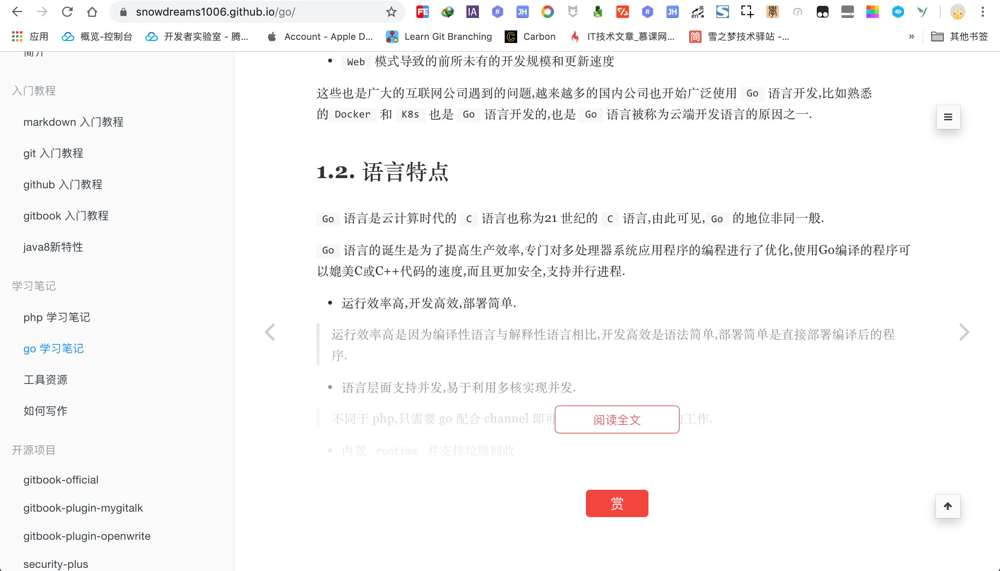

# 公众号引流

相信大多数博客作者都或多或少有过这样想法: 现在各种平台这么多,想要实现**全平台发布**就要到处**复制粘贴**,等我有空一定做**统一平台**一次性**全部解决**!

不知道正在阅读文章的你,有没有这样的想法?

反正我确实这么想过,甚至 `github` 上[相关项目](https://github.com/snowdreams1006/distribute-your-article)早已创建,**可一直迟迟没有下一步**,要么是工作忙,要么是技术储备不够,**总有一大堆借口自我安慰**!

如果只是专注于某一两家平台,这种需求可能不会那么强烈,可是如果你和我一样曾经手动复制粘贴过下面这么多平台,那么我相信你一定可以体会**一文多发的迫切性**!

[](https://github.com/snowdreams1006)
[](https://snowdreams1006.github.io/snowdreams1006-wechat-public.jpeg)
[](https://www.toutiao.com/c/user/86185341500/#mid=1624534658539532)
[](https://space.bilibili.com/236627025)
[](https://www.imooc.com/u/5224488/articles)
[](https://www.jianshu.com/u/577b0d76ab87)
[](https://snowdreams1006.blog.csdn.net/)
[](https://www.cnblogs.com/snowdreams1006/)
[](https://juejin.im/user/582d5cb667f356006331e586)
[](https://segmentfault.com/u/snowdreams1006)
[](https://my.oschina.net/snowdreams1006)
[](https://cloud.tencent.com/developer/user/2952369/activities)

幸运的是,在**一文多发**探索的路上并不孤单,不堪其扰的大佬们早已**说干就干动手解决**了这个问题,有的是**开源平台**,有的是 **`SAAS` 服务**,大家都在努力...

其中,`SAAS` 服务可能是最简单上手的方式了,这就是今天的主角: [`OpenWrite`](https://openwrite.cn/) 一文多发平台!

- 如果你热衷于写文**记录点滴**、**分享心得**
- 如果你钟情于 `markdown` 的**简洁**、流畅与纯粹
- 如果你专注于内容创作,而对很多**网络抄袭**无可奈何

那么,希望 [https://openwrite.cn/](https://openwrite.cn/) 可以帮助你！

## 一文多发

`OpenWrite` 提供的众多功能中最吸引我的地方莫过于**一文多发**功能了: 我在用的平台它都有,我没用的平台它也有!


还是熟悉的 `markdown` 编辑器,便捷的**自动认证**功能,发布文章再也不用**一处编辑,到处复制**了,顺便解决了一直令人困扰的**图片上传**问题.


> 目前已提供的平台中涵盖了绝大部分技术博客平台,相信以后会支持更多平台的吧,再也不用复制粘贴那么多次了呢!

平台整体上使用体验非常不错,大致步骤是先提前登陆各大目标平台,然后通过 `OpenWrite` 提供的插件自动进行渠道认证,配置各大渠道后就可以愉快发文啦!

稍微摸索下就能很快上手,在这里不再赘述了,不了解的小伙伴们可以看看 [技术文章博客，互联网运营平台 OpenWrite](https://openwrite.cn/openwrite/openwrite-1/)

## 公众号引流

如果你有自己**独立博客**,也在运营者**微信公众号**,但是苦于没有很好的手段**引导读者关注公众号**,那么`Openwrite` 推出的 `ReadMore` 工具绝对可以**解决燃眉之**急,真的可以说是良心之作!

- 效果怎么样看了就知道

**静态博客**网站集成 `ReadMore` 工具后,全站博客文章内容自动**隐藏一半**,同时浮现出**阅读全文**的按钮引导读者点击解锁.



一旦读者想要**阅读全文**就会主动**点击按钮**,此时就会自动弹出**引导用户关注公众号**的弹窗.


此时,用户有三种选择,要么扫码关注公众号解锁全站文章,要么掉头走人不再阅读,或者以其人之道还治其人之身,技术绕过直接解锁!

当然,我们自然是**希望所有的读者都可以转换成公众号粉丝**,所以接下来读者应该是关注公众号**回复关键字**获取验证码进而解锁文章.


读者**关注公众号**后,**发送关键字**获取文字链接并**点击该链接**,此时就会**获取验证码**,离成功只差一步!


再次回到博客平台的**受限文章**,**输入刚刚获取到的验证码**,不仅解锁了**当前文章**,博客内的其他文章也**全部自动解锁**,并不会造成不好体验,完美!


从**陌生读者**成**公众号粉丝**,整个操作流程**一气呵成**,没有丝毫卡顿也没有任何门槛,一切都是这么自然!

所以,如果你有**自主运营**的个人博客,想要转换成公众号粉丝,那么 `ReadMore` 工具简直就是**躺增粉丝**利器啊!

### 自主集成

`ReadMore` 工具集成步骤比较简单,按照相关官方教程说明,大致可以分为两步:


**如果博客文章比较少的话**,这么设置是任何没有问题的,大不了多**复制**一下就可以了.

**但是如果博客文章比较多**,肯定不能手动复制粘贴了,此时应该将该规则**自动应用到全部文章**中,如此一来,个人博客文章全部拥有该功能.

### 插件集成

熟悉了自主集成的基本思路后,不难发现,集成 `ReadMore` 工具只需要保证**个人博客**支持运行 `Js` 代码即可!

这个要求确实不高,哪怕是 `Gitbook + Github Pages` 搭建的静态网站也是支持运行 `Js` 代码的,更何况整合 `Github` 后还提供了免费域名,刚好满足 `ReadMore` 的条件.


说干就干,于是乎,花了一整晚的时间弄了 `gitbook` 插件来集成 `ReadMore` 工具.

- 安装 `openwrite` 插件

在 `book.json` 配置文件中,添加 `openwrite` 插件到 `plugins` 数组中,示例如下:

```json
{
    "plugins" : ["openwrite"]
}
```

声明插件后需要添加相关配置信息,来源于 `OpenWrite` 后台,**务必修改成自己真正的配置信息**!

```json
{
    "pluginsConfig":{
        "openwrite":{
            "blogId": "15702-1569305559839-744",
            "name": "雪之梦技术驿站",
            "qrcode": "https://snowdreams1006.github.io/snowdreams1006-wechat-public.jpeg",
            "keyword": "vip"
        }
    }
}
```

插件声明并配置后,通过 `gitbook` 或 `npm` 命令行方式安装 `openwrite` 插件到本地.

```bash
$ gitbook install
```

或者

```bash
$ npm install gitbook-plugin-openwrite
```

- 运行 `openwrite` 插件

本地运行 `gitbook serve` 命令后,赶快验证下是否成功通过 `gitbook-plugin-openwrite` 插件集成 `ReadMore` 工具吧!

如果没有问题的话,运行 `gitbook build` 生成的目标文件上传到 `github` 或其他静态服务器就能轻松集成 `ReadMore` 工具!

> 如果可以的话,欢迎给 [https://github.com/snowdreams1006/gitbook-plugin-openwrite](https://github.com/snowdreams1006/gitbook-plugin-openwrite) 一个 `Star` ,告诉我的确**有人在用**!

### 集成思路

按照 `OpenWrite` 官方 `ReadMore`工具 集成指南,关于博客设置部分只需要将自己的**专属配置信息**插入到**具体博客文章**中即可实现集成.

但是,**大多数博客平台**编写博客文章时都是编写 `markdown` 而不是 `html`,因而 不太方便直接插入 `js` 代码,**比较方便的做法**是修改**全局性质的模板文件**.

而关于 `gitbook` 的**模板文件**位于根目录下的 `_layouts/website/page.html` ,所以要么**直接修改模板**,要么通过**插件方式自定义模板**!

本来打算直接修改 `gitbook` 模板文件,但是**独乐乐不如众乐乐**,所以还是采用插件的方式扩展吧!

核心代码如下,修改模板文件,在文章内容外面包裹一层 `div` 作为目标区域并运行集成 `Js` 代码片段.

```html



<div id="vip-container">
    {{ page.content|safe }}
</div>



{{ super() }}
<script src="https://my.openwrite.cn/js/readmore.js" type="text/javascript"></script>
<script>
    const btw = new BTWPlugin();
    btw.init({
        "id": "vip-container",
        "blogId": "{{ config.pluginsConfig.openwrite.blogId }}",
        "name": "{{ config.pluginsConfig.openwrite.name }}",
        "qrcode": "{{ config.pluginsConfig.openwrite.qrcode }}",
        "keyword": "{{ config.pluginsConfig.openwrite.keyword }}"
    });
</script>

```

实现思路还是比较简单明确的,这里简单对其中的细节做些解释说明.

- 构建目标区域

```html

<div id="vip-container">
    {{ page.content|safe }}
</div>

```

`page.content` 是每个页面当前的文件内容,不再是原生的 `markdown` 类型而是 `html` 类型,这一点非常重要,因为 `gitbook` 并不会处理 `div` 内嵌的 `markdown` 内容!

> 之前一直尝试想通过 `Js` 方式**直接嵌套**一层目标区域 `div`,但是只找到 `markdown` **异步**转 `html` 的 `api` 导致无法集成,最后只能采用**修改模板**的方式.

而 `{{ page.content|safe }}` 表示的是当前页面的 `html` 内容,最后在原始内容外面嵌套一层 `div` 充当**目标区域**,其中 `id="vip-container"`.

- 插入集成代码

```js
<script src="https://my.openwrite.cn/js/readmore.js" type="text/javascript"></script>
<script>
    const btw = new BTWPlugin();
    btw.init({
        "id": "vip-container",
        "blogId": "{{ config.pluginsConfig.openwrite.blogId }}",
        "name": "{{ config.pluginsConfig.openwrite.name }}",
        "qrcode": "{{ config.pluginsConfig.openwrite.qrcode }}",
        "keyword": "{{ config.pluginsConfig.openwrite.keyword }}"
    });
</script>
```

`{{ config.pluginsConfig.openwrite.blogId }}` 表示读取的是 `gitbook` 关于 `openwrite` 插件的配置信息,这样一来集成代码就会自动插入到每一个页面中,从而省去了手动插入的麻烦,达到了自动化集成的目的.

> 上一步构建目标区域时设置了 `id="vip-container"` ,在这一步直接使用了该区域唯一标示,所以该配置项不必暴露给外部用户,因此配置项中没有 `id` .

- 使用者集成参考

关于插件原理部分的相关介绍,如果不懂的话也没有关系,直接上手能够用就好,下面提供非常基础的示例:

```json
{
    "title": "雪之梦技术驿站",
    "author": "snowdreams1006",
    "description": "雪之梦技术驿站又名snowdreams1006的技术小屋.主要分享个人的学习经验,一家之言,仅供参考.",
    "language": "zh-hans",
    "gitbook": "3.2.3",
    "plugins": [
        "openwrite"
    ],
    "pluginsConfig": {
        "openwrite":{
            "blogId": "15702-1569305559839-744",
            "name": "雪之梦技术驿站",
            "qrcode": "https://snowdreams1006.github.io/snowdreams1006-wechat-public.jpeg",
            "keyword": "vip"
        }
    }
}
```

> `book.json` 配置文件中的其他项可能省略了,这里只保留关于插件部分相关代码,完整示例参考: [https://github.com/snowdreams1006/gitbook-plugin-openwrite/tree/master/example](https://github.com/snowdreams1006/gitbook-plugin-openwrite/tree/master/example)

虽然本教程基于 `gitbook` 提供的**插件机制**进行集成 `ReadMore` 工具,但基本思路也适合其他平台: 最方便的做法是基于模板固定目标区域,然后配置相应的 `Js` 集成代码.

当然,**直接集成**是非常简单的,如果是基于**插件等集成形式**以提供给更多人使用的话,那可能就要研究一下**博客平台的接口文档**了.

## 懒人直达

- 声明并配置 `openwrite` 插件

```json
{
    ...
    "plugins": [
        "openwrite"
    ],
    "pluginsConfig": {
        "openwrite":{
            "blogId": "your blogId",
            "name": "your name",
            "qrcode": "your qrcode",
            "keyword": "your keyword"
        }
    }
}
```

> 注意修改成自己的配置信息,来源于 `OpenWrite` 后台,点击**使用**后第二步**关于博客设置**!

- 安装 `openwrite` 插件到本地

```bash
$ gitbook install
```

- 运行本地服务

```bash
$ gitbook serve
```

> 如果本地运行发现没有问题的话,恭喜你成功集成了公众号引流功能,稍后运行 `gitbook build` 命令后就可以上传静态网站到目标服务器了呢!

## 总结寄语

总体来说,`OpenWrite` 作为**一文多发平台**是非常优秀的,对于**多平台发布**的小伙伴来说简直就是福音,但是假如你并没有一文多发的需求,那可能对你的帮助并不是很大,因为连复制粘贴都不需要了啊!

但是,作为一个**有追求的技术分享者**,**个人博客用户转换成微信公众号粉丝**这一需求应该说更加普遍,再次感谢 `OpenWrite` 提供的 `ReadMore` 工具,原以为只有**动态博客**才能玩的套路没想到也可以用到**静态博客**身上!

最后考虑到基于 `Gitbook` 搭建的**静态博客**市面上并不少,其他小伙伴可能也有**类似需求**,所以做成了 `gitbook` 插件共享给大家,`gitbook-plugin-openwrite` 希望对大家有所帮助!

[](https://www.npmjs.com/package/gitbook-plugin-openwrite)
[](https://www.npmjs.com/package/gitbook-plugin-openwrite)
[](https://www.npmjs.com/package/gitbook-plugin-openwrite)
[](https://github.com/snowdreams1006)
[](https://snowdreams1006.github.io/snowdreams1006-wechat-public.jpeg)

- 项目地址: [https://github.com/snowdreams1006/gitbook-plugin-openwrite](https://github.com/snowdreams1006/gitbook-plugin-openwrite)
- 演示地址: [https://github.com/snowdreams1006/gitbook-plugin-openwrite/tree/master/example](https://github.com/snowdreams1006/gitbook-plugin-openwrite/tree/master/example)

## 参考链接

- [https://openwrite.cn/](https://openwrite.cn/)
- [还在搞公众号互推涨粉？OpenWrite推出增长神器，助你实现粉丝躺增！](https://openwrite.cn/openwrite/openwrite-readmore/)
- [WordPress 博客整合导流工具，博客导流到微信公众号](https://mp.weixin.qq.com/s/TkCB_y4-bfFpo6uHVV70bQ)
- [谈一谈博客的关注解锁文章功能](https://cuiqingcai.com/7463.html)
- [牛掰！我是这么把博客粉丝转到公众号的](https://mp.weixin.qq.com/s/5jYWz8H0_-qBKIr-vFzRNQ)