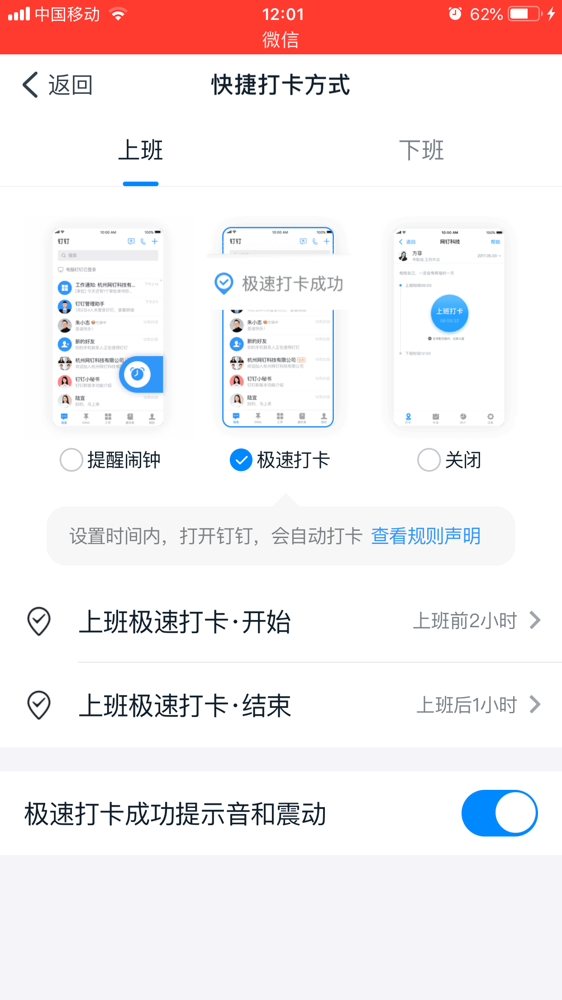
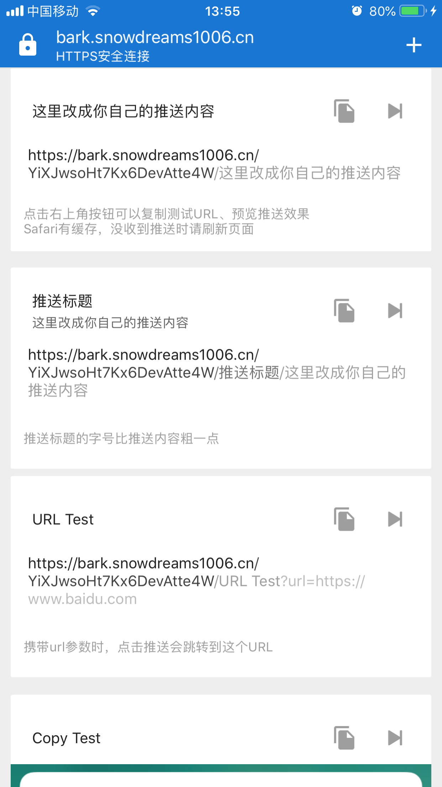
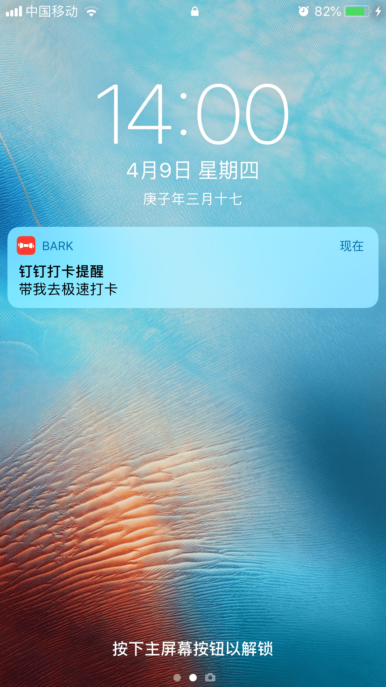

# 钉钉签到提醒

本文主要介绍如何使用使用现成的免费软件快速实现简单的钉钉自动签到功能,步骤非常设置于无需任何编程基础的小白也能轻松实现定时自动打卡.

通过本节课程,你将学习到以下内容:

- 怎么开启钉钉极速打卡功能;
- 如何唤醒手机中的知名软件;
- 如何自己给自己发推送提醒;
- 如何运行24h不间断定时程序.

## 本节目录大纲


```markdown
- 钉钉签到提醒
    - 前言
        + 提醒闹钟
        + 极速打卡
    - 原理
        + 极速打卡
        + URL Scheme
        + 定时唤醒
    - 实现
        + 钉钉设置
        + 唤醒链接
        + 定时唤醒
    - 总结
```


<!-- toc -->

## 前言

**关键词**

```mardown
+ 提醒闹钟
+ 极速打卡
```

现如今钉钉已经成为全国性的 app,不仅工作中的上班族正在使用,连小学生也不放过,直播网课大多数首选钉钉,不得不说钉钉真的是让人又爱又恨!

最简单也是个人使用频率最高的的打卡签到功能让我忍不住吐槽,打卡签到提醒方式只有两种还是单选,要么设置闹钟要么设置极速打卡!



简单流程如下:


上述流程中让我觉得不爽的是每次打卡都要**自己心里盘算着打卡时间**,所以有时候可能就会忘记,错过了打卡时间,事情虽然小但需要浪费脑容量未免有些伤神,因此需要一种更加傻瓜式操作流程来解放大脑,让我沉浸在工作中吧!

## 原理

钉钉签到打卡只有两种快捷方式可供选择,相比于提醒闹钟而言个人更偏爱极速打卡,只要在设置的打卡时间内打开 app 就会自动打卡,因此接下来要简化的流程中只需要实现定时进入 app 即可实现自动打卡功能.

**关键词**

```mardown
+ 极速打卡
+ URL Scheme
+ 定时唤醒
```

只要开启 app 的极速打卡功能,只要在规定的打卡时间内手动打开 app 就会自动签到,所以接下来我们需要想办法实现如何打开 app.

在众多唤醒手机中知名 app 的解决方案中有一种比较简单的方式,那就是 `URL Scheme` 方案.

**自定义 URL Scheme 协议**

> [常用的URL Scheme](https://www.cnblogs.com/guoshaobin/p/11163919.html)

`URL Scheme` 是一种页面跳转协议,类似于网页中的 `url` 链接,常用于 h5 网站引流到 app 应用的跳转访问,一般可由 app 自定义协议头.

例如: 钉钉的跳转协议是 `dingtalk://具体什么内容由钉钉自主规定` ,如果是普通的 `url` 链接用户点击就会跳转到指定网页,而 `URL Scheme` 链接点击后就会跳转到相应的 app 界面.

- `url` 链接演示 : [https://snowdreams1006.tech/](https://snowdreams1006.tech/)

- `URL Scheme` 链接演示 : [dingtalk://snowdreams1006.tech/](dingtalk://snowdreams1006.tech/)

所以只要在浏览器中访问到类似于 [dingtalk://snowdreams1006.tech/](dingtalk://snowdreams1006.tech/) 这样的链接就能实现自动跳转到钉钉 app 中,既然已经解决了如何打开 app 的问题,那么接下来的事情就是什么时候访问链接的问题了.

**不知疲倦的crontab定时程序**

对于编程开发者来说,实现定时程序的最简单方式之一当属于 `crontab` 命令了,属于 `linux` 环境的基本命令之一,可用来执行定时程序,类似于日程表的功能.

> 基本语法: `crontab [ -u user ] { -l | -r | -e }`,可参考: [Linux crontab 命令](https://www.runoob.com/linux/linux-comm-crontab.html)

```bash
# 早上 8 点半和下午 5 点半运行 dingtalk.sh 脚本文件并将运行结果写入到 dingtalk.log 文件
30 08,17 * * * sudo ~/reminder/dingtalk.sh >> ~/reminder/dingtalk.log
```

现在搞定了定时运行脚本程序的问题,接下来的事情就比较简单了,在 24h 不间断运行的服务器上需要定时执行什么命令才能实现用户实现访问到自定义链接呢?

**狗吠狼吼bark给自己推送通知**

> Bark is an iOS App which allows you to push customed notifications to your iPhone : [https://github.com/Finb/Bark](https://github.com/Finb/Bark)

很显然,我们需要一款推送服务,服务器定时下发推送给用户手机,由用户点击推送跳转到自定义协议网页,紧接着就会触发钉钉 app 的唤醒操作,从而实现自动打卡功能.

手机上的 app 应用一大堆,推送内容都是由 app 自主控制,用户只能选择开启或关闭通知功能,并不能决定通知内容,而 `bark` 却是一款自己给自己发推送通知的软件,简单且开源.

```bash
# 点击推送将跳转到url的地址（发送时，URL参数需要编码）
https://api.day.app/yourkey/百度网址?url=https://www.baidu.com 
```



只要访问指定链接就能发送推送知给用户手机,用户点击通知就能跳转到指定网页,从而实现唤醒钉钉 app 的目的.

```bash
# bark 客户端和服务器均开源,可以独立部署也可以使用默认服务.
https://api.day.app/yourkey/钉钉打卡提醒/带我去极速打卡?url=dingtalk://snowdreams1006.tech
```

**命令行curl网络请求神器**

> [curl 的用法指南](http://www.ruanyifeng.com/blog/2019/09/curl-reference.html)

构造出推送通知请求链接后,只需要访问该链接就能完成推送通知,由用户直接操作的话可以复制到浏览器直接回车即可,但是如果要用程序运行的话就需要使用脚本命令 `curl` 神器.

```bash
curl -i -X GET \
 "https://bark.snowdreams1006.cn/YiXJwsoHt7Kx6DevAtte4W/%E9%92%89%E9%92%89%E6%89%93%E5%8D%A1%E6%8F%90%E9%86%92/%E5%B8%A6%E6%88%91%E5%8E%BB%E6%9E%81%E9%80%9F%E6%89%93%E5%8D%A1?url=dingtalk://snowdreams1006.tech"
```



现在总算实现了定时推送通知打开钉钉 app 实现自动签到的功能,其实整个流程并不复杂,解决的是钉钉 app 并没有提供定时自动签到的功能这一问题.

## 总结

