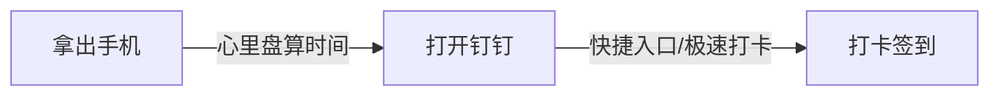

# 钉钉签到提醒

本文主要介绍如何使用使用现成的免费软件快速实现简单的钉钉自动签到功能,步骤非常设置于无需任何编程基础的小白也能轻松实现定时自动打卡.

通过本节课程,你将学习到以下内容:

- 怎么开启钉钉极速打卡功能;
- 如何唤醒手机中的知名软件;
- 如何自己给自己发推送提醒;
- 如何运行24h不间断定时程序.

## 本节目录大纲


```markdown
- 钉钉签到提醒
    - 前言
        + 提醒闹钟
        + 极速打卡
    - 原理
        + 极速打卡
        + URL Scheme
        + 定时唤醒
    - 实现
        + 钉钉设置
        + 唤醒链接
        + 定时唤醒
    - 总结
```


<!-- toc -->

## 前言

**关键词**

```mardown
+ 提醒闹钟
+ 极速打卡
```

现如今钉钉已经成为全国性的 app,不仅工作中的上班族正在使用,连小学生也不放过,直播网课大多数首选钉钉,不得不说钉钉真的是让人又爱又恨!

最简单也是个人使用频率最高的的打卡签到功能让我忍不住吐槽,打卡签到提醒方式只有两种还是单选,要么设置闹钟要么设置极速打卡!


简单流程如下:



上述流程中让我觉得不爽的是每次打卡都要**自己心里盘算着打卡时间**,所以有时候可能就会忘记,错过了打卡时间,事情虽然小但需要浪费脑容量未免有些伤神,因此需要一种更加傻瓜式操作流程来解放大脑,让我沉浸在工作中吧!

## 原理

钉钉签到打卡只有两种快捷方式可供选择,相比于提醒闹钟而言个人更偏爱极速打卡,只要在设置的打卡时间内打开 app 就会自动打卡,因此接下来要简化的流程中只需要实现定时进入 app 即可实现自动打卡功能.

**关键词**

```mardown
+ 极速打卡
+ URL Scheme
+ 定时唤醒
```

