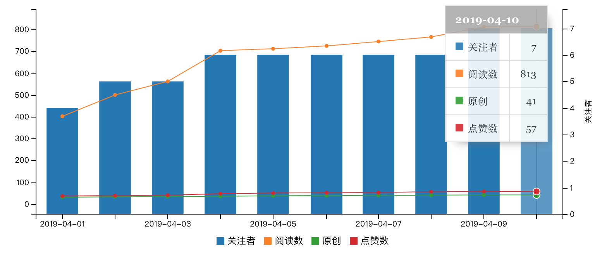
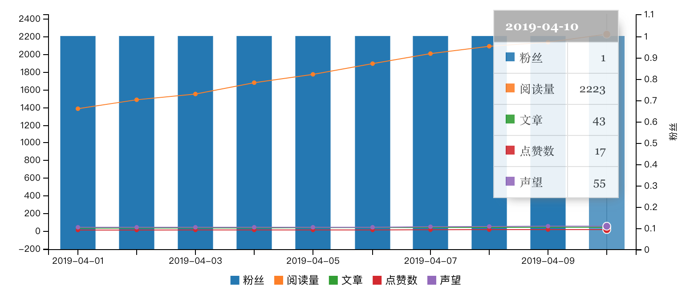
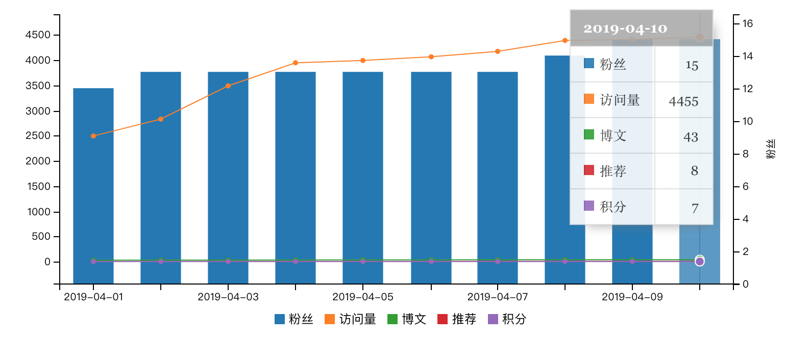
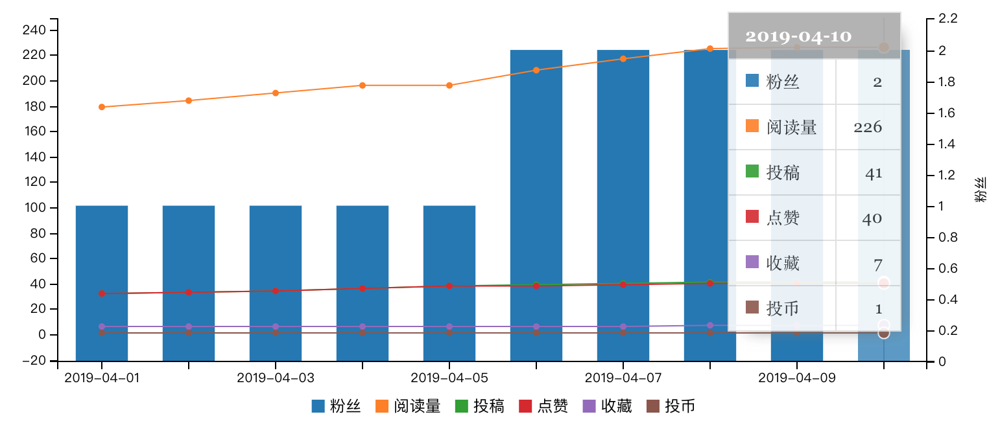

# 历史统计

## 2019年04月

### 全网统计

```
{
    "data": {
        "x": "x",
        "columns": [
            ["x","2019-04-01","2019-04-02","2019-04-03"],
            ["粉丝",58,60,59],
            ["阅读",13809,14757,15707]
        ],
        "axes": {
            "粉丝": "y2"
        },
        "types": {
            "粉丝": "bar"
        }
    },
    "axis": {
      "x": {
        "type": "timeseries",
        "tick": {
            "format": "%Y-%m-%d"
        }
      },
      "y2": {
        "show": "true",
        "label": {
          "text": "粉丝,
          "position": "outer-middle"
        }
      }
    }
}
```


### 平台统计

#### 慕课手记

> [慕课手记][imooc] : https://www.imooc.com/u/5224488/articles


{
    "data": {
        "x": "x",
        "columns": [
            ["x","2019-04-01","2019-04-02","2019-04-03","2019-04-04"],
            ["粉丝",8,8,8,9],
            ["阅读量",3508,3645,3650,4356],
            ["手记",32,33,34,36],
            ["推荐",36,36,37,39],
            ["积分",107,118,118,130]
        ],
        "axes": {
            "粉丝": "y2"
        },
        "types": {
            "粉丝": "bar"
        }
    },
    "axis": {
      "x": {
        "type": "timeseries",
        "tick": {
            "format": "%Y-%m-%d"
        }
      },
      "y2": {
        "show": "true",
        "label": { 
          "text": "粉丝",
          "position": "outer-middle"
        }
      } 
    }
}


[other-static-imooc-201904.png](./images/other-static-imooc-201904.png)

#### 简书

> [简书][jianshu] : https://www.jianshu.com/u/577b0d76ab87


{
    "data": {
        "x": "x",
        "columns": [
            ["x","2019-04-01","2019-04-02","2019-04-03","2019-04-04"],
            ["粉丝",7,7,6,7],
            ["阅读量",343,335,342,358],
            ["文章",33,34,35,37],
            ["喜欢",57,58,59,60],
            ["简书钻",27,28,28,9]
        ],
        "axes": {
            "粉丝": "y2"
        },
        "types": {
            "粉丝": "bar"
        }
    },
    "axis": {
      "x": {
        "type": "timeseries",
        "tick": {
            "format": "%Y-%m-%d"
        }
      },
      "y2": {
        "show": "true",
        "label": { 
          "text": "粉丝",
          "position": "outer-middle"
        }
      }
    }
}


[other-static-jianshu-201904.png](./images/other-static-jianshu-201904.png)

#### CSDN

> [CSDN][csdn] : https://blog.csdn.net/weixin_38171180


{
    "data": {
        "x": "x",
        "columns": [
            ["x","2019-04-01","2019-04-02","2019-04-03","2019-04-04"],
            ["粉丝",1,1,1,1],
            ["访问量",1565,1634,1665,1705],
            ["原创",31,32,33,34],
            ["喜欢",31,32,33,34],
            ["积分",353,364,376,397]
        ],
        "axes": {
            "粉丝": "y2"
        },
        "types": {
            "粉丝": "bar"
        }
    },
    "axis": {
      "x": {
        "type": "timeseries",
        "tick": {
            "format": "%Y-%m-%d"
        }
      },
      "y2": {
        "show": "true",
        "label": {
          "text": "粉丝",
          "position": "outer-middle"
        }
      }
    }
}


[other-static-csdn-201904.png](./images/other-static-csdn-201904.png)

#### 博客园

> [博客园][cnblogs] : https://www.cnblogs.com/snowdreams1006/


{
    "data": {
        "x": "x",
        "columns": [
            ["x","2019-04-01","2019-04-02","2019-04-03","2019-04-04"],
            ["粉丝",17,17,17,18],
            ["阅读数",3889,4096,4207,4388],
            ["随笔",31,32,33,34],
            ["评论数",16,16,16,16]
        ],
        "axes": {
            "粉丝": "y2"
        },
        "types": {
            "粉丝": "bar"
        }
    },
    "axis": {
      "x": {
        "type": "timeseries",
        "tick": {
            "format": "%Y-%m-%d"
        }
      },
      "y2": {
        "show": "true",
        "label": {
          "text": "粉丝",
          "position": "outer-middle"
        }
      }
    }
}


[other-static-cnblogs-201904.png](./images/other-static-cnblogs-201904.png)

#### 掘金

> [掘金][juejin] : https://juejin.im/user/582d5cb667f356006331e586

```
{
    "data": {
        "x": "x",
        "columns": [
            ["x","2019-04-01","2019-04-02","2019-04-03"],
            ["关注者",4,5,5],
            ["阅读数",402,500,562],
            ["原创",31,32,33],
            ["点赞数",36,38,40]
        ],
        "axes": {
            "关注者": "y2"
        },
        "types": {
            "关注者": "bar"
        }
    },
    "axis": {
      "x": {
        "type": "timeseries",
        "tick": {
            "format": "%Y-%m-%d"
        }
      },
      "y2": {
        "show": "true",
        "label": {
          "text": "关注者,
          "position": "outer-middle"
        }
      }
    }
}
```



#### 思否

> [思否][segmentfault] : https://segmentfault.com/blog/snowdreams1006

```
{
    "data": {
        "x": "x",
        "columns": [
            ["x","2019-04-01","2019-04-02","2019-04-03"],
            ["粉丝",1,1,1],
            ["阅读量",1382,1483,1548],
            ["文章",33,34,35],
            ["点赞数",12,12,13],
            ["声望",43,43,43]
        ],
        "axes": {
            "粉丝": "y2"
        },
        "types": {
            "粉丝": "bar"
        }
    },
    "axis": {
      "x": {
        "type": "timeseries",
        "tick": {
            "format": "%Y-%m-%d"
        }
      },
      "y2": {
        "show": "true",
        "label": {
          "text": "粉丝,
          "position": "outer-middle"
        }
      }
    }
}
```



#### 开源中国

> [开源中国][oschina] : https://my.oschina.net/snowdreams1006

```
{
    "data": {
        "x": "x",
        "columns": [
            ["x","2019-04-01","2019-04-02","2019-04-03"],
            ["粉丝",12,13,13],
            ["访问量",2496,2831,3490],
            ["博文",33,34,35],
            ["推荐",6,7,7],
            ["积分",5,5,6]
        ],
        "axes": {
            "粉丝": "y2"
        },
        "types": {
            "粉丝": "bar"
        }
    },
    "axis": {
      "x": {
        "type": "timeseries",
        "tick": {
            "format": "%Y-%m-%d"
        }
      },
      "y2": {
        "show": "true",
        "label": {
          "text": "粉丝,
          "position": "outer-middle"
        }
      }
    }
}
```



#### B站专栏

> [B站专栏][bilibili] : https://space.bilibili.com/236627025

```
{
    "data": {
        "x": "x",
        "columns": [
            ["x","2019-04-01","2019-04-02","2019-04-03"],
            ["粉丝",1,1,1],
            ["阅读量",179,184,190],
            ["投稿",32,33,34],
            ["点赞",32,33,34],
            ["收藏",6,6,6],
            ["投币",1,1,1]
        ],
        "axes": {
            "粉丝": "y2"
        },
        "types": {
            "粉丝": "bar"
        }
    },
    "axis": {
      "x": {
        "type": "timeseries",
        "tick": {
            "format": "%Y-%m-%d"
        }
      },
      "y2": {
        "show": "true",
        "label": {
          "text": "粉丝,
          "position": "outer-middle"
        }
      }
    }
}
```



#### 微信公众号

> [微信公众号][weixin] : https://mp.weixin.qq.com/

```
{
    "data": {
        "x": "x",
        "columns": [
            ["x","2019-04-01","2019-04-02","2019-04-03"],
            ["粉丝",7,7,7],
            ["阅读量",45,49,53],
            ["文章",30,31,32],
            ["点赞",13,14,15]
        ],
        "axes": {
            "粉丝": "y2"
        },
        "types": {
            "粉丝": "bar"
        }
    },
    "axis": {
      "x": {
        "type": "timeseries",
        "tick": {
            "format": "%Y-%m-%d"
        }
      },
      "y2": {
        "show": "true",
        "label": {
          "text": "粉丝,
          "position": "outer-middle"
        }
      }
    }
}
```


## 2019年03月

### 2019-03-31

- [简书][jianshu] : `5`粉丝,`32`文章,`32755`字数,`56`收获喜欢,`27`简书钻.
- [CSDN][csdn] : `30`原创,`1`粉丝,`30`喜欢,`0`评论,`1399`访问,`342`积分,`28万+`排名.
- [博客园][cnblogs] : `30`随笔,`0`文章,`17`粉丝,`16`评论.
- [掘金][juejin] : `30`原创,`4`关注者,`35`点赞数,`396`阅读数.
- [开源中国][oschina] : `32`博文,`6`推荐,`11`粉丝,`4`积分,`123`访问.
- [segmentfault][segmentfault] : `32`文章,`1`粉丝,`43`声望,`1217`阅读量,`13`点赞数.
- [慕课手记][imooc] : `31`手记,`42165`经验,`88`积分,`8`粉丝.
- [B站专栏][bilibili] : `172`阅读量`+7`,`2`评论`0`,`31`点赞`+0`,`6`收藏`+0`,`1`投币`0`.
- [微信公众号][weixin] : `25`阅读,`0`转发,`0`收藏,`7`用户,`1`新增,`0`取关.

### 2019-03-30

- [简书][jianshu] : `5`粉丝,`31`文章,`31653`字数,`55`收获喜欢,`27`简书钻.
- [CSDN][csdn] : `29`原创,`1`粉丝,`29`喜欢,`0`评论,`1384`访问,`331`积分,`29万+`排名.
- [博客园][cnblogs] : `28`随笔,`0`文章,`16`粉丝,`16`评论.
- [掘金][juejin] : `29`原创,`4`关注者,`34`点赞数,`393`阅读数,`0`评论数.
- [开源中国][oschina] : `31`博文,`6`推荐,`11`粉丝,`4`积分,`212`访问.
- [segmentfault][segmentfault] : `31`文章,`1`粉丝,`40`声望,`1174`阅读量,`12`点赞数.
- [慕课手记][imooc] : `30`手记,`42165`经验,`87`积分,`7`粉丝.
- [B站专栏][bilibili] : `172`阅读量`+7`,`2`评论`0`,`31`点赞`+0`,`6`收藏`+1`,`1`投币`0`.
- [微信公众号][weixin] : `25`阅读,`0`转发,`0`收藏,`6`用户,`0`新增,`0`取关.

### 2019-03-29

- [简书][jianshu] : `4`粉丝,`29`文章,`28905`字数,`53`收获喜欢,`26`简书钻.
- [CSDN][csdn] : `28`原创,`1`粉丝,`27`喜欢,`0`评论,`1348`访问,`309`积分,`29万+`排名.
- [博客园][cnblogs] : `27`随笔,`0`文章,`16`粉丝,`16`评论.
- [掘金][juejin] : `28`原创,`4`关注者,`32`点赞数,`388`阅读数,`0`评论数.
- [开源中国][oschina] : `29`博文,`6`推荐,`10`粉丝,`4`积分,`378`访问.
- [segmentfault][segmentfault] : `29`文章,`1`粉丝,`40`声望,`1094`阅读量,`12`点赞数.
- [慕课手记][imooc] : `28`手记,`42165`经验,`76`积分,`6`粉丝.
- [B站专栏][bilibili] : `165`阅读量`+13`,`2`评论`0`,`31`点赞`+4`,`6`收藏`+1`,`1`投币`0`.
- [微信公众号][weixin] : `38`阅读,`0`转发,`0`收藏,`6`用户,`0`新增,`0`取关.

### 2019-03-28

- [简书][jianshu] : `1`粉丝,`28`文章,`28170`字数,`52`收获喜欢,`25`简书钻.
- [CSDN][csdn] : `27`原创,`1`粉丝,`26`喜欢,`0`评论,`1300`访问,`297`积分,`31万+`排名.
- [博客园][cnblogs] : `27`随笔,`0`文章,`16`粉丝,`16`评论.
- [掘金][juejin] : `25`原创,`4`关注者,`29`点赞数,`383`阅读数,`0`评论数.
- [开源中国][oschina] : `26`博文,`5`推荐,`10`粉丝,`4`积分,`282`访问.
- [segmentfault][segmentfault] : `26`文章,`1`粉丝,`28`声望,`971`阅读量,`8`点赞数.
- [慕课手记][imooc] : `25`手记,`42085`经验,`56`积分,`6`粉丝.
- [B站专栏][bilibili] : `152`阅读量`+7`,`2`评论`0`,`27`点赞`+1`,`5`收藏`+1`,`1`投币`0`.
- [微信公众号][weixin] : `22`阅读,`0`转发,`0`收藏,`6`用户,`0`新增,`0`取关.

### 2019-03-27

- [简书][jianshu] : `1`粉丝,`27`文章,`27348`字数,`50`收获喜欢,`25`简书钻.
- [CSDN][csdn] : `26`原创,`1`粉丝,`25`喜欢,`0`评论,`1267`访问,`287`积分,`32万+`排名.
- [博客园][cnblogs] : `25`随笔,`0`文章,`16`粉丝,`16`评论.
- [掘金][juejin] : `24`原创,`4`关注者,`28`点赞数,`382`阅读数,`0`评论数.
- [开源中国][oschina] : `25`博文,`5`推荐,`10`粉丝,`4`积分,`196`访问.
- [segmentfault][segmentfault] : `25`文章,`1`粉丝,`14`声望,`893`阅读量,`5`点赞数.
- [慕课手记][imooc] : `24`手记,`41985`经验,`55`积分,`6`粉丝.
- [B站专栏][bilibili] : `145`阅读量`+7`,`2`评论`0`,`26`点赞`+1`,`4`收藏`0`,`1`投币`0`.
- [微信公众号][weixin] : `16`阅读,`0`转发,`0`收藏,`6`用户,`0`新增,`0`取关.

### 2019-03-26

- [简书][jianshu] : `1`粉丝,`26`文章,`26658`字数,`49`收获喜欢,`24`简书钻.
- [CSDN][csdn] : `25`原创,`1`粉丝,`23`喜欢,`0`评论,`1219`访问,`275`积分,`35万+`排名.
- [博客园][cnblogs] : `24`随笔,`0`文章,`12`粉丝,`14`评论.
- [掘金][juejin] : `23`原创,`4`关注者,`27`点赞数,`375`阅读数,`0`评论数.
- [开源中国][oschina] : `24`博文,`3`推荐,`6`粉丝,`4`积分,`123`访问.
- [segmentfault][segmentfault] : `24`文章,`0`粉丝,`14`声望,`817`阅读量,`4`点赞数.
- [慕课手记][imooc] : `23`手记,`41895`经验,`45`积分,`4`粉丝.
- [B站专栏][bilibili] : `138`阅读量`+34`,`2`评论`0`,`25`点赞`+2`,`4`收藏`0`,`1`投币`0`.
- [微信公众号][weixin] : `20`文章,`36`阅读,`0`转发,`0`收藏,`6`用户,`2`新增,`0`取关.

### 2019-03-25

- [简书][jianshu] : `0`粉丝,`25`文章,`26075`字数,`28`收获喜欢,`24`简书钻.
- [CSDN][csdn] : `24`原创,`1`粉丝,`23`喜欢,`0`评论,`1188`访问,`265`积分,`35万+`排名.
- [博客园][cnblogs] : `23`随笔,`0`文章,`11`粉丝,`14`评论.
- [掘金][juejin] : `22`原创,`4`关注者,`26`点赞数,`367`阅读数,`0`评论数.
- [开源中国][oschina] : `23`博文,`3`推荐,`5`粉丝,`2`积分,`45`访问.
- [segmentfault][segmentfault] : `23`文章,`0`粉丝,`14`声望,`779`阅读量,`4`点赞数.
- [慕课手记][imooc] : `22`手记,`41855`经验,`33`积分,`4`粉丝.
- [B站专栏][bilibili] : `98`阅读量`+12`,`2`评论`2`,`22`点赞`+2`,`3`收藏`+0`,`1`投币`+1`.

### 2019-03-24

- [简书][jianshu] : `0`粉丝,`24`文章,`23850`字数,`27`收获喜欢,`24`简书钻.
- [CSDN][csdn] : `23`原创,`1`粉丝,`23`喜欢,`0`评论,`1151`访问,`255`积分,`36万+`排名.
- [博客园][cnblogs] : `22`随笔,`0`文章,`10`粉丝,`14`评论.
- [掘金][juejin] : `21`原创,`4`关注者,`25`点赞数,`361`阅读数,`0`评论数.
- [开源中国][oschina] : `22`博文,`2`推荐,`4`粉丝,`2`积分,`34`访问.
- [segmentfault][segmentfault] : `22`文章,`0`粉丝,`11`声望,`747`阅读量,`3`点赞数.
- [慕课手记][imooc] : `21`手记,`41835`经验,`19`积分,`2`粉丝.
- [B站专栏][bilibili] : `86`阅读量`+4`,`0`评论`0`,`20`点赞`0`,`3`收藏`+0`,`0`投币`0`.

### 2019-03-23

- [简书][jianshu] : `0`粉丝,`23`文章,`21331`字数,`26`收获喜欢,`24`简书钻.
- [CSDN][csdn] : `22`原创,`1`粉丝,`21`喜欢,`0`评论,`1123`访问,`243`积分,`37万+`排名.
- [博客园][cnblogs] : `21`随笔,`0`文章,`9`粉丝,`14`评论.
- [掘金][juejin] : `20`原创,`4`关注者,`24`点赞数,`356`阅读数,`0`评论数.
- [开源中国][oschina] : `21`博文,`2`推荐,`4`粉丝,`2`积分,`180`访问.
- [segmentfault][segmentfault] : `21`文章,`0`粉丝,`5`声望. 
- [慕课手记][imooc] : `20`手记,`41835`经验,`19`积分,`2`粉丝.
- [B站专栏][bilibili] : `82`阅读量`+23`,`0`评论`0`,`20`点赞`+5`,`3`收藏`+0`,`0`投币`0`.

### 2019-03-22

- [简书][jianshu] : `0`粉丝,`22`文章,`20543`字数,`25`收获喜欢,`24`简书钻.
- [CSDN][csdn] : `21`原创,`1`粉丝,`21`喜欢,`0`评论,`1078`访问,`233`积分,`38万+`排名.
- [博客园][cnblogs] : `20`随笔,`0`文章,`9`粉丝,`12`评论.
- [掘金][juejin] : `19`原创,`4`关注者,`23`点赞数,`352`阅读数,`0`评论数.
- [开源中国][oschina] : `20`博文,`2`推荐,`4`粉丝,`1`积分,`178`访问.
- [segmentfault][segmentfault] : `19`文章,`0`粉丝,`5`声望. 
- [慕课手记][imooc] : `18`手记,`41645`经验,`18`积分,`1`粉丝.
- [B站专栏][bilibili] : `59`阅读量`+20`,`0`评论`0`,`15`点赞`+8`,`3`收藏`+1`,`0`投币`0`.

### 2019-03-21

- [简书][jianshu] : `0`粉丝,`20`文章,`18420`字数,`23`收获喜欢,`23`简书钻.
- [CSDN][csdn] : `19`原创,`1`粉丝,`19`喜欢,`0`评论,`974`访问,`211`积分,`96万+`排名.
- [博客园][cnblogs] : `18`随笔,`0`文章,`5`粉丝,`4`评论.
- [掘金][juejin] : `17`原创,`4`关注者,`20`点赞数,`295`阅读数,`0`评论数.
- [开源中国][oschina] : `18`博文,`1`推荐,`3`粉丝,`0`积分,`160`访问.
- [segmentfault][segmentfault] : `18`文章,`0`粉丝,`5`声望. 
- [慕课手记][imooc] : `16`手记,`41615`经验,`14`积分,`1`粉丝.


<!-- 链接引用 -->
[jianshu]: https://www.jianshu.com/u/577b0d76ab87 "雪之梦技术驿站"
[csdn]: https://blog.csdn.net/weixin_38171180 "雪之梦技术驿站"
[cnblogs]: https://www.cnblogs.com/snowdreams1006/ "雪之梦技术驿站"
[juejin]: https://juejin.im/user/582d5cb667f356006331e586 "雪之梦技术驿站"
[oschina]: https://my.oschina.net/snowdreams1006 "雪之梦技术驿站"
[segmentfault]: https://segmentfault.com/blog/snowdreams1006 "雪之梦技术驿站"
[imooc]: https://www.imooc.com/u/5224488/articles "雪之梦技术驿站"
[bilibili]: https://space.bilibili.com/236627025 "雪之梦技术驿站"
[weixin]: https://mp.weixin.qq.com/cgi-bin/home?t=home/index&lang=zh_CN&token=641790288 "雪之梦技术驿站"
