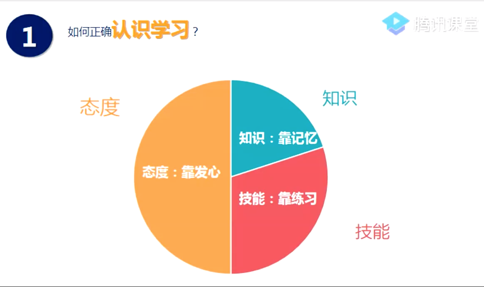
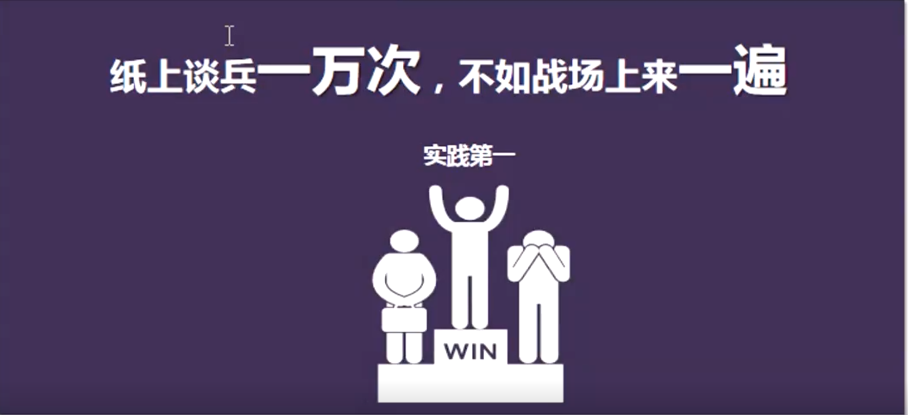
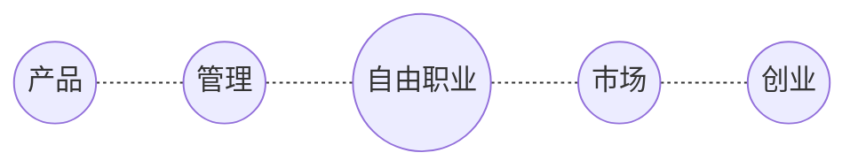
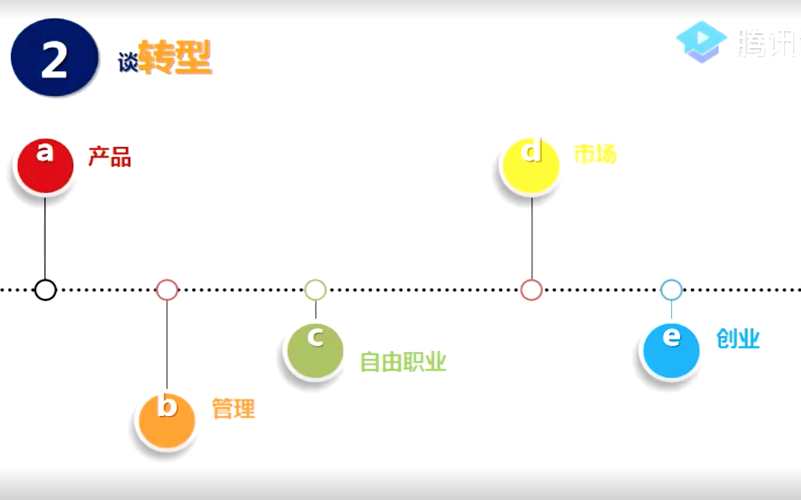
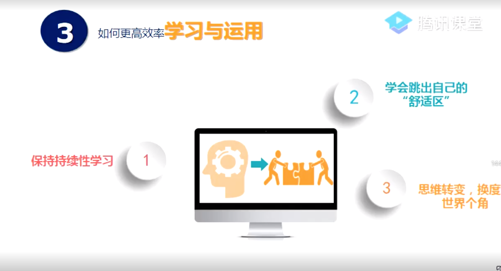
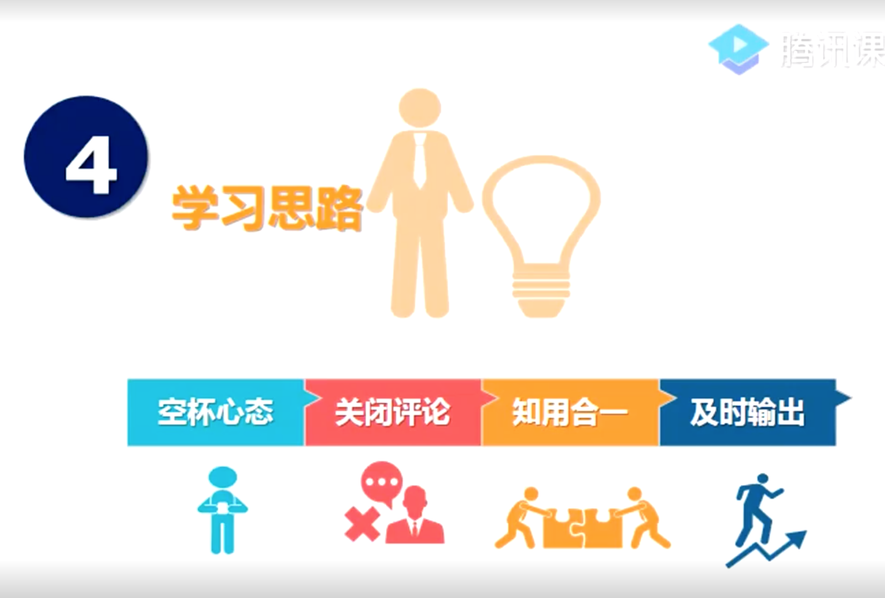
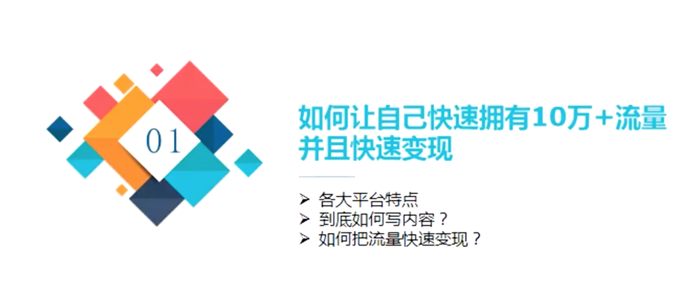

# 程序员转型之路

> 视频来自腾讯课堂: [程序员转型之路](https://ke.qq.com/course/390285#term_id=100465433)

## 如何学习?什么叫理财?

### 01.如何正确**认识学习**?

- 知识: 靠记忆 (20%)
- 技能: 靠练习 (30%)
- 态度: 靠发心 (50%)

纸上谈兵**一万次**,不如战场**来一遍**

### 02.谈**转型**

### 03.如何更高效**学习与运用**

1. 保持持续性学习
2. 学会跳出自己的"舒适区"
3. 思维转变,换个角度看世界

### 04.学习思路

## 如何让自己快速拥有10万+流量,并且快速变现

### 各大平台特点

### 到底如何写内容

### 如何把流量快速变现

## 如何写出可以直接收钱的文案

## 如何30分钟学会演讲,客服种种心里障碍

## 如何复制转型成功的程序员称为自有职业者,月收入是5万+