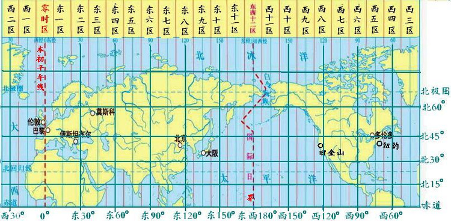

# 关于时区的那点事

## 科普一下什么是时区

众所周知,地球绕着太阳转的同时也会自转,因此同一时刻不同地区所接收到太阳照射的情况不同,所以有的地区是日出,有的地区是日落,还有的地区可能是黑夜.

既然地球上的不同地区时间不同,那总要有统一的时间刻度才能方便文化科技交流吧,不然大家说的都是当地时间,这样岂不是乱套了?

有问题就要解决问题,不同地区时间不同就要统一时间标准,而统一时间标准的前提就是要弄清楚全球的时间差异到底在哪以及各地的当地时间如何互相转换.

原来的时间标准是**格林尼治标准时间**,随着精确计时的发展需要,已被新的时间标准所取代,目前的时间标准是**世界协调时**.

现在有了统一的时间标准,不同地区的时间就可以统一换算成世界协调时再转换成当地时间了,再也不会出现同一时刻不同时间了!

示例:

- 北京时间(`UTC+8`) : `2019-05-30 13:30:00`
- 世界时间(`UTC`) : `2019-05-30 05:30:00`
- 东部时间(`UTC-5`) : `2019-05-30 00:30:00`

### 格林尼治标准时间

> **格林尼治标准时间**(又称**格林威治平均时间**或**格林威治标准时间**,英文是**GreenwichMeanTime**,简称**GMT** ),格林尼治标准时间的正午是指当太阳横穿**格林尼治子午线**时(也就是在格林尼治时)的时间.

**格林尼治**是英国伦敦的一个小镇,是**地理经度**的起点,**本初子午线**所在的经度是**零度经度,**所在的时区是**零时区**.

我们知道一天共有 `24` 小时,对应着全球 `24` 个时区,而地球**自西向东**自转,零时区后依次是东一区到东十一区,然后是东十二区.紧接着是西十二区,西十一区到西一区,最后又回到零时区.

> 其中东十二区和西十二区是**同一个时区**,又被称为**东西十二区**.

总的来说,时区分为东十二区和西十二区以及零时区,其中东西十二区是同一个时区,因此共有 `24` 个时区.



示例:

由于北京位于东八区,比零时区多个 `8` 个时区,意味着北京时间比格林标准时间**快** `8` 个小时.

所以,北京时间中午 12 点整的时候,格林尼治才清早 4 点钟,估计还在睡觉呢! ( `GMT+8` 就是北京时间)

> 格林尼治标准时间与**地球自转**有关,不能满足精确计时的需求,因此不再作为**标准时间**,取而代之的是协调世界时.

### 协调世界时

> **协调世界时**(又称**世界统一时间**或**世界标准时间**或**国际协调时间**,英文是**Coordinated Universal Time**,简称**UTC** ),协调世界时是以**原子时**秒长为基础,在时刻上尽量接近于**格林尼治标准时间**的一种时间计量系统.

在**不需要精确到秒**的情况下, `GMT` 和 `UTC` 基本一致,但 `UTC` 是以更加精确的原子时为基础,因此常用于科学计算领域,也是目前时间计量的统一标准.

示例:

北京时间 `12:00` ,换算成 `GMT` 或 `UTC` 时间都是 `04:00` ( `UTC+8` 也是北京时间)

### 北京时间

> **北京时间**(又称**中国标准时间**),是首都北京所在的时区作为中国的标准时间,比**格林尼治标准时间**快8小时.

我国幅员辽阔,从西到东横跨东五,东六,东七,东八和东九等**五个**时区.所以全国统一采用**首都北京**所在的**东八时区**的区时作为标准时间,也就是北京时间.

### 时区信息数据库

> 时区信息数据库,又称 Olson数据库,是一个主要应用于电脑程序以及操作系统的可**协作编辑世界时区信息**的数据库.

时区信息数据库采用按“区域/位置”命名规范,方便应用于计算机世界,其中英文地名中的空格用下划线“_”代替,连词符“-”只在英文地名本身包含时使用.

示例:

- `Asia/Hong_Kong` : 亚洲/香港
- `Asia/Macau` : 亚洲/澳门    
- `Asia/Shanghai` : 亚洲/上海
- `Asia/Taipei` : 亚洲/台北
- `Asia/Urumqi` : 亚洲/乌鲁木齐

> 上述时区主要是 `php` 中所支持的中国时区,参考 [亚洲所支持的时区列表](https://www.php.net/manual/zh/timezones.asia.php) 

## 关于时区的编程实现

时区不仅仅是现实生活的问题,计算机编程世界也有时间,自然也离不开时区的概念.

在计算机世界中,一切都是数据,最好时区的概念也能体现在相关数据库中,幸运的是已经有前辈为我们提供了**时区信息数据库**,而各类语言基本都会提供时区的工具类.

`php` 中的**日期时间函数库**是 `php` **内置函数库**,我们可以方便地操作时间,设置时区等.

正常情况下, `date` 扩展默认是启用的,我们可以输入 `phpinfo` 打印出 `php` 的基本信息,然后搜索关键字 `date` 就可以找到关于 `date` 扩展的相关信息.

- 示例

```php
<?php
// 获取默认时区
echo "默认时区: ".ini_get("date.timezone")."<br/>";

// 获取当前时区
echo "当前时区: ".date_default_timezone_get()."<br/>";

// 当前时间
echo "当前时间: ".date("Y-m-d H:i:s")."<br>";

// 打印 php 信息
phpinfo();
?>
```

- 结果

默认时区: 
当前时区: UTC
当前时间: 2019-05-30 05:30:00

|选项|值|
|-|-|
|date/time support(日期时间支持情况)|enabled(已启用)|
|timelib version(时间库版本)|2016.05(`2016.05`)|
|"Olson" Timezone Database Version(`Olson` 时区数据库版本)|2018.5(`2018.5`)|
|Timezone Database(时区数据库)|internal(内部的)|
|Default timezone(默认时区)|UTC(协调世界时)|

> 由此可见,假设不设置时区的话,默认时区是**协调世界时**,该时区和北京时间相比慢 `8` 个小时!

## 设置时区的三种姿势

翻阅 `php` 开发文档中可以找到目前[所有支持时区](https://www.php.net/manual/en/timezones.php)列表,下面整理出关于中国的主要时区.

- `Asia/Hong_Kong` : 亚洲/香港
- `Asia/Macau` : 亚洲/澳门    
- `Asia/Shanghai` : 亚洲/上海
- `Asia/Taipei` : 亚洲/台北
- `Asia/Urumqi` : 亚洲/乌鲁木齐

> 常用时区是上海,并没有北京,当然也可以设置成 `PRC` (中华人民共和国)!

如果没有设置时区的话,默认时区应该是协调世界时(`UTC`),虽说是通用的时间标准,但转换成当地时间还是需要一定换算的,而且看起来也不太舒服.

所以最好还是修改一下时区的设置项,如果业务不考虑国际化需求,那么永久性把时区固定就可以了,如果有国际化的业务场景,那么最好能够动态设置时区,这样就能清楚知道当地时间了.

因此,下面主要提供两种方式来设置时区,分别是静态设置和动态设置,其中动态设置又提供了两种方法.

### 静态修改 `php` 配置

> `php` 的配置文件默认位于 : `/private/etc/php.ini` ,打开文件后修改 `date.timezone` 选项. 

由于这种方法是直接修改配置文件,因此时区设置后适用于所有脚本,只不过需要重启服务器方可生效.

- 示例

```ini
[Date]
; Defines the default timezone used by the date functions
; http://php.net/date.timezone
;date.timezone =

; http://php.net/date.default-latitude
;date.default_latitude = 31.7667

; http://php.net/date.default-longitude
;date.default_longitude = 35.2333

; http://php.net/date.sunrise-zenith
;date.sunrise_zenith = 90.583333

; http://php.net/date.sunset-zenith
;date.sunset_zenith = 90.583333
```

- 结果

```ini
# 去掉;并设置时区,取值可以是PRC,也可以是Asia/Shanghai等时区
date.timezone = PRC
```

> 详情请参考: [http://php.net/date.timezone](http://php.net/date.timezone)

### 动态设置 `php` 配置

> [ini_set](https://www.php.net/manual/zh/function.ini-set.php) 支持设置当前脚本的默认时区选项.

静态设置时区仅仅适合时区固定的情况,如果需要动态切换时区,修改配置文件就不能满足这种情况了.

因此,`php` 中还提供了动态修改 `php.ini` 配置文件的方法,`ini_set()` 方法刚好支持动态设置时区.

> 不用重启服务器,但仅仅针对**当前脚本**生效,其中 `ini_set` 方法支持的 [php.ini 配置选项列表](https://www.php.net/manual/zh/ini.list.php)

- 示例

```php
// 设置当前时区
ini_set("date.timezone", "Asia/Tokyo");

// 获取默认时区
echo "当前时区: ".ini_get("date.timezone")."<br/>";

// 当前时间
echo "当前时间: ".date("Y-m-d H:i:s")."<br>";
```

- 结果

当前时区: Asia/Tokyo
当前时间: 2019-05-30 14:30:00

### 动态设置 `php` 时区

> [date_default_timezone_set](https://www.php.net/manual/zh/function.date-default-timezone-set.php) 方法用于设置当前脚本的默认时区.

`ini_set` 虽然支持设置时区选项,但毕竟不是专业设置时区的方法,`date_default_timezone_set` 才是专门设置时区的方法.

这两个方法都属于动态设置时区,也都是针对当前脚本生效,也都不用重启服务器就能立马生效.

- 示例

```php
// 获取当前时区
echo "当前时区: ".date_default_timezone_get()."<br/>";

// 设置当前时区
date_default_timezone_set("UTC");

// 获取当前时区
echo "当前时区: ".date_default_timezone_get()."<br/>";

// 当前时间
echo "当前时间: ".date("Y-m-d H:i:s")."<br>";
```

- 结果

当前时区: Asia/Tokyo
当前时区: UTC
当前时间: 2019-05-30 05:30:00

## 关于时区的一些总结

时区和时间密切相关,统一时间说的其实是统一时间的标准,这样一个地区的当地时间就可以轻易转换成另一个地区的当地时间了.

目前世界上统一的时间标准是**协调时间时**(`UTC`),中国的时间标准是**北京时间**,北京时间比协调时间时快 `8` 个小时.

现实世界的时区也要反映到计算机世界,其中**时区信息数据库**就是用于表示现实世界的时区概念.

由此可见,时区是一个通用概念,不仅 `php` 有时区,`java` 和 `js` 等语言也有时区概念,可以说只要有时间的地方都离不开时区.

关于时区的小技能,你 `get` 到了吗?

- 美剧<<闪电侠>>当地时间是星期二晚上八点开播,请问北京时间何时开播?
- 英剧<<神探夏洛克>>北京时间凌晨四点半开播,请问当地时间是何时开播?
- 泰剧<<新铁石心肠>>当地时间是晚上九点二十开播,请问北京时间是何时?

## 参考资料

- [时区相关知识扫盲](https://blog.csdn.net/nextyu/article/details/78480371)
- [时区时差时间换算](http://www.beijing-time.org/shiqu/)
