# 还原 12306 前端加密算法

> 郑重声明:
> 本文仅供学习使用,禁止用于非法用途,否则后果自负,如有侵权,烦请告知删除,谢谢合作!

## 开篇明义

本文针对自主开发的抢票脚本在自动抢票过程中常常遇到的请求无效问题,简单分析 12306 网站的前端加密算法,更准确的说,是探究 `RAIL_DEVICEID` 的生成过程.

因为该 cookie 值是抢票请求的核心基础,没有它将无法正确发送请求,或者一段时间后就会到期失效需要重新获取,或者明明更改了浏览器用户代理(navigator.userAgent)标识却还是被限制访问...

因为它并不是真正的客户端标识,只是迷惑性战术,浏览器唯一标识其实是 `RAIL_OkLJUJ` 而它却被 12306 网站设计者故意没有添加到 cookie ,因此造成了很强的欺骗性,真的是一门艺术!

你以为你的爬虫已经可以正常模仿真正的浏览器,殊不知,只要没搞懂谁才是真正的浏览器标识,那么再怎么换马甲(navigator.userAgent)也难逃造假身份.


上图展示了 `RAIL_OkLJUJ` 的存在位置,可能是为了兼容市面上绝大数浏览器,也可能是为了联合各种前端缓存技术作为特征码,总是除了 cookie 之外,`RAIL_OkLJUJ` 存在于 `Local Storage` , `Session Storage` , `IndexedDB` 和`Web SQL` 等.

然而,cookie 中故意没有设置 `RAIL_OkLJUJ` ,如果清空全部缓存后再次刷新网页,你就会发现 `RAIL_DEVICEID` 已经发生变化了而 `RAIL_OkLJUJ` 依旧没变!

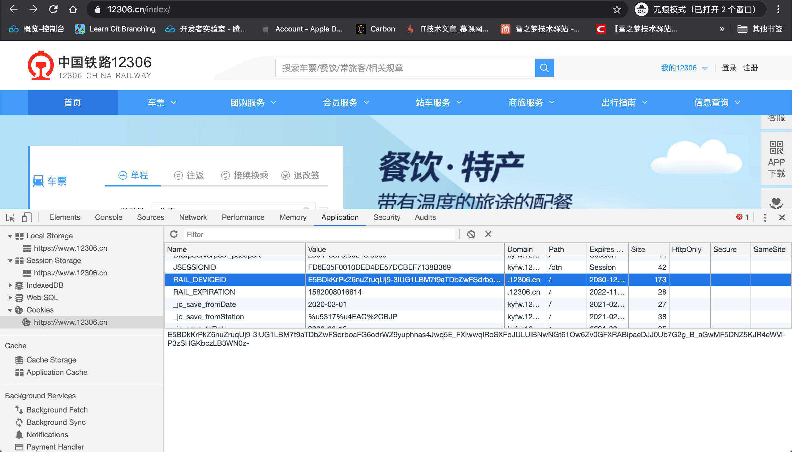

下面简单验证一下说明谁才是真正的浏览器唯一标识:

- step 1 : 复制当前获取到的 `RAIL_DEVICEID` 和 `RAIL_OkLJUJ` 的值

打开控制台(Console),通过 js 代码方式取出本地存储(localStorage) 的值:

```js
localStorage.getItem("RAIL_DEVICEID");

localStorage.getItem("RAIL_OkLJUJ");
```

控制台会立即返回该值,接下来需要手动复制到其他地方等待和第二次结果作比较.

但是程序员总是喜欢能偷懒就偷懒,手动复制也懒得复制怎么办?

当然,继续使用js 代码复制了啊!

```js
copy('雪之梦技术驿站欢迎您的访问,https://snowdreams1006.cn');
```

比如这句代码就会把文本`'雪之梦技术驿站欢迎您的访问,https://snowdreams1006.cn'`复制到剪贴板,接下来选择文本编辑器右键粘贴就能看到效果啦!

所以改造一下代码就能复制第一次访问 12306 网站获取到的 `RAIL_DEVICEID` 和 `RAIL_OkLJUJ` 的值.


```js
copy("RAIL_DEVICEID:::"+localStorage.getItem("RAIL_DEVICEID"));
// RAIL_DEVICEID:::E5BDkKrPkZ6nuZruqUj9-3lUG1LBM7t9aTDbZwFSdrboaFG6odrWZ9yuphnas4Jwq5E_FXIwwqlRoSXFbJULUiBNwNGt61Ow6Zv0GFXRABipaeDJJ0Ub7G2g_B_aGwMF5DNZ5KJR4eWVl-P3zSHGKbczLB3WN0z-

copy("RAIL_OkLJUJ:::"+localStorage.getItem("RAIL_OkLJUJ"));
// RAIL_OkLJUJ:::FGFOJ75VdD8dQc2yh3yTJf2RBWES6uGI
```

- step 2 : 等待 5 min 后再次获取 `RAIL_DEVICEID` 和 `RAIL_OkLJUJ` 的值

```js
copy("RAIL_DEVICEID:::"+localStorage.getItem("RAIL_DEVICEID"));
// RAIL_DEVICEID:::VUye37EEUdGHgrpJGo9J95hWMNSIUFPeYBjabDgCiYJbQIr53iVzIPQJwcLhbijL4OyPVGmzolsVEK8Pw7_DG_oPrUDpfbnRe7HvMWMJvU2MAbk-7EwNEePAlpnVb9QVZz4dtOUSCRVbS2zlwgS0xe2BOThpR9oy

copy("RAIL_OkLJUJ:::"+localStorage.getItem("RAIL_OkLJUJ"));
// RAIL_OkLJUJ:::FGFOJ75VdD8dQc2yh3yTJf2RBWES6uGI
```

> 或者清空网站 cookie 后再次刷新当前网页,总是就是想办法触发浏览器再次运行相关逻辑重新生成 `RAIL_DEVICEID` 和 `RAIL_OkLJUJ` .

- step 3 : 对比第一次和第二次获取到的 `RAIL_DEVICEID` 和 `RAIL_OkLJUJ` 的值

```
RAIL_DEVICEID:::E5BDkKrPkZ6nuZruqUj9-3lUG1LBM7t9aTDbZwFSdrboaFG6odrWZ9yuphnas4Jwq5E_FXIwwqlRoSXFbJULUiBNwNGt61Ow6Zv0GFXRABipaeDJJ0Ub7G2g_B_aGwMF5DNZ5KJR4eWVl-P3zSHGKbczLB3WN0z-

RAIL_OkLJUJ:::FGFOJ75VdD8dQc2yh3yTJf2RBWES6uGI

RAIL_DEVICEID:::VUye37EEUdGHgrpJGo9J95hWMNSIUFPeYBjabDgCiYJbQIr53iVzIPQJwcLhbijL4OyPVGmzolsVEK8Pw7_DG_oPrUDpfbnRe7HvMWMJvU2MAbk-7EwNEePAlpnVb9QVZz4dtOUSCRVbS2zlwgS0xe2BOThpR9oy

RAIL_OkLJUJ:::FGFOJ75VdD8dQc2yh3yTJf2RBWES6uGI
```

显而易见,肉眼直接就能看出两次请求时 `RAIL_OkLJUJ` 的值并没有变化而 `RAIL_DEVICEID` 的值很大可能会发生改变.

因此,`RAIL_DEVICEID` 应该并不是浏览器唯一标识,而 `RAIL_OkLJUJ` 才是真正的唯一标识!

本文并不适合全部读者,如果你属于以下情况之一,那么本文对你绝对帮助甚多,否则对你来说只能算是浪费生命.

- 适合对自主抢票或者脚本抢票有需求的天涯游子
- 适合拥有一定 web 前端开发相关知识的开发者
- 适合耐得住寂寞能够独自研究加密算法的孤独人

最后的核心前提是有网,当然WiFi更佳,否则流量真的吃不消啊!

## 故事背景

```
独在异乡为异客 每逢佳节要抢票
手动自动一起上 时常掉线心好累
动手实践出真理 原来身份是唯一
想要封你没商量 只能动手来伪装
加密请求在前端 后端返还控制权
还原算法该身份 稳定抢票不担心
多种途径齐上阵 车票速速快现身
```

不知道你是否遭遇过一票难求的困境,尽管网络上关于第三方工具的加速包是否加速有过辟谣,但是每逢节假日总是会遇到抢不到车票的问题!

目前为止,12306 官方线上售票渠道仅仅包括 12306 网站以及手机 app 客户端,因此市面上流行的第三方抢票软件均为非正常途径,而这些第三方渠道中最简单的实现方式应该就算是爬虫技术了.

不论是网页端还是手机端,统统称为客户端,客户端的作用仅仅是传声筒,真正负责执行命令的人就是后端.

当你提交购票需求时,客户端会把这些车票信息一起打包发送给服务端,如果服务端有票的话,那么有可能就会返回给客户端成功信息,恭喜你订票成功.

当然尽管有票也不一定会给你,但是无票的话肯定不会订票成功,不管结果如何服务端和客户端总是按照既定的约定协议在默默交流着...

尽管官方渠道最可靠也最准确,可官方也还是没能给你买到车票啊!

所以想要抢票还是得亲自动手,不能完全依靠官方,这里就诞生了爬虫技术来冒充客户端,想要成功骗过服务端就要先了解真正的客户端到底有哪些特征?

由于本文篇幅有限,暂时不做关于抢票方面的相关论述,直奔重点,讲解 `RAIL_DEVICEID` 的请求过程,带你一步一步还原 12306 网站的前端加密算法的实现逻辑!

## 效果预览

在浏览器控制台运行 `chromeHelper.prototype.encryptedFingerPrintInfo()` 方法时会计算真实信息,如果发现计算结果中的 `value` 值和真正请求 [https://kyfw.12306.cn/otn/HttpZF/logdevice](https://kyfw.12306.cn/otn/HttpZF/logdevice?algID=mBxuYhGXYR&hashCode=owRJc8M4EkFMvcTkzibRFJoDSkUKCx6N9ictZIJLIeY&FMQw=0&q4f3=zh-CN&VPIf=1&custID=133&VEek=unknown&dzuS=0&yD16=0&EOQP=c227b88b01f5c513710d4b9f16a5ce52&jp76=52d67b2a5aa5e031084733d5006cc664&hAqN=MacIntel&platform=WEB&ks0Q=d22ca0b81584fbea62237b14bd04c866&TeRS=777x1280&tOHY=24xx800x1280&Fvje=i1l1o1s1&q5aJ=-8&wNLf=99115dfb07133750ba677d055874de87&0aew=Mozilla/5.0%20(Macintosh;%20Intel%20Mac%20OS%20X%2010_15_2)%20AppleWebKit/537.36%20(KHTML,%20like%20Gecko)%20Chrome/80.0.3987.87%20Safari/537.36&E3gR=9f7fa43e794048f6193187756181b3b9) 的 `hashcode` 值相同,那么恭喜您,说明 12306 相关算法还没更新,如果不相同估计算法又稍微调整了!

```json
{
  "key": "&FMQw=0&q4f3=zh-CN&VPIf=1&custID=133&VEek=unknown&dzuS=0&yD16=0&EOQP=c227b88b01f5c513710d4b9f16a5ce52&jp76=52d67b2a5aa5e031084733d5006cc664&hAqN=MacIntel&platform=WEB&ks0Q=d22ca0b81584fbea62237b14bd04c866&TeRS=777x1280&tOHY=24xx800x1280&Fvje=i1l1o1s1&q5aJ=-8&wNLf=99115dfb07133750ba677d055874de87&0aew=Mozilla/5.0 (Macintosh; Intel Mac OS X 10_15_2) AppleWebKit/537.36 (KHTML, like Gecko) Chrome/80.0.3987.87 Safari/537.36&E3gR=9f7fa43e794048f6193187756181b3b9",
  "value": "owRJc8M4EkFMvcTkzibRFJoDSkUKCx6N9ictZIJLIeY"
}
```

- step 1 : 使用 Chrome 浏览器打开 12306 网站并清空该站点全部缓存数据.

> 请确保当前正在使用的是谷歌 Chrome 浏览器,IE和 firefox 等浏览器暂未测试.


- step 2 : 手动清空 `window.name` 属性,保证浏览器处于首次打开 12306 网站状态.

> 因为非首次加载会携带上一次的请求信息,不方便学习验证,经过分析试验发现历史状态还保存在 window 对象的 name 属性,因此仅仅清空缓存还不够,还需要手动清空 name 属性的值.


- step 3 : 强制刷新当前页面并保持记录请求信息,过滤请求类型 `js` ,找到 [/otn/HttpZF/logdevice](https://kyfw.12306.cn/otn/HttpZF/logdevice) 请求.

在找到该请求保存查询参数名为 `hashCode: owRJc8M4EkFMvcTkzibRFJoDSkUKCx6N9ictZIJLIeY` ,方便和之后的计算方式生成的结果做对比.

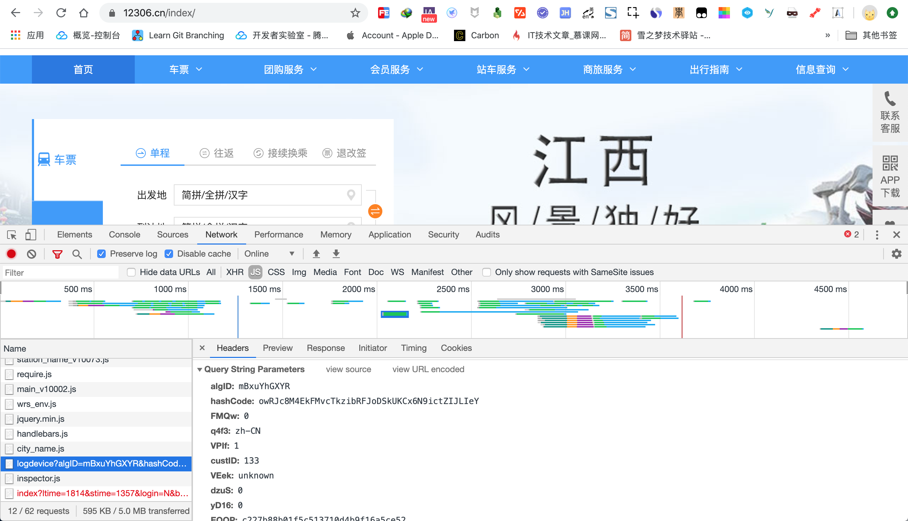

除了查询请求信息外,更为重要的是查看响应信息,当初次请求 [/otn/HttpZF/logdevice](https://kyfw.12306.cn/otn/HttpZF/logdevice) 时除了返回过期时间 `exp` 和 `dfp` 设备信息之外,还会返回 `cookieCode` 设备唯一标识.

如果等到过期时间或手动清空站点缓存后,[/otn/HttpZF/GetJS](https://kyfw.12306.cn/otn/HttpZF/GetJS) 脚本中的相关逻辑会再次发起 [/otn/HttpZF/logdevice](https://kyfw.12306.cn/otn/HttpZF/logdevice) 请求,那时候的响应内容再也没有 `cookieCode` 参数了.

让我们再好好看一看初次请求的响应信息吧!

```jsonp
callbackFunction('{"exp":"1581948102442","cookieCode":"FGHcXsVmjf3oV0zm5qTDPFt-VcNhuDA-","dfp":"QNCYH1J5E9M7rl97uo_PUR1OSwRTcCe1xdnbX7h2V6Ewcq6kML0qzXD5y11rLv3FPX1ndOnhL_bjVkwwgtWTsHMFums60_4H9Lr-vJzJGq4tkaUEGfRNXN9IJlvptReSBa5PP7N5gxpSOBo-YlF5Ac98f-YlNlxi"}')
```

如果将 `callbackFunction()` 回调函数去掉,不难发现其实返回数据是 `json` 格式,格式化后发现响应内容如下:

```json
{
    "exp": "1581948102442",
    "cookieCode": "FGHcXsVmjf3oV0zm5qTDPFt-VcNhuDA-",
    "dfp": "QNCYH1J5E9M7rl97uo_PUR1OSwRTcCe1xdnbX7h2V6Ewcq6kML0qzXD5y11rLv3FPX1ndOnhL_bjVkwwgtWTsHMFums60_4H9Lr-vJzJGq4tkaUEGfRNXN9IJlvptReSBa5PP7N5gxpSOBo-YlF5Ac98f-YlNlxi"
}
```

这里不得不佩服 12306 的设计思路了,故布疑阵,当你误以为自己已经更新了 `RAIL_DEVICEID` 的值,实际上 `cookieCode` 的值才是唯一标识而它恰恰没有设置到 cookie 中去,仅仅作为本地缓存保持了,用于再次请求 `RAIL_DEVICEID`.


- step 4 : 复制源码实现到控制台,输入 `chromeHelper.prototype.encryptedFingerPrintInfo()` 获取请求 [/otn/HttpZF/logdevice](https://kyfw.12306.cn/otn/HttpZF/logdevice) 的查询参数,提取出其中的 `value` 值和真正的请求参数作对比.

> 假设真正请求参数 hashcode 的值已设置成变量,`chromeHelper.prototype.encryptedFingerPrintInfo().value === hashcode` 返回结果 `true` 说明复现算法实现还在正常运行,否则很可能是相关算法又更新了!


## 直奔重点

如果你正在学习自动抢票或者打算研究如何自动抢票,那么我可以负责任得告诉你,`RAIL_DEVICEID` 的值绝对是绕不过去的坎,堪称 12306 反爬虫技术的最精华手段!

现在目标已经锁定,赶紧动手和我一起去探究 12306 到底是如何处理 `RAIL_DEVICEID` 的值吧!

### 无痕模式下访问网站

众所周知,谷歌 Chrome 浏览器是程序员专属的浏览器,是因为提供了强大的开发调试能力,简单网站请求甚至不需要借助第三方专业的抓包工具就能独立完成分析整过程.

如果你还没有听说过 Chrome 浏览器或者正在使用其他浏览器,那么建议你先自行下载最新版 Chrome 浏览器,和文章使用一样的工具有助于顺利复现相关步骤,否则遇到莫名奇怪的问题只能自己研究了.

首先打开 Chrome 浏览器的无痕模式,处于无痕模式最大的特点就是不会保存 cookie,在一定程度上对目标网站而言是新用户(主要指的是新的客户端终端).


输入 12306 官网后,打开开发者控制台(F12或右键检查),选择网络(network)选项卡,确保一直处于监听网咯请求并实时记录状态.

具体而言,最左边的监听状态圆心是红色,保持日志(Preserve log)的复选框已勾选,禁用缓存(Disable cache) 的复选框已勾选,这三者是分析所有网络请求的基础.

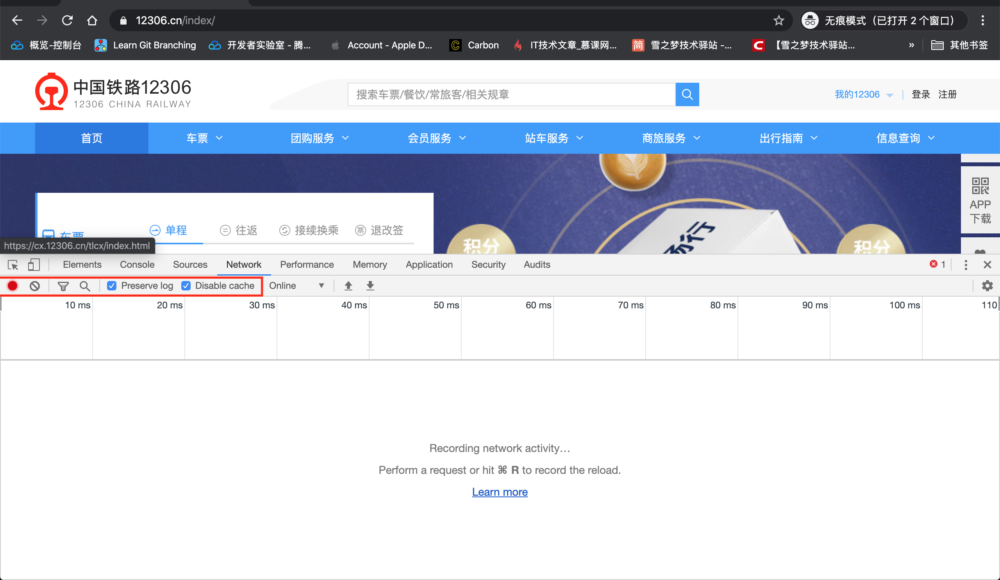

准备工作就绪后开始完整走一遍购票流程,即从首页进入登录页,登录并买票等过程,请求步骤越完整可提供分析的资料越多,也就基本上不会遗漏重要步骤,离真相越逼近.

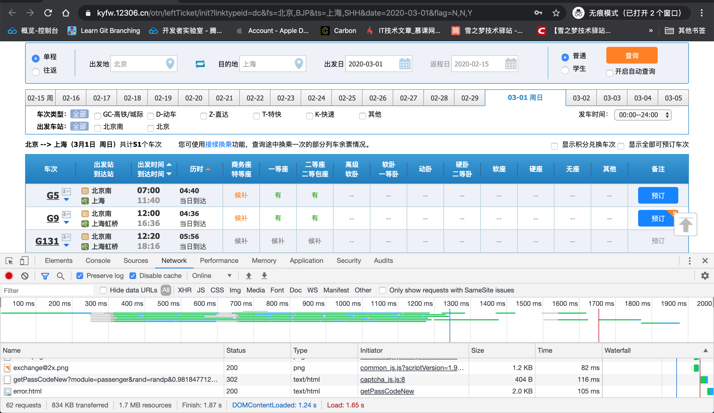

凡是涉及到登录操作,建议先故意输出错误的账号密码等信息,这样有利于登录成功后重定向次数过多而导致无法找到之前的登录请求,如果网络(network)选项卡中的保持日志(Preserve log)的功能没有开启的话,这一现象将会更加严重!


再次输入正确的登录信息成功登录后进行买票行为等操作,但是无需付款,只要正常操作到下单完成即可视为整个购票流程.


下单成功后整个购票流程已经基本完成,接下来开始全局搜索关键字 `RAIL_DEVICEID` 查看在哪里生成又在何处使用?

### 全局模糊查找关键字

现在整个购票流程基本上已经完成,接下来开始全局搜索全部请求中是否包含关键字 `RAIL_DEVICEID` 吧!

首先打开网络(network)选项卡,从左往右数第四个放大镜图标就是搜素功能,输入搜素关键字 `RAIL_DEVICEID` 会过滤符合条件的网络请求.

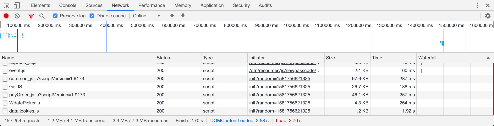

不搜不要紧,一搜一大把,只能看出来大部分网络请求都会自动携带该 cookie,反而淹没了到底是哪个网络请求生成的 cookie?


所以必须想办法精确搜索,过滤出生成该 cookie 的网络请求,所以接下来的问题就变成了如果 `RAIL_DEVICEID` 属于后端直接设置的行为,那么这样的网络请求应该长啥样的?

最好的学习就是模仿,假设并不知道真实的设置过程如何,但是我们可以查看其它 cookie 的设置过程啊!

同样地,在网络(network)选项卡选择第三个过滤器漏斗图标,展开网络请求类型,大致分为 All|XHR|JS|CSS|Img|Media|Font|Doc|WS|Manifest|Other等类型.

简单说一下网络请求类型的相关含义,整理出表格直观感受一下:

|类型|名称|描述|代码|
|:-|:-|:-|:-|
|XHR|XHR adn Fetch|ajax异步请求|X-Requested-With: XMLHttpRequest|
|JS|Scripts|js脚本|Sec-Fetch-Dest: script|
|CSS|Stylesheets|css样式|Sec-Fetch-Dest: style|
|Img|Images|图片|Sec-Fetch-Dest: image|
|Media|Media|音视频媒体|Sec-Fetch-Dest: audio|
|Font|Fonts|字体|Sec-Fetch-Dest: font|
|Doc|Documents|html文档|Sec-Fetch-Dest: document|
|WS|WebSockets|长连接通信|暂无|
|Manifest|Manifest|版本文件|暂无|

由于 12306 暂未包括后两种请求类型,所以无法判断该请求有什么特点,除了 ajax 异步请求外,其余类型的网络请求都是通过请求头 `Sec-Fetch-Dest` 属性标识的,当然设置浏览器的 cookie 也不例外,只不过大多数是通过服务端进行设置的,也就是网络请求的响应头标志了如何设置 cookie 的行为.

在前端 web 开发的过程中并不是一上来就前后端分离的,很长一段时间内前端页面也是由后端人员完成的,因此好多网站至今为止还保留着新旧交替的痕迹.

在上述网络请求类型中,最能体现这种变化特点就是 XHR 和 Doc 请求,XHR的常见封装实现 之一就是风靡全球的 ajax 异步请求,用于实现无刷新局部更新网页内容,而 Doc 是文档类型,无论是直接输出原生 html 还是使用模板技术动态渲染页面,最终输出展现结果一律是 html 文档,这一类的网络请求最容易设置 cookie 之类的请求,体现了上一代技术的一贯风格,恨不得一个人一次性把全部的活都干完!

但是随着技术的发展进步旧技术暴露的问题越来越多,引起了包括开发者在内的业内重视,各大企业已经逐步开始转变,也就是各司其职,物尽其用.

总结来说,XHR 和 Doc 有如下特点:

- XHR 请求的数据绝大多数工作是在前端方面完成的,后端把相关数据返回给前端接口调用者,前端取到数据后进行业务组装展现.
- XHR 请求绝大多数是异步ajax 请求,优点是当前页面不需要刷新就能看到最新内容,缺点是一旦涉及到相互依赖的业务就会出现请求等待噩梦.
- XHR 请求是又前端发起也就是浏览器主动发出给后端,等后端服务器返回数据后继续由前端完成相关业务,这部分数据传输量极少但非常重要.
- Doc 请求大多数是后端在控制,方便设置各种页面元素的表现形式,但是也不排除前端使用相关的模板引擎结合 XHR 数据在控制生成文档.
- Doc 请求设置包括 cookie 在内的一系列网络行为,转发和重定向更是权限控制的常用做法.

下面我们已包括 `RAIL_DEVICEID` 关键字的网络请求,简单感受一下两者的差异性.

XHR 请求重点在于如何请求数据和接收数据,主要体现在 Request Data 和 Response Data 两方面,至于请求头一般都是默认设置.

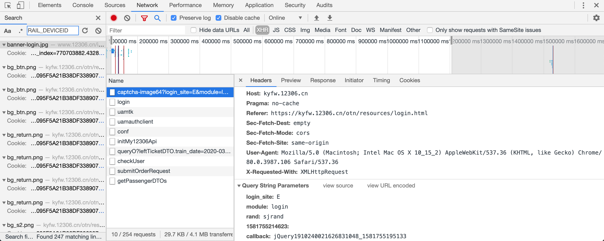

Doc 请求的重点就不一样了,绝大多数请求就是输入网址后自动跳转页面,因而关注的重点应该放在请求头和响应头信息上,因为 cookie 的值就是通过请求头进行发送到后端服务器,后端如需新增或修改 cookie 值就是通过响应头进行设置的.

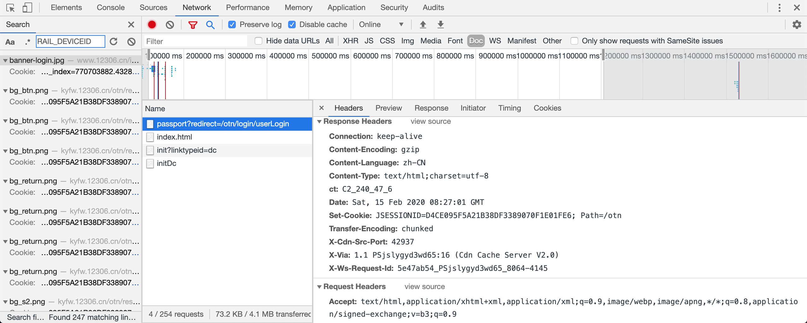

柿子还要先捏软柿子,现在无法判定 `RAIL_DEVICEID` 到底是服务端直接设置还是客户端自行设置的,而客户端的行为不太直观,所以相对而言还是先捏服务端软柿子吧!

回顾刚才讲解的 Doc 网络请求,不难发现设置 cookie 的行为代码类似如下:

```
Set-Cookie: JSESSIONID=D4CE095F5A21B38DF3389070F1E01FE6; Path=/otn
```

现在找到了学习对象,开始模仿查找类似请求的关键字应该是: `Set-Cookie: RAIL_DEVICEID=`


查无结果!

一般情况下出现无结果很可能是以下原因之一:

- 恭喜您,真的查无结果,可以换条思路继续探索了.
- 很遗憾,当前网络请求数据不足刚好缺失符合条件的请求.
- 日了狗,操作不当误输多余符号或者本是关键字搜索实际上却开启了正则匹配等

所以逐一排查以上原因,首先考虑换一个关键字 `Set-Cookie: JSESSIONID` 能否查找出相应的结果.

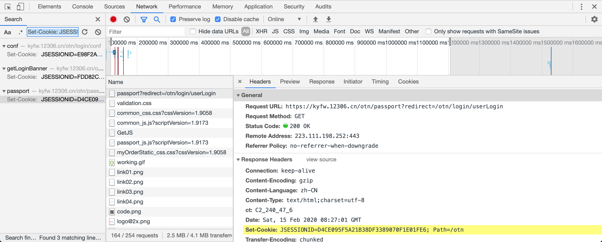

事实胜于雄辩,查询过程并没有任何问题而是查询结果真的不存在,如此一来一次性排查两个原因,那么很有可能生成逻辑在于前端而非后端.

接下来只能在众多请求中碰碰运气寻找前端到底是在何处生成的 `RAIL_DEVICEID` ,然而请求众多还是要稍微讲究一下策略方向的.

既然是前端在控制 cookie 的生成逻辑,那么很有可能是某个 js 文件在起作用,当然也不排除其他类型的文件有操作浏览器行为的能力.

因此,通过分析进一步缩小范围:在请求类型为 `JS` 的网络请求中查找包括关键字 `RAIL_DEVICEID` 的全部请求.


理想很丰满,现实太骨感,本以为选中 js 再搜索关键字能够一起生效,结果并没有,请求类型依旧没有过滤出去,还是一大片的请求!

同时随便选中任意请求可以看到此时网络选项卡搜索匹配大结果其实是请求头这些基本信息,应该并没有包括 js 或者 doc 源码,方向错了,走再多路也是浪费时间.

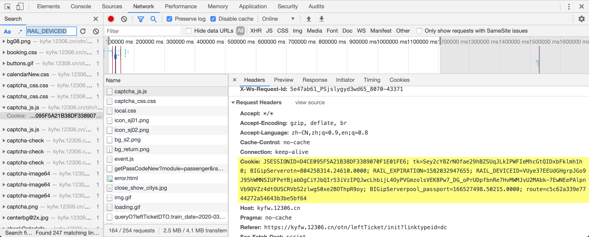

虽然我不知道你从哪里来,中间经历了什么,但是我知道你的最终归宿一定会落到网络文件系统.

Chrome 浏览器除了可以看出网络请求也能看到最终呈现给用户的文件系统,既然中间过程找不到你,那么我直接到目的地去搜索吧!

打开源码(Source)选项卡,整个面板大致分为三部分,左侧文件数,中间文件区,右侧调试区.


其中左侧的文件结构可以清楚看到当前所处的层级结构,有利于快速掌握项目轮廓.右侧的调试区针对心中有想法但还不确定是否正确提供了非常好的验证工具,调试别人的代码就如本地开发那样边预言边验证.

中间的文件区域面积最大,功能自然也不能太弱,选中左侧具体文件后可以显示源码,方便查看,进而去调试验证心有所想.

所以问题来了,这一切的一切都要源于心有所想才能有行动,那么应该去哪里搜索包括关键字 `RAIL_DEVICEID` 的文件呢?

一般而言,良好的用户体验是不需要告诉你用户手册的,给你一大堆详尽的说明文档也未必会耐得住去看一篇,先用用再说!

人生苦短,不要浪费太多时间放在无聊的事情上面,简短的三行提醒富含哲理性,第一行告诉你怎么打开文件,第二行告诉你如何运行命令,第三行告诉你如何操作实现什么效果.

如果三行代码还不足以解决你的问题,阅读更多自己慢慢琢磨说明文档吧!

当然,这里和在文件系统中查找包含关键字 `RAIL_DEVICEID` 的需求最为接近的应该就是第二行,运行命令了,那就试试看吧!

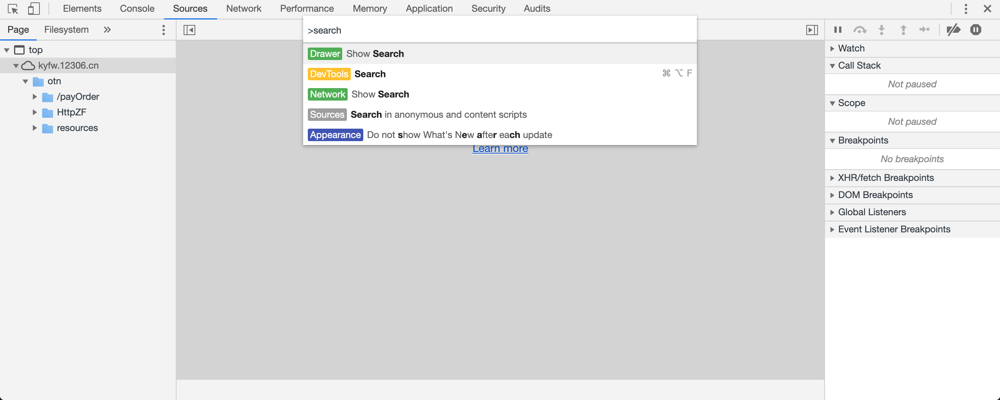

输入搜索 `search` 后果然弹出了相关搜索命令,于是点击开发工具(DevTools)后出现了搜索框,顺理成章输入关键字 `RAIL_DEVICEID` 进行搜索了啊!


终于等到你,还好我没放弃,你就是我的唯一,看样子和 `RAIL_DEVICEID` 有关的处理逻辑全部都在这么一个 js 文件里,看你还往哪里跑!

### 直捣黄龙还往哪里跑

找到该文件后点击查看,红蓝黑密密麻麻一大片js 代码,绝对不是给人看的而是给机器看的,想要给人阅读还需要美化一下,将源码丑化混淆成难以阅读的代码也是防止他人偷窥复制拷贝自己的劳动成果,同时也能减少文件大小,加速网络传输数据,让你的网站速度更快一些.


点击中间区域的左下角格式化图标进行美化代码,然后在文件中搜素关键字 `RAIL_DEVICEID` 定位到具体代码.

非常人性化的是,搜索功能是通用的快捷键 Ctrl + F,现在定位到具体代码,截图留念下,接下来才是真正考验技术的时刻!


```js
$a.getJSON("https://kyfw.12306.cn/otn/HttpZF/logdevice" + ("?algID\x3drblubbXDx3\x26hashCode\x3d" + e + a), null, function(a) {
    var b = JSON.parse(a);
    void 0 != lb && lb.postMessage(a, r.parent);
    for (var d in b)
        "dfp" == d ? F("RAIL_DEVICEID") != b[d] && (W("RAIL_DEVICEID", b[d], 1E3),
        c.deviceEc.set("RAIL_DEVICEID", b[d])) : "exp" == d ? W("RAIL_EXPIRATION", b[d], 1E3) : "cookieCode" == d && (c.ec.set("RAIL_OkLJUJ", b[d]),
        W("RAIL_OkLJUJ", "", 0))
})
```

### 本地备份js方便复现

既然已经找到关键文件,自然需要留存快照进行存档操作,否则哪一天文件更新了都不知道哪里发生变化了,难不成还要从头再分析一遍,我选择差量更新而不是全量覆盖!

选中源文件右键弹出菜单,选择任意一款喜欢的方式复制源文件到本地留作学习备份,准备工作就绪后准备大干一场.

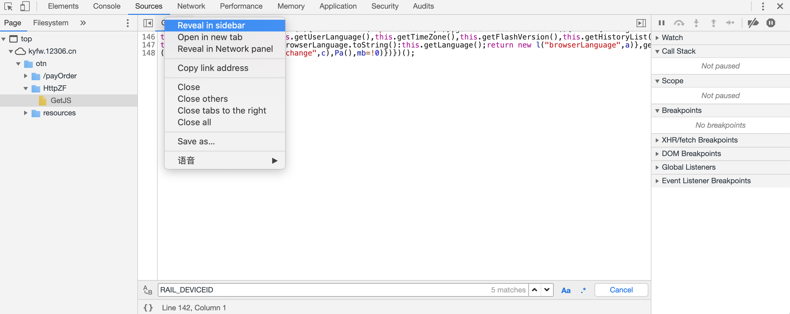

### 高楼大厦寻关键线索

Js文件中关于网络请求最典型的就是异步回调,将原本简单的操作复杂化,非要你等我,我等他,他还等着他的她.

最终直接结果就是整个请求流程反过来了,假设正常流程:是 A->B->C-D-E-F,那么异步请求很可能陷入这样的陷阱: F <- E <- D <- C <- B <- A

所以一层又一层的回调函数真的是难以维护,这种技术也在慢慢淘汰更新成更容易维护的方式,还是不再展开了,回到正题上来,还是先找到程序到底什么时候开始调用的吧!

```js
ja.prototype = {
  initEc: function(a) {
      var b = ""
        , c = this
        , d = void 0 != a && void 0 != a.localAddr ? a.localAddr : "";
      c.checkWapOrWeb();
      this.ec.get("RAIL_OkLJUJ", function(a) {
          b = a;
          c.getDfpMoreInfo(function() {
              if (!(9E5 < F("RAIL_EXPIRATION") - (new Date).getTime() & null != F("RAIL_DEVICEID") & void 0 != F("RAIL_DEVICEID") & !c.NeedUpdate())) {
                  for (var a = "", e = "", g = c.getpackStr(b), m = [], q = [], t = [], k = [], n = 0; n < g.length; n++)
                      "new" != g[n].value && -1 == Fb.indexOf(g[n].key) && (-1 != Gb.indexOf(g[n].key) ? q.push(g[n]) : -1 != Ib.indexOf(g[n].key) ? t.push(g[n]) : -1 != Hb.indexOf(g[n].key) ? k.push(g[n]) : m.push(g[n]));
                  g = "";
                  for (n = 0; n < q.length; n++)
                      g = g + q[n].key.charAt(0) + q[n].value;
                  q = "";
                  for (n = 0; n < k.length; n++)
                      q = 0 == n ? q + k[n].value : q + "x" + k[n].value;
                  k = "";
                  for (n = 0; n < t.length; n++)
                      k = 0 == n ? k + t[n].value : k + "x" + t[n].value;
                  m.push(new l("storeDb",g));
                  m.push(new l("srcScreenSize",q));
                  m.push(new l("scrAvailSize",k));
                  "" != d && m.push(new l("localCode",pb(d)));
                  e = c.hashAlg(m, a, e);
                  a = e.key;
                  e = e.value;
                  a += "\x26timestamp\x3d" + (new Date).getTime();
                  $a.getJSON("https://kyfw.12306.cn/otn/HttpZF/logdevice" + ("?algID\x3drblubbXDx3\x26hashCode\x3d" + e + a), null, function(a) {
                      var b = JSON.parse(a);
                      void 0 != lb && lb.postMessage(a, r.parent);
                      for (var d in b)
                          "dfp" == d ? F("RAIL_DEVICEID") != b[d] && (W("RAIL_DEVICEID", b[d], 1E3),
                          c.deviceEc.set("RAIL_DEVICEID", b[d])) : "exp" == d ? W("RAIL_EXPIRATION", b[d], 1E3) : "cookieCode" == d && (c.ec.set("RAIL_OkLJUJ", b[d]),
                          W("RAIL_OkLJUJ", "", 0))
                  })
              }
          })
      }, 1)
  }
}
```

核心代码最外层函数是 `initEc` 函数,而该函数的写法明显是传统 js 的属性方法,因此判断挂载于该对象的属性方法应该都是完成某些相同的功能.

暂时先不着急继续寻找谁在调用 `initEc` 函数,先搞懂整个函数结构是什么轮廓.

```js
function ja() {
    this.ec = new evercookie;
    this.deviceEc = new evercookie;
    this.cfp = new aa;
    this.packageString = "";
    this.moreInfoArray = []
}

ja.prototype = {
  getScrWidth: function() {
      return new l("scrWidth",r.screen.width.toString())
  },
  ...
  ,
   checkWapOrWeb: function() {
      return "WindowsPhone" == Ha() || "iOS" == Ha() || "Android" == Ha() ? !0 : !1
  }
}
```

如果熟悉 web 开发,那么你一定不难发现这是标准的面向对象的写法,`ja` 函数作为构造函数内置了一大堆成员变量,并且在原型链上继承了一大堆方法.

更何况,对象属性中还有三个带有 `new` 关键字的构造函数,估计也是类似于 `ja` 这种设计思路,高楼大厦平地起,还原相关算法之路预期并不简单!

但是想一想车票真难抢还动不动访问错误,是可忍孰不可忍,还是要研究算法一劳永逸搞定 `RAIL_DEVICEID` 的生成逻辑,自己用算法计算实现完美伪装浏览器!

现在以 `initEc` 函数名继续搜素,寻找到底是谁在调用,轻而易举又找到了新的函数名: `getFingerPrint`

```js
ja.prototype = {
  getFingerPrint: function() {
      var a = this;
      r.RTCPeerConnection || r.webkitRTCPeerConnection || r.mozRTCPeerConnection ? nb(function(b) {
          a.initEc(b)
      }) : a.initEc()
  }
}
```

同样地,不再过多停留,继续以 `getFingerPrint` 为关键字搜索,找到了 `Pa` 函数,终于不再是 `ja` 的方法了.

```js
function Pa() {
    if (-1 == F("RAIL_EXPIRATION"))
        for (var a = 0; 10 > a; a++)
            G(function() {
                (new ja).getFingerPrint()
            }, 20 + 2E3 * Math.pow(a, 2));
    else
        (new ja).getFingerPrint();
    G(function() {
        r.setInterval(function() {
            (new ja).getFingerPrint()
        }, 3E5)
    }, 3E5)
}
```

与此同时,`Pa` 函数也是 js 文件的第一行代码,来都来了,那就顺便看一眼 js 的整体结构代码吧!

```js
(function() {
   
})();
```

自执行的匿名函数实现的闭包,这样的好处在于函数内的变量不会污染其他文件,更何况混淆之后的变量名称充斥着大量的变量 a,b,c,d,e,f之类的,不用闭包也不行啊!

现在继续以 `Pa` 为线索搜索,最终发现了函数入口,除此之外再无其他.

```js
var mb = !1;
u.addEventListener ? u.addEventListener("DOMContentLoaded", function b() {
    u.removeEventListener("DOMContentLoaded", b, !1);
    Pa()
}, !1) : u.attachEvent && u.attachEvent("onreadystatechange", function c() {
    mb || "interactive" != u.readyState && "complete" != u.readyState || (u.detachEvent("onreadystatechange", c),
    Pa(),
    mb = !0)
})
```

js 是典型的事件驱动型编程语言,当发生什么什么事件后我要干这个,页面加载时我要开始工作了,按钮被点击了我要登录了,页面关闭时我要下班了等等诸如此类的逻辑.

上述代码实现的就是页面元素加载成功后开始执行 `Pa()` 函数,而 `Pa` 函数又会执行 `(new ja).getFingerPrint()` ,紧接着又会执行 `initEc` 函数.

现在基本流程已经大致清楚了,总结一下基本代码逻辑如下:

```js
(function() {
   var mb = !1;
  u.addEventListener ? u.addEventListener("DOMContentLoaded", function b() {
      u.removeEventListener("DOMContentLoaded", b, !1);
      Pa()
  }, !1) : u.attachEvent && u.attachEvent("onreadystatechange", function c() {
      mb || "interactive" != u.readyState && "complete" != u.readyState || (u.detachEvent("onreadystatechange", c),
      Pa(),
      mb = !0)
  })

  function Pa() {
    if (-1 == F("RAIL_EXPIRATION"))
        for (var a = 0; 10 > a; a++)
            G(function() {
                (new ja).getFingerPrint()
            }, 20 + 2E3 * Math.pow(a, 2));
    else
        (new ja).getFingerPrint();
    G(function() {
        r.setInterval(function() {
            (new ja).getFingerPrint()
        }, 3E5)
    }, 3E5)
  }

  function ja() {
    this.ec = new evercookie;
    this.deviceEc = new evercookie;
    this.cfp = new aa;
    this.packageString = "";
    this.moreInfoArray = []
  }

  ja.prototype = {
    getFingerPrint: function() {
        var a = this;
        r.RTCPeerConnection || r.webkitRTCPeerConnection || r.mozRTCPeerConnection ? nb(function(b) {
            a.initEc(b)
        }) : a.initEc()
    },
    initEc: function(a) {
      var b = ""
        , c = this
        , d = void 0 != a && void 0 != a.localAddr ? a.localAddr : "";
      c.checkWapOrWeb();
      this.ec.get("RAIL_OkLJUJ", function(a) {
          b = a;
          c.getDfpMoreInfo(function() {
              if (!(9E5 < F("RAIL_EXPIRATION") - (new Date).getTime() & null != F("RAIL_DEVICEID") & void 0 != F("RAIL_DEVICEID") & !c.NeedUpdate())) {
                  for (var a = "", e = "", g = c.getpackStr(b), m = [], q = [], t = [], k = [], n = 0; n < g.length; n++)
                      "new" != g[n].value && -1 == Fb.indexOf(g[n].key) && (-1 != Gb.indexOf(g[n].key) ? q.push(g[n]) : -1 != Ib.indexOf(g[n].key) ? t.push(g[n]) : -1 != Hb.indexOf(g[n].key) ? k.push(g[n]) : m.push(g[n]));
                  g = "";
                  for (n = 0; n < q.length; n++)
                      g = g + q[n].key.charAt(0) + q[n].value;
                  q = "";
                  for (n = 0; n < k.length; n++)
                      q = 0 == n ? q + k[n].value : q + "x" + k[n].value;
                  k = "";
                  for (n = 0; n < t.length; n++)
                      k = 0 == n ? k + t[n].value : k + "x" + t[n].value;
                  m.push(new l("storeDb",g));
                  m.push(new l("srcScreenSize",q));
                  m.push(new l("scrAvailSize",k));
                  "" != d && m.push(new l("localCode",pb(d)));
                  e = c.hashAlg(m, a, e);
                  a = e.key;
                  e = e.value;
                  a += "\x26timestamp\x3d" + (new Date).getTime();
                  $a.getJSON("https://kyfw.12306.cn/otn/HttpZF/logdevice" + ("?algID\x3drblubbXDx3\x26hashCode\x3d" + e + a), null, function(a) {
                      var b = JSON.parse(a);
                      void 0 != lb && lb.postMessage(a, r.parent);
                      for (var d in b)
                          "dfp" == d ? F("RAIL_DEVICEID") != b[d] && (W("RAIL_DEVICEID", b[d], 1E3),
                          c.deviceEc.set("RAIL_DEVICEID", b[d])) : "exp" == d ? W("RAIL_EXPIRATION", b[d], 1E3) : "cookieCode" == d && (c.ec.set("RAIL_OkLJUJ", b[d]),
                          W("RAIL_OkLJUJ", "", 0))
                  })
              }
          })
      }, 1)
    }
  }
})();
```

从以上代码分析中,相信你会发现相关逻辑应该兼容 IE 浏览器,同时设置了定时程序反复更新 cookie 值,并且还有远程 RTC 保持通信,不得不说做得还真不错,不愧是国民出行的代步工具啊!

精力有限,这里选择最简单的一种情况进行算法还原过程的研究,浏览器选择谷歌 Chrome 浏览器,这样就可以屏蔽关于 IE 的兼容性补丁处理,同时也不考虑 `RTCPeerConnection` 的情况,于是乎,代码逻辑简化成这样:


```js
(function() {
  document.addEventListener("DOMContentLoaded", Pa,false)

  function Pa() {
    (new ja).getFingerPrint();
  }

  function ja() {
    this.ec = new evercookie;
    this.deviceEc = new evercookie;
    this.cfp = new aa;
    this.packageString = "";
    this.moreInfoArray = []
  }

  ja.prototype = {
    getFingerPrint: function() {
        this.initEc()
    },
    initEc: function(a) {
      var b = ""
        , c = this
        , d = void 0 != a && void 0 != a.localAddr ? a.localAddr : "";
      c.checkWapOrWeb();
      this.ec.get("RAIL_OkLJUJ", function(a) {
          b = a;
          c.getDfpMoreInfo(function() {
              if (!(9E5 < F("RAIL_EXPIRATION") - (new Date).getTime() & null != F("RAIL_DEVICEID") & void 0 != F("RAIL_DEVICEID") & !c.NeedUpdate())) {
                  for (var a = "", e = "", g = c.getpackStr(b), m = [], q = [], t = [], k = [], n = 0; n < g.length; n++)
                      "new" != g[n].value && -1 == Fb.indexOf(g[n].key) && (-1 != Gb.indexOf(g[n].key) ? q.push(g[n]) : -1 != Ib.indexOf(g[n].key) ? t.push(g[n]) : -1 != Hb.indexOf(g[n].key) ? k.push(g[n]) : m.push(g[n]));
                  g = "";
                  for (n = 0; n < q.length; n++)
                      g = g + q[n].key.charAt(0) + q[n].value;
                  q = "";
                  for (n = 0; n < k.length; n++)
                      q = 0 == n ? q + k[n].value : q + "x" + k[n].value;
                  k = "";
                  for (n = 0; n < t.length; n++)
                      k = 0 == n ? k + t[n].value : k + "x" + t[n].value;
                  m.push(new l("storeDb",g));
                  m.push(new l("srcScreenSize",q));
                  m.push(new l("scrAvailSize",k));
                  "" != d && m.push(new l("localCode",pb(d)));
                  e = c.hashAlg(m, a, e);
                  a = e.key;
                  e = e.value;
                  a += "\x26timestamp\x3d" + (new Date).getTime();
                  $a.getJSON("https://kyfw.12306.cn/otn/HttpZF/logdevice" + ("?algID\x3drblubbXDx3\x26hashCode\x3d" + e + a), null, function(a) {
                      var b = JSON.parse(a);
                      void 0 != lb && lb.postMessage(a, r.parent);
                      for (var d in b)
                          "dfp" == d ? F("RAIL_DEVICEID") != b[d] && (W("RAIL_DEVICEID", b[d], 1E3),
                          c.deviceEc.set("RAIL_DEVICEID", b[d])) : "exp" == d ? W("RAIL_EXPIRATION", b[d], 1E3) : "cookieCode" == d && (c.ec.set("RAIL_OkLJUJ", b[d]),
                          W("RAIL_OkLJUJ", "", 0))
                  })
              }
          })
      }, 1)
    }
  }
})();
```

所以现在问题的核心在于搞清楚 `initEc` 函数的数据流向,还原算法实现过程不是梦!

### 断点调试追踪调用栈

### 异步异步到处是异步

### 硬啃js异步调用逻辑

### 心中无异步便是同步

### 动态调试保存节点值

### 一步一步慢慢转同步

### 遇到瓶颈则略过细节

### 框架初现已尽在掌控

### 填补细节终得以复现

### 恍惚间逝去良多日夜

### 回头再看竟摇身一变

### 换汤不换药休要欺骗

### 三下五除二一顿操作

### 愉快抢票弹指一瞬间

### 身处他乡再不烦忧票

### 每逢佳节更新去抢票

### 自动抢票及时通知我

### 功成身退再笑谈算法

## 算法复现

算法整体采用闭包设计面向对象的编程风格,基于原型链特性实现原始对象的加密逻辑,添加特有方法用于临时修改浏览器相关信息,最后将自定义对象 `chromeHelper` 直接挂载于 `window` 属性,方便外部调用.

```js
/**
 * chrome 浏览器简化版,主要还原初次加载 RAIL_OkLJUJ 和 RAIL_DEVICEID 的基本流程,如许更新 RAIL_DEVICEID 需要结合 RAIL_OkLJUJ 一起加密,仅仅多增加一个 cookieCode 参数而已,除此之外并无特殊之处,不再赘述.
 * @author: snowdreams1006
 * @wechat: snowdreams1006(雪之梦技术驿站)
 */
(function(window) {

  /**
   * 默认空构造函数
   */
  function chromeHelper() {

  }

  /**
   * 设置用户代理,检测方式: navigator.userAgent
   */
  chromeHelper.setUserAgent = function(userAgent) {
    if (!userAgent) {
      userAgent = "Mozilla5.0 (Macintosh; Intel Mac OS X 10_15_2) AppleWebKit537.36 (KHTML, like Gecko) Chrome80.0.3987.87 Safari537.36";
    }
    Object.defineProperty(navigator, "userAgent", {
      value: userAgent,
      writable: false
    });
  }
   
  /**
   * 基于原型链实现面向对象编程的继承特性
   */
  chromeHelper.prototype = {
    /**
     * 获取初始化浏览器设备信息,来源于initEc中的e = c.hashAlg(k, a, e);
     */
    encryptedFingerPrintInfo: function() {
      // 获取分类后的浏览器指纹信息
      classifiedBrowserFingerPrintInfoArr = this.getClassifiedBrowserFingerPrintInfo();
      encryptedFingerPrintInfoMap = this.hashAlg(classifiedBrowserFingerPrintInfoArr, "", "");

      return encryptedFingerPrintInfoMap;
    }
  }

  /**
   * 直接挂载在全局变量 window 对象方便直接调用.
   */
  window.chromeHelper = chromeHelper;
})(window);
```

### step 1 : 获取基本信息

```js
chromeHelper.prototype = {
    /**
     * 获取浏览器基本信息,来源于getDfpMoreInfo中的b.cfp.get和aa的get
     */
    getBasicInfoArr: function() {
      // 基本信息,若数据无效则返回 void 0,即 undefined
      var basicInfoArr = [];

      // 用户代理 
      basicInfoArr.push(this.getUserAgentKeyAndValue(1));
      // 语言
      basicInfoArr.push(this.getLanguageKeyAndValue(1));
      // 颜色深度 
      basicInfoArr.push(this.getColorDepthKeyAndValue(1));
      // 像素比例
      basicInfoArr.push(this.getPixelRatioKeyAndValue(1));
      // 屏幕分辨率
      basicInfoArr.push(this.getScreenResolutionKeyAndValue(1));
      // 可用屏幕分辨率
      basicInfoArr.push(this.getAvailableScreenResolutionKeyAndValue(1));
      // 时区偏移量
      basicInfoArr.push(this.getTimezoneOffsetKeyAndValue(1));
      // Session存储
      basicInfoArr.push(this.getSessionStorageKeyAndValue(1));
      // Local存储
      basicInfoArr.push(this.getLocalStorageKeyAndValue(1));
      // IndexedDb存储
      basicInfoArr.push(this.getIndexedDbKeyAndValue(1));
      // websql存储
      basicInfoArr.push(this.getOpenDatabaseKeyAndValue(1));
      // cpu类型
      basicInfoArr.push(this.getCpuClassKeyAndValue(1));
      // 平台类型
      basicInfoArr.push(this.getPlatformKeyAndValue(1));
      // 反追踪
      basicInfoArr.push(this.getDoNotTrackKeyAndValue(1));
      // 插件
      basicInfoArr.push(this.getPluginsKeyAndValue(1));
      // TODO 画布
      basicInfoArr.push(this.getCanvasKeyAndValue(0));
      // webgl画布
      basicInfoArr.push(this.getWebglKeyAndValue(1));
      // adBlock广告拦截
      basicInfoArr.push(this.getAdBlockKeyAndValue(1));
      // 说谎语言
      basicInfoArr.push(this.getHasLiedLanguagesKeyAndValue(1));
      // 说谎分辨率
      basicInfoArr.push(this.getHasLiedResolutionKeyAndValue(1));
      // 说谎操作系统
      basicInfoArr.push(this.getHasLiedOsKeyAndValue(1));
      // 说谎浏览器
      basicInfoArr.push(this.getHasLiedBrowserKeyAndValue(1));
      // 触摸支持
      basicInfoArr.push(this.getTouchSupportKeyAndValue(1));
      // 字体
      basicInfoArr.push(this.getFontsKeyAndValue(1));

      return basicInfoArr;
    }
}
```

-  用户代理

```js
chromeHelper.prototype = {
    /**
     * 获取用户代理键值对
     */
    getUserAgentKeyAndValue: function(trueOrFake) {
      return {
        "key": "user_agent",
        "value": this.getUserAgent(trueOrFake)
      }
    },
    /**
     * 获取用户代理,注意并不是原始userAgent而是去掉了&+?%#/=等特殊字符,例如: "Mozilla5.0 (Macintosh; Intel Mac OS X 10_15_2) AppleWebKit537.36 (KHTML, like Gecko) Chrome80.0.3987.87 Safari537.36"
     */
    getUserAgent: function(trueOrFake) {
      if (trueOrFake) {
        return navigator.userAgent.replace(/\&|\+|\?|\%|\#|\/|\=/g, "")
      }
      return "Mozilla5.0 (Macintosh; Intel Mac OS X 10_15_2) AppleWebKit537.36 (KHTML, like Gecko) Chrome80.0.3987.87 Safari537.36"
    }
}
```

- 语言

```js
chromeHelper.prototype = {
    /**
     * 获取语言类型键值对
     */
    getLanguageKeyAndValue: function(trueOrFake) {
      return {
        "key": "language",
        "value": this.getLanguage(trueOrFake)
      }
    },
    /**
     * 获取语言类型,例如: "zh-CN"
     */
    getLanguage: function(trueOrFake) {
      if (trueOrFake) {
        return navigator.language
      }
      return "zh-CN"
    }
}
```

- 颜色深度 

```js
chromeHelper.prototype = {
    /**
     * 获取颜色深度键值对
     */
    getColorDepthKeyAndValue: function(trueOrFake) {
      return {
        "key": "color_depth",
        "value": this.getColorDepth(trueOrFake)
      }
    },
    /**
     * 获取颜色深度,例如: 24
     */
    getColorDepth: function(trueOrFake) {
      if (trueOrFake) {
        return screen.colorDepth
      }
      return 24
    }
}
```

- 像素比例

```js
chromeHelper.prototype = {
    /**
     * 获取像素比例键值对
     */
    getPixelRatioKeyAndValue: function(trueOrFake) {
      return {
        "key": "pixel_ratio",
        "value": this.getPixelRatio(trueOrFake)
      }
    },
    /**
     * 获取像素比例,例如: 2
     */
    getPixelRatio: function(trueOrFake) {
      if (trueOrFake) {
        return window.devicePixelRatio
      }
      return 2
    }
}
```

- 屏幕分辨率

```js
chromeHelper.prototype = {
    /**
     * 获取屏幕分辨率键值对
     */
    getScreenResolutionKeyAndValue: function(trueOrFake) {
      return {
        "key": "resolution",
        "value": this.getScreenResolution(trueOrFake)
      }
    },
    /**
     * 获取屏幕分辨率,例如: [1280, 800]
     */
    getScreenResolution: function(trueOrFake) {
      if (trueOrFake) {
        return [screen.width, screen.height]
      }
      return [1280, 800]
    }
}
```

- 可用屏幕分辨率

```js
chromeHelper.prototype = {
    /**
     * 获取可用屏幕分辨率键值对
     */
    getAvailableScreenResolutionKeyAndValue: function(trueOrFake) {
      return {
        "key": "available_resolution",
        "value": this.getAvailableScreenResolution(trueOrFake)
      }
    },
    /**
     * 获取可用屏幕分辨率,例如: [1280, 777]
     */
    getAvailableScreenResolution: function(trueOrFake) {
      if (trueOrFake) {
        return [screen.availWidth, screen.availHeight]
      }
      return [1280, 777]
    }
}
```

- 时区偏移量

```js
chromeHelper.prototype = {
    /**
     * 获取时区偏移量键值对
     */
    getTimezoneOffsetKeyAndValue: function(trueOrFake) {
      return {
        "key": "timezone_offset",
        "value": this.getTimezoneOffset(trueOrFake)
      }
    },
    /**
     * 获取时区偏移量,例如: -480
     */
    getTimezoneOffset: function(trueOrFake) {
      if (trueOrFake) {
        return (new Date).getTimezoneOffset()
      }
      return -480
    }
}
```

- Session存储

```js
chromeHelper.prototype = {
    /**
     * 获取Session存储键值对
     */
    getSessionStorageKeyAndValue: function(trueOrFake) {
      return {
        "key": "session_storage",
        "value": this.getSessionStorage(trueOrFake)
      }
    },
    /**
     * 获取Session存储,例如: 1
     */
    getSessionStorage: function(trueOrFake) {
      if (trueOrFake) {
        return !!window.sessionStorage ? 1 : 0;
      }
      return void 0;
    }
}
```

- Local存储

```js
chromeHelper.prototype = {
    /**
     * 获取Local存储键值对
     */
    getLocalStorageKeyAndValue: function(trueOrFake) {
      return {
        "key": "local_storage",
        "value": this.getLocalStorage(trueOrFake)
      }
    },
    /**
     * 获取Local存储,例如: 1
     */
    getLocalStorage: function(trueOrFake) {
      if (trueOrFake) {
        return !!window.localStorage ? 1 : 0;
      }
      return void 0;
    }
}
```

- IndexedDb存储

```js
chromeHelper.prototype = {
    /**
     * 获取indexedDb存储键值对
     */
    getIndexedDbKeyAndValue: function(trueOrFake) {
      return {
        "key": "indexed_db",
        "value": this.getIndexedDb(trueOrFake)
      }
    },
    /**
     * 获取indexedDb存储,例如: 1
     */
    getIndexedDb: function(trueOrFake) {
      if (trueOrFake) {
        return !!window.indexedDB ? 1 : 0;
      }
      return void 0;
    }
}
```

- AddBehavior存储

```js
chromeHelper.prototype = {
    /**
     * 获取addBehavior存储键值对
     */
    getAddBehaviorKeyAndValue: function(trueOrFake) {
      return {
        "key": "add_behavior",
        "value": this.getAddBehavior(trueOrFake)
      }
    },
    /**
     * 获取addBehavior存储(Chrome 不支持!!!),例如: 0
     */
    getAddBehavior: function(trueOrFake) {
      if (trueOrFake) {
        return !!document.body.addBehavior ? 1 : 0;
      }
      return void 0
    }
}
```

- websql存储

```js
chromeHelper.prototype = {
    /**
     * 获取Websql存储键值对
     */
    getOpenDatabaseKeyAndValue: function(trueOrFake) {
      return {
        "key": "open_database",
        "value": this.getOpenDatabase(trueOrFake)
      }
    },
    /**
     * 获取Websql存储,例如: 1
     */
    getOpenDatabase: function(trueOrFake) {
      if (trueOrFake) {
        return !!window.openDatabase ? 1 : 0;
      }
      return void 0
    }
}
```

- cpu类型

```js
chromeHelper.prototype = {
    /**
     * 获取cpu类型键值对
     */
    getCpuClassKeyAndValue: function(trueOrFake) {
      return {
        "key": "cpu_class",
        "value": this.getCpuClass(trueOrFake)
      }
    },
    /**
     * 获取cpu类型(Chrome 不支持!!!),例如: "unknown"
     */
    getCpuClass: function(trueOrFake) {
      if (trueOrFake) {
        return navigator.cpuClass || "unknown"
      }
      return "unknown"
    }
}
```

- 平台类型

```js
chromeHelper.prototype = {
    /**
     * 获取平台类型键值对
     */
    getPlatformKeyAndValue: function(trueOrFake) {
      return {
        "key": "navigator_platform",
        "value": this.getPlatform(trueOrFake)
      }
    },
    /**
     * 获取平台类型,例如: "MacIntel"
     */
    getPlatform: function(trueOrFake) {
      if (trueOrFake) {
        return navigator.platform || "unknown"
      }
      return "MacIntel"
    }
}
```

- 反追踪

```js
chromeHelper.prototype = {
    /**
     * 获取反追踪键值对
     */
    getDoNotTrackKeyAndValue: function(trueOrFake) {
      return {
        "key": "do_not_track",
        "value": this.getDoNotTrack(trueOrFake)
      }
    },
    /**
     * 获取反追踪,例如: "unknown"
     */
    getDoNotTrack: function(trueOrFake) {
      if (trueOrFake) {
        return navigator.doNotTrack ? navigator.doNotTrack : navigator.msDoNotTrack ? navigator.msDoNotTrack : window.doNotTrack ? window.doNotTrack : "unknown"
      }
      return "unknown"
    }
}
```

- 插件

```js
chromeHelper.prototype = {
    /**
     * 获取插件键值对
     */
    getPluginsKeyAndValue: function(trueOrFake) {
      return {
        "key": "regular_plugins",
        "value": this.getPlugins(trueOrFake)
      }
    },
    /**
     * getRegularPlugins 1381 TODO 获取插件,例如: ["Chrome PDF Plugin::Portable Document Format::application/x-google-chrome-pdf~pdf","Chrome PDF Viewer::::application/pdf~pdf","Native Client::::application/x-nacl~,application/x-pnacl~"]
     */
    getPlugins: function(trueOrFake) {
      return [
        "Chrome PDF Plugin::Portable Document Format::application/x-google-chrome-pdf~pdf",
        "Chrome PDF Viewer::::application/pdf~pdf",
        "Native Client::::application/x-nacl~,application/x-pnacl~"
      ]
    }
}
```

- TODO 画布

```js
chromeHelper.prototype = {
    /**
     * 获取画布键值对
     */
    getCanvasKeyAndValue: function(trueOrFake) {
      return {
        "key": "canvas",
        "value": this.getCanvas(trueOrFake)
      }
    },
    /**
     * 画布,例如: "canvas winding:yes~canvas fp:data:image/png;base64,iVBORw0KGgoAAAANSUhEUgAAB9AAAADICAYAAACwGnoBAAAgAElEQVR4XuzdeXxU9b3/8deZzGQDEpawhF1ARJAdxLWVarXWtddCN2vdCFq197q0tfW2TX+3t6211bZWK8GtWm2r3ta2aqtd6L2uKDuCoCA7YQlLICQkM5nze3zOzAknYZJMQhKIvr+P2yvMnPM93/M8Cf+8z+fzdTjGh4s7ABgLnAiMAAYDhUABMKSR5W8AyoBSwP68FngHWO7gbPHPcXG7AKOBMYH/9gBygOzkf+3P/v/s1KoG/zuY/PseYAWw0v+vg3Ogbn1u294HzqH7OMYfoZYnAQlIQAISkIAEJCABCUhAAhKQgAQkIAEJSEACEpCABCQgAQlIoFMIOMfaKl1cC8rPBs4ETgUGtfEa9wMVQBbQs43nrpvO0vrn89j94iiqF55C1z1n0c27I4v922ZsAl4HXgb+gePYJdMabhFuWgd+wA5ySjhmft6Liwl9aQiZte5JvWNubl+jDjuV23fsfbvs1H1UO8XEg/wuOA4fzuf2Afsx1O1IQAISkIAEJCABCUhAAhKQgAQkIAEJSEACEpCABCQgAQkcwwLHRKDo4p4CfAq4KFlpfgyTNb60N4A/AH9OlrunPHICcDpwWvIVgbZ7PcACdLv0H3AcW0qjQwH60f3xeu+mnnk5Uwsuye7d4+IufQdOCOcVFOCGiO3fWXZg+5ZlB3bs+dP7i7f9cfpP9+49uivV1SUgAQlIQAISkIAEJCABCUhAAhKQgAQkIAEJSEACEpCABCTw4RI4agG6i2u12FcC1wCjOiu79Yl/FHgIWNWam7BXBy4ALgbGtWaClOfYUmxJj+I4tsR6QwF6mzm3eKIFxUNHDRkVvq3HxGlXZ4y80IGTgO7JeSwvX0Xtu8+ze/Hrj2x+v+rHk7650bYE0JCABCQgAQlIQAISkIAEJCABCUhAAhKQgAQkIAEJSEACEpCABDpA4PAAvbg4xJb+5wEfBc7AcfcB84iFH+Dha6z9+RENF9f2M78BmJ3uRA+xiidZQzVxZjKMPVTzHSane3qzxz3LeuaxlZ9xGrup5j94jdsYz7gmOrwvB+4D5jQ7e6oD3gUsLD25/pfnJmvwrQ6/sd3dG063vwqeeQPOGw/9U3aktyXeh+PYkr3RWID+BsN4gI9wP0+SS02r7qyjTqohzGr6Mpa6Le2bvXSLWrjPKrkSxz2BktnfaHbiNA/4538ed8K4sc4vep1x2jn0v4LaWHcyMtxEY3bXhRDU1kJGeB9s+y3lr73yz7Urq2+c/K0NabfnT3MpOkwCEpCABCQgAQlIQAISkIAEJCABCUhAAhKQgAQkIAEJSEACEkgh0CBAdx2KSiwXvh54H3gR1xmH456O4/6Twm0fp7i43t7M6aq6uFZf/VXg8nTPseNWsZcTeYrT6cd0+rOTKl5nO0v5dEumafLY77GIH7GUfVzFZg4wiCf4E+dxUYoUexlwF/DrI7r6q8BWYEbqWbIDQfrnbHPsJi5Wth/u+A185XwY02Q/eFvyXTjOssYC9KeZzEyK2MmtFHjbxB+74yPcxmm8zw/5fdqLbFGAXjTnbuBsSmaPT/sCTRz4wk0j8k46qfqngz564lWMvJQDu6tY8fJCho0fTcHgId4O57s2bGDNkrcZ85GJdO2VB2uep3Tessfnr+zxlU/9dInaubfFg9AcEpCABCQgAQlIQAISkIAEJCABCUhAAhKQgAQkIAEJSEACEmhCoH6APvuB7+I638Z1iphbNLfuvNkPXI7rPA5cR8nsFhVdu7i9ge8kq85b/DD+zhY+zvNeYN5URXiLJw6ckE6AvhP4brLq/EiulTi3mQA9eAHr8P2lZLN7a3rfcKQfoPtn3rdjtnODPZSGozMF6MP5b2awsP0C9CN/yHUzuMXFoaU5v/rCmPGZj4THnZFBjzzeXbCaP931N06beQqnfOYMcGD+U6/y6m9e4+Jbz2HktFGw9wCxZa/G31lafc2qtyY9PvPpp2vbcFmaSgISkIAEJCABCUhAAhKQgAQkIAEJSEACEpCABCQgAQlIQAISaCBQP0AvmrMd13mduUWX1j/OdZg19wc47vs47m6vQr0y92Iev+IARXNycdw/Ay8x57o7vfOK5lhp9VW1JUV/+WL4nz/5eGxg5GVKeYnNnEgPfsDJbOGAV/Vt7divZCS3MI4MSxEDw1qr38FbrGQPp9CHGQzzvn2PffySM7w/L2M3xSzgVbbTjxz+jeP4OhPIJoPtVPFZ/sFnGMZdLOME8vkNZ3tV7XezjH9RykcpJI9MnmJtvQr0bzCB19nhXXsghbzHKeyna3J11cCSZBW5FQbb56OBMcnv5wH9ge3AJiAn+b2/1XvDAN3m2pxs6d4nxQ/pDujxNpywBc7tDWcPhrfeh1suhF2BCvSKg/DKarj+45CblZinOgr3vwhnj4Md5bCviqwX76QbkzmRPVzBG1zLK96hfoA+h1/zCKexmR6cxbvcw1N1FelPMI2f8TE20Ivj2cE1vMJVvHbYmudyJv/DRP7I/WQR874vJZ/Pcy138ALn8A7/YiTf55MsZaA31038k8+wABeHq7mCXXTlNzxIF6rZSneu5ErOYjXr6YXN34f9nMcKHuORw64fI+TNbWuwcT3/y/XO55/CdR6jZPbzzH7g67jOQEpm31R3cqLqvIyS2d9nVsm/E4pPYM51VzGr5CfApMMuEor/njnX3dvcvyqv3XxqzsAhm58YdHKPT9FnKPRwWPH6ZuY9tIRx54/g9C9N9AL01x5bwpLn3+VjV45nzOmDYa8LOzex8c1df162ovdnLypZWNnctfS9BCQgAQlIQAISkIAEJCABCUhAAhKQgAQkIAEJSEACEpCABCTQeoFDiXXRnMHAhmarzK+dO45QfCmOez5zrvsrsx84G9f5u9fyvWT2cFtK90sf+b+Jr/Y64Z87L+oznN/yPvv4FEP5CIX8hGWUU0MOYb7MaMo4yC9Ywatcwmn0rXcn71HO/azkpyznx5zitXH/Fe/yGtu8ivQ17ON4fstAuvDvjOUd9vAwq72g/SnOYSMVDOFJb87PM4IYce5kGuN4hkJyuYmTvOD8ZbbRjUi9AN3O+QTDeJ/evIs1brfh91O327Vg3PZht37ra5IBuG1eXgj8FrCt4y1Et9DfuuFby3Z7L8EC8mCAvghYAHwE8AP2IINtO/8MkJsI4bM2wYjNcIJ9XFQ/QO/ZDYqfgi99FE6zA4D5a+Dhf8IPPw9/XQL/WgnsAV6gkBGUMo3HeZjLmV8XoNtp1hr9AFn8FxdwCUt5lvu9oHsC3+IaXuXjrOSvjOFRTuNFfsa52LyHxgKGMJVvegH6xSz1vriX6XyFz3ot4pczgI9xixfQf443eZYJ/IWT6tbyGsM5na9xM3/nxzzDJ7kJ+2wV3/HW8RlmcQZrKOJlLvVeZqg/buPT/ISPcyt/88L/73M++71nxWxKZpcwq+RBHHccJbMPbUQ/q2QejruNktmfo2iOBeMfo2T2GIrmXIDjJvrju47tWH4NMBXX+Rxzi+xhNzle/s6wwSN77/9Xn7E9jyM/H3qFeW/ZHl58+F2mXTyEyZfZrx4s+sNGXn92A+dedTwnjO8Ju2NQvp+dS3duWrur4COnFq9a39y19L0EJCABCUhAAhKQgAQkIAEJSEACEpCABCQgAQlIQAISkIAEJNB6gUMB+qyS83HcF4DzKJn9UuNTevukbwR+R8ns2yia8wPg9uTxQzb86gufGlLzxE8fc6fzRY7HAnSrBl/KZYQJ8WOW8VXe8CrIr/OqtiGPR7iZsXyXKYdd9q9s4nz+wjo+x1C6cT2v1AXot/A697C87js7+dss4L9Y5AXs3cn0AvQbGcO9nO7N/S0W8DOWs5XL6UrE++wM/sQydtUL0CczjKWck6ydtupwozkLGAFexXY/YGRyvQeAJ4AzgROTAbptXH4ZXmkxVjhsW5D73/sBus31VnJef66GBG8mq92vSIb19v0zEN4N35kFsyrg24E90O98FsJhuPXCxEQ/fQFCwFc+Cb95JRmgfy/5AoCt7jZ60YOd3FEXoD9Fidce3cYVXMWLjGE7t9V9/0/uZjqrsSrvn/Mx788TvRcK6o8xFDOGrdh8NsbzLU5gu/d328N8Nf3YzNeJkOhMfjE3sJhBbEr+OBVzEd/lQr7E6/yKU3mBezmft71jm2rhXkkmXbiXG5nHvd7LDPAbpnrV760K0IO3ZWE6PIfrfI+5Rd9q/Pfk0Df/un3M1NEDNv6t9wk988nvBvkh9u6rZdGrezhxancKR1iHAihdU8XKN/cy6fTu9OgehvI4lFewc1VZxfvb+n38lP9e80Y619MxEpCABCQgAQlIQAISkIAEJCABCUhAAhKQgAQkIAEJSEACEpBA6wQOBejX/fIk4qHlOO7VzLnu8J7YwfkTra4voGT2CRTNsfJiK5H+f9/7/ZR548p6Tb+YF9nBFfQm2wvQz6Qfj3rhM/yedVzG33iPzzKCPO+zE/gdn2AQP+O0w+6iqQD9ZP7AAWKswDrGJ8Yb7OBUnvVatVtFuwXoj5EI821cyF+9/z7HJ+rO+SFL+D6LG1Sg23r9UNtakD/sRcAwzcqQkxXntjN6ebJVu1WcW0hvbdwttB2QDMz9y1iIfCowNlmBviL5hYWnnwEyG3mCz4EX4we76lvFulWuz4IpFdDzN3D3+TBmELy6Ch77P/j+5yHkwO1PwLVnw9ThiQB94TrYb5uq2z3YON+b+0r+nU8yhpkUsY5vMpRd3rc/42z+g5m4zGYn3ZjEHV5r95Fs51Ms4d9YxMmkLoz2z93NzWyhO2P5jheCf4IVhHjAa8H+Ud6tu2+rLH+XvuznK3SlmigZnMLtLGKwV4l+N0/XHdtUgP4WQzmZb/A/PMC/sdg7x9rH9+dH9seWV6D7V7127mRC8QU47lMUb"
     */
    getCanvas: function(trueOrFake) {
      if (trueOrFake) {
        var a = [],
          b = document.createElement("canvas");
        b.width = 2E3;
        b.height = 200;
        b.style.display = "inline";
        var c = b.getContext("2d");
        c.rect(0, 0, 10, 10);
        c.rect(2, 2, 6, 6);
        a.push("canvas winding:" + (!1 === c.isPointInPath(5, 5, "evenodd") ? "yes" : "no"));
        c.textBaseline = "alphabetic";
        c.fillStyle = "#f60";
        c.fillRect(125, 1, 62, 20);
        c.fillStyle = "#069";
        c.font = "11pt Arial";
        c.fillText("Cwm fjordbank glyphs vext quiz, \ud83d\ude03", 2, 15);
        c.fillStyle = "rgba(102, 204, 0, 0.2)";
        c.font = "18pt Arial";
        c.fillText("Cwm fjordbank glyphs vext quiz, \ud83d\ude03", 4, 45);
        c.globalCompositeOperation = "multiply";
        c.fillStyle = "rgb(255,0,255)";
        c.beginPath();
        c.arc(50, 50, 50, 0, 2 * Math.PI, !0);
        c.closePath();
        c.fill();
        c.fillStyle = "rgb(0,255,255)";
        c.beginPath();
        c.arc(100, 50, 50, 0, 2 * Math.PI, !0);
        c.closePath();
        c.fill();
        c.fillStyle = "rgb(255,255,0)";
        c.beginPath();
        c.arc(75, 100, 50, 0, 2 * Math.PI, !0);
        c.closePath();
        c.fill();
        c.fillStyle = "rgb(255,0,255)";
        c.arc(75, 75, 75, 0, 2 * Math.PI, !0);
        c.arc(75, 75, 25, 0, 2 * Math.PI, !0);
        c.fill("evenodd");
        a.push("canvas fp:" + b.toDataURL());
        return a.join("~")
      }
      fakeCanvas = "canvas winding:yes~canvas fp:data:image/png;base64,iVBORw0KGgoAAAANSUhEUgAAB9AAAADICAYAAACwGnoBAAAgAElEQVR4XuzdeXxU9b3/8deZzGQDEpaw76vsO4JLVXpbu2hd2p/aXrV1gcS69F5rrbZ2id1b29rrThClVXtb9Vpbt5Z6L7a2KpUdQRBQCDuEJSyBZDJzfo/PmTnJSZhAEpKQyPv7uL3C5Jzv+Z7nmfDP+3w+X4dWPlzc3sAYYAQwBOgH9ATygP51LH8jUAJsA+zP64F3gRUOzhb/HBe3HTASGBX4bycgC8hM/tf+7P/PTj1c639Hkn/fC6wEVvn/dXAOVa3Pbdr7wKm+j1b+CLU8CUhAAhKQgAQkIAEJSEACEpCABCQgAQlIQAISkIAEJCABCUhAAm1CwGltq3RxLSj/N+AjwBlA3yZe4wHgIJABdG7iuaums7T+pRz2/GU45Yum0X7veXTw7shi/6YZm4A3gdeB/8Vx7JL1Gm4+br0O/JAd5BTR6r7v9SUuLCT0pf6kx9zRXSvd7O52Xtgp27Fz3zslZ+yn3CkkHpzLBcfh1HzO9TXVcRKQgAQkIAEJSEACEpCABCQgAQlIQAISkIAEJCABCUhAAhKoLdAqAkUXdxpwKfCZZKV5m3xSbwF/AF5IlrunvInxwFnAmclXBJru9QAL0O3Sf8BxbCl1DgXobevrtfaWzjlZU/Iuzuza6aJ23fuMD+fk5eGGqDywq+TQji3LD+3c+6f3l2z/4/Rf7dvXtu5Mq5WABCQgAQlIQAISkIAEJCABCUhAAhKQgAQkIAEJSEACEpBA6xI4aQG6i2u12NcA1wPDWxdL/VdjfeLnAnOA1fU/rfpIe3XgAuAiYGxjJkh5ji3FljQXx7El1hgK0JvMudknWlg4YHj/4eGvdZow9bq0YRc6MBromLyu5eWrib33EnuWvPn45vcP/3ziN4ttCwENCUhAAhKQgAQkIAEJSEACEpCABCQgAQlIQAISkIAEJCABCUigEQJHB+iFhWG29LqWUPxMXGcUrrMVx30NKKKooKwR16hxiotr+5nfBBQ0dK4DRHmW93mLnYyjCwWM4Gcs41x6ciZeV+smG4eo5Eye5zHOoyuZfIpXeIlPMoAO3jVWAA8Cs5rsigdh8Csw85Pw+Q517+7e0OvN/t+lbC55k+99/kb/1MYG6M8xgfv5KPP5RUNXcdKO308mOdg29dBsLdxvuS+HI5n/Sbjy9zx845qmutn/+9bA08aOcR7ocvaZH6PXF4lVdiQtzU00ZnddCEEsBmnh/bD9d5S+8Y//W7+q/OZJ395Y73b+TbVWzSMBCUhAAhKQgAQkIAEJSEACEpCABCQgAQlIQAISkIAEJCCBD4NAzQD9pge6UBl+Gtf5KPAwsBbHnYbrfArYRiR6Jg/evLsxN+7iWn317cBVjTnfzrmTf/E4a7iGYYyhM9PpRR+e4iqG8gTTGzttyvP2Uk5nfs3fucgL0EfwNO9xBYfJ5R7gySa9mk1m1cRPA1dAZm6imb397wu22fUJXGz2q5CVDledY0u+B8dZ3tgA/VHO5i4uYQdfO4EFtdyp9zOd5xnP/3Kvd9FmC9BnzP4IofjfcdxvM+uGHzTFHb58y5Cc0aPLf9X33BHXMuwSDu05zMrXFzFo3Ejy+vX3djjfvXEj65a+w6hzJtC+Sw6se4lt85c/sWBVp69c+qulaufeFA9Cc0hAAhKQgAQkIAEJSEACEpCABCQgAQlIQAISkIAEJCABCZxSAjUD9JlFD+O4nwXOpaiguiP5lx8aRCxtfbIKvUGV4y5uV+C7yarzE8Idx7N8jkF8h4lV8yxjN/1oTycyTmju2ienCtCv4gqeJLdJr1M9WSBAD17DOnZ/Kdns3preN3RUB+j+mQ/uLHBusofS0NHWAvRvcgkLGNj8ATquw8zZk3HclU3SpaGwMLQs69dXjhqX/nh47NlpdMrhvYVr+NM9f+XMy6cx7YqzwYEFT/+Tf/73G1x028cYNnU47DtE5fJ/xt9dVn796rcnPnH5M8/EGvqMdbwEJCABCUhAAhKQgAQkIAEJSEACEpCABCQgAQlIQAISkIAETmWB6gB9xuw+hOKbcJ1rmZ1v23rXHAWPXI/rnEso/g1cZw7x0LeZnf+2d1DBIxfjOjPZ2+mzPHN5hfdZ/qwfnv/PPlNueXf0WU/F12Z/jN780mt8bhufD+MWRnM7b/E8G7z26zczmo/QI+WzsMrzpZTwFzYziByGksOn6Md/MJovMp/LGMRn6O+du5K93MXbvMkOepDFxQzgLiaQQZr38yt4lUsZyP+xhT+ykVsYxbeYyN/Zxt0s4h32ei3hv844pvAHrwJ9Hpn8wKsOt5Jw6469BbyQezzQL7Bm227c3juwn1cCvYHTgWxgE/AeMBhYDhwGTgOGJX+eKkBfCRQn5ujTJbFjvIXpQwKX3H0Q/ucteH8HdO4A00fBtr3QMRvOGQl+gH7hZPjNa3DhZHJ+2p0fAjcDForPYyT38jTX80W+zUv8lE96wfNItnEHf+aT2DoSx1oF+lPM4XtcwBp6cBbruI/f04e9xAjxCOfwAmNZQj8+xrtczVtV59d+uFdyPefyHvm8XvWjp5jKM0ziWR4hDZcHOY/fMI2NdGEKG7z1TeUDVtKL2/h/fJ15fDS5+/wrjOa/+Cg/5HlvnbaGw0Q4k/WczypuK3r16C0L7Mr23U+L/QLXOdPrtOC4D+A6Q3CdNczOf4r8WV/3FlhU8LOqhSa+85dSVHANt9yXQXnGH7zfifKM1WQdfgbHDR31ZXadqygqOGpP+trHvXHrGVl9+m9+qu/pnS6l2wDo5LDyzc3Mn7OUsZ8awllfmuAF6G/8ZilLX3qPj14zjlFn9YN9LuzaRPG/dr+wfGXXz3+maNEJb7lwKv/jqHuXgAQkIAEJSEACEpCABCQgAQlIQAISkIAEJCABCUhAAhI49QSqA8WCRz6J67xCWqwzD9+4t24K1yG/yFLd31JUcId3XMEjz3lhouucx+z8vy3L3TVxXIfnFt2/+SwySWMmf2cknfgmE3iHPfyEpV4QfhbduYQBPMlaXmULO/mid3ztMY/NbKeM21lQdc5pdGQq3ejOE9zNJG5gJKvZ57Vat0Dd9kffyWH+kzeZQlde5JPetDk8ju2l/nH6cBH9vT3Nu5HJVJ735vh3hrCWUr7LQjZziClcxNtkJturZ4FX/d4F2AgsA6y7fV/Assr/AW8v9pHJvy8GegHnJIP1vyeD9wlAObAUGAScVbOFuxfOLwTs/I8DA6tJ2ier0a+z/L0CvvEU9O4Cn5kEsTj8YQFs3gMfGwOXnVEdoF91DvzwOejVCd6yDv1wPg7L+DGXs5QbeY0R3E0HjvAjnmcCxbzAOH7KJ/gL/+UF0Bagz+RqhrGD25nHATL5Lp/hWt7gv/g99/IxvsplPMJTDGEnf2Ic9/FRtnE7Pdh/1HP9D67A9lUv5hs43sbeMIm7GMVWfsPj3tw2583MZxof8CwTeYJpLOKHTKSYL3Old/4K7qaSNIZzNzP5Bz/iD/yeyTzNZNbSjbt4mcHs4uyi9UcH6NfN6UC4ch2Ou4Z46Hs4rrUy+GXyzYZvUVTwQ/JnPQXEKCr4YtVN5M+6ydtVoKigL/mz7A2JQ7jOx9nX8e903vP5quNcJx2Y7b090e7QeO79qr05cczx+ncH9RvW9cBr3cZ0HkhuLnQJs3b5Xv7y2HtMvag/kz6XeGlj8R+KefP5jZx/7VBOG9cZ9lRC6QF2Ldu1af3uvHPOKFy94XjX0s8lIAEJSEACEpCABCQgAQlIQAISkIAEJCABCUhAAhKQgAQkIIFqgepAMX+WtWZ/hKKC1FW6QbWZRd/Hcf+dooLByerbI8m0d55blL/hFTY9+GleSdvElfyZTV6AvojPMpFED/LT+D3bKGM3XyJCiBKO0JXf8AKf5MIaFd01H5Wdl88IbsO2U0+MYIB+Jf/nVZJv5N8JWYkueMH8x3mJv/EZzqGnF6Dnks4HfIEwiSLhzzKPNZSyksuq5r2IxbzghdgXQVWAbsH42YFFvZisNL8E2AlYXmkBu79puVWjv5ksG7fqcwvQL0hWpts0FqBbVb5tC1+aDOkvB94BVgEXJgP4FF/ZdsD/Ww6Rt+CeqxIV5zYsPP/+s6kD9DfWwK//BtyaDPiHAl/jW3yfK6n0AnQLxn/mvQiQGOfzn5SRzj/4WVWA7gfq9vPvcwEPMN0LyS0Q/zVnsJZv0539xHH4ARd4lehWBV57LKQ/U/gmb/JTpvE+79KTkRTyKvcyhi105+demP8NXqk61QJ2C/D/m0e96vJp3Elv9lFO2Av0/8E9pHvV/1CvFu6JIPwBQvHuPPJle4hWkT6NUNweXMMD9Nn5r9a4z5lF9+G41xBLm8icGetSPMmjPnrtzlFTRvYu/mvX0zrnktsBckPs2x9j8T/3MmJKR3oOsRc5YNu6w6z61z4mntWRTh3DUBqH0oPsWl1y8P3tPT4+7Yfr3qrP9XSMBCQgAQlIQAISkIAEJCABCUhAAhKQgAQkIAEJSEACEpCABCSQEAhWoF+B6/yOXtsiFBYmEsi6xg0PTyAeWkw8NJJQ3Pqu/85auPeenz1387orO93CP7G9ya39+aOs5qu8yX6urZrtWl7zqsCf9aqrE6MvT3En47mJUXVe9ngBus1h7dnvwzpxJ8YRYmQxh3s5g/9kjBeg2zV+7LVWr772FQzm50zzPsj3SoYtS32+VoDuV5v7Z1oF+gJgZpLSutfv8LqAW0Fyok37ZuDKZAt3y2StD7vP7l/DAnQ719rE20sG1uV7KjDuON/T16DvHrj/s3Bx8lAr5L79CZg65OgK9PIofOVxwAqqLcy3gmprM29V6D14mrurqs39C/+MT3AHnyXGDTzGWV4Fejk3VYXUf2MY53Ebu7z/dfD+vJMOXMYiLmIZF7KCjl51fuoxikIvYLcK9ru50AvpN/BN/s5QPspXuY5/0o89VSf/lZFspDObuNP7zCrMh/F97892Xn92Vx1brwB9ZtGjOO4UigqqsQsLw2ztaRf9aYMr0IMB+syia3Dcx3HcTzHrhj8f52FW/fiVO0dNGdv1g1d7De+YE83sSDy9glCXdJzMdEIhcNxEtb7rQDwG7pEolbujhKPpRMr3sW31noOrtvY+/2M/X2dfOA0JSEACEpCABCQgAQlIQAISkIAEJCABCUhAAhKQgAQkIAEJSKCeAtUB+g0Pn048tADHHc+sGywZrjlmFll6fCvRyEXMvfYI+bOspPghXKdr1z0ZPdY89/mhnd25Z1plt7VD99uqW4Bue5Lv4Oqq+Wbwd/ZTwdN8rOqzwfyOrzLmhAJ0q0b/slfDPKlq3jguHZnrhfPWQt4C9Ac5m6ux6uvEsM++xji+xERvlYkdua3l+O9qBeiXAl0DLrYfuh09AzgAPJds0W4t3TsmP7Mqdj9Aty3jqx0SQbmdYz+PJgN0Ky3vCVixslXEdzrGo7RqcguMP5vI8C1THujC7U+mDtBtpt+9AfMty7XtvO8DfgP8E7z95+/meX7CxXxQdc0iPkIBV1HBjV51ue0tvoOvVf38DQZzFl/3AvQ8DnqV4K8zlD8zymujXkoWf/ZeaTi6At0m+RX/xne4yDt/CD/wWrB/hxex/cw/zS1ea/muHKxhEML1jrHxGsOYzm3en/1Kdv/gegXo1p7ddXoxO3969UW8bQq2e0B1t3C3LeTvOKqFux+g58+yNyDewnHvZNYNP63n76N32F/vGNRvYMeSvw0a5gxYsrUPGw/0o2+P/eS0208kEoVQPDFdPMSR8jCl+3PZvD2DEd22MKrnDta/G9+0/lDPcz/xgzXVD7IhC9CxEpCABCQgAQlIQAISkIAEJCABCUhAAhKQgAQkIAEJSEACEjhFBaoD9ETV7Uqvp3hR/mVW51plcvVv2pF1eDWOu5JZNyQ2E59Z9B3r8J21PdT3yVc+mvnZyoHdzudl+tGeOaxmG1fRg2yvAr2lAnS7/m6OeO3i/bGEEibyHM9xPpcyIGWAfg5/4hAhdnOht7N5YqwBLKAOtnC3qvXxga/K/yarxa9IVnTb2V8ItHD352hIgG5r7wxeQGyV2xba27bcqYY9Lgu/bf52ie3WZ+yA7X9M3cLdpvBbvDMfsMz4P7w6fT9Az+UF/syLyVp8uIKZLGQA67nLqw4/VoD+FFO9avFLWeIt9iAZjOM73i7nzzIr5R1sJ4ee3MM3eYUf8SnW8S1vv/I1dGc43+Mxfu3tse6PuZzpzWv7ou8gh7F8h8/zNhWEeZExLOP7dPaq/+vdwv27QCGHs9rzxBcTJ86YPZZQ3F4iSbRwL3jkR7jOxRQVVLdHmFk0D8cdkTJAv25OL8KVS3Dc15hV8Pkav0v1+Ifm6VvPyBrYfsNvxw7accmaw8NYGbmVHgNHk+nuw4kfxI3a8wLSMok5WRyK57B7/T+ZkjmbARlbWLa2y4vbdvS+4jNFi+ou/a/HOnSIBCQgAQlIQAISkIAEJCABCUhAAhKQgAQkIAEJSEACEpCABE41gZr7nefPOh/4C477B2JpPyMeKiZceRaOez2u8wlgLEUFtmk33PDwaIpDK3jZgtLraEeY+3mHr/AGH6cP8/i0d1hLBujz2MwneJkHOItrOc3bW93axW/gIO9yOemEUgbo32Q9P8bC8H+zEu5k5fg8YG+tAN32nrb7sqrwLeDtzX0WeG3nFyX3Lf+cJZvgVXFbm3Qb1qK9GKhPBbqF8bnJ8Nz2Iu8C2DsLif3aaw7rtP9ssiW87QtvXcffgxFh+I8hUHAGzH4VstLhqnOqTy24AxicXJ+1c7eRqEBPVNL/ipfZCoz0qsDv43fcwvzjBujPMpGv8zlvH/LhbGc1PTib272Au4gn6/zduoQb+SPjOI/3mM8vqo6za6+nK7/kGc5ivVfV/gVm8DL3cz6ruICb2URnFvJD4oSYyF2MYDt/4GEcXK+6/Rd8nFe4jwHspkNRec3vu13pyw8NIpZm5fH3EK78Hq4TIZY2G7AHmQjQZ8z+CKH433Gdq6gMzyMStY3qH/D68xcV9CV/lm1AfwjX+TiZR16nIv01XGcU8dDZhOKJUN5GuHIHlWFru3C39zs16wZrT3DUcAsLQ68e/u1Vo7pteiy9S0bags3DiHaeTvd+w2jfqTtpkUzceJyKwwc4sGcb2zesoXPF35nav5gD24+4K7b1nlG6YcKvL3/mmVid6PqBBCQgAQlIQAISkIAEJCABCUhAAhKQgAQkIAEJSEACEpCABCRwlMDRgWL+rIneFuBg/00Mx30d1/lPigoW+x+5uBeM4pkXB9KBF72AF1azjxE8zRzO5TpO8z57jDV8g381SQv3UTzDDIZzK2OqlmZt2/128fbhk6zlRv7h7bFu4yx68ATTsXXasON/wTSuSrZwfwm40PvJUuBfASALxq26O1iBbnurV1dDJ6rRJyfDbdvv/K+Adf62YXuZT0h+ZgH6puT8qVq4B/dA9wN0m8PfI90ehV0n1SgHrFjajm0PDE9cp28PePh02PoqZGfClWdXn1xgf7b9z3/s7RyeGH6A/utES/ik1238lZ/wHGHi3h7o3+DSGi3c32IQZ3CH14I9mwpu4gv8DxM5QKY360SKvUA7uI957buw8NxC9Cd4jKu8PeUTwyrMr+eLvBR43nfzgte+3d+b/R3uZpQX9sMS+jKRb/EA/81NvMYH5HEJX2Y5fXjQPit67ejvu52YP+sC4L+rbtp1vovj2q7yzyVbuEeAXwJfSh6zKvn2xKUUFQzm1l9mcahdmRegp8V2Ew9V/Z7UuFfX+SyOa29E2O/XTygq+EYdD5X1P+mUW3Gk/L+6dkn70uE0l38uPcjeUkhLCxMOh3Fdl8rKCmJxlx55cNbEXMKHXXbujD6V2Snj5oG37ttX19z6XAISkIAEJCABCUhAAhKQgAQkIAEJSEACEpCABCQgAQlIQAISSC2QOlC0Yy0UPJLZj1jadooKSoOnu7iJSvVWMGoH6LakGC4bOEAnMuhcZ/tzsBpzK6uvHra3tFVgW9iequLbjvSPsbDaKs1rD+uabZ/X1Xa9KdEsI33fawwA4eTEFqhbCG4h+Uj4AXBXrWsWWJt52wP++4Ef+AH6t4Fdyb3e9/EXKrCH3ZBh+6CvoxtdOEgPby/5Exv7yGYHHejPHjKTL0Y0ZkaniLq/74WFIbb2tPYD2ygqKCN/lrUUSATo/kgE5V0pKrB2Ao0f+bPm4DovMjv/D8eaZOuPGH6oMvPBjp0yPno4EuGDbRXs3B2l/EgMu5OsrDA9u6UzsGeE8OEK9pWU/619+pEbe34TC/g1JCABCUhAAhKQgAQkIAEJSEACEpCABCQgAQlIQAISkIAEJCCBBgrUHSjWMZGLOw14s4HXafLDt3CIFynmBl5nIZ9lklfxXf/xFnBG/Q9vpUdah+7fAf2B0YC1dH8n0cbd24s9UXXvNSP/GTDIOsOXw60WsFvrdr/FvB0UDNCtmr162MO2h97WxzED9No3lypAbwqA/Fm3Jcv/z/CC+uOMbT9KH3koGvp6Wmb4S9kd0iknxJFKB8cC9DBkEuNAaZRYefkT6dkVP+t3u/cF0JCABCQgAQlIQAISkIAEJCABCUhAAhKQgAQkIAEJSEACEpCABBoh0KAA3cW1pPZvycS2EZdrulN+ylJ+yzouZzB3ea3S6z82AucC9t+2P6x9ubU9t6pxGznJfdn71ry1EcnMvGItPPYc8L3kPuv+Yd2Ar3udxaGkxrmt5qGf4MNqYID+crJK/KETvGzN02fMHkGfLWspLLS3Heo19t5LxwNlkUvibuiiuBMaB461gceNsyctFFuGE3/RcaLP9f8Ge+s1oQ6SgAQkIAEJSEACEpCABCQgAQlIQAISkIAEJCABCUhAAhKQgARSCjQ0QLeS5Y+0dctzgNfb+k0ctX5r3W6t4/1W7ilu0DLy54G5DXrs3kT20IP16m2Rr0EB+km8QRevwNwNLsEtJPRmKRkDu9E9Eqa7/SxayY4PdrLjjDOocC7H2hFoSEACEpCABCQgAQlIQAISkIAEJCABCUhAAhKQgAQkIAEJSEACJyBQ7yTVxS0CZp7AtVrFqfnA7FaxkpO4iAsd6NXw69vDty9BWx1tJUBvq75atwQkIAEJSEACEpCABCQgAQlIQAISkIAEJCABCUhAAhKQgATaukC9AnQXtwB4pK3f7CzghrZ+E02yfgc+BdTq8l6fqe1LYF+GtjgUoLfFp6Y1S0ACEpCABCQgAQlIQAISkIAEJCABCUhAAhKQgAQkIAEJSKDlBI4boLu4I4Hlyf7gLbeyJr7SKmAsqM910PU+4JYGQ9ve3eNwHCPVkIAEJCABCUhAAhKQgAQkIAEJSEACEpCABCQgAQlIQAISkIAEJPChEahPgP4X4Py2fsefAOa19ZtojvX/EPhmgyeeh+MYqYYEJCABCUhAAhKQgAQkIAEJSEACEpCABCQgAQlIQAISkIAEJCCBD43AMQN0F/dm4P62frcPNKrQuq3fdQPW/1/AVxpwfOLQW3Aco9WQgAQkIAEJSEACEpCABCQgAQlIQAISkIAEJCABCUhAAhKQgAQk8KEQqDNAd3G7AuuAnLZ8p7uAIcD+tnwTLbH2OcB1DbqQkQ7BcYxYQwISaAEBFxxc4G4S/3Z/1/sbTuJTDQlIQAISkIAEJCABCUhAAhKQgAQkIAEJSEACEpCABCQggRMUOFaAbtXFN53g/Cf9dCuhf/Ckr6KNLOD3wOUNWuuDOI4Ra0hAAs0n4LhPE1pz4LTszPRQ+6zsyqysTlmRilg8FI5ScXDPkfJotPLggIouhyhYVOmgML35HoVmloAEJCABCUhAAhKQgAQkIAEJSEACEpCABCQgAQlI4MMukDJAd3HHAsva+s0vB8a19ZtoyfVbr4E/Aec26KLjcByj1pCABJpYoLCQ0LXd+uVm5cbzOg7q3CHSf4JD7hiI9ExcKVoKZauheDG7N24qi+4rL3n9le17Ln+GWBMvRdNJQAISkIAEJCABCUhAAhKQgAQkIAEJSEACEpCABCQggVNCoK4A/QngKl/AxeUQuzlMKVHKcYkTJp0ImeTQnTAZrRLrauDJBq/sILAbsP/ayAY6AQeACNCjwTM27QnbgEogN9Bdf1/TrW8Y8AowqN6rfhLHMeo6xzVL6JgdpgMhog+NYnu9Z26iA7+8nE6OQ/uKQ1Q8Oo0dTTRtvaaZsYLu6ZDu7uPgwx9hb71OOnUOsn9/Wl3r8Ws+IDP7ILaFBd1Gs6XQIX4yHsn8wvPCI7q/27nzyC69I+M+FiL3fGB48nff/i2yEQXKgGIom090xTwOrFq1c8/BzjuHfmVd+clYt64pAQlIQAISkIAEJCABCUhAAhKQgAQkIAEJSEACEpCABNqywFEBuos7BqiqKD7ATvayGQvR6xpZ5NKVwTjJbXlbA8gKwMroGzYsiHq31ikWVFmIXgqkAeMbNmWTH70EvDyvCzAgObttVd+E6/sc8GyDFj4WxzHylCN/IYPjDh3dOPE5U7AbaNExcynD3Bgd4pVUPja1ZTsrzPwX49000iqj7J87jbUteuOt+GJXvkVO+3QGRrN5/7Hh3tsprWbctIAu5eHEL1dpJiueGUVFSy+usPC88IzOy3t0G9W5W+QjNzhEpib/HYpC1ELzQIDu/dH/+3pYfB/7l7xbunhz583TCzccaem163oSkIAEJCABCUhAAhKQgAQkIAEJSEACEpCABCQgAQlIoC0LpArQHwEK7KZ28T5lgaLZkFdrno1DGlGOEOVw1b2nk00PhreaEP0GYFaDn8yaQOW5VdW3S4ZWlu81YUDd4HUFT2iBAN0u9wPgrnovdBaOY+QphwJ0BejBL0b+QrLjDiPss3g73lOAXvPXxgXngx9269ZnTFrvyBmXOeSd7VWZlxSXEIlkk5uXFwjMoayshNKSEvL65RGJ5ELZeljxW7Yv2bR79Y7xm6cXvmYtKzQkIAEJSEACEiPHk6sAACAASURBVJCABCQgAQlIQAISkIAEJCABCUhAAhKQgATqIVAjQHdxLZnZZedZ5fkeNlVN0Y0hWKV5cFRSzjbeJZ7cbtfauXeiTz0u27yHlECi/3KDhxVRW7Fp7Upze1HACjntc9so/GSOFgrQ7RZfBC6o9712xXGM/qihAF0BevBLcfUy2mVUer3IW2WAXjif8IaOtLf1zR1PKU6Ltpl3lhQOyB018tCAyNTz0rz9znOhdFspv/3O82TnRrjszn8nOy/Xq0S3YvT5v36JxfNWcNmdFzB46uDEuz5lJURXvMT7Syu2nXbHpm1OK2yVX+9/WXSgBCQgAQlIQAISkIAEJCABCUhAAhKQgAQkIAEJSEACEmhBgdoB+teAe2yP8+JAp+08BtDOaxl+9Kikgi0kunc7hOjL+JNehf5z4PZGIS5L7i9uIfnQRs3Q/Ce1YIA+Evgr0Kted3U7jmP0Rw0F6ArQg1+K1h6g1+vb3kwHuZeR9v6UroMGndElh35nJzqz50VYv6CYl34x3/v7Zd+7hJ7De3rbn5eVlfH891+ieHEx02dMZeplE6GkDKLZULKaQwuWRt/emfueWrk30wPTtBKQgAQkIAEJSEACEpCABCQgAQlIQAISkIAEJCABCXzoBGoH6LYB+PBg9blVnVv1+bGG3+o9QqZ37F62UEEZ1ta9K4NqnHqQ3ZSyzfvMgvmMRKFn1fAr2nPoRge6sZN1Xrt4q2y3Sndbm986PuLVxPcgm07EiLKbjZRzkOnEWE8I6Aj0B+/PxxobvZp7KE8eZCzpyT+PBrYCewBr6147WLf9iO38Q8nw3c611MuubdX4tbvk2zbYdp3eyTmtXNSOsdC+X/Jc2+N8c/LnseT6s5I/tzbzx9oD3dZn67GKedu33u6jc/J6qQzsvu3+7Hi/07Otx+61H1zZAZ4MnFe+DtwjELH1OxDd5v09LX54w7VrzrrYdSidM4HiYNVunQG6i3P9YgYTJtOuED3Ctt9MZffxfssKXUJbF9HHTaOzGyct5OI6IY64cbaEwrSPOnSKl1P6+OmJFgq190C/5gMy0/YnvtRpUbYXTeaoyvlCl/CmhQw3vliczQPGs3/TQkba37OzWRs9SM+KCnJDYcJ2/WiII04Zmx47u+Z+3sE90NPD7HRC9HbjZMYdnEqXirQQ+2t72bpuXEn7ysP0iblkOSFCdo1YhIq0KPuLJrHpuFXRZruQUbZeN8aexyZ6D7nmcHFmvs3IeAZOWpTdRZOTv5jAl1+nUzSbHrZWu74TIubEvC9JcdFkyvyJZqyguxtPNHyoPYd9lr+QvFiEHvbnWDklYZesOOSYm30Wd6h00oilRdlUNNmrnT7muGwl6e0P0d0N0THskG7risc5uH4/G4bkMNQNk5axhw0PTeeg/+zjDukZYUoeGsX22pNft4zTHIg4IXY9OoYd9vPrVtPBKff+4WD9Hla/Np3KG5YwIBqq9Y9VipW6FZQ9NoX3j3cfdf18ZeHI9gN6bhmWPW64Q15PiEQhL5sV84tZ8NvFlplzwW3T6TcxLxGgl5Tx/E/+QWlxCcPPH870y8Yk9ki3J1RWBqsXs3xV7qZxheuts4j9g6AhAQlIQAISkIAEJCABCUhAAhKQgAQkIAEJSEACEpCABCRwDIGqdNfFnQa8acdaiG0BuI2eXmZo4W3dw8WtUXUe3Du9HxO8ynR/bGeNF3Lb6EBXOnuhcWLYNe3aNvyW8ZtY6gXnaaQT89qrHz0spLfw3I6z+uxLaxxiAf1px/kS2DWrMsFax04C1tWxB/peOGZWZhmhXdvLh5NjqUWJyVDcgvDgGJ9sE786Gcgfa9nWEWBA8gB/fcc63tZgXbOtDb0/NsBx8+p+cF9XuCV5Tlly/U4GuP4LB4mfjdz77LVn7vjJCjdM+ZxxvONfpY4A3clfyGlxx9toHguSZ03A3i447pixyNs/OzvVgRY0WzgdD3PwsXHY2wZHBeiW/OcvZIIdF3KpKJqcbKEQmPC6xfQKufS0j0ozWbFrJ/EhOYyzv1toa8F9Hdd/Nxgw+wG6v65U5yTX+p4fcOYvJDfu1P3WioXOB9bxzjOXJ/dOqEPs+mWMdirJcOPE50wJtJRIHn/9Sjo7Rxhof60MsX7uBPbZn69bzqBQlE51PYiQy1Y/bLcXDbYuYqxZelblrHrmTGzPA25ZS8bh/dgbKLhpxPvuZcWm9gx3Qt7bGTVGzKH48YmJ7SPqGpe5pHVcyphU9k6MmJuWeCaRCO8/PBb75eT6t5lgLwDE4+xNFWxfv5QJTowQYfY8Oo4P7JybFtClPJz45bJn/8woKmYuZZQbq/GLnHKZdX2fjvulTjx85+3CAd2nDN3bm8GDvTc1EhXo2az4xzYWPLPa+/sFX5lIz+GJ7TTKSqI8/4vFlBSXMvH8wZx9ST8oSwboFqQXF/POO7F9o7+1832nZVvR1+eWdYwEJCABCUhAAhKQgAQkIAEJSEACEpCABCQgAQlIQAISaHUCwQD9p8DXbYWbWEY8WY3cHwuQGzYOU+pVjtvoymCyvWrsxChmMRa42wiTQe9EvuYN23PdKswti+vrBe8OfoDuH2P7rFvV+kFKsOsEh1Wi/4Su/NKr8LbiYz+gHhOoKE91L1ZYa7WdtmY7x7JZv3rcAvhUAbqF+ZYR+0WdVmRrld4Wjluhq782ywqr7xH8AN1fh81vld9WKW7V47bunckf2s/8dVgBcfB+jxWgW/Zp2a+tpRgSeWZyZ3j/hQUz8jNuC/pt/VYFb8datb1/rTToNR5eB6+ZgB+g+8uP9IC0XIiXkXPwrV9f/v7F99uPgoFsigDduW4Zw0KViYrekMu+osmsr8+37Np/0TctjW52rAXPUdicFcWNR+hOpfcAvHGcAJ0ZyxjoH5+Vwzv3D61qP+CdP2MRYy2LddI4Mns8K8+bT9gP0O3nFkofibF+6J85uOl8OqalM8BCZPt8/UFWWNWyHecH6P66XIeStDj74pV0cDLI88PgjEo2PJisvr9uAeOsQttC57RK3u81iUMbltI+FKK7b1YZY8vc04+uqA4a3rCMbpWV9LXPDkdZ+9Q09gd/7r+IEAzYg+dYGGxfoL1ZHM6L0a4yRn9/vSGXqhcFvrycTtFootVEIEC2lxRGW/V38vN1VmF+2RtkdWlHB39ddh+hCg4dOIuyZ5xjvhDgzFzKSD/EjjtsOzCBHX3eJP1gNoOC4XZzBOg3zqe928WLs48a/r3bDyoq2VCfLgqp5nFdnDXf7j7gtBFHOtOzJ2RHEv8U5WVTvL6Mlx5eTXZ2hEtuG05uXmIplpG/9Oh61i8o4fwvDWbM2XlQEq2uQi8pYeN7B8r6Hz64xims+gexPr9qOkYCEpCABCQgAQlIQAISkIAEJCABCUhAAhKQgAQkIAEJnJICwQB9FXiVvVUhdxph+iSKbhs0LCDfxBIvKLdQ22/jXs4htmPV1dUjWKFue6nbnuoWkPdIVo0HA/Q8BtKuOiNlM8u91u02/OvYtt2JGvZgdfjgZEv1492Gvwe6VXcG29anCtAt7/UKdpPJcu2CXStmtSDahnWDzkv+ORigW+YYPM/Ce6uht2FV/3Y3wRGsNK8rQLcM2SsqDgzbo96v3ver3IPr87LiWuesTLZ1t48nwkwHimoF6BmDIa365QgnfmjN9UvbX+lNFKjorR2gX/c2p4WS7bDrqgxO9aQue5q03MHYDdgoe3RS8lEnP7h+Mf0dNwF9vAD91jfIOpCRAE5PZ+dDYxLt3m0Ef+ZXRtcO0EMuy4smJ798ybbfoUMMs/NDLruKJntvLtQI0DOy2fDgiOqS/2vmkxnOYVTQq7CQ0ObPMME+i8XY6beht7/bzzZdwjirmHahdM6k5FsqqbDseJfQ5sWJuWofb9XcuYsTlpUhds+dwIZka/zxXgW/Q+VjE1gebBUfPMfauc8+HfuSeMN/xsn73xqNE/ZfdLCXBuZM9PYV8EZj9kC/Zgkdw3HsF5lwGtsfGc+Wqtt2ca5bwtiQm2gL3xwBeh3EWAt4/6WGo9ZV10l1Pa9CQpdX5gweMqIyJ2Lt2/0APTvifdHmv1TiBecTp+dV/7ZGrEt7KasXl3H2+bnkWbBu774k27hHS0rYvnZ/ed9oxSoF6A18IDpcAhKQgAQkIAEJSEACEpCABCQgAQlIQAISkIAEJCCBU1LAC9BdXAvOLUD3hl8lnkaEPl4hbsOH36o9GML7FeY2rx98+xXqVvFule82bG/0dlhAbPXYiRbu1gbewvbgKOEDDiVD6l6MZB1Zgcg5WGFtRbhe0fJxRkMCdP9YK7C1Cvfaw6q/LSy3EQzkgy3ca95PYh926+Rtw7LYDrUmtRDcwnAbdQXo9sKDlyMGhgX5Xnfq5IsBth6by/Zttwr6qsLtwDmW//odtZOh+/PAx/0W7mHIOvrlisnFMy8bX/LoB8HANhighyIccmOJGwuH2P3IBKyPfL1GsLV5sALaPzkYGB8vQLdzqqrMQ8RmT6h6WMxYwEDCCZQ+L7CksJB4jQA98HJAcOHXLGSM7csdDPf9CnRr+x68hn+e32I82MLebytubd9DETbvXsPuqnbtid0S6r2XdcEShsbi5NhcRZNY4p9740p6VBzBNrKncj8r507niO39HXgJYGOqveGDgfGjk1hUZV9IaMvFjK3dXt32eZ9bq0V+YwL0GcvoQyXdvWcykSWFTs1qattrPe4k9i1vqQDd9kWvjCf+oarPCw3H+5LbCxKXV2YM7j8kLSe7Zx5k5xK1Lu72bov9v5T174l3Xywv934cjRItS2ydTmkZ0dISilcdLh+MAvTj+evnEpCABCQgAQlIQAISkIAEJCABCUhAAhKQgAQkIAEJSMAE/AD9ZsBrvW0jWPXdmBbuNoe1WLd9yW1YCG+h+RbeoZJyOtCNQ+z2gvH2dKELA7zW7Raw2whWpftrqd3u3Y7byxb2J7tY92MiD+JUbdWdaF/uB9hNHaAHK8VTVXz7ksuTreGDbdz9AN32JE8UH1ePbYC1ardh4Xr13vHVx1iFul0/VYBuwXmqjgGWptlabPRKtnf3Z7Qs1jp7W5hu7dutnb29fBDMaJMB+jTgL0shHINQNmR6DQtqjK67n/rJxRuvejYYCAerk4MHh1y8tt5HTVLHB8EQNRjeBg/3Q/H6BOj5C+kZdzwQ0vez5qHpHLQ/+wF2ZZT9c6cl9mUPBujBduvBa6fa690P0NMcDs+aWP2Sin+e367dSePA7PGJtyeCwax/nLVGj8bZ17GSknuTe4zXxy0YigfXnb+QMdZePRhwz3iL7t47M4kRddKObqkej5Jue4rbAX0yWVE4qqq1QY3Kcvu5hfZ7s3jH9hAPrrUxAbof3HuV8ROTb9oEJs1fSCTuJN72aYkA/Zp/0SOclngBwWvzP45VDXmxIdWzsxbuy7/dfcCQ/ns6W4BeUprL6uIy+vWD3J4RIrnW0j1yVI7u9eAoixItjVJaEqV4fZR+/XLpl1dG2bYSNqwJHR6ZcXC1KtDr8xujYyQgAQlIQAISkIAEJCABCUhAAhKQgAQkIAEJSEACEjjVBfwA/ffA5T6GH3Tb33szhnBiG+M6h0ucIxwkk/ZepbgN+6w42Y68E33oQNeqv1t79v3soIx9XrBuAbu1drcW7xGysGpyf/gBeiYd6J7okF01ggG6Bf1XAE9X/bQ5A3Tb3jpRLY9XFOtnjrWJrJl8GZAGVZ3H/QC9dpt4O/f9ZOt5+3Nde8/7oXyqAD1VKO+vyS8Wtg7nXqFucq92C+yPV9Dst30HvrMU7ohBWg5k2J7tNUfmwfnzrnrvo9+sT4Bue2/3ncyy2tXEdX3RalRTT2ZxquP8fb3rE6AHW8L7reSDrcLj7XjvseFeW4AaAXrw8+AagvuzPzrJW59bFaCH2D9rQiKMD45UAbr9PH8h/eIOXVPdY8zh8AelvOfvs16Xl//5zCWMT1aGe23vb1lLxuH9jPZ+ns7mR8eww/4YbIF/vDnt56legLj+bUY7IeyNERtHtdm3DxsToPsvRrhxyudM4Z06nr33S9PcAXpwz3cnRmzfBlZUdQioD1wdx7jgvP7N/j1GdN/aK69fNqu3ZTNv/XRy8/LIjq4mmxIikTIiXnl59YgSoawsm7JoLtHIYEpKSpk+eAETB5dRuq2UVes7lp7x413rnQZ0LjiB29CpEpCABCQgAQlIQAISkIAEJCABCUhAAhKQgAQkIAEJSKBNC/gBuvXrtjJtb+xlE/vZ6f259r7jqe72ALvYk9jymY70Jpce3p+3spIoR7w9zXPoxi7e9/pPW7X4QXazO9m9uy/jvap3Gxa25yQ6NXujOkC3T2sGtrUD9H7e8f5ozgDdAmc/vw0G0rV1/L3Hrbmy3wrfD9Bt73BvS+fAsG2dtyf/PtFvEFDrGL91fKoAPVjpHjwtGPhb0aw9H8tMNwcOsjW2S/7Pwn3bQ94q4m0EAvR2S+GvMZiQA5lHB+ihsoXbr1s95cI6A/QwO0JRYn7ld8hlX9FkbEP5445gZXZdFeh+ZXV9AnS7oF/Z7LU4n8zimUsZZi3ma7dcD1agV4ZYP3cC+2ov+Lq3GRQK0cleDJgzJfH2iB+gB6vZg+fVFaDbMRbwdxpEJyeNTpUO7W3vc/9cq0gvqtUavS7AYLBfup6lnQbR2w/ng+3Qb1hK78pY8pc3nc2xaM026bXnj8S9Z1eV5t60gC7lYQYEj0tVrd+YAP3axYxMc8myyvhHJ1W1U6i+lIszYzH2S5M6QI+w97Gx3hsqNcaMRck3VQJt+YP3UZrJimAFfXDt9p3JyGXl/UO9lg1NMl6+ZUjO0C5bh/QailMWjbCg7N/JnXqntx06ZaVEo6VEy0rx+rR7N5tNJJIL2Yn/lkWhZPF9TM3+LXnZZZQUR1mzo/eW6fdssF/4470p0yT3oEkkIAEJSEACEpCABCQgAQlIQAISkIAEJCABCUhAAhKQQFsWcFxcS1SDSSoVlLENq562fXUz6XVUq/GatxysWLfqcasit1HKNvax1QvNs+nk7VeeTjY9GeG1b/dD83Z0rtrLvC/jCAX28K5vgB5mUq068OYM0O3u/FbqFjoPr+M74BUhg+fhV9UfK0C3Vup+kbK1R89OMa9fSZ4qQLd8tfa+6jZFcN4hyT3Z/SDe3qGw9de+1jrvCSZGcF/1pVAQg1+lDtA5vIxzt37708MPvLDOr7hO1drcD7pt9vq2cg+2GE+5B3ohoa0XMj7u4NQ3QA9WnB+OsrZdmCF2fizGzsdPr34fIxigp2ey5aFRVW86VD2jmf9ilJuGtQGoqrxuRIDuXPYGmTm5ZM0Zyd5gW/Ab59M+2pEh/j7jfSZ61fv2dsQxR7C9eTjMplg5vdw00pxKDsyemmgbb+P6N+jsZDDwWM/kspWkdzpMVq8sDgfbtyc/H2129gKBzWGt3lO1cW9MgO6/nFB7L3d/7fkLyY47eHsKBCvQ/er7VHuU25pzjzDGm6MeAXrhStI3RRnlv8hQVyeC4z2PY/18fuF54UjZO4NHDyhtH8nLZvHqbNZHp9NvzFTy+g0nN68nEa+Ne2JD9Gg0SllZGWUl2yjZtp71KxYwODKfqcOtpXsZ769Lr1xXMeK9y+990/Zn0JCABCQgAQlIQAISkIAEJCABCUhAAhKQgAQkIAEJSEACEjiOgAXonwReqX3cVlYR9fbExtuzvHN1gXqNQ23fctu/3EYa6fRJ5lH290oq2IJVYVePjvQil57eB5tZTqy6gPWo8+2Y+gbo7zKJT9W4UnMH6H57druo7WVuuWlwmIlfD28V3952ycl92W1tqSrQg3ur50Ctins8Z3/OVAG6zW9V7TZ3cATXamG4tZT3K+gtOK+9l7mtz56b/deGVc8nAjtvX/l2MViQA6OOrkC3AH3g/j9/5fxtd/75WAH6rW+QdSAj8VZBfVu5W4C5ORl4hlwOFU1mdfAugxXU9Q3Q7fzr32ZCMuytsH3B7bPalcfBAD3VPtzB+wm57CqanGjJ0NAAPVj9HHLZWjS5qg2Ad6vBavJULxHUevBVf/UruNMcKmNu4g2VrBzW3j/Ue7vCG0FfJ8aR2aezssZ8Lk7BEsb654dclvsV6DOXMsqNJX4Jki8iOHEHe1sjsUf4+Oq5gmF3fV+eyF9IXtxJ7D1QGWPL3NNrvsBw/SKGOGCtE2oE6H7r91SV6/kL6el3QjhegG7dADoOYIy9eGDXCLlsLJpMSV3eJ/C58+o3enfun7Gzf9cB2Y6V9780r5TSqBWZ5xHJzfUqzSORZIBeVlZVlV5WWmqF6Fxyfi7ZkQglxaVs2NV15/ycrVsKC4/dTeAE1qtTJSABCUhAAhKQgAQkIAEJSEACEpCABCQgAQlIQAISkMCHSsAC9FuBX9a+K2u9bi3Y/WFV5Z3oje1FbsP2K9/LZq9a3R89GE6G1wa8etQOyXsykvRkhfpuNnIwkEFZ63drAR8c9Q3Qn2MSX61xZnMH6HbfiSr9RCB9WrLS3P6+B/gg+TOrCrftpgMBtBdMpwrQ7RSrQPczzWDwbtXg1unc78JcV4BuFeW2V3z75PU3QpVx8By/gt4OC74AUAFeLh3cZzn482QF/Z058OPUAXre4RW//Fzx1Y8cK0C3q9YKg+vVyt2vZrfz43EOZh5kS0YGsf2ZdHNcrJ++NxoUoC+mf/DcVPtsBwN0m9+raJ7IeqsQv2Y+mZF2DLdwtXZb74YG6MF92d004mmVvF80if12HavcTq9gmIX9wTbx9fkXKRhAe+sPtJkPnh8Moq29fq8X+cDCV6tiB29fdu/tjOALDNctplfITbwV4+8lb3+u8awctj02ka32uXmFcxJtLez4A1G2jTqD8kLn2CFvIAyvEZLXCMJrV6AnW/LbtayrQP8p2D4JbF9OXmVl4K2gY1WgjyR6/UJG+Xu72zyRENv3ZuFtgVF7+C3fb1hGt/JY4jvZvgPr69vq3S0ktCya1TMj5PTI6xehjAgrVpexbVvi31rvXxL/n5Oo/5saoWfPCGOG55IbiVK6rYyDpbFSMsuLRxViv9QaEpCABCQgAQlIQAISkIAEJCABCUhAAhKQgAQkIAEJSEAC9RCwAP0B4KZUxx7xasvX4tZj69yuDPLatNcetje67ZFuwyFEv0CL8cOUshNrFZ4YvRlNGNvHu3rUN0C/h0k8WOPM5g7Q7WLBcNr+bmG5Bdx+yG35mlV3J1raJ8axWrjbz+3cd6Aq87I57H9eV+zAqCtA9w+pvRYL+a1btVdAm2Lt/ud+1bld078P29barhdYf+8cWDqU6sg6+ePDy2hfsemZKz/4zF3HC9Bxca5bwthQsiK6PtXIFmQPbs9wP8yshVL1VwvXH5vCGvvA39c8XknlY1Ox3vU1xi1ryTi833vLwRvW5vyRccm2CsnPagfo/rG2V7rfUt0+s+rrp6ZVV3U3NEC3OWrsRZ68kAXz1h69auHpbH50jLeRff2Gi5O/iAn+HMEq+eAEdp9DOzI6eE+179HC9zSHd6z6PFhNbsf1/iPL/WpnexkgZyBjLfC3a1RVzAf2K6+6dpgdj46ruZVE7Ru7cSXtK454b6p4I/mCgVW61wiygy3cr/sHHUJZ3hslKUeV6zEC9MxKIhmVde7TcNS8lftZOXc6R25YwoDKeOIXpzzM6ifGcah+DwvcWUTeLc7s5YRCeT37ZRONRFi/Lcq2kiilttF58v0WK0TPzo7QMy/C4J7W2D0Rnh8+FDuYEy7f1Ksw8IZTfS+u4yQgAQlIQAISkIAEJCABCUhAAhKQgAQkIAEJSEACEpDAKSxgAfoLwIV1GVRSzl62UMbelIdkkUNn+h0VfPsHW6X69mSnbate7x7IsiyYL062Ek8jTB9vr+2aYzPLiFFJFrl0S3SErhq2v7rts27jZibxYo2fBtuh9wO61uMx+/uCWyfo4LX8/cAtZB5fax6rNrcgPRhwW55nobl1nK69t/jxAnSb3ra1tkr06ur+xEWtIt2eQ3ky0LZg24a/PruWdQBIvLBQPawdvLV293LM5LBwfEOyWr42TTfwdpS3KnU7zroO+BlkwOieIfC1WuceXkZmZcnrV6792HVzJiXejvD3r7aAdfYE7w2CqmH7elfkJELReldVJ8LgvraZu7VctxDUCXEkLYPiaEVij/DgntcFSxgai2MI0UcnsTzVFyG4J3ufF1hSu+V1MEB3HUrC0NFvZe6vnWw2zhnltR+oGgWLGWfHpdqD2w7yq6pr70duVdWxMD38/bb9Cc0wChvmTmBfqvs41mfXLWdQKJp4y6VPJiuCe5gHzyt0CW1dxEC/2jz4MyeNA70jbPDPDVaF1355wM4L7jEf9L92MV0jcfr64XdaiP3+CxfHugd72aG8lGF+q33PPo14rIJt4bRE+4pggO6vIa2SgX6Q7z+vWJgP0mP0iDu0C4fY/cgE7xeCLy6gS3oY75fL2tTblP7+6vUxz8rhHas2P5EA3a6zspD09LKsbocznO4WkEdyI5RF7X94/7OR7QXo9q9MlGhZlNKSKG5FbF+7cPk2hef1eVo6RgISkIAEJCABCUhAAhKQgAQkIAEJSEACEpCABCQgAQnUFLAAfSEw6XgwFnbHqMAC9TgxwmQSIZNaxZ/Hm6bZfj4ZWNRss/tt1VMF6P5FLfS2AlPrrVw7NG/swiwlsxDdrmvBeMqO0Skmt9D7YPJza+V+rPOs4tz2urdr2bprdgA45sqtZtsydm9H7RpjEY5jj6RJhwW7O18je9cuDj9zedUG7TWukb+QiRbKBgPR+izieJXiwQA95lD8+ER2XbaS9Lw9tItlUV40uVkqfZ1b1pJeXkpmRi7u9iUcquu+63OPjTnG2q1ndSHroEvFkTUcaerr3/IyGQyF+4d6LRf8lgfHXeplLmntltLh0GHKnzmTw8G28LUDdH8ye17tKsg+lE6Z32b9uBc6wQOuT24PkPv3HAAAIABJREFU0Gciywod782YBg33adLWr6JLjPTO8Vi4nYXlkeyIvSTgjaj92kajlJVBxZHK8jQnbW9l5PAutW1vELMOloAEJCABCUhAAhKQgAQkIAEJSEACEpCABCQgAQlIQAJVAhagW9WllUq36WHlolYH3jzD9gT3w/GxzXOJtjrrb4Crj1r8RhzHL49vsju75gMyw3sSe2eTooV5cC/uiko2/GYqu+tz8SvfIicrYjEupGey5qFRVW8fVJ2eKkCvz9w6pmUE6hOgt8xKqq9S6BLespTR8UqcOVO8V00aNVwXhyLCxXtoH41ltXeOxDOPxFwvQk9Lc2Lpmc6RzMojh8rh4ACocAqPvZd8oxahkyQgAQlIQAISkIAEJCABCUhAAhKQgAQkIAEJSEACEpDAKSJgAXq9qz5bs0l9a7Mbdg9WxW0lnh8ki2OtQtv2NNeoErgMeDqFh+M0yyPxK8yT+19vz8hlT2wzkYrOdKSS7rYSawW//wOWH6ta+tY3yCrPJTceJS1eSfdkK/E6W7wrQG/d3/nWGKD7WxekZ7LloVFsbwpBL0y/22sp4e/HEOe72Kf2fx+Kf8ubwklzSEACEpCABCQgAQlIQAISkIAEJCABCUhAAhKQgAQkIIHGCihAr1MuuIe6f5DtC+5ltBq+QCZ4W9zX7mHQTAG67Z2d5mKb2qcc3n7Ye3l37nSOHOsh5S8kL+7UXHV5mNVPjPNaDRw1FKC37q98awzQ8xcSqTxC5mNnc6B162l1EpCABCQgAQlIQAISkIAEJCABCUhAAhKQgAQkIAEJSEACvoAC9Dq/C7b3+LvJn1rBZ5cPQ6f75vnm3w/cXGvqZgrQ7Sr5C8l1QvR242QmK8et6rw8EubgkX1sP154npzD2gkM9yvPIxE2PTyWvXUB2f7rmxdju75TGaJ47gT2NQ+mZm2MgIXVcSfRHiJ+mA8UWjdGUedIQAISkIAEJCABCUhAAhKQgAQkIAEJSEACEpCABCQgAQkoQPe+A1uAFcnAfB1QDGwDSo6xs7qVXOcBPZPB+uBke/cxQO9T65t1PvCXWrfcjAF68EqFhYQKT2DP5xM9/9R60LpbCUhAAhKQgAQkIAEJSEACEpCABCQgAQlIQAISkIAEJCABCXy4BU7RAN0qy/8XeB14E9jUxE+5L3AG8BHg306NfdOXAWMDjC0UoDfxg9N0EpCABCQgAQlIQAISkIAEJCABCUhAAhKQgAQkIAEJSEACEpDAKSxwCgXobwF/AF4ItGZvqSdvnaU/A1wKTGupi7bsdb4PfCtwSQXoLeuvq0lAAhKQgAQkIAEJSEACEpCABCQgAQlIQAISkIAEJCABCUhAAicsYAH6hg/D5t4DUjZbtxbsc4E5wOoTxmqaCYYD1wPXJFvAN82sJ30WK7h/o2oVG3EceyQaEpCABCQgAQlIQAISkIAEJCABCUhAAhKQgAQkIAEJSEACEpCABNqMgAXoC4FJbWbFdSx0MrCo6me2n/mDwKxWflsFwE2A7Zv+IRi2lXwv7z4W4Tj2SDQkIAEJSEACEpCABCQgAQlIQAISkIAEJCABCUhAAhKQgAQkIAEJtBkBC9Ctp/mFbWbFdSzUGqS/yHLgHuDJNnY7VwG319pEvI3dgi3XOuRf4q37RRzHHomGBCQgAQlIQAISkIAEJCABCUhAAhKQgAQkIAEJSEACEpCABCQggTYjYAG6lWrf2GZWnHKhu7iJu3nIqzpvw2PYTfDed4GubfMm7gR+7C39QRzn5rZ5E1q1BCQgAQlIQAISkIAEJCABCUhAAhKQgAQkIAEJSEACEpCABCRwqgpYgH4r8Mu2C/AAcBf3sp+vtt2bSKzcnsLQHPjVD+F/22D+fDqwwLuTr+I497b1x6H1S0ACEpCABCQgAQlIQAISkIAEJCABCUhAAhKQgAQkIAEJSEACp5aABeifBF5pe7e9CrDsf5639D8Dn2p7N1FzxfYU7GnYePR8uPVeODiybd3VbqAzn8Jx7JFoSEACEpCABCQgAQlIQAISkIAEJCABCUhAAhKQgAQkIAEJSEACEmgzAhag9wY2t5kVewudBViFdmXVsrcAfdrWTRy9WnsK9jT8MT8N8h+EdQVt587+CFxEHxzHHomGBCQgAQlIQAISkIAEJCABCUhAAhKQgAQkIAEJSEACEpCABCQggTYj4NhKXdz9QIe2sep8YHbKpfYDNrWNmzh6lX2B4hSLt1D98zPhn0Vt4s46fYUDe+9zctrEYrVICUhAAhKQgAQkIAEJSEACEpCABCQgAQlIQAISkIAEJCABCUhAAgEBP0DfCvRs3TIbgauB1+tc5hXA0637Jupe3eXA74+x+P/3EfifJ4D+rfoOP3Y62179l9OrVS9Si5OABCQgAQlIQAISkIAEJCABCUhAAhKQgAQkIAEJSEACEpCABCSQQsAP0BM7V7fa8ZaVYQMWotc9HgBuabX3cJyF3Z/sSn+sw77aH+79HTCt1d7lPTnsuX2/06XVLlALk4AEJCABCUhAAhKQgAQkIAEJSEACEpCABCQgAQlIQAISkIAEJFCHgO2B3g442HqF5gGfqNfy3gVG1uvIVnjQKmBEPdb1DHD5X4Dz63Fwyx+SvI32Ds6hlr+6rigBCUhAAhKQgAQkIAEJSEACEpCABCQgAQlIQAISkIAEJCABCUig8QIWoE8B/tX4KZrzzJeACxt0AQvQLUhvUyMP2NWAFdu+6H1fBC5owEnNf6jl/xagA6c7OG83/xV1BQlIQAISkIAEJCABCUhAAhKQgAQkIAEJSEACEpCABCQgAQlIQAJNJ2AB+jXA4003ZVPNVP/K8+AV7wB+1lRLaKl52gPFQKcGXHAP0KV1VaJ/Hfhp4haudXDmNuBudKgEJCABCUhAAhKQgAQkIAEJSEACEpCABCQgAQlIQAISkIAEJCCBky5gAbrlzbef9JXUWIDteX5Go5bU+DMbdbmmO8m2Nr+igdMtsO3Q32w1e6IHVnKPg2N5uoYEJCABCUhAAhKQgAQkIAEJSEACEpCABCQgAQlIQAISkIAEJCCBNiNgAbr1Sf9061nxRuBcwP7buGGtxFc37tSTd9a1wGONuPxT/eGqvwH9G3Fy050yvGbr/JcdnNbVX77pblUzSUACEpCABCQgAQlIQAISkIAEJCABCUhAAhKQgAQkIAEJSEACH1IBC9DfaHS5d7OgnAO8fkIz/7z1ldQf/34ygP1A+vEPPeqIuz8ChX9vxIlNd8o9wNeqp3vDwTmr6WbXTBKQgAQkIAEJSEACEpCABCQgAQlIQAISkIAEJCABCUhAAhKQgASaX8AC9CXA+Oa/VH2ukA/Mrs+BxzymBOh6wrOchAmeBT7XyOteNROeKmrkySd+2i4gr3qaJQ7OxBOfVTNIQAISkIAEJCABCUhAAhKQgAQkIAEJSEACEpCABCQgAQlIQAISaDkBC9DfBawD90kes4AbmmwNNpPN2KbGbYCVzzdm7LFG/I/AgoLGnH1C59gVH6k5wxoHpxV8p07otnSyBCQgAQlIQAISkIAEJCABCUhAAhKQgAQkIAEJSEACEpCABCRwiglYgL7hpG+gzSpgLBBrMv4VyRmbbMKWmOgLwG9P4EILwvDpZbBn5AlM0vBTlwNjap62ycHp1/CZdIYEJCABCUhAAhKQgAQkIAEJSEACEpCABCQgAQlIQAISkIAEJCCBkydgAfoOoNvJW4Jd+RPAvCZfwtXAk00+azNOeDHw/AnOX3Q+FPzlBCep/+lXAU8cffhuByfQ0b3+8+lICUhAAhKQgAQkIAEJSEACEpCABCQgAQlIQAISkIAEJCABCUhAAidLwAL0/UCHk7UAeAC4pVkub5XR45pl5maadBKwsAnmnnw/LLq5CSY6/hTLUlf6lzk47Y5/to6QgAQkIAEJSEACEpCABCQgAQlIQAISkIAEJCABCUhAAhKQgAQk0HoELECPAuGTs6RdwBDAMvzmGRYjP9g8Uzf9rJ0A28v8RMefcuDidUDXE53pmOffROL1h1TDwXGa9eKaXAISkIAEJCABCUhAAhKQgAQkIAEJSEACEpCABCQgAQlIQAISkEATC5zkAL354+3mj+ib8IlYH4CvAd9tgjn/eBNcVFe83QTzJ956GILjGHGN4eJ+y8H5QZNcRZNIQAISkIAEJCABCUhAAhKQgAQkIAEJSEACEpCABCQgAQlIQAISaCGBk9jCveUarDdfk/gmfkrDgDXA3UDhCc49AlhVR4P1E5w6efotOM5RCb2Layu3AP0kdTVompvTLBKQgAQkIAEJSEACEpCABCQgAQlIQAISkIAEJCABCUhAAhKQwKknYAH6DqBby9/61cCTLXbZTwDzWuxqjbzQecD85LlWhf69Rs7jn/bTq+DrT5zgJClPn4fjGGmNkQzPbeUHHJyc5riw5pSABCQgAQlIQAISkIAEJCABCUhAAhKQgAQkIAEJSEACEpCABCTQXAIWoG8A+jfXBVLPuwIY26KXXAWMAypb9KoNvNgXgN8Gzvk2cCKN0LsD7yyHvDENXMgxD495D89xjLRqBMJz+2y7g9OzKS+quSQgAQlIQAISkIAEJCABCUhAAhKQgAQkIAEJSEACEpCABCQgAQk0t4AF6O8Cw5v7QjXnvwGY1bKXTF7Rrtxqx23Az2ut7i7gRyew4q8WwC8eOYEJjjr1BhynxsOrFZ7bCesdnCFNeVHNJQEJSEACEpCABCQgAQlIQAISkIAEJCABCUhAAhKQgAQkIAEJSKC5BSxAXwKMb+4LVc9fAnRtucvVulI+MPukXf04F34W+FyKY74B/KSRi44Ab+2CiXmNnKDGabNxHCOsGinCc/vZCgenZVsMNMXdaQ4JSEACEpCABCQgAQlIQAISkIAEJCABCUhAAhKQgAQkIAEJSOCUFrAA/Q3gjJZTsBLr21vucimudA7w+kldQYqLZwD7gfQ6FnYH8LNGLvon98AdX2vkyVWnvY7jGF3VqCM8t5+/5eC04HfqRG9N50tAAhKQgAQkIAEJSEACEpCABCQgAQlIQAISkIAEJCABCUhAAhIAC9BfAj7dchgjgNUtd7kUV9oInAvYf1vNuBZ47DirsfcOard4r88NfGo4vGyd+hs9EmSOU0V2jPDcLvKyg3NBo6+mEyUgAQlIQAISkIAEJCABCUhAAhKQgAQkIAEJSEACEpCABCQgAQmcBAEL0K2uuYVKwt9q2WL3Y4C2npUkF/k74Ip6fAOskPwX9TgueEgI2P4mdJ3WwBOrDj8DxzEybxwnPLdD7nFwvt7Yi+k8CUhAAhKQgAT+f3v3HqxXVd4B+LcQkIEAA4nIJUGJCCKIhSkYVLDYCiooiBW80VrBUhWoOgLWYNEarIhjVbxUBWrrpYIVQUAttloJYhBtRgpEEBJjCNeAAwRGLrI7O3wHk5jkfLd9ztk5z57JBHLWete7npX/fll7EyBAgAABAgQIECBAgAABAgQIECBAgACB8RCoA/Q3JfmXsVl8kPeQD7/Dy5IcPPyyvVfcLsl1Sbbqcuq7kvxTl2NHhp1/cvKaM3qctGL4wSmlplrxdBGe18P+qqR8sZ/FzCFAgAABAgQIECBAgAABAgQIECBAgAABAgQIECBAgMB4CdQB+j5JfjI2DTw7yUCvEh96m/X76w8detUeC74/yWk9znlHkk/0MOetuyWfub6HCSuGHppSaqIVT5fheT1035Jyda+LGU+AAAECBAgQIECAAAECBAgQIECAAAECBAgQIECAAIHxFKgD9M2SLG++iTo4rwP0ifeM6030+vb5T5Ns34fLiUnO6nLejCS/rgP0+hv0XT393DwfKTylpDzQ1SoGESBAgAABAgQIECBAgAABAgQIECBAgAABAgQIECBAYIIIlLqPKtWiJE9vtqdPJTmh2SUGqF5/4Pu1SRYPUKOvqf3cPl95oeOTfLrLlX92VrJ3PWGdT03w2h6/eb5ywV+VlJ1GW8TPCRAgQIAAAQIECBAgQIAAAQIECBAgQIAAAQIECBAgMNEERgL0+jXdL2+2uaOSnN/sEgNWr5Pjo5PMHbBO19MHuX2+8iJvS/LZLlY9/cjkveeta2C99aNTyhP/jqCH17aP1P12STmki24MIUCAAAECBAgQIECAAAECBAgQIECAAAECBAgQIECAwIQSGAnQP5LkpGY72zHJkmaXGFL1v07yhSHVWmeZ+uZ4HX4P4/mbJJ8bpdB+M5Irf722QZ9PKcet/MM+wvN6+pkl5eRhbEkNAgQIECBAgAABAgQIECBAgAABAgQIECBAgAABAgQIjKXASID+yiQXNbfw0iTTmyvfQOU6i357kt81UHtFyWMbSOnrN+TXb8pf1/PQLcnGO6w84tEkx6eUVeL3PsPzuu5hJeVbTbGpS4AAAQIECBAgQIAAAQIECBAgQIAAAQIECBAgQIAAgaYERgL0rZPc3dQiyXeTvKy58g1Vvj7JO5NcNuz6eyf52bCLduq9K8k/raP24u8kO750ZEC9tXemlHqrTzwDhOd1jakl5Z6GdqcsAQIECBAgQIAAAQIECBAgQIAAAQIECBAgQIAAAQIEGhNYEaDXT5XqqiT7NrNSnejWyW47n/pS9+wk9w2r/WpYhdZS55Qk9Uv51/Rc9bFk33fWW5mdUv7gvvqA4flPSsrzGt6d8gQIECBAgAABAgQIECBAgAABAgQIECBAgAABAgQIEGhEYOUA/R+TvKeRVbY55t7cee6WjdQeo6J3JflAkvqz5X0/Db8of5W+Tk1y+h92etRXj1p83uu+tk9Kqbe0yjNgeF7X+nBJ+bu+fUwkQIAAAQIECBAgQIAAAQIECBAgQIAAAQIECBAgQIDAOAqsHKAfnuSbjfTy+r0X5ZT5O+XMJF9uZIUxK3pN0t82Ppykvhk+lk+d+L//8QXfmOSkJHvOeeY15dRfPnf1NoYQntclX1VSLhzLLVqLAAECBAgQIECAAAECBAgQIECAAAECBAgQIECAAAECwxJYOUDfLsmtwyq8Sp3Z05dmztIdVvzZ/3WucX+ukZXGrGjX26hV67v9fzlmra2y0HEfSt4+O3nOyJ++e/qt5aO3PH4WnWdI4XldbfuSctv47NSqBAgQIECAAAECBAgQIECAAAECBAgQIECAAAECBAgQGEzgiQC9LlOlujLJfoOVXMPsszdflmOWT1vlJ8uSfDHJOUl+MfQVx6zgWrdRB+fHJXlLHSuPWTsrFnpWkmOSvCnJCvT65v/JnR7ePPX+cu7dW4x0NMTw/Mcl5flju1OrESBAgAABAgQIECBAgAABAgQIECBAgAABAgQIECBAYHgCqwfo9ZezPzi88p1K3y/JgeuoOq/z8viLkywY+urrLlgnzL9NsnzwdVdsY7vk4uOSBWMcnO+W5BX1O9STzFrTVj6e5J1JjkjKBVlx7kMMz+ty7yspcwZXVIEAAQIECBAgQIAAAQIECBAgQIAAAQIECBAgQIAAAQLjI7B6gL5nkp8PvZVflGTXLqvWAfp/J5mb5MdJlnQ5r9thMzp37PdP8qdJ6uT57iR1eH9J5/eHuy3WGbdxJ70+tPP71Mf/HcBYb2PUrj+d5KtJuTJlyOF5vfRzS0r9iXgPAQIECBAgQIAAAQIECBAgQIAAAQIECBAgQIAAAQIEWimwSoBe76BK9Z9JDhrqbu4ryeZ9Vlza+W56nUjfnGRxkvor2/W70+v/XtPztM67y+vXqO+YZOdOUF5/CHyVr3+vYfJDSS5McnXni/D1WvWX4Ue+7F3XrF/JPvL7PkkOT/Lkde9vrLex1m4+X79avvpAktP6PJE1TbuspBw8xHpKESBAgAABAgQIECBAgAABAgQIECBAgAABAgQIECBAYMwF1hSgH5/krKF2MkiAPtRGFMs9SaZWw4Y4oaR8athF1SNAgAABAgQIECBAgAABAgQIECBAgAABAgQIECBAgMBYCqwpQK/vb/8iySZDa6SXV7gPbVGF1ihwfZLdhxqg11+Qf1ZJWdv7ABwEAQIECBAgQIAAAQIECBAgQIAAAQIECBAgQIAAAQIEWiHwBwF63XWV6vwkrxnaDr5fkgOHVk2hQQTqD7P/2VAD9K+XlCMHaclcAgQIECBAgAABAgQIECBAgAABAgQIECBAgAABAgQITASBtQXoRyf5t6E1ePbmy3LM8mlDq6dQ/wLnTFmWY+8f5ln8RUn5Uv8NmUmAAAECBAgQIECAAAECBAgQIECAAAECBAgQIECAAIGJIbC2AH3DJPOT7DGUNmdPX5o5S3cYSi1FBhM4bftb8g9Lpw9W5InZ1ybZq6Q8OqR6yhAgQIAAAQIECBAgQIAAAQIECBAgQIAAAQIECBAgQGDcBNYYoNfdVKneneTMoXT2+r0X5SvzdxpKLUUGEzj6jxbmy/NnDlbkidknlZSPDqmWMgQIECBAgAABAgQIECBAgAABAgQIECBAgAABAgQIEBhXgXUF6PVrvutb6IPfVn7+q2/Ojy54xrju1OKPC+x/xC9zxTeeOQSOWzq3z5cNoZYSBAgQIECAAAECBAgQIECAAAECBAgQIECAAAECBAgQGHeBtQbodWdVqg8mOXXgLnf8+0VZ/EE30AeGHEKBp79vYRb/wzBuoM8pKe8bQkdKECBAgAABAgQIECBAgAABAgQIECBAgAABAgQIECBAYEIIjBag79y5hT5loG43veiOPHD4UweqYfJwBDa78PY8eNi2AxZb3rl9ftOAdUwnQIAAAQIECBAgQIAAAQIECBAgQIAAAQIECBAgQIDAhBFYZ4Bed1mlOivJ8QN1XG55OI/N2HigGiYPR2CDJQ+nmj7oWXyqpJwwnIZUIUCAAAECBAgQIECAAAECBAgQIECAAAECBAgQIECAwMQQ6CZA3yvJ3CSbDdTyDze5Iwc85Bb6QIgDTr78yXfkRb8d9AweqL+kXlLmD9iN6QQIECBAgAABAgQIECBAgAABAgQIECBAgAABAgQIEJhQAqMG6HW3Var6O+j199D7f/7qeQty7k9267+AmQMLvHnfBfmXqwY9g/eVlDkD96IAAQIECBAgQIAAAQIECBAgQIAAAQIECBAgQIAAAQIEJphAtwH6hp1b6LP67n/bDy3JbbNn9D3fxMEFtjt9SW5/7yBnMK9z+/zRwZtRgQABAgQIECBAgAABAgQIECBAgAABAgQIECBAgAABAhNLoKsAvW65SnVYkgv7b39B8utnJ4PEt/0vbuaSJDten2SgC+iHl5SLYBIgQIAAAQIECBAgQIAAAQIECBAgQIAAAQIECBAgQGB9FOg6QK83X6X6fJK39A1x5rTb8+67t+17von9C3x06u05adkg9l8oKX/dfwNmEiBAgAABAgQIECBAgAABAgQIECBAgAABAgQIECBAYGIL9Bqgz+y8yn37vra1z1/ckJ98ade+5po0mMC+R9+Qq/+tX/tbO69uXzhYE2YTIECAAAECBAgQIECAAAECBAgQIECAAAECBAgQIEBg4gr0FKDX26hSnZDkk31taaMrfpPf7r9VNuhrtkn9CjyWZJO5v8kjL9yqzxInlpSz+pxrGgECBAgQIECAAAECBAgQIECAAAECBAgQIECAAAECBFoh0HOAXu+qSvXlJG/oa4ff2HxJjljuS+h94fU56YIpS/Lq+/s1/0pJeWOfK5tGgAABAgQIECBAgAABAgQIECBAgAABAgQIECBAgACB1gj0G6DXr3C/LMnuPe/0pcf+IN8558Ce55nQv8DLjvlBvnt2P+bXJTmopNSvcPcQIECAAAECBAgQIECAAAECBAgQIECAAAECBAgQIEBgvRboK0CvRapUhyS5pGedjW6/Jsu32zMb9zzThH4EHk4y5bZr8si2e/Yx/dCScmkf80whQIAAAQIECBAgQIAAAQIECBAgQIAAAQIECBAgQIBA6wT6DtDrnVapZieZ0/Ou37r/vHzmilk9zzOhd4G3vXBePju3H+tTS8rpvS9oBgECBAgQIECAAAECBAgQIECAAAECBAgQIECAAAECBNopMFCAXm+5SvUfSV7d0/Y3mn9nbt57m/T7Ve6eFpvEg5ckecb/3plH9tqmR4VvlJQ/73GO4QQIECBAgAABAgQIECBAgAABAgQIECBAgAABAgQIEGi1wDAC9JlJvpNkl54kjjpgQb42d7ee5hjcm8Br91+Q8y7v1fjGJC8rKQt7W8xoAgQIECBAgAABAgQIECBAgAABAgQIECBAgAABAgQItFtg4AC93n6V6kVJvpVki645yjWP5arnbpB9up5hYC8CVyd53s8fS7XnBj1Muy/JK0vKD3uYYygBAgQIECBAgAABAgQIECBAgAABAgQIECBAgAABAgTWC4GhBOi1RJXqyCTn9aRywBE35off7O3mek8LTOLBL3rVjbn8gl5tjyop509iNVsnQIAAAQIECBAgQIAAAQIECBAgQIAAAQIECBAgQGASCwwtQK8Nq1RvTnJO9553JRdu/2AOe3TT7ucYOarARRs+mMNv3TR5yqhDVxpwTEk5t5cJxhIgQIAAAQIECBAgQIAAAQIECBAgQIAAAQIECBAgQGB9EhhqgF7DVKlOTPKJrpFmfuCG3Pz+Xbseb+DoAs94/w1ZeFovpn9bUj45emEjCBAgQIAAAQIECBAgQIAAAQIECBAgQIAAAQIECBAgsP4KDD1Ar6mqVO9NcnrXbB/e6bqc8qvdux5v4NoFznj6dXnPol4sZ5eUDyElQIAAAQIECBAgQIAAAQIECBAgQIAAAQIECBAgQIDAZBdoJECvUatUJyTp7lbzk/7v3lzx3CmZVT1psh/IQPu/qjyWF/z8/vzuOVt2WefEknJWl2MNI0CAAAECBAgQIECAAAECBAgQIECAAAECBAgQIECAwHot0FiAXqtVqV6W5NtdCW73kUW59pSdsnVXow1aXeCeJHucsSi3nbxTlzgvLynf6XKsYQQIECBAgADsYJAbAAAO9ElEQVQBAgQIECBAgAABAgQIECBAgAABAgQIEFjvBRoN0Gu9KtWBSb7fleSfvPKm/ODinbsaa9CqAgceelP+p2u7F5eUHyAkQIAAAQIECBAgQIAAAQIECBAgQIAAAQIECBAgQIAAgd8LNB6g10tVqfZLcmGSbUbFP/EZi/OJhU8bdZwBvxf425mL88mbuzG7M8nhJeXH+AgQIECAAAECBAgQIECAAAECBAgQIECAAAECBAgQIEBgVYExCdDrJatUeyX5SpLd1n0Ii5Oz91iWY5ZPc1hdCJwzZVmOvXZaMmp+viDJG0rK/C6qGkKAAAECBAgQIECAAAECBAgQIECAAAECBAgQIECAAIFJJzBmAXotW6WameQjSV69bul5ybz9kudNuvPobcNXJZlVXyafNdq8byQ5uaQsHG2gnxMgQIAAAQIECBAgQIAAAQIECBAgQIAAAQIECBAgQGCyCoxpgD6CXKWanWTOutEvS+4+ONl6sh7NKPu+J8nU/0xy0GhAp5aU00cb5OcECBAgQIAAAQIECBAgQIAAAQIECBAgQIAAAQIECBCY7ALjEqDX6FWqQ5KckWT3tR/CpcmSQ5Ppk/2YVtv/LUlmXJKkJlzrc12SU0rKpfQIECBAgAABAgQIECBAgAABAgQIECBAgAABAgQIECBAYHSBcQvQ69aqVNt3Xun+hrW3elly/sHJa0bfzKQY8fUkR45687z+1nz9yvZbJ4WJTRIgQIAAAQIECBAgQIAAAQIECBAgQIAAAQIECBAgQGAIAuMaoI/0X6U6Icl7ktSB+hqeecnbDrkvn75niyHsub0l3r71ffnMpVus45vndWD+4ZJyVns3qXMCBAgQIECAAAECBAgQIECAAAECBAgQIECAAAECBAiMj8CECNDrrVepZnZC9LesmWJx8meHLsv3rp02PlTjvOpL9liW/7pkWvK0tTXyhU54vnCcO7U8AQIECBAgQIAAAQIECBAgQIAAAQIECBAgQIAAAQIEWikwYQL0Eb0q1WGdIH3WGkWfddQd+d75T50030Wvv3f+kiNvzy/O23Ytf8PmdYLzi1r5N1DTBAgQIECAAAECBAgQIECAAAECBAgQIECAAAECBAgQmCACEy5Ar12qVBt2QvT6te6b/YHVlh+/Kxe8a2peXG0wQRybaeP75Xc54mP35N53PGUNCzxQB+ed8PzRZhpQlQABAgQIECBAgAABAgQIECBAgAABAgQIECBAgAABApNHYEIG6CP8Vaq9krw5yZuSTFnlWDa49sF86BWLcsqvdl8vj+uMp1+X9168Ux7bY9PV9rc8yReTnFtS5q+Xe7cpAgQIECBAgAABAgQIECBAgAABAgQIECBAgAABAgQIjIPAhA7QRzyqVDsn+ctOkD59FaeZH7ghH5szI4c9unrQPA6cQ1jyog0fzLtOXZKFp+26WrX6Ze51cP6vJeWmIaykBAECBAgQIECAAAECBAgQIECAAAECBAgQIECAAAECBAisJNCKAH2k3yrVtE6IXofpe/x+H3clBxx3Yz76zV2yT0vP9+ok737Vjbn8c7skq7yx/do6NK/D85KyrKW70zYBAgQIECBAgAABAgQIECBAgAABAgQIECBAgAABAgQmvECrAvQRzc430l+X5BWdX5us+Fm55rEcefwNOXPubpkx4e0fb3BJkpP2X5DzP7Vrqj1Hvun+2yQXd379e0nxjfOWHKc2CRAgQIAAAQIECBAgQIAAAQIECBAgQIAAAQIECBBor0ArA/SVuatUT1spSD9oxc82mn9njj1xYT5+xaxsPEEP5+Ek73jhvJz9yZl5ZK9tOl1eNhKcl5TFE7RzbREgQIAAAQIECBAgQIAAAQIECBAgQIAAAQIECBAgQGC9FGh9gL7yqVSp9kzyyiSHJJmVjW6/Ji+ZvSx/c/4zc8jyGRm53z1eR/lYkkunLMk/H/nLfO/0aXlk27rfefWfJvlWSblmvFqzLgECBAgQIECAAAECBAgQIECAAAECBAgQIECAAAECBCa7wHoVoK8Wptcvcd8/yfOTvCAbzZ2R53/21rz+u1Nz6G+2z/ZjdPS31tH4Vrfmay+9J1e+dbs8sn/90vYfJbkyydySUv+/hwABAgQIECBAgAABAgQIECBAgAABAgQIECBAgAABAgTGWWC9DdBXd61STesE6i/M5j89IFvWQfqFD+SN1z4lL3joqUM9hx89+Y58eY+7csnhm+Xel96d+//48iRXdALzZUNdSzECBAgQIECAAAECBAgQIECAAAECBAgQIECAAAECBAgQGIrApAnQ16RVpdoiyX7Zdv5BKQtelLuX7p5Nb/xdpt/4UHZeWmWXezbMs3+zZWYm2alTYVGShUmu3+re3Lj1o7lph5JbdtkkD+6yQabucF2y2w9z2171t8x/XFLuG8opKUKAAAECBAgQIECAAAECBAgQIECAAAECBAgQIECAAAECjQtM6gC9cV0LECBAgAABAgQIECBAgAABAgQIECBAgAABAgQIECBAgEBrBATorTkqjRIgQIAAAQIECBAgQIAAAQIECBAgQIAAAQIECBAgQIBAkwIC9CZ11SZAgAABAgQIECBAgAABAgQIECBAgAABAgQIECBAgACB1ggI0FtzVBolQIAAAQIECBAgQIAAAQIECBAgQIAAAQIECBAgQIAAgSYFBOhN6qpNgAABAgQIECBAgAABAgQIECBAgAABAgQIECBAgAABAq0REKC35qg0SoAAAQIECBAgQIAAAQIECBAgQIAAAQIECBAgQIAAAQJNCgjQm9RVmwABAgQIECBAgAABAgQIECBAgAABAgQIECBAgAABAgRaIyBAb81RaZQAAQIECBAgQIAAAQIECBAgQIAAAQIECBAgQIAAAQIEmhQQoDepqzYBAgQIECBAgAABAgQIECBAgAABAgQIECBAgAABAgQItEZAgN6ao9IoAQIECBAgQIAAAQIECBAgQIAAAQIECBAgQIAAAQIECDQpIEBvUldtAgQIECBAgAABAgQIECBAgAABAgQIECBAgAABAgQIEGiNgAC9NUelUQIECBAgQIAAAQIECBAgQIAAAQIECBAgQIAAAQIECBBoUkCA3qSu2gQIECBAgAABAgQIECBAgAABAgQIECBAgAABAgQIECDQGgEBemuOSqMECBAgQIAAAQIECBAgQIAAAQIECBAgQIAAAQIECBAg0KSAAL1JXbUJECBAgAABAgQIECBAgAABAgQIECBAgAABAgQIECBAoDUCAvTWHJVGCRAgQIAAAQIECBAgQIAAAQIECBAgQIAAAQIECBAgQKBJAQF6k7pqEyBAgAABAgQIECBAgAABAgQIECBAgAABAgQIECBAgEBrBATorTkqjRIgQIAAAQIECBAgQIAAAQIECBAgQIAAAQIECBAgQIBAkwIC9CZ11SZAgAABAgQIECBAgAABAgQIECBAgAABAgQIECBAgACB1ggI0FtzVBolQIAAAQIECBAgQIAAAQIECBAgQIAAAQIECBAgQIAAgSYFBOhN6qpNgAABAgQIECBAgAABAgQIECBAgAABAgQIECBAgAABAq0REKC35qg0SoAAAQIECBAgQIAAAQIECBAgQIAAAQIECBAgQIAAAQJNCgjQm9RVmwABAgQIECBAgAABAgQIECBAgAABAgQIECBAgAABAgRaIyBAb81RaZQAAQIECBAgQIAAAQIECBAgQIAAAQIECBAgQIAAAQIEmhQQoDepqzYBAgQIECBAgAABAgQIECBAgAABAgQIECBAgAABAgQItEZAgN6ao9IoAQIECBAgQIAAAQIECBAgQIAAAQIECBAgQIAAAQIECDQpIEBvUldtAgQIECBAgAABAgQIECBAgAABAgQIECBAgAABAgQIEGiNgAC9NUelUQIECBAgQIAAAQIECBAgQIAAAQIECBAgQIAAAQIECBBoUkCA3qSu2gQIECBAgAABAgQIECBAgAABAgQIECBAgAABAgQIECDQGgEBemuOSqMECBAgQIAAAQIECBAgQIAAAQIECBAgQIAAAQIECBAg0KSAAL1JXbUJECBAgAABAgQIECBAgAABAgQIECBAgAABAgQIECBAoDUCAvTWHJVGCRAgQIAAAQIECBAgQIAAAQIECBAgQIAAAQIECBAgQKBJAQF6k7pqEyBAgAABAgQIECBAgAABAgQIECBAgAABAgQIECBAgEBrBATorTkqjRIgQIAAAQIECBAgQIAAAQIECBAgQIAAAQIECBAgQIBAkwIC9CZ11SZAgAABAgQIECBAgAABAgQIECBAgAABAgQIECBAgACB1ggI0FtzVBolQIAAAQIECBAgQIAAAQIECBAgQIAAAQIECBAgQIAAgSYFBOhN6qpNgAABAgQIECBAgAABAgQIECBAgAABAgQIECBAgAABAq0REKC35qg0SoAAAQIECBAgQIAAAQIECBAgQIAAAQIECBAgQIAAAQJNCgjQm9RVmwABAgQIECBAgAABAgQIECBAgAABAgQIECBAgAABAgRaIyBAb81RaZQAAQIECBAgQIAAAQIECBAgQIAAAQIECBAgQIAAAQIEmhQQoDepqzYBAgQIECBAgAABAgQIECBAgAABAgQIECBAgAABAgQItEZAgN6ao9IoAQIECBAgQIAAAQIECBAgQIAAAQIECBAgQIAAAQIECDQpIEBvUldtAgQIECBAgAABAgQIECBAgAABAgQIECBAgAABAgQIEGiNgAC9NUelUQIECBAgQIAAAQIECBAgQIAAAQIECBAgQIAAAQIECBBoUkCA3qSu2gQIECBAgAABAgQIECBAgAABAgQIECBAgAABAgQIECDQGgEBemuOSqMECBAgQIAAAQIECBAgQIAAAQIECBAgQIAAAQIECBAg0KSAAL1JXbUJECBAgAABAgQIECBAgAABAgQIECBAgAABAgQIECBAoDUCAvTWHJVGCRAgQIAAAQIECBAgQIAAAQIECBAgQIAAAQIECBAgQKBJAQF6k7pqEyBAgAABAgQIECBAgAABAgQIECBAgAABAgQIECBAgEBrBATorTkqjRIgQIAAAQIECBAgQIAAAQIECBAgQIAAAQIECBAgQIBAkwL/Dyu9q22HnlUDAAAAAElFTkSuQmCC";
      return fakeCanvas
    }
}
```

- webgl画布

```js
chromeHelper.prototype = {
    /**
     * 获取webgl键值对
     */
    getWebglKeyAndValue: function(trueOrFake) {
      return {
        "key": "webgl",
        "value": this.getWebgl(trueOrFake)
      }
    },
    /**
     * webgl,例如: "data:image/png;base64,iVBORw0KGgoAAAANSUhEUgAAASwAAACWCAYAAABkW7XSAAAM80lEQVR4Xu2dXYgkVxXHT/XMIBJEQUSDBF1Qwj7ETxKEPFgj5CEoKARRQR+CgoLmIaAoKEy3+iBBIiioEEEfVERBRURFwRkVP2A1s8wsOzCzZDYZHTeJGM3GXZKNU3K7e+yanv6o7q6695x7f/M61XXP+f8PP+49dW9VJvyhAAqggBEFMiNxEiYKoAAKCMCiCFAABcwoALDMWEWgKIACAIsaQAEUMKMAwDJjFYGiAAoALGoABVDAjAIAy4xVBIoCKACwqAEUQAEzCgAsM1YRKAqgAMCiBlAABcwoALDMWEWgKIACAIsaQAEUMKMAwDJjFYGiAAoALGoABVDAjAIAy4xVBIoCKACwqAEUQAEzCgAsM1YRKAqgAMCiBlAABcwoALDMWEWgKIACAIsaqF2BG4XkyyJ5lkm79ptzw6QVAFhJ299M8n1grYvIapbJRjOjcNcUFQBYKbrecM5HhaxnIrkbJsv4bkDDcid1e4CVlN1+ki0DS0Q6LA396J7CKAArBZc953hUSDFUWEDLswexDgewYnU2UF6uf7Uk3SXh8B/QCuRJTMMCrJjcVJDL84Wst9wTwtGx0IRX4JHlEACWZfcUxj4FWDThFXpmKSSAZcktA7E+X0jRck8Hx8e6kWWyaiAVQlSoAMBSaIrVkFz/KpPuknDaXgb6WVZNDhw3wApsQEzD3+jvv6oALJc20IrJfE+5ACxPQqcwzIzAcpLQhE+hMGrMEWDVKGbqt7rR339VcYbVlYud8KlXzWz5A6zZ9OLqMQpc7x147u6/mgVYIkITnqqqrADAqiwVF05S4Hoh7WWRtTmART+L0qqsAMCqLBUXTlLguX7DfU5gAS3Kq5ICAKuSTFw0TYFnS/uvZlwSlm/Nk8NpQif+f4CVeAHUkb7rX7VK+68WABZN+DoMifgeACtic32l9p9+/+oYVIsAiya8L9dsjgOwbPqmKurr/QPPNQGLfpYqd3UFA7B0+WEymuv9/lWNwAJaJiuh+aABVvMaRz3C1f7+KwermoEFtKKunPmSA1jz6cav+gq4/lVLZK0hYNGEp9JOKACwKIiFFLhWOvDcwAzLxcZO+IUciuvHACsuP71nc610frAhYLE09O6q3gEBll5v1Efm+lfH729vaklYEoFNpeorovkAAVbzGkc7wtVC2kul84MNzrCONQRa0VZTtcQAVjWduGqEAs+UPjjhYYZ1HAHv0Eq4GgFWwuYvmvozQ+cHPcywaMIvaprx3wMs4waGCv+pQvKVofODnoBFEz6U6QrGBVgKTLAYQmBgAS2LRVNDzACrBhFTvMXTI84Pepxh0YRPseimf40pUVVIe6oCT484PxgAWC5OmvBT3YrnAmZY8XjpLRO3HHT7r4afDAYCFsd3vDkffiCAFd4DcxFoAxbfODRXQnMHDLDmli7dH7r+lUj3LaMn3tAQaobVd4JNpQmUJMBKwOS6U/z3mPODgYHFk8O6jVZ4P4Cl0BTNIbnloHt/+/HXccqQUgAsmvCai6eG2ABWDSKmdAsDwKIJH3FBAqyIzW0itacmnB9UMsNyafMOrSbMV3BPgKXABEshGAEW/SxLRTVDrABrBrFSv/TJ0vvbFfewyjbx5DCyogVYkRnaZDoGgUUTvsmCCHBvgBVAdKtD/rP0/nYjM6yu1Fkm1LnVohuKGyMjMdJHGlaBRRPeR3X4GQNg+dHZ/ChuOej2X03a3a7oKeEovelnma9CYaocgYdeUogAWDw59FIpzQ7CDKtZfaO5+5Ol91+N292ufIZ17AUzLcNVCbAMm+cz9IiARRPeZ+HUPBbAqlnQGG/399L+K8M9rLI17IQ3WqgAy6hxPsOOEFj0s3wWUI1jAawaxYz1Vk+U9l9FMsOin2W0WAGWUeN8hh0xsJhp+SykGsYCWDWIGPstnhh6YZ/xp4Sn7GInvJ0KBlh2vAoSqetfuQ9OlI/ixAYsdsIHKa25BgVYc8mWzo+uHMl6q5A8cmCJHEknW5F2Os7azBRg2fTNW9RXnusex4kfWE7RQjrZC4CWt+KaYyCANYdoKf3kyjUphpeAES4JB5Y6aN0EtLTWOMDS6oyCuA6uSr7SP/Ac/ZLwpN6r2YtkQ4EFhDCkAMCiJMYqcPiv3nIwqRlWT42N7CWySmnoUwBg6fNETUSH/0gWWL1+1stYGqopxn4gAEubI4riOXy8179KcIbVc8E9ObwZaCkqSd6HpckMTbEcHEi+1Br9wr6om+7DJjho3QK0tNQmMywtTiiL4/AxWZd+/yrZGdaxJ/+V1ewMTXgNJQqwNLigMIbDfYBVtiU7w2pEQ5kCLA0uKIzhb3tSjPsyTlJLwmNv3NLwVpaGoUsVYIV2QOH4BzuSt7KT5wcT24c12hX35PAs0ApZsgArpPpKx350W9rLmawxwxphkIPWbUArVOkCrFDKKx73YOv0gWdmWCXDjmQ1eyNN+BAlDLBCqK58zIOHT58fBFgnTcveRBM+RBkDrBCqKx5z/4+SLy/19l+xJJxo1EZ2B8d3fJcywPKtuPLx9n8v7eWWrAGsCka5J4d30s+qoFRtlwCs2qSM40aP/a77dPDUgWeWhGP8ddB6K9DyVf0Ay5fSRsZ5dGP0+UGANcHAQlazVZrwPkocYPlQ2cgY+7+SvDXm/CDAmmCim2XdxSzLR5kDLB8qGxlj/+fSbvX7V/SwKprmYHU3sKqo1sKXAayFJYznBpd/NuhfAawpvroNpG8HVL6rH2D5VlzxeJd/Mv78IEvCvnEOVO8EVKHKGGCFUl7ZuHs/6r2/fdzeq+SB5ZZ+9wCq0GULsEI7oGT8vR9IvjLhwHOywHIzqncDKiVlyvECLUaEjuOR753+/mDSO90dqN4HqELX5fD4zLC0ORIonke+M/n8YDIzLLf0+wCgClSGU4cFWFMliv+CvW8O3t+ebA/rSDrO6exeYKW54gGWZnc8xbb3kORLUw48Rz3Dcsu/DwIqT+W20DAAayH54vjxpYdGf38w+h6WW/59GFBZqmKAZcmthmK99LXp5wejmmE5UH0UUDVUTo3eFmA1Kq/+m+98pbedYdQHU6ObYbml332ASn9Vjo8QYFl2r4bYd76UALAcqO4HVDWUS/BbAKzgFoQNYPfB3vvbo5xhuaXfJwBV2Aqrd3SAVa+e5u62+8Cgf1Xle4NVwRa0sNyM6pOAylwxVgg4aF1ViI9LGlRg53OD7QxVQVT1uiCFVfT3Un0aWDVYNkFvHaSugmbM4P9XoAssGTTcTc+w3PJvDVDFXt4AK3aHJ+S3uybr0n9/e9WZU9XrvBSWG8SB6rOAKpUy9lJXqYhpLc/dz5gGVif7PKCyVnOLxguwFlXQ6O93PiV5a+h1MiaWhK6h/gVAZbTsFg4bYC0soc0b7HzcGLAcqL4IqGxWW31RA6z6tDR1p537Zb2VST7rkZsAPaxO9iCgMlVcDQYLsBoUV/Otd+5TD6xO9mVApbmGQsQGsEKoHnjM7Y9Jvlz0tjOom2Ed76X6KrAKXCYqhwdYKm1pNqjtj0i+3N9/pQxYnezrgKpZ923fHWDZ9m+u6C9+aPD9QSXA6mTfAFRzmZnYjwBWYoa7dC/eqwRY7snftwBVgiU4d8oAa27pbP5w+/297QyjnvZ524flQPVtQGWzgsJGDbDC6u999O33St5qBQNWJ/suoPJuekQDAqyIzKySyoX3DJaD3p4SuhnV9wFVFX+4ZrICACuxCrlwj0dgOVD9EFAlVmKNpguwGpVX380vvEuKRd7VXmWneybS6c7efgys9FWA7YgAlm3/Zop+8x2Sr0h3hiVNNd1FpLPyU0A1kzFcXFkBgFVZKvsXbt3d+/5gE8CSQjov/AWgsl8lujMAWLr9qTW6rbtOnx9cdOOoW/7d9EtAVatR3GysAgAroeLYelvvgxN1zLDc0u/FvwZUCZWPilQBlgobmg9iM5d8acSB51lnWG7p99LfAqrmHWOEUQoArETq4vydvf7VvDOsopDOy/8AqBIpF7VpAiy11tQb2Pm3zAcs16O6+U+Aql43uNu8CgCseZUz9rvztw8+mFqlh+WWfm429so/AytjVkcdLsCK2t5ecptvkDwbc+B5VA/LwepV5wFVAqVhLkWAZc6y2QP+y+ukvSSyVmGXeufMFqCaXWF+4UsBgOVL6YDjbJ6V9SzrNdxHNd1dn+q1FwFVQIsYuqICAKuiUJYv27x19PlBt/Q7uwuoLHubWuwAK3LHz72m9/72cq+qEOncdglQRW59lOkBrChtHSR17tXSXhZZc0a7pd/rLwOqyC2POj2AFbW9Ig/fIutFIb95818BVeRWJ5EewIrc5nOvkPbtV4BV5DYnkx7ASsZqEkUB+woALPsekgEKJKMAwErGahJFAfsKACz7HpIBCiSjAMBKxmoSRQH7CgAs+x6SAQokowDASsZqEkUB+wr8D8aUFbX98HGDAAAAAElFTkSuQmCC~extensions:ANGLE_instanced_arrays;EXT_blend_minmax;EXT_color_buffer_half_float;EXT_disjoint_timer_query;EXT_float_blend;EXT_frag_depth;EXT_shader_texture_lod;EXT_texture_filter_anisotropic;WEBKIT_EXT_texture_filter_anisotropic;EXT_sRGB;OES_element_index_uint;OES_fbo_render_mipmap;OES_standard_derivatives;OES_texture_float;OES_texture_float_linear;OES_texture_half_float;OES_texture_half_float_linear;OES_vertex_array_object;WEBGL_color_buffer_float;WEBGL_compressed_texture_s3tc;WEBKIT_WEBGL_compressed_texture_s3tc;WEBGL_compressed_texture_s3tc_srgb;WEBGL_debug_renderer_info;WEBGL_debug_shaders;WEBGL_depth_texture;WEBKIT_WEBGL_depth_texture;WEBGL_draw_buffers;WEBGL_lose_context;WEBKIT_WEBGL_lose_context~webgl aliased line width range:[1, 1]~webgl aliased point size range:[1, 255.875]~webgl alpha bits:8~webgl antialiasing:yes~webgl blue bits:8~webgl depth bits:24~webgl green bits:8~webgl max anisotropy:16~webgl max combined texture image units:80~webgl max cube map texture size:16384~webgl max fragment uniform vectors:1024~webgl max render buffer size:16384~webgl max texture image units:16~webgl max texture size:16384~webgl max varying vectors:15~webgl max vertex attribs:16~webgl max vertex texture image units:16~webgl max vertex uniform vectors:1024~webgl max viewport dims:[16384, 16384]~webgl red bits:8~webgl renderer:WebKit WebGL~webgl shading language version:WebGL GLSL ES 1.0 (OpenGL ES GLSL ES 1.0 Chromium)~webgl stencil bits:0~webgl vendor:WebKit~webgl version:WebGL 1.0 (OpenGL ES 2.0 Chromium)~webgl vertex shader high float precision:23~webgl vertex shader high float precision rangeMin:127~webgl vertex shader high float precision rangeMax:127~webgl vertex shader medium float precision:23~webgl vertex shader medium float precision rangeMin:127~webgl vertex shader medium float precision rangeMax:127~webgl vertex shader low float precision:23~webgl vertex shader low float precision rangeMin:127~webgl vertex shader low float precision rangeMax:127~webgl fragment shader high float precision:23~webgl fragment shader high float precision rangeMin:127~webgl fragment shader high float precision rangeMax:127~webgl fragment shader medium float precision:23~webgl fragment shader medium float precision rangeMin:127~webgl fragment shader medium float precision rangeMax:127~webgl fragment shader low float precision:23~webgl fragment shader low float precision rangeMin:127~webgl fragment shader low float precision rangeMax:127~webgl vertex shader high int precision:0~webgl vertex shader high int precision rangeMin:31~webgl vertex shader high int precision rangeMax:30~webgl vertex shader medium int precision:0~webgl vertex shader medium int precision rangeMin:31~webgl vertex shader medium int precision rangeMax:30~webgl vertex shader low int precision:0~webgl vertex shader low int precision rangeMin:31~webgl vertex shader low int precision rangeMax:30~webgl fragment shader high int precision:0~webgl fragment shader high int precision rangeMin:31~webgl fragment shader high int precision rangeMax:30~webgl fragment shader medium int precision:0~webgl fragment shader medium int precision rangeMin:31~webgl fragment shader medium int precision rangeMax:30~webgl fragment shader low int precision:0~webgl fragment shader low int precision rangeMin:31~webgl fragment shader low int precision rangeMax:30"
     */
    getWebgl: function(trueOrFake) {
      if (trueOrFake) {
        function a(a) {
          b.clearColor(0, 0, 0, 1);
          b.enable(b.DEPTH_TEST);
          b.depthFunc(b.LEQUAL);
          b.clear(b.COLOR_BUFFER_BIT | b.DEPTH_BUFFER_BIT);
          return "[" + a[0] + ", " + a[1] + "]"
        }
        var b;
        b = this.getWebglCanvas();
        if (!b)
          return null;
        var c = [],
          d = b.createBuffer();
        b.bindBuffer(b.ARRAY_BUFFER, d);
        var e = new Float32Array([-.2, -.9, 0, .4, -.26, 0, 0, .732134444, 0]);
        b.bufferData(b.ARRAY_BUFFER, e, b.STATIC_DRAW);
        d.itemSize = 3;
        d.numItems = 3;
        var e = b.createProgram(),
          f = b.createShader(b.VERTEX_SHADER);
        b.shaderSource(f, "attribute vec2 attrVertex;varying vec2 varyinTexCoordinate;uniform vec2 uniformOffset;void main(){varyinTexCoordinate\x3dattrVertex+uniformOffset;gl_Position\x3dvec4(attrVertex,0,1);}");
        b.compileShader(f);
        var g = b.createShader(b.FRAGMENT_SHADER);
        b.shaderSource(g, "precision mediump float;varying vec2 varyinTexCoordinate;void main() {gl_FragColor\x3dvec4(varyinTexCoordinate,0,1);}");
        b.compileShader(g);
        b.attachShader(e, f);
        b.attachShader(e, g);
        b.linkProgram(e);
        b.useProgram(e);
        e.vertexPosAttrib = b.getAttribLocation(e, "attrVertex");
        e.offsetUniform = b.getUniformLocation(e, "uniformOffset");
        b.enableVertexAttribArray(e.vertexPosArray);
        b.vertexAttribPointer(e.vertexPosAttrib, d.itemSize, b.FLOAT, !1, 0, 0);
        b.uniform2f(e.offsetUniform, 1, 1);
        b.drawArrays(b.TRIANGLE_STRIP, 0, d.numItems);
        null != b.canvas && c.push(b.canvas.toDataURL());
        c.push("extensions:" + b.getSupportedExtensions().join(";"));
        c.push("webgl aliased line width range:" + a(b.getParameter(b.ALIASED_LINE_WIDTH_RANGE)));
        c.push("webgl aliased point size range:" + a(b.getParameter(b.ALIASED_POINT_SIZE_RANGE)));
        c.push("webgl alpha bits:" + b.getParameter(b.ALPHA_BITS));
        c.push("webgl antialiasing:" + (b.getContextAttributes().antialias ? "yes" : "no"));
        c.push("webgl blue bits:" + b.getParameter(b.BLUE_BITS));
        c.push("webgl depth bits:" + b.getParameter(b.DEPTH_BITS));
        c.push("webgl green bits:" + b.getParameter(b.GREEN_BITS));
        c.push("webgl max anisotropy:" + function(a) {
          var b, c = a.getExtension("EXT_texture_filter_anisotropic") || a.getExtension("WEBKIT_EXT_texture_filter_anisotropic") || a.getExtension("MOZ_EXT_texture_filter_anisotropic");
          return c ? (b = a.getParameter(c.MAX_TEXTURE_MAX_ANISOTROPY_EXT),
            0 === b && (b = 2),
            b) : null
        }(b));
        c.push("webgl max combined texture image units:" + b.getParameter(b.MAX_COMBINED_TEXTURE_IMAGE_UNITS));
        c.push("webgl max cube map texture size:" + b.getParameter(b.MAX_CUBE_MAP_TEXTURE_SIZE));
        c.push("webgl max fragment uniform vectors:" + b.getParameter(b.MAX_FRAGMENT_UNIFORM_VECTORS));
        c.push("webgl max render buffer size:" + b.getParameter(b.MAX_RENDERBUFFER_SIZE));
        c.push("webgl max texture image units:" + b.getParameter(b.MAX_TEXTURE_IMAGE_UNITS));
        c.push("webgl max texture size:" + b.getParameter(b.MAX_TEXTURE_SIZE));
        c.push("webgl max varying vectors:" + b.getParameter(b.MAX_VARYING_VECTORS));
        c.push("webgl max vertex attribs:" + b.getParameter(b.MAX_VERTEX_ATTRIBS));
        c.push("webgl max vertex texture image units:" + b.getParameter(b.MAX_VERTEX_TEXTURE_IMAGE_UNITS));
        c.push("webgl max vertex uniform vectors:" + b.getParameter(b.MAX_VERTEX_UNIFORM_VECTORS));
        c.push("webgl max viewport dims:" + a(b.getParameter(b.MAX_VIEWPORT_DIMS)));
        c.push("webgl red bits:" + b.getParameter(b.RED_BITS));
        c.push("webgl renderer:" + b.getParameter(b.RENDERER));
        c.push("webgl shading language version:" + b.getParameter(b.SHADING_LANGUAGE_VERSION));
        c.push("webgl stencil bits:" + b.getParameter(b.STENCIL_BITS));
        c.push("webgl vendor:" + b.getParameter(b.VENDOR));
        c.push("webgl version:" + b.getParameter(b.VERSION));
        if (!b.getShaderPrecisionFormat)
          return c.join("~");
        c.push("webgl vertex shader high float precision:" + b.getShaderPrecisionFormat(b.VERTEX_SHADER, b.HIGH_FLOAT).precision);
        c.push("webgl vertex shader high float precision rangeMin:" + b.getShaderPrecisionFormat(b.VERTEX_SHADER, b.HIGH_FLOAT).rangeMin);
        c.push("webgl vertex shader high float precision rangeMax:" + b.getShaderPrecisionFormat(b.VERTEX_SHADER, b.HIGH_FLOAT).rangeMax);
        c.push("webgl vertex shader medium float precision:" + b.getShaderPrecisionFormat(b.VERTEX_SHADER, b.MEDIUM_FLOAT).precision);
        c.push("webgl vertex shader medium float precision rangeMin:" + b.getShaderPrecisionFormat(b.VERTEX_SHADER, b.MEDIUM_FLOAT).rangeMin);
        c.push("webgl vertex shader medium float precision rangeMax:" + b.getShaderPrecisionFormat(b.VERTEX_SHADER, b.MEDIUM_FLOAT).rangeMax);
        c.push("webgl vertex shader low float precision:" + b.getShaderPrecisionFormat(b.VERTEX_SHADER, b.LOW_FLOAT).precision);
        c.push("webgl vertex shader low float precision rangeMin:" + b.getShaderPrecisionFormat(b.VERTEX_SHADER, b.LOW_FLOAT).rangeMin);
        c.push("webgl vertex shader low float precision rangeMax:" + b.getShaderPrecisionFormat(b.VERTEX_SHADER, b.LOW_FLOAT).rangeMax);
        c.push("webgl fragment shader high float precision:" + b.getShaderPrecisionFormat(b.FRAGMENT_SHADER, b.HIGH_FLOAT).precision);
        c.push("webgl fragment shader high float precision rangeMin:" + b.getShaderPrecisionFormat(b.FRAGMENT_SHADER, b.HIGH_FLOAT).rangeMin);
        c.push("webgl fragment shader high float precision rangeMax:" + b.getShaderPrecisionFormat(b.FRAGMENT_SHADER, b.HIGH_FLOAT).rangeMax);
        c.push("webgl fragment shader medium float precision:" + b.getShaderPrecisionFormat(b.FRAGMENT_SHADER, b.MEDIUM_FLOAT).precision);
        c.push("webgl fragment shader medium float precision rangeMin:" + b.getShaderPrecisionFormat(b.FRAGMENT_SHADER, b.MEDIUM_FLOAT).rangeMin);
        c.push("webgl fragment shader medium float precision rangeMax:" + b.getShaderPrecisionFormat(b.FRAGMENT_SHADER, b.MEDIUM_FLOAT).rangeMax);
        c.push("webgl fragment shader low float precision:" + b.getShaderPrecisionFormat(b.FRAGMENT_SHADER, b.LOW_FLOAT).precision);
        c.push("webgl fragment shader low float precision rangeMin:" + b.getShaderPrecisionFormat(b.FRAGMENT_SHADER, b.LOW_FLOAT).rangeMin);
        c.push("webgl fragment shader low float precision rangeMax:" + b.getShaderPrecisionFormat(b.FRAGMENT_SHADER, b.LOW_FLOAT).rangeMax);
        c.push("webgl vertex shader high int precision:" + b.getShaderPrecisionFormat(b.VERTEX_SHADER, b.HIGH_INT).precision);
        c.push("webgl vertex shader high int precision rangeMin:" + b.getShaderPrecisionFormat(b.VERTEX_SHADER, b.HIGH_INT).rangeMin);
        c.push("webgl vertex shader high int precision rangeMax:" + b.getShaderPrecisionFormat(b.VERTEX_SHADER, b.HIGH_INT).rangeMax);
        c.push("webgl vertex shader medium int precision:" + b.getShaderPrecisionFormat(b.VERTEX_SHADER, b.MEDIUM_INT).precision);
        c.push("webgl vertex shader medium int precision rangeMin:" + b.getShaderPrecisionFormat(b.VERTEX_SHADER, b.MEDIUM_INT).rangeMin);
        c.push("webgl vertex shader medium int precision rangeMax:" + b.getShaderPrecisionFormat(b.VERTEX_SHADER, b.MEDIUM_INT).rangeMax);
        c.push("webgl vertex shader low int precision:" + b.getShaderPrecisionFormat(b.VERTEX_SHADER, b.LOW_INT).precision);
        c.push("webgl vertex shader low int precision rangeMin:" + b.getShaderPrecisionFormat(b.VERTEX_SHADER, b.LOW_INT).rangeMin);
        c.push("webgl vertex shader low int precision rangeMax:" + b.getShaderPrecisionFormat(b.VERTEX_SHADER, b.LOW_INT).rangeMax);
        c.push("webgl fragment shader high int precision:" + b.getShaderPrecisionFormat(b.FRAGMENT_SHADER, b.HIGH_INT).precision);
        c.push("webgl fragment shader high int precision rangeMin:" + b.getShaderPrecisionFormat(b.FRAGMENT_SHADER, b.HIGH_INT).rangeMin);
        c.push("webgl fragment shader high int precision rangeMax:" + b.getShaderPrecisionFormat(b.FRAGMENT_SHADER, b.HIGH_INT).rangeMax);
        c.push("webgl fragment shader medium int precision:" + b.getShaderPrecisionFormat(b.FRAGMENT_SHADER, b.MEDIUM_INT).precision);
        c.push("webgl fragment shader medium int precision rangeMin:" + b.getShaderPrecisionFormat(b.FRAGMENT_SHADER, b.MEDIUM_INT).rangeMin);
        c.push("webgl fragment shader medium int precision rangeMax:" + b.getShaderPrecisionFormat(b.FRAGMENT_SHADER, b.MEDIUM_INT).rangeMax);
        c.push("webgl fragment shader low int precision:" + b.getShaderPrecisionFormat(b.FRAGMENT_SHADER, b.LOW_INT).precision);
        c.push("webgl fragment shader low int precision rangeMin:" + b.getShaderPrecisionFormat(b.FRAGMENT_SHADER, b.LOW_INT).rangeMin);
        c.push("webgl fragment shader low int precision rangeMax:" + b.getShaderPrecisionFormat(b.FRAGMENT_SHADER, b.LOW_INT).rangeMax);
        return c.join("~")
      }
      return "data:image/png;base64,iVBORw0KGgoAAAANSUhEUgAAASwAAACWCAYAAABkW7XSAAAM80lEQVR4Xu2dXYgkVxXHT/XMIBJEQUSDBF1Qwj7ETxKEPFgj5CEoKARRQR+CgoLmIaAoKEy3+iBBIiioEEEfVERBRURFwRkVP2A1s8wsOzCzZDYZHTeJGM3GXZKNU3K7e+yanv6o7q6695x7f/M61XXP+f8PP+49dW9VJvyhAAqggBEFMiNxEiYKoAAKCMCiCFAABcwoALDMWEWgKIACAIsaQAEUMKMAwDJjFYGiAAoALGoABVDAjAIAy4xVBIoCKACwqAEUQAEzCgAsM1YRKAqgAMCiBlAABcwoALDMWEWgKIACAIsaQAEUMKMAwDJjFYGiAAoALGoABVDAjAIAy4xVBIoCKACwqAEUQAEzCgAsM1YRKAqgAMCiBlAABcwoALDMWEWgKIACAIsaqF2BG4XkyyJ5lkm79ptzw6QVAFhJ299M8n1grYvIapbJRjOjcNcUFQBYKbrecM5HhaxnIrkbJsv4bkDDcid1e4CVlN1+ki0DS0Q6LA396J7CKAArBZc953hUSDFUWEDLswexDgewYnU2UF6uf7Uk3SXh8B/QCuRJTMMCrJjcVJDL84Wst9wTwtGx0IRX4JHlEACWZfcUxj4FWDThFXpmKSSAZcktA7E+X0jRck8Hx8e6kWWyaiAVQlSoAMBSaIrVkFz/KpPuknDaXgb6WVZNDhw3wApsQEzD3+jvv6oALJc20IrJfE+5ACxPQqcwzIzAcpLQhE+hMGrMEWDVKGbqt7rR339VcYbVlYud8KlXzWz5A6zZ9OLqMQpc7x147u6/mgVYIkITnqqqrADAqiwVF05S4Hoh7WWRtTmART+L0qqsAMCqLBUXTlLguX7DfU5gAS3Kq5ICAKuSTFw0TYFnS/uvZlwSlm/Nk8NpQif+f4CVeAHUkb7rX7VK+68WABZN+DoMifgeACtic32l9p9+/+oYVIsAiya8L9dsjgOwbPqmKurr/QPPNQGLfpYqd3UFA7B0+WEymuv9/lWNwAJaJiuh+aABVvMaRz3C1f7+KwermoEFtKKunPmSA1jz6cav+gq4/lVLZK0hYNGEp9JOKACwKIiFFLhWOvDcwAzLxcZO+IUciuvHACsuP71nc610frAhYLE09O6q3gEBll5v1Efm+lfH729vaklYEoFNpeorovkAAVbzGkc7wtVC2kul84MNzrCONQRa0VZTtcQAVjWduGqEAs+UPjjhYYZ1HAHv0Eq4GgFWwuYvmvozQ+cHPcywaMIvaprx3wMs4waGCv+pQvKVofODnoBFEz6U6QrGBVgKTLAYQmBgAS2LRVNDzACrBhFTvMXTI84Pepxh0YRPseimf40pUVVIe6oCT484PxgAWC5OmvBT3YrnAmZY8XjpLRO3HHT7r4afDAYCFsd3vDkffiCAFd4DcxFoAxbfODRXQnMHDLDmli7dH7r+lUj3LaMn3tAQaobVd4JNpQmUJMBKwOS6U/z3mPODgYHFk8O6jVZ4P4Cl0BTNIbnloHt/+/HXccqQUgAsmvCai6eG2ABWDSKmdAsDwKIJH3FBAqyIzW0itacmnB9UMsNyafMOrSbMV3BPgKXABEshGAEW/SxLRTVDrABrBrFSv/TJ0vvbFfewyjbx5DCyogVYkRnaZDoGgUUTvsmCCHBvgBVAdKtD/rP0/nYjM6yu1Fkm1LnVohuKGyMjMdJHGlaBRRPeR3X4GQNg+dHZ/ChuOej2X03a3a7oKeEovelnma9CYaocgYdeUogAWDw59FIpzQ7CDKtZfaO5+5Ol91+N292ufIZ17AUzLcNVCbAMm+cz9IiARRPeZ+HUPBbAqlnQGG/399L+K8M9rLI17IQ3WqgAy6hxPsOOEFj0s3wWUI1jAawaxYz1Vk+U9l9FMsOin2W0WAGWUeN8hh0xsJhp+SykGsYCWDWIGPstnhh6YZ/xp4Sn7GInvJ0KBlh2vAoSqetfuQ9OlI/ixAYsdsIHKa25BgVYc8mWzo+uHMl6q5A8cmCJHEknW5F2Os7azBRg2fTNW9RXnusex4kfWE7RQjrZC4CWt+KaYyCANYdoKf3kyjUphpeAES4JB5Y6aN0EtLTWOMDS6oyCuA6uSr7SP/Ac/ZLwpN6r2YtkQ4EFhDCkAMCiJMYqcPiv3nIwqRlWT42N7CWySmnoUwBg6fNETUSH/0gWWL1+1stYGqopxn4gAEubI4riOXy8179KcIbVc8E9ObwZaCkqSd6HpckMTbEcHEi+1Br9wr6om+7DJjho3QK0tNQmMywtTiiL4/AxWZd+/yrZGdaxJ/+V1ewMTXgNJQqwNLigMIbDfYBVtiU7w2pEQ5kCLA0uKIzhb3tSjPsyTlJLwmNv3NLwVpaGoUsVYIV2QOH4BzuSt7KT5wcT24c12hX35PAs0ApZsgArpPpKx350W9rLmawxwxphkIPWbUArVOkCrFDKKx73YOv0gWdmWCXDjmQ1eyNN+BAlDLBCqK58zIOHT58fBFgnTcveRBM+RBkDrBCqKx5z/4+SLy/19l+xJJxo1EZ2B8d3fJcywPKtuPLx9n8v7eWWrAGsCka5J4d30s+qoFRtlwCs2qSM40aP/a77dPDUgWeWhGP8ddB6K9DyVf0Ay5fSRsZ5dGP0+UGANcHAQlazVZrwPkocYPlQ2cgY+7+SvDXm/CDAmmCim2XdxSzLR5kDLB8qGxlj/+fSbvX7V/SwKprmYHU3sKqo1sKXAayFJYznBpd/NuhfAawpvroNpG8HVL6rH2D5VlzxeJd/Mv78IEvCvnEOVO8EVKHKGGCFUl7ZuHs/6r2/fdzeq+SB5ZZ+9wCq0GULsEI7oGT8vR9IvjLhwHOywHIzqncDKiVlyvECLUaEjuOR753+/mDSO90dqN4HqELX5fD4zLC0ORIonke+M/n8YDIzLLf0+wCgClSGU4cFWFMliv+CvW8O3t+ebA/rSDrO6exeYKW54gGWZnc8xbb3kORLUw48Rz3Dcsu/DwIqT+W20DAAayH54vjxpYdGf38w+h6WW/59GFBZqmKAZcmthmK99LXp5wejmmE5UH0UUDVUTo3eFmA1Kq/+m+98pbedYdQHU6ObYbml332ASn9Vjo8QYFl2r4bYd76UALAcqO4HVDWUS/BbAKzgFoQNYPfB3vvbo5xhuaXfJwBV2Aqrd3SAVa+e5u62+8Cgf1Xle4NVwRa0sNyM6pOAylwxVgg4aF1ViI9LGlRg53OD7QxVQVT1uiCFVfT3Un0aWDVYNkFvHaSugmbM4P9XoAssGTTcTc+w3PJvDVDFXt4AK3aHJ+S3uybr0n9/e9WZU9XrvBSWG8SB6rOAKpUy9lJXqYhpLc/dz5gGVif7PKCyVnOLxguwFlXQ6O93PiV5a+h1MiaWhK6h/gVAZbTsFg4bYC0soc0b7HzcGLAcqL4IqGxWW31RA6z6tDR1p537Zb2VST7rkZsAPaxO9iCgMlVcDQYLsBoUV/Otd+5TD6xO9mVApbmGQsQGsEKoHnjM7Y9Jvlz0tjOom2Ed76X6KrAKXCYqhwdYKm1pNqjtj0i+3N9/pQxYnezrgKpZ923fHWDZ9m+u6C9+aPD9QSXA6mTfAFRzmZnYjwBWYoa7dC/eqwRY7snftwBVgiU4d8oAa27pbP5w+/297QyjnvZ524flQPVtQGWzgsJGDbDC6u999O33St5qBQNWJ/suoPJuekQDAqyIzKySyoX3DJaD3p4SuhnV9wFVFX+4ZrICACuxCrlwj0dgOVD9EFAlVmKNpguwGpVX380vvEuKRd7VXmWneybS6c7efgys9FWA7YgAlm3/Zop+8x2Sr0h3hiVNNd1FpLPyU0A1kzFcXFkBgFVZKvsXbt3d+/5gE8CSQjov/AWgsl8lujMAWLr9qTW6rbtOnx9cdOOoW/7d9EtAVatR3GysAgAroeLYelvvgxN1zLDc0u/FvwZUCZWPilQBlgobmg9iM5d8acSB51lnWG7p99LfAqrmHWOEUQoArETq4vydvf7VvDOsopDOy/8AqBIpF7VpAiy11tQb2Pm3zAcs16O6+U+Aql43uNu8CgCseZUz9rvztw8+mFqlh+WWfm429so/AytjVkcdLsCK2t5ecptvkDwbc+B5VA/LwepV5wFVAqVhLkWAZc6y2QP+y+ukvSSyVmGXeufMFqCaXWF+4UsBgOVL6YDjbJ6V9SzrNdxHNd1dn+q1FwFVQIsYuqICAKuiUJYv27x19PlBt/Q7uwuoLHubWuwAK3LHz72m9/72cq+qEOncdglQRW59lOkBrChtHSR17tXSXhZZc0a7pd/rLwOqyC2POj2AFbW9Ig/fIutFIb95818BVeRWJ5EewIrc5nOvkPbtV4BV5DYnkx7ASsZqEkUB+woALPsekgEKJKMAwErGahJFAfsKACz7HpIBCiSjAMBKxmoSRQH7CgAs+x6SAQokowDASsZqEkUB+wr8D8aUFbX98HGDAAAAAElFTkSuQmCC~extensions:ANGLE_instanced_arrays;EXT_blend_minmax;EXT_color_buffer_half_float;EXT_disjoint_timer_query;EXT_float_blend;EXT_frag_depth;EXT_shader_texture_lod;EXT_texture_filter_anisotropic;WEBKIT_EXT_texture_filter_anisotropic;EXT_sRGB;OES_element_index_uint;OES_fbo_render_mipmap;OES_standard_derivatives;OES_texture_float;OES_texture_float_linear;OES_texture_half_float;OES_texture_half_float_linear;OES_vertex_array_object;WEBGL_color_buffer_float;WEBGL_compressed_texture_s3tc;WEBKIT_WEBGL_compressed_texture_s3tc;WEBGL_compressed_texture_s3tc_srgb;WEBGL_debug_renderer_info;WEBGL_debug_shaders;WEBGL_depth_texture;WEBKIT_WEBGL_depth_texture;WEBGL_draw_buffers;WEBGL_lose_context;WEBKIT_WEBGL_lose_context~webgl aliased line width range:[1, 1]~webgl aliased point size range:[1, 255.875]~webgl alpha bits:8~webgl antialiasing:yes~webgl blue bits:8~webgl depth bits:24~webgl green bits:8~webgl max anisotropy:16~webgl max combined texture image units:80~webgl max cube map texture size:16384~webgl max fragment uniform vectors:1024~webgl max render buffer size:16384~webgl max texture image units:16~webgl max texture size:16384~webgl max varying vectors:15~webgl max vertex attribs:16~webgl max vertex texture image units:16~webgl max vertex uniform vectors:1024~webgl max viewport dims:[16384, 16384]~webgl red bits:8~webgl renderer:WebKit WebGL~webgl shading language version:WebGL GLSL ES 1.0 (OpenGL ES GLSL ES 1.0 Chromium)~webgl stencil bits:0~webgl vendor:WebKit~webgl version:WebGL 1.0 (OpenGL ES 2.0 Chromium)~webgl vertex shader high float precision:23~webgl vertex shader high float precision rangeMin:127~webgl vertex shader high float precision rangeMax:127~webgl vertex shader medium float precision:23~webgl vertex shader medium float precision rangeMin:127~webgl vertex shader medium float precision rangeMax:127~webgl vertex shader low float precision:23~webgl vertex shader low float precision rangeMin:127~webgl vertex shader low float precision rangeMax:127~webgl fragment shader high float precision:23~webgl fragment shader high float precision rangeMin:127~webgl fragment shader high float precision rangeMax:127~webgl fragment shader medium float precision:23~webgl fragment shader medium float precision rangeMin:127~webgl fragment shader medium float precision rangeMax:127~webgl fragment shader low float precision:23~webgl fragment shader low float precision rangeMin:127~webgl fragment shader low float precision rangeMax:127~webgl vertex shader high int precision:0~webgl vertex shader high int precision rangeMin:31~webgl vertex shader high int precision rangeMax:30~webgl vertex shader medium int precision:0~webgl vertex shader medium int precision rangeMin:31~webgl vertex shader medium int precision rangeMax:30~webgl vertex shader low int precision:0~webgl vertex shader low int precision rangeMin:31~webgl vertex shader low int precision rangeMax:30~webgl fragment shader high int precision:0~webgl fragment shader high int precision rangeMin:31~webgl fragment shader high int precision rangeMax:30~webgl fragment shader medium int precision:0~webgl fragment shader medium int precision rangeMin:31~webgl fragment shader medium int precision rangeMax:30~webgl fragment shader low int precision:0~webgl fragment shader low int precision rangeMin:31~webgl fragment shader low int precision rangeMax:30"
    }
}
```

- adBlock广告拦截

```js
chromeHelper.prototype = {
    /**
     * webgl画布,例如: WebGLRenderingContext
     */
    getWebglCanvas: function() {
      var a = document.createElement("canvas"),
        b = null;
      try {
        b = a.getContext("webgl") || a.getContext("experimental-webgl")
      } catch (c) {}
      b || (b = null);
      return b
    },
    /**
     * 获取adBlock广告拦截键值对
     */
    getAdBlockKeyAndValue: function(trueOrFake) {
      return {
        "key": "adblock",
        "value": this.getAdBlock(trueOrFake)
      }
    }
}
```

- 说谎语言

```js
chromeHelper.prototype = {
    /**
     * 获取adBlock广告拦截,例如: "0"
     */
    getAdBlock: function(trueOrFake) {
      if (trueOrFake) {
        var a = document.createElement("div");
        a.innerHTML = "\x26nbsp;";
        a.className = "adsbox";
        var b = "0";
        try {
          document.body.appendChild(a),
            0 === document.getElementsByClassName("adsbox")[0].offsetHeight && (b = "1"),
            document.body.removeChild(a)
        } catch (c) {
          b = "0"
        }
        return b
      }
      return "0"
    },
    /**
     * 获取说谎语言键值对
     */
    getHasLiedLanguagesKeyAndValue: function(trueOrFake) {
      return {
        "key": "has_lied_languages",
        "value": this.getHasLiedLanguages(trueOrFake)
      }
    }
}
```

- 说谎分辨率

```js
chromeHelper.prototype = {
    /**
     * 获取说谎语言键值对
     */
    getHasLiedLanguagesKeyAndValue: function(trueOrFake) {
      return {
        "key": "has_lied_languages",
        "value": this.getHasLiedLanguages(trueOrFake)
      }
    },
    /**
     * 获取说谎语言,例如: false
     */
    getHasLiedLanguages: function(trueOrFake) {
      if (trueOrFake) {
        if ("undefined" !== typeof navigator.languages)
          try {
            if (navigator.languages[0].substr(0, 2) !== navigator.language.substr(0, 2))
              return !0
          } catch (a) {
            return !0
          }
        return !1
      }
      return !1
    }
}
```

- 说谎操作系统

```js
chromeHelper.prototype = {
    /**
     * 获取说谎分辨率键值对
     */
    getHasLiedResolutionKeyAndValue: function(trueOrFake) {
      return {
        "key": "has_lied_resolution",
        "value": this.getHasLiedResolution(trueOrFake)
      }
    },
    /**
     * 获取说谎分辨率,例如: false
     */
    getHasLiedResolution: function(trueOrFake) {
      if (trueOrFake) {
        return screen.width < screen.availWidth || screen.height < screen.availHeight ? !0 : !1
      }
      return !1
    }
}
```

- 说谎浏览器

```js
chromeHelper.prototype = {
    /**
     * 获取说谎操作系统键值对
     */
    getHasLiedOsKeyAndValue: function(trueOrFake) {
      return {
        "key": "has_lied_os",
        "value": this.getHasLiedOs(trueOrFake)
      }
    },
    /**
     * 获取说谎操作系统,例如: false
     */
    getHasLiedOs: function(trueOrFake) {
      if (trueOrFake) {
        var a = navigator.userAgent.toLowerCase(),
          b = navigator.oscpu,
          c = navigator.platform.toLowerCase(),
          a = 0 <= a.indexOf("windows phone") ? "Windows Phone" : 0 <= a.indexOf("win") ? "Windows" : 0 <= a.indexOf("android") ? "Android" : 0 <= a.indexOf("linux") ? "Linux" : 0 <= a.indexOf("iphone") || 0 <= a.indexOf("ipad") ? "iOS" : 0 <= a.indexOf("mac") ? "Mac" : "Other";
        return ("ontouchstart" in window || 0 < navigator.maxTouchPoints || 0 < navigator.msMaxTouchPoints) && "Windows Phone" !== a && "Android" !== a && "iOS" !== a && "Other" !== a || "undefined" !== typeof b && (b = b.toLowerCase(),
          0 <= b.indexOf("win") && "Windows" !== a && "Windows Phone" !== a || 0 <= b.indexOf("linux") && "Linux" !== a && "Android" !== a || 0 <= b.indexOf("mac") && "Mac" !== a && "iOS" !== a || 0 === b.indexOf("win") && 0 === b.indexOf("linux") && 0 <= b.indexOf("mac") && "other" !== a) ? !0 : 0 <= c.indexOf("win") && "Windows" !== a && "Windows Phone" !== a || (0 <= c.indexOf("linux") || 0 <= c.indexOf("android") || 0 <= c.indexOf("pike")) && "Linux" !== a && "Android" !== a || (0 <= c.indexOf("mac") || 0 <= c.indexOf("ipad") || 0 <= c.indexOf("ipod") || 0 <= c.indexOf("iphone")) && "Mac" !== a && "iOS" !== a || 0 === c.indexOf("win") && 0 === c.indexOf("linux") && 0 <= c.indexOf("mac") && "other" !== a ? !0 : "undefined" === typeof navigator.plugins && "Windows" !== a && "Windows Phone" !== a ? !0 : !1
      }
      return !1
    }
}
```

- 触摸支持

```js
chromeHelper.prototype = {
    /**
     * 获取触摸支持键值对
     */
    getTouchSupportKeyAndValue: function(trueOrFake) {
      return {
        "key": "touch_support",
        "value": this.getTouchSupport(trueOrFake)
      }
    },
    /**
     * 获取触摸支持,例如: [0,false,false]
     */
    getTouchSupport: function(trueOrFake) {
      if (trueOrFake) {
        var a = 0,
          b = !1;
        "undefined" !== typeof navigator.maxTouchPoints ? a = navigator.maxTouchPoints : "undefined" !== typeof navigator.msMaxTouchPoints && (a = navigator.msMaxTouchPoints);
        try {
          document.createEvent("TouchEvent"),
            b = !0
        } catch (c) {}
        return [a, b, "ontouchstart" in window]
      }
      return [0, !1, !1]
    }
}
```

- 字体

```js
chromeHelper.prototype = {
    /**
     * 获取字体键值对
     */
    getFontsKeyAndValue: function(trueOrFake) {
      return {
        "key": "js_fonts",
        "value": this.getFonts(trueOrFake)
      }
    },
    /**
     * 获取字体,例如: [0,false,false]
     */
    getFonts: function(trueOrFake) {
      if (trueOrFake) {
        function d() {
          var a = document.createElement("span");
          a.style.position = "absolute";
          a.style.left = "-9999px";
          a.style.fontSize = "72px";
          a.style.lineHeight = "normal";
          a.innerHTML = "mmmmmmmmmmlli";
          return a
        }
        var e = ["monospace", "sans-serif", "serif"],
          f = "Andale Mono;Arial;Arial Black;Arial Hebrew;Arial MT;Arial Narrow;Arial Rounded MT Bold;Arial Unicode MS;Bitstream Vera Sans Mono;Book Antiqua;Bookman Old Style;Calibri;Cambria;Cambria Math;Century;Century Gothic;Century Schoolbook;Comic Sans;Comic Sans MS;Consolas;Courier;Courier New;Garamond;Geneva;Georgia;Helvetica;Helvetica Neue;Impact;Lucida Bright;Lucida Calligraphy;Lucida Console;Lucida Fax;LUCIDA GRANDE;Lucida Handwriting;Lucida Sans;Lucida Sans Typewriter;Lucida Sans Unicode;Microsoft Sans Serif;Monaco;Monotype Corsiva;MS Gothic;MS Outlook;MS PGothic;MS Reference Sans Serif;MS Sans Serif;MS Serif;MYRIAD;MYRIAD PRO;Palatino;Palatino Linotype;Segoe Print;Segoe Script;Segoe UI;Segoe UI Light;Segoe UI Semibold;Segoe UI Symbol;Tahoma;Times;Times New Roman;Trebuchet MS;Verdana;Wingdings;Wingdings 2;Wingdings 3".split(";"),
          g = "Abadi MT Condensed Light;Academy Engraved LET;ADOBE CASLON PRO;Adobe Garamond;ADOBE GARAMOND PRO;Agency FB;Aharoni;Albertus Extra Bold;Albertus Medium;Algerian;Amazone BT;American Typewriter;American Typewriter Condensed;AmerType Md BT;Andalus;Angsana New;AngsanaUPC;Antique Olive;Aparajita;Apple Chancery;Apple Color Emoji;Apple SD Gothic Neo;Arabic Typesetting;ARCHER;ARNO PRO;Arrus BT;Aurora Cn BT;AvantGarde Bk BT;AvantGarde Md BT;AVENIR;Ayuthaya;Bandy;Bangla Sangam MN;Bank Gothic;BankGothic Md BT;Baskerville;Baskerville Old Face;Batang;BatangChe;Bauer Bodoni;Bauhaus 93;Bazooka;Bell MT;Bembo;Benguiat Bk BT;Berlin Sans FB;Berlin Sans FB Demi;Bernard MT Condensed;BernhardFashion BT;BernhardMod BT;Big Caslon;BinnerD;Blackadder ITC;BlairMdITC TT;Bodoni 72;Bodoni 72 Oldstyle;Bodoni 72 Smallcaps;Bodoni MT;Bodoni MT Black;Bodoni MT Condensed;Bodoni MT Poster Compressed;Bookshelf Symbol 7;Boulder;Bradley Hand;Bradley Hand ITC;Bremen Bd BT;Britannic Bold;Broadway;Browallia New;BrowalliaUPC;Brush Script MT;Californian FB;Calisto MT;Calligrapher;Candara;CaslonOpnface BT;Castellar;Centaur;Cezanne;CG Omega;CG Times;Chalkboard;Chalkboard SE;Chalkduster;Charlesworth;Charter Bd BT;Charter BT;Chaucer;ChelthmITC Bk BT;Chiller;Clarendon;Clarendon Condensed;CloisterBlack BT;Cochin;Colonna MT;Constantia;Cooper Black;Copperplate;Copperplate Gothic;Copperplate Gothic Bold;Copperplate Gothic Light;CopperplGoth Bd BT;Corbel;Cordia New;CordiaUPC;Cornerstone;Coronet;Cuckoo;Curlz MT;DaunPenh;Dauphin;David;DB LCD Temp;DELICIOUS;Denmark;DFKai-SB;Didot;DilleniaUPC;DIN;DokChampa;Dotum;DotumChe;Ebrima;Edwardian Script ITC;Elephant;English 111 Vivace BT;Engravers MT;EngraversGothic BT;Eras Bold ITC;Eras Demi ITC;Eras Light ITC;Eras Medium ITC;EucrosiaUPC;Euphemia;Euphemia UCAS;EUROSTILE;Exotc350 Bd BT;FangSong;Felix Titling;Fixedsys;FONTIN;Footlight MT Light;Forte;FrankRuehl;Fransiscan;Freefrm721 Blk BT;FreesiaUPC;Freestyle Script;French Script MT;FrnkGothITC Bk BT;Fruitger;FRUTIGER;Futura;Futura Bk BT;Futura Lt BT;Futura Md BT;Futura ZBlk BT;FuturaBlack BT;Gabriola;Galliard BT;Gautami;Geeza Pro;Geometr231 BT;Geometr231 Hv BT;Geometr231 Lt BT;GeoSlab 703 Lt BT;GeoSlab 703 XBd BT;Gigi;Gill Sans;Gill Sans MT;Gill Sans MT Condensed;Gill Sans MT Ext Condensed Bold;Gill Sans Ultra Bold;Gill Sans Ultra Bold Condensed;Gisha;Gloucester MT Extra Condensed;GOTHAM;GOTHAM BOLD;Goudy Old Style;Goudy Stout;GoudyHandtooled BT;GoudyOLSt BT;Gujarati Sangam MN;Gulim;GulimChe;Gungsuh;GungsuhChe;Gurmukhi MN;Haettenschweiler;Harlow Solid Italic;Harrington;Heather;Heiti SC;Heiti TC;HELV;Herald;High Tower Text;Hiragino Kaku Gothic ProN;Hiragino Mincho ProN;Hoefler Text;Humanst 521 Cn BT;Humanst521 BT;Humanst521 Lt BT;Imprint MT Shadow;Incised901 Bd BT;Incised901 BT;Incised901 Lt BT;INCONSOLATA;Informal Roman;Informal011 BT;INTERSTATE;IrisUPC;Iskoola Pota;JasmineUPC;Jazz LET;Jenson;Jester;Jokerman;Juice ITC;Kabel Bk BT;Kabel Ult BT;Kailasa;KaiTi;Kalinga;Kannada Sangam MN;Kartika;Kaufmann Bd BT;Kaufmann BT;Khmer UI;KodchiangUPC;Kokila;Korinna BT;Kristen ITC;Krungthep;Kunstler Script;Lao UI;Latha;Leelawadee;Letter Gothic;Levenim MT;LilyUPC;Lithograph;Lithograph Light;Long Island;Lydian BT;Magneto;Maiandra GD;Malayalam Sangam MN;Malgun Gothic;Mangal;Marigold;Marion;Marker Felt;Market;Marlett;Matisse ITC;Matura MT Script Capitals;Meiryo;Meiryo UI;Microsoft Himalaya;Microsoft JhengHei;Microsoft New Tai Lue;Microsoft PhagsPa;Microsoft Tai Le;Microsoft Uighur;Microsoft YaHei;Microsoft Yi Baiti;MingLiU;MingLiU_HKSCS;MingLiU_HKSCS-ExtB;MingLiU-ExtB;Minion;Minion Pro;Miriam;Miriam Fixed;Mistral;Modern;Modern No. 20;Mona Lisa Solid ITC TT;Mongolian Baiti;MONO;MoolBoran;Mrs Eaves;MS LineDraw;MS Mincho;MS PMincho;MS Reference Specialty;MS UI Gothic;MT Extra;MUSEO;MV Boli;Nadeem;Narkisim;NEVIS;News Gothic;News GothicMT;NewsGoth BT;Niagara Engraved;Niagara Solid;Noteworthy;NSimSun;Nyala;OCR A Extended;Old Century;Old English Text MT;Onyx;Onyx BT;OPTIMA;Oriya Sangam MN;OSAKA;OzHandicraft BT;Palace Script MT;Papyrus;Parchment;Party LET;Pegasus;Perpetua;Perpetua Titling MT;PetitaBold;Pickwick;Plantagenet Cherokee;Playbill;PMingLiU;PMingLiU-ExtB;Poor Richard;Poster;PosterBodoni BT;PRINCETOWN LET;Pristina;PTBarnum BT;Pythagoras;Raavi;Rage Italic;Ravie;Ribbon131 Bd BT;Rockwell;Rockwell Condensed;Rockwell Extra Bold;Rod;Roman;Sakkal Majalla;Santa Fe LET;Savoye LET;Sceptre;Script;Script MT Bold;SCRIPTINA;Serifa;Serifa BT;Serifa Th BT;ShelleyVolante BT;Sherwood;Shonar Bangla;Showcard Gothic;Shruti;Signboard;SILKSCREEN;SimHei;Simplified Arabic;Simplified Arabic Fixed;SimSun;SimSun-ExtB;Sinhala Sangam MN;Sketch Rockwell;Skia;Small Fonts;Snap ITC;Snell Roundhand;Socket;Souvenir Lt BT;Staccato222 BT;Steamer;Stencil;Storybook;Styllo;Subway;Swis721 BlkEx BT;Swiss911 XCm BT;Sylfaen;Synchro LET;System;Tamil Sangam MN;Technical;Teletype;Telugu Sangam MN;Tempus Sans ITC;Terminal;Thonburi;Traditional Arabic;Trajan;TRAJAN PRO;Tristan;Tubular;Tunga;Tw Cen MT;Tw Cen MT Condensed;Tw Cen MT Condensed Extra Bold;TypoUpright BT;Unicorn;Univers;Univers CE 55 Medium;Univers Condensed;Utsaah;Vagabond;Vani;Vijaya;Viner Hand ITC;VisualUI;Vivaldi;Vladimir Script;Vrinda;Westminster;WHITNEY;Wide Latin;ZapfEllipt BT;ZapfHumnst BT;ZapfHumnst Dm BT;Zapfino;Zurich BlkEx BT;Zurich Ex BT;ZWAdobeF".split(";");
        for (var f = f.concat([]), g = document.getElementsByTagName("body")[0], p = document.createElement("div"), h = document.createElement("div"), m = {}, l = {}, k = [], n = 0, q = e.length; n < q; n++) {
          var r = d();
          r.style.fontFamily = e[n];
          p.appendChild(r);
          k.push(r)
        }
        g.appendChild(p);
        n = 0;
        for (q = e.length; n < q; n++)
          m[e[n]] = k[n].offsetWidth,
          l[e[n]] = k[n].offsetHeight;
        k = {};
        n = 0;
        for (q = f.length; n < q; n++) {
          for (var r = [], t = 0, v = e.length; t < v; t++) {
            var x;
            x = f[n];
            var z = e[t],
              B = d();
            B.style.fontFamily = "'" + x + "'," + z;
            x = B;
            h.appendChild(x);
            r.push(x)
          }
          k[f[n]] = r
        }
        g.appendChild(h);
        n = [];
        q = 0;
        for (r = f.length; q < r; q++) {
          t = k[f[q]];
          v = !1;
          for (x = 0; x < e.length && !(v = t[x].offsetWidth !== m[e[x]] || t[x].offsetHeight !== l[e[x]]); x++)
          ;
          v && n.push(f[q])
        }
        g.removeChild(h);
        g.removeChild(p);

        return n
      }
      return [
        "Andale Mono",
        "Arial",
        "Arial Black",
        "Arial Hebrew",
        "Arial Narrow",
        "Arial Rounded MT Bold",
        "Arial Unicode MS",
        "Comic Sans MS",
        "Courier",
        "Courier New",
        "Geneva",
        "Georgia",
        "Helvetica",
        "Helvetica Neue",
        "Impact",
        "LUCIDA GRANDE",
        "Microsoft Sans Serif",
        "Monaco",
        "Palatino",
        "Tahoma",
        "Times",
        "Times New Roman",
        "Trebuchet MS",
        "Verdana",
        "Wingdings",
        "Wingdings 2",
        "Wingdings 3"
      ]
    }
}
```

### step 2 : 加密基本信息

```js
chromeHelper.prototype = {
    /**
     * 加密浏览器基本信息,来源于aa的get中var f = c.x64hash128(d.join("~~~"), 31);
     */
    encryptedBasicInfoArr: function(basicInfoArr) {
      // 剔除无效 undefined 数据并处理数组对象
      concatArr = [];
      for (i = 0; i < basicInfoArr.length; i++) {
        var basicInfoValue = basicInfoArr[i].value;

        // 值对应的也有可能是数组,针对这种情况也转成字符串.
        if ("undefined" !== typeof basicInfoValue) {
          if (Object.prototype.toString.call(basicInfoValue) === '[object Array]') {
            basicInfoValue = basicInfoValue.join(";");
          }
          concatArr.push(basicInfoValue);
        }
      }

      // 加密基本信息
      return this.x64hash128(concatArr.join("~~~"), 31);
    }
}
```

- x64hash128

```js
chromeHelper.prototype = {
    x64hash128: function(a, b) {
      a = a || "";
      b = b || 0;
      for (var c = a.length % 16, d = a.length - c, e = [0, b], f = [0, b], g, p, h = [2277735313, 289559509], m = [1291169091, 658871167], l = 0; l < d; l += 16)
        g = [a.charCodeAt(l + 4) & 255 | (a.charCodeAt(l + 5) & 255) << 8 | (a.charCodeAt(l + 6) & 255) << 16 | (a.charCodeAt(l + 7) & 255) << 24, a.charCodeAt(l) & 255 | (a.charCodeAt(l + 1) & 255) << 8 | (a.charCodeAt(l + 2) & 255) << 16 | (a.charCodeAt(l + 3) & 255) << 24],
        p = [a.charCodeAt(l + 12) & 255 | (a.charCodeAt(l + 13) & 255) << 8 | (a.charCodeAt(l + 14) & 255) << 16 | (a.charCodeAt(l + 15) & 255) << 24, a.charCodeAt(l + 8) & 255 | (a.charCodeAt(l + 9) & 255) << 8 | (a.charCodeAt(l + 10) & 255) << 16 | (a.charCodeAt(l + 11) & 255) << 24],
        g = this.x64Multiply(g, h),
        g = this.x64Rotl(g, 31),
        g = this.x64Multiply(g, m),
        e = this.x64Xor(e, g),
        e = this.x64Rotl(e, 27),
        e = this.x64Add(e, f),
        e = this.x64Add(this.x64Multiply(e, [0, 5]), [0, 1390208809]),
        p = this.x64Multiply(p, m),
        p = this.x64Rotl(p, 33),
        p = this.x64Multiply(p, h),
        f = this.x64Xor(f, p),
        f = this.x64Rotl(f, 31),
        f = this.x64Add(f, e),
        f = this.x64Add(this.x64Multiply(f, [0, 5]), [0, 944331445]);
      g = [0, 0];
      p = [0, 0];
      switch (c) {
        case 15:
          p = this.x64Xor(p, this.x64LeftShift([0, a.charCodeAt(l + 14)], 48));
        case 14:
          p = this.x64Xor(p, this.x64LeftShift([0, a.charCodeAt(l + 13)], 40));
        case 13:
          p = this.x64Xor(p, this.x64LeftShift([0, a.charCodeAt(l + 12)], 32));
        case 12:
          p = this.x64Xor(p, this.x64LeftShift([0, a.charCodeAt(l + 11)], 24));
        case 11:
          p = this.x64Xor(p, this.x64LeftShift([0, a.charCodeAt(l + 10)], 16));
        case 10:
          p = this.x64Xor(p, this.x64LeftShift([0, a.charCodeAt(l + 9)], 8));
        case 9:
          p = this.x64Xor(p, [0, a.charCodeAt(l + 8)]),
            p = this.x64Multiply(p, m),
            p = this.x64Rotl(p, 33),
            p = this.x64Multiply(p, h),
            f = this.x64Xor(f, p);
        case 8:
          g = this.x64Xor(g, this.x64LeftShift([0, a.charCodeAt(l + 7)], 56));
        case 7:
          g = this.x64Xor(g, this.x64LeftShift([0, a.charCodeAt(l + 6)], 48));
        case 6:
          g = this.x64Xor(g, this.x64LeftShift([0, a.charCodeAt(l + 5)], 40));
        case 5:
          g = this.x64Xor(g, this.x64LeftShift([0, a.charCodeAt(l + 4)], 32));
        case 4:
          g = this.x64Xor(g, this.x64LeftShift([0, a.charCodeAt(l + 3)], 24));
        case 3:
          g = this.x64Xor(g, this.x64LeftShift([0, a.charCodeAt(l + 2)], 16));
        case 2:
          g = this.x64Xor(g, this.x64LeftShift([0, a.charCodeAt(l + 1)], 8));
        case 1:
          g = this.x64Xor(g, [0, a.charCodeAt(l)]),
            g = this.x64Multiply(g, h),
            g = this.x64Rotl(g, 31),
            g = this.x64Multiply(g, m),
            e = this.x64Xor(e, g)
      }
      e = this.x64Xor(e, [0, a.length]);
      f = this.x64Xor(f, [0, a.length]);
      e = this.x64Add(e, f);
      f = this.x64Add(f, e);
      e = this.x64Fmix(e);
      f = this.x64Fmix(f);
      e = this.x64Add(e, f);
      f = this.x64Add(f, e);
      return ("00000000" + (e[0] >>> 0).toString(16)).slice(-8) + ("00000000" + (e[1] >>> 0).toString(16)).slice(-8) + ("00000000" + (f[0] >>> 0).toString(16)).slice(-8) + ("00000000" + (f[1] >>> 0).toString(16)).slice(-8)
    }
}
```

- x64Multiply

```js
chromeHelper.prototype = {
    x64Multiply: function(a, b) {
      a = [a[0] >>> 16, a[0] & 65535, a[1] >>> 16, a[1] & 65535];
      b = [b[0] >>> 16, b[0] & 65535, b[1] >>> 16, b[1] & 65535];
      var c = [0, 0, 0, 0];
      c[3] += a[3] * b[3];
      c[2] += c[3] >>> 16;
      c[3] &= 65535;
      c[2] += a[2] * b[3];
      c[1] += c[2] >>> 16;
      c[2] &= 65535;
      c[2] += a[3] * b[2];
      c[1] += c[2] >>> 16;
      c[2] &= 65535;
      c[1] += a[1] * b[3];
      c[0] += c[1] >>> 16;
      c[1] &= 65535;
      c[1] += a[2] * b[2];
      c[0] += c[1] >>> 16;
      c[1] &= 65535;
      c[1] += a[3] * b[1];
      c[0] += c[1] >>> 16;
      c[1] &= 65535;
      c[0] += a[0] * b[3] + a[1] * b[2] + a[2] * b[1] + a[3] * b[0];
      c[0] &= 65535;
      return [c[0] << 16 | c[1], c[2] << 16 | c[3]]
    }
}
```

- x64Rotl

```js
chromeHelper.prototype = {
    x64Rotl: function(a, b) {
      b %= 64;
      if (32 === b)
        return [a[1], a[0]];
      if (32 > b)
        return [a[0] << b | a[1] >>> 32 - b, a[1] << b | a[0] >>> 32 - b];
      b -= 32;
      return [a[1] << b | a[0] >>> 32 - b, a[0] << b | a[1] >>> 32 - b]
    }
}
```

- x64Add

```js
chromeHelper.prototype = {
    x64Add: function(a, b) {
      a = [a[0] >>> 16, a[0] & 65535, a[1] >>> 16, a[1] & 65535];
      b = [b[0] >>> 16, b[0] & 65535, b[1] >>> 16, b[1] & 65535];
      var c = [0, 0, 0, 0];
      c[3] += a[3] + b[3];
      c[2] += c[3] >>> 16;
      c[3] &= 65535;
      c[2] += a[2] + b[2];
      c[1] += c[2] >>> 16;
      c[2] &= 65535;
      c[1] += a[1] + b[1];
      c[0] += c[1] >>> 16;
      c[1] &= 65535;
      c[0] += a[0] + b[0];
      c[0] &= 65535;
      return [c[0] << 16 | c[1], c[2] << 16 | c[3]]
    }
}
```

- x64Xor

```js
chromeHelper.prototype = {
    x64Xor: function(a, b) {
      return [a[0] ^ b[0], a[1] ^ b[1]]
    }
}
```

- x64Fmix

```js
chromeHelper.prototype = {
    x64Fmix: function(a) {
      a = this.x64Xor(a, [0, a[0] >>> 1]);
      a = this.x64Multiply(a, [4283543511, 3981806797]);
      a = this.x64Xor(a, [0, a[0] >>> 1]);
      a = this.x64Multiply(a, [3301882366, 444984403]);
      return a = this.x64Xor(a, [0, a[0] >>> 1])
    }
}
```

- x64LeftShift

```js
chromeHelper.prototype = {
    x64LeftShift: function(a, b) {
      b %= 64;
      return 0 === b ? a : 32 > b ? [a[0] << b | a[1] >>> 32 - b, a[1] << b] : [a[1] << b - 32, 0]
    }
}
```

### step 3 : 获取更多信息

```js
chromeHelper.prototype = {
    /**
     * 获取浏览器更多信息,来源于getpackStr中的b = b.concat(this.moreInfoArray);
     */
    getDfpMoreInfo: function(basicInfoArr, encryptedStr) {
      // 更多信息
      var moreInfoArr = [];

      // 添加画布信息
      moreInfoArr.push(this.getCanvansCode(encryptedStr + ""));

      // 添加浏览器本地存储累以及语言插件类信息
      for (var index in basicInfoArr) {
        var name = basicInfoArr[index].key;
        var value = basicInfoArr[index].value + "";

        switch (name) {
          case "session_storage":
            moreInfoArr.push(this.getSessionStorageCode(value));
            break;
          case "local_storage":
            moreInfoArr.push(this.getLocalStorageCode(value));
            break;
          case "indexed_db":
            moreInfoArr.push(this.getIndexedDbCode(value));
            break;
          case "open_database":
            moreInfoArr.push(this.getOpenDatabaseCode(value));
            break;
          case "do_not_track":
            moreInfoArr.push(this.getDoNotTrackCode(value));
            break;
          case "regular_plugins":
            moreInfoArr.push(this.getPluginsCode());
            break;
          case "adblock":
            moreInfoArr.push(this.getAdblockCode(value));
            break;
          case "has_lied_languages":
            moreInfoArr.push(this.getHasLiedLanguagesCode(value));
            break;
          case "has_lied_resolution":
            moreInfoArr.push(this.getHasLiedResolutionCode(value));
            break;
          case "has_lied_os":
            moreInfoArr.push(this.getHasLiedOsCode(value));
            break;
          case "has_lied_browser":
            moreInfoArr.push(this.getHasLiedBrowserCode(value));
            break;
          case "touch_support":
            moreInfoArr.push(this.getTouchSupportCode(value));
            break;
          case "js_fonts":
            moreInfoArr.push(this.getJsFontsCode(value));
            break;
        }
      }

      return moreInfoArr;
    }
}
```

- 获取画布代码

```js
chromeHelper.prototype = {
    /**
     * 获取画布代码,例如: "9f7fa43e794048f6193187756181b3b9"
     */
    getCanvansCode: function(code) {
      return {
        "key": "webSmartID",
        "value": code
      }
    }
}
```

- 获取Session存储代码

```js
chromeHelper.prototype = {
    /**
     * 获取Session存储代码,例如: "1"
     */
    getSessionStorageCode: function(code) {
      return {
        "key": "sessionStorage",
        "value": code
      }
    }
}
```

- 获取Local存储代码

```js
chromeHelper.prototype = {
    /**
     * 获取Local存储代码,例如: "1"
     */
    getLocalStorageCode: function(code) {
      return {
        "key": "localStorage",
        "value": code
      }
    }
}
```

- 获取IndexedDb存储代码

```js
chromeHelper.prototype = {
    /**
     * 获取IndexedDb存储代码,例如: "1"
     */
    getIndexedDbCode: function(code) {
      return {
        "key": "indexedDb",
        "value": code
      }
    }
}
```

- 获取Websql存储代码

```js
chromeHelper.prototype = {
    /**
     * 获取Websql存储代码,例如: "1"
     */
    getOpenDatabaseCode: function(code) {
      return {
        "key": "openDatabase",
        "value": code
      }
    }
}
```

- 获取反追踪代码

```js
chromeHelper.prototype = {
    /**
     * 获取反追踪代码,例如: "unknown"
     */
    getDoNotTrackCode: function(code) {
      return {
        "key": "doNotTrack",
        "value": code
      }
    }
}
```

- 获取插件代码

```js
chromeHelper.prototype = {
    /**
     * 获取插件代码,例如: "d22ca0b81584fbea62237b14bd04c866"
     */
    getPluginsCode: function(code) {
      if (!code) {
        a = navigator.plugins;
        var b = "";
        for (i = 0; i < a.length; i++)
          b += a[i].name.toString() + "#";
        code = ba(b);
      }
      return {
        "key": "plugins",
        "value": code
      }
    }
}
```

- 获取广告拦截代码

```js
chromeHelper.prototype = {
    /**
     * 获取广告拦截代码,例如: "0"
     */
    getAdblockCode: function(code) {
      return {
        "key": "adblock",
        "value": code
      }
    }
}
```

- 获取说谎语言代码代码

```js
chromeHelper.prototype = {
    /**
     * 获取说谎语言代码代码,例如: "false"
     */
    getHasLiedLanguagesCode: function(code) {
      return {
        "key": "hasLiedLanguages",
        "value": code
      }
    }
}
```

- 获取说谎分辨率代码代码

```js
chromeHelper.prototype = {
    /**
     * 获取说谎分辨率代码代码,例如: "false"
     */
    getHasLiedResolutionCode: function(code) {
      return {
        "key": "hasLiedResolution",
        "value": code
      }
    }
}
```

- 获取说谎操作系统代码代码

```js
chromeHelper.prototype = {
    /**
     * 获取说谎操作系统代码代码,例如: "false"
     */
    getHasLiedOsCode: function(code) {
      return {
        "key": "hasLiedOs",
        "value": code
      }
    }
}
```

- 获取说谎浏览器代码代码

```js
chromeHelper.prototype = {
    /**
     * 获取说谎浏览器代码代码,例如: "false"
     */
    getHasLiedBrowserCode: function(code) {
      return {
        "key": "hasLiedBrowser",
        "value": code
      }
    }
}
```

- 获取说谎浏览器代码代码

```js
chromeHelper.prototype = {
    /**
     * 获取说谎浏览器代码代码,例如: "99115dfb07133750ba677d055874de87"
     */
    getTouchSupportCode: function(code) {
      code = ba(code.replace(RegExp(",", "gm"), "#"));
      return {
        "key": "touchSupport",
        "value": code
      }
    }
}
```

- 获取说谎字体代码

```js
chromeHelper.prototype = {
    /**
     * 获取说谎字体代码,例如: "99115dfb07133750ba677d055874de87"
     */
    getJsFontsCode: function(code) {
      code = ba(code.replace(RegExp(",", "gm"), "#"));
      return {
        "key": "jsFonts",
        "value": code
      }
    }
}
```

### step 4 : 获取机器信息

```js
chromeHelper.prototype = {
    /**
     * 机器码信息,来源于getpackStr中的this.getMachineCode()
     */
    getMachineCode: function() {
      // 机器码信息,若数据无效则返回 new
      var machineCodeArr = [];

      // uuid代码
      machineCodeArr.push(this.getUUIDCode());
      // cookie代码
      machineCodeArr.push(this.getCookieCode());
      // 用户代理代码
      machineCodeArr.push(this.getUserAgentCode(1));
      // 源高度代码
      machineCodeArr.push(this.getScrHeightCode(1));
      // 源宽度代码
      machineCodeArr.push(this.getScrWidthCode(1));
      // 可用高度代码
      machineCodeArr.push(this.getScrAvailHeightCode(1));
      // 可用宽度代码
      machineCodeArr.push(this.getScrAvailWidthCode(1));
      // 颜色深度代码
      machineCodeArr.push(this.getMd5ScrColorDepthCode(1));
      // 源设备XDPI代码
      machineCodeArr.push(this.getScrDeviceXDPICode());
      // app代码名称代码
      machineCodeArr.push(this.getAppCodeNameCode(1));
      // app名称代码
      machineCodeArr.push(this.getAppNameCode(1));
      // Java是否启用代码
      machineCodeArr.push(this.getJavaEnabledCode(1));
      // 媒体类型代码
      machineCodeArr.push(this.getMimeTypesCode(1));
      // 平台代码
      machineCodeArr.push(this.getPlatformCode(1));
      // app次版本代码
      machineCodeArr.push(this.getAppMinorVersionCode());
      // 浏览器语言代码
      machineCodeArr.push(this.getBrowserLanguageCode(1));
      // Cookie是否启用代码
      machineCodeArr.push(this.getCookieEnabledCode(1));
      // Cpu类型代码
      machineCodeArr.push(this.getCpuClassCode());
      // 是否在线代码
      machineCodeArr.push(this.getOnLineCode(1));
      // 系统语言代码
      machineCodeArr.push(this.getSystemLanguageCode());
      // 用户语言代码
      machineCodeArr.push(this.getUserLanguageCode());
      // 时区偏移代码
      machineCodeArr.push(this.getTimeZoneCode(1));
      // flash版本代码
      machineCodeArr.push(this.getFlashVersionCode(1));
      // 历史记录条数代码
      machineCodeArr.push(this.getHistoryListCode(1));
      // 自定义ID代码
      machineCodeArr.push(this.getCustIdCode());
      // 发送平台代码
      machineCodeArr.push(this.getSendPlatformCode());

      return machineCodeArr;
    }
}
```

- 浏览器uuid代码

```js
chromeHelper.prototype = {
    /**
     * 浏览器uuid代码,例如: "new"
     */
    getUUIDCode: function() {
      return {
        "key": "cookieCode",
        "value": "new"
      }
    }
}
```

- cookie 代码

```js
chromeHelper.prototype = {
    /**
     * cookie 代码,例如: "new" | "FGH3kVgP6_yvbDscWdJ4k6j4SoYuWlLf"
     */
    getCookieCode: function(trueOrFake) {
      // 初次加载时可忽略该选项,再次加载时会读取本地缓存查找RAIL_DEVICEID的值,该值正是初次请求/otn/HttpZF/logdevice返回的cookieCode
      return {
        "key": "cookieCode",
        "value": "new"
      }
    }
}
```

- 用户代理代码

```js
chromeHelper.prototype = {
    /**
     * 用户代理代码,例如: "Mozilla/5.0 (Macintosh; Intel Mac OS X 10_15_2) AppleWebKit/537.36 (KHTML, like Gecko) Chrome/80.0.3987.87 Safari/537.36"
     */
    getUserAgentCode: function(trueOrFake) {
      if (trueOrFake) {
        return {
          "key": "userAgent",
          "value": navigator.userAgent.replace(/\&|\+/g, "").toString()
        }
      }
      return {
        "key": "userAgent",
        "value": "Mozilla/5.0 (Macintosh; Intel Mac OS X 10_15_2) AppleWebKit/537.36 (KHTML, like Gecko) Chrome/80.0.3987.87 Safari/537.36"
      }
    }
}
```

- 源高度代码

```js
chromeHelper.prototype = {
    /**
     * 源高度代码,例如: "800"
     */
    getScrHeightCode: function(trueOrFake) {
      if (trueOrFake) {
        return {
          "key": "scrHeight",
          "value": window.screen.height.toString()
        }
      }
      return {
        "key": "scrHeight",
        "value": "800"
      }
    }
}
```

- 源宽度代码

```js
chromeHelper.prototype = {
    /**
     * 源宽度代码,例如: "1280"
     */
    getScrWidthCode: function(trueOrFake) {
      if (trueOrFake) {
        return {
          "key": "scrWidth",
          "value": window.screen.width.toString()
        }
      }
      return {
        "key": "scrWidth",
        "value": "1280"
      }
    }
}
```

- 可用宽度代码

```js
chromeHelper.prototype = {
    /**
     * 可用宽度代码,例如: "777"
     */
    getScrAvailHeightCode: function(trueOrFake) {
      if (trueOrFake) {
        return {
          "key": "scrAvailHeight",
          "value": window.screen.availHeight.toString()
        }
      }
      return {
        "key": "scrAvailHeight",
        "value": "777"
      }
    }
}
```

- 可用宽度代码

```js
chromeHelper.prototype = {
    /**
     * 可用宽度代码,例如: "1280"
     */
    getScrAvailWidthCode: function(trueOrFake) {
      if (trueOrFake) {
        return {
          "key": "scrAvailWidth",
          "value": window.screen.availWidth.toString()
        }
      }
      return {
        "key": "scrAvailWidth",
        "value": "1280"
      }
    }
}
```

- 颜色深度代码

```js
chromeHelper.prototype = {
    /**
     * 颜色深度代码,例如: "24"
     */
    getMd5ScrColorDepthCode: function(trueOrFake) {
      if (trueOrFake) {
        return {
          "key": "scrColorDepth",
          "value": window.screen.colorDepth.toString()
        }
      }
      return {
        "key": "scrColorDepth",
        "value": "24"
      }
    }
}
```

- 源设备XDPI代码

```js
chromeHelper.prototype = {
    /**
     * 源设备XDPI代码(Chrome 不支持!!!),例如: ""
     */
    getScrDeviceXDPICode: function() {
      return {
        "key": "scrDeviceXDPI",
        "value": ""
      }
    }
}
```

- app代码名称代码

```js
chromeHelper.prototype = {
    /**
     * app代码名称代码,例如: "Mozilla"
     */
    getAppCodeNameCode: function(trueOrFake) {
      if (trueOrFake) {
        return {
          "key": "appCodeName",
          "value": navigator.appCodeName.toString()
        }
      }
      return {
        "key": "appCodeName",
        "value": "Mozilla"
      }
    }
}
```

- app名称代码

```js
chromeHelper.prototype = {
    /**
     * app名称代码,例如: "Netscape"
     */
    getAppNameCode: function(trueOrFake) {
      if (trueOrFake) {
        return {
          "key": "appName",
          "value": navigator.appName.toString()
        }
      }
      return {
        "key": "appName",
        "value": "Netscape"
      }
    }
}
```

- Java是否启用代码

```js
chromeHelper.prototype = {
    /**
     * Java是否启用代码,例如: "0"
     */
    getJavaEnabledCode: function(trueOrFake) {
      if (trueOrFake) {
        return {
          "key": "javaEnabled",
          "value": navigator.javaEnabled() ? "1" : "0"
        }
      }
      return {
        "key": "javaEnabled",
        "value": "0"
      }
    }
}
```

- 媒体类型代码

```js
chromeHelper.prototype = {
    /**
     * 媒体类型代码,例如: "52d67b2a5aa5e031084733d5006cc664"
     */
    getMimeTypesCode: function(trueOrFake) {
      if (trueOrFake) {
        for (var a = navigator.mimeTypes, b = "", c = 0; c < a.length; c++) {
          b += a[c].type + "#";
        }
        var code = ba(b.substr(0, b.length - 1));
        return {
          "key": "mimeTypes",
          "value": code
        }
      }
      return {
        "key": "mimeTypes",
        "value": "52d67b2a5aa5e031084733d5006cc664"
      }
    }
}
```

- 平台代码

```js
chromeHelper.prototype = {
    /**
     * 平台代码,例如: "MacIntel"
     */
    getPlatformCode: function(trueOrFake) {
      if (trueOrFake) {
        return {
          "key": "os",
          "value": navigator.platform.toString()
        }
      }
      return {
        "key": "os",
        "value": "MacIntel"
      }
    }
}
```

- app次版本信息

```js
chromeHelper.prototype = {
    /**
     * app次版本信息(Chrome 不支持!!!),例如: ""
     */
    getAppMinorVersionCode: function() {
      return {
        "key": "appMinorVersion",
        "value": ""
      }
    }
}
```

- 浏览器语言代码

```js
chromeHelper.prototype = {
    /**
     * 浏览器语言代码,例如: "zh-CN"
     */
    getBrowserLanguageCode: function(trueOrFake) {
      if (trueOrFake) {
        return {
          "key": "browserLanguage",
          "value": navigator.language.toString()
        }
      }
      return {
        "key": "browserLanguage",
        "value": "zh-CN"
      }
    }
}
```

- cookie是否启用代码

```js
chromeHelper.prototype = {
    /**
     * cookie是否启用代码,例如: "1"
     */
    getCookieEnabledCode: function(trueOrFake) {
      if (trueOrFake) {
        return {
          "key": "cookieEnabled",
          "value": navigator.cookieEnabled ? "1" : "0"
        }
      }
      return {
        "key": "cookieEnabled",
        "value": "1"
      }
    }
}
```

- cpu类型代码

```js
chromeHelper.prototype = {
    /**
     * cpu类型代码(Chrome 不支持!!!),例如: ""
     */
    getCpuClassCode: function() {
      return {
        "key": "cpuClass",
        "value": ""
      }
    }
}
```

- 是否在线代码

```js
chromeHelper.prototype = {
    /**
     * 是否在线代码,例如: "true"
     */
    getOnLineCode: function(trueOrFake) {
      if (trueOrFake) {
        return {
          "key": "onLine",
          "value": navigator.onLine.toString()
        }
      }
      return {
        "key": "onLine",
        "value": "true"
      }
    }
}
```

- 系统语言代码

```js
chromeHelper.prototype = {
    /**
     * 系统语言代码(Chrome 不支持!!!),例如: ""
     */
    getSystemLanguageCode: function() {
      return {
        "key": "systemLanguage",
        "value": ""
      }
    }
}
```

- 用户语言代码

```js
chromeHelper.prototype = {
    /**
     * 用户语言代码(Chrome 不支持!!!),例如: ""
     */
    getUserLanguageCode: function() {
      return {
        "key": "userLanguage",
        "value": ""
      }
    }
}
```

- 偏移时区代码

```js
chromeHelper.prototype = {
    /**
     * 偏移时区代码,例如: -8
     */
    getTimeZoneCode: function(trueOrFake) {
      if (trueOrFake) {
        return {
          "key": "timeZone",
          "value": (new Date).getTimezoneOffset() / 60
        }
      }
      return {
        "key": "timeZone",
        "value": -8
      }
    }
}
```

- flash 版本代码

```js
chromeHelper.prototype = {
    /**
     * flash 版本代码,例如: 0
     */
    getFlashVersionCode: function(trueOrFake) {
      if (trueOrFake) {
        var code = 0;
        navigator.plugins && 0 < navigator.plugins.length && (flash = navigator.plugins["Shockwave Flash"]) && (flashArr = flash.description.split(" "),
          code = flashArr[2] + " " + flashArr[3]);
        return {
          "key": "flashVersion",
          "value": code
        }
      }
      return {
        "key": "flashVersion",
        "value": 0
      }
    }
}
```

- 历史记录条数代码

```js
chromeHelper.prototype = {
    /**
     * 历史记录条数代码,例如: 2
     */
    getHistoryListCode: function(trueOrFake) {
      if (trueOrFake) {
        return {
          "key": "historyList",
          "value": window.history.length
        }
      }
      return {
        "key": "historyList",
        "value": 2
      }
    }
}
```

- 自定义ID代码

```js
chromeHelper.prototype = {
    /**
     * 自定义ID代码,例如: "133"
     */
    getCustIdCode: function() {
      return {
        "key": "custID",
        "value": "133"
      }
    }
}
```

- 发送平台代码

```js
chromeHelper.prototype = {
    /**
     * 发送平台代码,例如: "WEB"
     */
    getSendPlatformCode: function() {
      return {
        "key": "platform",
        "value": "WEB"
      }
    }
}
```

### step 5 : 合成指纹信息

```js
chromeHelper.prototype = {
    /**
     * 获取浏览器原始指纹信息,来源于initEc中的l = c.getpackStr(b)
     */
    getOriginBrowserFingerPrintInfo: function() {
      // 浏览器指纹信息
      var originBrowserFingerPrintArr = [];

      // 基本信息,用于生成更多信息
      var basicInfoArr = this.getBasicInfoArr();
      // 基本信息加密摘要
      var encryptedStr = this.encryptedBasicInfoArr(basicInfoArr);
      // 更多信息,用于组合机器码信息
      var moreInfoArr = this.getDfpMoreInfo(basicInfoArr, encryptedStr);
      // 机器码信息
      var machineCodeArr = this.getMachineCode(moreInfoArr);
      // 组合信息并重新排序
      originBrowserFingerPrintArr = this.concatMachineCodeAndDfpMoreInfo(machineCodeArr, moreInfoArr);

      return originBrowserFingerPrintArr;
    }
}
```

```js
chromeHelper.prototype = {
    /**
     * 组合机器码和浏览器更多信息构成原始指纹,来源于getpackStr中的getpackStr
     */
    concatMachineCodeAndDfpMoreInfo: function(machineCodeArr, moreInfoArr) {
      // 机器码合并更多信息
      var tempArr = machineCodeArr.concat(moreInfoArr);
      // 重新排序
      tempArr.sort(function(a, b) {
        var c, d;
        if ("object" === typeof a && "object" === typeof b && a && b)
          return c = a.key,
            d = b.key,
            c === d ? 0 : typeof c === typeof d ? c < d ? -1 : 1 : typeof c < typeof d ? -1 : 1;
        throw "error";
      });
      return tempArr;
    }
}
```

### step 6 : 重新分类指纹

```js
chromeHelper.prototype = {
    /**
     * 获取浏览器指纹信息,来源于initEc中的k.push(new p("scrAvailSize",h));
     */
    getClassifiedBrowserFingerPrintInfo: function() {
      // 浏览器指纹信息
      var originBrowserFingerPrintArr = this.getOriginBrowserFingerPrintInfo();

      // 分类键名
      var Gb = "appCodeName appMinorVersion appName cpuClass onLine systemLanguage userLanguage historyList hasLiedLanguages hasLiedResolution hasLiedOs hasLiedBrowser".split(" "),
        Hb = ["scrAvailWidth", "scrAvailHeight"],
        Ib = ["scrDeviceXDPI", "scrColorDepth", "scrWidth", "scrHeight"],
        Jb = ["sessionStorage", "localStorage", "indexedDb", "openDatabase"];

      // 本地存储类,键名对应 Jb
      var storeDbArr = [];
      // 屏幕实际尺寸类,键名对应 Ib
      var srcScreenSizeArr = [];
      // 屏幕可用尺寸类,键名对应 Hb
      var scrAvailSizeArr = [];
      // 其他类也是分类后的浏览器指纹信息
      var classifiedBrowserFingerPrintArr = []

      // 提取出本地存储类,屏幕实际尺寸类,屏幕可用尺寸类以及其他类
      for (var i = 0; i < originBrowserFingerPrintArr.length; i++) {
        var browserFingerPrint = originBrowserFingerPrintArr[i];
        var name = browserFingerPrint.key;
        var value = browserFingerPrint.value;
        "new" != value && -1 == Gb.indexOf(name) && (-1 != Jb.indexOf(name) ? storeDbArr.push(browserFingerPrint) : -1 != Hb.indexOf(name) ? scrAvailSizeArr.push(browserFingerPrint) : -1 != Ib.indexOf(name) ? srcScreenSizeArr.push(browserFingerPrint) : classifiedBrowserFingerPrintArr.push(browserFingerPrint));
      }

      // 本地存储
      storeDb = "";
      for (i = 0; i < storeDbArr.length; i++) {
        storeDb = storeDb + storeDbArr[i].key.charAt(0) + storeDbArr[i].value;
      }

      // 屏幕实际尺寸
      srcScreenSize = "";
      for (i = 0; i < srcScreenSizeArr.length; i++) {
        srcScreenSize = 0 == i ? srcScreenSize + srcScreenSizeArr[i].value : srcScreenSize + "x" + srcScreenSizeArr[i].value;
      }

      // 屏幕可用尺寸
      scrAvailSize = "";
      for (i = 0; i < scrAvailSizeArr.length; i++) {
        scrAvailSize = 0 == i ? scrAvailSize + scrAvailSizeArr[i].value : scrAvailSize + "x" + scrAvailSizeArr[i].value;
      }

      // 添加到其他类构成完整的指纹信息
      classifiedBrowserFingerPrintArr.push({
        "key": "storeDb",
        "value": storeDb
      });
      classifiedBrowserFingerPrintArr.push({
        "key": "srcScreenSize",
        "value": srcScreenSize
      });
      classifiedBrowserFingerPrintArr.push({
        "key": "scrAvailSize",
        "value": scrAvailSize
      });

      return classifiedBrowserFingerPrintArr;
    }
}
```

### step 7 : 加密分类指纹

```js
chromeHelper.prototype = {
    /**
     * 获取初始化浏览器设备信息,来源于initEc中的e = c.hashAlg(k, a, e);
     */
    encryptedFingerPrintInfo: function() {
      // 获取分类后的浏览器指纹信息
      classifiedBrowserFingerPrintInfoArr = this.getClassifiedBrowserFingerPrintInfo();
      encryptedFingerPrintInfoMap = this.hashAlg(classifiedBrowserFingerPrintInfoArr, "", "");

      return encryptedFingerPrintInfoMap;
    }
}
```

- hashAlg

```js
chromeHelper.prototype = {
    /**
     * 加密算法每天都可能更新,主要是调整加密次序,核心逻辑并没有实质性改变!
     */
    hashAlg: function(data, param, hashcode) {
      // 将对象数组按照字母表排序键名
      data = this.sortArray(data);

      // 处理对象数组中的值并加密参数键名
      param_hashcode_map = this.encryptedKeyInArray(data, param, hashcode);
      param = param_hashcode_map['param'];
      hashcode = param_hashcode_map['hashcode'];

      // 反转字符串
      reverse_hashcode = this.reverse(hashcode);
      // 按照次序分为两部分
      reverse_two_part_hashcode = this.split2partInOrder(reverse_hashcode);
      // 按照次序分成三部分
      reverse_two_part_three_part_hashcode = this.split3partInOrder(reverse_two_part_hashcode);
      // 按照次序分为两部分
      reverse_two_part_three_part_two_part_hashcode = this.split2partInOrder(reverse_two_part_three_part_hashcode);
      // 转换成字母码
      reverse_two_part_three_part_two_part_charCode_hashcode = this.covert2charCode(reverse_two_part_three_part_two_part_hashcode)
      // 对请求参数进行第三次加密
      encrypted_hashcode = ya(reverse_two_part_three_part_two_part_charCode_hashcode);

      return {
        "key": param,
        "value": encrypted_hashcode
      }
    }
}
```

- sortArray

```js
chromeHelper.prototype = {
    sortArray: function(data) {
      // 数据列表进行排序,按照字母表升序排序
      data.sort(function(self, other) {
        // 正在参与比较的键名和另外的键名
        var selfKey, otherKey;
        // 参与比较的对象是键值对map类型
        if ("object" === typeof self && "object" === typeof other && self && other) {
          selfKey = self.key;
          otherKey = other.key;
          if (selfKey === otherKey) {
            return 0;
          } else {
            if (typeof selfKey === typeof otherKey) {
              if (selfKey < otherKey) {
                return -1;
              } else {
                return 1;
              }
            } else {
              if (typeof selfKey < typeof otherKey) {
                return -1;
              } else {
                return 1;
              }
            }
          }
        }
        throw "error";
      });
      return data
    }
}
```

- encryptedKeyInArray

```js
chromeHelper.prototype = {
    encryptedKeyInArray: function(data, param, hashcode) {
      // 原始参数和加密参数对应关系
      var param_relationship = {
        adblock: "FMQw",
        scrAvailSize: "TeRS",
        appMinorVersion: "qBVW",
        scrColorDepth: "qmyu",
        userLanguage: "hLzX",
        hasLiedLanguages: "j5po",
        systemLanguage: "e6OK",
        scrHeight: "5Jwy",
        plugins: "ks0Q",
        historyList: "kU5z",
        storeDb: "Fvje",
        timeZone: "q5aJ",
        appcodeName: "qT7b",
        hasLiedResolution: "3neK",
        hasLiedBrowser: "2xC5",
        doNotTrack: "VEek",
        indexedDb: "3sw-",
        mimeTypes: "jp76",
        cookieEnabled: "VPIf",
        online: "9vyE",
        browserName: "-UVA",
        scrAvailHeight: "88tV",
        scrAvailWidth: "E-lJ",
        cookieCode: "VySQ",
        hasLiedOs: "ci5c",
        userAgent: "0aew",
        scrDeviceXDPI: "3jCe",
        webSmartID: "E3gR",
        cpuClass: "Md7A",
        localStorage: "XM7l",
        scrWidth: "ssI5",
        jsFonts: "EOQP",
        browserVersion: "d435",
        localCode: "lEnu",
        os: "hAqN",
        openDatabase: "V8vl",
        browserLanguage: "q4f3",
        flashVersion: "dzuS",
        srcScreenSize: "tOHY",
        javaEnabled: "yD16",
        touchSupport: "wNLf",
        sessionStorage: "HVia"
      };

      // 翻译数据字段实现加密请求参数
      for (var i = 0; i < data.length; i++) {
        // 键名如存在%则剔除
        var key = data[i].key.replace(RegExp("%", "gm"), "");
        // 键值如是字符串则剔除其中的%字符
        var value = data[i].value;
        if ("string" == typeof value) {
          value = value.replace(RegExp("%", "gm"), "");
        }
        // 将数据对象列表处理成字符串:追加原始字符串和加密字符串
        if ("" !== value) {
          hashcode += key + value;
          param += "\x26" + (void 0 == param_relationship[key] ? key : param_relationship[key]) + "\x3d" + value;
        }
      }

      return {
        param: param,
        hashcode: hashcode
      }
    }
}
```

- reverse

```js
chromeHelper.prototype = {
    reverse: function(str) {
      temp = ''
      for (i = str.length - 1; 0 <= i; i--) {
        temp += str.charAt(i);
      }
      return temp
    }
}
```

- split2partInOrder

```js
chromeHelper.prototype = {
    split2partInOrder: function(str) {
      temp = '';
      len = str.length;
      if (0 == len % 2) {
        first_str = str.substring(len / 2, len);
        second_str = str.substring(0, len / 2);

        temp = first_str + second_str;
      } else {
        first_str = str.substring(len / 2 + 1, len);
        second_str = str.charAt(len / 2);
        third_str = str.substring(0, len / 2);

        temp = first_str + second_str + third_str;
      }

      return temp
    }
}
```

- split3partInOrder

```js
chromeHelper.prototype = {
    split3partInOrder: function(str) {
      temp = "";
      temp_len = 0;
      len = str.length;
      if (0 == len % 3) {
        temp_len = parseInt(len / 3);
      } else {
        temp_len = parseInt(len / 3) + 1;
      }
      if (3 > len) {
        temp = str;
      } else {
        first_str = str.substring(0, 1 * temp_len);
        second_str = str.substring(1 * temp_len, 2 * temp_len);
        third_str = str.substring(2 * temp_len, len);

        temp = second_str + third_str + first_str;
      }

      return temp
    },
}
```

- covert2charCode

```js
chromeHelper.prototype = {
    covert2charCode: function(str) {
      temp = "";
      len = str.length;

      for (i = 0; i < len; i++) {
        temp_code = str.charAt(i).charCodeAt(0);
        if (127 === temp_code) {
          temp = temp + String.fromCharCode(0);
        } else {
          temp = temp + String.fromCharCode(temp_code + 1);
        }
      }

      return temp
    }
}
```

- 加密算法核心代码

```js
    var Ja;
    if (!(Ja = Y)) {
    var da = Math,
      pa = {},
      qa = pa.lib = {},
      ab = function() {},
      ea = qa.Base = {
        create: function() {
          var a = this.extend();
          a.init.apply(a, arguments);
          return a
        },
        init: function() {},
        clone: function() {
          return this.init.prototype.extend(this)
        },
        mixIn: function(a) {
          for (var b in a)
            a.hasOwnProperty(b) && (this[b] = a[b]);
          a.hasOwnProperty("toString") && (this.toString = a.toString)
        },
        extend: function(a) {
          ab.prototype = this;
          var b = new ab;
          a && b.mixIn(a);
          b.hasOwnProperty("init") || (b.init = function() {
            b.$super.init.apply(this, arguments)
          });
          b.init.prototype = b;
          b.$super = this;
          return b
        }
      },
      fa = qa.WordArray = ea.extend({
        clone: function() {
          var a = ea.clone.call(this);
          a.words = this.words.slice(0);
          return a
        },
        init: function(a, b) {
          a = this.words = a || [];
          this.sigBytes = void 0 != b ? b : 4 * a.length
        },
        toString: function(a) {
          return (a || vb).stringify(this)
        },
        random: function(a) {
          for (var b = [], c = 0; c < a; c += 4)
            b.push(4294967296 * da.random() | 0);
          return new fa.init(b, a)
        },
        concat: function(a) {
          var b = this.words,
            c = a.words,
            d = this.sigBytes;
          a = a.sigBytes;
          this.clamp();
          if (d % 4)
            for (var e = 0; e < a; e++)
              b[d + e >>> 2] |= (c[e >>> 2] >>> 24 - e % 4 * 8 & 255) << 24 - (d + e) % 4 * 8;
          else if (65535 < c.length)
            for (e = 0; e < a; e += 4)
              b[d + e >>> 2] = c[e >>> 2];
          else
            b.push.apply(b, c);
          this.sigBytes += a;
          return this
        },
        clamp: function() {
          var a = this.words,
            b = this.sigBytes;
          a[b >>> 2] &= 4294967295 << 32 - b % 4 * 8;
          a.length = da.ceil(b / 4)
        }
      }),
      Ka = pa.enc = {},
      vb = Ka.Hex = {
        parse: function(a) {
          for (var b = a.length, c = [], d = 0; d < b; d += 2)
            c[d >>> 3] |= parseInt(a.substr(d, 2), 16) << 24 - d % 8 * 4;
          return new fa.init(c, b / 2)
        },
        stringify: function(a) {
          var b = a.words;
          a = a.sigBytes;
          for (var c = [], d = 0; d < a; d++) {
            var e = b[d >>> 2] >>> 24 - d % 4 * 8 & 255;
            c.push((e >>> 4).toString(16));
            c.push((e & 15).toString(16))
          }
          return c.join("")
        }
      },
      bb = Ka.Latin1 = {
        stringify: function(a) {
          var b = a.words;
          a = a.sigBytes;
          for (var c = [], d = 0; d < a; d++)
            c.push(String.fromCharCode(b[d >>> 2] >>> 24 - d % 4 * 8 & 255));
          return c.join("")
        },
        parse: function(a) {
          for (var b = a.length, c = [], d = 0; d < b; d++)
            c[d >>> 2] |= (a.charCodeAt(d) & 255) << 24 - d % 4 * 8;
          return new fa.init(c, b)
        }
      },
      wb = Ka.Utf8 = {
        parse: function(a) {
          return bb.parse(unescape(encodeURIComponent(a)))
        },
        stringify: function(a) {
          try {
            return decodeURIComponent(escape(bb.stringify(a)))
          } catch (b) {
            throw Error("Malformed UTF-8 data");
          }
        }
      },
      cb = qa.BufferedBlockAlgorithm = ea.extend({
        _process: function(a) {
          var b = this._data,
            c = b.words,
            d = b.sigBytes,
            e = this.blockSize,
            f = d / (4 * e),
            f = a ? da.ceil(f) : da.max((f | 0) - this._minBufferSize, 0);
          a = f * e;
          d = da.min(4 * a, d);
          if (a) {
            for (var h = 0; h < a; h += e)
              this._doProcessBlock(c, h);
            h = c.splice(0, a);
            b.sigBytes -= d
          }
          return new fa.init(h, d)
        },
        reset: function() {
          this._data = new fa.init;
          this._nDataBytes = 0
        },
        _append: function(a) {
          "string" == typeof a && (a = wb.parse(a));
          this._data.concat(a);
          this._nDataBytes += a.sigBytes
        },
        clone: function() {
          var a = ea.clone.call(this);
          a._data = this._data.clone();
          return a
        },
        _minBufferSize: 0
      });
    qa.Hasher = cb.extend({
      reset: function() {
        cb.reset.call(this);
        this._doReset()
      },
      _createHmacHelper: function(a) {
        return function(b, c) {
          return (new xb.HMAC.init(a, c)).finalize(b)
        }
      },
      _createHelper: function(a) {
        return function(b, c) {
          return (new a.init(c)).finalize(b)
        }
      },
      blockSize: 16,
      init: function(a) {
        this.cfg = this.cfg.extend(a);
        this.reset()
      },
      update: function(a) {
        this._append(a);
        this._process();
        return this
      },
      cfg: ea.extend(),
      finalize: function(a) {
        a && this._append(a);
        return this._doFinalize()
      }
    });
    var xb = pa.algo = {};
    Ja = pa
    }
    for (var Y = Ja, ra = Math, sa = Y, R = sa.lib, yb = R.WordArray, ta = R.Hasher, R = sa.algo, db = [], eb = [], ua = 2, ga = 0; 64 > ga;) {
    var W;
    a: {
      W = ua;
      for (var zb = ra.sqrt(W), La = 2; La <= zb; La++)
        if (!(W % La)) {
          W = !1;
          break a
        }
      W = !0
    }
    W && (8 > ga && (db[ga] = Ya(ra.pow(ua, .5))),
      eb[ga] = Ya(ra.pow(ua, 1 / 3)),
      ga++);
    ua++
    }
    var S = [],
    R = R.SHA256 = ta.extend({
      _doFinalize: function() {
        var a = this._data,
          b = a.words,
          c = 8 * this._nDataBytes,
          d = 8 * a.sigBytes;
        b[d >>> 5] |= 128 << 24 - d % 32;
        b[(d + 64 >>> 9 << 4) + 14] = ra.floor(c / 4294967296);
        b[(d + 64 >>> 9 << 4) + 15] = c;
        a.sigBytes = 4 * b.length;
        this._process();
        return this._hash
      },
      _doProcessBlock: function(a, b) {
        for (var c = this._hash.words, d = c[0], e = c[1], f = c[2], h = c[3], m = c[4], k = c[5], g = c[6], N = c[7], l = 0; 64 > l; l++) {
          if (16 > l)
            S[l] = a[b + l] | 0;
          else {
            var p = S[l - 15],
              n = S[l - 2];
            S[l] = ((p << 25 | p >>> 7) ^ (p << 14 | p >>> 18) ^ p >>> 3) + S[l - 7] + ((n << 15 | n >>> 17) ^ (n << 13 | n >>> 19) ^ n >>> 10) + S[l - 16]
          }
          p = N + ((m << 26 | m >>> 6) ^ (m << 21 | m >>> 11) ^ (m << 7 | m >>> 25)) + (m & k ^ ~m & g) + eb[l] + S[l];
          n = ((d << 30 | d >>> 2) ^ (d << 19 | d >>> 13) ^ (d << 10 | d >>> 22)) + (d & e ^ d & f ^ e & f);
          N = g;
          g = k;
          k = m;
          m = h + p | 0;
          h = f;
          f = e;
          e = d;
          d = p + n | 0
        }
        c[0] = c[0] + d | 0;
        c[1] = c[1] + e | 0;
        c[2] = c[2] + f | 0;
        c[3] = c[3] + h | 0;
        c[4] = c[4] + m | 0;
        c[5] = c[5] + k | 0;
        c[6] = c[6] + g | 0;
        c[7] = c[7] + N | 0
      },
      clone: function() {
        var a = ta.clone.call(this);
        a._hash = this._hash.clone();
        return a
      },
      _doReset: function() {
        this._hash = new yb.init(db.slice(0))
      }
    });
    sa.SHA256 = ta._createHelper(R);
    sa.HmacSHA256 = ta._createHmacHelper(R);
    var fb = Y,
    Ab = fb.lib.WordArray;
    fb.enc.Base64 = {
    parse: function(a) {
      var b = a.length,
        c = this._map,
        d = c.charAt(64);
      d && (d = a.indexOf(d), -1 != d && (b = d));
      for (var d = [], e = 0, f = 0; f < b; f++)
        if (f % 4) {
          var h = c.indexOf(a.charAt(f - 1)) << f % 4 * 2,
            m = c.indexOf(a.charAt(f)) >>> 6 - f % 4 * 2;
          d[e >>> 2] |= (h | m) << 24 - e % 4 * 8;
          e++
        }
      return Ab.create(d, e)
    },
    stringify: function(a) {
      var b = a.words,
        c = a.sigBytes,
        d = this._map;
      a.clamp();
      a = [];
      for (var e = 0; e < c; e += 3)
        for (var f = (b[e >>> 2] >>> 24 - e % 4 * 8 & 255) << 16 | (b[e + 1 >>> 2] >>> 24 - (e + 1) % 4 * 8 & 255) << 8 | b[e + 2 >>> 2] >>> 24 - (e + 2) % 4 * 8 & 255, h = 0; 4 > h && e + .75 * h < c; h++)
          a.push(d.charAt(f >>> 6 * (3 - h) & 63));
      if (b = d.charAt(64))
        for (; a.length % 4;)
          a.push(b);
      return a.join("")
    },
    _map: "ABCDEFGHIJKLMNOPQRSTUVWXYZabcdefghijklmnopqrstuvwxyz0123456789-_"
    };

    function Ya(a) {
    return 4294967296 * (a - (a | 0)) | 0
    }

    /**
    * 标准加密算法实现
    */
    function ya(a) {
    return Y.SHA256(a).toString(Y.enc.Base64)
    }

    /**
    * 自定义加密算法实现
    */
    function rb(a) {
    var b = a.split(".");
    if (4 !== b.length)
      throw Error("Invalid format -- expecting a.b.c.d");
    for (var c = a = 0; c < b.length; ++c) {
      var d = parseInt(b[c], 10);
      if (Number.isNaN(d) || 0 > d || 255 < d)
        throw Error("Each octet must be between 0 and 255");
      a |= d << 8 * (b.length - c - 1);
      a >>>= 0
    }
    return a
    }

    function Ya(a) {
        return 4294967296 * (a - (a | 0)) | 0
    }

    /**
   * 自定义加密算法实现
   */
  function ba(a) {
    var ca = 8;
    for (var b = [], c = (1 << ca) - 1, d = 0; d < a.length * ca; d += ca)
      b[d >> 5] |= (a.charCodeAt(d / ca) & c) << d % 32;
    a = a.length * ca;
    b[a >> 5] |= 128 << a % 32;
    b[(a + 64 >>> 9 << 4) + 14] = a;
    a = 1732584193;
    for (var c = -271733879, d = -1732584194, e = 271733878, f = 0; f < b.length; f += 16) {
      var h = a,
        p = c,
        g = d,
        m = e;
      a = E(a, c, d, e, b[f + 0], 7, -680876936);
      e = E(e, a, c, d, b[f + 1], 12, -389564586);
      d = E(d, e, a, c, b[f + 2], 17, 606105819);
      c = E(c, d, e, a, b[f + 3], 22, -1044525330);
      a = E(a, c, d, e, b[f + 4], 7, -176418897);
      e = E(e, a, c, d, b[f + 5], 12, 1200080426);
      d = E(d, e, a, c, b[f + 6], 17, -1473231341);
      c = E(c, d, e, a, b[f + 7], 22, -45705983);
      a = E(a, c, d, e, b[f + 8], 7, 1770035416);
      e = E(e, a, c, d, b[f + 9], 12, -1958414417);
      d = E(d, e, a, c, b[f + 10], 17, -42063);
      c = E(c, d, e, a, b[f + 11], 22, -1990404162);
      a = E(a, c, d, e, b[f + 12], 7, 1804603682);
      e = E(e, a, c, d, b[f + 13], 12, -40341101);
      d = E(d, e, a, c, b[f + 14], 17, -1502002290);
      c = E(c, d, e, a, b[f + 15], 22, 1236535329);
      a = C(a, c, d, e, b[f + 1], 5, -165796510);
      e = C(e, a, c, d, b[f + 6], 9, -1069501632);
      d = C(d, e, a, c, b[f + 11], 14, 643717713);
      c = C(c, d, e, a, b[f + 0], 20, -373897302);
      a = C(a, c, d, e, b[f + 5], 5, -701558691);
      e = C(e, a, c, d, b[f + 10], 9, 38016083);
      d = C(d, e, a, c, b[f + 15], 14, -660478335);
      c = C(c, d, e, a, b[f + 4], 20, -405537848);
      a = C(a, c, d, e, b[f + 9], 5, 568446438);
      e = C(e, a, c, d, b[f + 14], 9, -1019803690);
      d = C(d, e, a, c, b[f + 3], 14, -187363961);
      c = C(c, d, e, a, b[f + 8], 20, 1163531501);
      a = C(a, c, d, e, b[f + 13], 5, -1444681467);
      e = C(e, a, c, d, b[f + 2], 9, -51403784);
      d = C(d, e, a, c, b[f + 7], 14, 1735328473);
      c = C(c, d, e, a, b[f + 12], 20, -1926607734);
      a = A(c ^ d ^ e, a, c, b[f + 5], 4, -378558);
      e = A(a ^ c ^ d, e, a, b[f + 8], 11, -2022574463);
      d = A(e ^ a ^ c, d, e, b[f + 11], 16, 1839030562);
      c = A(d ^ e ^ a, c, d, b[f + 14], 23, -35309556);
      a = A(c ^ d ^ e, a, c, b[f + 1], 4, -1530992060);
      e = A(a ^ c ^ d, e, a, b[f + 4], 11, 1272893353);
      d = A(e ^ a ^ c, d, e, b[f + 7], 16, -155497632);
      c = A(d ^ e ^ a, c, d, b[f + 10], 23, -1094730640);
      a = A(c ^ d ^ e, a, c, b[f + 13], 4, 681279174);
      e = A(a ^ c ^ d, e, a, b[f + 0], 11, -358537222);
      d = A(e ^ a ^ c, d, e, b[f + 3], 16, -722521979);
      c = A(d ^ e ^ a, c, d, b[f + 6], 23, 76029189);
      a = A(c ^ d ^ e, a, c, b[f + 9], 4, -640364487);
      e = A(a ^ c ^ d, e, a, b[f + 12], 11, -421815835);
      d = A(e ^ a ^ c, d, e, b[f + 15], 16, 530742520);
      c = A(d ^ e ^ a, c, d, b[f + 2], 23, -995338651);
      a = D(a, c, d, e, b[f + 0], 6, -198630844);
      e = D(e, a, c, d, b[f + 7], 10, 1126891415);
      d = D(d, e, a, c, b[f + 14], 15, -1416354905);
      c = D(c, d, e, a, b[f + 5], 21, -57434055);
      a = D(a, c, d, e, b[f + 12], 6, 1700485571);
      e = D(e, a, c, d, b[f + 3], 10, -1894986606);
      d = D(d, e, a, c, b[f + 10], 15, -1051523);
      c = D(c, d, e, a, b[f + 1], 21, -2054922799);
      a = D(a, c, d, e, b[f + 8], 6, 1873313359);
      e = D(e, a, c, d, b[f + 15], 10, -30611744);
      d = D(d, e, a, c, b[f + 6], 15, -1560198380);
      c = D(c, d, e, a, b[f + 13], 21, 1309151649);
      a = D(a, c, d, e, b[f + 4], 6, -145523070);
      e = D(e, a, c, d, b[f + 11], 10, -1120210379);
      d = D(d, e, a, c, b[f + 2], 15, 718787259);
      c = D(c, d, e, a, b[f + 9], 21, -343485551);
      a = N(a, h);
      c = N(c, p);
      d = N(d, g);
      e = N(e, m)
    }
    b = [a, c, d, e];
    a = rb ? "0123456789ABCDEF" : "0123456789abcdef";
    c = "";
    for (d = 0; d < 4 * b.length; d++)
      c += a.charAt(b[d >> 2] >> d % 4 * 8 + 4 & 15) + a.charAt(b[d >> 2] >> d % 4 * 8 & 15);
    return c.toLowerCase()
  }

  /**
   * ba->E->A->N
   */
  function E(a, b, c, d, e, f, h) {
    return A(b & c | ~b & d, a, b, e, f, h)
  }

  /**
   * ba->C->A->N
   */
  function C(a, b, c, d, e, f, h) {
    return A(b & d | c & ~d, a, b, e, f, h)
  }

  /**
   * ba->A->N
   */
  function A(a, b, c, d, e, f) {
    a = N(N(b, a), N(d, f));
    return N(a << e | a >>> 32 - e, c)
  }

  /**
   * ba->D->A->N
   */
  function D(a, b, c, d, e, f, h) {
    return A(c ^ (b | ~d), a, b, e, f, h)
  }

  /**
   * ba->N
   */
  function N(a, b) {
    var c = (a & 65535) + (b & 65535);
    return (a >> 16) + (b >> 16) + (c >> 16) << 16 | c & 65535
  }
```

## 模拟伪装

- 设置用户代理

```js
  /**
   * 设置用户代理,检测方式: navigator.userAgent
   */
  chromeHelper.setUserAgent = function(userAgent) {
    if (!userAgent) {
      userAgent = "Mozilla5.0 (Macintosh; Intel Mac OS X 10_15_2) AppleWebKit537.36 (KHTML, like Gecko) Chrome80.0.3987.87 Safari537.36";
    }
    Object.defineProperty(navigator, "userAgent", {
      value: userAgent,
      writable: false
    });
  }
```

- 设置浏览器语言

```js
  /**
   * 设置浏览器语言,检测方式: navigator.language
   */
  chromeHelper.setLanguage = function(language) {
    if (!language) {
      language = "zh-CN";
    }
    Object.defineProperty(navigator, "language", {
      value: language,
      writable: false
    });
  }
```

- 设置浏览器语言

```js
  /**
   * 设置浏览器语言,检测方式: navigator.languages
   */
  chromeHelper.setLanguages = function(languages) {
    if (!languages) {
      languages = ["zh-CN", "zh", "en"];
    }
    Object.defineProperty(navigator, "languages", {
      value: languages,
      writable: false
    });
  }
```

- 设置屏幕颜色深度

```js
  /**
   * 设置屏幕颜色深度,检测方式: screen.colorDepth
   */
  chromeHelper.setColorDepth = function(colorDepth) {
    if (!colorDepth) {
      colorDepth = 24;
    }
    Object.defineProperty(screen, "colorDepth", {
      value: colorDepth,
      writable: false
    });
  }
```

- 设置设备像素比率

```js
  /**
   * 设置设备像素比率,检测方式: window.devicePixelRatio
   */
  chromeHelper.setDevicePixelRatio = function(devicePixelRatio) {
    if (!devicePixelRatio) {
      devicePixelRatio = 24;
    }
    Object.defineProperty(window, "devicePixelRatio", {
      value: devicePixelRatio,
      writable: false
    });
  }
```

- 设置屏幕宽度

```js
  /**
   * 设置屏幕宽度,检测方式: screen.width
   */
  chromeHelper.setWidth = function(width) {
    if (!width) {
      width = 1280;
    }
    Object.defineProperty(screen, "width", {
      value: width,
      writable: false
    });
  }
```

- 设置屏幕高度

```js
  /**
   * 设置屏幕高度,检测方式: screen.height
   */
  chromeHelper.setHeight = function(height) {
    if (!height) {
      height = 800;
    }
    Object.defineProperty(screen, "height", {
      value: height,
      writable: false
    });
  }
```

- 设置屏幕可用宽度

```js
  /**
   * 设置屏幕可用宽度,检测方式: screen.availWidth
   */
  chromeHelper.setAvailWidth = function(availWidth) {
    if (!availWidth) {
      availWidth = 1280;
    }
    Object.defineProperty(screen, "availWidth", {
      value: availWidth,
      writable: false
    });
  }
```

- 设置屏幕可用高度

```js
  /**
   * 设置屏幕可用高度,检测方式: screen.availHeight
   */
  chromeHelper.setAvailHeight = function(availHeight) {
    if (!availHeight) {
      availHeight = 777;
    }
    Object.defineProperty(screen, "availHeight", {
      value: availHeight,
      writable: false
    });
  }
```

- 设置Session存储

```js
  /**
   * 设置Session存储,检测方式: !!window.sessionStorage
   */
  chromeHelper.setSessionStorage = function(sessionStorage) {
    if (!sessionStorage) {
      sessionStorage = 1;
    }
    if (sessionStorage) {
      window.sessionStorage = 1
    } else {
      delete window.sessionStorage
    }
  }
```

- 设置Local存储

```js
  /**
   * 设置Local存储,检测方式: !!window.localStorage
   */
  chromeHelper.setLocalStorage = function(localStorage) {
    if (!localStorage) {
      localStorage = 1;
    }
    if (localStorage) {
      window.localStorage = 1
    } else {
      delete window.localStorage
    }
  }
```

- 设置indexedDB存储

```js
  /**
   * 设置indexedDB存储,检测方式: !!window.indexedDB
   */
  chromeHelper.setIndexedDB = function(indexedDB) {
    if (!indexedDB) {
      indexedDB = 1;
    }
    if (indexedDB) {
      window.indexedDB = 1
    } else {
      delete window.indexedDB
    }
  }
```

- 设置addBehavior存储

```js
  /**
   * 设置addBehavior存储,检测方式: !!document.body.addBehavior
   */
  chromeHelper.setAddBehavior = function(addBehavior) {
    if (!addBehavior) {
      addBehavior = 1;
    }
    if (addBehavior) {
      document.body.addBehavior = 1
    } else {
      delete document.body.addBehavior
    }
  }
```

- 设置Cpu类型

```js
  /**
   * 设置Cpu类型,检测方式: navigator.cpuClass
   */
  chromeHelper.setCpuClass = function(cpuClass) {
    if (!cpuClass) {
      cpuClass = "unknown";
    }
    Object.defineProperty(navigator, "cpuClass", {
      value: cpuClass,
      writable: false
    });
  }
```

- 设置平台类型

```js
  /**
   * 设置平台类型,检测方式: navigator.platform
   */
  chromeHelper.setPlatform = function(platform) {
    if (!platform) {
      platform = "MacIntel";
    }
    Object.defineProperty(navigator, "platform", {
      value: platform,
      writable: false
    });
  }
```

- 设置反追踪

```js
  /**
   * 设置反追踪,检测方式: navigator.doNotTrack
   */
  chromeHelper.setDoNotTrack = function(doNotTrack) {
    if (!doNotTrack) {
      doNotTrack = "unknown";
    }
    Object.defineProperty(navigator, "doNotTrack", {
      value: doNotTrack,
      writable: false
    });
  }
```

- 设置插件

```js
  /**
   * 设置插件,检测方式: navigator.plugins
   */
  chromeHelper.setPlugins = function(plugins) {

  }
```

- 设置Canvas

```js
  /**
   * 设置Canvas,检测方式: TODO
   */
  chromeHelper.setCanvas = function(canvas) {

  }
```

- 设置Webgl

```js
  /**
   * 设置Webgl,检测方式: TODO
   */
  chromeHelper.setWebgl = function(webgl) {

  }
```

- 设置AdBlock

```js
  /**
   * 设置AdBlock,检测方式: TODO
   */
  chromeHelper.setAdBlock = function(AdBlock) {

  }
```

- 设置AdBlock

```js
  /**
   * 设置AdBlock,检测方式: TODO
   */
  chromeHelper.setAdBlock = function(AdBlock) {

  }
```

- 设置字体

```js
  /**
   * 设置字体,检测方式: TODO
   */
  chromeHelper.setFonts = function(fonts) {

  }
```

- 设置最多触控点

```js
  /**
   * 设置最多触控点,检测方式: navigator.maxTouchPoints
   */
  chromeHelper.setMaxTouchPoints = function(maxTouchPoints) {
    if (!maxTouchPoints) {
      maxTouchPoints = 0;
    }
    Object.defineProperty(navigator, "maxTouchPoints", {
      value: maxTouchPoints,
      writable: false
    });
  }
```

- 设置ontouchstart事件

```js
  /**
   * 设置ontouchstart事件,检测方式: "ontouchstart" in window
   */
  chromeHelper.setTouchEvent = function(ontouchstart) {
    if (!ontouchstart) {
      ontouchstart = false;
    }
    if (ontouchstart) {
      window.ontouchstart = true
    } else {
      delete window.ontouchstart
    }
  }
```

- 设置app代码名称代码

```js
  /**
   * 设置app代码名称代码,检测方式: navigator.appCodeName.toString()
   */
  chromeHelper.setAppCodeName = function(appCodeName) {
    if (!appCodeName) {
      appCodeName = "Mozilla";
    }
    Object.defineProperty(navigator, "appCodeName", {
      value: appCodeName,
      writable: false
    });
  }
```

- 设置app代码名称代码

```js
  /**
   * 设置app代码名称代码,检测方式: navigator.appName.toString()
   */
  chromeHelper.setAppName = function(appName) {
    if (!appName) {
      appName = "Netscape";
    }
    Object.defineProperty(navigator, "appName", {
      value: appName,
      writable: false
    });
  }
```

- 设置Java是否启用

```js
  /**
   * 设置Java是否启用,检测方式: navigator.javaEnabled()
   */
  chromeHelper.setJavaEnabled = function(javaEnabled) {

  }
```

- 设置媒体类型

```js
  /**
   * 设置媒体类型,检测方式: navigator.mimeTypes
   */
  chromeHelper.setMimeTypes = function(mimeTypes) {

  }
```

- 设置cookie是否启用

```js
  /**
   * 设置cookie是否启用,检测方式: navigator.cookieEnabled
   */
  chromeHelper.setCookieEnabled = function(cookieEnabled) {
    if (!cookieEnabled) {
      cookieEnabled = true;
    }
    Object.defineProperty(navigator, "cookieEnabled", {
      value: cookieEnabled,
      writable: false
    });
  }
```

- 设置是否在线

```js
  /**
   * 设置是否在线,检测方式: navigator.onLine.toString()
   */
  chromeHelper.setOnLine = function(onLine) {
    if (!onLine) {
      onLine = true;
    }
    Object.defineProperty(navigator, "onLine", {
      value: onLine,
      writable: false
    });
  }
```

- 添加历史记录

```js
  /**
   * 添加历史记录,检测方式: window.history
   */
  chromeHelper.pushHistory = function(newUrls) {
    for (url in newUrls) {
      history.pushState(null, '', url);
    }
  }
```

## 使用示例

亲测构造请求 [/otn/HttpZF/logdevice](https://kyfw.12306.cn/otn/HttpZF/logdevice)时,关于参数 `algID` 经常性发生变化,因此无法提供静态的请求方法,建议根据实际情况实时改变.

通过翻阅源码实现,最终发现关于发送请求的代码是这样的:

```json
e = c.hashAlg(m, a, e);
a = e.key;
e = e.value;
a += "\x26timestamp\x3d" + (new Date).getTime();
$a.getJSON("https://kyfw.12306.cn/otn/HttpZF/logdevice" + ("?algID\x3dmBxuYhGXYR\x26hashCode\x3d" + e + a), null, function(a) {
    var b = JSON.parse(a);
    void 0 != mb && mb.postMessage(a, r.parent);
    for (var d in b)
        "dfp" == d ? G("RAIL_DEVICEID") != b[d] && (V("RAIL_DEVICEID", b[d], 1E3),
        c.deviceEc.set("RAIL_DEVICEID", b[d])) : "exp" == d ? V("RAIL_EXPIRATION", b[d], 1E3) : "cookieCode" == d && (c.ec.set("RAIL_OkLJUJ", b[d]),
        V("RAIL_OkLJUJ", "", 0))
})
```

其中,参数 `a` 表示的是加密后的浏览器指纹信息,`(new Date).getTime()` 是当前时间戳,而 `algID\x3dmBxuYhGXYR\x26hashCode\x3d` 这部分的 `algID` 算法参数是暂时性静态的,比如今天一段时间都是 `mBxuYhGXYR` 而第二天这个值就变成其他值了.

`hashCode` 参数的值就是程序运行结果的 `value` 值,最后面的变量 `a` 代表的是剩下的浏览器指纹信息,即运行结果的 `key`.

假设以此时此刻为例,演示如何使用该 js 文件:

```js
function ajax(req){
    var xhr=new XMLHttpRequest();
    xhr.onreadystatechange=function(){
        if(xhr.readyState===4){
            req.success&&req.success(xhr.responseText,xhr.status);
        }
    }
    req.method=req.method?req.method.toUpperCase():'GET';
    var data=null;
    var url=req.url;
    if(req.data){
        var arg='';
        for(var n in req.data){
            arg+=n+'='+encodeURIComponent(req.data[n])+'&'
        }
        arg=arg.slice(0,-1);
        if(req.method==='GET'){
            url=url+'?'+arg;
        }else{
            data=arg;
        }
    }
    if(req.headers){
        for(var h in req.headers){
            var v=req.headers[h];
            xhr.setRequestHeader(h,v);
        }
    }
    xhr.open(req.method,url);
    xhr.send(data);
}

e = chromeHelper.prototype.encryptedFingerPrintInfo();
a = e.key;
e = e.value;
a += "\x26timestamp\x3d" + (new Date).getTime();
ajax({
    url:"https://kyfw.12306.cn/otn/HttpZF/logdevice" + ("?algID\x3dmBxuYhGXYR\x26hashCode\x3d" + e + a),
    success:function(data){
        console.log("data",data);

        startIndex = "callbackFunction('".length;
        endIndex = data.lastIndexOf("')");
        jsonStrData = data.substring(startIndex,endIndex);
        console.log("jsonStrData",jsonStrData);

        jsonData = JSON.parse(jsonStrData);
        console.log("jsonData",jsonData);

        exp = jsonData.exp;
        cookieCode = jsonData.cookieCode;
        dfp = jsonData.dfp;
        console.log("RAIL_DEVICEID::: "+dfp+" RAIL_EXPIRATION::: " + exp +" RAIL_OkLJUJ::: " + cookieCode);
    }
});
```


## 回顾展望

## 参考资料