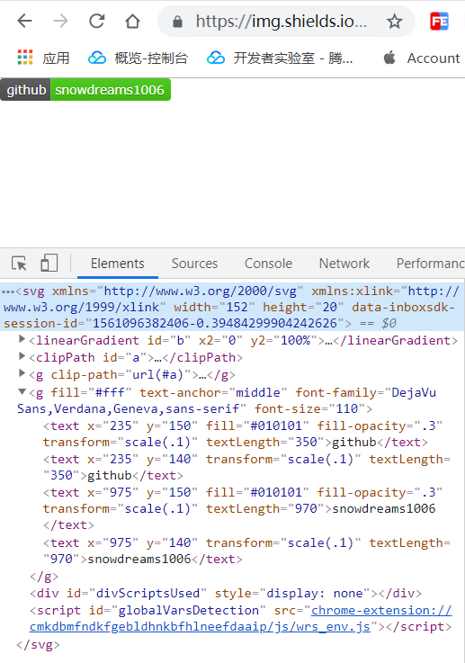

# github 上各式各样的小徽章从何而来?

## 前言

平时大家在在逛 `github` 时或多或少都看到过项目首页各式各样的小徽章,不知道你是否和我一样好奇这些小徽章都是哪来的呢?

首先我们先来一睹为快目前前端开发的三大主流框架: `var` ,看一看他们的 `github` 项目首页有哪些小徽章吧!

- `Vue` : [https://github.com/vuejs/vue](https://github.com/vuejs/vue)

[](https://circleci.com/gh/vuejs/vue/tree/dev)
[](https://codecov.io/github/vuejs/vue?branch=dev)
[](https://npmcharts.com/compare/vue?minimal=true)
[](https://www.npmjs.com/package/vue)
[](https://www.npmjs.com/package/vue)
[](https://chat.vuejs.org/)

- `Angular` : [https://github.com/angular/angular](https://github.com/angular/angular)

[](https://circleci.com/gh/angular/workflows/angular/tree/master)
[](https://www.browserstack.com/automate/public-build/LzF3RzBVVGt6VWE2S0hHaC9uYllOZz09LS1BVjNTclBKV0x4eVRlcjA4QVY1M0N3PT0=--eb4ce8c8dc2c1c5b2b5352d473ee12a73ac20e06)
[](https://gitter.im/angular/angular?utm_source=badge&amp;utm_medium=badge&amp;utm_campaign=pr-badge&amp;utm_content=badge)
[](https://www.npmjs.com/@angular/core)

- `React` : [https://github.com/facebook/react](https://github.com/facebook/react)

[](https://github.com/facebook/react/blob/master/LICENSE)
[](https://www.npmjs.com/package/react)
[](https://circleci.com/gh/facebook/react)
[](https://reactjs.org/docs/how-to-contribute.html#your-first-pull-request)

小结:

前端三大框架的徽章均不相同,由此可见,这应该不是 `github` 统一分发而是自定义行为!

> 虽然不是统一分配的,但也不是毫无规律可寻,想要制作专属的小徽章,其实真的很简单!

## 什么是徽章

徽章是一种小巧精美的小图标,一般配有相关文字进行辅助说明,富有表现力.

不仅出现于 `github` 项目主页,凡是能够表现图片的地方都可以出现徽章,本质上是一种 `svg` 格式的矢量图标.

下面以自定义 `github-snowdreams1006-brightgreen.svg` 徽章为例,简单认识一下徽章.

- 在线链接

> 在线链接: [github-snowdreams1006-brightgreen.svg](https://img.shields.io/badge/github-snowdreams1006-brightgreen.svg)

```plain
https://img.shields.io/badge/github-snowdreams1006-brightgreen.svg
```

- 浏览器效果

> 打开在线链接,并检查当前网页,豁然开朗,徽章是一种 `svg` 实现的矢量图标.



- `svg` VS `png` 

> 如果说 `svg` 是矢量图形而 `png` 却不是,所以不妨将 `png` 姑且称之为标量图形.

`svg` 是矢量图形,`png` 是标量图形,两者均能实现类似效果,只不过矢量图形不论怎么方法都能保持原样,并不会像 `png` 那样会失真而已.

既然两种均能表现相同的效果,现在我们就来演示一下 `png` 的实现效果.


> `svg` 转 `png` 在线网站: [https://cloudconvert.com/svg-to-svg](https://cloudconvert.com/svg-to-svg)


> 左侧的 `svg` 无论放大多少倍,依然保持原样,清晰度保持不变.右侧的 `png` 一旦放大,立马变得模糊不清.

## 如何使用徽章

大多数徽章都是 `svg` 格式,当然也不排除某些徽章是 `png` 格式,不论怎么说,一律当成图标使用就可以了.

如果你和我一样,希望在 `markdown` 文件中使用徽章,那么建议使用在线链接,或者引入本地 `svg` 相关文件.

> 徽章格式 : `[](超链接地址)` 即超链接内部嵌套图片

```markdown
[](https://github.com/snowdreams1006)
```

[](https://github.com/snowdreams1006)

如果你是在 `html` 文件使用徽章,同样先取得在线徽章地址,然后按照 `html` 语法插入图片即可.

> 徽章格式 : `<a href="超链接地址"></a>` 即超链接内部嵌套图片

```html
<a href="https://github.com/snowdreams1006">
	
</a>
```

<a href="https://github.com/snowdreams1006">
	
</a>

不论是什么语法,最核心最根本的获得到**徽章链接**,至于不同语言有着各自的语法,按照语言规则手动拼接就好.

- `Badge URL` 

```plain
https://img.shields.io/badge/github-snowdreams1006-brightgreen.svg
```

- `Markdown` 

```markdown
[](https://github.com/snowdreams1006)
```

- `HTML`

```html
<a href="https://github.com/snowdreams1006"></a>
```

- `Textile`

```textile
!https://img.shields.io/badge/github-snowdreams1006-brightgreen.svg!:https://github.com/snowdreams1006
```

- `RDOC`

```rdoc
{}[https://github.com/snowdreams1006]
```

- `AsciiDoc`

```asciidoc
image:https://img.shields.io/badge/github-snowdreams1006-brightgreen.svg["github", link="https://github.com/snowdreams1006"]
```

- `RST`

```rst
.. image:: https://img.shields.io/badge/github-snowdreams1006-brightgreen.svg
    :target: https://github.com/snowdreams1006
```

## 徽章分类

如果以徽章的**格式**为标准,那么可以分为`svg` 和 `png` 两类.

- `svg`

```plain
https://badge.fury.io/js/gitbook-plugin-mygitalk.svg
```


- `png`

```plain
https://badge.fury.io/js/gitbook-plugin-mygitalk.png
```


如果以徽章的**内容数据是否动态**为标准,那么可以分为静态数据和动态数据两类.

> 静态数据意味着数据本身是不变的,只要在线链接不变,那么生成的徽章永远不会改变,而动态数据意味着生成徽章的数据是动态变化的,即使在线链接不变,当数据本身发现变化时,徽章自然随之更新.

- 静态数据

```plain
https://img.shields.io/badge/github-snowdreams1006-brightgreen.svg
```


- 动态数据

```plain
https://badge.fury.io/js/gitbook-plugin-mygitalk.svg
```


> 静态数据示例中 `github-snowdreams1006-brightgreen.svg` 数据不会更改,自然生成的徽章也不会变.动态数据示例中 `gitbook-plugin-mygitalk.svg` 是 `npm` 的版本号,当项目升级后,版本号会发生更改,那么生成的徽章也会随之更新.

如果以徽章的**内容数据来源**为标准,那么可以有无数多的分类.

- `GitHub`

```plain
https://badgen.net/github/stars/snowdreams1006/gitbook-plugin-mygitalk
```


- `Npm` 

```plain
https://badgen.net/npm/dt/gitbook-plugin-mygitalk
```


- `Docker`

```plain
https://badgen.net/docker/stars/library/centos
```


如果以徽章的**内容数据用途**为标准,那么也可以有无数多的分类.


## 静态进度条徽章

[](https://github.com/fehmicansaglam/progressed.io)
[](https://github.com/fehmicansaglam/progressed.io)
[](https://github.com/fehmicansaglam/progressed.io)
[](https://github.com/fehmicansaglam/progressed.io)

```markdown
[](https://github.com/fehmicansaglam/progressed.io)
[](https://github.com/fehmicansaglam/progressed.io)
[](https://github.com/fehmicansaglam/progressed.io)
[](https://github.com/fehmicansaglam/progressed.io)
```

## 自定义徽章

[](https://github.com/snowdreams1006)
[](https://www.imooc.com/u/5224488/articles)
[](https://www.jianshu.com/u/577b0d76ab87)
[](https://blog.csdn.net/weixin_38171180)
[](https://www.cnblogs.com/snowdreams1006/)
[](https://juejin.im/user/582d5cb667f356006331e586)
[](https://segmentfault.com/u/snowdreams1006)
[](https://my.oschina.net/snowdreams1006)
[](https://cloud.tencent.com/developer/user/2952369/activities)

```markdown
[](https://github.com/snowdreams1006)
[](https://www.imooc.com/u/5224488/articles)
[](https://www.jianshu.com/u/577b0d76ab87)
[](https://blog.csdn.net/weixin_38171180)
[](https://www.cnblogs.com/snowdreams1006/)
[](https://juejin.im/user/582d5cb667f356006331e586)
[](https://segmentfault.com/u/snowdreams1006)
[](https://my.oschina.net/snowdreams1006)
[](https://cloud.tencent.com/developer/user/2952369/activities)
```

## 抛砖引玉

[](https://www.npmjs.com/package/gitbook-plugin-mygitalk)
[](https://www.npmjs.com/package/gitbook-plugin-mygitalk)
[](https://www.npmjs.com/package/gitbook-plugin-mygitalk)
[](https://github.com/snowdreams1006/gitbook-plugin-mygitalk)
[](https://github.com/snowdreams1006/gitbook-plugin-mygitalk/fork)

```markdown
[](https://www.npmjs.com/package/gitbook-plugin-mygitalk)
[](https://www.npmjs.com/package/gitbook-plugin-mygitalk)
[](https://www.npmjs.com/package/gitbook-plugin-mygitalk)
[](https://github.com/snowdreams1006/gitbook-plugin-mygitalk)
[](https://github.com/snowdreams1006/gitbook-plugin-mygitalk/fork)
```

> 上述徽章是 [gitbook-plugin-mygitalk](https://github.com/snowdreams1006/gitbook-plugin-mygitalk) 项目引用的小徽章,亲测的确不是统一分配的呢!

## 参考文档

- [为你的Github README生成漂亮的徽章和进度条](https://shikieiki.github.io/2017/03/01/%E4%B8%BA%E4%BD%A0%E7%9A%84Github%E7%94%9F%E6%88%90%E6%BC%82%E4%BA%AE%E7%9A%84%E5%BE%BD%E7%AB%A0%E5%92%8C%E8%BF%9B%E5%BA%A6%E6%9D%A1/)
- [给python项目在github贴上build和pypi小徽章](https://blog.csdn.net/mouday/article/details/82804630)
- [GitHub 项目徽章的添加和设置](https://juejin.im/post/5a32157c6fb9a0450b6667ac#heading-10)
- [玩转 Github 徽章](https://www.jianshu.com/p/afba6e33e48e)
- [forthebadge](https://forthebadge.com/)
- [badges](https://github.com/boennemann/badges)
- [ga-beacon](https://github.com/igrigorik/ga-beacon)
- [shields](https://shields.io/)
- [progressed](https://github.com/fehmicansaglam/progressed.io)
- [Version Badge](https://badge.fury.io/)
- [GitHub SVG Buttons](http://githubbadges.com/)
