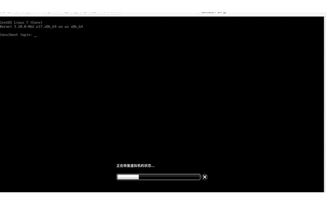

# 给mac装个虚拟机

`mac` 系统安装虚拟机目前有两种主流软件,一种是 `Parallels Desktop` ,另一种是 `vmware`.

本教程选用的是 `vmware` ,因为我之前 `windows` 上安装的虚拟机软件就是`vmware`,所以当然选择熟悉的方式鼓捣 `mac` 虚拟机了啊!

如果你没听说过虚拟机,可能你走错门了,不太适合看这篇教程.如果你执意要了解一下新知识,那我只能用自己浅薄的知识简单介绍下虚拟机的基本概念,一家之言,仅供参考哟!

正常来说,我们当前使用的电脑一般只有一个系统,比如你买的是 `mac` 笔记本,那么电脑系统就是 `mac` 操作系统,肯定不会是 `windows` 操作系统,所以你在 `mac` 电脑上看不到 `windows` 的办公软件三件套(`word,excel,ppt`).

当然你的电脑如果是 `联想,戴尔,华硕,神舟` 等等品牌的话 ,操作系统一般都是 `windows`,自然也不会是看到 `mac` 电脑上的 `xcode` 软件.

这一点很好理解,每种电脑与生俱来自带特定的操作系统,但是,竟然有一种方法能够突破这层限制!

## 什么是虚拟机

> 虚拟机（Virtual Machine）指通过软件模拟的具有完整硬件系统功能的、运行在一个完全隔离环境中的完整计算机系统。

虚拟机,顾名思义是虚拟的机器.**虚拟**意味着不是真实的,**机器**意味着功能像是一台机器.
所以,我们能够理解上述百度百科的定义,虚拟机就是通过软件模拟实现真实机器功能.

软件模拟硬件是手段,实现机器功能是目的,既然如此理论上应该能够模拟任何操作系统,从而实现一台真实的物理机可以有多种不同的操作系统!

这样一来是不是很神奇?一台 `mac` 可以模拟出 `Windows` 电脑,也可以模拟出 `linux` 电脑.

换言之,只要有一台真实的物理机,通过软件我们就可以模拟出任意操作系统,这种软件就是我们接下来要介绍的 `vmware` .

## 为什么是 `vmware`

通过软件模拟实现虚拟机目标,关键在于软件能力如何,所以选择哪一款软件直接决定了我们的虚拟机性能如何.

市面上,这种软件并不是唯一一家,至少目前我了解的就有 `vmware` ,`Parallels Desktop` 和 `virtualbox` .那么为什么选择 `vmware` 呢?

没有为什么,因为我之前用过 `vmware` 而已,对于小白的我,并没研究过三者软件有什么区别,哪一种更好,只要操作足够简单,市面上足够流行就可以了.

## 快速体验 `vmware`

本教程使用的是 `mac` 电脑,利用虚拟机安装了三种不同系统,分别是 `win7旗舰版` , `centos7.5` 和

`Ubuntu18`.

- `windows` 虚拟机

> 启动 `windows7 旗舰版` 虚拟机,并且打开 `chrome` 浏览器测试.

- `centos` 虚拟机

> 启动 `centos7.5` 虚拟机,并且输入 `pwd` 命令测试.

- `ubuntu` 虚拟机

> 启动 `ubuntu18` 虚拟机,并且输入 `pwd` 命令测试.

## 如何安装 `vmware`

需要实现准备好下载工具以及留下足够的内存空间,因为虚拟机和镜像毕竟都挺大,下载挺费时间,安装也比较占内存,毕竟是完整的虚拟机.

### 下载软件以及序列号生成工具

- `VMware-Fusion-11.0.3-12992109.dmg` [必选] 安装软件

> `vmware` 软件是收费软件,有一段时间的试用期,这里采用序列号激活方式,有条件的话,建议支持下正版.

- `KeyMaker.app` [可选] 序列号生成工具

> 如果是选择[官网试用版](https://my.vmware.com/cn/web/vmware/downloads)或者已购买正版,自然不需要序列号生成功能.

### 安装 `VMware-Fusion` 软件

双击安装 `VMware-Fusion-11.0.3-12992109.dmg` 软件,接下来**一路允许**按照提示操作即可.

### 打开 `KeyMaker` 软件

双击运行 `KeyMaker.app` ,弹出一系列序列号,随意选择某一行的序列号复制到上一步安装`VMware-Fusion` 的产品密钥并验证.

### 验证 `vmware` 软件

在访达或启动台中找到 `VMware-Fusion` 软件单击启动,测试能否正常运行软件.

## 小结

本节主要介绍了什么是虚拟机,虚拟机的适用场景以及如何安装虚拟机,下一节我们将介绍如何给虚拟机加点料,让虚拟机派上练武之地!

