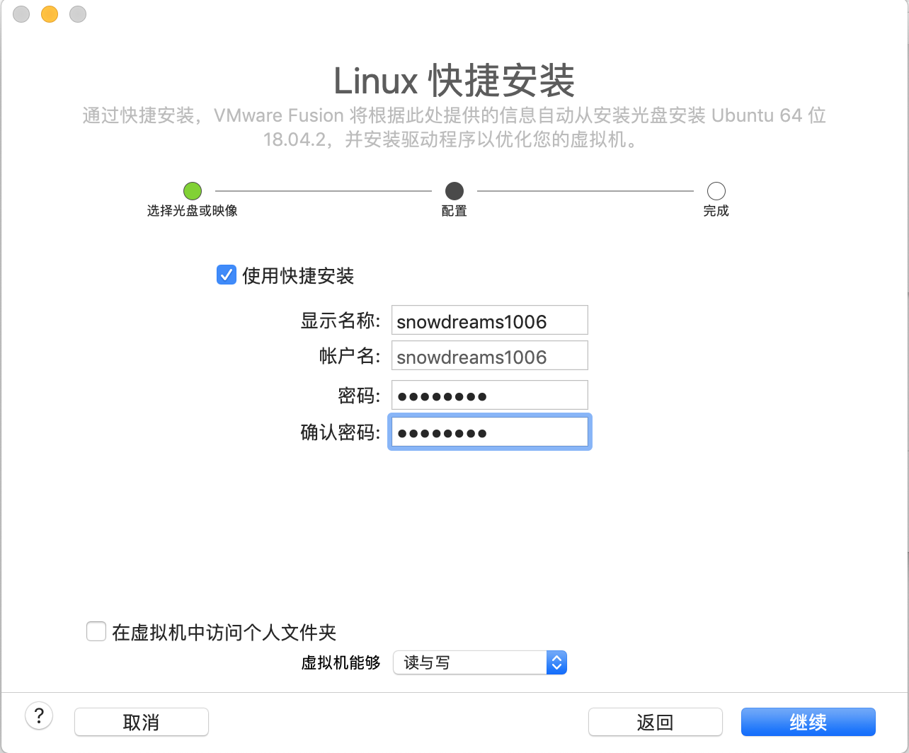
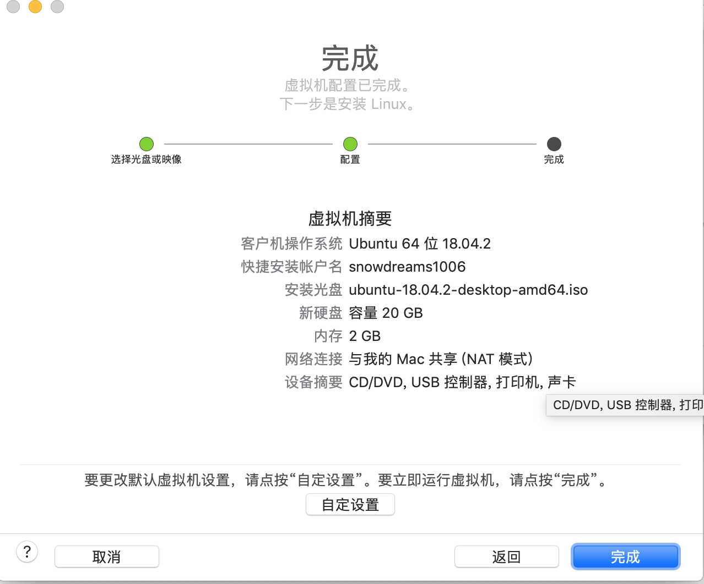
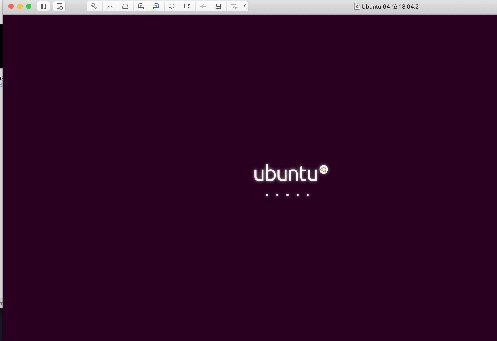
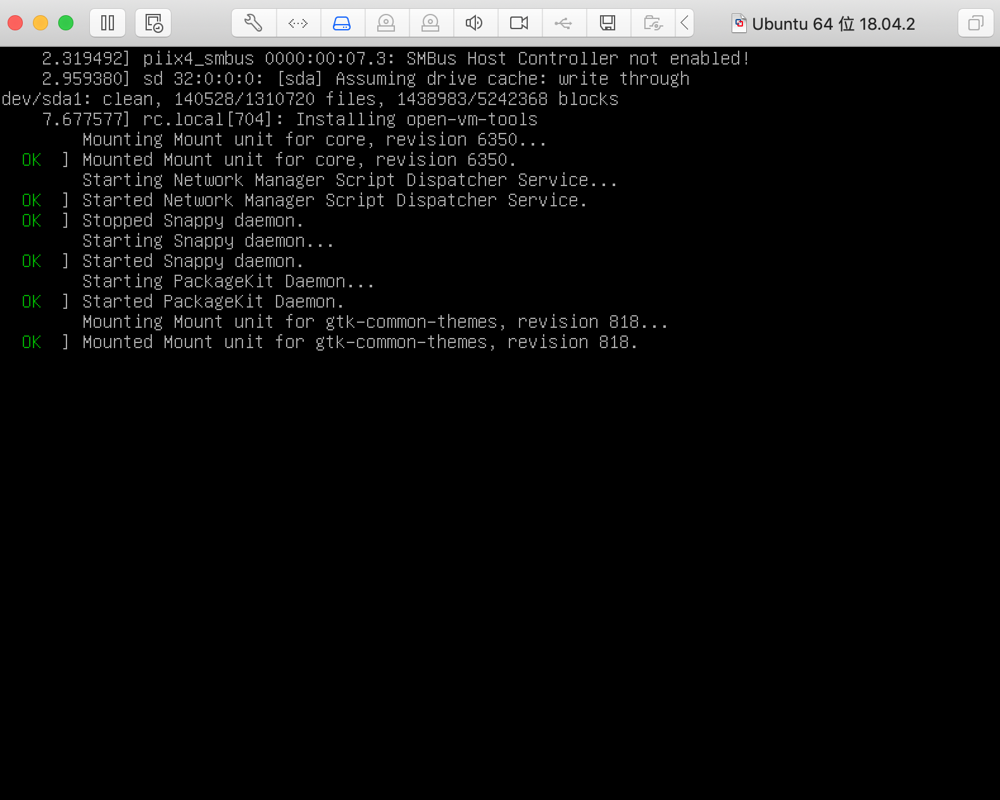
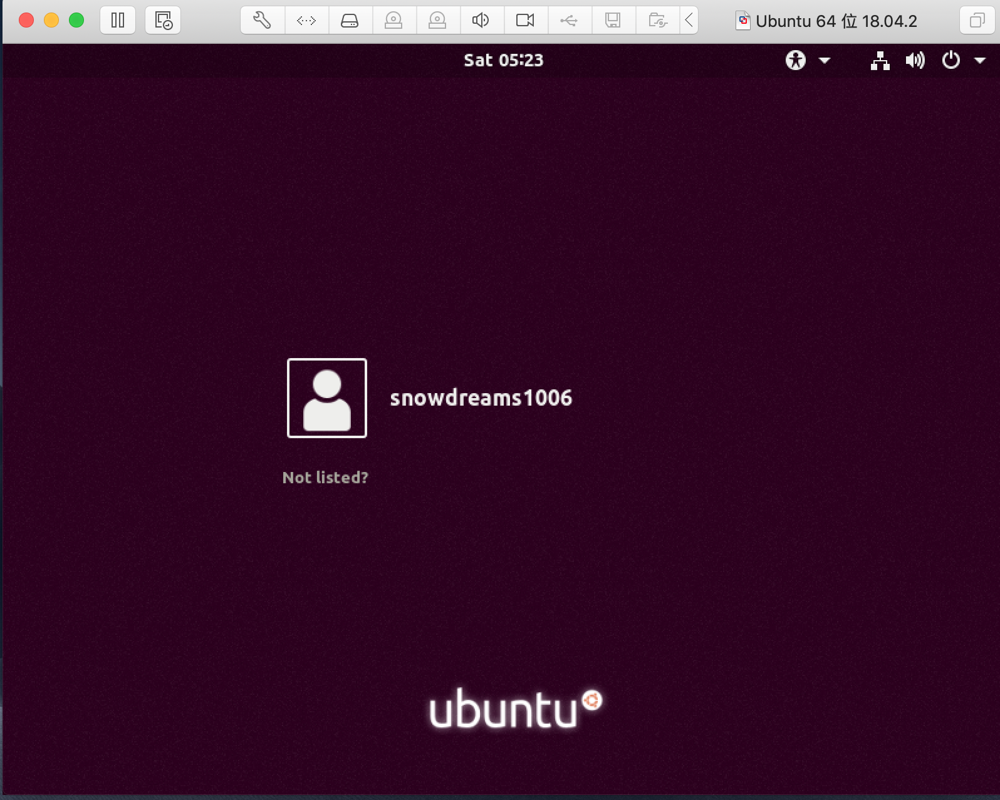
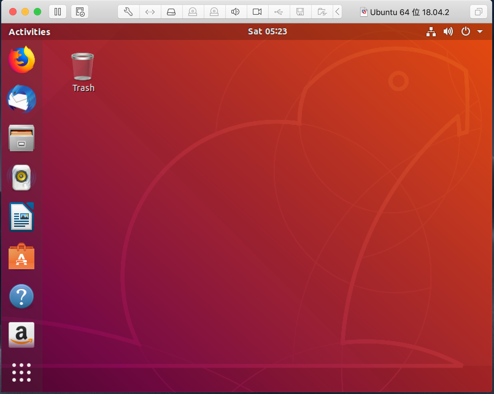

# 给 mac 虚拟机装个 ubuntu

前文我们已经讲解了如何在 `mac` 系统上安装虚拟机软件,这节我们接着讲解如何利用虚拟机安装 `Ubuntu` 镜像.

安装镜像的大致步骤基本相同,只不过是配置项略显不同而已,如果需要安装其他系统镜像,请参考另外两篇教程.

## 下载镜像

> [Ubuntu 操作系统下载](https://www.ubuntu.com/download): https://www.ubuntu.com/download

这里我们选择桌面版(Ubuntu Desktop),接着选择 `LTS` 长期支持版进行下载安装.

按照实际需要选择适合自己的操作系统,这里选择的是 `Ubuntu18 LTS` ,然后选择下载.

## 配置镜像

> 准备好已下载的镜像文件: `ubuntu-18.04.2-desktop-amd64.iso` 

打开 `VMware` 软件,选择 `文件->新建` 选项开始安装镜像文件.

弹出安装配置界面,选择 `从光盘或镜像中安装` 选项,然后将已下载的镜像文件拖动到安装区进行识别.

识别到镜像文件后选中该文件,点击 `继续` 准备下一步安装.

`linux` 快捷安装选项中配置用户信息,点击 `继续` .

确认配置信息无误后,点击 `完成` ,等待镜像安装...

## 安装镜像

只因在人群中看见了 `Ubuntu` ,便确定了你就是我要安装的操作系统.

惊鸿一瞥,容颜出现,安装进行时.

熟悉的命令行,成功只差一步.

现在输入之前配置的账号信息,开始登陆系统,见证奇迹的时刻即将来临...

终于等到你,还好我没放弃!

## 小结

总体来说,`mac` 系统安装 `Ubuntu` 镜像配置比较简单,基本上按照默认配置即可.

下载镜像时文件一般比较大,需要利用专门的第三方工具下载,既可以选择下载种子链接也可以直接下载.

