# 给 mac 虚拟机装个 windows

前面我们介绍了如何在 `mac` 宿主机安装 `VMware` 虚拟机软件,本节我们将继续介绍如何给虚拟机安装 `windows` 镜像,切换不同的操作系统.

> `VMware` 软件是容器,镜像是内核,这里的镜像指的是操作系统.

## 下载镜像

> [windows 操作系统下载](https://msdn.itellyou.cn/): https://msdn.itellyou.cn/

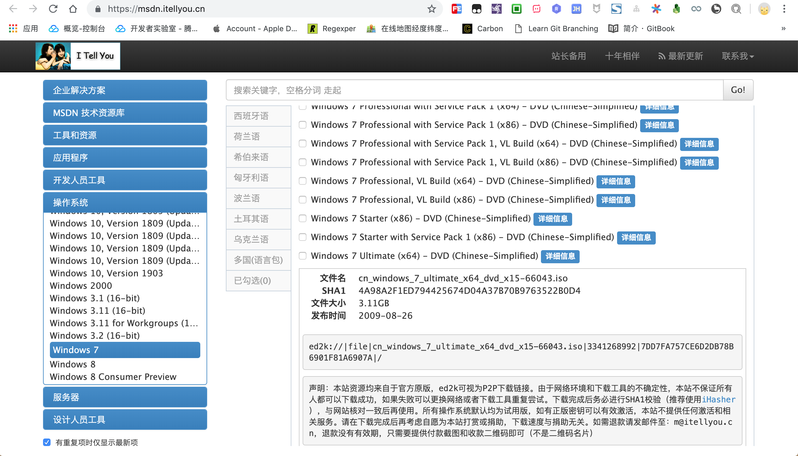

按照实际需要选择适合自己的操作系统,这里选择的是 `win7 旗舰版` ,然后选择详情会弹出下载链接.

一般需要使用迅雷等第三方工具下载种子链接,大小一般在 `3g` 多,下载时间稍微比较久!

```
ed2k://|file|cn_windows_7_ultimate_x64_dvd_x15-66043.iso|3341268992|7DD7FA757CE6D2DB78B6901F81A6907A|/
```

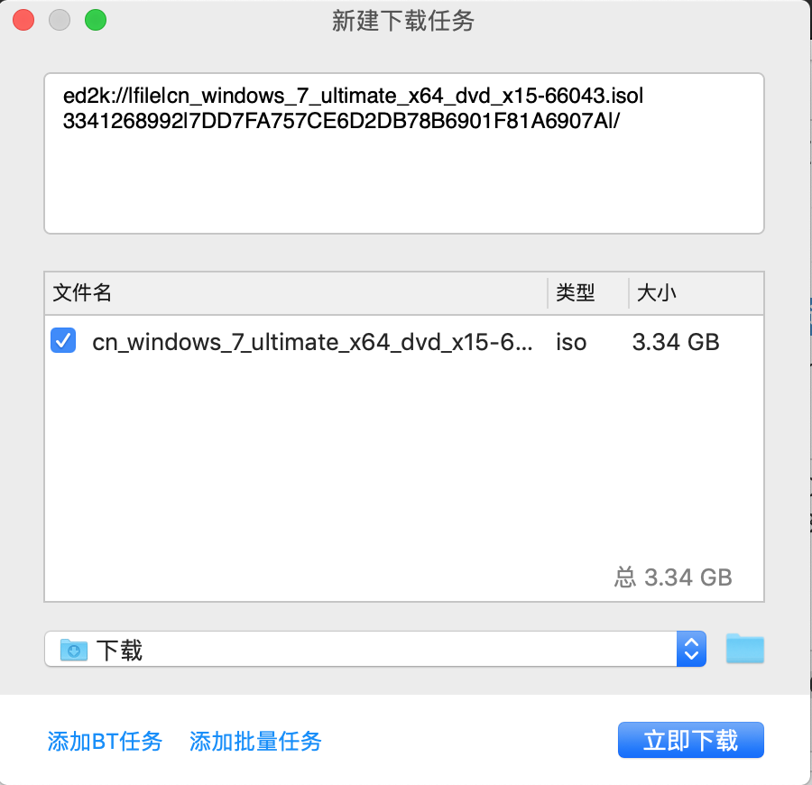

## 配置镜像

> 准备好已下载的镜像文件: `cn_windows_7_ultimate_x64_dvd_x15-66043.iso` 

打开 `VMware` 软件,选择 `文件->新建` 选项开始安装镜像文件.


弹出安装配置界面,选择 `从光盘或镜像中安装` 选项,然后将已下载的镜像文件拖动到安装区进行识别.


识别到镜像文件后选中该文件,点击 `继续` 准备下一步安装.

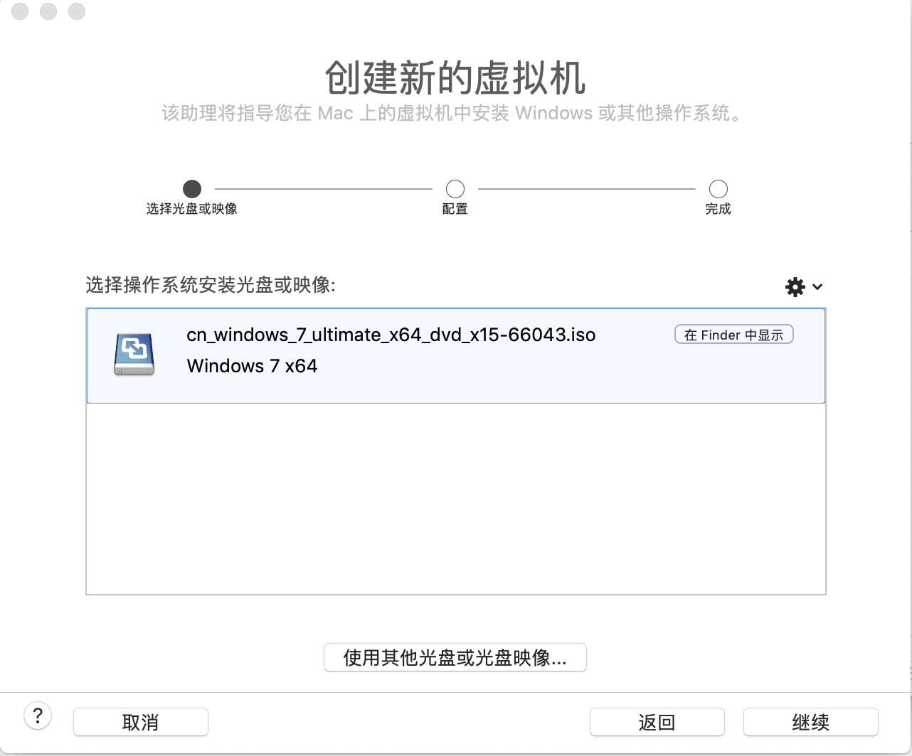

配置账号信息以及产品密钥等信息,暂时不需要激活的话,也可以不填写产品密钥.

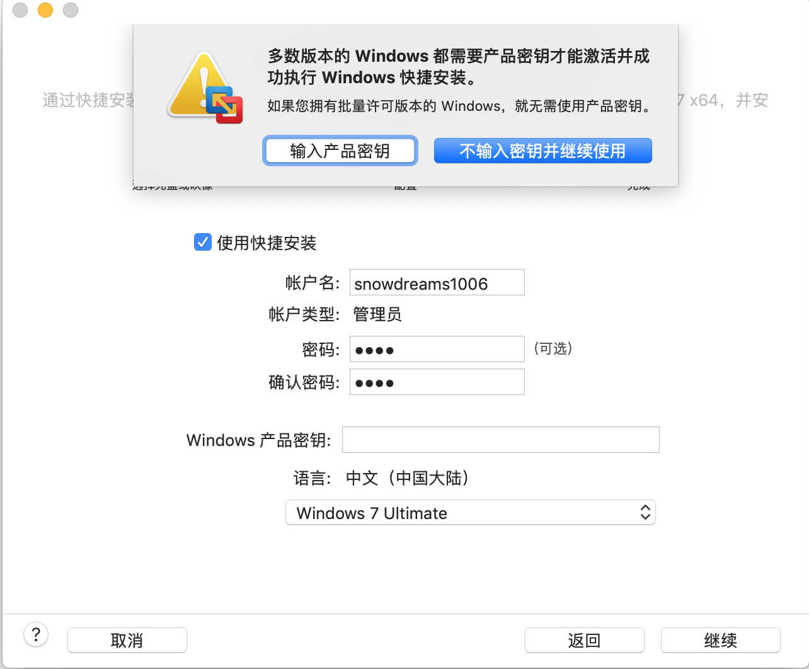

集成方式选择 `更加独立` ,然后点击 `继续`.

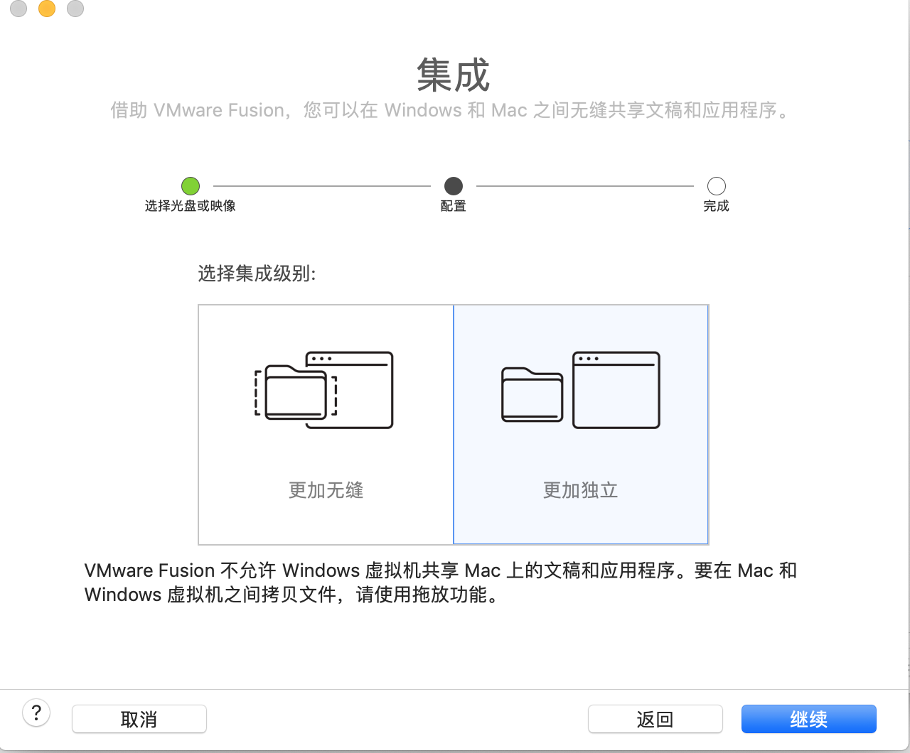

提示下载 `VMware Tools` 工具,如果可以的话,最好还是先下载,也可以安装完毕后再手动下载.

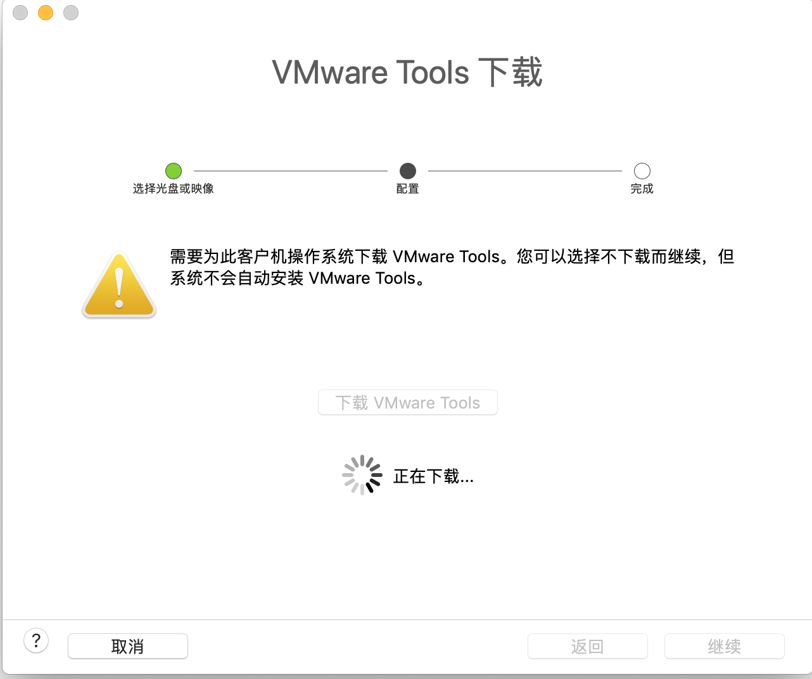

确认配置信息无误后,点击 `完成` ,等待镜像安装,,,

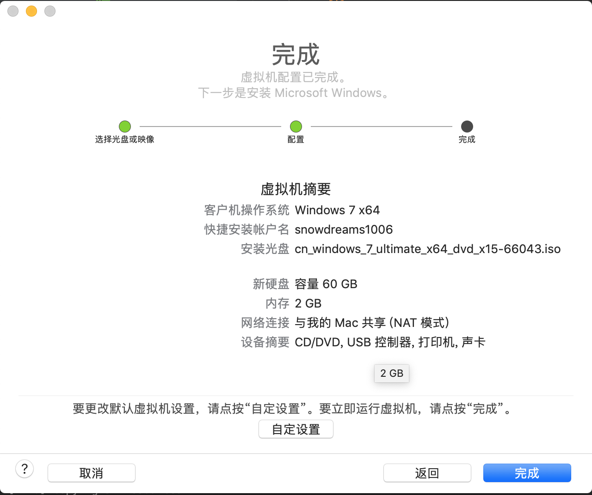

## 安装镜像

人生若只如初见,远远望见熟悉的背影,便确定了你就是我要安装的操作系统.


期待花开,耐心等待你的文件复制进程.

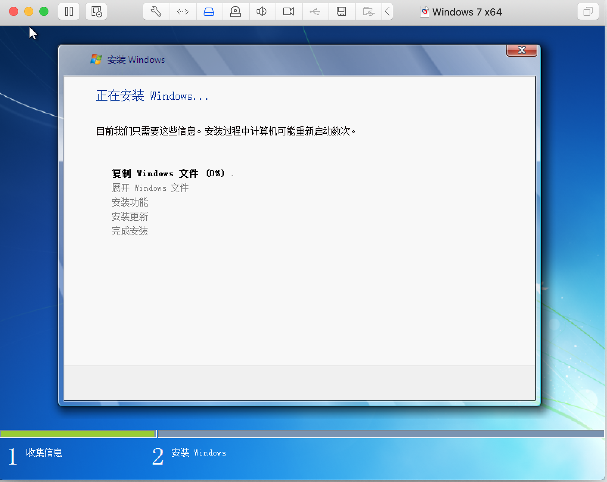

花开花落又是一年,你说重启才能遇到最美的季节,那我便等待你的凤凰涅槃.

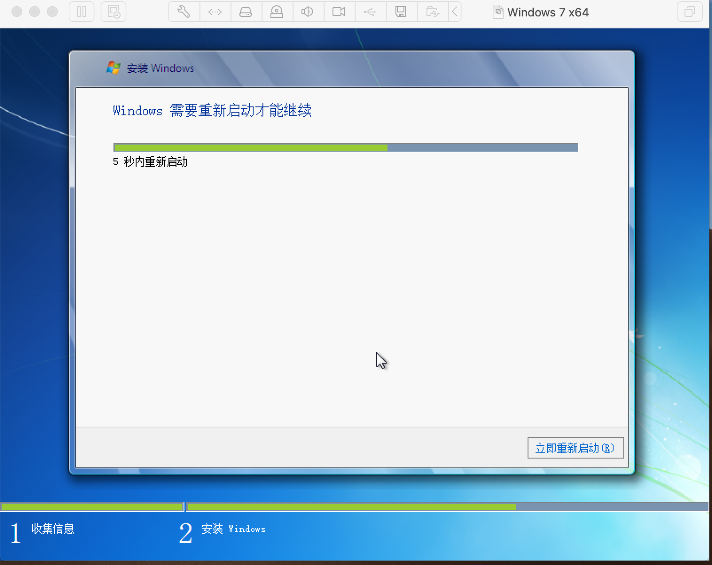

见证你的凤凰涅槃,期待你的浴火重生.

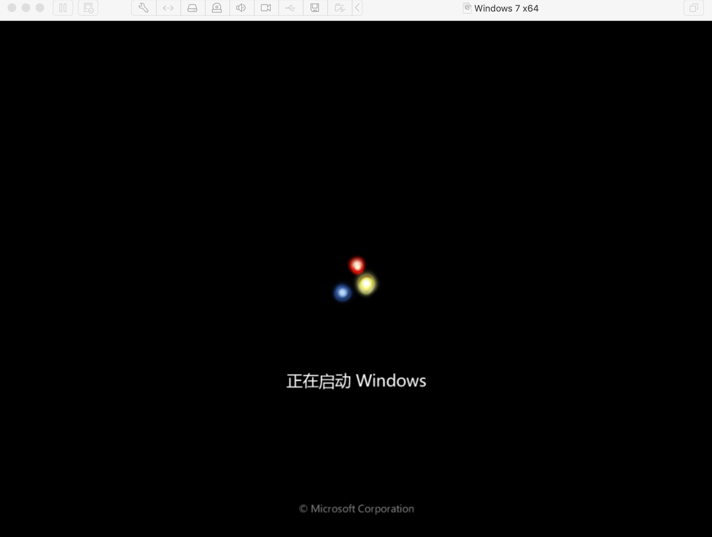

浴火重生后的操作系统,还差最后一步就能欣赏你的容颜.

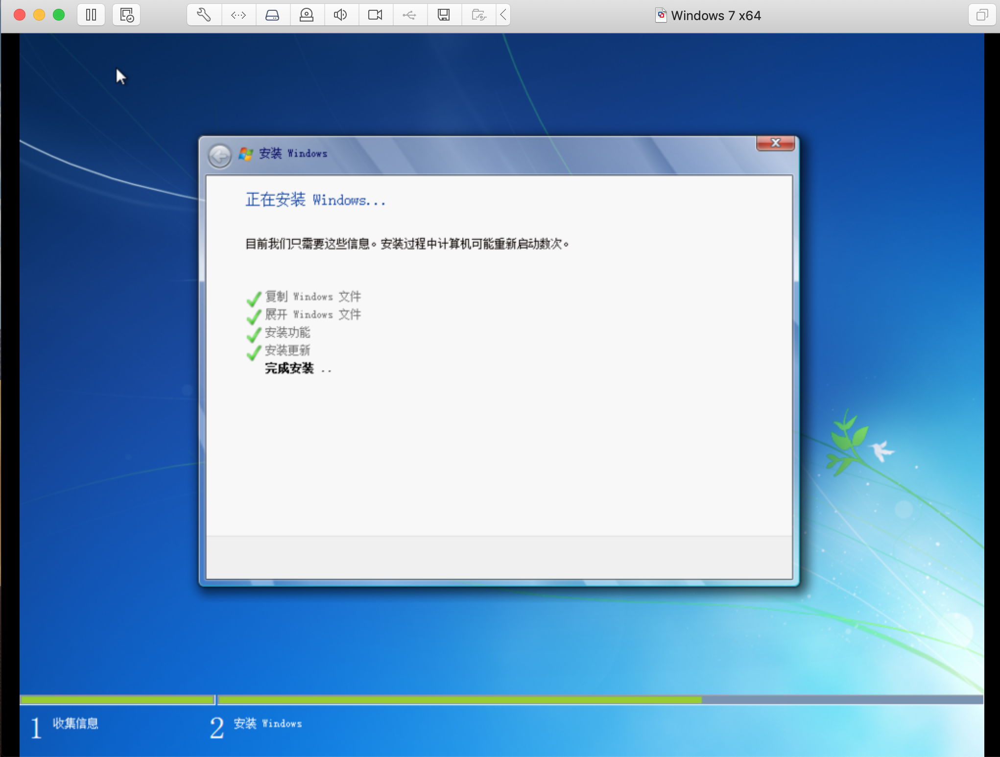

千呼万唤始出来,犹抱琵琶半遮面,正在进行最后的准备桌面.

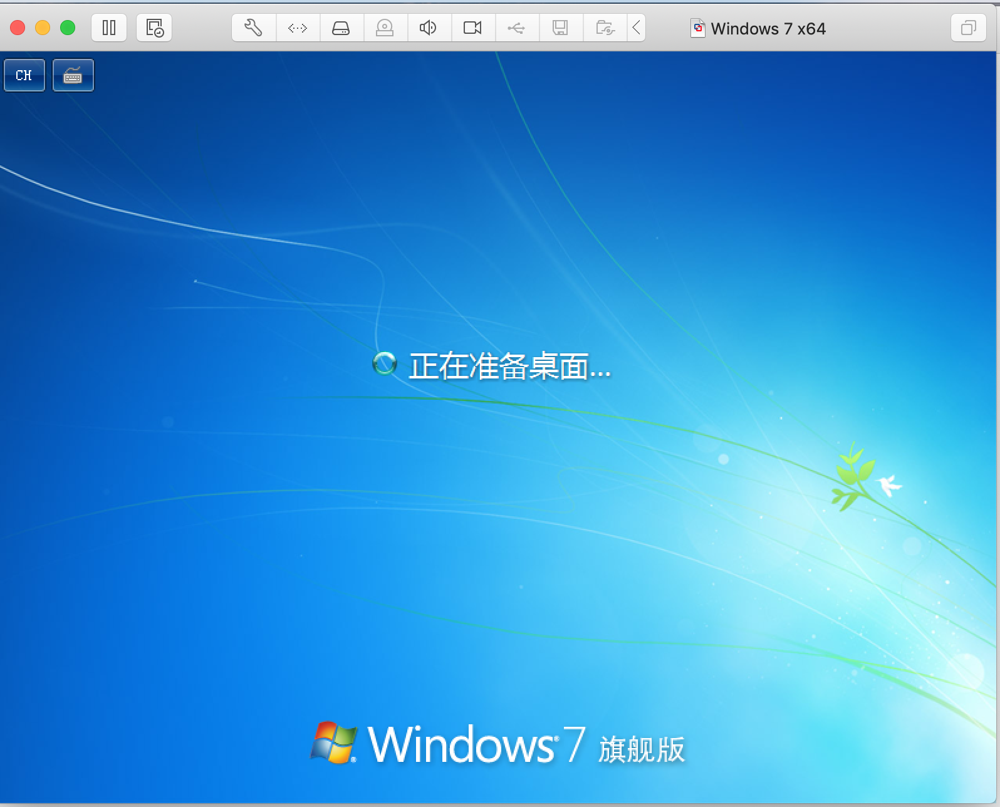

终于等到你,还好我没放弃!

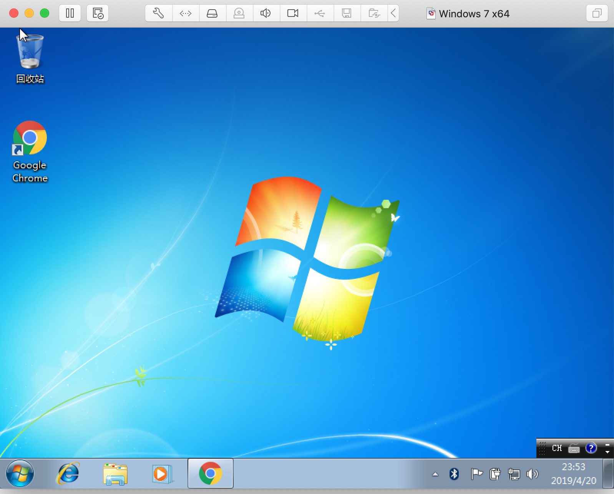

## 小结

总体来说,`mac` 系统安装 `windows` 镜像配置比较简单,基本上按照默认配置即可.

下载镜像时文件一般比较大,需要利用专门的第三方工具下载,比如本文提供的下载链接是种子文件,选择的第三方工具就是迅雷.

