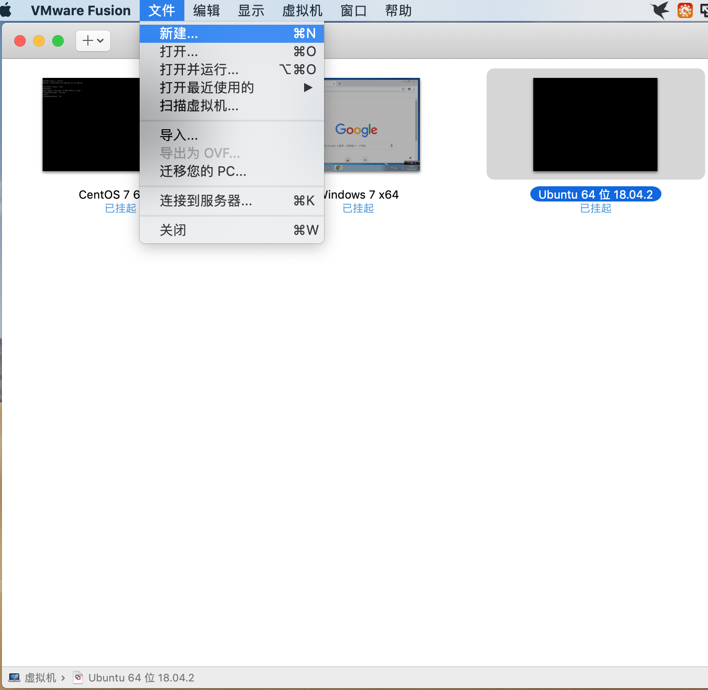
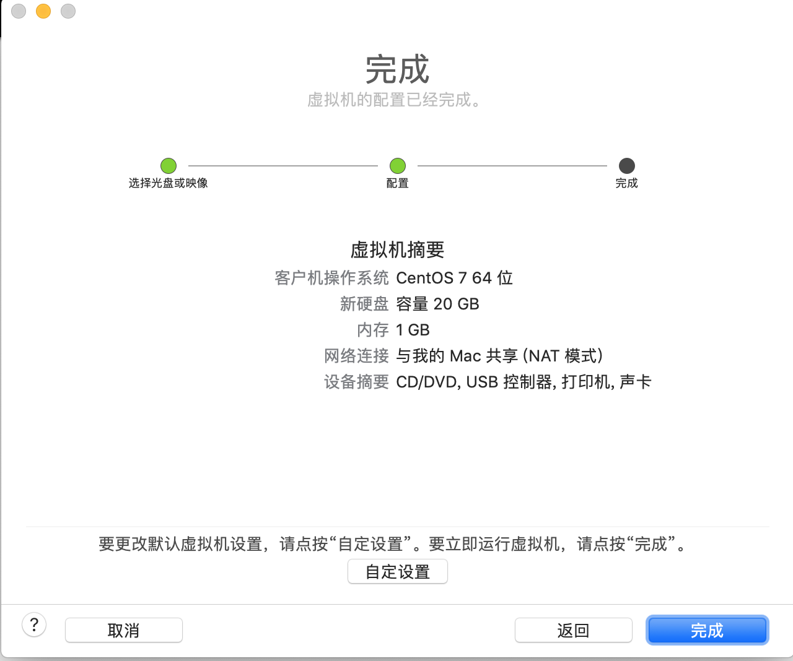
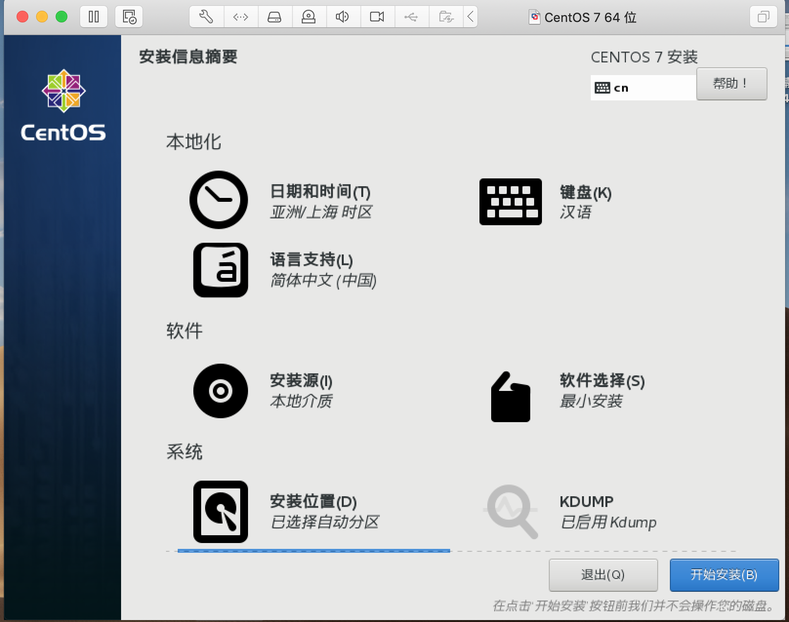

# 给虚拟机装个centos

前文我们已经讲解了如何在 `mac` 系统上安装虚拟机软件,这节我们接着讲解如何利用虚拟机安装 `centos` 镜像.

安装镜像的大致步骤基本相同,只不过是配置项略显不同而已,如果需要安装其他系统镜像,请参考另外两篇教程.

## 下载镜像

> [centos 操作系统下载](https://www.centos.org/download/): https://www.centos.org/download/

`DVD ISO` 和 `Minimal ISO` 两种类型,普通用户推荐选择前一种标准版,开发用户建议选择后一种最小版.

> 标准版功能比较齐全,最小版保证最小依赖,后续缺啥填啥,比较灵活节省空间内存.

按照实际需要选择适合自己的操作系统,这里选择的是 `centos7.6` ,然后选择合适的下载方式(直接下载或下载种子链接).

建议选择镜像服务器下载,如果直接下载官网的地址,速度感人,时间有点长.

> 依次选择 `list of current mirrors -> http://mirrors.aliyun.com/centos/ -> 7.6.1810/ -> isos/ -> x86_64/  -> CentOS-7-x86_64-Minimal-1810.iso` 选择合适的版本点击下载.

## 配置镜像

> 准备好已下载的镜像文件: `CentOS-7-x86_64-Minimal-1804.iso` 

打开 `VMware` 软件,选择 `文件->新建` 选项开始安装镜像文件.

弹出安装配置界面,选择 `从光盘或镜像中安装` 选项,然后将已下载的镜像文件拖动到安装区进行识别.

识别到镜像文件后选中该文件,点击 `继续` 准备下一步安装.

选择固件类型,默认方式 `传统 BIOS` .然后点击 `继续` .

确认配置信息无误后,点击 `完成` ,等待镜像安装,,,

## 安装镜像

只因在人群中看见了 `centos` ,便确定了你就是我要安装的操作系统.

阅览安装摘要信息,等待继续安装.

设置用户信息,包括设置 `root` 用户密码和创建初始用户账号信息.

花开花落又是一年,你说重启才能遇到最美的季节,那我便等待你的凤凰涅槃.

终于等到你,还好我没放弃!

> 按照之前配置的用户信息登录系统,打印出当前路径,证明安装成功.

## 小结

总体来说,`mac` 系统安装 `centos` 镜像配置比较简单,基本上按照默认配置即可.

下载镜像时文件一般比较大,需要利用专门的第三方工具下载,既可以选择下载种子链接也可以直接下载.

