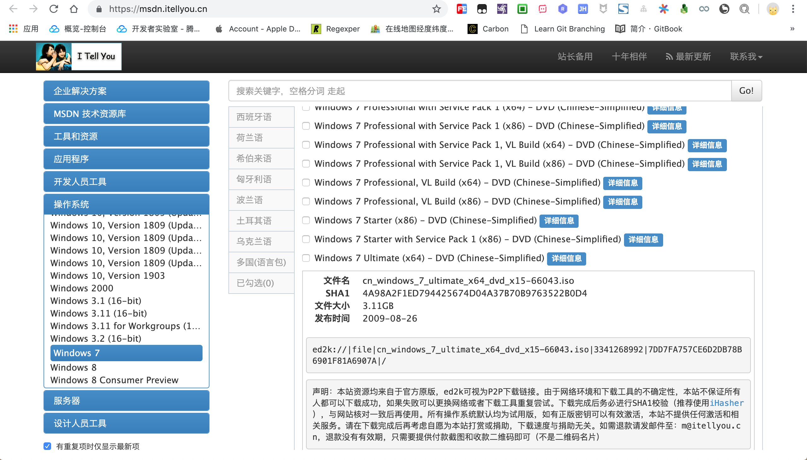

# 给虚拟机装个windows

前面我们已经给 `mac` 宿主机安装了 `VMware` 虚拟机软件,本节我们将介绍如何给虚拟机安装镜像,体验双系统的便利特点.

`VMware` 软件是基础容器,不同的镜像是容器的核心,这里的镜像指的是操作系统.

## 下载镜像

> [操作系统下载](https://msdn.itellyou.cn/)



按照实际需要选择适合自己的操作系统,这里选择的是 `win7 旗舰版` ,然后选择详情会弹出下载链接.

一般需要使用迅雷等第三方工具下载种子链接,大小一般在 `3g` 多,下载时间稍微比较久!

```
ed2k://|file|cn_windows_7_ultimate_x64_dvd_x15-66043.iso|3341268992|7DD7FA757CE6D2DB78B6901F81A6907A|/
```


## 安装镜像

> 准备好已下载的镜像文件: `cn_windows_7_ultimate_x64_dvd_x15-66043.iso` 

打开 `VMware` 软件,选择 `文件->新建` 选项开始安装镜像文件.


弹出安装配置界面,选择 `从光盘或镜像中安装` 选项,然后将已下载的镜像文件拖动到安装区进行识别.


识别到镜像文件后选中该文件,点击 `继续` 准备下一步安装.


