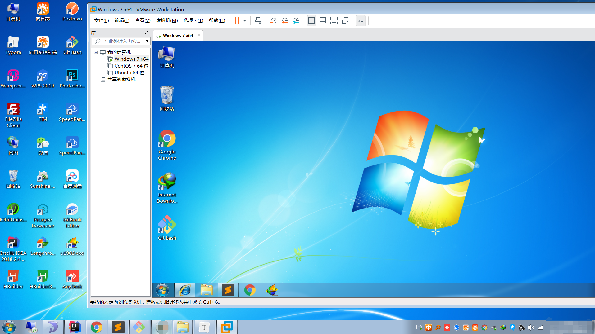
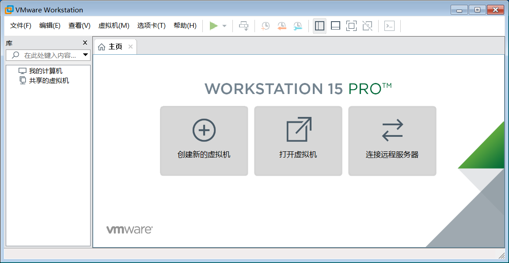
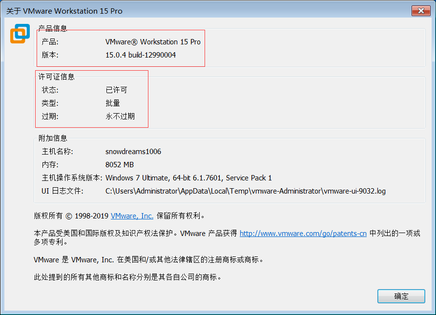

# 给 windows 装个 vmware 虚拟机

如果长时间处于同一种环境,慢慢得我们会觉得有些无聊,所以适当地出去走走看看外面的世界能带给我们不一样的体验.

所以,何不出去走走,看看另一个世界?


然而,平时需要工作很难抽身无所顾忌地潇洒走开,这是不是意味着无法离开,要画地为牢了呢?

既然是工作问题,那么我们就从工作本身开始改变,我们每个人的电脑正常来说都只有一个操作系统,如果有一种方式能够让你切换到另一种操作系统上,岂不是相当于计算机的旅游了吗?

虽然我们本人不能亲身去另外一个地方看看,就让计算机代替我们去体验不同的环境吧!



> 虚拟机理论上支持任何操作系统,换句话说,`Windows` 系统可以装 `Windows` ,也可以装 `Mac` 和 `Linux` 等等.

## 如何换个新环境

`Windows` 电脑想要体验另一种操作系统,最简单的方式莫过于借助**虚拟机**方式,何为**虚拟机**?

> 虚拟机（Virtual Machine）指通过软件模拟的具有完整硬件系统功能,运行在一个完全隔离环境中的完整计算机系统.

虚拟机,顾名思义就是虚拟的计算机,虚拟意味着并不是真正的,计算机意味着拥有普通电脑的基本功能.
所以虚拟机要表达的意思就是说,创建一台并不是真实的计算机,但这种计算机却拥有普通计算机的基本能力.

正是由于虚拟机概念的提出,使得原本单一的操作系统支持多种不同的操作系统.`Windows` 计算机可以装`Windows` ,也可以装 `Mac` ,当然还有开发人员专用的 `Linux`.

> 原来的计算机称之为物理机也叫作宿主机,新产生的计算机就是虚拟机.

只要有明确的目标,虚拟机就能带你的计算机去另外一个世界.

平时不敢在物理机进行的秘密实验,你可以搬到虚拟机去实验;
羡慕键盘如飞的电脑黑客,你可以装个 `Linux` 虚拟机去体验一把命令行操作的灵活自由;
某些操作只能使用 `Mac` 电脑完成而苦于身边没有 `Mac` 电脑,也可以装个 `Mac` 虚拟机感受一下苹果的优雅.

...

不论是哪一种应用场景,虚拟机基本上都能满足,值得注意的是,虚拟机虽好,不要贪多哟!

> 只有物理机的性能足够强劲,才建议安装虚拟机,否则的话,病怏怏的身体怎么承受得住活泼好动灵魂的折腾.

## 安装虚拟机软件

市面上的虚拟机软件可选性有不少,而我主要介绍的是 `VMware` 软件的解决方案.

> `VMware` 软件不仅支持 `Windows` 宿主机,也支持 `Mac` 宿主机,而且一直在用也挺好的.

既然应认定了 `VMware` ,那还等什么,赶紧出来让我们看一眼吧!

百度搜索 `vmware` 或者直接进入 [https://www.vmware.com/cn.html](https://www.vmware.com/cn.html) 即可访问 `vmware` 官网.


> 如果无法访问,可能需要另辟蹊径,具体原因你猜猜看.

打开 `下载 > 免费产品试用版和演示 > Workstation Pro` 查看下载页面.


跳转到下载页面后,选择 `Windows` 版本,点击 [立即下载](https://www.vmware.com/go/getworkstation-win),耐心等待文件下载.


> `Windows` 下载链接: [https://www.vmware.com/go/getworkstation-win](https://www.vmware.com/go/getworkstation-win)

下载完毕后,双击 `VMware-workstation-full-15.0.4-12990004.exe` 进行默认安装,安装过程比较简单,以下动图仅供参考.


```
GF1T2-D8G97-M85MY-LDMNC-PZA96
AV34H-DDG8L-48EXQ-CQZET-ZZUR2
YY51H-FJXEQ-H85YQ-U5M5X-Q38D0
VY74R-FXX81-085PQ-DMMQT-X2AF6
VY10K-8WY03-H808Y-35YZE-NKKV2
YY11K-8UY46-M88MP-VMYEE-MYAF6
AA30K-27ZEL-480DQ-3DZ7C-MQKU4
VV7N8-D2E41-M852Q-8EQEX-ZQRU0
VC190-46W06-08E8P-TGQ5T-MLR8D
AZ3NH-DQX9N-488RP-15ZXC-Q68VA
```

现在 `vmware` 已经安装成功,接下来我们将创建新的虚拟机,开始真正的计算机换装旅行吧!



在菜单栏依次点击 `帮助 > 关于` 确认一下是否注册成功.



> 虽然提供激活码注册方式,但是还是想说有条件的小伙伴请支持正版!

## 回顾总结

本文主要介绍了什么是虚拟机和虚拟机的应用场景以及如何安装 `Vmware` 软件从而安装虚拟机.

简单来说,虚拟机就是运行在本机上的一个虚拟独立的计算机,虽然不是真实的物理机,但是却拥有计算机的基本属性,不论是想在新电脑上瞎折腾还是想体验不同的操作系统,虚拟机都可以满足你的需求.

值得注意的是,虚拟机虽好,不要贪多哟,毕竟虚拟机很占资源,如果宿主机本身不给力的话,虚拟机也很难流畅地运行.

下节预告:

-  给 windows 虚拟机装个 windows
-  给 windows 虚拟机装个 centos
-  给 windows 虚拟机装个 ubantu
        